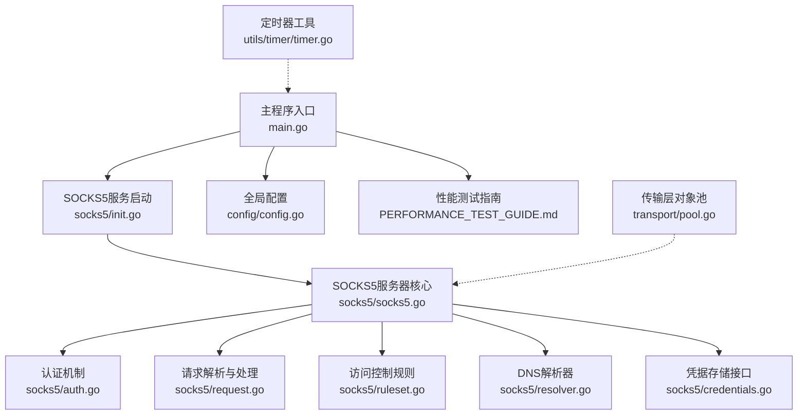
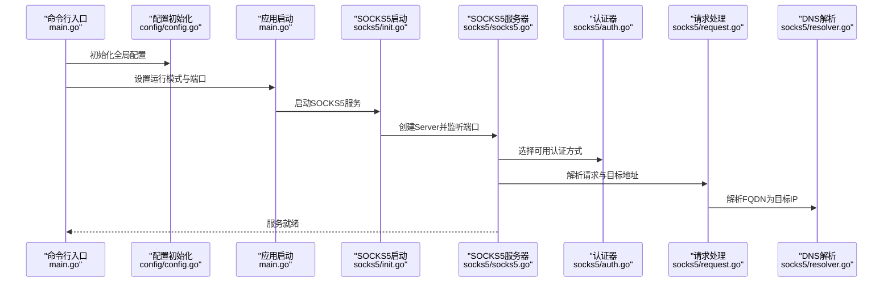
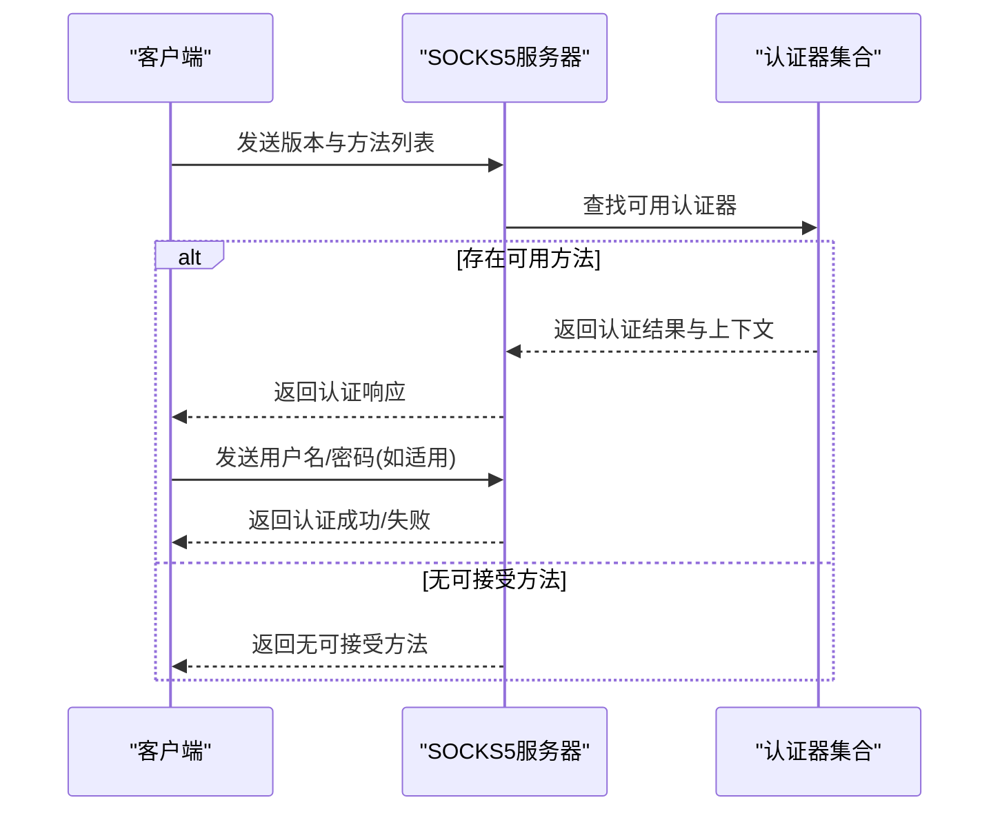
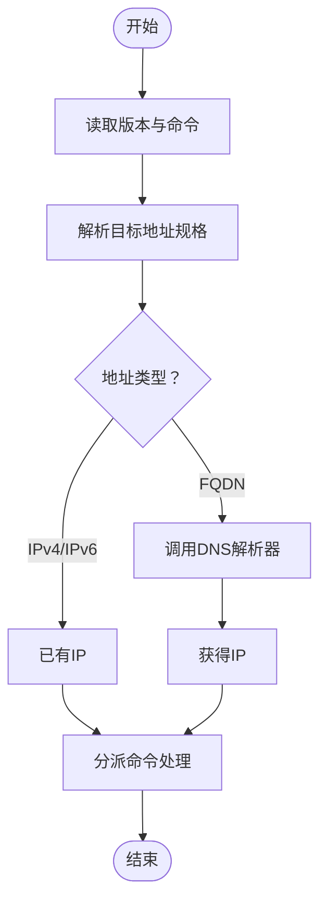
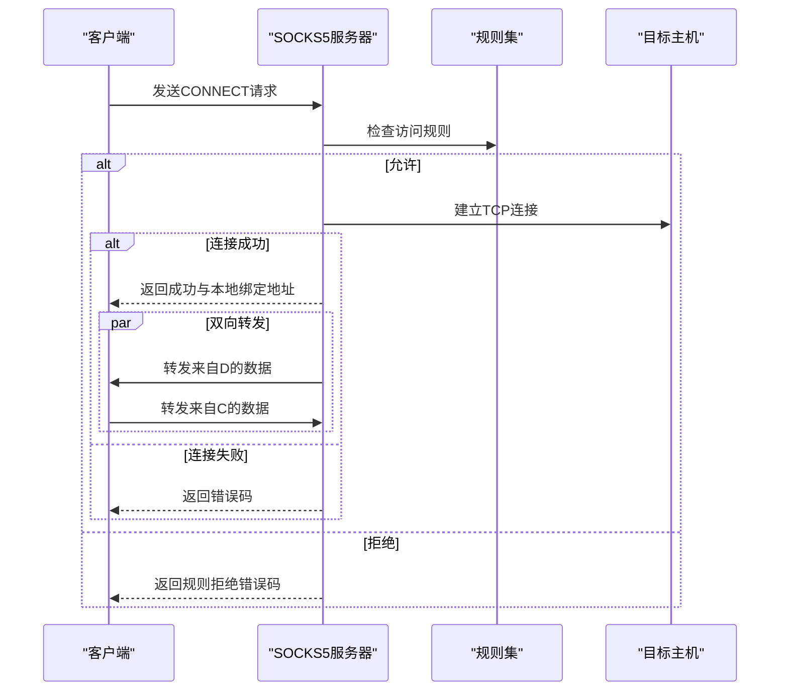
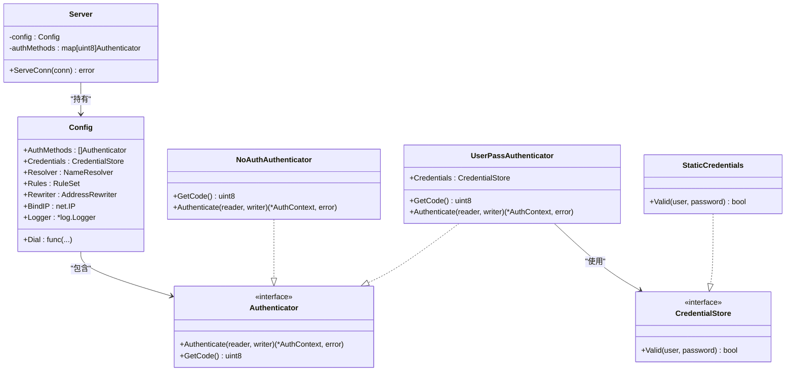
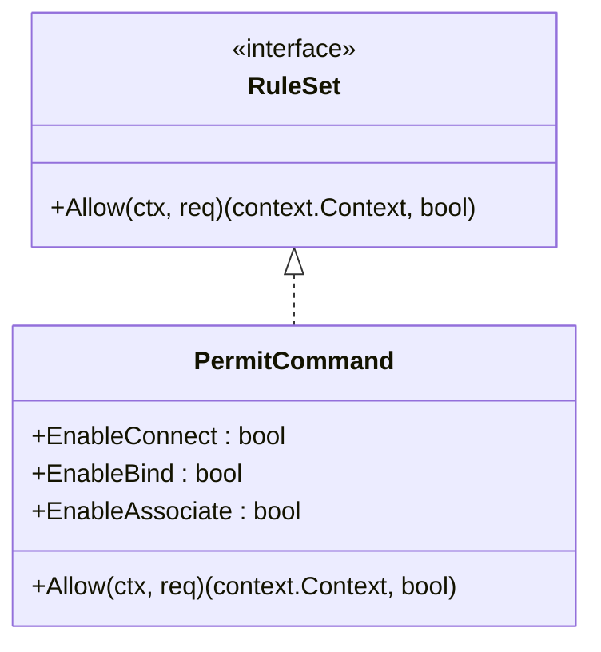
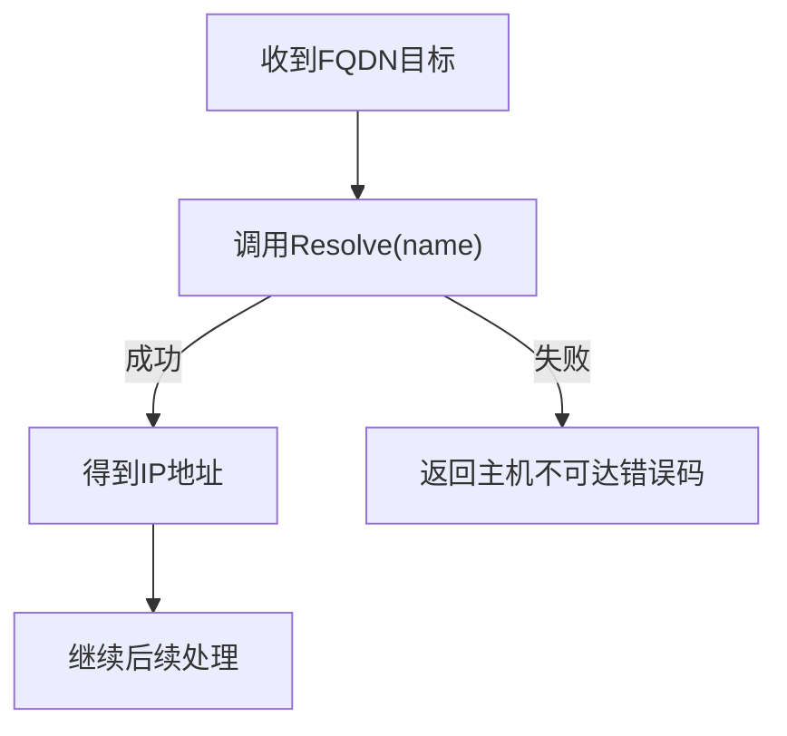
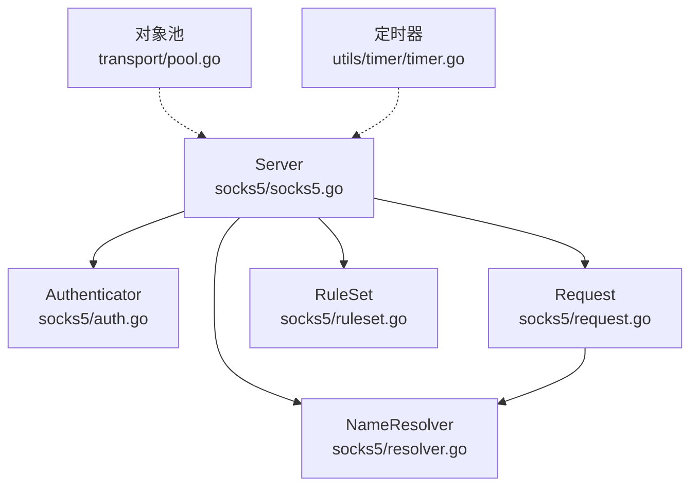

# SOCKS5代理服务

<cite>
**本文档引用的文件**
- [main.go](file://main.go)
- [config.go](file://config/config.go)
- [socks5.go](file://socks5/socks5.go)
- [auth.go](file://socks5/auth.go)
- [request.go](file://socks5/request.go)
- [ruleset.go](file://socks5/ruleset.go)
- [resolver.go](file://socks5/resolver.go)
- [credentials.go](file://socks5/credentials.go)
- [init.go](file://socks5/init.go)
- [README.md](file://README.md)
- [PERFORMANCE_TEST_GUIDE.md](file://PERFORMANCE_TEST_GUIDE.md)
- [pool.go](file://transport/pool.go)
- [timer.go](file://utils/timer/timer.go)
</cite>

## 目录
1. [简介](#简介)
2. [项目结构](#项目结构)
3. [核心组件](#核心组件)
4. [架构总览](#架构总览)
5. [详细组件分析](#详细组件分析)
6. [依赖关系分析](#依赖关系分析)
7. [性能考虑](#性能考虑)
8. [故障排除指南](#故障排除指南)
9. [结论](#结论)
10. [附录](#附录)

## 简介
本文件面向SOCKS5代理服务的技术文档，围绕代码库中的实现进行系统化梳理与说明。内容涵盖协议握手流程、认证机制、请求处理与数据转发、访问控制规则、DNS解析策略、配置项说明、性能优化与监控方法，以及常见使用场景与故障排除建议。文档力求以循序渐进的方式呈现，既适合初学者快速上手，也便于有经验的工程师深入理解实现细节。

## 项目结构
该仓库采用按功能模块划分的组织方式，其中与SOCKS5相关的核心代码集中在socks5目录，入口程序位于根目录的main.go，配置管理位于config目录，性能优化与监控位于独立文件中。

图表来源
- [main.go](file://main.go#L70-L103)
- [init.go](file://socks5/init.go#L5-L22)
- [socks5.go](file://socks5/socks5.go#L109-L169)
- [auth.go](file://socks5/auth.go#L33-L130)
- [request.go](file://socks5/request.go#L118-L156)
- [ruleset.go](file://socks5/ruleset.go#L7-L41)
- [resolver.go](file://socks5/resolver.go#L9-L23)
- [credentials.go](file://socks5/credentials.go#L3-L17)
- [config.go](file://config/config.go#L3-L23)
- [pool.go](file://transport/pool.go#L10-L50)
- [timer.go](file://utils/timer/timer.go#L9-L54)

章节来源
- [main.go](file://main.go#L70-L103)
- [config.go](file://config/config.go#L3-L23)

## 核心组件
- 服务器配置与实例化：负责初始化认证、解析器、规则集等组件，并对外提供监听与服务方法。
- 认证子系统：支持“无认证”和“用户名/密码认证”，并可扩展自定义认证器。
- 请求处理管线：完成版本校验、地址解析、规则检查、目标连接与双向数据转发。
- 规则集接口：提供统一的访问控制抽象，默认允许所有命令或禁止所有命令。
- DNS解析器：默认使用系统DNS解析器，支持自定义实现。
- 凭据存储：提供静态凭据映射接口，用于用户名/密码认证。

章节来源
- [socks5.go](file://socks5/socks5.go#L17-L51)
- [auth.go](file://socks5/auth.go#L33-L130)
- [request.go](file://socks5/request.go#L67-L82)
- [ruleset.go](file://socks5/ruleset.go#L7-L41)
- [resolver.go](file://socks5/resolver.go#L9-L23)
- [credentials.go](file://socks5/credentials.go#L3-L17)

## 架构总览
下图展示了从进程启动到SOCKS5服务运行的关键路径，以及各模块之间的交互关系。

图表来源
- [main.go](file://main.go#L75-L102)
- [config.go](file://config/config.go#L17-L23)
- [init.go](file://socks5/init.go#L5-L22)
- [socks5.go](file://socks5/socks5.go#L109-L169)
- [auth.go](file://socks5/auth.go#L112-L130)
- [request.go](file://socks5/request.go#L118-L156)
- [resolver.go](file://socks5/resolver.go#L17-L23)

## 详细组件分析

### 握手与认证流程
- 客户端发送版本字节与支持的认证方法列表。
- 服务器根据已注册的认证器选择一种可用方法，若无可接受方法则返回“无可接受方法”。
- 若选择“无认证”，直接返回成功；若选择“用户名/密码认证”，服务器要求客户端发送用户名与密码，校验通过后返回成功并携带上下文信息。
- 认证成功后进入请求阶段。

图表来源
- [socks5.go](file://socks5/socks5.go#L121-L145)
- [auth.go](file://socks5/auth.go#L112-L137)
- [auth.go](file://socks5/auth.go#L60-L110)

章节来源
- [socks5.go](file://socks5/socks5.go#L121-L145)
- [auth.go](file://socks5/auth.go#L112-L137)
- [auth.go](file://socks5/auth.go#L60-L110)

### 请求解析与地址类型处理
- 读取命令版本、命令类型与目标地址规格。
- 支持IPv4、IPv6与FQDN三种地址类型；FQDN需经DNS解析为IP后再进行后续处理。
- 根据命令类型分派至CONNECT/BIND/ASSOCIATE处理逻辑。

图表来源
- [request.go](file://socks5/request.go#L89-L116)
- [request.go](file://socks5/request.go#L254-L304)
- [resolver.go](file://socks5/resolver.go#L17-L23)

章节来源
- [request.go](file://socks5/request.go#L89-L116)
- [request.go](file://socks5/request.go#L254-L304)
- [resolver.go](file://socks5/resolver.go#L17-L23)

### 数据转发与错误码
- CONNECT命令建立到目标主机的TCP连接，成功后向客户端发送本地绑定地址，随后在客户端与目标之间进行双向数据复制。
- 根据连接状态与错误类型返回相应的SOCKS5错误码（如网络不可达、主机不可达、连接被拒绝等）。

图表来源
- [request.go](file://socks5/request.go#L158-L214)
- [ruleset.go](file://socks5/ruleset.go#L30-L41)

章节来源
- [request.go](file://socks5/request.go#L158-L214)
- [ruleset.go](file://socks5/ruleset.go#L30-L41)

### 认证机制详解
- 无认证：最简模式，适用于内网或受信任环境。
- 用户名/密码认证：通过UserPassAuthenticator实现，使用CredentialStore接口校验用户凭据。
- 扩展认证：可通过实现Authenticator接口添加新的认证方式，例如基于令牌或证书的认证。

图表来源
- [socks5.go](file://socks5/socks5.go#L17-L51)
- [auth.go](file://socks5/auth.go#L33-L110)
- [credentials.go](file://socks5/credentials.go#L3-L17)

章节来源
- [auth.go](file://socks5/auth.go#L33-L110)
- [credentials.go](file://socks5/credentials.go#L3-L17)

### 访问控制规则系统
- RuleSet接口提供Allow(ctx, req)统一判定方法，返回(ctx, bool)。
- 默认实现PermitAll与PermitNone分别允许/禁止所有命令。
- 可通过自定义实现对不同命令（CONNECT/BIND/ASSOCIATE）进行细粒度控制。

图表来源
- [ruleset.go](file://socks5/ruleset.go#L7-L41)

章节来源
- [ruleset.go](file://socks5/ruleset.go#L7-L41)

### DNS解析机制与策略
- NameResolver接口定义Resolve(ctx, name)方法，DNSResolver默认使用系统DNS解析。
- 当请求的目标为FQDN时，先解析为IP再执行后续流程；解析失败将返回主机不可达错误码。

图表来源
- [resolver.go](file://socks5/resolver.go#L9-L23)
- [request.go](file://socks5/request.go#L122-L134)

章节来源
- [resolver.go](file://socks5/resolver.go#L9-L23)
- [request.go](file://socks5/request.go#L122-L134)

### 配置选项与运行参数
- SOCKS5端口：通过命令行参数指定，默认值见帮助信息。
- 日志级别：支持设置日志等级。
- 仅代理模式：启用后仅启动代理服务。
- 其他通用配置：密钥、远端地址、监听地址、MTU、传输线程数等（与SOCKS5服务同属应用配置范畴）。

章节来源
- [main.go](file://main.go#L61-L65)
- [README.md](file://README.md#L81-L87)

## 依赖关系分析
- 服务器核心依赖认证器、请求解析器、规则集与DNS解析器；这些组件均可替换为自定义实现。
- 传输层通过对象池减少GC压力，间接提升整体性能。
- 定时器工具提供后台任务调度能力，可用于周期性维护或统计。

图表来源
- [socks5.go](file://socks5/socks5.go#L17-L51)
- [auth.go](file://socks5/auth.go#L33-L130)
- [request.go](file://socks5/request.go#L118-L156)
- [ruleset.go](file://socks5/ruleset.go#L7-L41)
- [resolver.go](file://socks5/resolver.go#L9-L23)
- [pool.go](file://transport/pool.go#L10-L50)
- [timer.go](file://utils/timer/timer.go#L9-L54)

章节来源
- [socks5.go](file://socks5/socks5.go#L17-L51)
- [pool.go](file://transport/pool.go#L10-L50)
- [timer.go](file://utils/timer/timer.go#L9-L54)

## 性能考虑
- 对象池复用：传输层使用sync.Pool缓存nonce、缓冲区、消息体与读缓冲，降低频繁分配带来的GC开销。
- 并发模型：每个连接采用独立协程进行双向转发，简单高效；可根据负载调整运行环境的GOMAXPROCS。
- 监控与分析：内置statsviz与pprof端点，便于CPU、内存、Goroutine等维度的性能分析。
- 压力测试：提供iperf3、ping等测试场景与自动化脚本，支持吞吐量、延迟与稳定性评估。

章节来源
- [pool.go](file://transport/pool.go#L10-L50)
- [PERFORMANCE_TEST_GUIDE.md](file://PERFORMANCE_TEST_GUIDE.md#L17-L24)
- [PERFORMANCE_TEST_GUIDE.md](file://PERFORMANCE_TEST_GUIDE.md#L51-L83)
- [PERFORMANCE_TEST_GUIDE.md](file://PERFORMANCE_TEST_GUIDE.md#L286-L323)

## 故障排除指南
- 认证失败：确认客户端支持的认证方法与服务器配置一致；检查用户名/密码是否正确。
- 规则拒绝：检查RuleSet实现，确保允许相应命令；必要时切换至PermitAll进行定位。
- DNS解析失败：确认网络可达与DNS配置；尝试更换解析器或使用直连IP。
- 连接被拒绝/不可达：检查目标主机状态与防火墙策略；关注错误码映射。
- 性能异常：使用pprof与statsviz采集数据，结合测试脚本定位瓶颈。

章节来源
- [auth.go](file://socks5/auth.go#L112-L137)
- [ruleset.go](file://socks5/ruleset.go#L30-L41)
- [resolver.go](file://socks5/resolver.go#L17-L23)
- [request.go](file://socks5/request.go#L178-L190)
- [PERFORMANCE_TEST_GUIDE.md](file://PERFORMANCE_TEST_GUIDE.md#L286-L323)

## 结论
本SOCKS5代理服务以清晰的模块化设计实现了标准协议的握手、认证、请求处理与数据转发，并提供了可插拔的认证、解析与规则系统。配合完善的性能监控与测试指南，能够在多种场景下稳定运行并持续优化。对于需要更严格访问控制或特定认证方式的用户，可基于现有接口进行扩展。

## 附录

### 常见使用场景与配置示例
- 仅启用代理服务：通过仅代理模式启动，指定SOCKS5端口。
- 服务器/客户端模式：根据部署角色选择相应参数，配置密钥与网络地址。
- PAC自动代理：客户端可使用HTTP文件服务器提供的PAC文件进行自动代理配置。

章节来源
- [main.go](file://main.go#L88-L99)
- [README.md](file://README.md#L13-L26)
- [README.md](file://README.md#L81-L87)