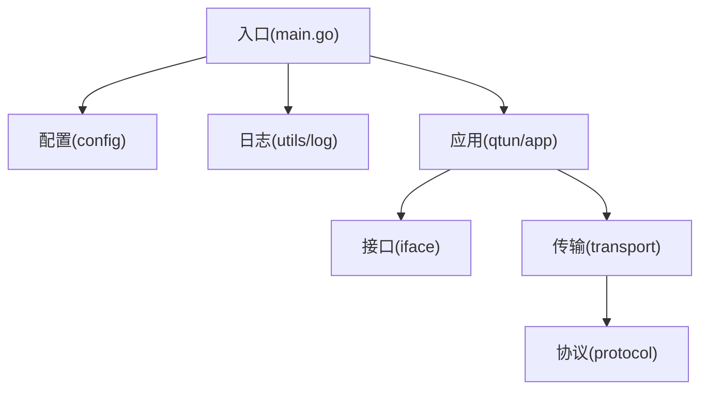
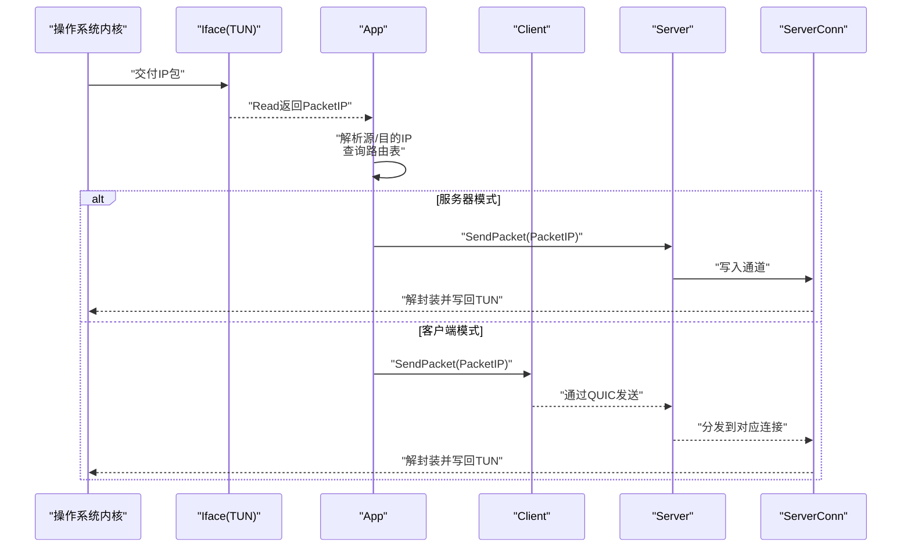
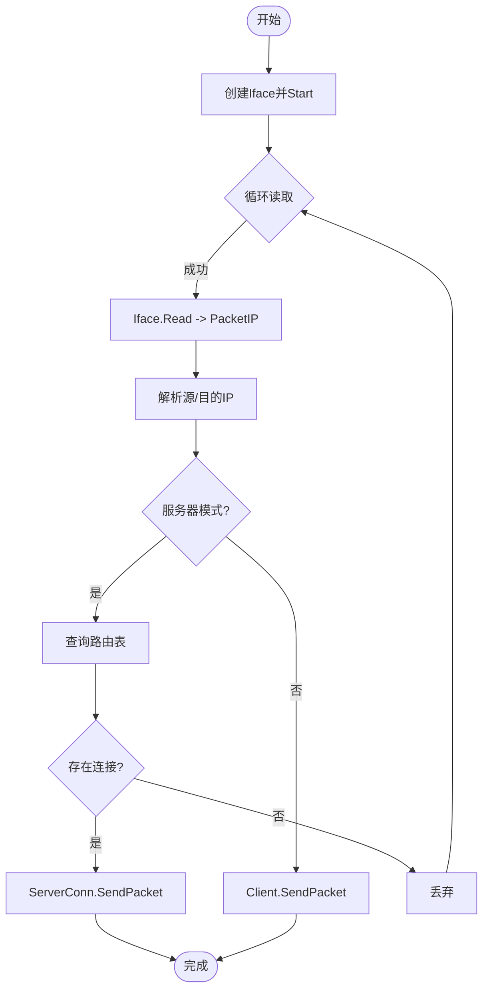
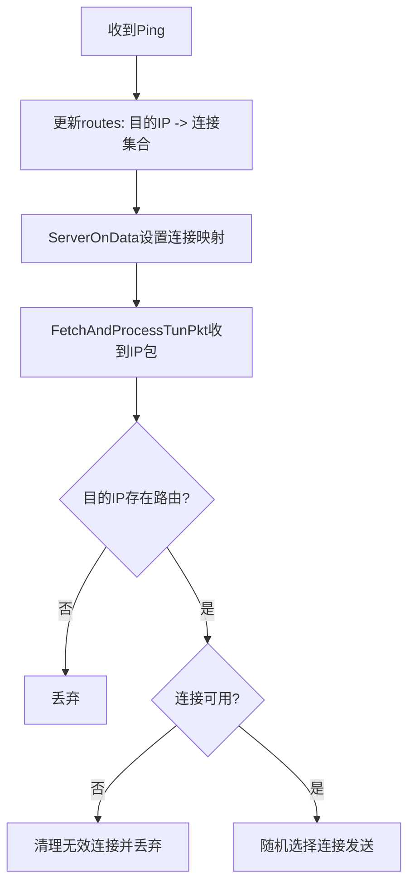
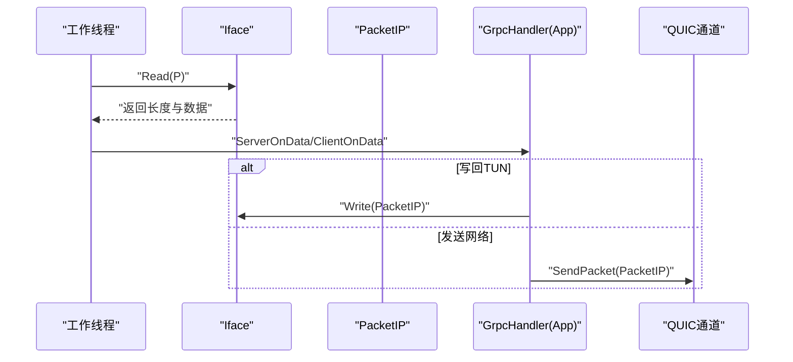
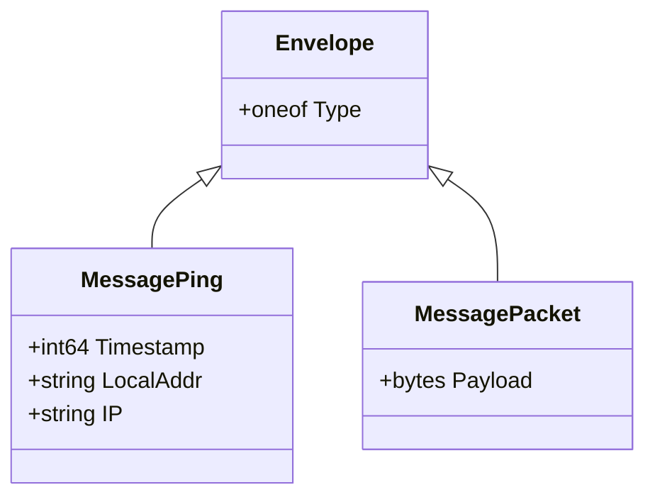
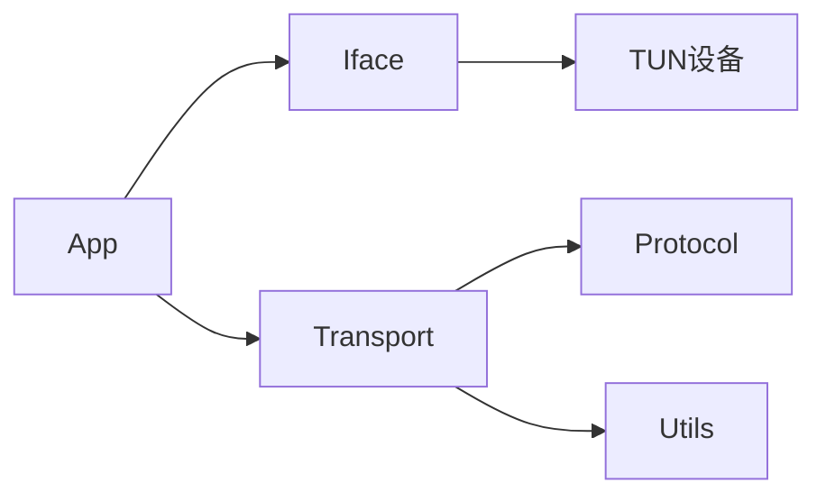

# IP包处理流程

<cite>
**本文引用的文件**
- [main.go](file://main.go)
- [config/config.go](file://config/config.go)
- [utils/log/log.go](file://utils/log/log.go)
- [iface/iface.go](file://iface/iface.go)
- [iface/packet_ip.go](file://iface/packet_ip.go)
- [qtun/app.go](file://qtun/app.go)
- [transport/grpc_handler.go](file://transport/grpc_handler.go)
- [transport/client.go](file://transport/client.go)
- [transport/server.go](file://transport/server.go)
- [transport/server_conn.go](file://transport/server_conn.go)
- [transport/pool.go](file://transport/pool.go)
- [protocol/protocol.proto](file://protocol/protocol.proto)
- [README.md](file://README.md)
</cite>

## 目录
1. [简介](#简介)
2. [项目结构](#项目结构)
3. [核心组件](#核心组件)
4. [架构总览](#架构总览)
5. [详细组件分析](#详细组件分析)
6. [依赖关系分析](#依赖关系分析)
7. [性能考量与优化](#性能考量与优化)
8. [故障排查指南](#故障排查指南)
9. [结论](#结论)
10. [附录](#附录)

## 简介
本文件围绕IP包在qtun中的完整处理流程进行系统化技术说明，覆盖从TUN接口读取原始IP包、解析与路由决策、通过QUIC通道封装传输、到目标端解封装并写回TUN的全过程。重点阐述PacketIP类型的设计与使用、对象池与缓冲区管理策略、阻塞/非阻塞读写的控制方式、以及性能优化与调试监控方法。

## 项目结构
- 入口与运行时配置：main.go负责命令行参数解析、日志初始化、应用启动；config模块提供全局配置；utils/log提供日志级别控制。
- 接口层：iface包封装TUN设备的创建、配置、读写，以及PacketIP类型与对象池。
- 应用层：qtun/app.go协调TUN读取、路由表维护、客户端/服务端传输交互。
- 传输层：transport包基于QUIC实现客户端与服务端，包含连接管理、加解密、消息编解码、对象池复用等。
- 协议层：protocol.proto定义Envelope/Packet/Ping消息结构，用于跨网络传输的统一载体。



图表来源
- [main.go](file://main.go#L1-L136)
- [config/config.go](file://config/config.go#L1-L24)
- [utils/log/log.go](file://utils/log/log.go#L1-L26)
- [qtun/app.go](file://qtun/app.go#L1-L271)
- [iface/iface.go](file://iface/iface.go#L1-L105)
- [transport/client.go](file://transport/client.go#L1-L223)
- [transport/server.go](file://transport/server.go#L1-L219)
- [protocol/protocol.proto](file://protocol/protocol.proto#L1-L22)

章节来源
- [main.go](file://main.go#L1-L136)
- [config/config.go](file://config/config.go#L1-L24)
- [utils/log/log.go](file://utils/log/log.go#L1-L26)

## 核心组件
- PacketIP：基于字节切片的IP包抽象，提供源/目的IP快速访问，并配合对象池减少分配。
- Iface：封装TUN接口创建、配置（IP、掩码、MTU）、系统路由添加，以及阻塞式Read/Write。
- App：应用主控，负责启动TUN、创建工作线程、读取IP包、路由决策、调用传输层发送或写回TUN。
- Client/Server：客户端/服务端传输实现，基于QUIC，负责连接建立、消息编解码、对象池复用、写通道队列。
- GrpcHandler：传输回调接口，App分别作为客户端/服务端的处理器。
- 对象池：PacketIP、Envelope、MessagePing、MessagePacket、Nonce、Buffer、ReadBuf等，降低GC压力。

章节来源
- [iface/packet_ip.go](file://iface/packet_ip.go#L1-L47)
- [iface/iface.go](file://iface/iface.go#L1-L105)
- [qtun/app.go](file://qtun/app.go#L1-L271)
- [transport/grpc_handler.go](file://transport/grpc_handler.go#L1-L7)
- [transport/pool.go](file://transport/pool.go#L1-L108)

## 架构总览
下图展示从TUN读取到网络发送、再到目标端写回TUN的关键路径与组件交互。



图表来源
- [qtun/app.go](file://qtun/app.go#L99-L167)
- [iface/iface.go](file://iface/iface.go#L98-L104)
- [transport/client.go](file://transport/client.go#L208-L222)
- [transport/server.go](file://transport/server.go#L1-L219)
- [transport/server_conn.go](file://transport/server_conn.go#L235-L249)

## 详细组件分析

### PacketIP类型与使用
- 类型定义：PacketIP为[]byte别名，直接复用底层缓冲区，避免额外拷贝。
- 对象池：packetIPPool按需分配默认大小（2048），容量不足时扩容，释放时仅对特定范围容量进行回收，减少碎片。
- 字段访问：通过固定偏移快速提取源/目的IP，满足高性能场景下的零拷贝访问。
- 生命周期：由App工作线程申请，经传输层Marshal后交还对象池，避免频繁分配。

```mermaid
classDiagram
class PacketIP {
+"[]byte 别名"
+GetSourceIP() net.IP
+GetDestinationIP() net.IP
}
class Pool {
+"sync.Pool 缓冲区池"
+New() interface{}
}
PacketIP --> Pool : "对象池复用"
```

图表来源
- [iface/packet_ip.go](file://iface/packet_ip.go#L8-L47)

章节来源
- [iface/packet_ip.go](file://iface/packet_ip.go#L1-L47)

### TUN接口与读写机制
- 创建与配置：New/Start创建TUN接口，设置IP/CIDR、掩码、MTU，并在macOS上添加系统路由。
- 阻塞读写：Iface.Read/Iface.Write基于底层water库，采用阻塞式IO；缓冲区来自PacketIP对象池。
- 工作线程：App根据CPU核数动态确定工作线程数量（2倍CPU，最小4，最大32），每个线程循环读取并处理。



图表来源
- [iface/iface.go](file://iface/iface.go#L31-L104)
- [qtun/app.go](file://qtun/app.go#L72-L167)

章节来源
- [iface/iface.go](file://iface/iface.go#L1-L105)
- [qtun/app.go](file://qtun/app.go#L72-L167)

### 路由决策与转发
- 路由表：App维护routes映射（目的IP -> 连接集合），通过Server端收到的Ping消息更新。
- 决策逻辑：服务器侧在RWMutex保护下读取路由，若无连接或连接已关闭则清理并丢弃；否则随机选择一个可用连接发送。
- 清理任务：定时器周期性扫描并移除失效连接，保持路由表健康。



图表来源
- [qtun/app.go](file://qtun/app.go#L169-L207)
- [qtun/app.go](file://qtun/app.go#L51-L70)

章节来源
- [qtun/app.go](file://qtun/app.go#L51-L70)
- [qtun/app.go](file://qtun/app.go#L169-L207)

### 数据包读取与写入操作机制
- 读取：Iface.Read阻塞等待内核交付IP包；App工作线程循环读取，避免忙轮询。
- 写入：服务器侧收到网络数据后，App将其转换为PacketIP并写回TUN；客户端侧直接通过ClientConn写入QUIC流。
- 缓冲区管理：PacketIP来自对象池；ServerConn内部使用bufio Reader/Writer与自定义缓冲，结合对象池Nonce/Buffer/Envelope等，降低分配与拷贝。



图表来源
- [iface/iface.go](file://iface/iface.go#L98-L104)
- [qtun/app.go](file://qtun/app.go#L169-L248)
- [transport/client.go](file://transport/client.go#L208-L222)
- [transport/server_conn.go](file://transport/server_conn.go#L235-L249)

章节来源
- [iface/iface.go](file://iface/iface.go#L98-L104)
- [qtun/app.go](file://qtun/app.go#L169-L248)
- [transport/client.go](file://transport/client.go#L208-L222)
- [transport/server_conn.go](file://transport/server_conn.go#L235-L249)

### 加解密与消息编解码
- QUIC连接：Server监听并接受新连接，建立QUIC会话；Client按配置并发连接多个远端。
- 消息格式：Envelope包含Ping/Packet两类消息；Packet承载原始IP包payload。
- 加解密：ServerConn在读取时验证密钥匹配，写入时可选AES-GCM加密，Nonce来自对象池。
- 对象池：Envelope、MessagePing、MessagePacket均来自各自对象池，Marshal后归还，降低GC压力。



图表来源
- [protocol/protocol.proto](file://protocol/protocol.proto#L5-L22)

章节来源
- [protocol/protocol.proto](file://protocol/protocol.proto#L1-L22)
- [transport/server_conn.go](file://transport/server_conn.go#L117-L165)
- [transport/pool.go](file://transport/pool.go#L24-L42)

### 非阻塞模式说明
- 当前实现采用阻塞式I/O：Iface.Read/Iface.Write基于底层阻塞接口；ServerConn内部使用bufio Reader/Writer，未显式设置非阻塞。
- 若需非阻塞，可在上层引入select/超时或切换到异步事件驱动模型（例如epoll/kqueue），但当前代码未实现该路径。

章节来源
- [iface/iface.go](file://iface/iface.go#L98-L104)
- [transport/server_conn.go](file://transport/server_conn.go#L89-L90)

## 依赖关系分析
- 组件耦合：App依赖iface与transport；transport依赖protocol与utils；iface与protocol相互独立。
- 并发与锁：App使用RWMutex保护路由表；Server使用sync.Map提升并发读写性能；Client使用原子序号选择连接。
- 循环依赖：未发现循环导入；各模块职责清晰。



图表来源
- [qtun/app.go](file://qtun/app.go#L1-L271)
- [iface/iface.go](file://iface/iface.go#L1-L105)
- [transport/client.go](file://transport/client.go#L1-L223)
- [transport/server.go](file://transport/server.go#L1-L219)
- [protocol/protocol.proto](file://protocol/protocol.proto#L1-L22)

章节来源
- [qtun/app.go](file://qtun/app.go#L1-L271)
- [transport/server.go](file://transport/server.go#L1-L219)

## 性能考量与优化
- 对象池复用
  - PacketIP：按需扩容并限制回收范围，避免大对象过度增长。
  - 传输层：Envelope、MessagePing、MessagePacket、Nonce、Buffer、ReadBuf均来自对象池，Marshal后立即归还。
- 并发与负载均衡
  - App工作线程数=2×CPU核数（4~32上限）；Client按序列号轮询连接。
  - Server使用sync.Map存储连接映射，减少锁竞争。
- 缓冲区与窗口
  - Server监听配置较大接收/连接窗口，提高吞吐。
  - ServerConn内部Reader缓冲区扩大至64KB，减少系统调用次数。
- 日志与可观测性
  - 使用zerolog按级别输出，便于生产环境降噪与定位问题。
- 建议优化点
  - 引入ring buffer或异步事件驱动以支持非阻塞读写。
  - 在高并发场景下考虑连接池与批量发送策略。

章节来源
- [iface/packet_ip.go](file://iface/packet_ip.go#L10-L39)
- [transport/pool.go](file://transport/pool.go#L10-L108)
- [qtun/app.go](file://qtun/app.go#L79-L97)
- [transport/server.go](file://transport/server.go#L97-L103)
- [transport/server_conn.go](file://transport/server_conn.go#L89-L89)
- [utils/log/log.go](file://utils/log/log.go#L10-L25)

## 故障排查指南
- 启动失败
  - TUN创建/ifconfig执行错误：检查权限与平台差异；macOS需添加系统路由。
  - 参考：[iface/iface.go](file://iface/iface.go#L31-L74)
- 无法收发
  - 未建立有效连接：Client启动后等待连接就绪，确认远端可达与密钥一致。
  - 服务器端连接映射异常：检查ServerOnData是否正确更新routes；确认ServerConn未被清理。
  - 参考：[transport/client.go](file://transport/client.go#L41-L83)，[qtun/app.go](file://qtun/app.go#L169-L207)，[transport/server.go](file://transport/server.go#L192-L210)
- 包丢失
  - 无路由或连接不可用：App在服务器侧会丢弃并清理无效连接；检查目的IP与路由表。
  - 参考：[qtun/app.go](file://qtun/app.go#L114-L161)
- 性能问题
  - GC压力：确认对象池使用正常；避免在热路径频繁分配。
  - I/O瓶颈：适当增大工作线程数与Server窗口；检查日志级别。
  - 参考：[transport/pool.go](file://transport/pool.go#L10-L108)，[transport/server.go](file://transport/server.go#L97-L103)
- 调试建议
  - 提升日志级别至debug，观察每条路径的进入/退出与关键变量。
  - 使用pprof/sysGui进行性能剖析（已在main中预留入口）。
  - 参考：[main.go](file://main.go#L118-L129)，[utils/log/log.go](file://utils/log/log.go#L10-L25)

章节来源
- [iface/iface.go](file://iface/iface.go#L31-L74)
- [transport/client.go](file://transport/client.go#L41-L83)
- [qtun/app.go](file://qtun/app.go#L114-L161)
- [transport/server.go](file://transport/server.go#L192-L210)
- [transport/pool.go](file://transport/pool.go#L10-L108)
- [main.go](file://main.go#L118-L129)
- [utils/log/log.go](file://utils/log/log.go#L10-L25)

## 结论
本项目以简洁高效的Go实现完成了从TUN到网络再回到TUN的完整IP包处理链路。通过对象池、并发工作线程、sync.Map与QUIC窗口优化，系统在保证稳定性的同时具备良好的吞吐能力。建议后续引入非阻塞I/O与更细粒度的监控埋点，进一步提升可扩展性与可观测性。

## 附录
- 快速启动参考
  - 服务器：sudo ./qtun qt --key "hahaha" --listen "0.0.0.0:8080" --ip "10.4.4.2/24" --server_mode
  - 客户端：sudo ./qtun qt --key "hahaha" --remote_addrs "8.8.8.80:8080" --ip "10.4.4.3/24"
- 关键实现路径
  - TUN读取与写回：[iface/iface.go](file://iface/iface.go#L98-L104)
  - IP包解析与路由：[qtun/app.go](file://qtun/app.go#L99-L167)
  - 传输编解码与加解密：[protocol/protocol.proto](file://protocol/protocol.proto#L1-L22)，[transport/server_conn.go](file://transport/server_conn.go#L117-L165)
  - 对象池与缓冲区：[transport/pool.go](file://transport/pool.go#L10-L108)，[iface/packet_ip.go](file://iface/packet_ip.go#L10-L39)

章节来源
- [README.md](file://README.md#L13-L26)