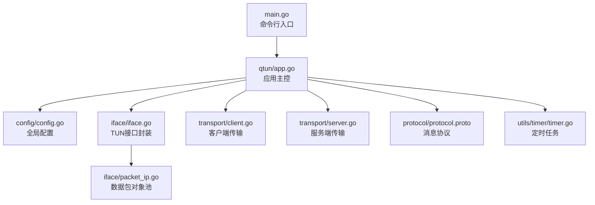
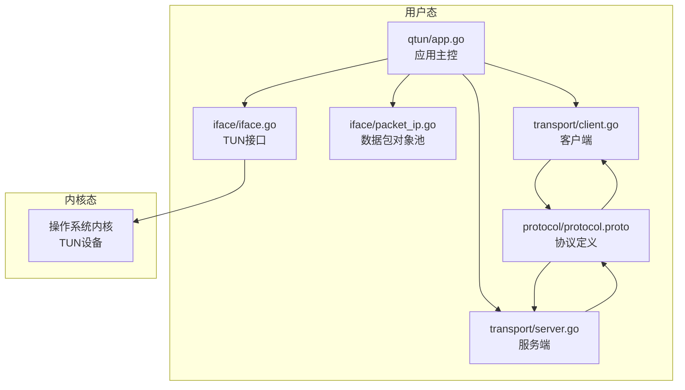
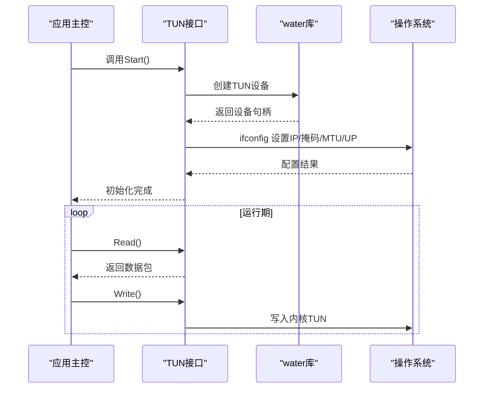
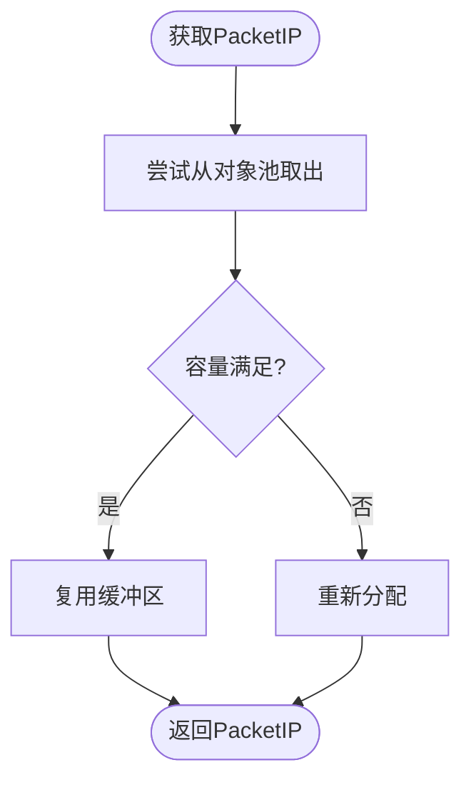
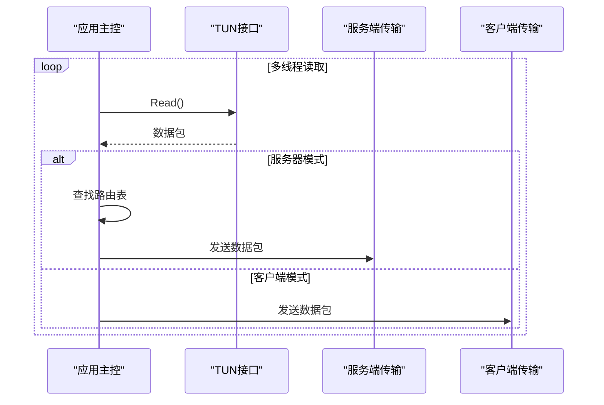
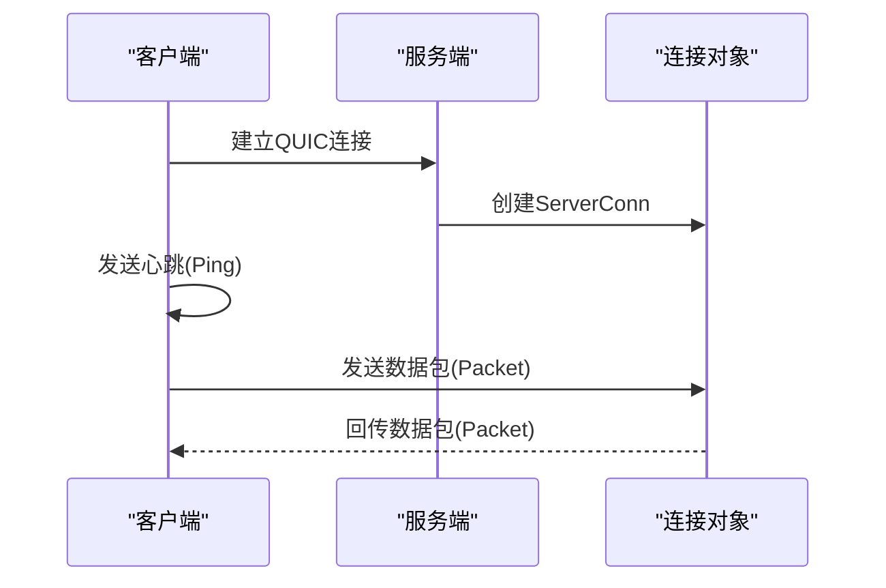
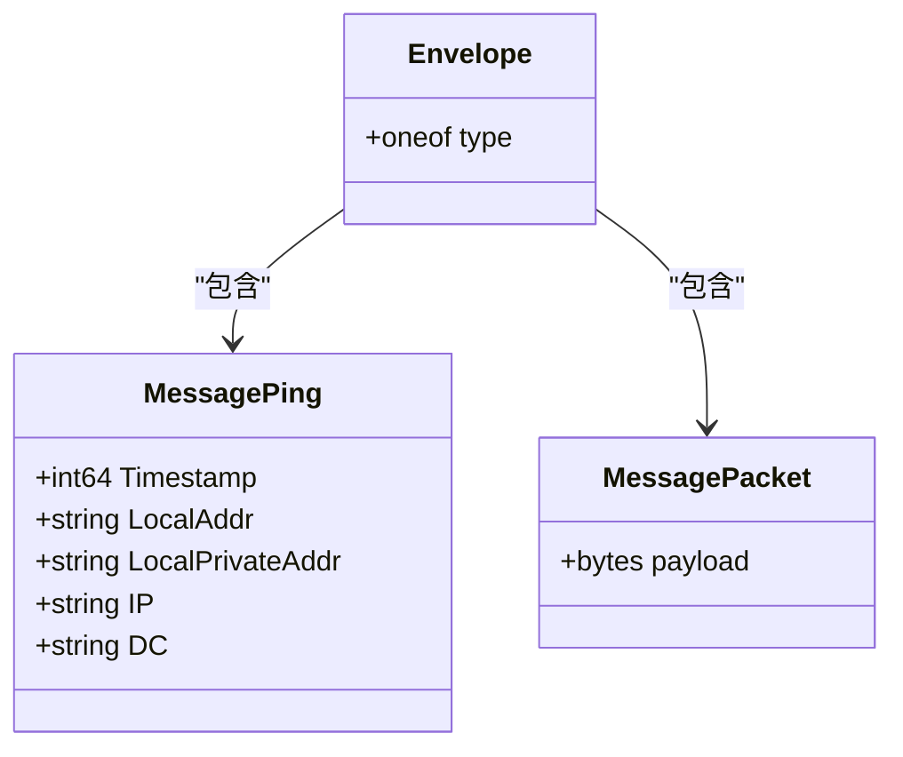
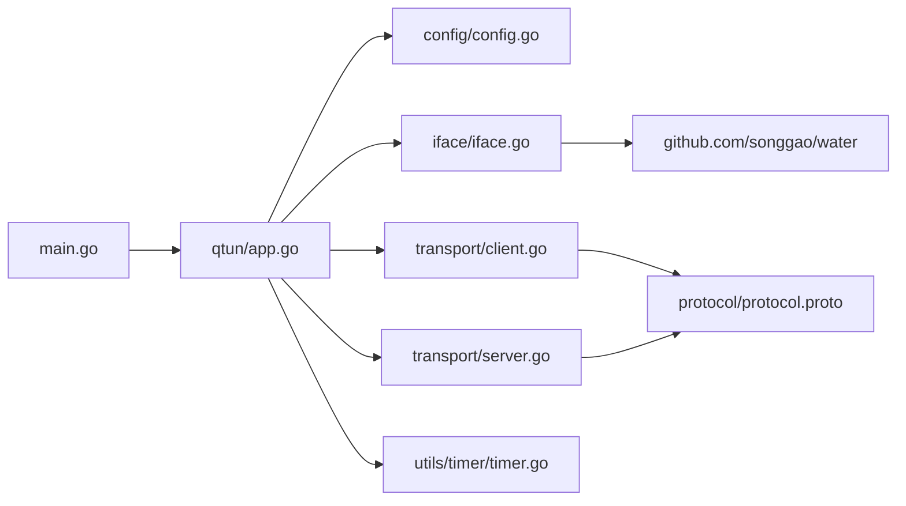

# TUN接口原理

<cite>
**本文引用的文件列表**
- [main.go](file://main.go)
- [README.md](file://README.md)
- [go.mod](file://go.mod)
- [config/config.go](file://config/config.go)
- [iface/iface.go](file://iface/iface.go)
- [iface/packet_ip.go](file://iface/packet_ip.go)
- [qtun/app.go](file://qtun/app.go)
- [transport/client.go](file://transport/client.go)
- [transport/server.go](file://transport/server.go)
- [protocol/protocol.proto](file://protocol/protocol.proto)
- [utils/timer/timer.go](file://utils/timer/timer.go)
</cite>

## 目录
1. [简介](#简介)
2. [项目结构](#项目结构)
3. [核心组件](#核心组件)
4. [架构总览](#架构总览)
5. [详细组件分析](#详细组件分析)
6. [依赖关系分析](#依赖关系分析)
7. [性能考量](#性能考量)
8. [故障排查指南](#故障排查指南)
9. [结论](#结论)
10. [附录](#附录)

## 简介
本文件系统性阐述TUN（虚拟网络接口）的工作原理及其在qtun项目中的实现细节。重点包括：
- TUN与普通网络接口的区别：内核态与用户态交互、数据包处理流程
- water库的使用与跨平台支持机制
- 在VPN场景中的应用与典型工作流
- 接口创建、初始化与配置的完整流程
- 生命周期管理：启动、运行、关闭

## 项目结构
项目采用分层设计，围绕“应用入口—配置—网络接口—传输—协议—工具”组织代码，便于理解TUN接口从创建到数据转发的全链路。

图表来源
- [main.go](file://main.go#L1-L136)
- [qtun/app.go](file://qtun/app.go#L1-L271)
- [config/config.go](file://config/config.go#L1-L24)
- [iface/iface.go](file://iface/iface.go#L1-L105)
- [iface/packet_ip.go](file://iface/packet_ip.go#L1-L47)
- [transport/client.go](file://transport/client.go#L1-L223)
- [transport/server.go](file://transport/server.go#L1-L219)
- [protocol/protocol.proto](file://protocol/protocol.proto#L1-L22)
- [utils/timer/timer.go](file://utils/timer/timer.go#L1-L55)

章节来源
- [main.go](file://main.go#L1-L136)
- [README.md](file://README.md#L1-L99)

## 核心组件
- 应用主控：负责启动TUN接口、调度数据读写、维护路由表、协调传输层收发
- TUN接口封装：基于water库创建TUN设备，执行ifconfig配置与系统路由设置
- 数据包对象池：复用PacketIP以降低GC压力
- 传输层：客户端/服务端分别负责建立连接、发送心跳、转发数据包
- 协议层：Envelope/Ping/Packet消息体定义
- 工具层：定时器用于清理无效路由等后台任务

章节来源
- [qtun/app.go](file://qtun/app.go#L1-L271)
- [iface/iface.go](file://iface/iface.go#L1-L105)
- [iface/packet_ip.go](file://iface/packet_ip.go#L1-L47)
- [transport/client.go](file://transport/client.go#L1-L223)
- [transport/server.go](file://transport/server.go#L1-L219)
- [protocol/protocol.proto](file://protocol/protocol.proto#L1-L22)
- [utils/timer/timer.go](file://utils/timer/timer.go#L1-L55)

## 架构总览
下图展示qtun中TUN接口与传输层的交互关系，以及数据在用户态与内核态之间的流转。

图表来源
- [qtun/app.go](file://qtun/app.go#L1-L271)
- [iface/iface.go](file://iface/iface.go#L1-L105)
- [iface/packet_ip.go](file://iface/packet_ip.go#L1-L47)
- [transport/client.go](file://transport/client.go#L1-L223)
- [transport/server.go](file://transport/server.go#L1-L219)
- [protocol/protocol.proto](file://protocol/protocol.proto#L1-L22)

## 详细组件分析

### TUN接口封装与生命周期
- 设备创建：通过water库以TUN模式创建虚拟网卡，返回设备名
- 配置与激活：解析CIDR地址，调用ifconfig设置IP、掩码、MTU并置为UP；在macOS上额外添加系统路由
- 数据读写：封装Read/Write方法，供应用主控循环读取并转发
- 生命周期：Start负责创建与配置；Read/Write在运行期持续使用；关闭由上层控制（如应用退出）

图表来源
- [iface/iface.go](file://iface/iface.go#L31-L74)
- [qtun/app.go](file://qtun/app.go#L72-L97)

章节来源
- [iface/iface.go](file://iface/iface.go#L1-L105)
- [qtun/app.go](file://qtun/app.go#L72-L97)

### 数据包对象池与内存优化
- 对象池：使用sync.Pool缓存PacketIP，避免频繁分配
- 复用策略：按需扩容或复用，仅在合理范围内回收
- 性能收益：显著降低GC压力，提升高并发下的吞吐

图表来源
- [iface/packet_ip.go](file://iface/packet_ip.go#L10-L39)

章节来源
- [iface/packet_ip.go](file://iface/packet_ip.go#L1-L47)

### 应用主控：数据读取与转发
- 启动阶段：创建TUN接口，动态计算工作线程数（CPU核数×2，范围[4,32]），多线程并发读取TUN数据
- 服务器模式：根据目的IP查找连接，随机选择可用连接发送；若无连接则丢弃
- 客户端模式：直接将数据包发送至远端
- 路由维护：定期清理失效连接，保持路由表健康

图表来源
- [qtun/app.go](file://qtun/app.go#L99-L167)
- [transport/server.go](file://transport/server.go#L175-L210)
- [transport/client.go](file://transport/client.go#L208-L222)

章节来源
- [qtun/app.go](file://qtun/app.go#L72-L167)

### 传输层：客户端与服务端
- 客户端：支持多连接（可配置线程数），启动后发送心跳，随机选择连接发送数据包
- 服务端：基于QUIC监听，接受新连接并启动读写协程；维护双向映射，支持删除失效连接

图表来源
- [transport/client.go](file://transport/client.go#L41-L83)
- [transport/server.go](file://transport/server.go#L112-L148)

章节来源
- [transport/client.go](file://transport/client.go#L1-L223)
- [transport/server.go](file://transport/server.go#L1-L219)

### 协议层：Envelope/Ping/Packet
- Envelope：承载MessagePing与MessagePacket两类消息
- Ping：携带本地地址、时间戳、客户端VIP等信息，用于建立与维护路由
- Packet：承载原始IP数据包payload

图表来源
- [protocol/protocol.proto](file://protocol/protocol.proto#L5-L22)

章节来源
- [protocol/protocol.proto](file://protocol/protocol.proto#L1-L22)

### 跨平台支持与系统路由
- 平台差异：macOS与Linux在ifconfig参数上略有不同；Windows未在当前版本支持
- 路由补充：在macOS上为TUN子网添加系统路由，确保回环流量正确转发

章节来源
- [iface/iface.go](file://iface/iface.go#L50-L71)
- [README.md](file://README.md#L94-L99)

## 依赖关系分析
- 模块耦合：应用主控依赖TUN接口、传输层与配置；TUN接口依赖water库；传输层依赖协议与配置
- 外部依赖：water库提供跨平台TUN设备创建；QUIC提供传输层；protobuf序列化消息
- 循环依赖：未发现循环导入；模块职责清晰

图表来源
- [go.mod](file://go.mod#L1-L29)
- [main.go](file://main.go#L1-L136)
- [qtun/app.go](file://qtun/app.go#L1-L271)
- [iface/iface.go](file://iface/iface.go#L1-L105)
- [transport/client.go](file://transport/client.go#L1-L223)
- [transport/server.go](file://transport/server.go#L1-L219)
- [protocol/protocol.proto](file://protocol/protocol.proto#L1-L22)
- [utils/timer/timer.go](file://utils/timer/timer.go#L1-L55)

章节来源
- [go.mod](file://go.mod#L1-L29)

## 性能考量
- 并发读取：根据CPU核数动态调整TUN数据包处理线程数，上限32，下限4，提升I/O并行度
- 对象池：PacketIP使用对象池减少分配与GC
- 锁优化：服务端使用sync.Map与读写锁，降低热点竞争
- 心跳与清理：定时任务清理无效连接，维持路由表健康
- QUIC参数：服务端配置较大的接收窗口与并发流，提升吞吐

章节来源
- [qtun/app.go](file://qtun/app.go#L79-L96)
- [iface/packet_ip.go](file://iface/packet_ip.go#L10-L39)
- [transport/server.go](file://transport/server.go#L31-L46)
- [utils/timer/timer.go](file://utils/timer/timer.go#L21-L47)

## 故障排查指南
- TUN创建失败：检查权限（需root）、设备类型配置是否为TUN、water库是否正确安装
- ifconfig执行失败：确认系统ifconfig可用、参数格式正确、平台分支逻辑（macOS/Linux）
- 无法建立传输连接：检查服务端监听地址、客户端远端地址、防火墙与网络连通性
- 路由异常：macOS下确认系统路由已添加；服务端定期清理无效连接
- 日志定位：通过日志输出查看错误码与命令输出，辅助定位问题

章节来源
- [iface/iface.go](file://iface/iface.go#L61-L67)
- [qtun/app.go](file://qtun/app.go#L51-L70)
- [transport/client.go](file://transport/client.go#L51-L68)

## 结论
qtun通过water库在用户态高效创建与管理TUN设备，结合多线程读取、对象池与QUIC传输，在保证性能的同时实现了稳定的VPN数据转发能力。其跨平台适配与系统路由补丁确保了在不同操作系统上的可用性。建议在生产环境中关注权限、网络连通性与路由配置，并利用对象池与并发策略获得最佳性能。

## 附录

### TUN与普通网络接口的区别
- 普通接口：由内核驱动，面向物理/虚拟硬件，数据包经驱动栈到达用户态
- TUN接口：纯软件虚拟接口，用户态直接读写数据包，内核仅负责路由与转发

章节来源
- [iface/iface.go](file://iface/iface.go#L36-L43)

### VPN中的TUN角色与场景
- 角色：作为VPN隧道的两端之一，承载加密后的IP数据包
- 场景：透明转发、路由注入、策略路由、多路径负载均衡

章节来源
- [qtun/app.go](file://qtun/app.go#L114-L166)

### 接口创建、初始化与配置流程
- 创建：选择设备类型为TUN，调用water.New
- 初始化：设置IP、掩码、MTU并UP；macOS补充系统路由
- 配置参数：IP/CIDR、MTU、传输线程数、密钥、NoDelay等

章节来源
- [iface/iface.go](file://iface/iface.go#L31-L74)
- [config/config.go](file://config/config.go#L3-L13)
- [qtun/app.go](file://qtun/app.go#L72-L97)

### 生命周期管理
- 启动：应用启动—创建TUN—启动传输—开始读取数据包
- 运行：多线程并发处理—心跳维护—路由更新—数据转发
- 关闭：停止传输—等待协程退出—释放资源

章节来源
- [qtun/app.go](file://qtun/app.go#L37-L49)
- [transport/client.go](file://transport/client.go#L85-L95)