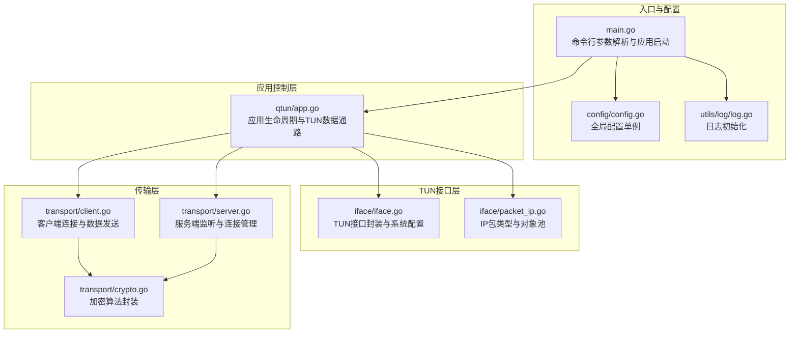
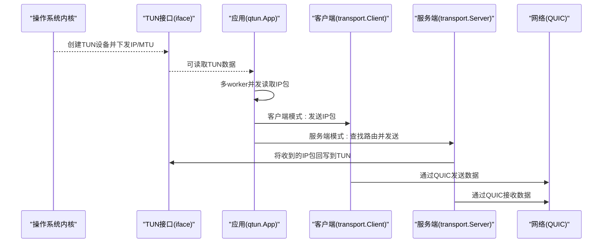
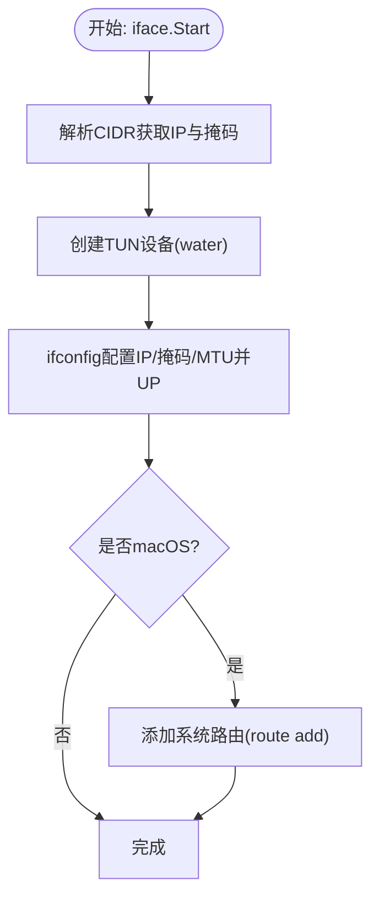
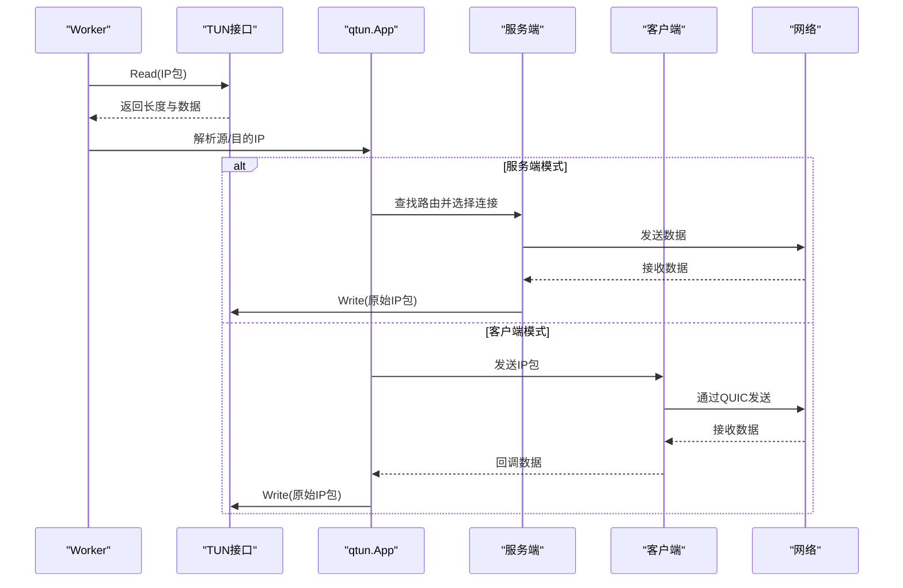
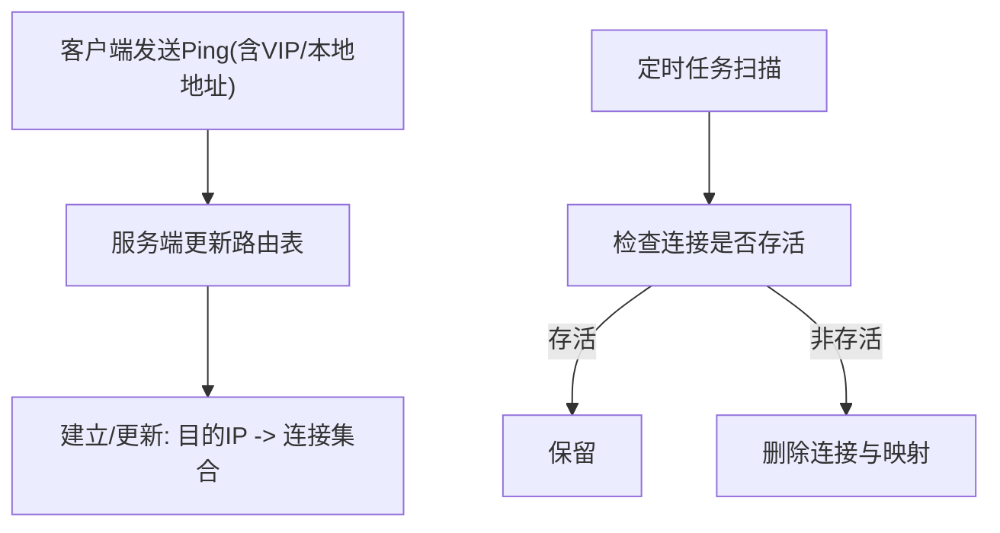
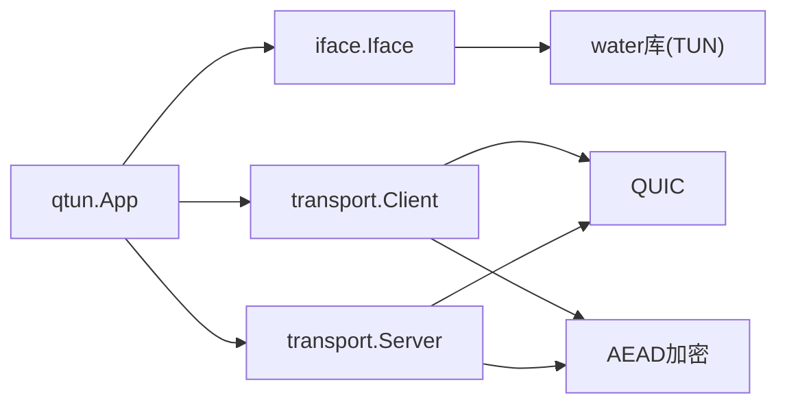

# TUN接口管理

<cite>
**本文引用的文件**
- [main.go](file://main.go)
- [config/config.go](file://config/config.go)
- [iface/iface.go](file://iface/iface.go)
- [iface/packet_ip.go](file://iface/packet_ip.go)
- [qtun/app.go](file://qtun/app.go)
- [transport/client.go](file://transport/client.go)
- [transport/server.go](file://transport/server.go)
- [transport/crypto.go](file://transport/crypto.go)
- [utils/log/log.go](file://utils/log/log.go)
- [README.md](file://README.md)
- [PERFORMANCE_TEST_GUIDE.md](file://PERFORMANCE_TEST_GUIDE.md)
</cite>

## 目录
1. [简介](#简介)
2. [项目结构](#项目结构)
3. [核心组件](#核心组件)
4. [架构总览](#架构总览)
5. [详细组件分析](#详细组件分析)
6. [依赖关系分析](#依赖关系分析)
7. [性能考量](#性能考量)
8. [故障排除指南](#故障排除指南)
9. [结论](#结论)

## 简介
本文件面向TUN接口管理的技术文档，围绕Qtun项目中的TUN接口实现展开，系统性说明以下主题：
- TUN接口工作原理与在Qtun中的实现细节
- IP地址配置、子网掩码设置与路由表管理
- MTU（最大传输单元）配置与优化策略、性能影响与最佳实践
- IP包处理流程：接收、解析、转发与发送
- 跨平台支持差异：Windows、macOS、Linux的特定配置与限制
- 故障排除：权限问题、网络冲突、性能问题的诊断与解决

## 项目结构
Qtun采用模块化设计，TUN接口相关逻辑集中在iface与qtun模块，网络传输层由transport模块负责，配置与入口由config与main模块提供。

图表来源
- [main.go](file://main.go#L1-L136)
- [config/config.go](file://config/config.go#L1-L24)
- [utils/log/log.go](file://utils/log/log.go#L1-L26)
- [iface/iface.go](file://iface/iface.go#L1-L105)
- [iface/packet_ip.go](file://iface/packet_ip.go#L1-L47)
- [qtun/app.go](file://qtun/app.go#L1-L271)
- [transport/client.go](file://transport/client.go#L1-L223)
- [transport/server.go](file://transport/server.go#L1-L219)
- [transport/crypto.go](file://transport/crypto.go#L1-L27)

章节来源
- [main.go](file://main.go#L1-L136)
- [config/config.go](file://config/config.go#L1-L24)
- [utils/log/log.go](file://utils/log/log.go#L1-L26)
- [iface/iface.go](file://iface/iface.go#L1-L105)
- [iface/packet_ip.go](file://iface/packet_ip.go#L1-L47)
- [qtun/app.go](file://qtun/app.go#L1-L271)
- [transport/client.go](file://transport/client.go#L1-L223)
- [transport/server.go](file://transport/server.go#L1-L219)
- [transport/crypto.go](file://transport/crypto.go#L1-L27)

## 核心组件
- 入口与配置
  - main.go：命令行参数解析、配置初始化、日志初始化、应用启动与模式选择（服务端/客户端/仅代理）。
  - config/config.go：全局配置单例，包含密钥、远端地址、监听地址、IP、MTU、线程数、模式等。
  - utils/log/log.go：日志级别初始化与输出格式设置。
- TUN接口层
  - iface/iface.go：封装TUN设备创建、IP与MTU配置、系统路由添加（macOS）、读写接口。
  - iface/packet_ip.go：IP包类型定义与对象池，减少GC压力，提升吞吐。
- 应用控制层
  - qtun/app.go：应用生命周期、TUN接口启动、多worker并发处理、路由表维护、服务端/客户端数据回调。
- 传输层
  - transport/client.go：客户端连接建立、心跳、数据发送、连接池与负载均衡。
  - transport/server.go：服务端监听、QUIC连接管理、连接映射与清理。
  - transport/crypto.go：基于密钥的AEAD加密封装。

章节来源
- [main.go](file://main.go#L22-L103)
- [config/config.go](file://config/config.go#L3-L23)
- [utils/log/log.go](file://utils/log/log.go#L10-L25)
- [iface/iface.go](file://iface/iface.go#L16-L105)
- [iface/packet_ip.go](file://iface/packet_ip.go#L8-L47)
- [qtun/app.go](file://qtun/app.go#L19-L271)
- [transport/client.go](file://transport/client.go#L20-L223)
- [transport/server.go](file://transport/server.go#L23-L219)
- [transport/crypto.go](file://transport/crypto.go#L10-L26)

## 架构总览
下图展示从TUN接口到传输层的数据通路与控制流，以及跨平台差异点（macOS系统路由）。

图表来源
- [qtun/app.go](file://qtun/app.go#L72-L167)
- [iface/iface.go](file://iface/iface.go#L31-L104)
- [transport/client.go](file://transport/client.go#L208-L222)
- [transport/server.go](file://transport/server.go#L175-L210)

## 详细组件分析

### TUN接口实现与跨平台差异
- 设备创建与配置
  - 使用water库创建TUN设备，随后通过系统命令配置IP、子网掩码与MTU，并将接口置为UP状态。
  - macOS平台额外执行系统路由添加，确保主机到VPN子网的可达性。
- IP与子网掩码
  - 解析CIDR字符串得到IP与掩码字节，转换为点分十进制字符串传递给系统命令。
- MTU
  - 从配置读取MTU值，作为ifconfig参数传入，影响内核协议栈的分片与聚合行为。
- 路由表管理
  - 服务端模式下，应用维护“目的IP -> 连接集合”的路由表；macOS下自动添加系统路由以保证主机侧可达性。

图表来源
- [iface/iface.go](file://iface/iface.go#L31-L92)

章节来源
- [iface/iface.go](file://iface/iface.go#L31-L92)

### IP包处理流程
- 接收与解析
  - 应用启动后按CPU核心数×2创建worker并发读取TUN数据，每次读取固定MTU大小的缓冲区。
  - 从缓冲区解析源IP与目的IP，记录调试日志。
- 转发与发送
  - 服务端模式：根据目的IP查找连接集合，随机选择可用连接，发送封装后的数据包；若无可用连接或连接失效则清理并丢弃。
  - 客户端模式：直接将IP包发送至远端服务端。
- 回写与接收
  - 服务端收到远端数据后，解包并将原始IP包回写到TUN接口，使主机内核将其视为来自VPN网络的流量。

图表来源
- [qtun/app.go](file://qtun/app.go#L99-L167)
- [transport/client.go](file://transport/client.go#L208-L222)
- [transport/server.go](file://transport/server.go#L175-L210)

章节来源
- [qtun/app.go](file://qtun/app.go#L99-L167)
- [transport/client.go](file://transport/client.go#L208-L222)
- [transport/server.go](file://transport/server.go#L175-L210)

### 路由表管理与连接生命周期
- 路由表结构
  - 服务端维护“目的IP -> 连接地址集合”的映射，使用读写锁保护并发访问。
- Ping建立与更新
  - 客户端周期性发送Ping消息，携带本地地址与VIP，服务端据此更新路由表与连接映射。
- 死连接清理
  - 定时任务扫描路由表，移除无效连接并清理对应映射，避免资源泄漏。

图表来源
- [qtun/app.go](file://qtun/app.go#L169-L207)
- [transport/server.go](file://transport/server.go#L51-L70)
- [transport/client.go](file://transport/client.go#L142-L206)

章节来源
- [qtun/app.go](file://qtun/app.go#L169-L207)
- [transport/server.go](file://transport/server.go#L51-L70)
- [transport/client.go](file://transport/client.go#L142-L206)

### MTU配置与优化
- 配置来源
  - 命令行参数mtu默认1500，写入全局配置；应用启动TUN时读取该值。
- 工作机制
  - TUN接口创建后，通过ifconfig设置MTU，影响内核对IP分片与重组的策略。
- 性能影响与最佳实践
  - 较小MTU可减少分片与重传，但增加包头比例；较大MTU可提升吞吐，但可能增加尾部拥塞风险。
  - 建议结合网络路径MTU（PMTU）与业务特征调整，避免过大导致丢包与重传。
  - 与QUIC窗口参数协同优化，避免链路层与传输层同时限速。

章节来源
- [main.go](file://main.go#L60-L60)
- [config/config.go](file://config/config.go#L8-L9)
- [qtun/app.go](file://qtun/app.go#L72-L97)
- [PERFORMANCE_TEST_GUIDE.md](file://PERFORMANCE_TEST_GUIDE.md#L111-L135)

### 跨平台支持与差异
- macOS
  - TUN接口创建后，自动添加系统路由，确保主机到VPN子网的可达性。
  - 支持自动代理配置（通过networksetup设置PAC）。
- Linux
  - 支持TUN接口创建与配置；自动代理设置需手动配置。
- Windows
  - 项目不支持Windows平台（明确声明）。

章节来源
- [iface/iface.go](file://iface/iface.go#L69-L92)
- [qtun/app.go](file://qtun/app.go#L250-L270)
- [README.md](file://README.md#L96-L99)

## 依赖关系分析
- 组件耦合
  - qtun.App依赖iface.Iface进行TUN读写，依赖transport.Client/Server进行网络通信。
  - iface.Iface依赖water库创建TUN设备，并通过系统命令配置IP/MTU/路由。
  - 传输层使用QUIC与AEAD加密，客户端与服务端通过统一的协议消息进行交互。
- 外部依赖
  - water：跨平台TUN设备创建。
  - QUIC：高性能传输协议。
  - zerolog：结构化日志。
  - gcli：命令行框架。

图表来源
- [qtun/app.go](file://qtun/app.go#L19-L27)
- [iface/iface.go](file://iface/iface.go#L13-L13)
- [transport/client.go](file://transport/client.go#L1-L18)
- [transport/server.go](file://transport/server.go#L1-L21)
- [transport/crypto.go](file://transport/crypto.go#L10-L26)

章节来源
- [qtun/app.go](file://qtun/app.go#L19-L27)
- [iface/iface.go](file://iface/iface.go#L13-L13)
- [transport/client.go](file://transport/client.go#L1-L18)
- [transport/server.go](file://transport/server.go#L1-L21)
- [transport/crypto.go](file://transport/crypto.go#L10-L26)

## 性能考量
- 并发模型
  - TUN数据读取采用多worker并发，worker数量为CPU核心数×2（最小4，最大32），提升I/O并行度。
- 对象池与内存优化
  - IP包使用对象池减少GC压力，提高高吞吐下的稳定性。
- QUIC参数优化
  - 服务端配置较大的流接收窗口与连接接收窗口，提升带宽利用率与抗抖动能力。
- 日志与监控
  - 默认启用性能监控端口，便于CPU/内存/Goroutine分析与可视化。

章节来源
- [qtun/app.go](file://qtun/app.go#L79-L97)
- [iface/packet_ip.go](file://iface/packet_ip.go#L10-L39)
- [transport/server.go](file://transport/server.go#L96-L103)
- [PERFORMANCE_TEST_GUIDE.md](file://PERFORMANCE_TEST_GUIDE.md#L17-L24)

## 故障排除指南
- 权限问题
  - TUN接口创建与系统命令执行通常需要管理员权限；若创建失败或ifconfig执行报错，请确认以sudo运行。
- 网络冲突
  - IP段冲突会导致路由不可达或数据包丢弃；请确保--ip与现有网络无冲突。
  - macOS下若系统路由添加失败，检查route命令返回与防火墙设置。
- 性能问题
  - 若吞吐低或延迟高，检查MTU设置、PMTU路径、QUIC窗口参数与CPU核心数；参考性能测试指南进行基准测试与分析。
- 日志定位
  - 提升日志级别至debug，观察TUN读写、路由更新、连接状态与错误输出，有助于快速定位问题。

章节来源
- [utils/log/log.go](file://utils/log/log.go#L14-L21)
- [qtun/app.go](file://qtun/app.go#L104-L106)
- [PERFORMANCE_TEST_GUIDE.md](file://PERFORMANCE_TEST_GUIDE.md#L286-L321)

## 结论
Qtun通过清晰的模块划分实现了TUN接口的跨平台管理与高效数据转发。其核心优势在于：
- 明确的TUN配置流程（IP/掩码/MTU/路由）与平台差异处理；
- 高并发的TUN数据通路与对象池优化；
- 基于QUIC的传输层与AEAD加密，兼顾性能与安全；
- 完善的日志与监控体系，便于性能分析与问题定位。

建议在生产环境中结合实际网络条件与业务特征，持续优化MTU与QUIC参数，并定期进行稳定性与性能测试，以获得最佳体验。