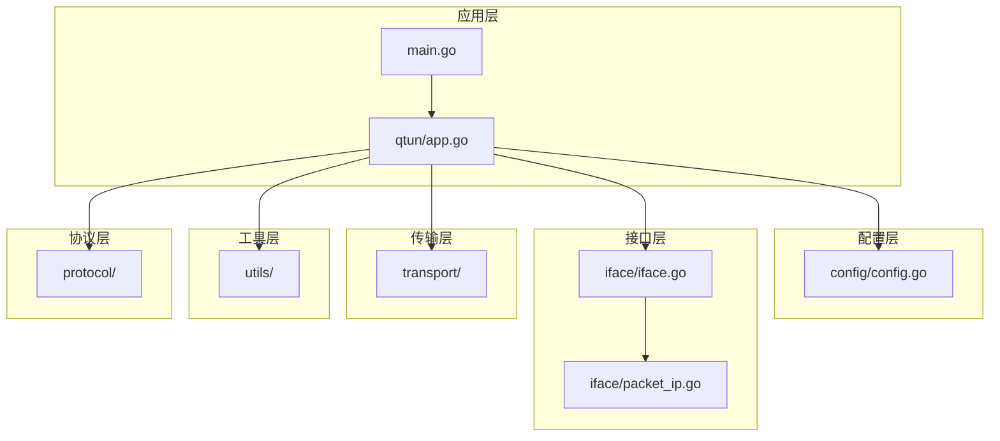
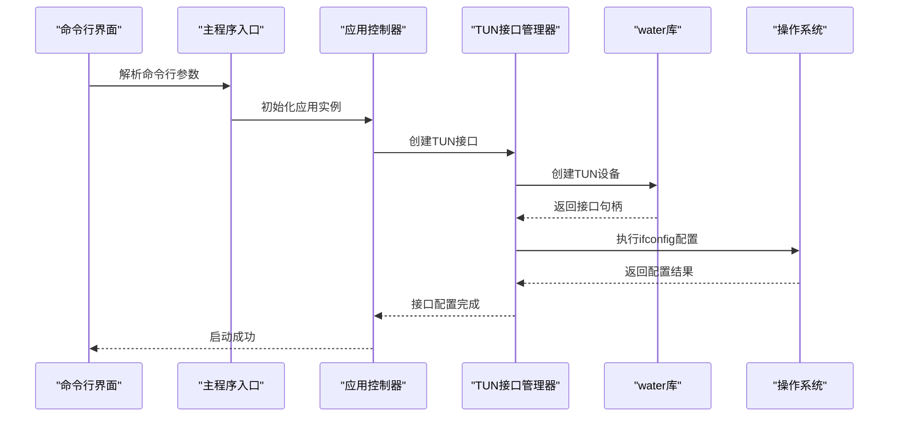
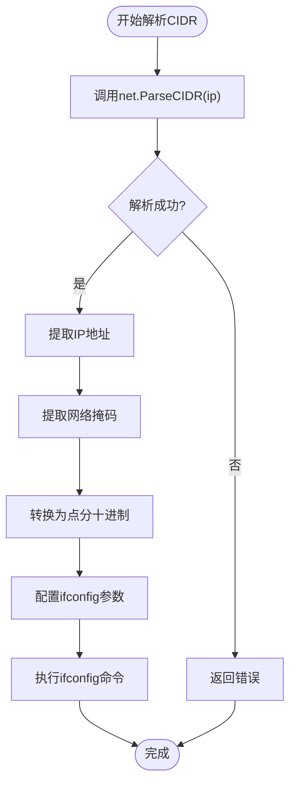
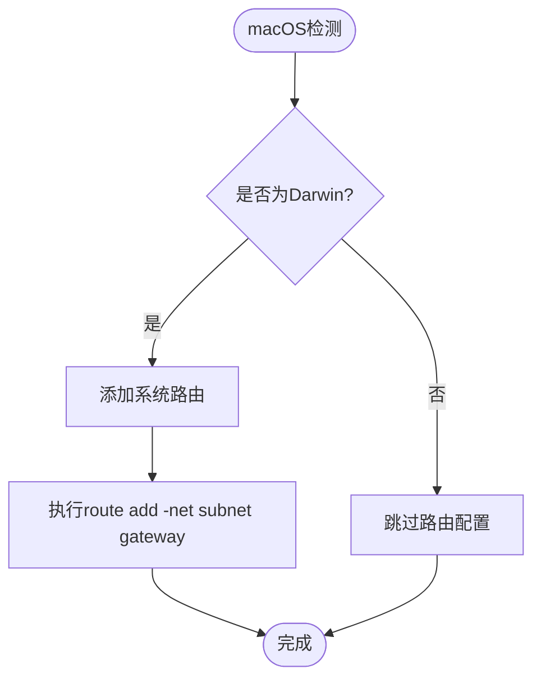
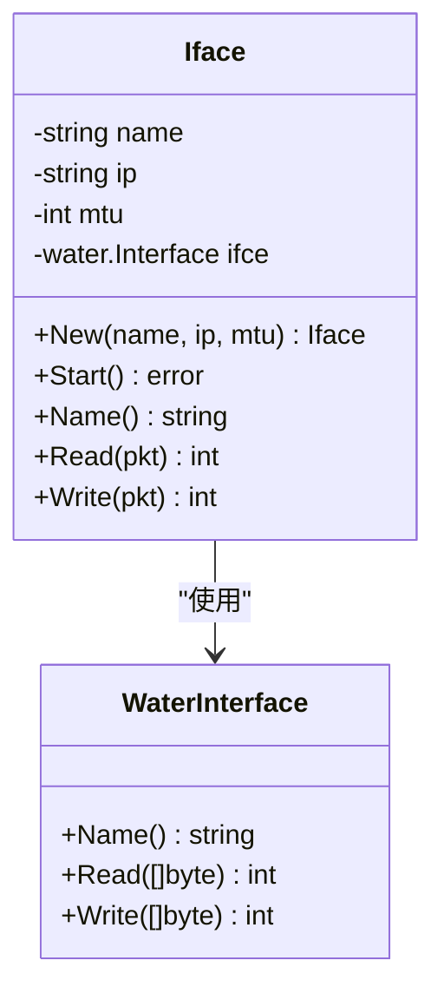
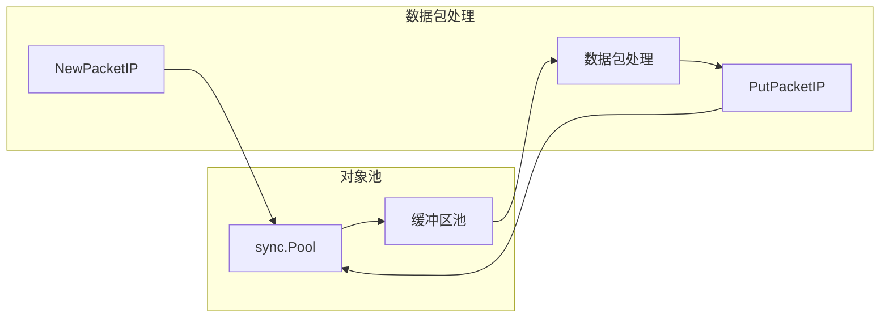
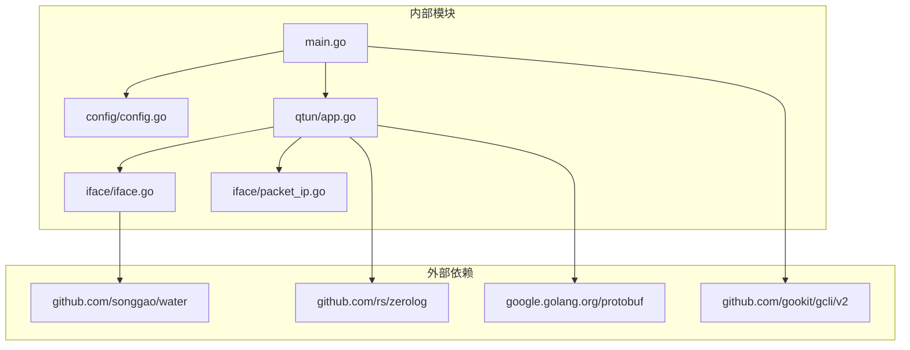

# 接口配置管理

<cite>
**本文档引用的文件**
- [main.go](file://main.go)
- [config/config.go](file://config/config.go)
- [iface/iface.go](file://iface/iface.go)
- [iface/packet_ip.go](file://iface/packet_ip.go)
- [qtun/app.go](file://qtun/app.go)
- [README.md](file://README.md)
- [go.mod](file://go.mod)
</cite>

## 目录
1. [简介](#简介)
2. [项目结构](#项目结构)
3. [核心组件](#核心组件)
4. [架构概览](#架构概览)
5. [详细组件分析](#详细组件分析)
6. [依赖关系分析](#依赖关系分析)
7. [性能考虑](#性能考虑)
8. [故障排除指南](#故障排除指南)
9. [结论](#结论)
10. [附录](#附录)

## 简介

本文档深入分析了TUN接口配置管理系统的技术实现，重点涵盖IP地址配置、子网掩码设置和MTU（最大传输单元）配置的实现细节。系统通过Go语言实现，支持跨平台操作系统的TUN虚拟网络接口管理，包括Windows、macOS和Linux平台的差异化处理。

该系统采用命令行界面设计，提供丰富的配置选项，包括加密密钥、远程服务器地址、监听地址、IP地址段、MTU大小等参数。通过water库创建TUN接口，并使用ifconfig命令进行网络配置，实现了完整的VPN隧道功能。

## 项目结构

项目采用模块化设计，主要包含以下核心模块：



**图表来源**
- [main.go](file://main.go#L1-L136)
- [config/config.go](file://config/config.go#L1-L24)
- [iface/iface.go](file://iface/iface.go#L1-L105)
- [qtun/app.go](file://qtun/app.go#L1-L271)

**章节来源**
- [main.go](file://main.go#L1-L136)
- [README.md](file://README.md#L1-L99)

## 核心组件

### 命令行参数定义

系统通过结构体CmdOpts定义所有可配置参数，包括：

- **Key**: 加密密钥，默认值"hahaha"
- **RemoteAddrs**: 远程服务器地址，客户端模式必需
- **Listen**: 服务器监听地址，默认"0.0.0.0:8080"
- **Ip**: VPN虚拟IP地址，支持CIDR格式，默认"10.237.0.1/16"
- **Mtu**: 最大传输单元，默认1500字节
- **ServerMode**: 是否以服务器模式运行
- **其他**: 包括日志级别、传输线程数、SOCKS5端口等

### 配置管理

配置系统采用单例模式，通过全局变量存储配置状态，支持运行时访问和修改。

**章节来源**
- [main.go](file://main.go#L22-L68)
- [config/config.go](file://config/config.go#L1-L24)

## 架构概览

系统采用分层架构设计，从底层到上层依次为：



**图表来源**
- [main.go](file://main.go#L75-L102)
- [qtun/app.go](file://qtun/app.go#L72-L97)
- [iface/iface.go](file://iface/iface.go#L31-L74)

## 详细组件分析

### TUN接口配置管理

#### IP地址配置与CIDR解析

系统使用net.ParseCIDR函数解析CIDR格式的IP地址配置：



**图表来源**
- [iface/iface.go](file://iface/iface.go#L32-L49)

#### 子网掩码计算

系统通过net.IPNet.Mask属性获取网络掩码，并将其转换为标准的点分十进制格式：

- 输入: CIDR格式如"10.4.4.2/24"
- 输出: 点分十进制掩码如"255.255.255.0"
- 计算逻辑: 从netIP.Mask数组提取四个字节

#### MTU配置实现

MTU（最大传输单元）配置通过ifconfig命令的mtu参数传递：

- 默认值: 1500字节
- 可配置范围: 通常在576-1500字节之间
- 平台差异: 不同操作系统可能有不同的默认值和限制

**章节来源**
- [iface/iface.go](file://iface/iface.go#L31-L74)

### 跨平台兼容性实现

#### macOS特殊处理

macOS平台需要额外的系统路由配置：



**图表来源**
- [iface/iface.go](file://iface/iface.go#L69-L91)

#### Windows和Linux差异

- **Windows**: 通过ifconfig命令进行配置，但需要管理员权限
- **Linux**: 使用相同的ifconfig命令，但网络管理器可能有所不同
- **macOS**: 额外的route命令配置，需要管理员权限

**章节来源**
- [iface/iface.go](file://iface/iface.go#L50-L71)

### 接口名称管理机制

系统使用water库创建TUN接口，接口名称由系统动态分配：



**图表来源**
- [iface/iface.go](file://iface/iface.go#L16-L29)

**章节来源**
- [iface/iface.go](file://iface/iface.go#L94-L96)

### 数据包处理与内存管理

#### 对象池优化

系统实现了PacketIP对象池，减少内存分配开销：



**图表来源**
- [iface/packet_ip.go](file://iface/packet_ip.go#L10-L39)

#### 内存池配置

- 默认缓冲区大小: 2048字节
- 回收范围: 1500-65536字节
- 目标: 减少垃圾回收频率，提高性能

**章节来源**
- [iface/packet_ip.go](file://iface/packet_ip.go#L18-L39)

## 依赖关系分析

系统依赖关系清晰，各模块职责明确：



**图表来源**
- [go.mod](file://go.mod#L5-L28)
- [main.go](file://main.go#L3-L20)

**章节来源**
- [go.mod](file://go.mod#L1-L29)

## 性能考虑

### 工作线程优化

系统根据CPU核心数动态调整工作线程数量：

- 计算公式: `min(max(CPU核数×2, 4), 32)`
- 目标: 在保证性能的同时避免过度并发
- 默认值: 至少4个线程，最多32个线程

### 锁优化策略

路由表操作采用读写锁优化：

- 读操作使用RLock，提高并发性能
- 写操作使用Lock，确保数据一致性
- 最小化临界区范围，减少锁竞争

**章节来源**
- [qtun/app.go](file://qtun/app.go#L79-L96)
- [qtun/app.go](file://qtun/app.go#L114-L161)

## 故障排除指南

### 常见配置问题

#### 权限问题

**症状**: ifconfig命令执行失败
**原因**: 缺少管理员权限
**解决方案**: 
- 使用sudo执行程序
- 确保用户具有网络配置权限

#### CIDR格式错误

**症状**: IP地址解析失败
**原因**: CIDR格式不正确
**解决方案**:
- 确保IP地址格式为"10.4.4.2/24"
- 验证子网掩码范围(0-32)

#### MTU配置冲突

**症状**: 网络连接不稳定
**原因**: MTU设置不当
**解决方案**:
- 默认MTU: 1500字节
- 根据网络环境调整MTU值
- 测试不同MTU值的网络性能

#### 路由配置失败

**症状**: macOS系统路由添加失败
**原因**: 系统路由表配置错误
**解决方案**:
- 检查目标子网格式
- 确保网关地址有效
- 验证系统路由权限

### 调试方法

#### 日志分析

系统提供详细的日志输出，包括：
- 接口创建信息
- 配置参数验证
- 网络操作结果
- 错误信息记录

#### 性能监控

使用内置的性能监控工具：
- statsviz实时可视化
- pprof性能分析
- goroutine数量监控

**章节来源**
- [qtun/app.go](file://qtun/app.go#L250-L270)
- [iface/iface.go](file://iface/iface.go#L61-L67)

## 结论

TUN接口配置管理系统提供了完整的跨平台网络虚拟化解决方案。系统通过精心设计的架构实现了以下关键特性：

1. **跨平台兼容**: 支持Windows、macOS、Linux三大主流操作系统
2. **灵活配置**: 提供丰富的配置选项，满足不同使用场景需求
3. **性能优化**: 采用多种优化技术，包括对象池、锁优化、动态线程数等
4. **错误处理**: 完善的错误处理和日志记录机制
5. **易用性**: 简洁的命令行界面和详细的帮助文档

该系统为构建高性能的VPN隧道和网络代理服务提供了坚实的基础，适合在生产环境中部署使用。

## 附录

### 配置示例

#### 服务器模式配置
```bash
sudo ./qtun qt --key "hahaha" --listen "0.0.0.0:8080" --ip "10.4.4.2/24" --server_mode
```

#### 客户端模式配置
```bash
sudo ./qtun qt --key "hahaha" --remote_addrs "8.8.8.80:8080" --ip "10.4.4.3/24"
```

### 最佳实践建议

1. **IP地址规划**: 合理选择IP地址段，避免与现有网络冲突
2. **MTU调优**: 根据网络环境测试最优MTU值
3. **权限管理**: 确保程序具有必要的系统权限
4. **监控维护**: 定期检查日志和性能指标
5. **安全配置**: 使用强加密密钥，定期更换