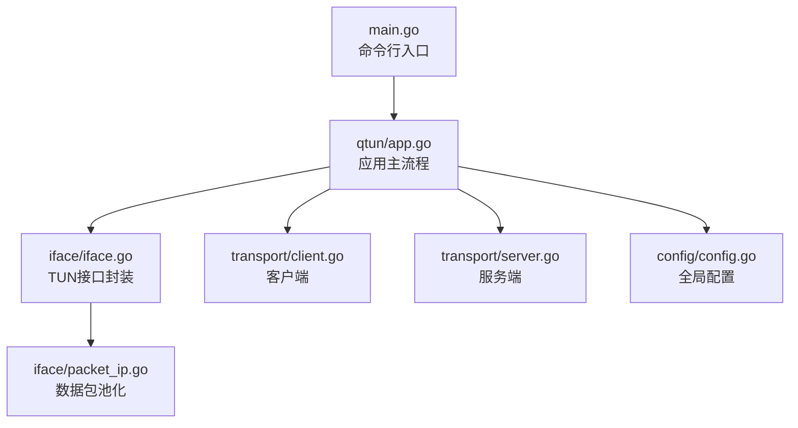
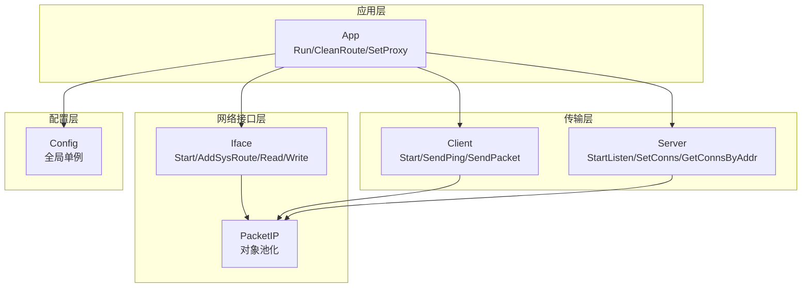
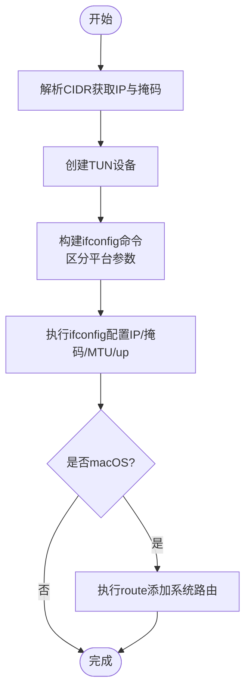
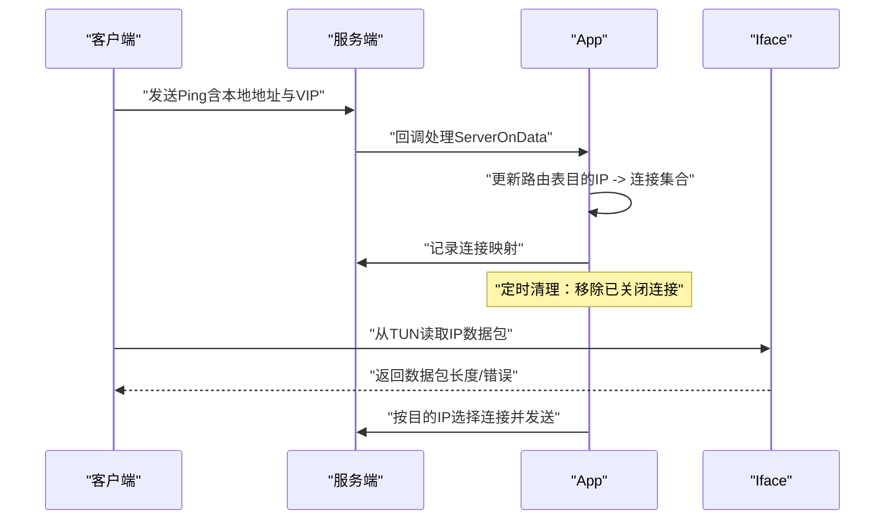
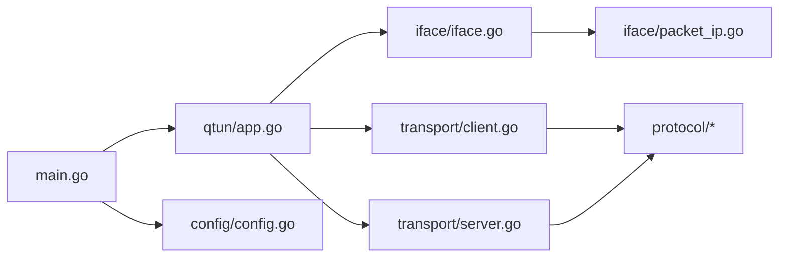

# 跨平台支持

<cite>
**本文引用的文件**
- [main.go](file://main.go)
- [config/config.go](file://config/config.go)
- [qtun/app.go](file://qtun/app.go)
- [iface/iface.go](file://iface/iface.go)
- [iface/packet_ip.go](file://iface/packet_ip.go)
- [transport/client.go](file://transport/client.go)
- [transport/server.go](file://transport/server.go)
- [README.md](file://README.md)
- [go.mod](file://go.mod)
</cite>

## 目录
1. [引言](#引言)
2. [项目结构](#项目结构)
3. [核心组件](#核心组件)
4. [架构总览](#架构总览)
5. [详细组件分析](#详细组件分析)
6. [依赖关系分析](#依赖关系分析)
7. [性能考量](#性能考量)
8. [故障排查指南](#故障排查指南)
9. [结论](#结论)
10. [附录](#附录)

## 引言
本文件聚焦于Qtun在不同操作系统（Windows、macOS、Linux）下的跨平台支持与实现细节，围绕以下主题展开：TUN接口在各平台的差异、ifconfig命令在不同平台上的参数差异、macOS系统中route命令的路由添加机制、系统路由表的动态管理与更新策略、权限与管理员权限需求、平台特定配置与最佳实践、平台兼容性测试与问题排查，以及跨平台代码的抽象设计与实现策略。

## 项目结构
- 入口与命令行参数解析位于主程序入口，负责初始化配置、日志与应用生命周期调度。
- 应用主体逻辑集中在qtun子包，负责TUN接口读写、数据包转发、路由表维护与定时清理。
- 网络接口封装在iface子包，负责TUN设备创建、IP配置、系统路由添加等。
- 传输层在transport子包，客户端与服务端分别负责连接建立、心跳、数据包收发与并发控制。
- 配置通过config子包集中管理，全局单例提供给各模块使用。
- 平台差异主要体现在系统命令调用（如ifconfig、route、networksetup）与代理设置能力上。

图表来源
- [main.go](file://main.go#L1-L136)
- [qtun/app.go](file://qtun/app.go#L1-L271)
- [iface/iface.go](file://iface/iface.go#L1-L105)
- [iface/packet_ip.go](file://iface/packet_ip.go#L1-L47)
- [transport/client.go](file://transport/client.go#L1-L223)
- [transport/server.go](file://transport/server.go#L1-L219)
- [config/config.go](file://config/config.go#L1-L24)

章节来源
- [main.go](file://main.go#L1-L136)
- [README.md](file://README.md#L1-L99)

## 核心组件
- 应用主控（App）：负责运行模式选择、TUN接口启动、工作线程调度、路由表维护与清理、代理设置。
- 接口封装（Iface）：负责TUN设备创建、IP与MTU配置、系统路由添加（macOS）、读写数据包。
- 数据包类型（PacketIP）：基于字节切片的封装与对象池化，减少GC压力。
- 客户端/服务端（Client/Server）：负责与远端建立QUIC连接、心跳、数据包收发与并发控制。
- 配置（Config）：全局配置单例，贯穿应用生命周期。

章节来源
- [qtun/app.go](file://qtun/app.go#L1-L271)
- [iface/iface.go](file://iface/iface.go#L1-L105)
- [iface/packet_ip.go](file://iface/packet_ip.go#L1-L47)
- [transport/client.go](file://transport/client.go#L1-L223)
- [transport/server.go](file://transport/server.go#L1-L219)
- [config/config.go](file://config/config.go#L1-L24)

## 架构总览
下图展示了跨平台相关的关键交互：应用主控在启动时创建TUN接口，根据平台执行ifconfig配置；在macOS上额外添加系统路由；客户端/服务端通过QUIC进行数据传输；应用主控维护路由表并定期清理失效连接。

图表来源
- [qtun/app.go](file://qtun/app.go#L37-L97)
- [iface/iface.go](file://iface/iface.go#L31-L74)
- [transport/client.go](file://transport/client.go#L41-L83)
- [transport/server.go](file://transport/server.go#L48-L76)
- [config/config.go](file://config/config.go#L17-L23)

## 详细组件分析

### TUN接口与平台差异（Windows/macOS/Linux）
- 设备创建：统一使用第三方库创建TUN设备，返回设备名。
- IP与MTU配置：通过ifconfig命令为TUN接口分配IP与掩码，并设置MTU与状态为up。
  - macOS与Linux在ifconfig参数上略有差异（macOS多传一次IP地址参数），代码中通过运行时判断区分。
- 系统路由添加（仅macOS）：在ifconfig成功后，计算目标网段并将该网段路由指向TUN接口IP，确保流量经由TUN转发。
- 权限要求：ifconfig与route调用通常需要管理员权限；否则会失败并记录错误。

图表来源
- [iface/iface.go](file://iface/iface.go#L31-L74)
- [iface/iface.go](file://iface/iface.go#L76-L92)

章节来源
- [iface/iface.go](file://iface/iface.go#L31-L92)

### ifconfig命令在不同平台的参数差异
- Linux：ifconfig <接口名> <IP> netmask <掩码> mtu <MTU> up
- macOS：ifconfig <接口名> <IP> <IP> netmask <掩码> mtu <MTU> up
- 差异点在于macOS将目标IP重复传入作为别名地址参数，Linux不需要该参数。
- 代码通过运行时检测GOOS，动态拼接命令参数以适配平台。

章节来源
- [iface/iface.go](file://iface/iface.go#L50-L59)

### route命令在macOS中的路由添加机制
- 在macOS上，完成ifconfig配置后，计算目标网段（取IP前三位加“.0”形成网段），使用route add -net <网段> <网关>将该网段的流量指向TUN接口IP。
- 若route命令执行失败，会记录错误并panic，提示系统路由配置异常。

章节来源
- [iface/iface.go](file://iface/iface.go#L76-L92)

### 系统路由表的动态管理与更新策略
- 客户端侧：客户端通过周期性发送Ping消息携带本地地址与VIP，服务端收到后将其加入路由表，形成“目的IP -> 连接集合”的映射。
- 服务端侧：维护双向映射（连接 -> 目的IP、目的IP -> 连接），用于快速查找与反向删除。
- 路由清理：应用启动后注册定时任务，每分钟扫描路由表，移除已关闭或失效的连接，避免僵尸路由占用资源。

图表来源
- [qtun/app.go](file://qtun/app.go#L169-L207)
- [transport/server.go](file://transport/server.go#L192-L210)
- [transport/client.go](file://transport/client.go#L178-L206)

章节来源
- [qtun/app.go](file://qtun/app.go#L51-L70)
- [qtun/app.go](file://qtun/app.go#L169-L207)
- [transport/server.go](file://transport/server.go#L192-L210)
- [transport/client.go](file://transport/client.go#L178-L206)

### 权限要求与管理员权限
- TUN设备创建、ifconfig与route调用通常需要管理员权限；若无权限，命令执行会失败并记录错误。
- README明确指出Windows不支持，Linux与macOS支持，但实际功能受限于系统权限与命令可用性。

章节来源
- [README.md](file://README.md#L94-L99)
- [iface/iface.go](file://iface/iface.go#L61-L67)
- [iface/iface.go](file://iface/iface.go#L86-L91)

### 平台特定配置与最佳实践
- macOS
  - 自动添加系统路由，确保流量经TUN转发。
  - 可通过networksetup设置系统自动代理（PAC），便于透明代理。
- Linux
  - 不自动设置系统代理，需手动配置浏览器或系统代理。
  - ifconfig/route需具备管理员权限。
- Windows
  - 不支持自动代理设置与TUN配置，建议使用其他隧道方案。

章节来源
- [qtun/app.go](file://qtun/app.go#L250-L270)
- [README.md](file://README.md#L94-L99)

### 跨平台代码的抽象设计与实现策略
- 运行时分支：通过runtime.GOOS判断平台，分别执行不同的命令与逻辑（如ifconfig参数、代理设置）。
- 命令调用封装：将系统命令封装为函数，便于替换与测试。
- 对象池化：PacketIP采用sync.Pool减少频繁分配，提升高并发场景下的吞吐。
- 并发与锁：路由表使用互斥锁保护，同时在读多写少场景下尽量缩短临界区；服务端使用sync.Map提升并发性能。
- 错误处理：命令执行失败记录详细输出，便于定位问题。

章节来源
- [iface/iface.go](file://iface/iface.go#L50-L59)
- [qtun/app.go](file://qtun/app.go#L250-L270)
- [iface/packet_ip.go](file://iface/packet_ip.go#L10-L39)
- [qtun/app.go](file://qtun/app.go#L114-L161)
- [transport/server.go](file://transport/server.go#L31-L35)

## 依赖关系分析
- 主入口依赖配置初始化与日志初始化，随后创建应用实例并运行。
- 应用主控依赖配置、传输层（客户端/服务端）与接口层（Iface）。
- 接口层依赖第三方WATER库创建TUN设备，并调用系统命令配置网络。
- 传输层依赖协议定义与加密工具，使用QUIC进行高效传输。

图表来源
- [main.go](file://main.go#L75-L86)
- [qtun/app.go](file://qtun/app.go#L37-L49)
- [iface/iface.go](file://iface/iface.go#L1-L14)
- [transport/client.go](file://transport/client.go#L1-L18)
- [transport/server.go](file://transport/server.go#L1-L21)
- [go.mod](file://go.mod#L5-L14)

章节来源
- [go.mod](file://go.mod#L1-L29)
- [main.go](file://main.go#L75-L86)

## 性能考量
- 工作线程数：根据CPU核心数动态调整，范围限制在4到32之间，兼顾I/O并行与系统负载。
- 对象池化：PacketIP使用sync.Pool降低内存分配与GC压力。
- 并发容器：服务端使用sync.Map替代互斥锁保护的map，提高读写并发性能。
- 心跳与清理：客户端周期性发送Ping维持连接，服务端定时清理无效连接，避免资源泄漏。

章节来源
- [qtun/app.go](file://qtun/app.go#L79-L96)
- [iface/packet_ip.go](file://iface/packet_ip.go#L10-L39)
- [transport/server.go](file://transport/server.go#L31-L35)
- [transport/client.go](file://transport/client.go#L75-L82)

## 故障排查指南
- ifconfig/route执行失败
  - 检查是否以管理员权限运行。
  - 确认目标平台命令可用（Linux/macOS）。
  - 查看日志中的命令输出，定位具体错误原因。
- macOS无法添加系统路由
  - 确认route命令可用且参数正确（网段与网关）。
  - 检查TUN接口IP与掩码是否有效。
- 代理设置失败
  - macOS可通过networksetup设置自动代理（PAC），其他平台需手动配置。
- 连接不稳定或丢包
  - 检查客户端并发线程数与服务端QUIC配置。
  - 关注路由表清理任务是否正常运行，避免僵尸连接影响转发。

章节来源
- [iface/iface.go](file://iface/iface.go#L61-L67)
- [iface/iface.go](file://iface/iface.go#L86-L91)
- [qtun/app.go](file://qtun/app.go#L250-L270)
- [transport/server.go](file://transport/server.go#L97-L103)

## 结论
Qtun通过运行时平台分支与系统命令封装实现了对macOS、Linux的基本支持，并在macOS上提供了完整的TUN配置与系统路由添加能力。Windows当前不支持自动代理与TUN配置。项目在性能方面采用了对象池化、动态工作线程与并发容器等优化手段。实际部署中应关注管理员权限、平台命令可用性与代理配置，结合日志与定时清理机制保障稳定运行。

## 附录
- 平台支持声明：README明确标注MacOS与Linux支持，Windows不支持。
- 外部依赖：WATER库用于TUN设备创建，QUIC用于传输，zerolog用于日志。

章节来源
- [README.md](file://README.md#L94-L99)
- [go.mod](file://go.mod#L5-L14)