# QUIC协议实现

<cite>
**本文档引用的文件**
- [transport/client.go](file://transport/client.go)
- [transport/server.go](file://transport/server.go)
- [transport/client_conn.go](file://transport/client_conn.go)
- [transport/server_conn.go](file://transport/server_conn.go)
- [transport/crypto.go](file://transport/crypto.go)
- [transport/grpc_handler.go](file://transport/grpc_handler.go)
- [transport/pool.go](file://transport/pool.go)
- [config/config.go](file://config/config.go)
- [main.go](file://main.go)
- [qtun/app.go](file://qtun/app.go)
- [protocol/protocol.proto](file://protocol/protocol.proto)
- [iface/iface.go](file://iface/iface.go)
</cite>

## 目录
1. [简介](#简介)
2. [项目结构](#项目结构)
3. [核心组件](#核心组件)
4. [架构概览](#架构概览)
5. [详细组件分析](#详细组件分析)
6. [QUIC协议实现细节](#quic协议实现细节)
7. [连接管理机制](#连接管理机制)
8. [性能优化特性](#性能优化特性)
9. [错误处理与故障恢复](#错误处理与故障恢复)
10. [配置选项与调优](#配置选项与调优)
11. [QUIC协议优势分析](#quic协议优势分析)
12. [结论](#结论)

## 简介

qtun是一个基于Go语言开发的高性能网络隧道工具，采用QUIC协议作为底层传输层。QUIC（Quick UDP Internet Connections）是由Google开发的新一代网络传输协议，它结合了TCP的可靠性和UDP的低延迟特性，为现代互联网应用提供了更好的性能和安全性。

本项目通过QUIC协议实现了高效的点对点数据传输，支持多路复用、零往返时间连接和内置加密等特性。系统采用客户端-服务器架构，通过TUN接口实现虚拟网络设备的数据转发。

## 项目结构

项目采用模块化设计，主要分为以下几个核心模块：

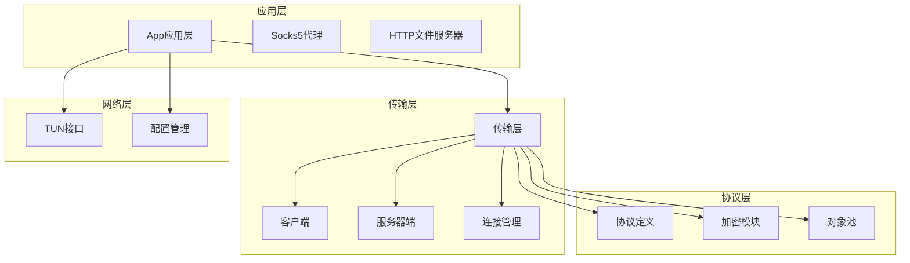

**图表来源**
- [main.go](file://main.go#L1-L136)
- [qtun/app.go](file://qtun/app.go#L1-L271)
- [transport/client.go](file://transport/client.go#L1-L223)

**章节来源**
- [main.go](file://main.go#L1-L136)
- [qtun/app.go](file://qtun/app.go#L1-L271)

## 核心组件

### 应用层组件

应用层是整个系统的入口点，负责协调各个子系统的运行。主要组件包括：

- **App主控制器**：管理客户端和服务器模式的切换，协调TUN接口和传输层的交互
- **Socks5代理服务**：提供SOCKS5代理功能，支持HTTP代理自动配置
- **HTTP文件服务器**：提供静态文件服务功能

### 传输层组件

传输层是QUIC协议的核心实现，包含以下关键组件：

- **Client客户端**：管理多个并发连接，实现负载均衡和故障转移
- **Server服务器端**：处理来自客户端的连接请求，维护连接状态
- **ClientConn客户端连接**：单个QUIC连接的实现，处理数据读写
- **ServerConn服务器连接**：单个QUIC连接的实现，处理数据读写

### 协议层组件

协议层定义了应用层数据的序列化格式和通信协议：

- **Protocol协议定义**：使用Protocol Buffers定义消息格式
- **Crypto加密模块**：实现AES-GCM加密算法
- **Pool对象池**：提供内存对象的高效复用

**章节来源**
- [qtun/app.go](file://qtun/app.go#L1-L271)
- [transport/client.go](file://transport/client.go#L1-L223)
- [transport/server.go](file://transport/server.go#L1-L219)

## 架构概览

系统采用分层架构设计，各层职责明确，耦合度低：

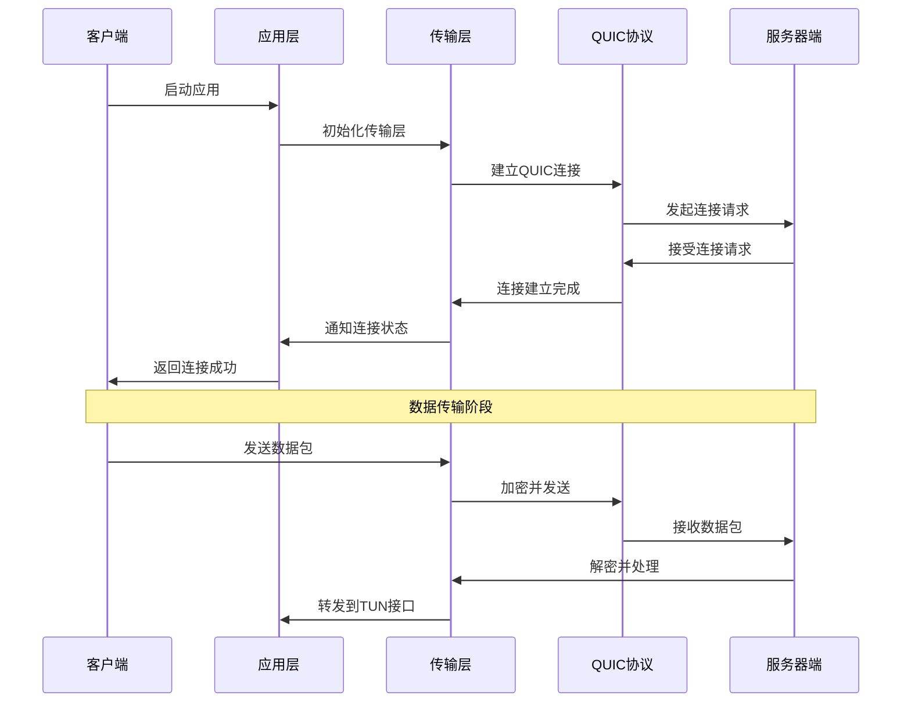

**图表来源**
- [qtun/app.go](file://qtun/app.go#L37-L49)
- [transport/client.go](file://transport/client.go#L41-L83)
- [transport/server.go](file://transport/server.go#L91-L149)

## 详细组件分析

### Client客户端组件

Client组件负责管理多个并发的QUIC连接，实现高可用性和负载均衡：

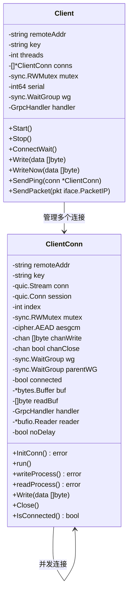

**图表来源**
- [transport/client.go](file://transport/client.go#L20-L29)
- [transport/client_conn.go](file://transport/client_conn.go#L24-L42)

Client组件的关键特性：

1. **多线程连接管理**：支持配置多个并发连接，提高吞吐量
2. **连接状态跟踪**：实时监控连接状态，支持动态重连
3. **负载均衡**：通过原子计数器实现连接选择的轮询策略
4. **心跳检测**：定期发送PING消息维持连接活跃

**章节来源**
- [transport/client.go](file://transport/client.go#L1-L223)
- [transport/client_conn.go](file://transport/client_conn.go#L1-L408)

### Server服务器端组件

Server组件负责处理来自客户端的连接请求，维护连接状态和路由表：

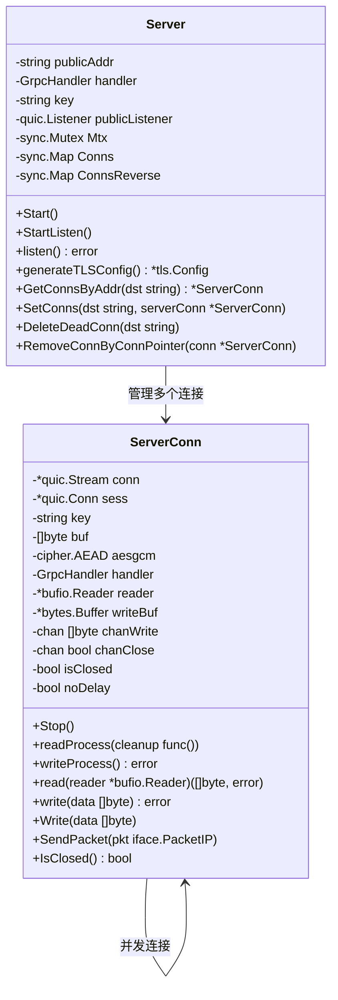

**图表来源**
- [transport/server.go](file://transport/server.go#L23-L35)
- [transport/server_conn.go](file://transport/server_conn.go#L24-L37)

Server组件的关键特性：

1. **并发连接处理**：使用sync.Map实现高性能的并发连接管理
2. **路由表管理**：维护客户端IP到连接的映射关系
3. **连接生命周期管理**：自动清理断开的连接
4. **双向数据传输**：支持客户端和服务器端的双向通信

**章节来源**
- [transport/server.go](file://transport/server.go#L1-L219)
- [transport/server_conn.go](file://transport/server_conn.go#L1-L295)

### 协议层组件

协议层定义了应用层数据的序列化格式和通信协议：

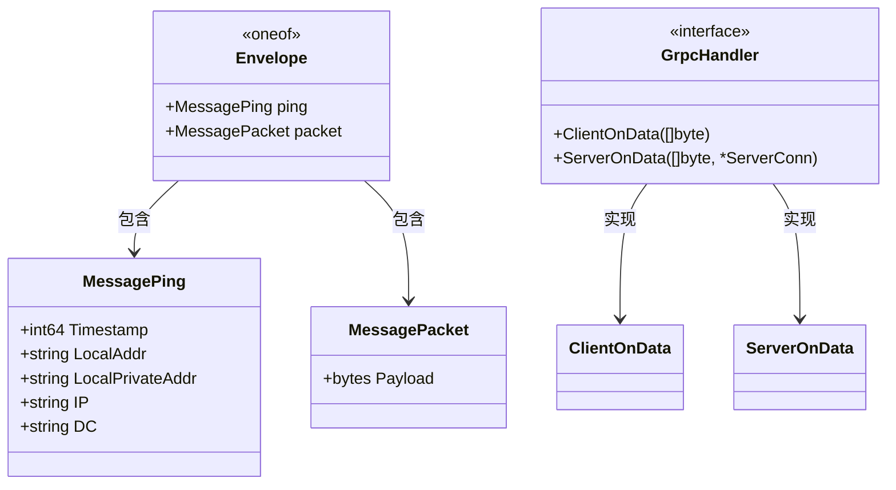

**图表来源**
- [protocol/protocol.proto](file://protocol/protocol.proto#L5-L22)
- [transport/grpc_handler.go](file://transport/grpc_handler.go#L3-L6)

协议层的关键特性：

1. **Protocol Buffers序列化**：使用高效的二进制序列化格式
2. **oneof类型设计**：减少消息大小，提高传输效率
3. **灵活的消息扩展**：支持未来功能的扩展
4. **统一的处理接口**：通过GrpcHandler接口实现解耦

**章节来源**
- [protocol/protocol.proto](file://protocol/protocol.proto#L1-L22)
- [transport/grpc_handler.go](file://transport/grpc_handler.go#L1-L7)

## QUIC协议实现细节

### QUIC连接建立流程

QUIC协议的连接建立过程比TCP更高效，因为它消除了握手过程中的往返延迟：

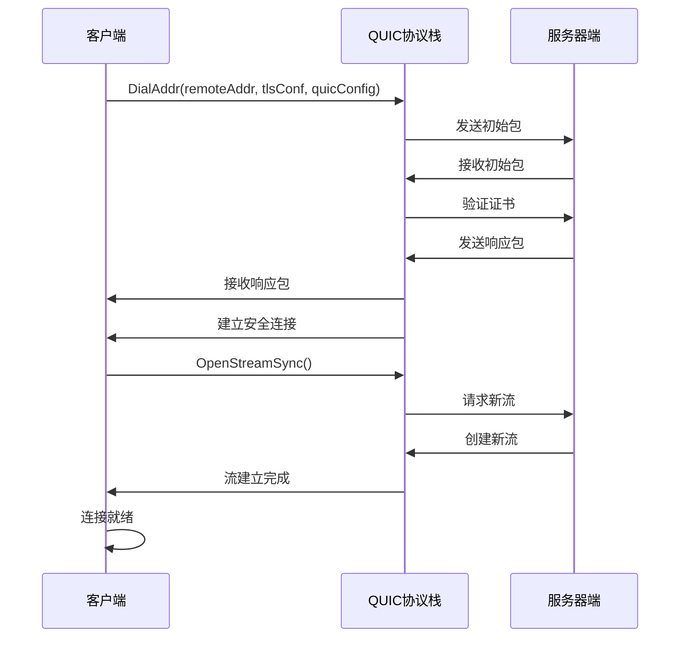

**图表来源**
- [transport/client_conn.go](file://transport/client_conn.go#L95-L107)
- [transport/server.go](file://transport/server.go#L113-L128)

### QUIC握手过程

QUIC的握手过程与传统的TLS握手不同，它在连接建立的同时完成加密协商：

1. **版本协商**：客户端和服务器协商支持的QUIC版本
2. **参数交换**：交换连接参数如最大窗口大小、保活间隔等
3. **证书验证**：验证服务器证书的有效性
4. **密钥派生**：基于握手过程派生加密密钥
5. **流建立**：建立用于数据传输的流

### 多路复用实现

QUIC协议支持在一个连接上同时进行多个独立的数据流传输：

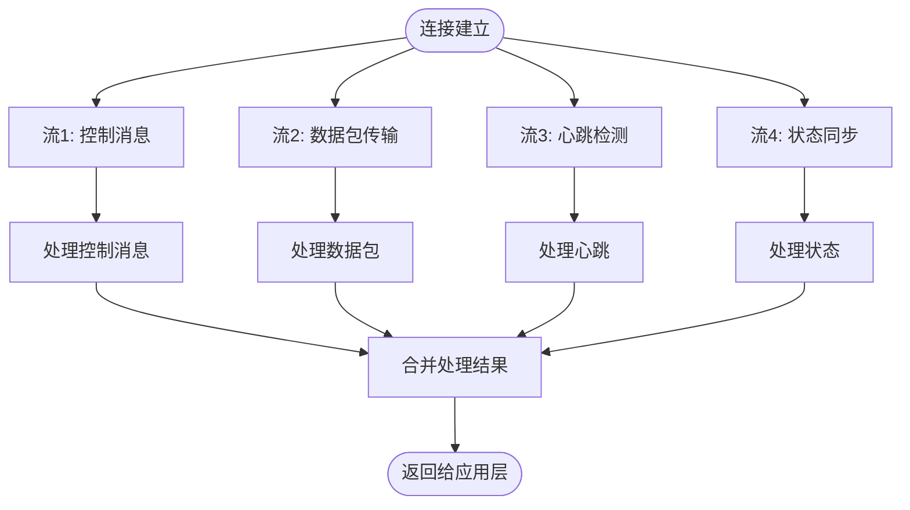

**图表来源**
- [transport/client_conn.go](file://transport/client_conn.go#L102-L107)
- [transport/server_conn.go](file://transport/server_conn.go#L40-L50)

**章节来源**
- [transport/client_conn.go](file://transport/client_conn.go#L69-L117)
- [transport/server.go](file://transport/server.go#L91-L149)

## 连接管理机制

### 连接状态跟踪

系统实现了完整的连接状态跟踪机制，确保连接的可靠性和可观察性：

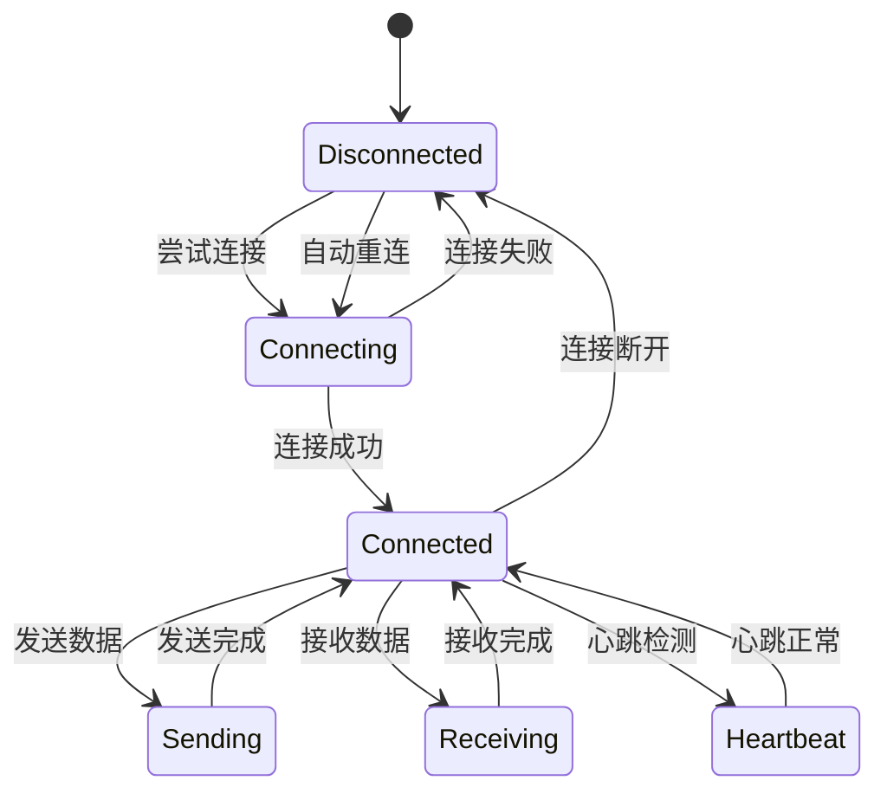

**图表来源**
- [transport/client_conn.go](file://transport/client_conn.go#L198-L202)
- [transport/server_conn.go](file://transport/server_conn.go#L292-L294)

### 超时处理机制

系统实现了多层次的超时处理机制：

1. **连接超时**：连接尝试超时，防止无限等待
2. **读取超时**：数据读取超时，及时发现死连接
3. **写入超时**：数据写入超时，避免阻塞
4. **心跳超时**：心跳检测超时，判断连接状态

### 重连策略

系统采用了智能的重连策略，确保连接的高可用性：

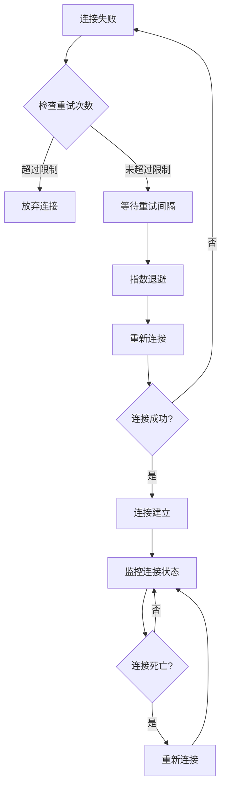

**图表来源**
- [transport/client.go](file://transport/client.go#L41-L83)
- [transport/client_conn.go](file://transport/client_conn.go#L173-L187)

**章节来源**
- [transport/client.go](file://transport/client.go#L1-L223)
- [transport/client_conn.go](file://transport/client_conn.go#L1-L408)

## 性能优化特性

### 对象池优化

系统广泛使用了对象池技术来减少内存分配和垃圾回收压力：

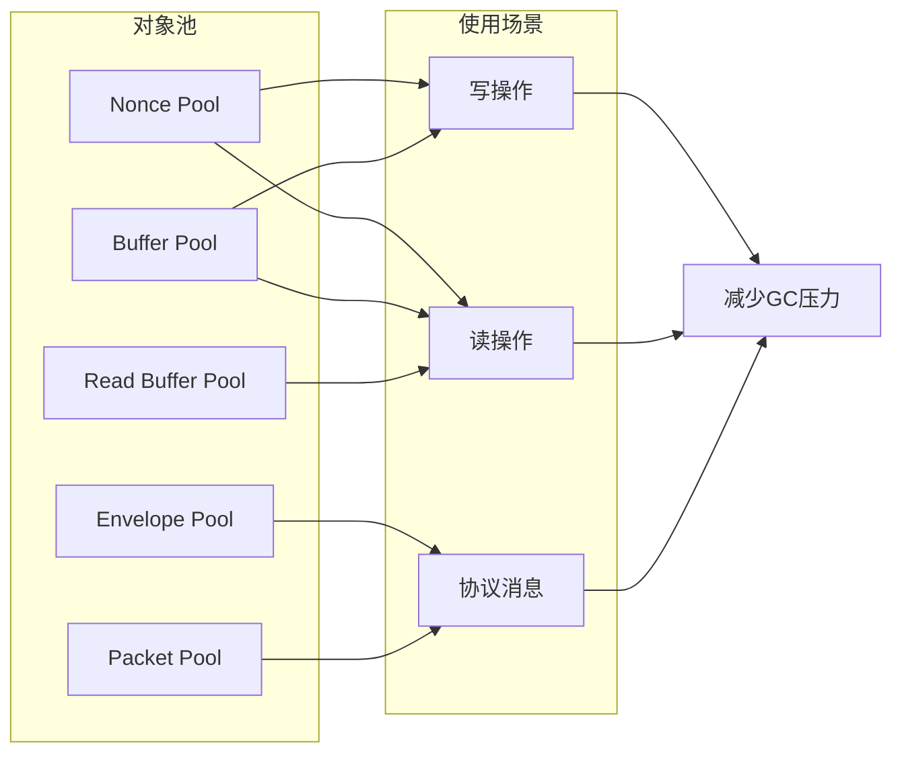

**图表来源**
- [transport/pool.go](file://transport/pool.go#L10-L50)

### 缓冲区优化

系统对缓冲区进行了精心设计，平衡内存使用和性能：

1. **读缓冲区**：64KB的大缓冲区，减少系统调用次数
2. **写缓冲区**：动态增长的缓冲区，适应不同大小的数据包
3. **通道缓冲**：256个元素的通道缓冲，避免阻塞

### 并发优化

系统采用了多种并发优化技术：

1. **sync.Map**：用于高并发的连接管理
2. **原子操作**：用于无锁的计数器操作
3. **goroutine池**：动态管理的工作协程

**章节来源**
- [transport/pool.go](file://transport/pool.go#L1-L108)
- [transport/server.go](file://transport/server.go#L31-L34)

## 错误处理与故障恢复

### 错误分类与处理

系统对错误进行了分类处理：

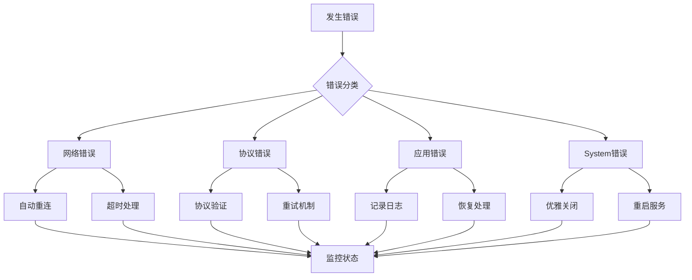

### 故障恢复机制

系统实现了多层次的故障恢复机制：

1. **连接级恢复**：单个连接的故障不影响整体服务
2. **进程级恢复**：异常退出后自动重启
3. **数据级恢复**：通过重传机制保证数据完整性

**章节来源**
- [transport/client_conn.go](file://transport/client_conn.go#L131-L150)
- [transport/server_conn.go](file://transport/server_conn.go#L58-L74)

## 配置选项与调优

### 主要配置选项

| 配置项 | 类型 | 默认值 | 描述 |
|--------|------|--------|------|
| key | string | "hello-world" | 加密密钥 |
| remote_addrs | string | "0.0.0.0:8080" | 远程服务器地址 |
| listen | string | "0.0.0.0:8080" | 本地监听地址 |
| transport_threads | int | 1 | 传输线程数量 |
| ip | string | "10.237.0.1/16" | VPN虚拟IP地址段 |
| mtu | int | 1500 | 最大传输单元 |
| server_mode | bool | false | 服务器模式开关 |
| nodelay | bool | false | TCP Nagle算法禁用 |

### QUIC配置参数

系统对QUIC协议进行了专门的配置优化：

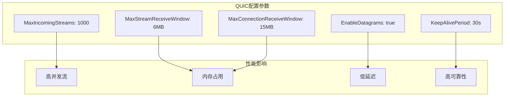

**图表来源**
- [transport/client_conn.go](file://transport/client_conn.go#L84-L91)
- [transport/server.go](file://transport/server.go#L96-L103)

### 性能调优建议

1. **连接数调优**：根据网络环境和硬件能力调整transport_threads参数
2. **缓冲区大小**：根据数据特征调整读写缓冲区大小
3. **超时参数**：根据网络延迟调整超时时间
4. **加密强度**：根据安全需求选择合适的加密算法

**章节来源**
- [config/config.go](file://config/config.go#L1-L24)
- [main.go](file://main.go#L22-L66)

## QUIC协议优势分析

### 多路复用优势

QUIC协议相比传统TCP具有显著的多路复用优势：

1. **消除队头阻塞**：多个数据流可以并行传输，避免相互影响
2. **降低延迟**：减少了握手和队头阻塞带来的延迟
3. **提高吞吐量**：充分利用网络带宽资源

### 零RTT连接

QUIC协议支持零往返时间的快速连接：

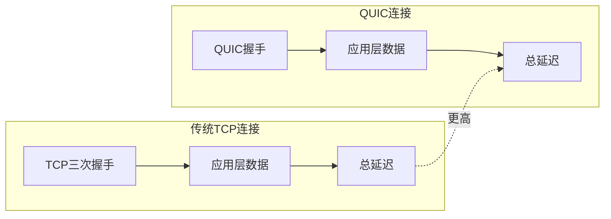

### 拥塞控制特性

QUIC协议实现了先进的拥塞控制算法：

1. **快速自适应**：能够快速适应网络变化
2. **公平性保证**：与其他流量公平竞争带宽
3. **低延迟优化**：优先保证低延迟应用的性能

### 与TCP的区别

| 特性 | TCP | QUIC |
|------|-----|------|
| 连接建立 | 3次握手 | 1-RTT或0-RTT |
| 队头阻塞 | 存在 | 消除 |
| 加密 | 外部TLS | 内置加密 |
| 多路复用 | 不支持 | 原生支持 |
| 拥塞控制 | 固定算法 | 可插拔算法 |

### 适用场景

QUIC协议特别适用于以下场景：

1. **实时应用**：在线游戏、视频通话等低延迟应用
2. **移动网络**：WiFi切换频繁的移动设备
3. **CDN服务**：内容分发网络的加速
4. **微服务通信**：服务间通信的高并发场景

## 结论

qtun项目通过QUIC协议实现了高性能的网络隧道解决方案。系统的设计充分考虑了现代网络环境的需求，采用了多项技术创新：

1. **协议层面**：基于QUIC协议的先进特性和优化
2. **架构层面**：模块化设计，职责清晰，易于维护
3. **性能层面**：多层优化，包括对象池、并发优化等
4. **可靠性层面**：完善的错误处理和故障恢复机制

通过合理的配置和调优，系统能够在不同的网络环境下提供稳定、高效的网络传输服务。QUIC协议的优势在网络隧道应用中得到了充分体现，特别是在低延迟、高并发和移动网络场景下表现尤为突出。