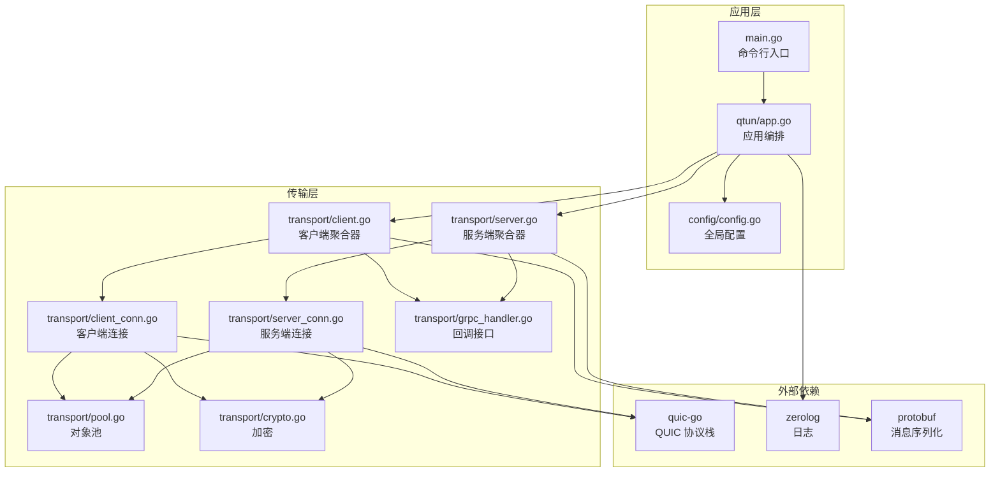
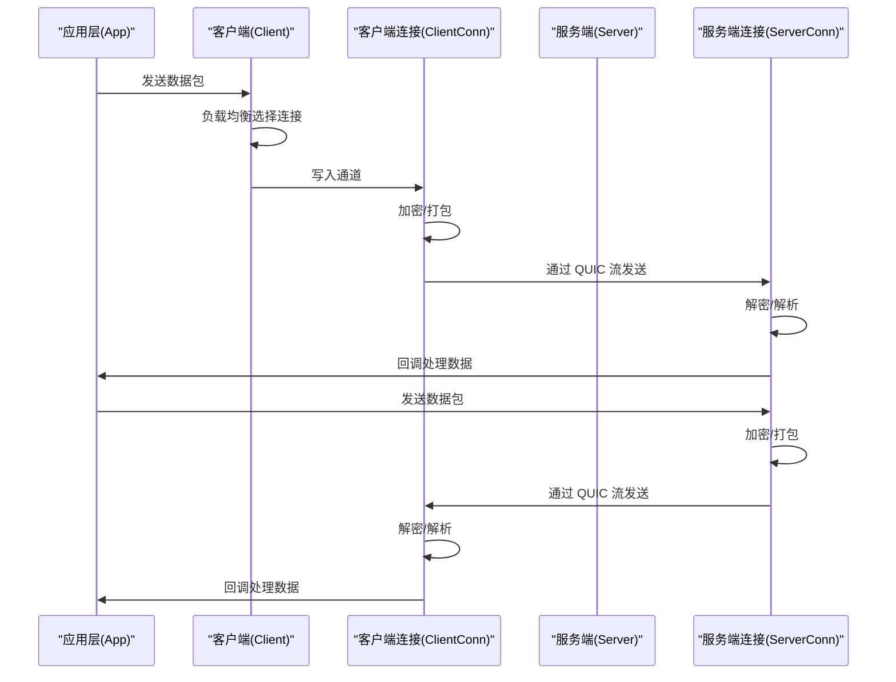
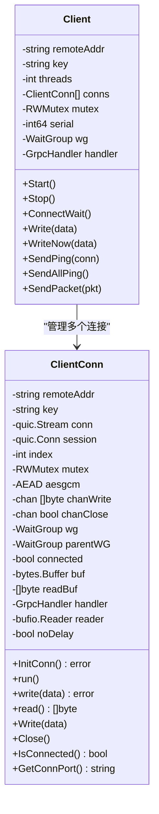
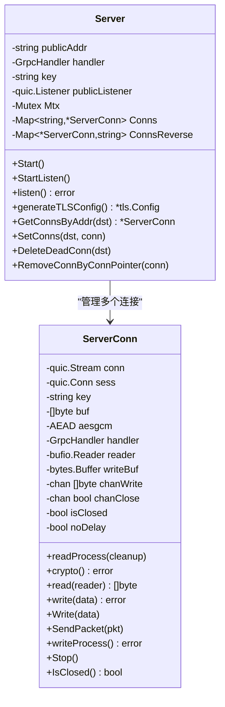
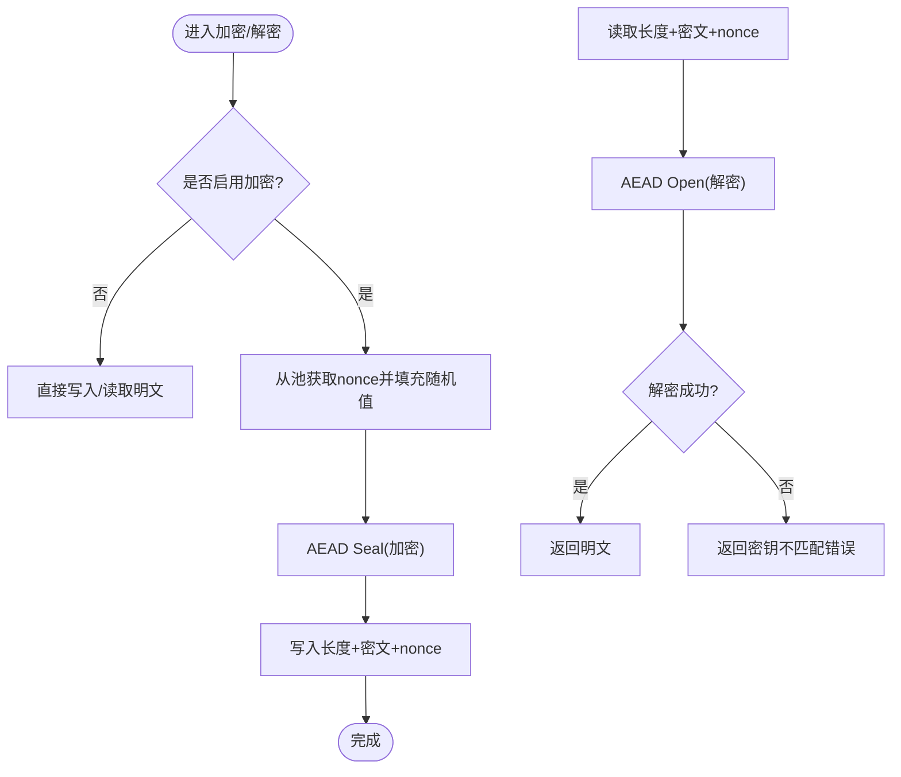
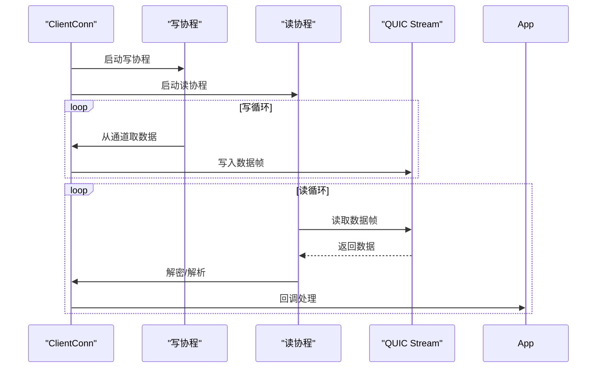
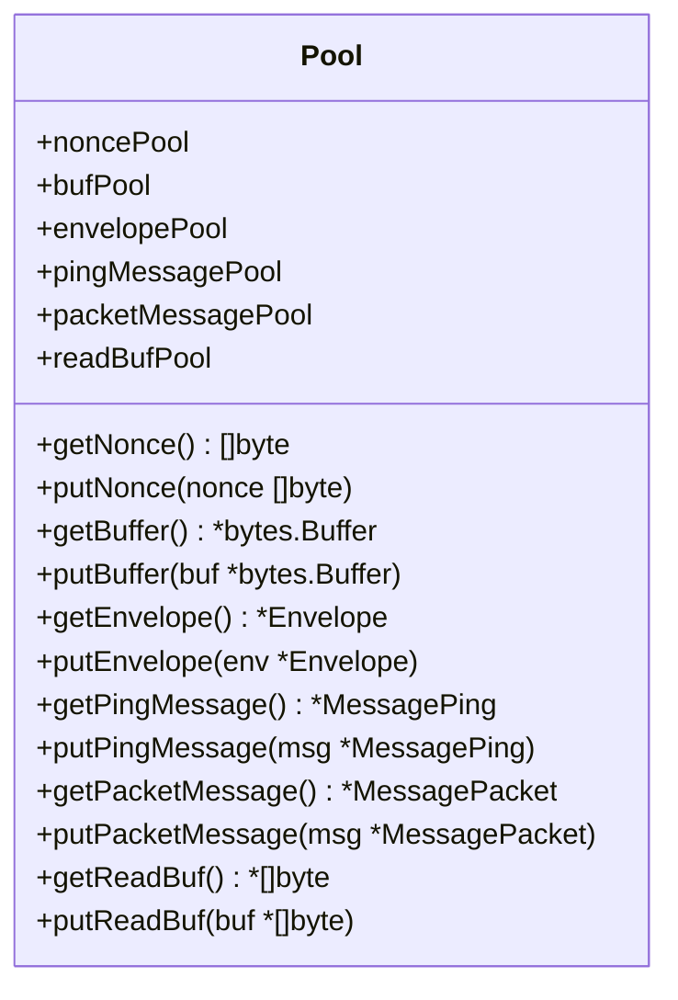
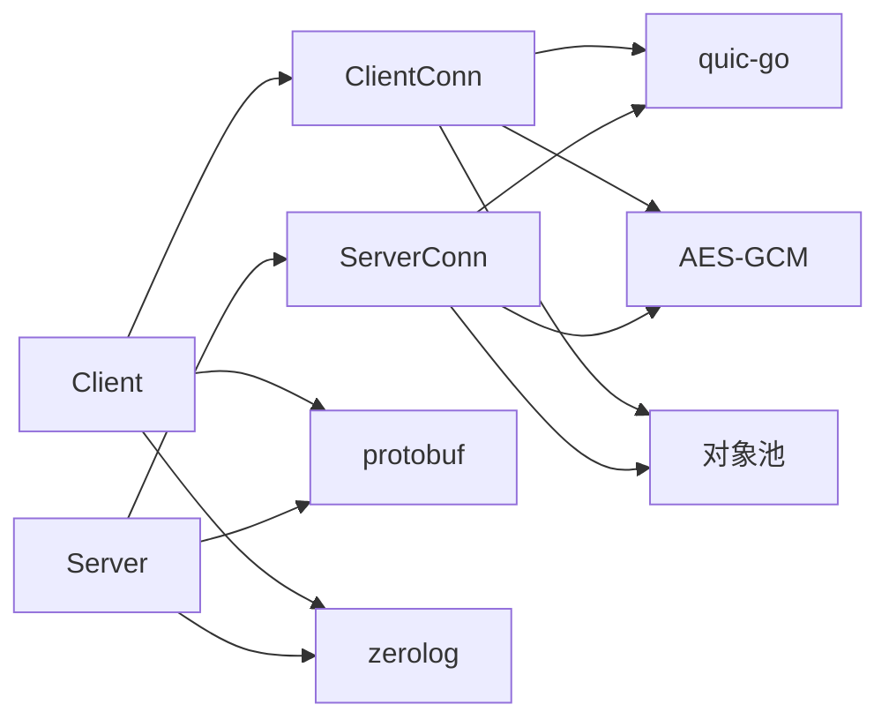

# 传输层架构

<cite>
**本文引用的文件列表**
- [main.go](file://main.go)
- [config/config.go](file://config/config.go)
- [qtun/app.go](file://qtun/app.go)
- [transport/client.go](file://transport/client.go)
- [transport/client_conn.go](file://transport/client_conn.go)
- [transport/server.go](file://transport/server.go)
- [transport/server_conn.go](file://transport/server_conn.go)
- [transport/crypto.go](file://transport/crypto.go)
- [transport/pool.go](file://transport/pool.go)
- [transport/grpc_handler.go](file://transport/grpc_handler.go)
- [PERFORMANCE_TEST_GUIDE.md](file://PERFORMANCE_TEST_GUIDE.md)
</cite>

## 目录
1. [简介](#简介)
2. [项目结构](#项目结构)
3. [核心组件](#核心组件)
4. [架构总览](#架构总览)
5. [详细组件分析](#详细组件分析)
6. [依赖关系分析](#依赖关系分析)
7. [性能考量与优化](#性能考量与优化)
8. [故障诊断与排错指南](#故障诊断与排错指南)
9. [结论](#结论)

## 简介
本文件面向传输层架构，围绕基于 QUIC 的传输实现展开，涵盖连接建立、数据传输、连接管理、加密机制、并发控制与多连接管理、对象池与连接池、性能优化策略以及监控与故障诊断。文档以仓库源码为依据，通过图示与分层讲解帮助读者快速理解系统设计与实现细节。

## 项目结构
传输层位于 transport 目录，配合 qtun 应用层、配置模块与工具模块协同工作。应用入口在 main.go，配置由 config 模块提供，日志使用 utils/log。传输层内部包含客户端、服务端、连接封装、加密与对象池等模块。

图表来源
- [main.go](file://main.go#L1-L136)
- [config/config.go](file://config/config.go#L1-L24)
- [qtun/app.go](file://qtun/app.go#L1-L271)
- [transport/client.go](file://transport/client.go#L1-L223)
- [transport/client_conn.go](file://transport/client_conn.go#L1-L408)
- [transport/server.go](file://transport/server.go#L1-L219)
- [transport/server_conn.go](file://transport/server_conn.go#L1-L295)
- [transport/pool.go](file://transport/pool.go#L1-L108)
- [transport/crypto.go](file://transport/crypto.go#L1-L27)
- [transport/grpc_handler.go](file://transport/grpc_handler.go#L1-L7)

章节来源
- [main.go](file://main.go#L1-L136)
- [config/config.go](file://config/config.go#L1-L24)
- [qtun/app.go](file://qtun/app.go#L1-L271)

## 核心组件
- 客户端聚合器：负责启动多条传输线程、连接管理、心跳与负载均衡选择连接。
- 客户端连接：封装 QUIC 流与会话，负责读写、加解密、通道与重连。
- 服务端聚合器：监听 QUIC 地址，接受连接并维护连接表。
- 服务端连接：封装 QUIC 流与会话，负责读写、加解密、通道与清理。
- 加密模块：基于 AES-GCM 的 AEAD 密码套件，支持 128/256 位密钥派生。
- 对象池：针对 nonce、缓冲区、protobuf 消息与读缓冲进行复用，降低 GC 压力。
- 回调接口：GrpcHandler 提供客户端与服务端的数据回调，便于应用层处理业务。

章节来源
- [transport/client.go](file://transport/client.go#L20-L29)
- [transport/client_conn.go](file://transport/client_conn.go#L24-L42)
- [transport/server.go](file://transport/server.go#L23-L35)
- [transport/server_conn.go](file://transport/server_conn.go#L24-L37)
- [transport/crypto.go](file://transport/crypto.go#L10-L26)
- [transport/pool.go](file://transport/pool.go#L10-L50)
- [transport/grpc_handler.go](file://transport/grpc_handler.go#L3-L6)

## 架构总览
传输层采用“应用层 + 传输层”的分层设计。应用层负责 TUN 接口读取与路由决策，传输层负责 QUIC 连接、消息编解码与加解密。客户端与服务端均通过对象池与通道模型实现高并发与低延迟。

图表来源
- [qtun/app.go](file://qtun/app.go#L99-L167)
- [transport/client.go](file://transport/client.go#L114-L132)
- [transport/client_conn.go](file://transport/client_conn.go#L241-L294)
- [transport/server_conn.go](file://transport/server_conn.go#L167-L220)

## 详细组件分析

### 客户端聚合器与连接管理
- 多线程启动：按配置的线程数创建多个 ClientConn，每个线程独立维护连接与通道。
- 连接生命周期：初始化后尝试建立 QUIC 连接，失败则重试；退出时关闭通道并等待子协程结束。
- 心跳与存活：周期性发送 Ping，维持连接活跃度。
- 负载均衡：原子递增序列号对线程数取模，实现简单轮询。

图表来源
- [transport/client.go](file://transport/client.go#L20-L29)
- [transport/client_conn.go](file://transport/client_conn.go#L24-L42)

章节来源
- [transport/client.go](file://transport/client.go#L41-L83)
- [transport/client.go](file://transport/client.go#L114-L132)
- [transport/client.go](file://transport/client.go#L142-L157)
- [transport/client.go](file://transport/client.go#L167-L176)
- [transport/client.go](file://transport/client.go#L208-L222)
- [transport/client_conn.go](file://transport/client_conn.go#L130-L151)
- [transport/client_conn.go](file://transport/client_conn.go#L153-L188)
- [transport/client_conn.go](file://transport/client_conn.go#L190-L196)
- [transport/client_conn.go](file://transport/client_conn.go#L204-L239)
- [transport/client_conn.go](file://transport/client_conn.go#L296-L302)

### 服务端聚合器与连接管理
- QUIC 监听：使用 quic-go 监听地址，配置较大的流与连接接收窗口，启用 KeepAlive 与 datagram 支持。
- 连接表：使用 sync.Map 维护双向映射，支持快速查找与删除。
- 清理策略：读线程退出时触发清理，定期清理无效路由与连接。

图表来源
- [transport/server.go](file://transport/server.go#L23-L35)
- [transport/server_conn.go](file://transport/server_conn.go#L24-L37)

章节来源
- [transport/server.go](file://transport/server.go#L48-L76)
- [transport/server.go](file://transport/server.go#L91-L149)
- [transport/server.go](file://transport/server.go#L151-L173)
- [transport/server.go](file://transport/server.go#L175-L219)
- [transport/server_conn.go](file://transport/server_conn.go#L58-L115)
- [transport/server_conn.go](file://transport/server_conn.go#L117-L127)
- [transport/server_conn.go](file://transport/server_conn.go#L129-L165)
- [transport/server_conn.go](file://transport/server_conn.go#L167-L220)
- [transport/server_conn.go](file://transport/server_conn.go#L251-L290)

### 加密机制与密钥派生
- AEAD 套件：使用 AES-GCM，分别支持 128 位与 256 位密钥派生（MD5/SHA256）。
- 加密流程：发送前生成随机 nonce，使用 AEAD Seal/Open 完成加解密；明文路径仅在禁用加密时启用。
- 对象池复用：nonce 使用固定长度池，避免频繁分配。

图表来源
- [transport/crypto.go](file://transport/crypto.go#L10-L26)
- [transport/client_conn.go](file://transport/client_conn.go#L241-L294)
- [transport/server_conn.go](file://transport/server_conn.go#L167-L220)
- [transport/pool.go](file://transport/pool.go#L53-L61)

章节来源
- [transport/crypto.go](file://transport/crypto.go#L10-L26)
- [transport/client_conn.go](file://transport/client_conn.go#L119-L128)
- [transport/client_conn.go](file://transport/client_conn.go#L241-L294)
- [transport/server_conn.go](file://transport/server_conn.go#L117-L127)
- [transport/server_conn.go](file://transport/server_conn.go#L167-L220)
- [transport/pool.go](file://transport/pool.go#L53-L61)

### 并发控制与多连接管理
- 通道缓冲：读写通道均设置缓冲，减少阻塞与上下文切换。
- 读写分离：每条连接独立的读/写协程，避免共享状态竞争。
- 锁策略：客户端聚合器使用 RWMutex 保护连接数组；服务端使用 sync.Map 无锁读取，必要时使用 Mutex 保护关键路径。
- 连接恢复：读写协程异常时关闭连接并触发重连循环。

图表来源
- [transport/client_conn.go](file://transport/client_conn.go#L153-L188)
- [transport/client_conn.go](file://transport/client_conn.go#L204-L239)
- [transport/server_conn.go](file://transport/server_conn.go#L251-L290)

章节来源
- [transport/client.go](file://transport/client.go#L24-L29)
- [transport/server.go](file://transport/server.go#L29-L35)
- [transport/client_conn.go](file://transport/client_conn.go#L44-L56)
- [transport/server_conn.go](file://transport/server_conn.go#L39-L51)

### 对象池与连接池
- 对象池：nonce、bytes.Buffer、protobuf Envelope/Ping/Packet、读缓冲等均使用 sync.Pool 复用。
- 连接池：当前实现为“多连接”而非“连接池”，通过多线程 ClientConn 管理多条 QUIC 连接，结合通道与对象池实现高并发。
- 复用策略：Marshal 前从池中获取对象，Marshal 后立即归还，避免临时对象泄漏。

图表来源
- [transport/pool.go](file://transport/pool.go#L10-L108)

章节来源
- [transport/pool.go](file://transport/pool.go#L10-L108)
- [transport/client.go](file://transport/client.go#L184-L206)
- [transport/client.go](file://transport/client.go#L209-L222)
- [transport/server_conn.go](file://transport/server_conn.go#L235-L249)

### 数据传输与协议
- 消息封装：使用 protobuf Envelope 包裹 Ping 与 Packet 消息，统一序列化/反序列化。
- 传输格式：二进制头包含加密标志与数据长度，随后为明文或密文，最后为 nonce。
- 应用层对接：通过 GrpcHandler 回调，应用层负责路由与 TUN 写入。

章节来源
- [transport/client.go](file://transport/client.go#L184-L206)
- [transport/client.go](file://transport/client.go#L209-L222)
- [transport/server_conn.go](file://transport/server_conn.go#L235-L249)
- [transport/grpc_handler.go](file://transport/grpc_handler.go#L3-L6)

## 依赖关系分析
- QUIC 协议栈：客户端与服务端均依赖 quic-go，配置了较大的窗口与 KeepAlive。
- 日志系统：使用 zerolog 输出结构化日志，便于监控与排错。
- 序列化：使用 protobuf 对消息进行编码，配合对象池减少分配。
- 并发原语：RWMutex、sync.Map、通道与 WaitGroup 组合实现高性能并发。

图表来源
- [transport/client_conn.go](file://transport/client_conn.go#L95-L117)
- [transport/server_conn.go](file://transport/server_conn.go#L1-L20)
- [transport/pool.go](file://transport/pool.go#L1-L108)
- [transport/crypto.go](file://transport/crypto.go#L1-L27)

章节来源
- [transport/client_conn.go](file://transport/client_conn.go#L95-L117)
- [transport/server_conn.go](file://transport/server_conn.go#L1-L20)
- [transport/pool.go](file://transport/pool.go#L1-L108)
- [transport/crypto.go](file://transport/crypto.go#L1-L27)

## 性能考量与优化
- QUIC 参数优化：增大 MaxIncomingStreams、MaxStreamReceiveWindow、MaxConnectionReceiveWindow，启用 KeepAlive 与 datagrams。
- 缓冲区优化：读写缓冲区扩容至 64KB，减少系统调用次数。
- 对象池优化：nonce、Buffer、protobuf 消息与读缓冲池复用，显著降低 GC 压力。
- 通道缓冲：读写通道设置缓冲，减少阻塞与上下文切换。
- 动态工作线程：TUN 数据包处理线程数为 CPU 核心数的 2 倍（最小 4，最大 32），提升 I/O 并行度。
- 锁优化：服务端使用 sync.Map 无锁读取，减少锁竞争；应用层读操作使用 RLock，缩小临界区。

章节来源
- [transport/server.go](file://transport/server.go#L96-L103)
- [transport/client_conn.go](file://transport/client_conn.go#L332-L332)
- [transport/server_conn.go](file://transport/server_conn.go#L89-L89)
- [transport/pool.go](file://transport/pool.go#L10-L50)
- [qtun/app.go](file://qtun/app.go#L79-L97)
- [qtun/app.go](file://qtun/app.go#L114-L161)

## 故障诊断与排错指南
- 连接失败：检查 QUIC TLS 配置与 KeepAlive 设置；确认服务端证书生成与客户端 NextProto 匹配。
- 读写异常：关注读写协程的 panic 恢复与连接关闭逻辑；检查通道是否被关闭或阻塞。
- 密钥不匹配：服务端在解密失败时返回特定错误，需核对两端密钥一致。
- 路由失效：应用层定时清理无效连接与路由；服务端删除死连接。
- 监控与分析：利用 statsviz 与 pprof 进行实时可视化与性能剖析；参考性能测试指南进行基准测试与稳定性验证。

章节来源
- [transport/server.go](file://transport/server.go#L151-L173)
- [transport/server_conn.go](file://transport/server_conn.go#L98-L107)
- [qtun/app.go](file://qtun/app.go#L51-L70)
- [PERFORMANCE_TEST_GUIDE.md](file://PERFORMANCE_TEST_GUIDE.md#L136-L323)

## 结论
该传输层以 QUIC 为核心，结合对象池、通道模型与锁优化，在保证安全性的同时实现了高并发与低延迟的数据传输。通过合理的缓冲区与窗口配置、动态工作线程与无锁读取，系统在复杂网络环境下具备良好的稳定性与可扩展性。建议在生产环境中持续使用性能测试与监控工具进行回归验证，并根据实际场景调整 QUIC 参数与对象池容量。