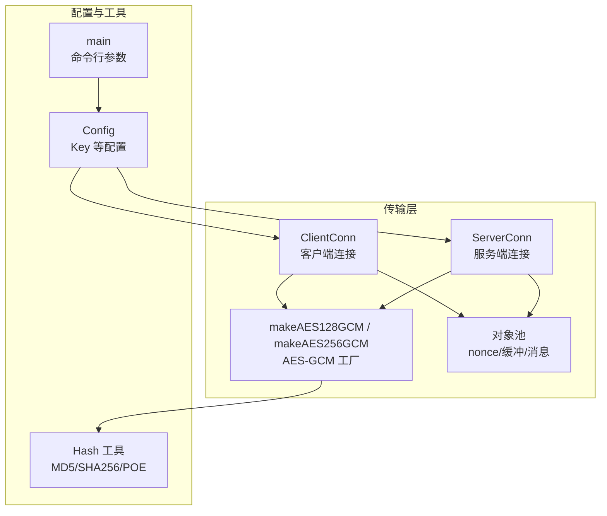
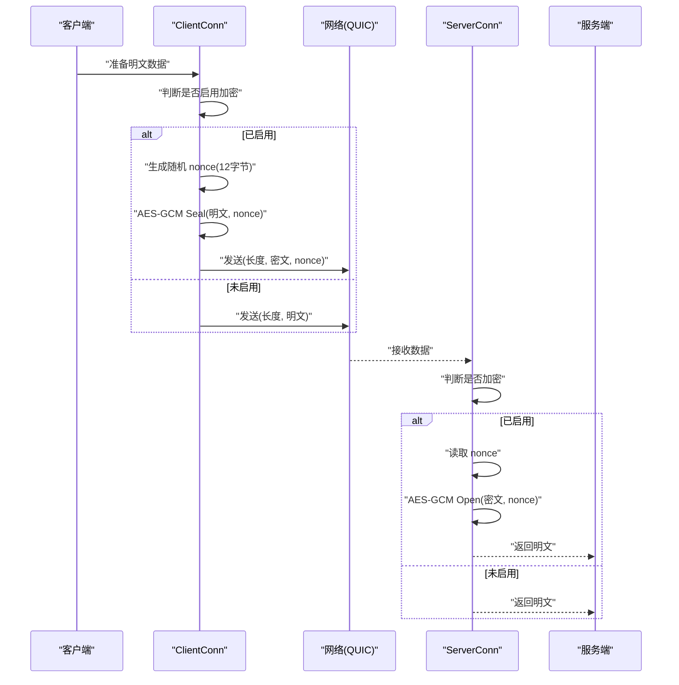
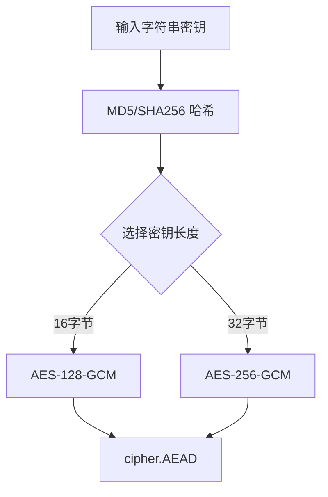
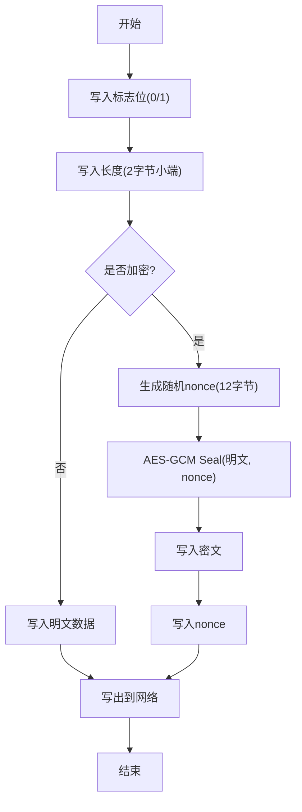
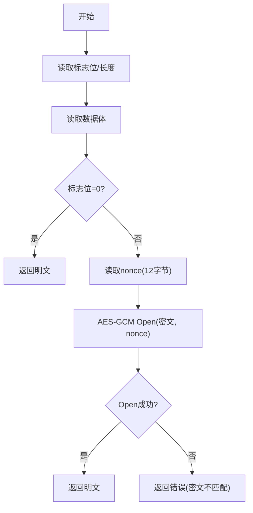
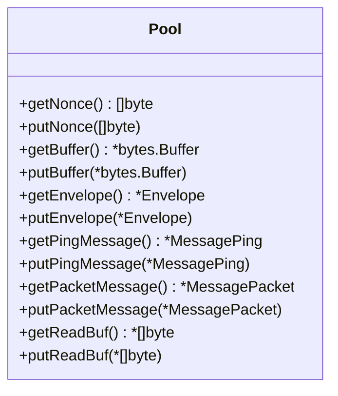
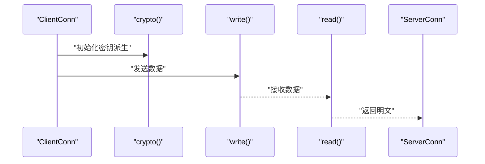
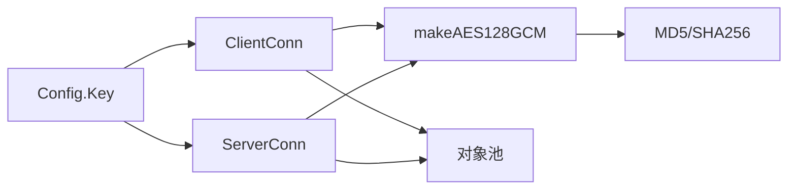

# 加密机制

<cite>
**本文引用的文件**
- [crypto.go](file://transport/crypto.go)
- [client_conn.go](file://transport/client_conn.go)
- [server_conn.go](file://transport/server_conn.go)
- [pool.go](file://transport/pool.go)
- [config.go](file://config/config.go)
- [main.go](file://main.go)
- [hash.go](file://utils/hash.go)
- [PERFORMANCE_TEST_GUIDE.md](file://PERFORMANCE_TEST_GUIDE.md)
</cite>

## 目录
1. [简介](#简介)
2. [项目结构](#项目结构)
3. [核心组件](#核心组件)
4. [架构总览](#架构总览)
5. [组件详解](#组件详解)
6. [依赖关系分析](#依赖关系分析)
7. [性能考量](#性能考量)
8. [故障排查指南](#故障排查指南)
9. [结论](#结论)
10. [附录](#附录)

## 简介
本文件系统性梳理 qtun 的加密机制实现，重点覆盖：
- AES-GCM 在传输层的封装与使用
- 密钥来源与派生方式
- 明文/密文与认证标签的打包与解析
- 完整性校验与错误处理
- 性能优化（对象池、缓冲区、QUIC 参数）
- 安全最佳实践与配置建议
- 测试与安全审计要点

注意：当前代码库中仅实现了基于字符串密钥派生的 AES-128-GCM（或备用的 AES-256-GCM 工厂函数），并未实现密钥交换与密钥轮换。

## 项目结构
与加密相关的核心文件集中在 transport 层，配合配置与工具模块：
- transport/crypto.go：AES-GCM 工厂与密钥派生
- transport/client_conn.go / server_conn.go：读写路径、加解密与完整性校验
- transport/pool.go：对象池（nonce、缓冲、protobuf 消息等）
- config/config.go：全局配置（含密钥 Key）
- utils/hash.go：哈希工具（MD5、SHA256、POE）
- main.go：命令行参数与初始化
- PERFORMANCE_TEST_GUIDE.md：性能测试与分析指引

图表来源
- [client_conn.go](file://transport/client_conn.go#L24-L56)
- [server_conn.go](file://transport/server_conn.go#L24-L51)
- [crypto.go](file://transport/crypto.go#L10-L26)
- [pool.go](file://transport/pool.go#L11-L50)
- [config.go](file://config/config.go#L3-L13)
- [main.go](file://main.go#L22-L68)

章节来源
- [client_conn.go](file://transport/client_conn.go#L1-L408)
- [server_conn.go](file://transport/server_conn.go#L1-L295)
- [crypto.go](file://transport/crypto.go#L1-L27)
- [pool.go](file://transport/pool.go#L1-L107)
- [config.go](file://config/config.go#L1-L24)
- [main.go](file://main.go#L1-L136)

## 核心组件
- AES-GCM 工厂：根据输入字符串派生固定长度密钥，构造 AEAD
- 客户端/服务端连接：负责握手后数据的加密封装与解密验证
- 对象池：复用 nonce、缓冲区与 protobuf 消息，降低分配与 GC 压力
- 配置：从命令行注入密钥，控制传输线程与 NoDelay 行为

章节来源
- [crypto.go](file://transport/crypto.go#L10-L26)
- [client_conn.go](file://transport/client_conn.go#L24-L56)
- [server_conn.go](file://transport/server_conn.go#L24-L51)
- [pool.go](file://transport/pool.go#L11-L50)
- [config.go](file://config/config.go#L3-L13)

## 架构总览
下图展示客户端与服务端在建立连接后，如何对应用层数据进行加密封装与解密验证。

图表来源
- [client_conn.go](file://transport/client_conn.go#L241-L294)
- [server_conn.go](file://transport/server_conn.go#L167-L220)

## 组件详解

### AES-GCM 工厂与密钥派生
- makeAES128GCM：对输入字符串执行 MD5，得到 16 字节密钥，构造 AES-128-GCM
- makeAES256GCM：对输入字符串执行 SHA256，得到 32 字节密钥，构造 AES-256-GCM
- 注意：当前读写路径使用 makeAES128GCM；makeAES256GCM 作为备用工厂存在

图表来源
- [crypto.go](file://transport/crypto.go#L10-L26)
- [hash.go](file://utils/hash.go#L11-L27)

章节来源
- [crypto.go](file://transport/crypto.go#L10-L26)
- [hash.go](file://utils/hash.go#L11-L27)

### 明文处理与密文生成
- 发送路径（客户端/服务端一致）：
  - 写入标志位：0 表示明文，1 表示加密
  - 写入长度字段（2字节无符号小端）
  - 写入数据体（明文或密文）
  - 若加密：追加 12 字节随机 nonce
  - 通过 QUIC 流写出

图表来源
- [client_conn.go](file://transport/client_conn.go#L241-L294)
- [server_conn.go](file://transport/server_conn.go#L167-L220)

章节来源
- [client_conn.go](file://transport/client_conn.go#L241-L294)
- [server_conn.go](file://transport/server_conn.go#L167-L220)

### 完整性验证与解密
- 接收路径（客户端/服务端一致）：
  - 读取标志位与长度
  - 读取数据体
  - 若标志位为 0：直接返回明文
  - 若标志位为 1：读取 12 字节 nonce，执行 AES-GCM Open
  - 返回明文或报错（如认证失败）

图表来源
- [client_conn.go](file://transport/client_conn.go#L359-L394)
- [server_conn.go](file://transport/server_conn.go#L129-L165)

章节来源
- [client_conn.go](file://transport/client_conn.go#L359-L394)
- [server_conn.go](file://transport/server_conn.go#L129-L165)

### 对象池与内存对齐
- nonce 池：固定 12 字节，避免每次分配
- 缓冲池：重用 bytes.Buffer
- protobuf 消息池：复用 Envelope/Ping/Packet
- 读缓冲池：64KB 大缓冲，提升吞吐

图表来源
- [pool.go](file://transport/pool.go#L11-L107)

章节来源
- [pool.go](file://transport/pool.go#L11-L107)

### 密钥生成、密钥交换与密钥轮换
- 密钥生成：字符串密钥经 MD5/SHA256 派生为固定长度密钥
- 密钥交换：未实现（当前为静态密钥）
- 密钥轮换：未实现（当前为静态密钥）

章节来源
- [crypto.go](file://transport/crypto.go#L10-L26)
- [config.go](file://config/config.go#L3-L13)

### 数据加密与解密流程（代码级）
- 客户端发送：见 write() 与 read() 的调用链
- 服务端接收：见 read() 与 write() 的调用链

图表来源
- [client_conn.go](file://transport/client_conn.go#L119-L128)
- [client_conn.go](file://transport/client_conn.go#L241-L294)
- [client_conn.go](file://transport/client_conn.go#L359-L394)
- [server_conn.go](file://transport/server_conn.go#L117-L127)
- [server_conn.go](file://transport/server_conn.go#L167-L220)
- [server_conn.go](file://transport/server_conn.go#L129-L165)

## 依赖关系分析
- ClientConn/ServerConn 依赖 AES-GCM 工厂与哈希工具
- 两者均依赖对象池以降低分配
- 配置通过命令行注入密钥，影响加密开关与行为

图表来源
- [config.go](file://config/config.go#L3-L13)
- [client_conn.go](file://transport/client_conn.go#L24-L56)
- [server_conn.go](file://transport/server_conn.go#L24-L51)
- [crypto.go](file://transport/crypto.go#L10-L26)
- [hash.go](file://utils/hash.go#L11-L27)
- [pool.go](file://transport/pool.go#L11-L50)

章节来源
- [config.go](file://config/config.go#L3-L13)
- [client_conn.go](file://transport/client_conn.go#L24-L56)
- [server_conn.go](file://transport/server_conn.go#L24-L51)
- [crypto.go](file://transport/crypto.go#L10-L26)
- [hash.go](file://utils/hash.go#L11-L27)
- [pool.go](file://transport/pool.go#L11-L50)

## 性能考量
- 对象池：nonce、缓冲、protobuf 消息池显著降低分配与 GC 压力
- 大缓冲：读写缓冲提升吞吐，减少系统调用
- QUIC 参数：较大的流/连接接收窗口、保活周期、启用 datagram
- 并发线程：客户端可配置多线程传输通道
- 随机数：使用 crypto/rand 获取强随机 nonce

章节来源
- [pool.go](file://transport/pool.go#L11-L107)
- [client_conn.go](file://transport/client_conn.go#L84-L91)
- [server_conn.go](file://transport/server_conn.go#L97-L103)
- [config.go](file://config/config.go#L7-L12)
- [PERFORMANCE_TEST_GUIDE.md](file://PERFORMANCE_TEST_GUIDE.md#L1-L323)

## 故障排查指南
- 密文不匹配错误
  - 现象：解密阶段返回“密文不匹配”错误
  - 可能原因：密钥不一致、nonce 被篡改、数据损坏
  - 排查：确认两端密钥一致；检查网络层中间件；核对长度/nonce 序列
- 加密关闭误判
  - 现象：一端启用加密，另一端未启用
  - 排查：确保两端配置一致；检查配置加载逻辑
- 性能异常
  - 排查：使用性能测试指南中的工具与脚本定位 CPU/内存/Goroutine 指标

章节来源
- [server_conn.go](file://transport/server_conn.go#L98-L102)
- [client_conn.go](file://transport/client_conn.go#L119-L128)
- [server_conn.go](file://transport/server_conn.go#L117-L127)
- [PERFORMANCE_TEST_GUIDE.md](file://PERFORMANCE_TEST_GUIDE.md#L286-L323)

## 结论
- 当前实现采用静态密钥派生与 AES-GCM，满足基本保密性与完整性需求
- 通过对象池、大缓冲与 QUIC 参数优化，获得较好的吞吐与延迟表现
- 密钥交换与轮换尚未实现，建议后续引入 TLS 握手或 KEX 协议，并设计密钥轮换策略

## 附录

### 加密配置选项与调优建议
- 关键配置
  - Key：字符串密钥，决定派生密钥（MD5/SHA256）
  - TransportThreads：传输并发线程数
  - NoDelay：底层 TCP/QUIC 行为（当前代码注释掉相关设置）
- 安全参数建议
  - 使用足够强度的 Key（建议至少 16 字节随机字符）
  - 保持两端配置一致，避免混合明文/加密
  - 如需更强安全，考虑启用 makeAES256GCM 并统一密钥长度

章节来源
- [config.go](file://config/config.go#L3-L13)
- [main.go](file://main.go#L22-L68)
- [crypto.go](file://transport/crypto.go#L10-L26)

### 测试方法与安全审计要点
- 功能测试
  - 明文/加密双通测试：验证读写路径一致性
  - 错误注入测试：篡改密文/nonce，验证解密失败
- 性能测试
  - 使用性能测试指南中的场景与脚本，关注吞吐、延迟与资源使用
- 安全审计
  - 密钥管理：避免硬编码密钥；建议外部化配置与密钥轮换
  - 随机性：确认 nonce 来源于强随机源
  - 侧信道：避免泄露明文长度等信息；评估分支与内存访问模式
  - 完整性：确保认证标签始终参与校验

章节来源
- [PERFORMANCE_TEST_GUIDE.md](file://PERFORMANCE_TEST_GUIDE.md#L1-L323)
- [client_conn.go](file://transport/client_conn.go#L266-L273)
- [server_conn.go](file://transport/server_conn.go#L192-L199)