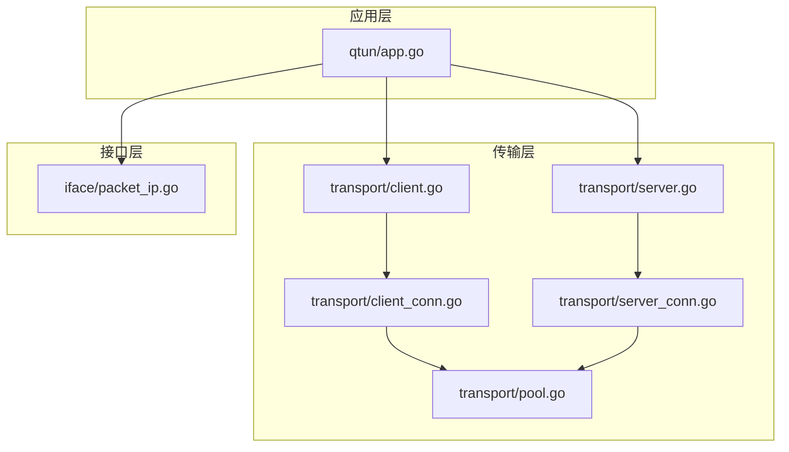
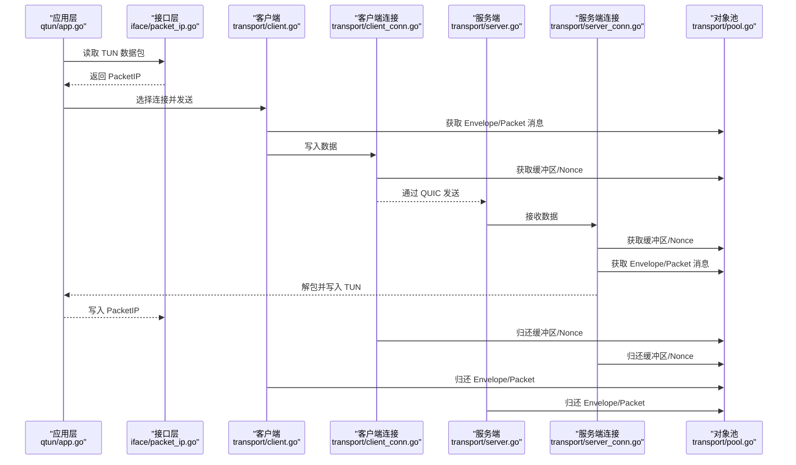
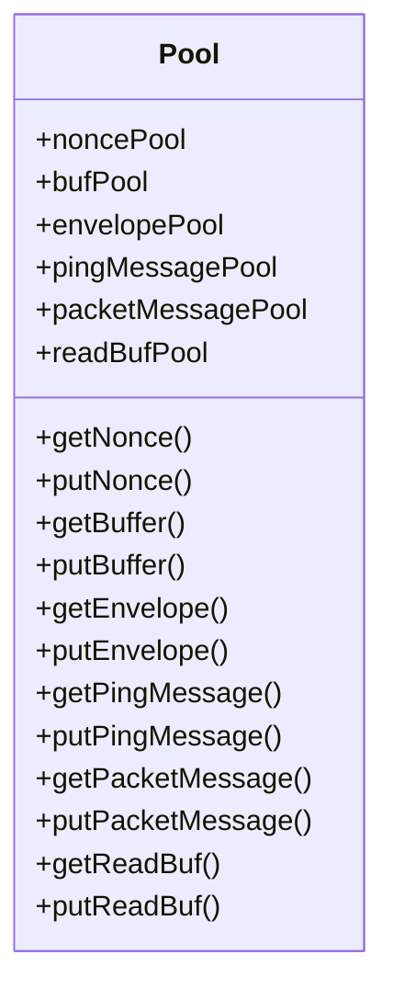
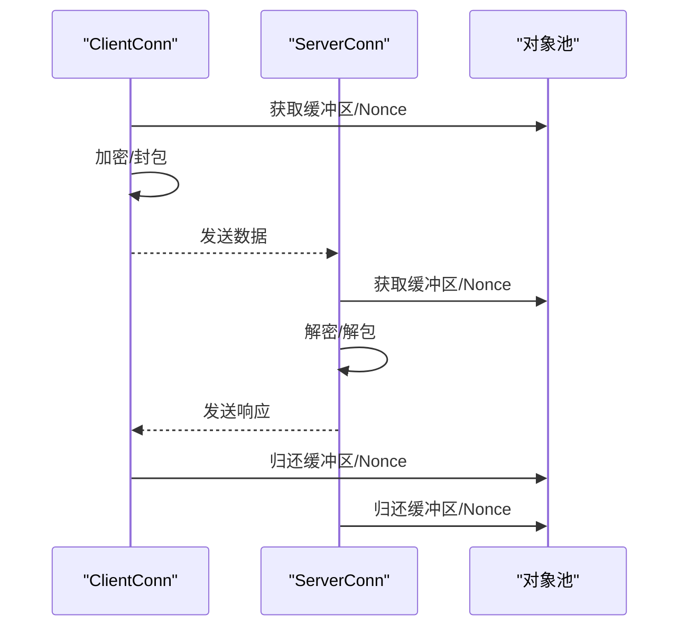
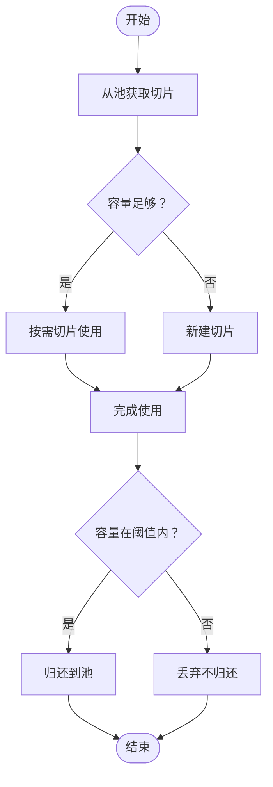
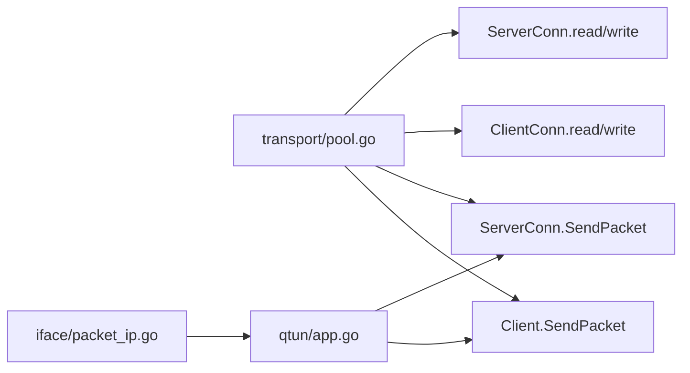

# 对象池优化

<cite>
**本文引用的文件**
- [transport/pool.go](file://transport/pool.go)
- [transport/client.go](file://transport/client.go)
- [transport/server.go](file://transport/server.go)
- [transport/server_conn.go](file://transport/server_conn.go)
- [transport/client_conn.go](file://transport/client_conn.go)
- [iface/packet_ip.go](file://iface/packet_ip.go)
- [qtun/app.go](file://qtun/app.go)
- [PERFORMANCE_TEST_GUIDE.md](file://PERFORMANCE_TEST_GUIDE.md)
- [config/config.go](file://config/config.go)
</cite>

## 目录
1. [简介](#简介)
2. [项目结构](#项目结构)
3. [核心组件](#核心组件)
4. [架构总览](#架构总览)
5. [详细组件分析](#详细组件分析)
6. [依赖关系分析](#依赖关系分析)
7. [性能考量与调优](#性能考量与调优)
8. [故障排查指南](#故障排查指南)
9. [结论](#结论)
10. [附录](#附录)

## 简介
本文件系统性阐述 qtun 项目中的对象池优化设计与实现，重点覆盖以下方面：
- 对象池的设计原理与实现机制：对象复用、内存池管理、垃圾回收优化
- 不同类型对象池的实现：连接对象池、数据包对象池、缓冲区对象池
- 容量管理策略：动态扩容、收缩阈值、内存压力处理
- 线程安全机制：基于 sync.Pool 的无锁复用、Reset 回收、边界校验
- 性能监控指标与调优建议：吞吐、延迟、CPU/内存占用、GC 影响
- 内存泄漏检测与性能分析方法：pprof、statsviz、日志观测

## 项目结构
本项目采用分层与功能模块化组织方式：
- transport 层：传输通道与连接管理（Client/Server 及其连接对象），以及统一的对象池集中定义
- iface 层：网络接口抽象与数据包封装（PacketIP）
- qtun 层：应用入口与业务调度（TUN 数据读取、路由、转发）
- utils/config/performance：工具与配置、性能测试指南

**图表来源**
- [qtun/app.go](file://qtun/app.go#L72-L167)
- [transport/client.go](file://transport/client.go#L1-L223)
- [transport/server.go](file://transport/server.go#L1-L219)
- [transport/client_conn.go](file://transport/client_conn.go#L1-L408)
- [transport/server_conn.go](file://transport/server_conn.go#L1-L295)
- [transport/pool.go](file://transport/pool.go#L1-L108)
- [iface/packet_ip.go](file://iface/packet_ip.go#L1-L47)

**章节来源**
- [qtun/app.go](file://qtun/app.go#L1-L271)
- [transport/pool.go](file://transport/pool.go#L1-L108)
- [transport/client.go](file://transport/client.go#L1-L223)
- [transport/server.go](file://transport/server.go#L1-L219)
- [transport/client_conn.go](file://transport/client_conn.go#L1-L408)
- [transport/server_conn.go](file://transport/server_conn.go#L1-L295)
- [iface/packet_ip.go](file://iface/packet_ip.go#L1-L47)

## 核心组件
- 对象池集中定义：在 transport 层集中声明与导出各类对象池与辅助函数，确保全工程复用
- 连接对象池：ClientConn/ServerConn 作为连接级对象池的使用者，负责生命周期与并发控制
- 数据包对象池：PacketIP 作为二进制数据包载体，提供池化构造与回收
- 缓冲区对象池：读写缓冲、临时字节切片等，减少频繁分配

**章节来源**
- [transport/pool.go](file://transport/pool.go#L1-L108)
- [iface/packet_ip.go](file://iface/packet_ip.go#L1-L47)
- [transport/client_conn.go](file://transport/client_conn.go#L1-L408)
- [transport/server_conn.go](file://transport/server_conn.go#L1-L295)

## 架构总览
对象池贯穿数据从 TUN 到网络的全链路：
- 应用层从 TUN 读取 PacketIP，经路由选择后通过连接对象发送
- 发送路径中，使用对象池获取 protobuf 消息体与缓冲区，发送完成后重置并归还
- 接收路径中，同样通过对象池复用消息体与缓冲区，避免重复分配

**图表来源**
- [qtun/app.go](file://qtun/app.go#L99-L167)
- [transport/client.go](file://transport/client.go#L208-L222)
- [transport/server_conn.go](file://transport/server_conn.go#L235-L249)
- [transport/client_conn.go](file://transport/client_conn.go#L241-L294)
- [transport/pool.go](file://transport/pool.go#L53-L107)
- [iface/packet_ip.go](file://iface/packet_ip.go#L18-L39)

## 详细组件分析

### 对象池集中定义与使用
- noncePool：固定长度 12 字节一次性随机数，发送/接收加密时使用
- bufPool：*bytes.Buffer，每次使用前 Reset，结束后 Put 回池
- envelopePool/pingMessagePool/packetMessagePool：protobuf 消息体，Marshal 前后重置并归还
- readBufPool：64KB 读缓冲指针池，按需归还
- PacketIP：自定义切片类型，提供 NewPacketIP/PutPacketIP，按容量阈值回收

**图表来源**
- [transport/pool.go](file://transport/pool.go#L11-L107)

**章节来源**
- [transport/pool.go](file://transport/pool.go#L1-L108)

### 连接对象池（ClientConn/ServerConn）
- 生命周期：连接建立后进入读写协程；异常退出时关闭并清理
- 并发模型：写通道带缓冲，读循环持续消费；连接状态受互斥保护
- 对象池使用：发送/接收时从对象池获取缓冲区与 nonce，完成后归还

**图表来源**
- [transport/client_conn.go](file://transport/client_conn.go#L241-L294)
- [transport/server_conn.go](file://transport/server_conn.go#L167-L220)
- [transport/pool.go](file://transport/pool.go#L53-L107)

**章节来源**
- [transport/client_conn.go](file://transport/client_conn.go#L1-L408)
- [transport/server_conn.go](file://transport/server_conn.go#L1-L295)

### 数据包对象池（PacketIP）
- 构造：优先从池中取出切片，若容量不足则新建，避免小包反复扩容
- 回收：仅当容量处于合理范围（如以太网 MTU 至上限）才归还，防止“膨胀”对象污染池
- 用途：TUN 读取与发送的数据包载体

**图表来源**
- [iface/packet_ip.go](file://iface/packet_ip.go#L18-L39)

**章节来源**
- [iface/packet_ip.go](file://iface/packet_ip.go#L1-L47)

### 缓冲区对象池（读写缓冲）
- 读缓冲：ServerConn/ClientConn 初始化时分配 64KB 缓冲，避免频繁分配
- 写缓冲：*bytes.Buffer 作为中间缓冲，发送前写入长度与数据，完成后 Reset
- 对象池配合：在需要临时字节切片或大块缓冲时，优先从池中获取

**章节来源**
- [transport/server_conn.go](file://transport/server_conn.go#L39-L50)
- [transport/client_conn.go](file://transport/client_conn.go#L44-L55)
- [transport/pool.go](file://transport/pool.go#L45-L50)

### 线程安全机制
- sync.Pool：无锁对象池，Go 运行时内部维护 per-P 的本地缓存与中央队列，降低锁竞争
- Reset 回收：protobuf 消息体在归还前 Reset，避免跨协程状态污染
- 边界校验：如 noncePool 仅接受长度为 12 的切片，readBufPool 仅接受指针形式的切片，防止误用
- 连接状态保护：ClientConn/ServerConn 的连接状态字段使用互斥锁保护，避免竞态

**章节来源**
- [transport/pool.go](file://transport/pool.go#L57-L61)
- [transport/pool.go](file://transport/pool.go#L78-L81)
- [transport/client_conn.go](file://transport/client_conn.go#L198-L202)
- [transport/server_conn.go](file://transport/server_conn.go#L24-L37)

## 依赖关系分析
- 对象池依赖关系集中在 transport/pool.go，其他模块通过函数调用间接依赖
- 发送/接收路径中，protobuf 消息体与缓冲区依赖对象池；PacketIP 依赖 iface 层池
- 应用层通过路由选择连接，连接对象再通过对象池完成 IO

**图表来源**
- [transport/pool.go](file://transport/pool.go#L53-L107)
- [transport/client.go](file://transport/client.go#L208-L222)
- [transport/server_conn.go](file://transport/server_conn.go#L235-L249)
- [transport/client_conn.go](file://transport/client_conn.go#L241-L294)
- [qtun/app.go](file://qtun/app.go#L99-L167)
- [iface/packet_ip.go](file://iface/packet_ip.go#L18-L39)

**章节来源**
- [transport/pool.go](file://transport/pool.go#L1-L108)
- [transport/client.go](file://transport/client.go#L1-L223)
- [transport/server_conn.go](file://transport/server_conn.go#L1-L295)
- [transport/client_conn.go](file://transport/client_conn.go#L1-L408)
- [qtun/app.go](file://qtun/app.go#L1-L271)
- [iface/packet_ip.go](file://iface/packet_ip.go#L1-L47)

## 性能考量与调优
- 吞吐与延迟
  - QUIC 参数优化：增大流/连接接收窗口、启用 KeepAlive、允许 datagrams，提升并发与稳定性
  - 读写缓冲：64KB 大缓冲减少系统调用次数，提高吞吐
  - Worker 数：按 CPU 核心数动态扩展，最小 4、最大 32，平衡 I/O 并发
- CPU/内存占用
  - 对象池显著降低分配次数与 GC 压力；pprof allocs/heap 可验证回收效果
  - goroutine 数稳定，避免过度阻塞；channel 缓冲减少阻塞概率
- 监控与分析
  - pprof：CPU/Heap/Goroutine/Mutex 分析，定位热点与锁争用
  - statsviz：实时可视化 goroutine、内存、GC 状态
  - 日志：观察连接状态、通道阻塞、错误统计

**章节来源**
- [transport/server.go](file://transport/server.go#L97-L103)
- [transport/client_conn.go](file://transport/client_conn.go#L84-L91)
- [qtun/app.go](file://qtun/app.go#L79-L97)
- [PERFORMANCE_TEST_GUIDE.md](file://PERFORMANCE_TEST_GUIDE.md#L1-L323)

## 故障排查指南
- 内存泄漏检测
  - 使用 pprof heap/allocs 分析分配热点，确认对象池是否被正确使用
  - 观察 goroutine 数量趋势，异常增长可能意味着连接未正确关闭
- 性能问题定位
  - pprof mutex：检查是否存在锁争用导致的性能退化
  - statsviz：观察 GC pause、goroutine 数、内存曲线
- 常见问题
  - 对象池误用：非预期长度的切片归还会触发校验失败
  - 连接异常：读写循环捕获 panic 并清理资源，关注日志中的异常原因
  - 路由失效：定期清理死连接，避免无效转发

**章节来源**
- [transport/pool.go](file://transport/pool.go#L57-L61)
- [transport/server_conn.go](file://transport/server_conn.go#L58-L74)
- [qtun/app.go](file://qtun/app.go#L51-L70)
- [PERFORMANCE_TEST_GUIDE.md](file://PERFORMANCE_TEST_GUIDE.md#L286-L323)

## 结论
本项目通过集中式对象池、连接级池化与缓冲区池化，有效降低了分配频率与 GC 压力，提升了整体吞吐与稳定性。结合 QUIC 参数优化、动态 Worker 数与完善的监控体系，实现了可观的性能收益。建议在生产环境中持续使用 pprof 与 statsviz 进行回归监测，并根据业务负载调整对象池容量与连接数量。

## 附录
- 关键配置项
  - 传输线程数、MTU、是否启用 NoDelay 等影响对象池与连接行为
- 性能测试脚本与报告生成
  - 提供自动化基准脚本、稳定性测试与结果分析模板

**章节来源**
- [config/config.go](file://config/config.go#L3-L13)
- [PERFORMANCE_TEST_GUIDE.md](file://PERFORMANCE_TEST_GUIDE.md#L136-L323)