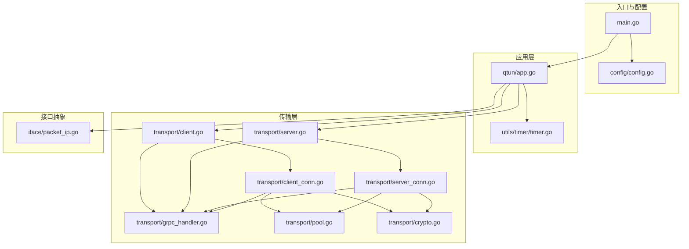
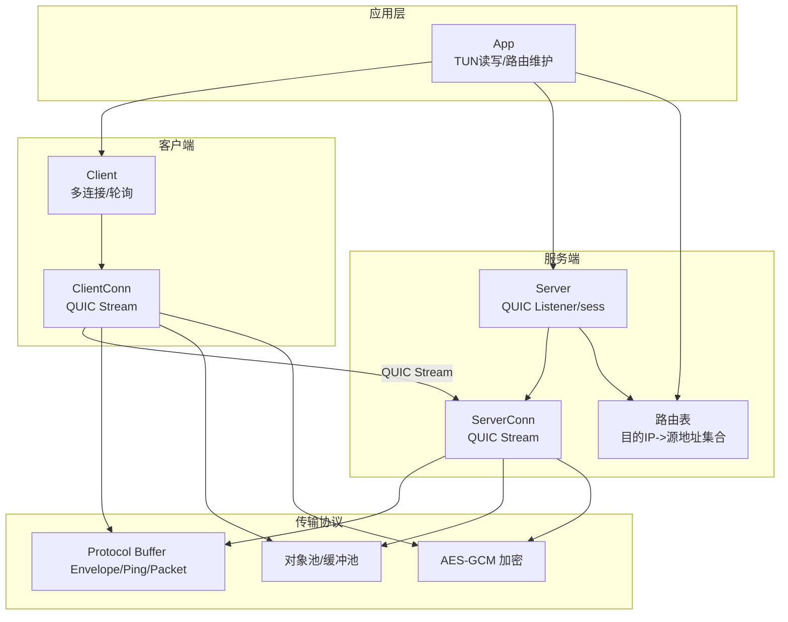
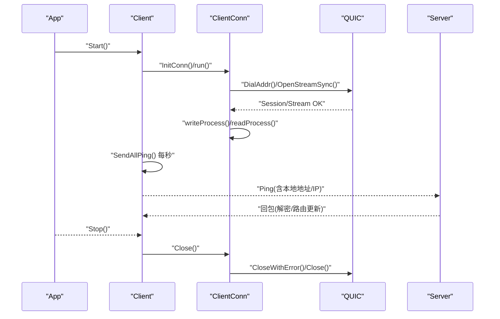
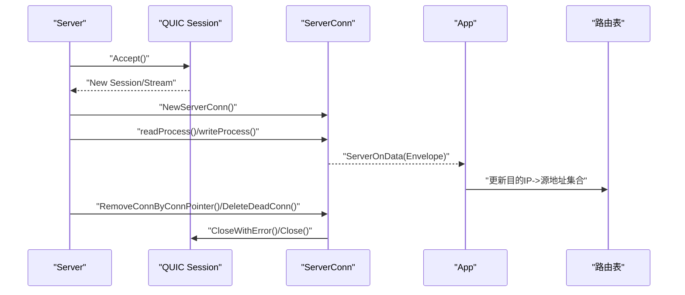
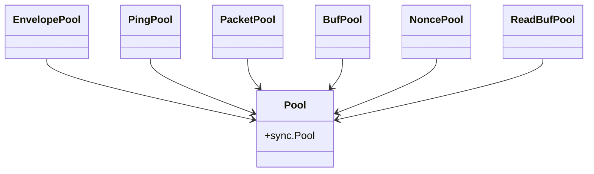
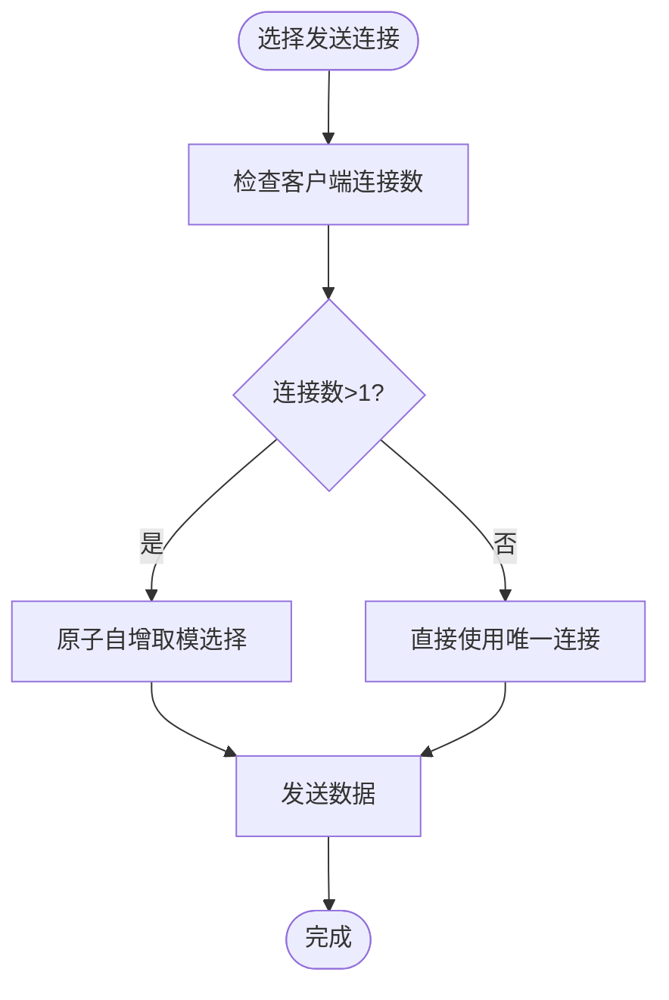
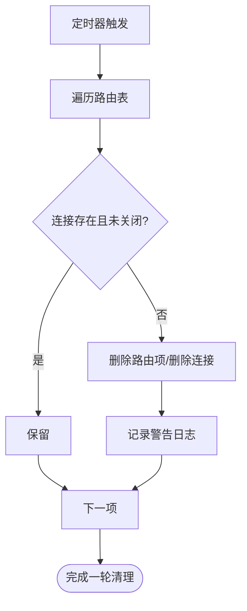
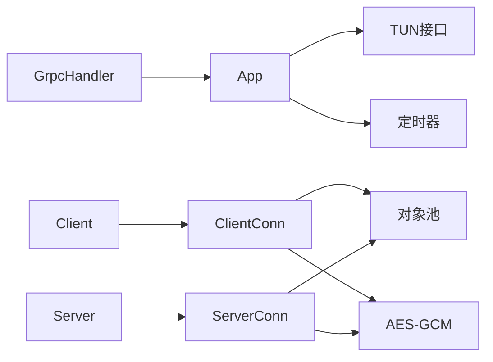

# 连接管理

<cite>
**本文引用的文件**
- [main.go](file://main.go)
- [config/config.go](file://config/config.go)
- [qtun/app.go](file://qtun/app.go)
- [transport/grpc_handler.go](file://transport/grpc_handler.go)
- [transport/pool.go](file://transport/pool.go)
- [transport/crypto.go](file://transport/crypto.go)
- [transport/client.go](file://transport/client.go)
- [transport/client_conn.go](file://transport/client_conn.go)
- [transport/server.go](file://transport/server.go)
- [transport/server_conn.go](file://transport/server_conn.go)
- [iface/packet_ip.go](file://iface/packet_ip.go)
- [utils/timer/timer.go](file://utils/timer/timer.go)
</cite>

## 目录
1. [简介](#简介)
2. [项目结构](#项目结构)
3. [核心组件](#核心组件)
4. [架构总览](#架构总览)
5. [详细组件分析](#详细组件分析)
6. [依赖关系分析](#依赖关系分析)
7. [性能考量与优化](#性能考量与优化)
8. [故障排查指南](#故障排查指南)
9. [结论](#结论)
10. [附录：监控指标与观测建议](#附录监控指标与观测建议)

## 简介
本文件聚焦于连接管理的完整技术文档，覆盖客户端与服务器端的连接生命周期（建立、维护、超时检测、优雅关闭）、连接池设计与实现（对象池、缓冲区池、内存优化）、多连接并发处理（连接数限制、负载均衡、故障转移）、连接状态监控与健康检查、以及性能优化技巧（连接预热、批量操作、异步处理）与监控指标及故障诊断方法。内容基于仓库中的传输层与应用层实现进行深入解析。

## 项目结构
连接管理相关代码主要分布在以下模块：
- 命令入口与配置：main.go、config/config.go
- 应用编排：qtun/app.go（负责TUN接口、路由表、定时清理、数据包收发）
- 传输层：transport/*（客户端、服务端、连接、对象池、加密）
- 接口抽象：iface/packet_ip.go（TUN数据包封装与池化）
- 定时器：utils/timer/timer.go（周期性任务）

图表来源
- [main.go](file://main.go#L70-L103)
- [config/config.go](file://config/config.go#L17-L23)
- [qtun/app.go](file://qtun/app.go#L37-L49)
- [transport/client.go](file://transport/client.go#L31-L39)
- [transport/server.go](file://transport/server.go#L37-L46)
- [transport/pool.go](file://transport/pool.go#L10-L51)
- [transport/crypto.go](file://transport/crypto.go#L10-L17)
- [iface/packet_ip.go](file://iface/packet_ip.go#L10-L39)
- [utils/timer/timer.go](file://utils/timer/timer.go#L14-L47)

章节来源
- [main.go](file://main.go#L70-L103)
- [config/config.go](file://config/config.go#L17-L23)
- [qtun/app.go](file://qtun/app.go#L37-L49)

## 核心组件
- 客户端连接管理：transport/client.go、transport/client_conn.go
- 服务端连接管理：transport/server.go、transport/server_conn.go
- 对象池与缓冲池：transport/pool.go
- 加密与密钥派生：transport/crypto.go
- 应用编排与路由：qtun/app.go、utils/timer/timer.go
- TUN数据包封装：iface/packet_ip.go

章节来源
- [transport/client.go](file://transport/client.go#L20-L29)
- [transport/server.go](file://transport/server.go#L23-L35)
- [transport/pool.go](file://transport/pool.go#L10-L51)
- [transport/crypto.go](file://transport/crypto.go#L10-L17)
- [qtun/app.go](file://qtun/app.go#L19-L27)
- [iface/packet_ip.go](file://iface/packet_ip.go#L10-L39)

## 架构总览
客户端与服务端均基于QUIC流进行数据传输，采用单连接多流模型；客户端通过多线程（多连接）提升并发能力；服务端使用sync.Map维护连接映射，支持按目的地址快速查找与反向映射；应用层在服务端侧维护“目的IP -> 源地址集合”的路由表，用于将入站数据包转发到正确的客户端连接。

图表来源
- [transport/client.go](file://transport/client.go#L114-L132)
- [transport/client_conn.go](file://transport/client_conn.go#L24-L56)
- [transport/server.go](file://transport/server.go#L175-L218)
- [transport/server_conn.go](file://transport/server_conn.go#L24-L51)
- [qtun/app.go](file://qtun/app.go#L169-L207)
- [transport/pool.go](file://transport/pool.go#L10-L51)
- [transport/crypto.go](file://transport/crypto.go#L10-L17)

## 详细组件分析

### 客户端连接生命周期与多连接并发
- 启动流程：初始化多个ClientConn，每个连接独立建立QUIC会话与双向流，启动读写协程；启动周期性Ping以维持活跃。
- 连接建立：尝试连接远端地址，失败则重试；成功后置为已连接。
- 维护与超时：通过QUIC配置启用保活与大窗口参数；客户端内部有Ping循环维持心跳。
- 优雅关闭：关闭写通道、等待WaitGroup、关闭底层会话。
- 多连接并发：Client按原子序号轮询选择连接，实现简单的多路复用与负载分摊。

图表来源
- [transport/client.go](file://transport/client.go#L41-L83)
- [transport/client.go](file://transport/client.go#L142-L157)
- [transport/client_conn.go](file://transport/client_conn.go#L130-L151)
- [transport/client_conn.go](file://transport/client_conn.go#L153-L188)
- [transport/server.go](file://transport/server.go#L112-L148)

章节来源
- [transport/client.go](file://transport/client.go#L41-L83)
- [transport/client.go](file://transport/client.go#L142-L157)
- [transport/client_conn.go](file://transport/client_conn.go#L130-L151)
- [transport/client_conn.go](file://transport/client_conn.go#L153-L188)
- [transport/client_conn.go](file://transport/client_conn.go#L190-L196)

### 服务端连接生命周期与路由管理
- 监听与接受：监听QUIC地址，接受新会话与流；为每个流创建ServerConn并启动读写协程。
- 路由建立：收到客户端Ping后，将“目的IP -> 源地址”加入路由表；同时通过双向映射维护连接索引。
- 路由清理：周期性扫描路由表，移除已关闭或失效连接，触发服务端删除死连接。
- 优雅关闭：读写协程退出时清理连接映射并关闭底层会话。

图表来源
- [transport/server.go](file://transport/server.go#L91-L149)
- [transport/server_conn.go](file://transport/server_conn.go#L58-L115)
- [qtun/app.go](file://qtun/app.go#L169-L207)
- [transport/server.go](file://transport/server.go#L183-L218)

章节来源
- [transport/server.go](file://transport/server.go#L91-L149)
- [transport/server_conn.go](file://transport/server_conn.go#L58-L115)
- [qtun/app.go](file://qtun/app.go#L169-L207)
- [transport/server.go](file://transport/server.go#L183-L218)

### 连接池设计与实现
- 对象池：Envelope、MessagePing、MessagePacket、bytes.Buffer、nonce、读缓冲等均使用sync.Pool复用，降低GC压力。
- 缓冲池：读缓冲固定64KB，减少系统调用与拷贝；写缓冲使用bytes.Buffer。
- 密钥派生：基于配置密钥生成AES-GCM上下文，统一在连接初始化阶段完成。

图表来源
- [transport/pool.go](file://transport/pool.go#L10-L51)

章节来源
- [transport/pool.go](file://transport/pool.go#L10-L51)
- [transport/crypto.go](file://transport/crypto.go#L10-L17)

### 多连接并发处理与负载均衡
- 客户端侧：Client持有多个ClientConn，Write/WriteNow通过原子自增取模实现简单轮询，达到基本的负载均衡。
- 服务端侧：路由表中同一目的IP可能对应多个源地址，应用层在发送时随机选择一个可用连接，实现端到端的负载分担。
- 连接数限制：由配置项TransportThreads控制客户端连接数量；服务端通过QUIC配置限制并发流与连接接收窗口。

图表来源
- [transport/client.go](file://transport/client.go#L114-L132)
- [qtun/app.go](file://qtun/app.go#L142-L161)

章节来源
- [transport/client.go](file://transport/client.go#L114-L132)
- [qtun/app.go](file://qtun/app.go#L142-L161)

### 连接状态监控与健康检查
- 心跳与存活：客户端每秒发送Ping，携带本地地址与IP；服务端收到后更新路由并维持连接映射。
- 死连接清理：服务端周期性扫描路由表，移除已关闭或无效连接，并从映射中删除。
- 日志与可观测：广泛使用日志记录连接建立、读写异常、清理动作，便于问题定位。

图表来源
- [utils/timer/timer.go](file://utils/timer/timer.go#L21-L47)
- [qtun/app.go](file://qtun/app.go#L51-L70)
- [transport/server.go](file://transport/server.go#L183-L190)

章节来源
- [utils/timer/timer.go](file://utils/timer/timer.go#L21-L47)
- [qtun/app.go](file://qtun/app.go#L51-L70)
- [transport/server.go](file://transport/server.go#L183-L190)

### 加密与安全
- 密钥派生：客户端与服务端均在初始化阶段将配置密钥派生为AES-GCM上下文。
- 数据封装：发送前根据是否启用加密写入标志位与nonce，确保机密性与完整性。
- 配置开关：可通过配置决定是否启用NoDelay与加密。

章节来源
- [transport/crypto.go](file://transport/crypto.go#L10-L17)
- [transport/client_conn.go](file://transport/client_conn.go#L241-L294)
- [transport/server_conn.go](file://transport/server_conn.go#L167-L220)
- [config/config.go](file://config/config.go#L11-L12)

## 依赖关系分析
- Client/Server通过GrpcHandler回调与App交互，App负责TUN读写与路由维护。
- ClientConn/ServerConn内部持有QUIC Stream与Session，负责读写与错误恢复。
- 对象池与加密模块被读写路径高频调用，是性能优化的关键点。

图表来源
- [transport/grpc_handler.go](file://transport/grpc_handler.go#L3-L6)
- [transport/client.go](file://transport/client.go#L31-L39)
- [transport/server.go](file://transport/server.go#L37-L46)
- [transport/client_conn.go](file://transport/client_conn.go#L24-L56)
- [transport/server_conn.go](file://transport/server_conn.go#L24-L51)
- [qtun/app.go](file://qtun/app.go#L19-L27)
- [transport/pool.go](file://transport/pool.go#L10-L51)
- [transport/crypto.go](file://transport/crypto.go#L10-L17)

章节来源
- [transport/grpc_handler.go](file://transport/grpc_handler.go#L3-L6)
- [transport/client.go](file://transport/client.go#L31-L39)
- [transport/server.go](file://transport/server.go#L37-L46)
- [transport/client_conn.go](file://transport/client_conn.go#L24-L56)
- [transport/server_conn.go](file://transport/server_conn.go#L24-L51)
- [qtun/app.go](file://qtun/app.go#L19-L27)
- [transport/pool.go](file://transport/pool.go#L10-L51)
- [transport/crypto.go](file://transport/crypto.go#L10-L17)

## 性能考量与优化
- 连接预热：客户端启动时即创建指定数量的连接并等待建立成功，避免运行期首次连接延迟。
- 缓冲优化：读缓冲提升至64KB，减少系统调用次数；写缓冲使用bytes.Buffer，避免重复分配。
- 对象池化：Envelope、MessagePing/Packet、Buffer、nonce、读缓冲均使用sync.Pool，显著降低GC压力。
- 并发与窗口：服务端QUIC配置增大最大并发流与接收窗口，客户端同样启用保活与datagram支持。
- CPU自适应工作线程：TUN数据包处理线程数动态为CPU核数的2倍（最小4，最大32），提升I/O并行度。
- 批量与异步：客户端写通道容量为256，服务端写通道容量为256，结合轮询策略实现高吞吐异步发送。

章节来源
- [transport/client.go](file://transport/client.go#L41-L83)
- [transport/client_conn.go](file://transport/client_conn.go#L44-L56)
- [transport/server_conn.go](file://transport/server_conn.go#L39-L51)
- [transport/pool.go](file://transport/pool.go#L10-L51)
- [qtun/app.go](file://qtun/app.go#L79-L97)

## 故障排查指南
- 连接无法建立
  - 检查远端地址与端口是否可达；确认QUIC TLS配置与协议名称一致。
  - 查看客户端启动日志中“连接失败/重试”信息，确认是否超过重试上限。
- 连接频繁断开
  - 关注服务端/客户端读写协程异常日志；检查是否因解密失败（ErrCiperNotMatch）导致连接被关闭。
  - 检查路由表清理任务是否过早移除了连接。
- 发送阻塞或丢包
  - 检查写通道容量与消费速度；确认是否存在大量并发写导致背压。
  - 核对路由表中目的IP是否有可用连接。
- 性能抖动
  - 检查对象池命中情况与GC频率；确认缓冲大小设置是否合理。
  - 调整客户端连接数与TUN工作线程数以匹配带宽与CPU。

章节来源
- [transport/client_conn.go](file://transport/client_conn.go#L173-L187)
- [transport/server_conn.go](file://transport/server_conn.go#L98-L114)
- [qtun/app.go](file://qtun/app.go#L51-L70)
- [transport/pool.go](file://transport/pool.go#L74-L107)

## 结论
该连接管理方案以QUIC为基础，结合对象池、缓冲池与路由表，实现了高性能、可扩展的多连接并发处理。客户端通过多连接与轮询实现负载分担，服务端通过同步映射与周期清理保障连接健康。配合心跳与日志，整体具备良好的可观测性与可维护性。后续可在连接池容量、路由选择策略、背压控制等方面进一步优化。

## 附录：监控指标与观测建议
- 连接层面
  - 连接总数、各连接状态（已连接/断开）、每连接吞吐（字节/秒）
  - Ping往返时间、丢包率、保活失败次数
- 路由与转发
  - 路由表规模、每目的连接数分布、转发成功率
- 资源与性能
  - GC Pause、对象池命中率、缓冲区利用率、CPU使用率
- 建议采集点
  - 客户端：每连接写通道长度、Ping发送/接收计数、连接建立/断开事件
  - 服务端：路由表变更事件、连接读写异常计数、清理任务执行间隔与耗时

[本节为通用指导，无需列出具体文件来源]