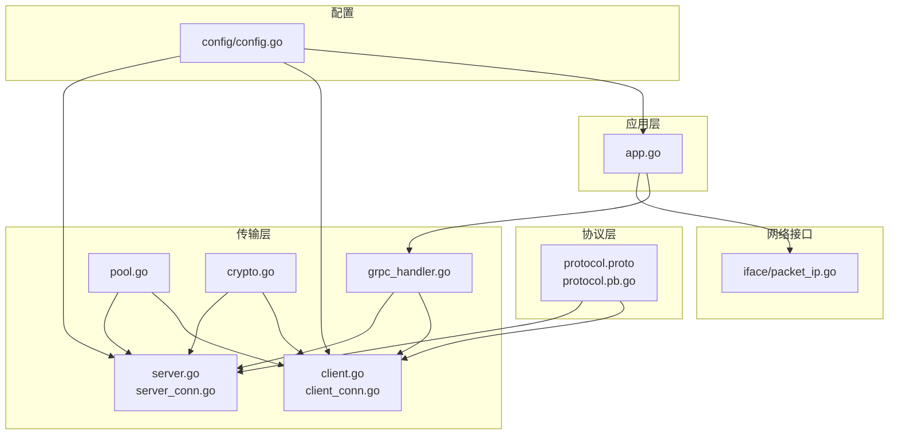
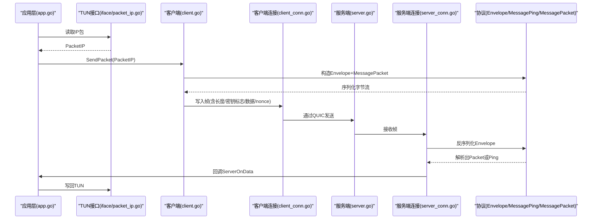
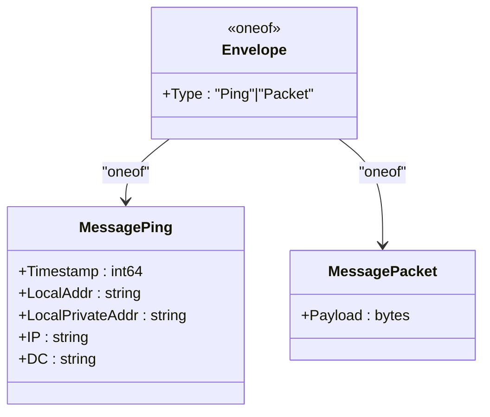
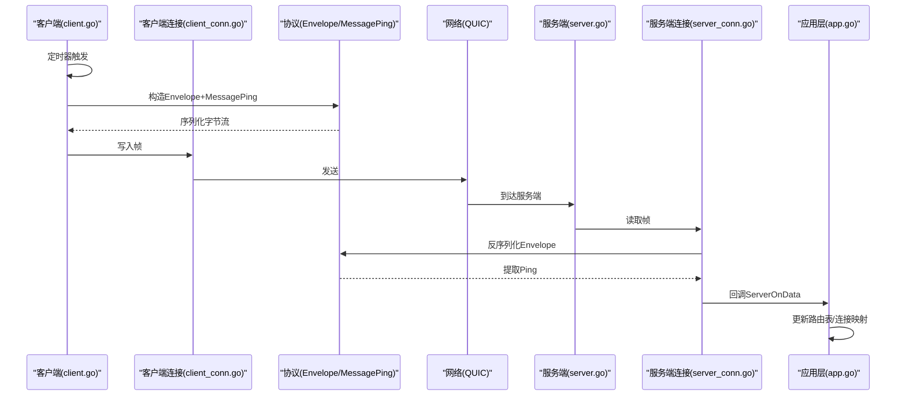
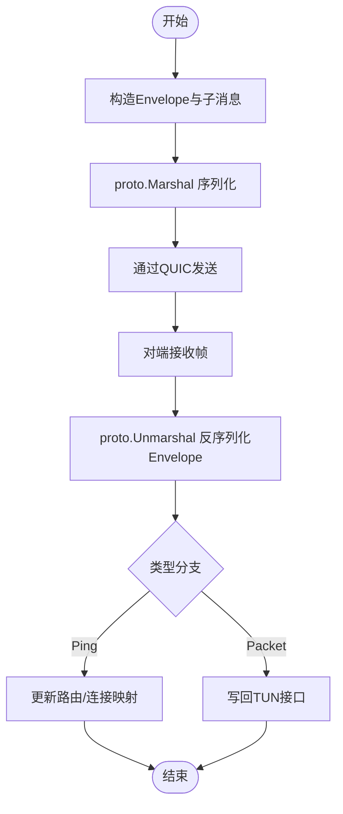
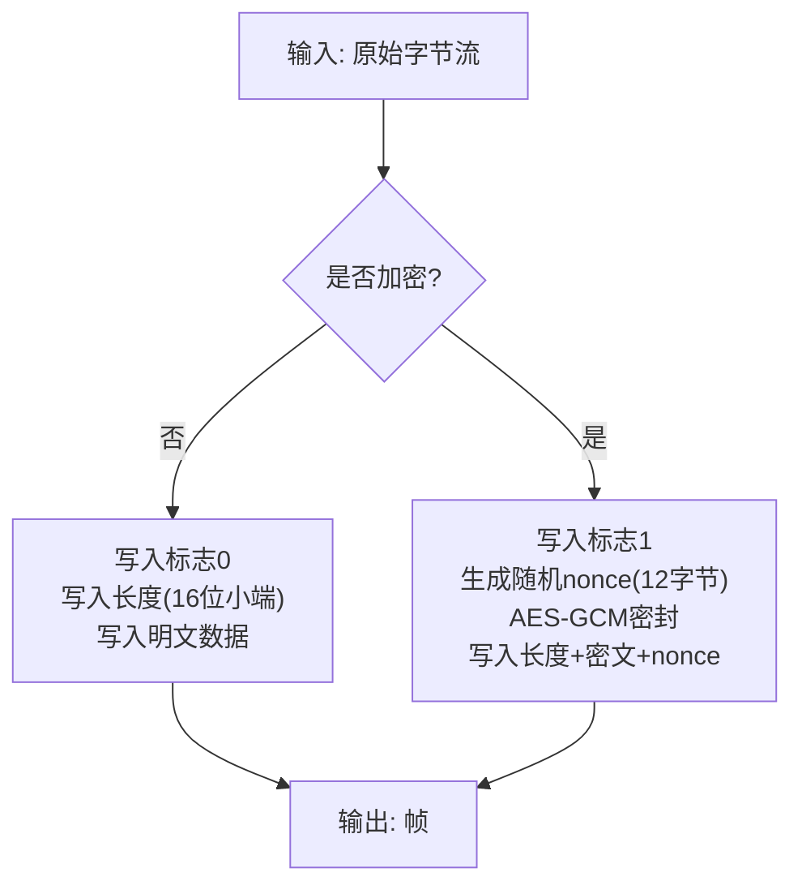

# 协议设计

<cite>
**本文引用的文件列表**
- [protocol.proto](file://protocol/protocol.proto)
- [protocol.pb.go](file://protocol/protocol.pb.go)
- [grpc_handler.go](file://transport/grpc_handler.go)
- [client.go](file://transport/client.go)
- [client_conn.go](file://transport/client_conn.go)
- [server.go](file://transport/server.go)
- [server_conn.go](file://transport/server_conn.go)
- [pool.go](file://transport/pool.go)
- [crypto.go](file://transport/crypto.go)
- [app.go](file://qtun/app.go)
- [packet_ip.go](file://iface/packet_ip.go)
- [config.go](file://config/config.go)
- [README.md](file://README.md)
</cite>

## 目录
1. [简介](#简介)
2. [项目结构与协议位置](#项目结构与协议位置)
3. [核心组件与职责](#核心组件与职责)
4. [架构总览](#架构总览)
5. [协议消息模型与字段定义](#协议消息模型与字段定义)
6. [Envelope 封装与消息类型选择](#envelope-封装与消息类型选择)
7. [MessagePing 心跳机制](#messageping-心跳机制)
8. [MessagePacket 数据包格式](#messagepacket-数据包格式)
9. [序列化与反序列化机制](#序列化与反序列化机制)
10. [二进制格式与编码细节](#二进制格式与编码细节)
11. [版本兼容性与向后兼容策略](#版本兼容性与向后兼容策略)
12. [协议扩展与版本管理最佳实践](#协议扩展与版本管理最佳实践)
13. [协议调试与消息跟踪](#协议调试与消息跟踪)
14. [在不同传输层上的适配与优化](#在不同传输层上的适配与优化)
15. [性能考量与优化建议](#性能考量与优化建议)
16. [故障排查指南](#故障排查指南)
17. [结论](#结论)

## 简介
本文件系统性梳理 qtun 项目中的协议设计与实现，重点围绕 Protocol Buffer 定义的 Envelope 封装、MessagePing 心跳与 MessagePacket 数据包格式，解释其序列化/反序列化、二进制格式、版本兼容与扩展策略，并给出调试与跨传输层适配的实践建议。该协议用于在客户端与服务端之间通过 QUIC 通道进行安全、高效的隧道数据传输。

## 项目结构与协议位置
协议定义位于 protocol 子目录，由 proto 文件生成对应的 Go 代码；传输层在 transport 子目录，负责基于 QUIC 的连接、读写、加解密与消息编解码；应用层在 qtun 子目录，负责 TUN 接口与协议消息的桥接；网络接口抽象在 iface 子目录，提供 PacketIP 类型与池化复用。

图表来源
- [protocol.proto](file://protocol/protocol.proto#L1-L22)
- [protocol.pb.go](file://protocol/protocol.pb.go#L1-L303)
- [grpc_handler.go](file://transport/grpc_handler.go#L1-L7)
- [client.go](file://transport/client.go#L1-L223)
- [client_conn.go](file://transport/client_conn.go#L1-L408)
- [server.go](file://transport/server.go#L1-L219)
- [server_conn.go](file://transport/server_conn.go#L1-L295)
- [pool.go](file://transport/pool.go#L1-L108)
- [crypto.go](file://transport/crypto.go#L1-L27)
- [app.go](file://qtun/app.go#L1-L271)
- [packet_ip.go](file://iface/packet_ip.go#L1-L47)
- [config.go](file://config/config.go#L1-L24)

章节来源
- [protocol.proto](file://protocol/protocol.proto#L1-L22)
- [protocol.pb.go](file://protocol/protocol.pb.go#L1-L303)
- [client.go](file://transport/client.go#L1-L223)
- [server.go](file://transport/server.go#L1-L219)
- [app.go](file://qtun/app.go#L1-L271)

## 核心组件与职责
- 协议定义与生成：protocol.proto 定义 Envelope、MessagePing、MessagePacket；protocol.pb.go 提供序列化/反序列化与 oneof 类型支持。
- 传输层：client/server 负责连接生命周期、QUIC 配置、心跳与数据包发送；client_conn/server_conn 负责具体读写、加解密与帧格式。
- 应用层：app.go 桥接 TUN 与协议，解析 Envelope 并分发到 iface 或 transport。
- 资源池：pool.go 提供 Envelope、MessagePing/MessagePacket、nonce、读缓冲等对象池，降低 GC 压力。
- 加密：crypto.go 使用 AES-GCM 对帧内容进行加解密，密钥派生采用 MD5/SHA256。
- 接口抽象：iface/packet_ip.go 抽象 IP 层数据包，提供池化与基本解析能力。

章节来源
- [protocol.pb.go](file://protocol/protocol.pb.go#L23-L282)
- [client.go](file://transport/client.go#L20-L95)
- [server.go](file://transport/server.go#L23-L46)
- [client_conn.go](file://transport/client_conn.go#L24-L56)
- [server_conn.go](file://transport/server_conn.go#L24-L51)
- [pool.go](file://transport/pool.go#L10-L108)
- [crypto.go](file://transport/crypto.go#L10-L26)
- [packet_ip.go](file://iface/packet_ip.go#L8-L47)

## 架构总览
下图展示协议在整体系统中的位置与交互路径：应用层从 TUN 读取 IP 包，封装为 Envelope 后经 QUIC 发送；对端接收后解析 Envelope，分别处理心跳或数据包，再写回 TUN。

图表来源
- [app.go](file://qtun/app.go#L99-L167)
- [client.go](file://transport/client.go#L208-L222)
- [client_conn.go](file://transport/client_conn.go#L241-L294)
- [server_conn.go](file://transport/server_conn.go#L129-L165)
- [protocol.pb.go](file://protocol/protocol.pb.go#L23-L166)

## 协议消息模型与字段定义
- Envelope：oneof 类型，承载 MessagePing 或 MessagePacket。
- MessagePing：包含时间戳、本地地址、私有地址、公网IP、数据中心标识等。
- MessagePacket：包含原始 IP 层 payload（bytes）。

图表来源
- [protocol.proto](file://protocol/protocol.proto#L5-L22)
- [protocol.pb.go](file://protocol/protocol.pb.go#L23-L282)

章节来源
- [protocol.proto](file://protocol/protocol.proto#L5-L22)
- [protocol.pb.go](file://protocol/protocol.pb.go#L23-L282)

## Envelope 封装与消息类型选择
- oneof 设计：Envelope 仅允许一种类型被设置，避免冗余字段与歧义。
- 类型选择：
  - Ping：用于客户端周期性心跳，携带本地地址与公网IP，便于服务端建立路由表。
  - Packet：承载实际 IP 层数据包，直接放入 payload 字段。
- 生成代码：Go 侧通过内部 oneof 接口与 marshal/unmarshal 函数实现类型安全的序列化/反序列化。

章节来源
- [protocol.proto](file://protocol/protocol.proto#L6-L9)
- [protocol.pb.go](file://protocol/protocol.pb.go#L57-L100)
- [protocol.pb.go](file://protocol/protocol.pb.go#L102-L145)

## MessagePing 心跳机制
- 触发时机：客户端每秒发送一次心跳，持续循环。
- 内容构成：包含时间戳、本地地址、私有地址、公网IP、数据中心标识。
- 服务端处理：解析 Envelope 后识别 Ping 类型，更新路由表与连接映射，便于后续数据包转发。

图表来源
- [client.go](file://transport/client.go#L142-L157)
- [client.go](file://transport/client.go#L178-L206)
- [client_conn.go](file://transport/client_conn.go#L241-L294)
- [server_conn.go](file://transport/server_conn.go#L129-L165)
- [app.go](file://qtun/app.go#L169-L207)

章节来源
- [client.go](file://transport/client.go#L142-L206)
- [app.go](file://qtun/app.go#L169-L207)

## MessagePacket 数据包格式
- 结构：Envelope 中的 Packet 字段承载 bytes 类型 payload。
- 来源：来自 TUN 接口的 IP 层数据包，直接作为 payload 传输。
- 处理：服务端收到后提取 payload，写回 TUN 接口。

章节来源
- [protocol.proto](file://protocol/protocol.proto#L20-L22)
- [protocol.pb.go](file://protocol/protocol.pb.go#L238-L274)
- [app.go](file://qtun/app.go#L198-L206)

## 序列化与反序列化机制
- 序列化：客户端/服务端构造 Envelope 与子消息，使用 proto.Marshal 序列化为字节流。
- 反序列化：对端收到字节流后，使用 proto.Unmarshal 解析为 Envelope，再通过 oneof 类型分支处理。
- 对象池：为 Envelope、MessagePing、MessagePacket、nonce、读缓冲等提供池化，减少分配与 GC 压力。

图表来源
- [client.go](file://transport/client.go#L184-L206)
- [server_conn.go](file://transport/server_conn.go#L129-L165)
- [app.go](file://qtun/app.go#L169-L207)
- [pool.go](file://transport/pool.go#L74-L99)

章节来源
- [client.go](file://transport/client.go#L184-L222)
- [server_conn.go](file://transport/server_conn.go#L129-L165)
- [pool.go](file://transport/pool.go#L74-L99)

## 二进制格式与编码细节
- 帧头：每个 QUIC 流发送的数据以“是否加密标志 + 数据长度 + 数据 + nonce”形式组织。
- 加密标志：0 表示明文，1 表示 AES-GCM 密文；若启用加密，nonce 长度固定为 12 字节。
- 长度编码：使用 16 位小端整数记录数据长度，便于快速读取。
- 协议帧：Envelope 序列化后的字节流即为协议帧主体，按上述帧头封装后发送。

图表来源
- [client_conn.go](file://transport/client_conn.go#L241-L294)
- [server_conn.go](file://transport/server_conn.go#L167-L220)
- [crypto.go](file://transport/crypto.go#L10-L17)

章节来源
- [client_conn.go](file://transport/client_conn.go#L241-L294)
- [server_conn.go](file://transport/server_conn.go#L167-L220)
- [crypto.go](file://transport/crypto.go#L10-L17)

## 版本兼容性与向后兼容策略
- proto3 语义：字段编号不变更、新增字段保持向后兼容；删除字段需保留编号或使用保留关键字。
- oneof 类型：类型切换通过 oneof 字段实现，避免多字段同时存在导致的歧义。
- 扩展字段：建议在现有消息中预留未使用的字段编号，避免未来扩展破坏兼容。
- 默认值：proto3 对默认值不进行序列化，有助于减小体积并提升兼容性。

章节来源
- [protocol.proto](file://protocol/protocol.proto#L1-L22)
- [protocol.pb.go](file://protocol/protocol.pb.go#L102-L145)

## 协议扩展与版本管理最佳实践
- 新增消息类型：在 Envelope 中新增 oneof 分支，确保编号唯一且不与现有冲突。
- 新增字段：在现有消息内新增字段，保持编号连续并避免删除已用编号。
- 兼容性测试：在客户端/服务端均进行升级前后的互通测试，验证 oneof 分支与字段解析。
- 文档与注释：为每个字段添加清晰注释，说明用途与默认行为，便于维护。

章节来源
- [protocol.proto](file://protocol/protocol.proto#L5-L22)
- [protocol.pb.go](file://protocol/protocol.pb.go#L23-L166)

## 协议调试与消息跟踪
- 日志级别：通过配置项控制日志级别，建议在开发阶段使用更详细的日志。
- 关键路径日志：
  - 客户端/服务端连接建立与关闭事件。
  - 心跳发送与接收。
  - Envelope 反序列化成功/失败。
  - TUN 读写与路由表更新。
- 工具与技巧：
  - 使用抓包工具观察 QUIC 流与帧结构。
  - 在 app 层打印 Envelope 类型与关键字段，辅助定位问题。
  - 对比客户端/服务端的路由表状态，确认 Ping 是否正确更新。

章节来源
- [config.go](file://config/config.go#L3-L13)
- [app.go](file://qtun/app.go#L169-L207)
- [client.go](file://transport/client.go#L196-L198)

## 在不同传输层上的适配与优化
- 当前实现：基于 QUIC 的单流双向通信，帧头包含加密标志、长度与数据。
- 适配要点：
  - 保持帧头结构稳定，便于未来扩展为多流或多路复用。
  - 通过配置项调整 QUIC 参数（如窗口大小、保活周期），平衡吞吐与延迟。
  - 在两端统一加密策略，避免明文/密文混用导致的解析错误。
- 优化建议：
  - 使用对象池减少分配。
  - 读写缓冲区大小可按 MTU 与带宽动态调整。
  - 在高并发场景下，合理设置传输线程数与工作协程数量。

章节来源
- [server.go](file://transport/server.go#L97-L103)
- [client_conn.go](file://transport/client_conn.go#L84-L91)
- [config.go](file://config/config.go#L7-L12)

## 性能考量与优化建议
- 对象池：Envelope、MessagePing/MessagePacket、nonce、读缓冲池显著降低 GC 压力。
- 缓冲区：读写缓冲区增大至 64KB，提高吞吐。
- QUIC 参数：增大接收窗口与并发流数，启用 datagram，提升实时性。
- 并发：客户端/服务端多连接与多工作协程，结合原子自增选择连接，提升负载均衡。

章节来源
- [pool.go](file://transport/pool.go#L10-L51)
- [client_conn.go](file://transport/client_conn.go#L332-L332)
- [server_conn.go](file://transport/server_conn.go#L89-L89)
- [server.go](file://transport/server.go#L97-L103)

## 故障排查指南
- 连接失败：
  - 检查 QUIC TLS 配置与握手参数。
  - 查看连接重试与超时逻辑。
- 解密失败：
  - 确认两端密钥一致，检查 nonce 长度与读取顺序。
  - 若出现“密钥不匹配”，需重新协商或检查密钥来源。
- 反序列化失败：
  - 检查 proto 文件是否同步，oneof 类型分支是否完整。
  - 确认帧头格式与长度字段正确。
- 路由异常：
  - 核对 Ping 中的公网IP与本地地址是否正确。
  - 检查路由表清理任务是否正常运行。

章节来源
- [server_conn.go](file://transport/server_conn.go#L98-L102)
- [client_conn.go](file://transport/client_conn.go#L380-L393)
- [app.go](file://qtun/app.go#L169-L207)

## 结论
本协议以 Envelope 为核心封装，通过 oneof 类型区分心跳与数据包，配合 QUIC 传输与 AES-GCM 加密，实现了简洁、高效且具备良好扩展性的隧道协议。通过对对象池、缓冲区与 QUIC 参数的优化，系统在高并发与复杂网络环境下仍能保持稳定与高性能。遵循本文的扩展与兼容策略，可在不影响现有功能的前提下平滑演进协议版本。