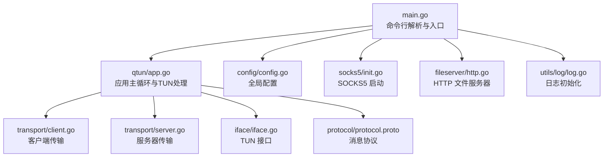
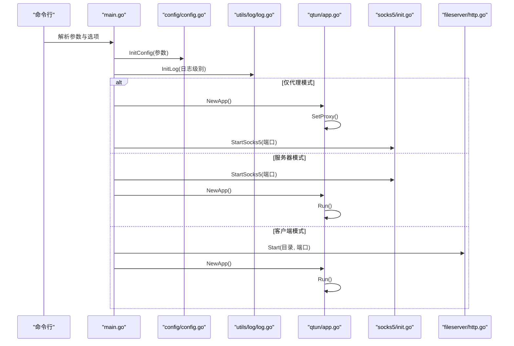
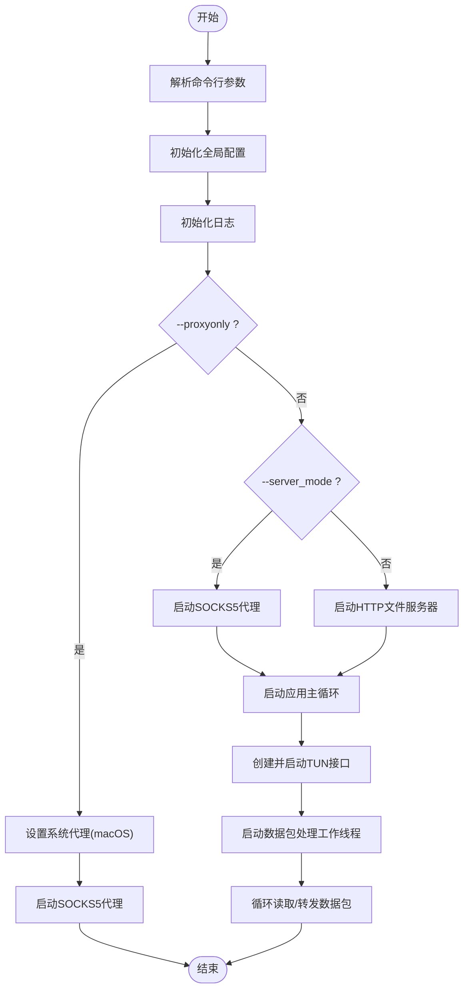
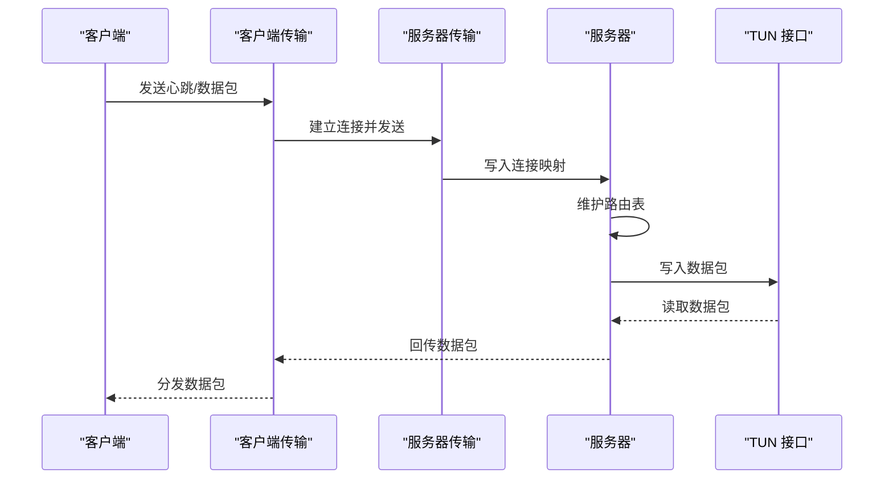
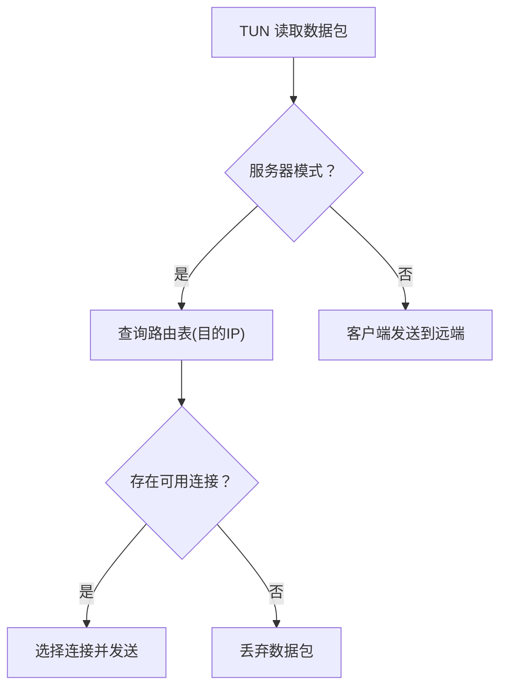
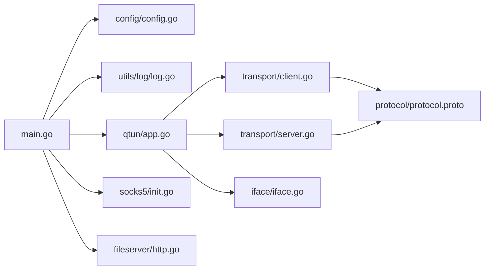

# 命令行接口

<cite>
**本文引用的文件**
- [main.go](file://main.go)
- [app.go](file://qtun/app.go)
- [config.go](file://config/config.go)
- [http.go](file://fileserver/http.go)
- [socks5.go](file://socks5/socks5.go)
- [init.go](file://socks5/init.go)
- [protocol.proto](file://protocol/protocol.proto)
- [iface.go](file://iface/iface.go)
- [client.go](file://transport/client.go)
- [server.go](file://transport/server.go)
- [log.go](file://utils/log/log.go)
- [README.md](file://README.md)
</cite>

## 目录
1. [简介](#简介)
2. [项目结构](#项目结构)
3. [核心组件](#核心组件)
4. [架构总览](#架构总览)
5. [详细组件分析](#详细组件分析)
6. [依赖关系分析](#依赖关系分析)
7. [性能考量](#性能考量)
8. [故障排查指南](#故障排查指南)
9. [结论](#结论)
10. [附录：命令参考手册](#附录命令参考手册)

## 简介
本文件为 Qtun 命令行接口的完整文档，覆盖所有可用命令与参数、全局选项、服务器/客户端模式配置、环境变量与配置文件支持、常见使用场景与最佳实践等。Qtun 提供基于 TUN 的虚拟网络隧道与 SOCKS5 代理能力，支持在服务器模式下同时运行 TUN 与 SOCKS5 服务，在客户端模式下自动配置系统代理并启动 TUN。

## 项目结构
- 可执行入口位于根目录的主程序，负责解析命令行参数、初始化日志与配置，并根据模式启动应用与辅助服务（SOCKS5 或 HTTP 文件服务器）。
- 应用主体位于 qtun 子包，负责 TUN 接口管理、数据包转发、路由维护以及与传输层的交互。
- 配置通过全局单例在应用初始化时注入，贯穿各模块。
- 传输层分别实现客户端与服务器端逻辑，采用 QUIC 协议承载数据帧与心跳。
- 辅助服务包括 SOCKS5 代理与 HTTP 文件服务器，用于代理与静态资源分发。

图表来源
- [main.go](file://main.go#L1-L136)
- [app.go](file://qtun/app.go#L1-L271)
- [config.go](file://config/config.go#L1-L24)
- [http.go](file://fileserver/http.go#L1-L17)
- [init.go](file://socks5/init.go#L1-L23)
- [protocol.proto](file://protocol/protocol.proto#L1-L22)
- [iface.go](file://iface/iface.go#L1-L105)
- [client.go](file://transport/client.go#L1-L200)
- [server.go](file://transport/server.go#L1-L200)
- [log.go](file://utils/log/log.go#L1-L26)

章节来源
- [main.go](file://main.go#L1-L136)
- [README.md](file://README.md#L1-L99)

## 核心组件
- 命令行与入口
  - 使用命令行库定义命令与选项，解析参数后初始化配置与日志，并按模式启动应用与辅助服务。
- 应用主循环
  - 根据是否服务器模式创建传输层实例，启动 TUN 接口与数据包工作线程，处理入站/出站数据包。
- 传输层
  - 客户端：多连接并发，定时发送心跳，选择可用连接发送数据。
  - 服务器：监听 QUIC 地址，接受连接并维护连接映射与路由表。
- TUN 接口
  - 创建并配置 TUN 设备，设置 IP 与 MTU，必要时添加系统路由。
- 辅助服务
  - SOCKS5：本地监听端口，提供代理服务。
  - HTTP 文件服务器：提供静态资源与 PAC 文件，便于系统代理配置。

章节来源
- [main.go](file://main.go#L22-L103)
- [app.go](file://qtun/app.go#L19-L97)
- [client.go](file://transport/client.go#L20-L132)
- [server.go](file://transport/server.go#L23-L149)
- [iface.go](file://iface/iface.go#L16-L74)
- [http.go](file://fileserver/http.go#L9-L16)
- [init.go](file://socks5/init.go#L5-L22)

## 架构总览
下图展示命令行到应用与传输层的整体调用链路，以及服务器/客户端模式的关键差异。

图表来源
- [main.go](file://main.go#L75-L103)
- [config.go](file://config/config.go#L17-L23)
- [log.go](file://utils/log/log.go#L10-L25)
- [app.go](file://qtun/app.go#L37-L49)
- [init.go](file://socks5/init.go#L5-L22)
- [http.go](file://fileserver/http.go#L9-L16)

## 详细组件分析

### 命令与参数详解
- 命令名称
  - 主命令：qtun（别名：qt）
- 全局选项
  - --verbose：设置错误报告级别（quiet 0 - 4 debug）
  - --no-color：禁用输出颜色
  - -h, --help：显示帮助信息
  - -V, --version：显示版本信息
- 命令选项
  - --key：加密密钥（默认值：hello-world）
  - --remote_addrs：远端服务器地址（仅客户端有效，默认：2.2.2.2:8080）
  - --listen：服务器监听地址（仅服务器有效，默认：0.0.0.0:8080）
  - --ip：VPN 虚拟 IP 段（默认：10.237.0.1/16）
  - --log_level：日志级别（默认：info；可选：info/debug）
  - --file_dir：HTTP 文件服务器目录（默认：../static）
  - --file_svr_port：HTTP 文件服务器端口（默认：6061）
  - --transport_threads：客户端并发线程数（默认：1）
  - --mtu：MTU 大小（默认：1500）
  - --socks5_port：SOCKS5 本地端口（默认：2080）
  - --server_mode：是否以服务器模式运行（布尔）
  - --nodelay：启用 TCP/QUIC 无延迟（布尔）
  - --proxyonly：仅启用代理模式（布尔）

参数组合最佳实践
- 服务器模式
  - 必填：--server_mode、--listen、--ip
  - 可选：--socks5_port、--nodelay、--log_level
- 客户端模式
  - 必填：--key、--remote_addrs、--ip
  - 可选：--transport_threads、--mtu、--nodelay、--log_level
- 仅代理模式
  - 必填：--proxyonly
  - 可选：--socks5_port、--log_level

章节来源
- [main.go](file://main.go#L42-L68)
- [README.md](file://README.md#L51-L88)

### 执行流程
- 参数解析与配置初始化
  - 将命令行参数写入全局配置对象，随后初始化日志。
- 代理模式判断
  - 若开启 --proxyonly，则仅启动 SOCKS5 代理并设置系统代理（macOS），不启动 TUN。
- 服务器模式
  - 启动 SOCKS5 本地代理，然后启动应用主循环，创建并启动服务器传输层与 TUN 接口。
- 客户端模式
  - 启动 HTTP 文件服务器（提供 PAC 与静态资源），然后启动应用主循环，创建并启动客户端传输层与 TUN 接口。
- 应用主循环
  - 初始化 TUN 接口，根据 CPU 核心数动态创建工作线程，持续读取/处理 TUN 数据包并转发至传输层。

图表来源
- [main.go](file://main.go#L75-L103)
- [app.go](file://qtun/app.go#L72-L97)
- [init.go](file://socks5/init.go#L5-L22)
- [http.go](file://fileserver/http.go#L9-L16)

章节来源
- [main.go](file://main.go#L75-L103)
- [app.go](file://qtun/app.go#L37-L97)

### 服务器模式与客户端模式对比
- 服务器模式
  - 启动 SOCKS5 本地代理，监听指定地址，维护连接与路由表，接收来自客户端的数据包并写入 TUN。
- 客户端模式
  - 连接远端服务器，建立多连接通道，定时发送心跳，从 TUN 读取数据包并发送到服务器。

图表来源
- [client.go](file://transport/client.go#L41-L83)
- [server.go](file://transport/server.go#L120-L149)
- [app.go](file://qtun/app.go#L169-L207)

章节来源
- [client.go](file://transport/client.go#L20-L132)
- [server.go](file://transport/server.go#L23-L149)
- [app.go](file://qtun/app.go#L169-L207)

### 数据包处理与路由
- 客户端
  - 从 TUN 读取 IP 数据包，封装为协议消息，选择可用连接发送。
- 服务器
  - 根据目的 IP 查询路由表，选择对应连接转发；若连接失效则清理并删除死连接。

图表来源
- [app.go](file://qtun/app.go#L99-L167)
- [server.go](file://transport/server.go#L175-L190)

章节来源
- [app.go](file://qtun/app.go#L99-L167)
- [server.go](file://transport/server.go#L175-L190)

### 日志与调试
- 日志级别
  - 支持 info 与 debug 两种级别，debug 会输出更详细的调试信息。
- 调试工具
  - 代码中预留了性能分析与可视化接口（注释状态），可用于开发与性能分析。

章节来源
- [log.go](file://utils/log/log.go#L10-L25)
- [main.go](file://main.go#L118-L129)

## 依赖关系分析
- 命令行层依赖配置层与日志层，按模式选择性启动 SOCKS5 或 HTTP 文件服务器。
- 应用层依赖传输层与 TUN 层，负责数据包转发与路由维护。
- 传输层依赖协议定义与配置，客户端与服务器分别维护连接集合与路由表。

图表来源
- [main.go](file://main.go#L1-L136)
- [app.go](file://qtun/app.go#L1-L271)
- [config.go](file://config/config.go#L1-L24)
- [http.go](file://fileserver/http.go#L1-L17)
- [init.go](file://socks5/init.go#L1-L23)
- [protocol.proto](file://protocol/protocol.proto#L1-L22)
- [iface.go](file://iface/iface.go#L1-L105)
- [client.go](file://transport/client.go#L1-L200)
- [server.go](file://transport/server.go#L1-L200)
- [log.go](file://utils/log/log.go#L1-L26)

章节来源
- [main.go](file://main.go#L1-L136)
- [app.go](file://qtun/app.go#L1-L271)

## 性能考量
- 工作线程数量
  - 应用根据 CPU 核心数动态计算工作线程数，范围限制在 4 到 32 之间，以提升 I/O 并行度。
- 传输层优化
  - 服务器侧使用并发安全的连接映射与路由表，减少锁竞争；客户端侧多连接轮询发送，提高吞吐。
- QUIC 配置
  - 服务器侧启用了较大的流窗口与连接窗口，以及保活周期，提升稳定性与带宽利用率。

章节来源
- [app.go](file://qtun/app.go#L79-L96)
- [server.go](file://transport/server.go#L97-L103)
- [client.go](file://transport/client.go#L41-L83)

## 故障排查指南
- 无法启动 TUN
  - 检查权限与内核模块加载情况；确认 IP 与 MTU 设置合理。
- 无法连接服务器
  - 校验 --key 一致、--remote_addrs 正确且网络可达；查看客户端重连日志。
- 代理不可用
  - macOS 下确认已设置系统代理；检查 --socks5_port 是否被占用。
- 日志级别
  - 将 --log_level 调整为 debug 获取更详细信息。

章节来源
- [iface.go](file://iface/iface.go#L31-L74)
- [client.go](file://transport/client.go#L41-L83)
- [init.go](file://socks5/init.go#L5-L22)
- [log.go](file://utils/log/log.go#L10-L25)

## 结论
Qtun 的命令行接口简洁明确，支持服务器/客户端/仅代理三种模式，结合 TUN 与 SOCKS5 实现跨网络的安全隧道与透明代理。通过合理的参数组合与性能优化，可在不同平台与网络环境下稳定运行。

## 附录：命令参考手册

### 命令与选项总览
- 命令：qtun（别名：qt）
- 全局选项
  - --verbose：设置错误报告级别（quiet 0 - 4 debug）
  - --no-color：禁用输出颜色
  - -h, --help：显示帮助信息
  - -V, --version：显示版本信息
- 命令选项
  - --key：加密密钥（默认：hello-world）
  - --remote_addrs：远端服务器地址（仅客户端，默认：2.2.2.2:8080）
  - --listen：服务器监听地址（仅服务器，默认：0.0.0.0:8080）
  - --ip：VPN 虚拟 IP 段（默认：10.237.0.1/16）
  - --log_level：日志级别（默认：info；可选：info/debug）
  - --file_dir：HTTP 文件服务器目录（默认：../static）
  - --file_svr_port：HTTP 文件服务器端口（默认：6061）
  - --transport_threads：客户端并发线程数（默认：1）
  - --mtu：MTU 大小（默认：1500）
  - --socks5_port：SOCKS5 本地端口（默认：2080）
  - --server_mode：是否以服务器模式运行（布尔）
  - --nodelay：启用 TCP/QUIC 无延迟（布尔）
  - --proxyonly：仅启用代理模式（布尔）

### 模式与示例
- 服务器模式
  - 示例：sudo ./qtun qt --key "hahaha" --listen "0.0.0.0:8080" --ip "10.4.4.2/24" --server_mode
- 客户端模式
  - 示例：sudo ./qtun qt --key "hahaha" --remote_addrs "8.8.8.80:8080" --ip "10.4.4.3/24"
- 仅代理模式
  - 示例：sudo ./qtun qt --proxyonly --socks5_port 2080

### 环境变量与配置文件
- 环境变量
  - 未提供专用环境变量；可通过命令行参数或系统代理配置实现功能。
- 配置文件
  - 未提供内置配置文件支持；建议通过脚本或 systemd 管理启动参数。

章节来源
- [README.md](file://README.md#L51-L88)
- [main.go](file://main.go#L42-L68)