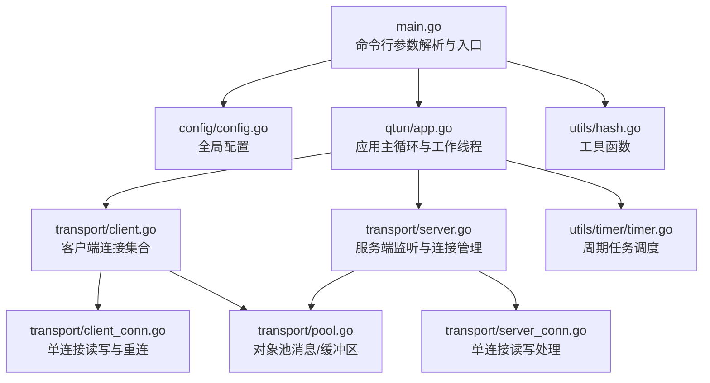
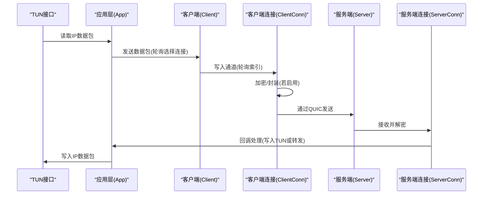
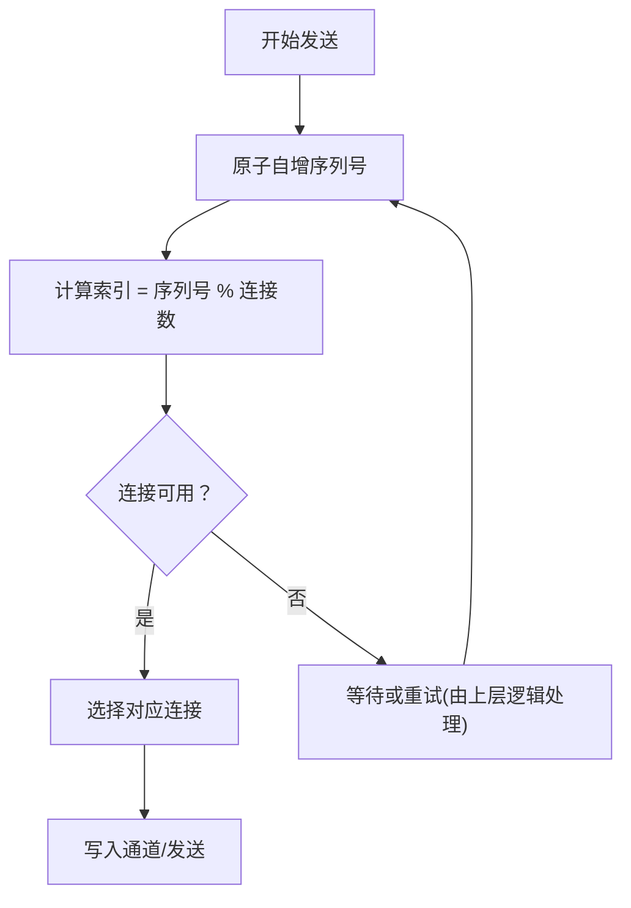
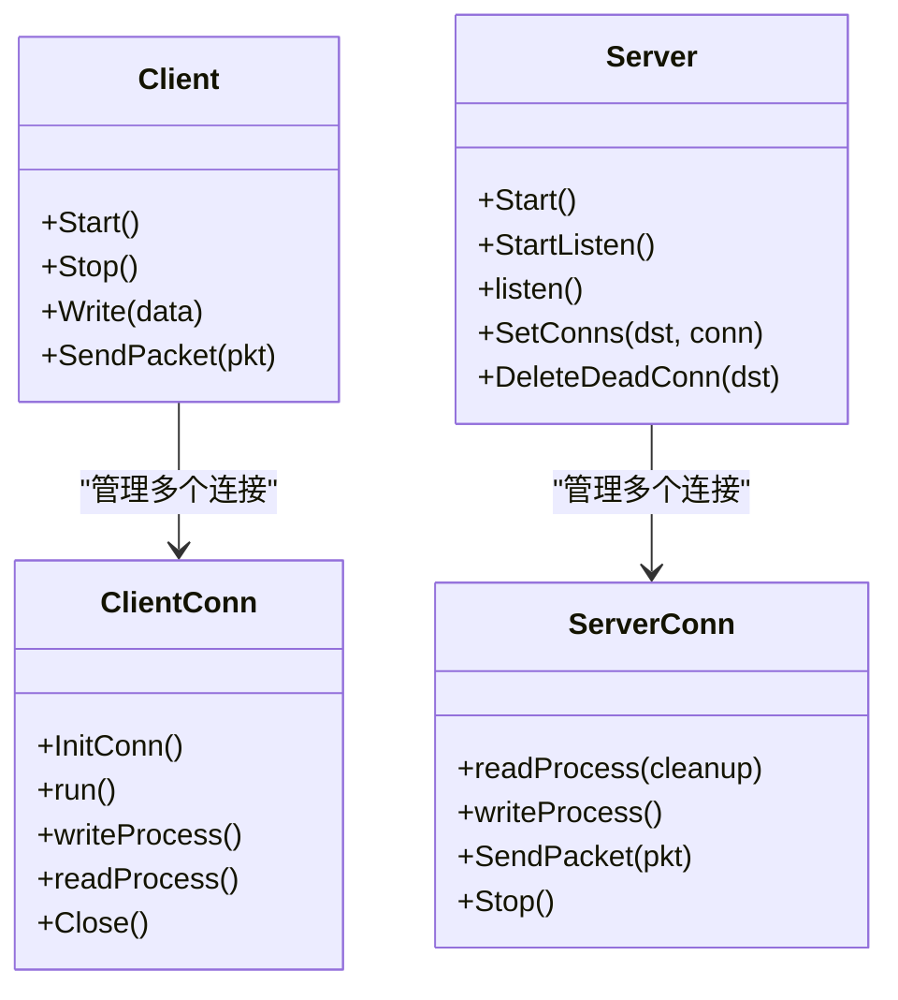
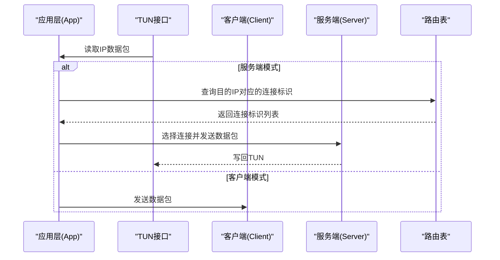
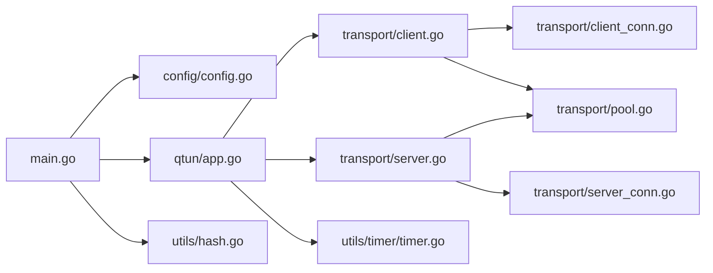

# 多连接并发机制

<cite>
**本文引用的文件**
- [main.go](file://main.go)
- [config/config.go](file://config/config.go)
- [qtun/app.go](file://qtun/app.go)
- [transport/client.go](file://transport/client.go)
- [transport/client_conn.go](file://transport/client_conn.go)
- [transport/server.go](file://transport/server.go)
- [transport/server_conn.go](file://transport/server_conn.go)
- [transport/pool.go](file://transport/pool.go)
- [PERFORMANCE_TEST_GUIDE.md](file://PERFORMANCE_TEST_GUIDE.md)
- [utils/hash.go](file://utils/hash.go)
- [utils/timer/timer.go](file://utils/timer/timer.go)
</cite>

## 目录
1. [简介](#简介)
2. [项目结构](#项目结构)
3. [核心组件](#核心组件)
4. [架构总览](#架构总览)
5. [详细组件分析](#详细组件分析)
6. [依赖关系分析](#依赖关系分析)
7. [性能考量与优化建议](#性能考量与优化建议)
8. [并发测试与性能监控](#并发测试与性能监控)
9. [故障排除指南](#故障排除指南)
10. [结论](#结论)

## 简介
本文件系统性阐述 Qtun 的多连接并发机制，重点覆盖以下方面：
- threads 参数的作用与连接数配置
- 客户端连接负载均衡策略（轮询算法与连接选择机制）
- 连接池管理（连接创建、销毁与资源回收）
- 性能优化建议（连接数调优、内存使用优化、CPU 利用率提升）
- 并发测试方法与性能监控指标
- 不同场景下的连接数配置建议与故障排除

## 项目结构
Qtun 采用分层设计：应用入口负责解析参数与初始化全局配置；应用层协调 TUN 接口与传输层；传输层基于 QUIC 提供多连接并发能力；工具层提供对象池与定时器等通用设施。

图表来源
- [main.go](file://main.go#L1-L136)
- [config/config.go](file://config/config.go#L1-L24)
- [qtun/app.go](file://qtun/app.go#L1-L271)
- [transport/client.go](file://transport/client.go#L1-L223)
- [transport/server.go](file://transport/server.go#L1-L219)
- [transport/client_conn.go](file://transport/client_conn.go#L1-L408)
- [transport/server_conn.go](file://transport/server_conn.go#L1-L295)
- [transport/pool.go](file://transport/pool.go#L1-L108)
- [utils/timer/timer.go](file://utils/timer/timer.go#L1-L55)
- [utils/hash.go](file://utils/hash.go#L1-L42)

章节来源
- [main.go](file://main.go#L1-L136)
- [config/config.go](file://config/config.go#L1-L24)

## 核心组件
- 全局配置：包含密钥、远端地址、监听地址、传输线程数、VPN IP、MTU、服务端模式、NoDelay 等关键参数。
- 应用层：负责 TUN 接口启动、动态工作线程数量、数据包采集与转发、路由表维护与清理。
- 客户端：按 threads 创建多个 ClientConn，采用原子自增 + 取模实现轮询负载均衡；定期发送 Ping 保持连接活跃。
- 服务端：基于 QUIC 监听，使用 sync.Map 存储连接映射，支持正向/反向查找，便于断连清理。
- 连接池：针对 protobuf 消息体、缓冲区、nonce 等热点对象使用 sync.Pool 复用，降低 GC 压力。
- 工具层：提供对象池辅助函数、定时器框架与通用错误处理。

章节来源
- [config/config.go](file://config/config.go#L1-L24)
- [qtun/app.go](file://qtun/app.go#L1-L271)
- [transport/client.go](file://transport/client.go#L1-L223)
- [transport/server.go](file://transport/server.go#L1-L219)
- [transport/pool.go](file://transport/pool.go#L1-L108)

## 架构总览
下图展示从 TUN 数据包到 QUIC 传输的整体流程，以及客户端多连接并发与服务端连接管理的关键交互。

图表来源
- [qtun/app.go](file://qtun/app.go#L99-L167)
- [transport/client.go](file://transport/client.go#L114-L132)
- [transport/client_conn.go](file://transport/client_conn.go#L204-L239)
- [transport/server_conn.go](file://transport/server_conn.go#L58-L115)

## 详细组件分析

### threads 参数与连接数配置
- 参数位置：命令行参数中提供 transport_threads，默认值为 1。
- 配置注入：进入应用后写入全局配置结构体。
- 客户端行为：根据 threads 初始化对应数量的 ClientConn，并在启动阶段逐一建立连接。
- 作用范围：决定客户端侧并发连接数，直接影响上行带宽与负载均衡粒度。

章节来源
- [main.go](file://main.go#L59-L84)
- [config/config.go](file://config/config.go#L7-L13)
- [transport/client.go](file://transport/client.go#L41-L83)

### 客户端连接负载均衡策略
- 算法：原子自增 + 取模，确保顺序递增的序列号均匀映射到各连接。
- 选择机制：每次发送前更新序列号，取模得到连接索引，直接从连接数组中选取。
- 适用场景：无显式权重需求时，轮询可获得近似均衡的流量分布。
- 注意事项：连接健康状态变化时，当前选择可能命中断开连接，需配合重试与断连清理。

图表来源
- [transport/client.go](file://transport/client.go#L114-L132)

章节来源
- [transport/client.go](file://transport/client.go#L114-L132)

### 连接池管理（创建、销毁与资源回收）
- 连接创建
  - 客户端：按 threads 数量创建 ClientConn，每个连接独立持有 QUIC Stream 与 WaitGroup。
  - 服务端：接受新会话后创建 ServerConn，分别启动读写协程。
- 连接销毁
  - 主动关闭：调用 Close/Stop 触发关闭信号，读写协程退出，释放底层 QUIC 资源。
  - 异常退出：读/写协程捕获异常并标记断开，触发清理流程。
- 资源回收
  - 对象池：复用 protobuf Envelope/Ping/Packet、bytes.Buffer、nonce、读缓冲等。
  - 清理任务：周期性扫描路由表与连接映射，移除无效连接，避免资源泄漏。

图表来源
- [transport/client.go](file://transport/client.go#L31-L95)
- [transport/client_conn.go](file://transport/client_conn.go#L44-L196)
- [transport/server.go](file://transport/server.go#L37-L219)
- [transport/server_conn.go](file://transport/server_conn.go#L39-L295)

章节来源
- [transport/client.go](file://transport/client.go#L31-L95)
- [transport/client_conn.go](file://transport/client_conn.go#L44-L196)
- [transport/server.go](file://transport/server.go#L37-L219)
- [transport/server_conn.go](file://transport/server_conn.go#L39-L295)

### 应用层并发与数据路径
- 动态工作线程：根据 CPU 核心数动态设置工作线程数量（2×CPU，最小4，最大32），提升 TUN 数据包处理并行度。
- 数据路径：客户端侧直接将 TUN 数据包交给 Client.SendPacket；服务端侧根据路由表选择连接，再写回 TUN。
- 路由维护：服务端收到客户端 Ping 后更新路由表，客户端侧定期发送 Ping 以维持连接活性。

图表来源
- [qtun/app.go](file://qtun/app.go#L72-L167)
- [transport/server.go](file://transport/server.go#L175-L210)

章节来源
- [qtun/app.go](file://qtun/app.go#L72-L167)

### QUIC 连接与加密
- QUIC 配置：两端均配置较大的最大流数、接收窗口与 KeepAlive 周期，提升吞吐与稳定性。
- 加密：支持 AES-GCM 加密，使用随机 nonce；nonce 与对象池结合，减少分配与拷贝。
- 读写缓冲：统一使用 64KB 缓冲提升吞吐，配合 bufio Reader/Writer。

章节来源
- [transport/client_conn.go](file://transport/client_conn.go#L84-L91)
- [transport/server_conn.go](file://transport/server_conn.go#L129-L165)
- [transport/pool.go](file://transport/pool.go#L10-L50)

## 依赖关系分析
- 参数依赖：命令行参数经初始化写入全局配置，贯穿应用层与传输层。
- 组件耦合：应用层仅通过接口回调与传输层交互，客户端/服务端各自管理连接生命周期。
- 并发模型：客户端使用原子变量与数组索引实现轻量级负载均衡；服务端使用 sync.Map 提升并发读写性能。
- 资源复用：对象池贯穿客户端与服务端，显著降低 GC 压力与内存抖动。

图表来源
- [main.go](file://main.go#L75-L84)
- [config/config.go](file://config/config.go#L17-L23)
- [qtun/app.go](file://qtun/app.go#L37-L49)
- [transport/client.go](file://transport/client.go#L31-L39)
- [transport/server.go](file://transport/server.go#L37-L46)
- [transport/pool.go](file://transport/pool.go#L1-L108)
- [utils/timer/timer.go](file://utils/timer/timer.go#L14-L47)

章节来源
- [main.go](file://main.go#L75-L84)
- [config/config.go](file://config/config.go#L17-L23)
- [qtun/app.go](file://qtun/app.go#L37-L49)

## 性能考量与优化建议
- 连接数调优
  - 客户端：transport_threads 建议与 CPU 核心数匹配，通常 2×CPU（最小4，最大32）作为初始值，结合业务带宽需求逐步调整。
  - 服务端：QUIC 配置已针对窗口与流数优化，建议保持默认参数，关注连接数与内存占用平衡。
- 内存使用优化
  - 对象池：充分利用 Envelope、MessagePing、MessagePacket、Buffer、ReadBuf、Nonce 等池化对象，减少频繁分配与 GC 抖动。
  - 缓冲区：读写缓冲统一为 64KB，提升吞吐；注意避免过大导致内存峰值过高。
- CPU 利用率提升
  - 动态工作线程：TUN 数据包处理线程数按 CPU 自适应，尽量覆盖网络中断与处理峰值。
  - 负载均衡：轮询算法简单高效，适合无差异化连接场景；如需差异化，可扩展为加权轮询。
- 断连清理
  - 周期任务：定期清理无效路由与断连，避免资源泄漏与错误转发。
  - Ping 保活：客户端定期发送 Ping，服务端据此维护路由与连接映射。

章节来源
- [qtun/app.go](file://qtun/app.go#L79-L97)
- [transport/pool.go](file://transport/pool.go#L10-L108)
- [transport/server.go](file://transport/server.go#L95-L103)
- [qtun/app.go](file://qtun/app.go#L51-L70)

## 并发测试与性能监控
- 测试场景
  - 吞吐量测试：使用 iperf3 在 VPN IP 上进行大流量测试，评估多连接收益。
  - 延迟测试：持续 ping 并统计平均与 P99 延迟。
  - 并发连接测试：使用 ab/wrk 对内网地址发起高并发请求，观察连接上限与稳定性。
  - CPU/内存使用：使用 htop、pprof、statsviz 实时监控进程资源与 goroutine 数量。
- 关键指标
  - 吞吐量：数据传输速率、包转发率（pps）。
  - 延迟：平均延迟、P99 延迟。
  - 资源：CPU 使用率、内存分配、GC 暂停时间、goroutine 数量。
- 自动化脚本
  - 提供基准测试脚本与稳定性测试脚本，支持 24 小时压力测试与结果汇总。

章节来源
- [PERFORMANCE_TEST_GUIDE.md](file://PERFORMANCE_TEST_GUIDE.md#L26-L323)

## 故障排除指南
- 连接无法建立
  - 检查密钥一致性与 QUIC TLS 配置；确认防火墙与端口可达。
  - 查看客户端启动日志中“连接失败”与“重试”提示，确认重试次数与间隔。
- 连接断开
  - 服务端会周期性删除无效连接；检查 Ping 是否正常、KeepAlive 是否触发。
  - 客户端读/写协程异常会触发断开与清理，查看相关 panic 日志定位问题。
- 性能不达标
  - 核对 CPU 工作线程数与 transport_threads 设置；适当增加连接数与缓冲区。
  - 使用 pprof 分析 CPU/内存/Goroutine，结合对象池使用情况优化热点路径。
- 路由异常
  - 确认服务端收到客户端 Ping 后是否正确更新路由表；检查路由清理任务是否执行。

章节来源
- [transport/client.go](file://transport/client.go#L41-L83)
- [transport/server.go](file://transport/server.go#L175-L210)
- [qtun/app.go](file://qtun/app.go#L51-L70)
- [PERFORMANCE_TEST_GUIDE.md](file://PERFORMANCE_TEST_GUIDE.md#L286-L323)

## 结论
Qtun 的多连接并发机制通过 QUIC 与对象池优化实现高吞吐与低延迟，客户端采用轮询算法进行负载均衡，服务端利用 sync.Map 提升并发性能。结合动态工作线程与周期清理任务，系统在不同场景下具备良好的可扩展性与稳定性。建议在实际部署中依据业务带宽与硬件资源，结合性能测试与监控指标，持续调优连接数与缓冲参数，以达到最佳性能与资源利用效率。