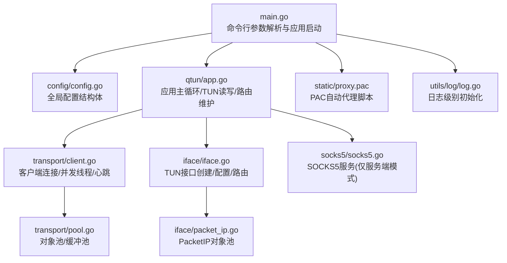
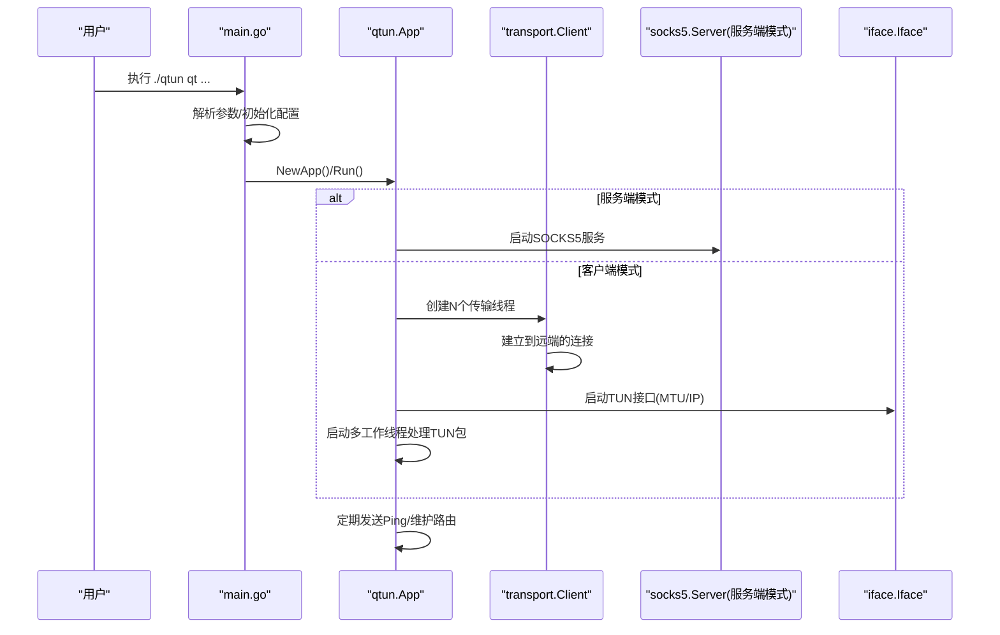
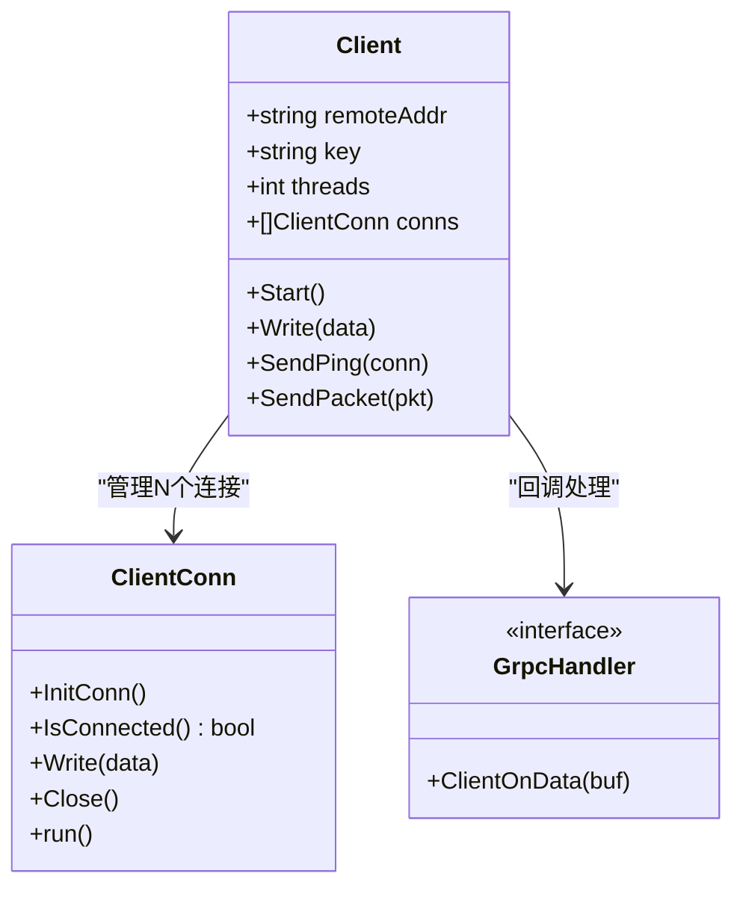
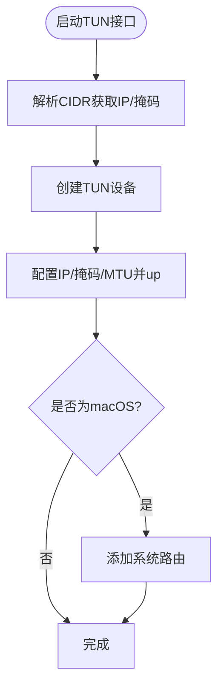
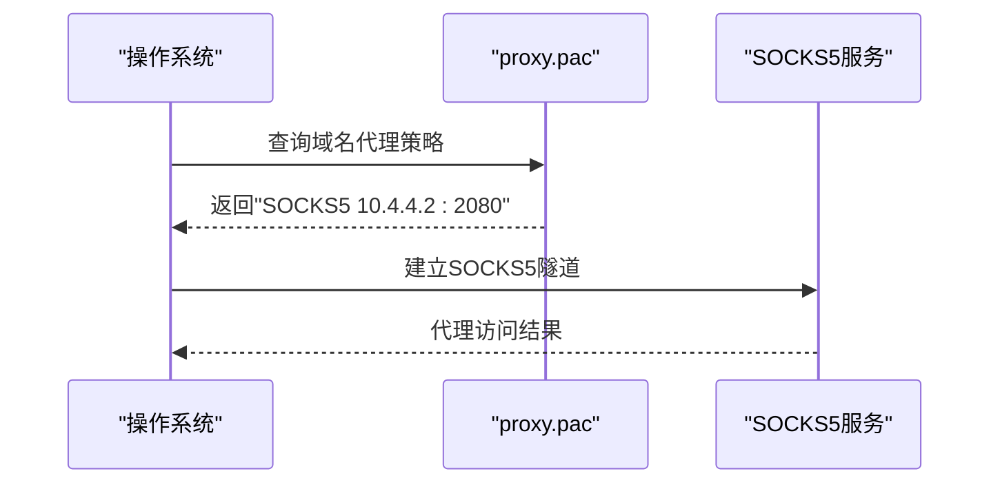
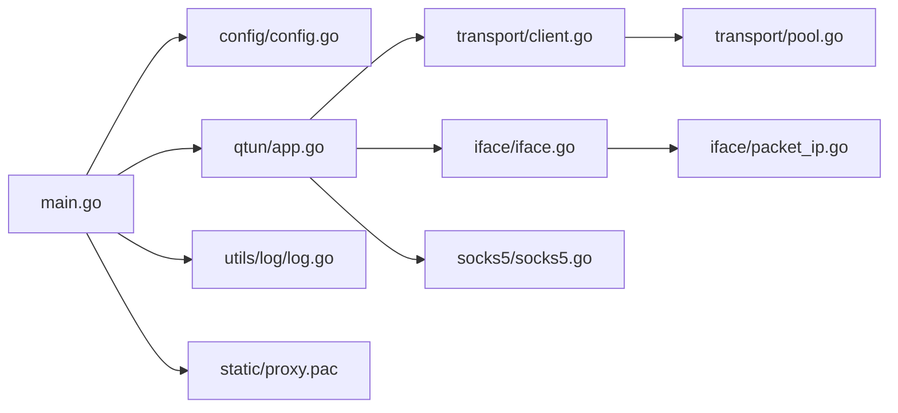
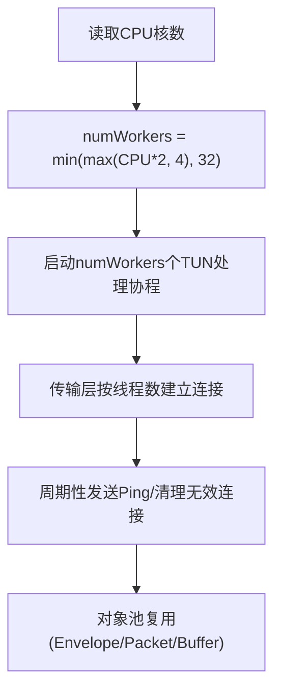
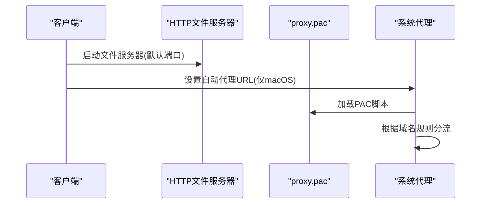

# 客户端使用

<cite>
**本文引用的文件**
- [README.md](file://README.md)
- [main.go](file://main.go)
- [config/config.go](file://config/config.go)
- [qtun/app.go](file://qtun/app.go)
- [transport/client.go](file://transport/client.go)
- [transport/pool.go](file://transport/pool.go)
- [iface/iface.go](file://iface/iface.go)
- [iface/packet_ip.go](file://iface/packet_ip.go)
- [socks5/socks5.go](file://socks5/socks5.go)
- [static/proxy.pac](file://static/proxy.pac)
- [utils/log/log.go](file://utils/log/log.go)
- [PERFORMANCE_TEST_GUIDE.md](file://PERFORMANCE_TEST_GUIDE.md)
</cite>

## 目录
1. [简介](#简介)
2. [项目结构](#项目结构)
3. [核心组件](#核心组件)
4. [架构总览](#架构总览)
5. [详细组件分析](#详细组件分析)
6. [依赖关系分析](#依赖关系分析)
7. [性能与并发配置](#性能与并发配置)
8. [系统代理配置指南](#系统代理配置指南)
9. [网络优化技巧](#网络优化技巧)
10. [故障排除与日志分析](#故障排除与日志分析)
11. [结论](#结论)
12. [附录：使用场景与最佳实践](#附录使用场景与最佳实践)

## 简介
本指南面向Qtun客户端使用者，围绕“如何正确配置与运行”展开，重点覆盖：
- 客户端连接配置：远程服务器地址、连接参数与网络设置
- 多连接并发机制：传输线程数量、连接池管理与性能调优
- 系统代理配置：PAC文件使用、浏览器与系统级代理设置
- 网络优化：MTU设置、路由配置与带宽管理
- 故障排除：连接问题诊断、性能监控与日志分析
- 不同使用场景的配置示例与最佳实践

## 项目结构
从入口到核心功能的关键文件与职责概览：
- 入口与命令行参数解析：main.go
- 全局配置：config/config.go
- 应用主循环与TUN处理：qtun/app.go
- 传输层客户端与连接池：transport/client.go、transport/pool.go
- TUN接口与MTU/路由：iface/iface.go、iface/packet_ip.go
- SOCKS5服务：socks5/socks5.go
- PAC自动代理脚本：static/proxy.pac
- 日志初始化：utils/log/log.go
- 性能测试与监控指南：PERFORMANCE_TEST_GUIDE.md

**图表来源**
- [main.go](file://main.go#L22-L103)
- [config/config.go](file://config/config.go#L3-L23)
- [qtun/app.go](file://qtun/app.go#L19-L49)
- [transport/client.go](file://transport/client.go#L20-L39)
- [transport/pool.go](file://transport/pool.go#L10-L50)
- [iface/iface.go](file://iface/iface.go#L16-L74)
- [iface/packet_ip.go](file://iface/packet_ip.go#L8-L39)
- [socks5/socks5.go](file://socks5/socks5.go#L17-L97)
- [static/proxy.pac](file://static/proxy.pac#L5251-L5275)
- [utils/log/log.go](file://utils/log/log.go#L10-L25)

**章节来源**
- [main.go](file://main.go#L22-L103)
- [config/config.go](file://config/config.go#L3-L23)

## 核心组件
- 全局配置结构体：包含密钥、远端地址、监听地址、传输线程数、虚拟IP、MTU、服务端模式、TCP NoDelay等
- 应用主循环：负责TUN接口启动、工作线程数量计算与调度、客户端/服务端分支逻辑
- 传输客户端：按线程数创建连接，维护连接集合，轮询或哈希选择发送通道，周期性发送Ping
- 连接池与对象池：对protobuf消息、读缓冲、PacketIP等进行复用，降低GC压力
- TUN接口：创建TUN设备、配置IP/掩码/Mtu，并在必要时添加系统路由
- PAC与系统代理：客户端可自动设置系统代理指向本地PAC；PAC脚本将域名分流至本地SOCKS5

**章节来源**
- [config/config.go](file://config/config.go#L3-L23)
- [qtun/app.go](file://qtun/app.go#L19-L97)
- [transport/client.go](file://transport/client.go#L20-L83)
- [transport/pool.go](file://transport/pool.go#L10-L108)
- [iface/iface.go](file://iface/iface.go#L16-L74)
- [static/proxy.pac](file://static/proxy.pac#L5251-L5275)

## 架构总览
客户端启动流程与数据通路如下：

**图表来源**
- [main.go](file://main.go#L75-L103)
- [qtun/app.go](file://qtun/app.go#L37-L97)
- [transport/client.go](file://transport/client.go#L41-L83)
- [socks5/socks5.go](file://socks5/socks5.go#L99-L118)
- [iface/iface.go](file://iface/iface.go#L31-L74)

## 详细组件分析

### 客户端连接配置
- 远程服务器地址：通过参数指定远端监听地址
- 密钥：用于加密通道
- 本地虚拟IP：客户端侧TUN接口的VIP
- 传输线程数：控制并发连接数量
- MTU：影响单包承载能力
- TCP NoDelay：可选关闭Nagle提升低延迟
- 日志级别：支持info/debug级别

建议：
- 远端地址与密钥需与服务端一致
- VIP网段避免与内网冲突
- 传输线程数与CPU核数匹配，兼顾并发与资源占用

**章节来源**
- [README.md](file://README.md#L51-L88)
- [main.go](file://main.go#L53-L66)
- [config/config.go](file://config/config.go#L3-L13)

### 多连接并发机制与连接池
- 传输线程数：客户端按线程数创建连接，每个连接独立收发
- 发送策略：轮询选择连接，保证负载均衡
- 心跳与存活：定期发送Ping，维持通道活跃
- 连接池与对象池：复用Envelope/Packet、读缓冲、PacketIP，降低GC与分配开销

**图表来源**
- [transport/client.go](file://transport/client.go#L20-L132)
- [transport/client.go](file://transport/client.go#L178-L222)

**章节来源**
- [transport/client.go](file://transport/client.go#L41-L83)
- [transport/client.go](file://transport/client.go#L114-L132)
- [transport/client.go](file://transport/client.go#L167-L206)
- [transport/pool.go](file://transport/pool.go#L10-L108)

### TUN接口与MTU/路由
- TUN接口创建：使用water库创建TUN设备
- IP/Mask/MTU配置：根据配置设置IP与MTU
- macOS路由：在启动时添加系统路由
- PacketIP对象池：减少大包分配与拷贝

**图表来源**
- [iface/iface.go](file://iface/iface.go#L31-L74)
- [iface/packet_ip.go](file://iface/packet_ip.go#L10-L39)

**章节来源**
- [iface/iface.go](file://iface/iface.go#L31-L74)
- [iface/packet_ip.go](file://iface/packet_ip.go#L10-L39)

### SOCKS5与PAC自动代理
- SOCKS5服务：服务端模式下启动本地SOCKS5服务
- PAC脚本：内置gfwlist规则，将命中域名通过本地SOCKS5代理
- 客户端自动代理：在macOS上可自动设置系统代理指向本地PAC

**图表来源**
- [static/proxy.pac](file://static/proxy.pac#L5251-L5275)
- [socks5/socks5.go](file://socks5/socks5.go#L99-L118)
- [qtun/app.go](file://qtun/app.go#L250-L270)

**章节来源**
- [static/proxy.pac](file://static/proxy.pac#L5251-L5275)
- [socks5/socks5.go](file://socks5/socks5.go#L99-L118)
- [qtun/app.go](file://qtun/app.go#L250-L270)

## 依赖关系分析
- main.go依赖配置模块、应用模块、日志模块、文件服务器与SOCKS5模块
- 应用模块依赖传输模块与TUN接口模块
- 传输模块依赖协议与对象池
- TUN模块依赖water库与系统命令

**图表来源**
- [main.go](file://main.go#L15-L20)
- [qtun/app.go](file://qtun/app.go#L11-L16)
- [transport/client.go](file://transport/client.go#L11-L18)
- [transport/pool.go](file://transport/pool.go#L3-L8)
- [iface/iface.go](file://iface/iface.go#L13-L14)
- [iface/packet_ip.go](file://iface/packet_ip.go#L3-L6)
- [socks5/socks5.go](file://socks5/socks5.go#L3-L11)
- [static/proxy.pac](file://static/proxy.pac#L1-L3)

**章节来源**
- [main.go](file://main.go#L15-L20)
- [qtun/app.go](file://qtun/app.go#L11-L16)

## 性能与并发配置
- 工作线程数：TUN包处理线程数按CPU核数×2动态计算，范围限制在4~32之间
- 传输线程数：客户端并发连接数由参数决定，默认1
- 对象池：Envelope、Packet、读缓冲、PacketIP均使用sync.Pool复用
- 心跳与清理：定期发送Ping并清理无效连接，保持路由表健康
- 监控与分析：内置性能监控端口与可视化界面，支持pprof与statsviz

**图表来源**
- [qtun/app.go](file://qtun/app.go#L79-L97)
- [transport/client.go](file://transport/client.go#L41-L83)
- [transport/pool.go](file://transport/pool.go#L10-L50)

**章节来源**
- [qtun/app.go](file://qtun/app.go#L79-L97)
- [transport/client.go](file://transport/client.go#L41-L83)
- [transport/pool.go](file://transport/pool.go#L10-L50)
- [PERFORMANCE_TEST_GUIDE.md](file://PERFORMANCE_TEST_GUIDE.md#L17-L24)

## 系统代理配置指南
- PAC文件位置：静态资源目录，可通过HTTP文件服务器访问
- 客户端自动代理：在macOS上可自动设置系统代理指向本地PAC
- 手动浏览器配置：在浏览器中设置自动代理为本地PAC URL
- 系统级代理：Linux/Windows不自动设置，需手动配置

**图表来源**
- [main.go](file://main.go#L98-L99)
- [qtun/app.go](file://qtun/app.go#L250-L270)
- [static/proxy.pac](file://static/proxy.pac#L5251-L5275)

**章节来源**
- [README.md](file://README.md#L21-L26)
- [main.go](file://main.go#L98-L99)
- [qtun/app.go](file://qtun/app.go#L250-L270)
- [static/proxy.pac](file://static/proxy.pac#L5251-L5275)

## 网络优化技巧
- MTU设置：通过参数调整MTU以适配路径MTU，避免分片
- 路由配置：TUN接口在macOS下自动添加系统路由
- 带宽管理：结合iperf3等工具评估链路容量，合理设置传输线程数
- TCP NoDelay：在高延迟链路上可考虑开启以降低延迟

**章节来源**
- [README.md](file://README.md#L75-L78)
- [iface/iface.go](file://iface/iface.go#L48-L71)
- [PERFORMANCE_TEST_GUIDE.md](file://PERFORMANCE_TEST_GUIDE.md#L51-L83)

## 故障排除与日志分析
- 启动与连接
  - 确认远端地址可达、密钥一致
  - 查看连接建立日志与重试记录
- 性能问题
  - 使用内置监控端口与pprof分析CPU/内存/Goroutine
  - 检查对象池使用情况与锁争用
- 日志级别
  - 通过参数设置日志级别，便于定位问题
- 常见症状
  - 无流量：检查TUN接口状态、路由表与PAC规则
  - 延迟高：检查链路质量、MTU与NoDelay设置

**章节来源**
- [transport/client.go](file://transport/client.go#L51-L68)
- [utils/log/log.go](file://utils/log/log.go#L10-L25)
- [PERFORMANCE_TEST_GUIDE.md](file://PERFORMANCE_TEST_GUIDE.md#L96-L134)

## 结论
Qtun客户端通过简洁的参数与完善的并发/对象池设计，在保证易用的同时提供了良好的性能与可观测性。结合PAC自动代理与系统代理设置，可在多种环境下快速落地。建议在生产环境中配合性能测试与监控工具持续优化。

## 附录：使用场景与最佳实践
- 开发联调：小规模并发，MTU默认，日志设为info
- 高并发场景：适当提高传输线程数与TUN工作线程数，启用pprof与statsviz
- 移动网络：降低MTU，启用NoDelay，关注丢包与抖动
- 企业内网：确保VIP网段不冲突，合理规划路由与PAC规则

**章节来源**
- [README.md](file://README.md#L51-L88)
- [PERFORMANCE_TEST_GUIDE.md](file://PERFORMANCE_TEST_GUIDE.md#L136-L187)