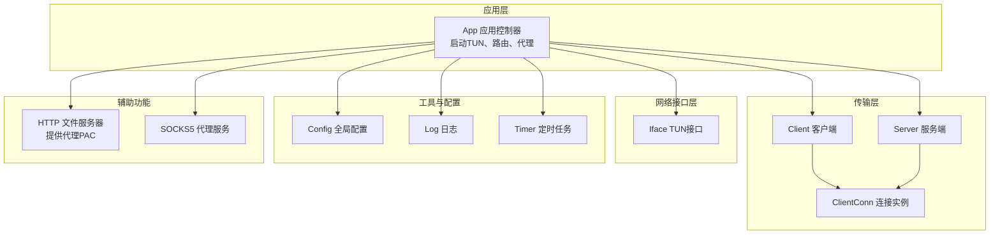
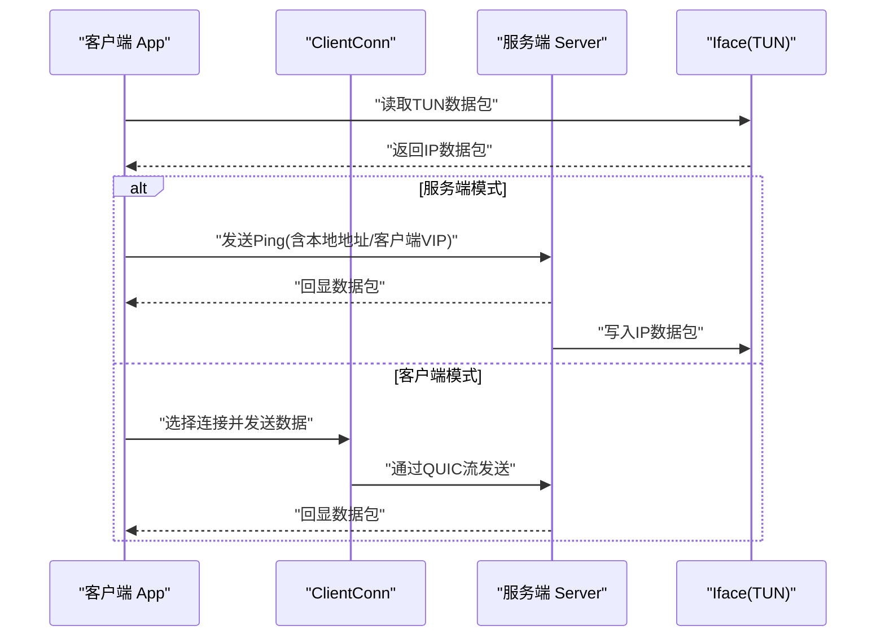
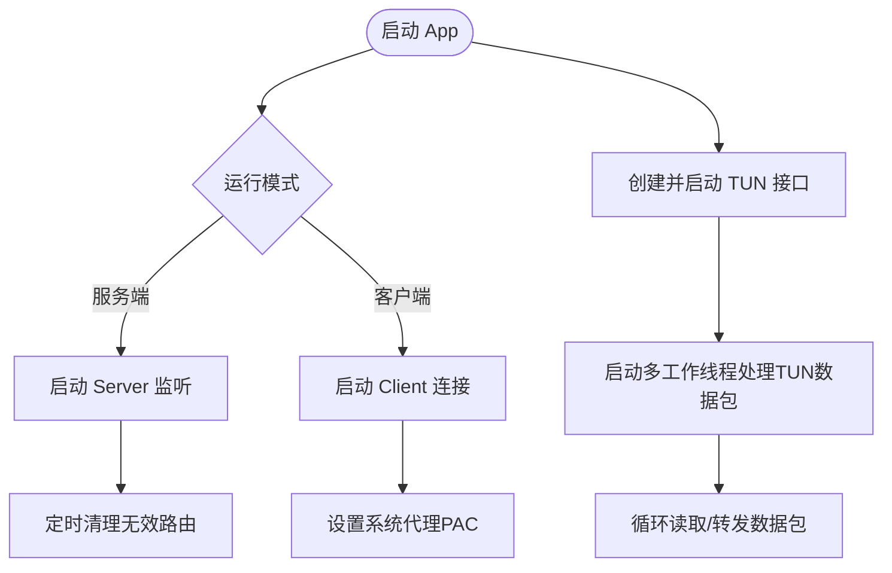
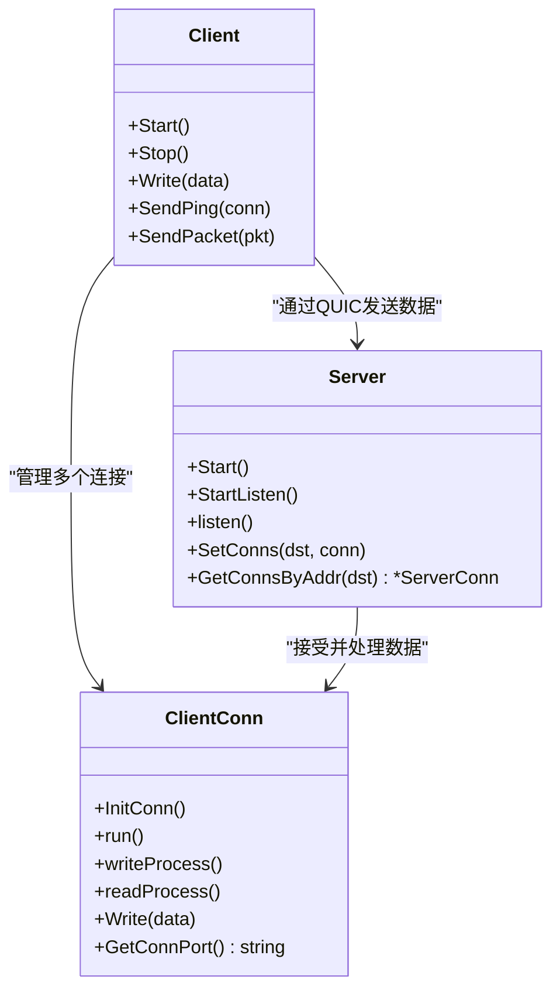
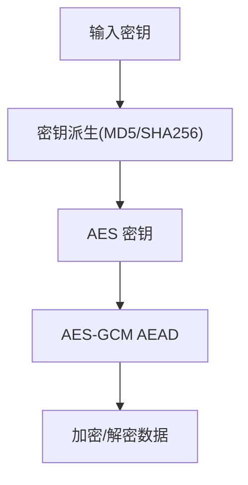
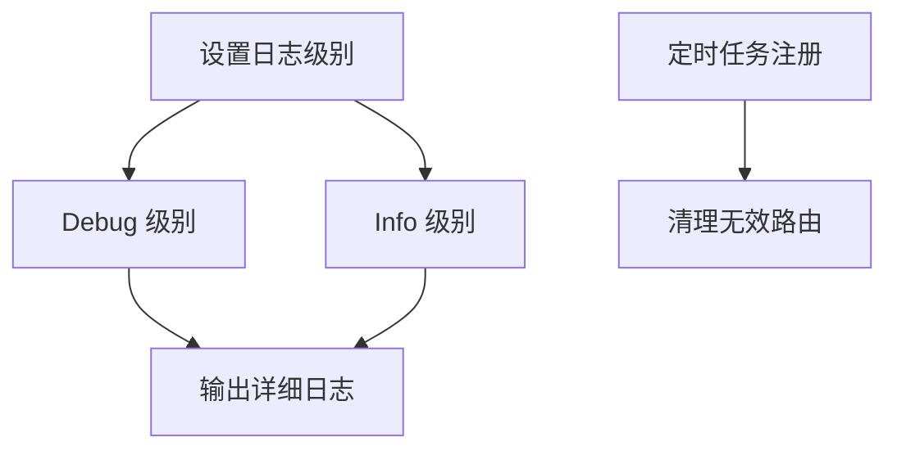
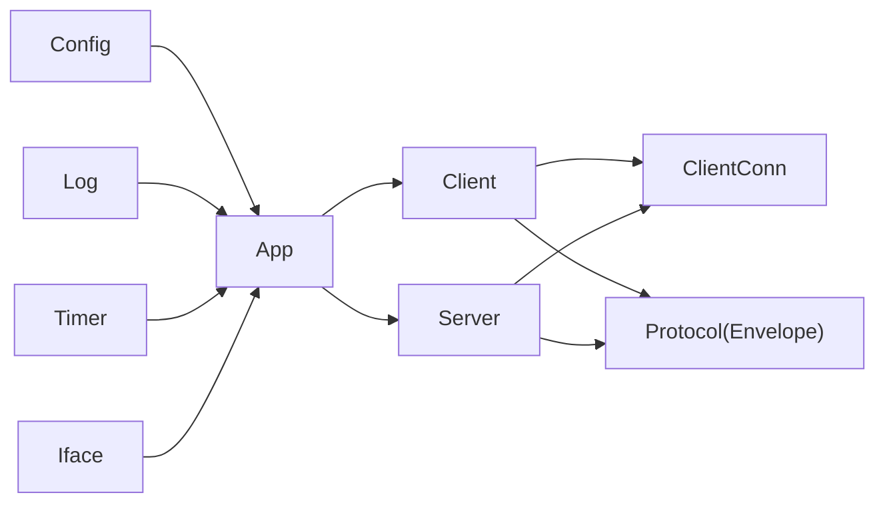
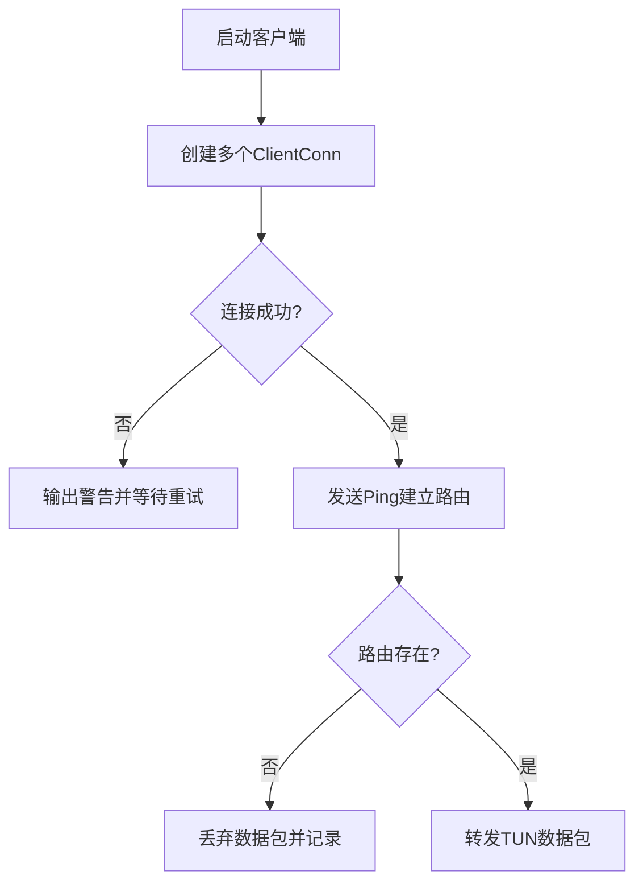

# 客户端故障排除

<cite>
**本文引用的文件**
- [main.go](file://main.go)
- [app.go](file://qtun/app.go)
- [config.go](file://config/config.go)
- [log.go](file://utils/log/log.go)
- [client.go](file://transport/client.go)
- [client_conn.go](file://transport/client_conn.go)
- [server.go](file://transport/server.go)
- [iface.go](file://iface/iface.go)
- [socks5.go](file://socks5/socks5.go)
- [crypto.go](file://transport/crypto.go)
- [timer.go](file://utils/timer/timer.go)
- [PERFORMANCE_TEST_GUIDE.md](file://PERFORMANCE_TEST_GUIDE.md)
- [README.md](file://README.md)
</cite>

## 目录
1. [简介](#简介)
2. [项目结构](#项目结构)
3. [核心组件](#核心组件)
4. [架构总览](#架构总览)
5. [详细组件分析](#详细组件分析)
6. [依赖关系分析](#依赖关系分析)
7. [性能问题诊断](#性能问题诊断)
8. [故障排除指南](#故障排除指南)
9. [结论](#结论)
10. [附录](#附录)

## 简介
本指南面向Qtun客户端使用者与运维工程师，提供从连接问题到性能问题的系统化故障排除流程。内容覆盖：
- 连接失败原因分析与网络连通性检查
- 日志级别设置与关键日志信息解读
- 性能问题诊断：连接数不足、延迟过高、丢包率分析
- 常见错误代码与解决方案：网络错误、认证失败、配置错误
- 调试工具使用与监控指标分析
- 自动化故障检测与恢复机制配置建议

## 项目结构
Qtun采用模块化设计，核心由应用层、传输层、网络接口层、日志与定时器工具组成；客户端通过QUIC建立多路复用通道，服务端监听并分发数据包。

**图表来源**
- [app.go](file://qtun/app.go#L37-L97)
- [client.go](file://transport/client.go#L31-L83)
- [client_conn.go](file://transport/client_conn.go#L44-L151)
- [server.go](file://transport/server.go#L37-L149)
- [iface.go](file://iface/iface.go#L23-L74)
- [config.go](file://config/config.go#L17-L23)
- [log.go](file://utils/log/log.go#L10-L25)
- [timer.go](file://utils/timer/timer.go#L14-L47)

**章节来源**
- [main.go](file://main.go#L70-L103)
- [README.md](file://README.md#L9-L26)

## 核心组件
- 应用控制器(App)：负责启动TUN接口、客户端/服务端、路由清理、系统代理设置等。
- 传输层(Client/Server)：基于QUIC实现的客户端与服务端，支持多连接、心跳、加解密。
- 网络接口层(Iface)：封装TUN设备的创建、配置与读写。
- 工具与配置：全局配置管理、日志初始化、定时器任务。
- 辅助服务：HTTP文件服务器(PAC)、SOCKS5代理服务。

**章节来源**
- [app.go](file://qtun/app.go#L19-L49)
- [client.go](file://transport/client.go#L20-L39)
- [server.go](file://transport/server.go#L23-L46)
- [iface.go](file://iface/iface.go#L16-L30)
- [config.go](file://config/config.go#L3-L13)
- [log.go](file://utils/log/log.go#L10-L25)
- [timer.go](file://utils/timer/timer.go#L9-L19)

## 架构总览
客户端与服务端通过QUIC建立长连接，客户端向服务端发送“Ping”以建立路由表，随后TUN数据包被封装为协议消息并经由QUIC流传输。

**图表来源**
- [app.go](file://qtun/app.go#L169-L207)
- [client.go](file://transport/client.go#L167-L206)
- [client_conn.go](file://transport/client_conn.go#L153-L188)
- [server.go](file://transport/server.go#L112-L148)
- [iface.go](file://iface/iface.go#L98-L104)

## 详细组件分析

### 应用层(App)与TUN接口
- 启动TUN接口并按配置设置IP与MTU；在macOS下自动添加系统路由。
- 客户端模式下自动设置系统代理PAC；服务端模式下启动SOCKS5。
- 启动多工作线程处理TUN数据包，动态工作线程数量与CPU核数相关。

**图表来源**
- [app.go](file://qtun/app.go#L37-L97)
- [app.go](file://qtun/app.go#L51-L70)
- [app.go](file://qtun/app.go#L250-L270)
- [iface.go](file://iface/iface.go#L31-L74)

**章节来源**
- [app.go](file://qtun/app.go#L72-L97)
- [app.go](file://qtun/app.go#L51-L70)
- [app.go](file://qtun/app.go#L250-L270)
- [iface.go](file://iface/iface.go#L31-L74)

### 传输层(客户端/服务端)
- 客户端：按配置创建多个ClientConn，每个连接独立维护加密状态与读写循环；启动周期性Ping维持路由。
- 服务端：监听QUIC地址，接受新会话并为每个会话开启读写协程；使用并发安全Map维护连接映射。

**图表来源**
- [client.go](file://transport/client.go#L31-L83)
- [client_conn.go](file://transport/client_conn.go#L44-L151)
- [server.go](file://transport/server.go#L37-L149)

**章节来源**
- [client.go](file://transport/client.go#L41-L83)
- [client_conn.go](file://transport/client_conn.go#L130-L151)
- [server.go](file://transport/server.go#L91-L149)

### 加解密与认证
- 客户端/服务端通过AES-GCM对消息进行加密封装；密钥派生使用MD5或SHA256。
- QUIC握手配置包含协议名称与窗口参数，提升并发与吞吐。

**图表来源**
- [crypto.go](file://transport/crypto.go#L10-L26)
- [client_conn.go](file://transport/client_conn.go#L241-L294)
- [server.go](file://transport/server.go#L96-L103)

**章节来源**
- [crypto.go](file://transport/crypto.go#L10-L26)
- [client_conn.go](file://transport/client_conn.go#L119-L128)
- [server.go](file://transport/server.go#L151-L173)

### 日志与定时器
- 日志支持Info/Debug两级，Debug仅在显式设置时输出。
- 定时器用于周期性清理无效路由，避免僵尸连接占用资源。

**图表来源**
- [log.go](file://utils/log/log.go#L10-L25)
- [timer.go](file://utils/timer/timer.go#L21-L47)
- [app.go](file://qtun/app.go#L51-L70)

**章节来源**
- [log.go](file://utils/log/log.go#L10-L25)
- [timer.go](file://utils/timer/timer.go#L21-L47)
- [app.go](file://qtun/app.go#L51-L70)

## 依赖关系分析
- 应用层依赖配置、日志、定时器与网络接口；客户端/服务端依赖QUIC与协议封装。
- 传输层内部通过接口回调与通道进行数据流转，避免阻塞。

**图表来源**
- [config.go](file://config/config.go#L17-L23)
- [log.go](file://utils/log/log.go#L10-L25)
- [timer.go](file://utils/timer/timer.go#L14-L47)
- [app.go](file://qtun/app.go#L29-L35)
- [client.go](file://transport/client.go#L31-L39)
- [server.go](file://transport/server.go#L37-L46)

**章节来源**
- [config.go](file://config/config.go#L17-L23)
- [app.go](file://qtun/app.go#L29-L35)
- [client.go](file://transport/client.go#L31-L39)
- [server.go](file://transport/server.go#L37-L46)

## 性能问题诊断
- 吞吐量与延迟测试：使用iperf3与ping进行基准测试；结合pprof与statsviz进行CPU/内存/Goroutine分析。
- 并发连接与Worker数量：确认日志中“Starting TUN packet workers”的数量是否符合CPU核数×2的预期范围。
- QUIC参数：通过抓包观察窗口大小与保活周期，确保服务端/客户端配置一致。
- 资源使用：关注CPU使用率、内存分配、GC暂停时间与Goroutine数量趋势。

**章节来源**
- [PERFORMANCE_TEST_GUIDE.md](file://PERFORMANCE_TEST_GUIDE.md#L26-L109)
- [PERFORMANCE_TEST_GUIDE.md](file://PERFORMANCE_TEST_GUIDE.md#L189-L232)
- [app.go](file://qtun/app.go#L79-L96)
- [server.go](file://transport/server.go#L96-L103)
- [client_conn.go](file://transport/client_conn.go#L84-L91)

## 故障排除指南

### 一、连接问题诊断
- 网络连通性检查
  - 使用ping/iperf3验证服务器可达与带宽。
  - 在客户端侧确认TUN接口已创建并配置IP/MTU。
- QUIC握手与路由建立
  - 客户端启动后会发送Ping以建立路由；若无路由项，数据包会被丢弃。
  - 观察日志中“Proto Ping”与“Route Table”输出，确认路由是否建立成功。
- 多连接与重试
  - 客户端按配置创建多个连接，若部分连接未能建立，会输出警告并继续重试。
  - 若所有连接均失败，需检查远端地址、防火墙与证书配置。

**图表来源**
- [client.go](file://transport/client.go#L41-L83)
- [client.go](file://transport/client.go#L167-L206)
- [app.go](file://qtun/app.go#L169-L196)

**章节来源**
- [client.go](file://transport/client.go#L41-L83)
- [client.go](file://transport/client.go#L167-L206)
- [app.go](file://qtun/app.go#L169-L196)
- [iface.go](file://iface/iface.go#L31-L74)

### 二、日志分析技巧
- 日志级别设置
  - 通过命令行参数设置log_level为info或debug，以获得更详细的运行信息。
- 关键日志解读
  - “Starting TUN packet workers”：确认工作线程数量与CPU核数匹配。
  - “send ping”/“Proto Ping”：确认路由建立成功。
  - “connect server fail”/“InitConn::client connection thread panic”：定位连接失败与异常。
  - “add system route fail”/“run ifconfig fail”：检查TUN配置与权限。

**章节来源**
- [log.go](file://utils/log/log.go#L10-L25)
- [app.go](file://qtun/app.go#L86-L86)
- [client_conn.go](file://transport/client_conn.go#L130-L151)
- [client_conn.go](file://transport/client_conn.go#L173-L187)
- [iface.go](file://iface/iface.go#L61-L67)

### 三、常见错误与解决方案
- 网络错误
  - 现象：连接超时、QUIC握手失败。
  - 排查：检查服务器监听地址、防火墙策略、NAT/CDN对QUIC的影响。
  - 参考：服务端/客户端的QUIC配置与TLS证书生成逻辑。
- 认证失败
  - 现象：Ping无法建立或数据包被拒绝。
  - 排查：确认密钥一致、AES-GCM派生正常。
  - 参考：密钥派生与加密封装流程。
- 配置错误
  - 现象：TUN接口创建失败、系统路由未添加。
  - 排查：检查IP/Mask/MTU配置、平台差异（macOS vs Linux）。
  - 参考：TUN接口创建与系统路由添加逻辑。

**章节来源**
- [server.go](file://transport/server.go#L151-L173)
- [client_conn.go](file://transport/client_conn.go#L119-L128)
- [client_conn.go](file://transport/client_conn.go#L241-L294)
- [iface.go](file://iface/iface.go#L31-L74)

### 四、调试工具与监控指标
- 性能监控
  - pprof与statsviz：访问本地6060端口进行CPU/内存/Goroutine分析。
- 连接与路由
  - 查看“Route Table”与“clean route”日志，确认路由有效性。
- 系统代理
  - 客户端模式下自动设置PAC；如失败，需手动配置。

**章节来源**
- [main.go](file://main.go#L118-L129)
- [PERFORMANCE_TEST_GUIDE.md](file://PERFORMANCE_TEST_GUIDE.md#L17-L24)
- [app.go](file://qtun/app.go#L51-L70)
- [app.go](file://qtun/app.go#L250-L270)

### 五、自动化故障检测与恢复
- 自动化检测
  - 使用定时器定期清理无效路由，避免僵尸连接影响转发。
  - 客户端周期性Ping维持路由，异常时自动重连。
- 恢复机制
  - 连接断开后，ClientConn会尝试重新建立；若失败则记录错误并等待下次重试。
  - 服务端接受新会话并为每个会话独立处理读写，异常退出时移除连接映射。

**章节来源**
- [timer.go](file://utils/timer/timer.go#L21-L47)
- [client.go](file://transport/client.go#L75-L82)
- [client_conn.go](file://transport/client_conn.go#L173-L187)
- [server.go](file://transport/server.go#L140-L148)

## 结论
Qtun通过模块化设计与QUIC传输实现了高可靠的数据转发。故障排除的关键在于：正确配置网络与TUN、合理设置日志级别、利用性能工具定位瓶颈，并通过定时清理与重连机制保障稳定性。建议在生产环境中结合自动化监控与告警，持续跟踪路由、连接数与资源使用趋势。

## 附录
- 快速启动参考
  - 服务端：指定监听地址、IP段与server_mode。
  - 客户端：指定远端地址、IP段与可选的多线程传输。
- 常用命令
  - 设置系统代理PAC（客户端模式自动执行）。
  - 启动HTTP文件服务器提供PAC文件。

**章节来源**
- [README.md](file://README.md#L13-L26)
- [main.go](file://main.go#L48-L66)
- [app.go](file://qtun/app.go#L250-L270)