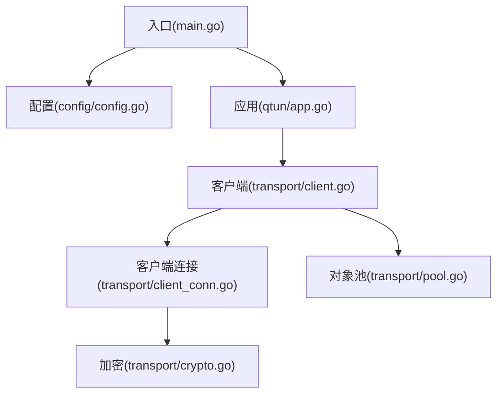
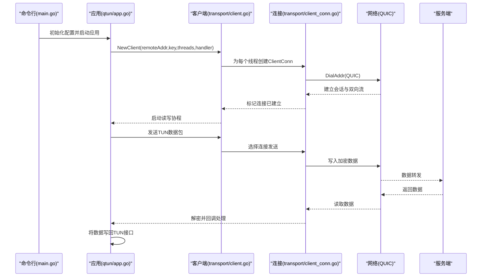
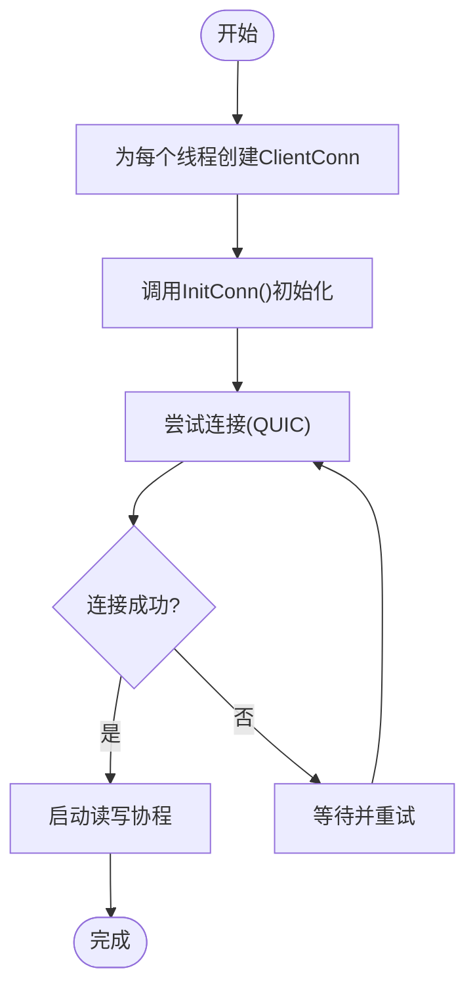
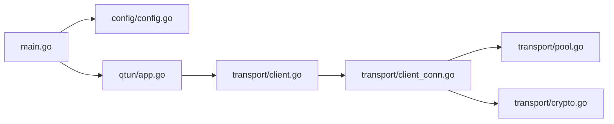

# 客户端连接配置

<cite>
**本文引用的文件**
- [main.go](file://main.go)
- [config/config.go](file://config/config.go)
- [qtun/app.go](file://qtun/app.go)
- [transport/client.go](file://transport/client.go)
- [transport/client_conn.go](file://transport/client_conn.go)
- [transport/pool.go](file://transport/pool.go)
- [transport/crypto.go](file://transport/crypto.go)
- [README.md](file://README.md)
</cite>

## 目录
1. [简介](#简介)
2. [项目结构](#项目结构)
3. [核心组件](#核心组件)
4. [架构总览](#架构总览)
5. [详细组件分析](#详细组件分析)
6. [依赖关系分析](#依赖关系分析)
7. [性能考量](#性能考量)
8. [故障排查指南](#故障排查指南)
9. [结论](#结论)
10. [附录](#附录)

## 简介
本指南聚焦于Qtun客户端的连接配置与建立流程，涵盖远程服务器地址配置、连接参数设置、QUIC连接建立机制、多连接并发创建、连接状态检查与重连机制，并提供最佳实践建议（超时设置、重试策略、连接池管理），以及常见配置错误的解决方案。读者无需深入的底层实现知识即可按步骤完成正确的客户端配置。

## 项目结构
- 入口与命令行参数解析：main.go
- 全局配置：config/config.go
- 应用主流程：qtun/app.go
- 客户端连接与并发：transport/client.go、transport/client_conn.go
- 对象池与加密：transport/pool.go、transport/crypto.go
- 使用说明与示例：README.md

图表来源
- [main.go](file://main.go#L75-L84)
- [config/config.go](file://config/config.go#L17-L23)
- [qtun/app.go](file://qtun/app.go#L37-L48)
- [transport/client.go](file://transport/client.go#L41-L83)
- [transport/client_conn.go](file://transport/client_conn.go#L44-L56)
- [transport/pool.go](file://transport/pool.go#L10-L51)
- [transport/crypto.go](file://transport/crypto.go#L10-L17)

章节来源
- [main.go](file://main.go#L22-L84)
- [config/config.go](file://config/config.go#L3-L23)
- [qtun/app.go](file://qtun/app.go#L19-L48)

## 核心组件
- 命令行参数与全局配置
  - 关键参数：密钥、远端地址、监听地址、传输线程数、TUN IP、MTU、日志级别、是否仅代理模式、是否服务端模式、TCP NoDelay、文件服务器端口等。
  - 配置初始化：通过命令行参数构建Config并调用InitConfig写入全局单例。
- 应用层初始化
  - 根据ServerMode决定运行模式；非服务端模式下创建并启动客户端，同时设置系统代理。
- 客户端连接
  - NewClient(remoteAddr, key, threads, handler)：构造客户端实例，threads控制并发连接数量。
  - Start()：为每个线程序列化创建ClientConn，执行初始化与连接尝试，最多等待若干次轮询确认连接状态，成功则启动读写协程。
  - 连接状态检查：IsConnected()与ConnectWait()用于判断与等待所有连接就绪。
  - 发送数据：Write/WriteNow按轮询策略选择连接发送。
- 连接建立机制
  - QUIC会话与流：使用quic-go进行DialAddr，OpenStreamSync建立双向流。
  - 加密：可选AES-GCM，基于密钥派生生成AEAD。
  - 重连：ClientConn.run()循环尝试连接，失败后短暂休眠再重试。
- 对象池与性能优化
  - Protobuf消息、缓冲区、读缓冲、随机数nonce等均使用sync.Pool复用，降低GC压力。

章节来源
- [main.go](file://main.go#L22-L84)
- [config/config.go](file://config/config.go#L3-L23)
- [qtun/app.go](file://qtun/app.go#L29-L48)
- [transport/client.go](file://transport/client.go#L31-L132)
- [transport/client_conn.go](file://transport/client_conn.go#L44-L151)
- [transport/pool.go](file://transport/pool.go#L10-L108)
- [transport/crypto.go](file://transport/crypto.go#L10-L17)

## 架构总览
客户端从命令行参数读取配置，初始化全局Config，随后在应用层创建并启动Client。Client为每个线程创建ClientConn，每个ClientConn负责独立的QUIC会话与流，实现多路并发与负载分摊。应用层通过TUN接口读取IP包，经由Client发送至服务端；服务端返回的数据同样经由ClientConn到达TUN接口。

图表来源
- [main.go](file://main.go#L75-L84)
- [qtun/app.go](file://qtun/app.go#L37-L48)
- [transport/client.go](file://transport/client.go#L41-L83)
- [transport/client_conn.go](file://transport/client_conn.go#L69-L117)

## 详细组件分析

### 命令行参数与配置初始化
- 参数定义与默认值
  - 密钥：--key，默认"hello-world"
  - 远端地址：--remote_addrs，默认"2.2.2.2:8080"
  - 监听地址：--listen，默认"0.0.0.0:8080"
  - 传输线程数：--transport_threads，默认1
  - TUN IP：--ip，默认"10.237.0.1/16"
  - MTU：--mtu，默认1500
  - 日志级别：--log_level，默认"info"
  - 仅代理模式：--proxyonly
  - 服务端模式：--server_mode
  - TCP NoDelay：--nodelay
  - SOCKS5端口：--socks5_port，默认2080
  - 文件服务器目录与端口：--file_dir、--file_svr_port
- 配置初始化流程
  - 命令行解析后调用InitConfig(cfg)，将配置写入全局单例，供后续模块读取。

章节来源
- [main.go](file://main.go#L22-L84)
- [config/config.go](file://config/config.go#L17-L23)

### 应用层初始化与客户端启动
- 模式判断
  - ServerMode=true：启动SOCKS5服务端
  - ServerMode=false：启动HTTP文件服务器
- 客户端启动
  - NewApp()创建应用实例
  - Run()中根据配置创建并启动Client，随后启动TUN接口与工作协程

章节来源
- [qtun/app.go](file://qtun/app.go#L29-L48)
- [qtun/app.go](file://qtun/app.go#L72-L97)

### NewClient函数与参数配置
- 函数签名与参数
  - NewClient(remoteAddr string, key string, threads int, handler GrpcHandler) *Client
  - 参数说明：
    - remoteAddr：远端服务器地址，如"8.8.8.80:8080"
    - key：加密密钥，用于AES-GCM派生
    - threads：并发连接数，决定ClientConn数量
    - handler：数据回调接口，用于接收服务端返回的数据
- 参数来源
  - 来自全局配置：remoteAddr来自Config.RemoteAddrs，key来自Config.Key，threads来自Config.TransportThreads

章节来源
- [transport/client.go](file://transport/client.go#L31-L39)
- [config/config.go](file://config/config.go#L4-L7)
- [qtun/app.go](file://qtun/app.go#L43-L44)

### 连接建立机制与多连接并发
- 并发创建
  - Start()为每个线程创建ClientConn，设置处理器，调用InitConn()初始化并尝试连接
  - 最多重试若干次轮询IsConnected()以确认连接状态
  - 成功后启动对应ClientConn的读写协程
- 连接状态检查
  - IsConnected()提供只读连接状态查询
  - ConnectWait()阻塞等待所有连接达到“已连接”状态
- 负载分发
  - Write/WriteNow按原子递增序列取模选择连接，实现简单的轮询负载均衡

图表来源
- [transport/client.go](file://transport/client.go#L41-L83)
- [transport/client_conn.go](file://transport/client_conn.go#L130-L151)

章节来源
- [transport/client.go](file://transport/client.go#L41-L132)
- [transport/client_conn.go](file://transport/client_conn.go#L130-L151)

### QUIC连接建立与加密
- QUIC会话与流
  - 使用quic-go的DialAddr建立会话，OpenStreamSync创建双向流
  - QUIC配置包含最大并发流、接收窗口、KeepAlive周期、启用Datagrams等
- 加密
  - 可选AES-GCM加密，基于密钥派生生成AEAD
  - 发送前根据是否启用加密决定数据格式与附加nonce
- 读写流程
  - 写入：将数据长度与内容写入缓冲，必要时追加nonce，通过流写出
  - 读取：从流读取数据，解密并回调上层处理

章节来源
- [transport/client_conn.go](file://transport/client_conn.go#L69-L117)
- [transport/client_conn.go](file://transport/client_conn.go#L241-L294)
- [transport/client_conn.go](file://transport/client_conn.go#L309-L357)
- [transport/crypto.go](file://transport/crypto.go#L10-L17)

### 连接状态检查与重连机制
- 连接状态
  - IsConnected()提供只读状态
  - setConnected()在连接建立或异常关闭时更新状态
- 重连策略
  - ClientConn.run()循环尝试连接，失败后短暂休眠再重试
  - Client.Start()对每个连接最多轮询若干次确认连接状态
- Ping与心跳
  - Client.ping()定时向所有连接发送Ping，维持活跃性

章节来源
- [transport/client_conn.go](file://transport/client_conn.go#L62-L67)
- [transport/client_conn.go](file://transport/client_conn.go#L153-L188)
- [transport/client.go](file://transport/client.go#L41-L83)
- [transport/client.go](file://transport/client.go#L142-L157)

### 对象池与性能优化
- 对象池
  - Envelope、MessagePing、MessagePacket、读缓冲、nonce等均使用sync.Pool复用
- 性能收益
  - 减少频繁分配与GC开销，提升高并发场景下的吞吐与延迟表现

章节来源
- [transport/pool.go](file://transport/pool.go#L10-L108)

## 依赖关系分析
- 组件耦合
  - main.go依赖config.InitConfig与qtun.NewApp
  - qtun/app.go依赖transport.Client与Config
  - transport/client.go依赖transport/client_conn.go与Config
  - transport/client_conn.go依赖quic-go、crypto/aes、sync.Pool
- 外部依赖
  - quic-go：QUIC协议栈
  - protobuf：消息编解码
  - zerolog：日志

图表来源
- [main.go](file://main.go#L75-L84)
- [config/config.go](file://config/config.go#L17-L23)
- [qtun/app.go](file://qtun/app.go#L37-L48)
- [transport/client.go](file://transport/client.go#L41-L83)
- [transport/client_conn.go](file://transport/client_conn.go#L44-L56)
- [transport/pool.go](file://transport/pool.go#L10-L51)
- [transport/crypto.go](file://transport/crypto.go#L10-L17)

章节来源
- [main.go](file://main.go#L75-L84)
- [qtun/app.go](file://qtun/app.go#L37-L48)
- [transport/client.go](file://transport/client.go#L41-L83)
- [transport/client_conn.go](file://transport/client_conn.go#L44-L56)

## 性能考量
- 并发连接数
  - 通过--transport_threads调整，建议结合CPU核数与网络状况评估，避免过度并发导致资源争用
- 缓冲与池化
  - 使用sync.Pool复用消息与缓冲，减少内存分配
- QUIC参数
  - 合理设置最大并发流与接收窗口，有助于提升吞吐
- 线程与工作协程
  - TUN接口读取采用动态工作协程数，通常为CPU核数的倍数，兼顾I/O并行

章节来源
- [qtun/app.go](file://qtun/app.go#L72-L97)
- [transport/pool.go](file://transport/pool.go#L10-L51)
- [transport/client_conn.go](file://transport/client_conn.go#L84-L91)

## 故障排查指南
- 连接无法建立
  - 检查远端地址与端口是否正确，确保服务端监听正常
  - 确认密钥一致且未被篡改
  - 查看日志中关于连接失败与panic的信息
- 连接不稳定或频繁断开
  - 检查网络环境与防火墙策略
  - 调整--transport_threads，观察是否因过多连接导致资源紧张
  - 关注ClientConn.run()中的重试日志
- 加密相关问题
  - 确保--key一致，密钥长度与格式符合预期
  - 若不需要加密，保持--key为空字符串
- 代理与系统集成
  - 在支持的操作系统上，应用会尝试设置系统代理；若失败，请手动配置

章节来源
- [transport/client_conn.go](file://transport/client_conn.go#L153-L188)
- [transport/client.go](file://transport/client.go#L41-L83)
- [qtun/app.go](file://qtun/app.go#L250-L270)

## 结论
Qtun客户端通过命令行参数驱动配置，以多连接并发的方式利用QUIC协议实现稳定高效的隧道通信。合理设置远端地址、密钥与并发线程数，并结合对象池与QUIC参数优化，可在不同网络环境下获得良好的性能与可靠性。遇到连接问题时，优先检查参数一致性、网络可达性与日志输出。

## 附录

### 配置示例
- 服务端示例
  - 参考：[README.md](file://README.md#L13-L19)
- 客户端示例
  - 参考：[README.md](file://README.md#L21-L26)
- 常用参数组合
  - --key "your-secret-key"
  - --remote_addrs "server-ip:port"
  - --ip "10.x.y.z/24"
  - --transport_threads N
  - --mtu 1500
  - --log_level info
  - --nodelay (可选)

章节来源
- [README.md](file://README.md#L13-L26)

### 常见配置错误与解决
- 错误：远端地址格式不正确
  - 现象：连接失败或超时
  - 解决：确保格式为"IP:端口"，端口开放且服务端监听
- 错误：密钥不一致
  - 现象：握手失败或数据无法解密
  - 解决：确保客户端与服务端使用相同密钥
- 错误：并发线程数过高
  - 现象：CPU占用飙升、连接抖动
  - 解决：适当降低--transport_threads，观察系统资源与连接稳定性
- 错误：系统代理未生效
  - 现象：浏览器或系统无法走代理
  - 解决：在支持的系统上让应用自动设置代理，否则手动配置

章节来源
- [transport/client_conn.go](file://transport/client_conn.go#L69-L117)
- [transport/client.go](file://transport/client.go#L41-L83)
- [qtun/app.go](file://qtun/app.go#L250-L270)