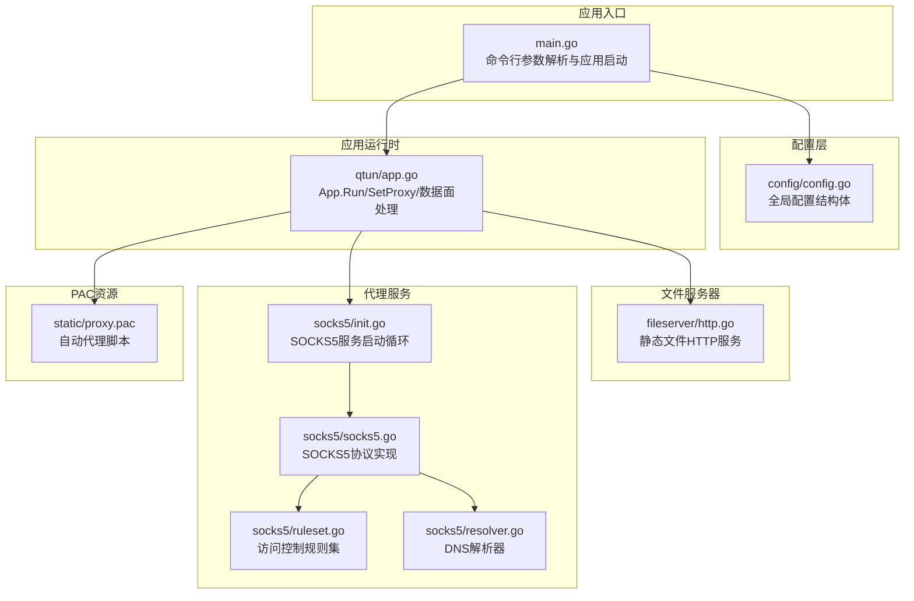
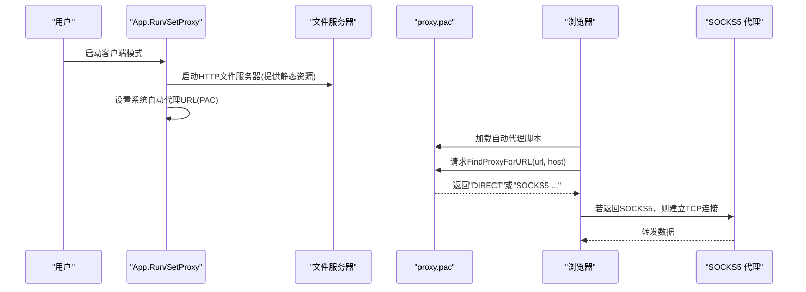
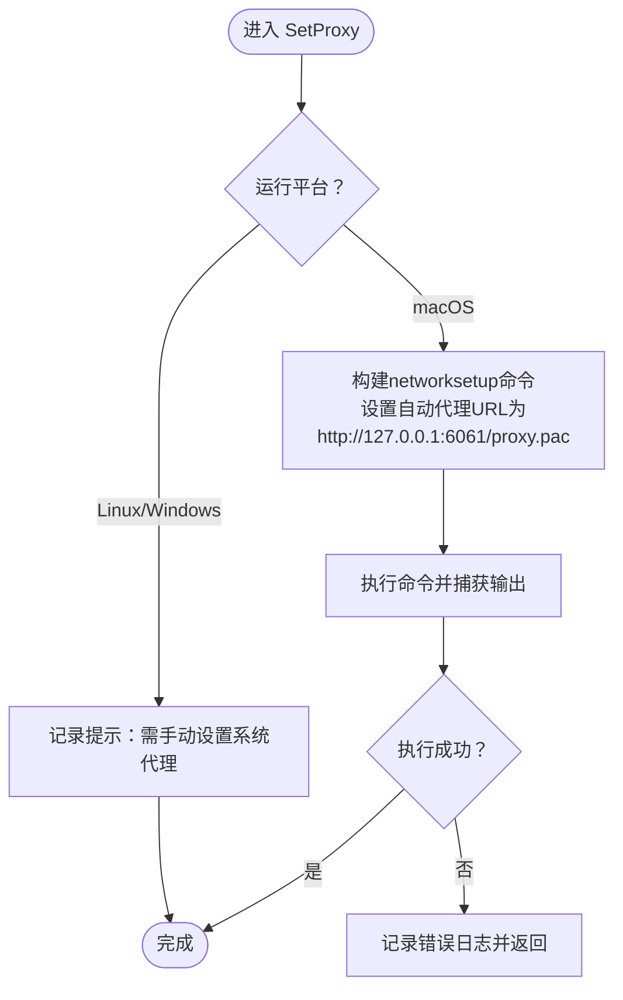
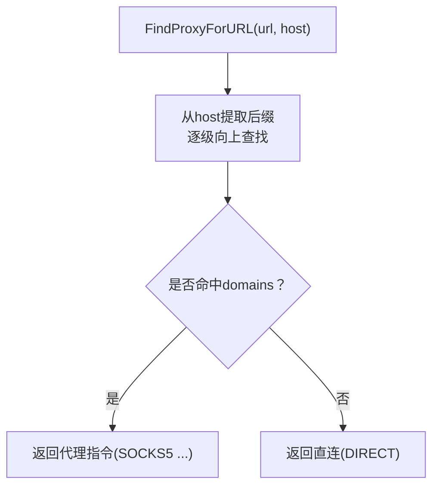
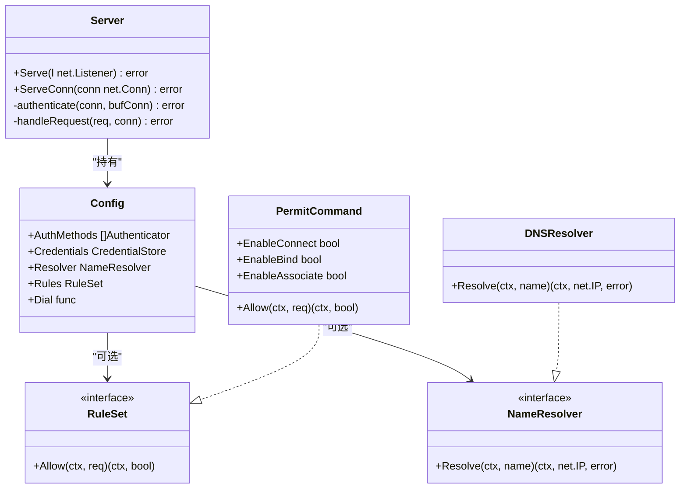
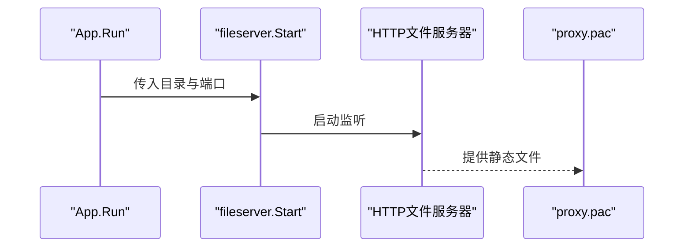
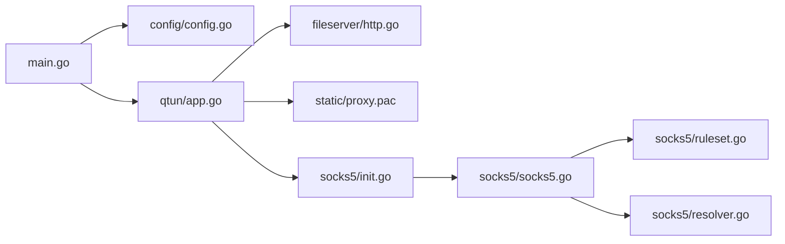
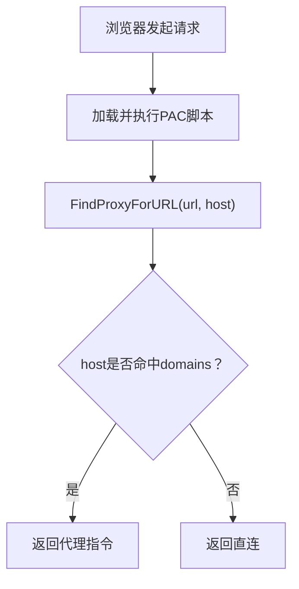

# 系统代理配置

<cite>
**本文引用的文件**
- [main.go](file://main.go)
- [config/config.go](file://config/config.go)
- [qtun/app.go](file://qtun/app.go)
- [fileserver/http.go](file://fileserver/http.go)
- [socks5/socks5.go](file://socks5/socks5.go)
- [socks5/init.go](file://socks5/init.go)
- [socks5/ruleset.go](file://socks5/ruleset.go)
- [socks5/resolver.go](file://socks5/resolver.go)
- [static/proxy.pac](file://static/proxy.pac)
- [README.md](file://README.md)
</cite>

## 目录
1. [简介](#简介)
2. [项目结构](#项目结构)
3. [核心组件](#核心组件)
4. [架构总览](#架构总览)
5. [详细组件分析](#详细组件分析)
6. [依赖关系分析](#依赖关系分析)
7. [性能与可靠性考量](#性能与可靠性考量)
8. [故障排查指南](#故障排查指南)
9. [结论](#结论)
10. [附录：代理配置操作手册](#附录代理配置操作手册)

## 简介
本指南围绕 Qtun 的系统代理配置展开，重点覆盖以下方面：
- PAC 文件的生成与配置：解释 proxy.pac 的工作机制、域名匹配逻辑以及如何在系统中启用自动代理。
- 浏览器代理设置：针对 Chrome、Firefox 等主流浏览器的 PAC 配置步骤。
- 系统级代理配置：macOS 和 Linux 的系统代理设置方法与注意事项。
- 代理自动配置实现原理：基于 PAC 脚本的规则匹配与代理选择策略。
- 自定义 PAC 脚本编写：可扩展的规则与函数结构。
- 代理测试与网络连通性验证：通过命令行工具与日志定位问题。
- 最佳实践与常见问题：跨平台差异、权限与安全注意事项。

## 项目结构
Qtun 提供了完整的代理链路：客户端启动后，自动通过系统命令为 macOS 设置 PAC 地址；同时内置 HTTP 文件服务器用于提供 proxy.pac；SOCKS5 代理监听本地端口，PAC 脚本根据域名列表决定直连或经由 SOCKS5 代理转发。

**图表来源**
- [main.go](file://main.go#L70-L103)
- [config/config.go](file://config/config.go#L3-L23)
- [qtun/app.go](file://qtun/app.go#L37-L49)
- [fileserver/http.go](file://fileserver/http.go#L9-L16)
- [socks5/socks5.go](file://socks5/socks5.go#L53-L97)
- [socks5/init.go](file://socks5/init.go#L5-L22)
- [socks5/ruleset.go](file://socks5/ruleset.go#L7-L41)
- [socks5/resolver.go](file://socks5/resolver.go#L9-L23)
- [static/proxy.pac](file://static/proxy.pac#L5251-L5275)

**章节来源**
- [main.go](file://main.go#L70-L103)
- [config/config.go](file://config/config.go#L3-L23)
- [qtun/app.go](file://qtun/app.go#L37-L49)
- [fileserver/http.go](file://fileserver/http.go#L9-L16)
- [socks5/socks5.go](file://socks5/socks5.go#L53-L97)
- [socks5/init.go](file://socks5/init.go#L5-L22)
- [socks5/ruleset.go](file://socks5/ruleset.go#L7-L41)
- [socks5/resolver.go](file://socks5/resolver.go#L9-L23)
- [static/proxy.pac](file://static/proxy.pac#L5251-L5275)

## 核心组件
- 命令行与应用入口：负责解析参数、初始化日志与配置，并按模式启动服务（服务端或客户端）。
- 应用运行时 App：负责 TUN 接口读写、数据面转发、系统代理设置（macOS）。
- 文件服务器：提供静态资源（含 proxy.pac）的 HTTP 服务。
- SOCKS5 代理：实现 SOCKS5 协议、认证、请求处理与连接转发。
- PAC 脚本：基于域名白名单决定直连或走代理。

**章节来源**
- [main.go](file://main.go#L70-L103)
- [qtun/app.go](file://qtun/app.go#L37-L49)
- [fileserver/http.go](file://fileserver/http.go#L9-L16)
- [socks5/socks5.go](file://socks5/socks5.go#L53-L97)
- [static/proxy.pac](file://static/proxy.pac#L5251-L5275)

## 架构总览
下图展示了 Qtun 在客户端模式下的代理链路：应用启动后，先启动 HTTP 文件服务器以提供 PAC；随后设置系统自动代理 URL 指向该 PAC；浏览器加载 PAC 后，根据域名匹配决定直连或经由本地 SOCKS5 代理转发。

**图表来源**
- [qtun/app.go](file://qtun/app.go#L37-L49)
- [qtun/app.go](file://qtun/app.go#L250-L270)
- [fileserver/http.go](file://fileserver/http.go#L9-L16)
- [static/proxy.pac](file://static/proxy.pac#L5251-L5275)
- [socks5/socks5.go](file://socks5/socks5.go#L120-L169)

**章节来源**
- [qtun/app.go](file://qtun/app.go#L37-L49)
- [qtun/app.go](file://qtun/app.go#L250-L270)
- [fileserver/http.go](file://fileserver/http.go#L9-L16)
- [static/proxy.pac](file://static/proxy.pac#L5251-L5275)
- [socks5/socks5.go](file://socks5/socks5.go#L120-L169)

## 详细组件分析

### 组件A：系统代理设置（macOS）
- 功能：在 macOS 上通过系统命令设置“自动代理 URL”，指向本地 HTTP 文件服务器提供的 PAC。
- 触发时机：客户端模式下，App.Run 中调用 SetProxy。
- 注意事项：仅 macOS 支持自动设置；Linux/Windows 需手动配置。

**图表来源**
- [qtun/app.go](file://qtun/app.go#L250-L270)

**章节来源**
- [qtun/app.go](file://qtun/app.go#L250-L270)

### 组件B：PAC 文件与自动代理脚本
- 位置：static/proxy.pac。
- 结构要点：
  - 定义代理字符串（如 SOCKS5 10.4.4.2:2080）与直连常量。
  - 使用 domains 对象存储域名集合。
  - FindProxyForURL 采用后缀匹配算法，逐级检查 host 的子域是否命中。
- 工作流程：浏览器每次访问 URL 时调用 FindProxyForURL，若命中域名表则返回代理指令，否则返回直连。

**图表来源**
- [static/proxy.pac](file://static/proxy.pac#L5251-L5275)

**章节来源**
- [static/proxy.pac](file://static/proxy.pac#L5251-L5275)

### 组件C：SOCKS5 代理服务
- 协议实现：支持版本协商、认证、请求处理与连接转发。
- 认证与规则：可通过配置注入认证器与规则集，默认允许所有连接。
- 解析器：默认使用系统 DNS 解析目标地址。

**图表来源**
- [socks5/socks5.go](file://socks5/socks5.go#L53-L97)
- [socks5/ruleset.go](file://socks5/ruleset.go#L7-L41)
- [socks5/resolver.go](file://socks5/resolver.go#L9-L23)

**章节来源**
- [socks5/socks5.go](file://socks5/socks5.go#L53-L97)
- [socks5/ruleset.go](file://socks5/ruleset.go#L7-L41)
- [socks5/resolver.go](file://socks5/resolver.go#L9-L23)

### 组件D：HTTP 文件服务器与 PAC 提供
- 功能：在指定目录与端口启动 HTTP 文件服务器，提供 static/proxy.pac。
- 默认行为：客户端模式下启动，作为 PAC 的来源。

**图表来源**
- [qtun/app.go](file://qtun/app.go#L37-L49)
- [fileserver/http.go](file://fileserver/http.go#L9-L16)

**章节来源**
- [qtun/app.go](file://qtun/app.go#L37-L49)
- [fileserver/http.go](file://fileserver/http.go#L9-L16)

## 依赖关系分析
- 入口命令行参数驱动配置初始化与应用启动。
- App.Run 决定服务模式（服务端/客户端），并在客户端模式下设置系统代理与启动文件服务器。
- SOCKS5 服务独立于 App 的主循环，持续监听并处理连接。
- PAC 由文件服务器提供，浏览器侧按需加载。

**图表来源**
- [main.go](file://main.go#L70-L103)
- [config/config.go](file://config/config.go#L3-L23)
- [qtun/app.go](file://qtun/app.go#L37-L49)
- [fileserver/http.go](file://fileserver/http.go#L9-L16)
- [static/proxy.pac](file://static/proxy.pac#L5251-L5275)
- [socks5/init.go](file://socks5/init.go#L5-L22)
- [socks5/socks5.go](file://socks5/socks5.go#L53-L97)
- [socks5/ruleset.go](file://socks5/ruleset.go#L7-L41)
- [socks5/resolver.go](file://socks5/resolver.go#L9-L23)

**章节来源**
- [main.go](file://main.go#L70-L103)
- [config/config.go](file://config/config.go#L3-L23)
- [qtun/app.go](file://qtun/app.go#L37-L49)
- [fileserver/http.go](file://fileserver/http.go#L9-L16)
- [static/proxy.pac](file://static/proxy.pac#L5251-L5275)
- [socks5/init.go](file://socks5/init.go#L5-L22)
- [socks5/socks5.go](file://socks5/socks5.go#L53-L97)
- [socks5/ruleset.go](file://socks5/ruleset.go#L7-L41)
- [socks5/resolver.go](file://socks5/resolver.go#L9-L23)

## 性能与可靠性考量
- 并发与工作线程：TUN 数据面采用多工作线程处理，线程数与 CPU 核数相关，范围受控，兼顾吞吐与资源占用。
- 连接清理：服务端定期清理无效路由与连接，降低资源泄漏风险。
- 日志可观测性：关键路径均输出日志，便于定位问题。
- 代理可用性：SOCKS5 服务采用循环监听，异常退出会自动重启，提升稳定性。

**章节来源**
- [qtun/app.go](file://qtun/app.go#L72-L97)
- [qtun/app.go](file://qtun/app.go#L51-L70)
- [socks5/init.go](file://socks5/init.go#L15-L21)

## 故障排查指南
- 系统代理未生效（macOS）
  - 检查是否以管理员权限运行，确保 networksetup 命令可执行。
  - 查看 SetProxy 执行日志，确认命令输出与错误。
- PAC 无法加载
  - 确认文件服务器已启动且端口正确。
  - 在浏览器中直接访问 PAC URL，确认可下载。
- 代理连接失败
  - 检查 SOCKS5 服务是否正常监听。
  - 查看 SOCKS5 处理流程中的错误码与日志。
- 规则不生效
  - 核对 PAC 中域名匹配逻辑与目标主机名。
  - 如需限制访问，可在配置中注入 RuleSet 控制。

**章节来源**
- [qtun/app.go](file://qtun/app.go#L250-L270)
- [fileserver/http.go](file://fileserver/http.go#L9-L16)
- [socks5/socks5.go](file://socks5/socks5.go#L120-L169)
- [socks5/ruleset.go](file://socks5/ruleset.go#L7-L41)

## 结论
Qtun 将 PAC 自动代理、本地 SOCKS5 代理与 TUN 数据面有机结合，形成简洁可靠的系统代理方案。通过合理的配置与日志观测，可在 macOS 上实现一键式代理设置，并在浏览器与系统层面获得一致的代理体验。对于 Linux/Windows 用户，建议参考本文附录进行手动配置。

## 附录：代理配置操作手册

### 一、PAC 文件的使用与生成
- 作用：浏览器通过 PAC 脚本判断域名是否走代理。
- 生成方式：仓库内已提供预生成的 proxy.pac，其中包含大量域名条目与 FindProxyForURL 函数。
- 自定义方法：
  - 扩展 domains 对象，加入需要走代理的域名。
  - 修改 FindProxyForURL 的返回值，以适配不同代理类型（如 HTTPS 或 SOCKS5）。
  - 保存后通过文件服务器提供给浏览器加载。

**章节来源**
- [static/proxy.pac](file://static/proxy.pac#L5251-L5275)

### 二、浏览器代理设置
- Chrome
  - 打开设置 → 高级 → 系统 → 打开代理设置。
  - 选择“使用自动代理配置脚本”，填入 PAC 地址（例如 http://127.0.0.1:6061/proxy.pac）。
- Firefox
  - 打开首选项 → 隐私与安全 → 设置代理 → 高级。
  - 选择“自动代理配置”并输入 PAC 地址。
- 其他浏览器
  - 大多数现代浏览器均支持 PAC，请在代理设置中选择“自动代理配置脚本”。

**章节来源**
- [README.md](file://README.md#L21-L26)
- [static/proxy.pac](file://static/proxy.pac#L5251-L5275)

### 三、系统级代理配置
- macOS
  - 客户端模式下，应用会尝试设置系统自动代理 URL 指向本地 PAC。
  - 若失败，可手动在“系统偏好设置 → 网络 → Wi-Fi → 高级 → 代理”中勾选“自动代理配置”，填入 PAC 地址。
- Linux
  - 通常需要手动在桌面环境或网络设置中配置 PAC。
  - 可通过命令行工具或 GUI 设置“自动代理配置脚本”。
- Windows
  - 通常需要手动在 Internet 选项中配置 PAC。
  - 由于应用未提供自动设置，建议参考系统设置界面完成配置。

**章节来源**
- [qtun/app.go](file://qtun/app.go#L250-L270)
- [README.md](file://README.md#L96-L98)

### 四、代理自动配置实现原理
- PAC 脚本加载：浏览器加载 PAC 后，对每个 URL 调用 FindProxyForURL。
- 匹配策略：从完整主机名开始，逐级向上提取子域，直到根域，若命中 domains 则返回代理指令，否则直连。
- 代理类型：脚本中可配置为 DIRECT、SOCKS5、HTTPS 等。

**图表来源**
- [static/proxy.pac](file://static/proxy.pac#L5251-L5275)

### 五、自定义 PAC 脚本编写
- 基本要素
  - 定义代理字符串与直连常量。
  - 维护域名集合（domains）。
  - 实现 FindProxyForURL，按需扩展匹配逻辑（如正则、IP 段、例外列表）。
- 注意事项
  - 保持脚本简洁，避免复杂计算影响页面加载。
  - 在开发阶段先验证 PAC 可访问与语法正确性。

**章节来源**
- [static/proxy.pac](file://static/proxy.pac#L5251-L5275)

### 六、代理测试与网络连通性验证
- 浏览器访问测试
  - 在浏览器中打开 PAC 地址，确认可下载。
  - 访问受 PAC 控制的站点，观察是否走代理。
- 命令行测试
  - 使用 curl/wget 访问目标站点，观察是否经由代理。
  - 检查 SOCKS5 服务日志，确认连接建立与转发成功。
- 日志定位
  - 关注应用启动日志、系统代理设置日志与 SOCKS5 处理日志。

**章节来源**
- [fileserver/http.go](file://fileserver/http.go#L9-L16)
- [socks5/socks5.go](file://socks5/socks5.go#L120-L169)
- [qtun/app.go](file://qtun/app.go#L250-L270)

### 七、最佳实践与常见问题
- 最佳实践
  - 使用管理员权限运行客户端，确保系统代理设置成功。
  - 将 PAC 与文件服务器部署在同一台机器，减少网络延迟。
  - 在 PAC 中尽量精确匹配域名，避免误伤国内直连站点。
- 常见问题
  - macOS 无法设置系统代理：检查权限与命令输出。
  - PAC 加载失败：确认文件服务器端口与目录配置正确。
  - 代理不稳定：检查 SOCKS5 服务状态与日志，必要时重启服务。

**章节来源**
- [README.md](file://README.md#L96-L98)
- [qtun/app.go](file://qtun/app.go#L250-L270)
- [socks5/init.go](file://socks5/init.go#L15-L21)