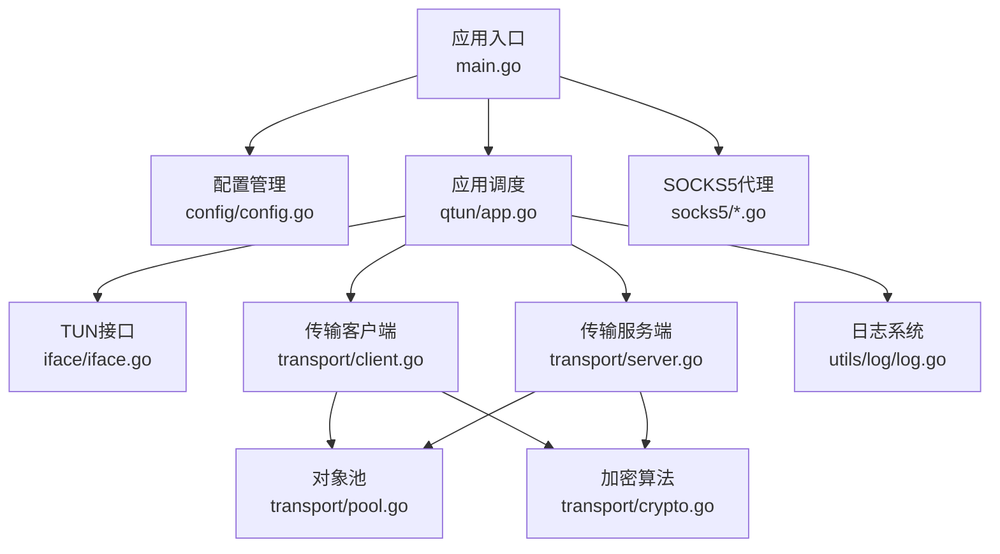
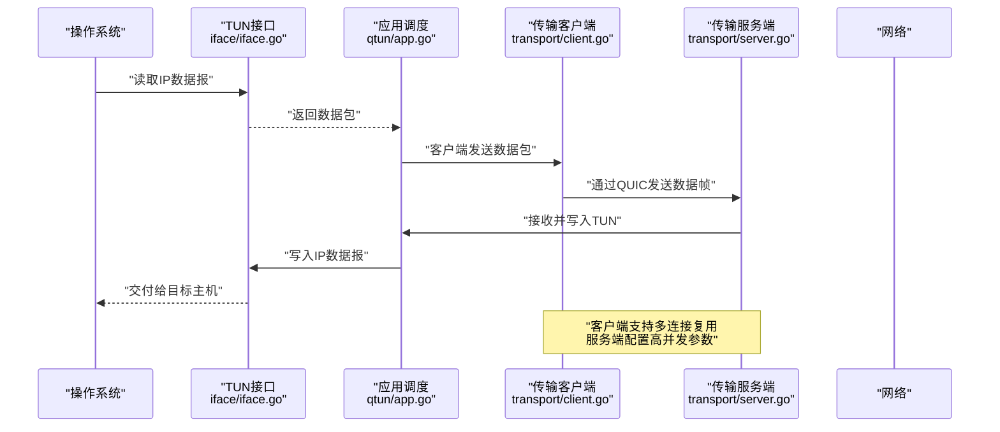
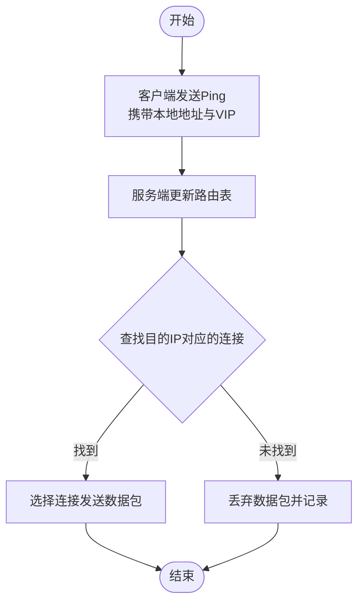
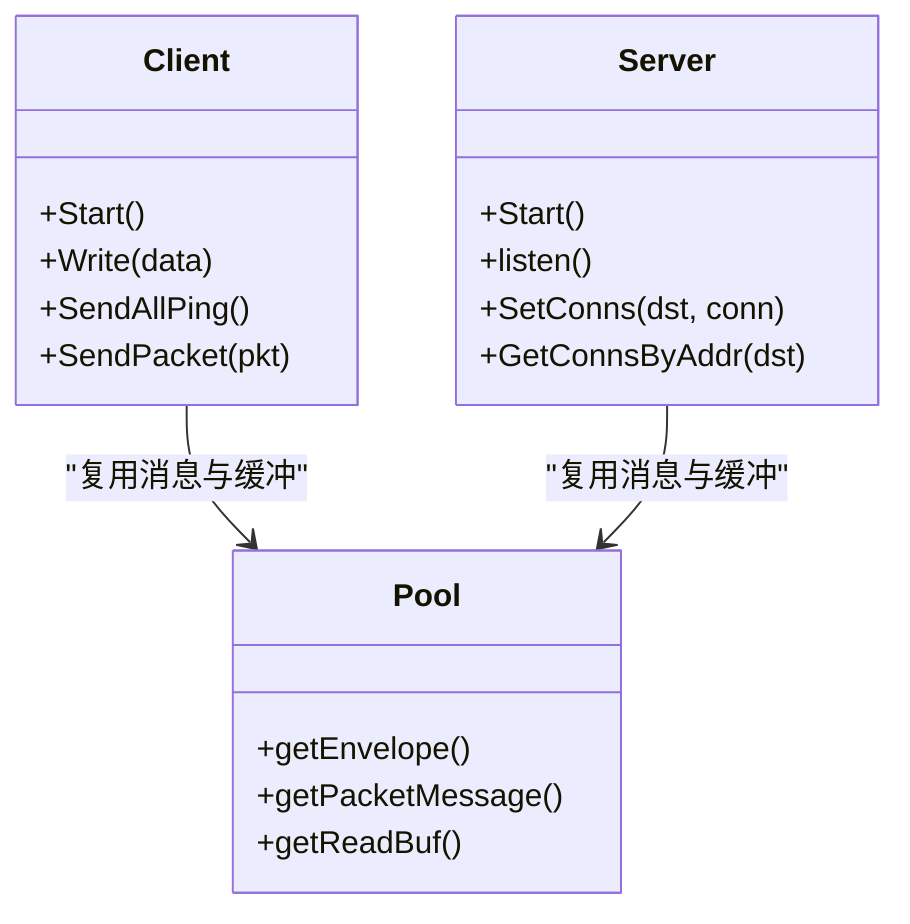
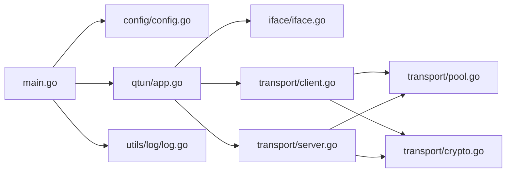

# 网络优化配置

<cite>
**本文引用的文件**
- [README.md](file://README.md)
- [main.go](file://main.go)
- [config/config.go](file://config/config.go)
- [qtun/app.go](file://qtun/app.go)
- [iface/iface.go](file://iface/iface.go)
- [transport/client.go](file://transport/client.go)
- [transport/server.go](file://transport/server.go)
- [transport/pool.go](file://transport/pool.go)
- [transport/crypto.go](file://transport/crypto.go)
- [utils/log/log.go](file://utils/log/log.go)
- [PERFORMANCE_TEST_GUIDE.md](file://PERFORMANCE_TEST_GUIDE.md)
- [PERFORMANCE_OPTIMIZATIONS.md](file://PERFORMANCE_OPTIMIZATIONS.md)
</cite>

## 目录
1. [简介](#简介)
2. [项目结构](#项目结构)
3. [核心组件](#核心组件)
4. [架构总览](#架构总览)
5. [详细组件分析](#详细组件分析)
6. [依赖关系分析](#依赖关系分析)
7. [性能考量](#性能考量)
8. [故障排除指南](#故障排除指南)
9. [结论](#结论)
10. [附录](#附录)

## 简介
本指南围绕Qtun的网络优化配置展开，重点覆盖MTU设置与调优、路由配置与路径优化、带宽管理与QoS、延迟优化（连接复用与压缩）、网络监控与性能指标分析，并结合不同网络环境（内网、外网、移动网络）给出可操作的优化建议与故障排除方法。读者无需深入底层实现即可按步骤完成配置与优化。

## 项目结构
Qtun采用模块化设计，核心由应用入口、配置管理、TUN接口、传输层（QUIC）、SOCKS5代理与日志系统组成。下图展示主要模块及其交互关系：

图表来源
- [main.go](file://main.go#L75-L102)
- [config/config.go](file://config/config.go#L17-L23)
- [qtun/app.go](file://qtun/app.go#L37-L48)
- [iface/iface.go](file://iface/iface.go#L31-L74)
- [transport/client.go](file://transport/client.go#L31-L83)
- [transport/server.go](file://transport/server.go#L37-L52)
- [transport/pool.go](file://transport/pool.go#L10-L51)
- [transport/crypto.go](file://transport/crypto.go#L10-L26)
- [utils/log/log.go](file://utils/log/log.go#L10-L25)

章节来源
- [README.md](file://README.md#L1-L99)
- [main.go](file://main.go#L22-L68)

## 核心组件
- 应用入口与参数解析：负责读取命令行参数、初始化配置、启动TUN与SOCKS5服务。
- 配置管理：集中保存密钥、监听地址、远端地址、IP段、MTU、线程数、模式等。
- TUN接口：创建并配置虚拟网卡，设置IP与MTU，必要时添加系统路由。
- 传输层（客户端/服务端）：基于QUIC实现高并发、低延迟的数据通道；客户端支持多连接复用；服务端使用高性能QUIC配置与连接管理。
- 对象池：复用协议消息与缓冲区，降低GC压力与内存分配。
- 加密：基于AES-GCM的轻量加密，确保数据安全。
- 日志：统一日志级别与输出格式，便于排障与性能分析。

章节来源
- [main.go](file://main.go#L75-L102)
- [config/config.go](file://config/config.go#L3-L13)
- [qtun/app.go](file://qtun/app.go#L72-L97)
- [iface/iface.go](file://iface/iface.go#L31-L74)
- [transport/client.go](file://transport/client.go#L31-L83)
- [transport/server.go](file://transport/server.go#L96-L103)
- [transport/pool.go](file://transport/pool.go#L10-L51)
- [transport/crypto.go](file://transport/crypto.go#L10-L26)
- [utils/log/log.go](file://utils/log/log.go#L10-L25)

## 架构总览
下图展示Qtun在客户端与服务端之间的数据流与控制流，以及TUN接口如何参与数据转发与路由维护。

图表来源
- [qtun/app.go](file://qtun/app.go#L72-L97)
- [transport/client.go](file://transport/client.go#L114-L132)
- [transport/server.go](file://transport/server.go#L96-L103)
- [iface/iface.go](file://iface/iface.go#L98-L104)

## 详细组件分析

### MTU（最大传输单元）设置与调优
- 参数位置：命令行支持设置MTU，默认值为1500。
- 设置方式：通过命令行参数传入，应用启动时注入全局配置。
- TUN接口应用：创建TUN设备并设置MTU，随后启动接口。
- 调优策略：
  - 内网：通常保持默认MTU以获得最佳吞吐；如遇分片或丢包，可适度下调。
  - 外网：若存在严格路径MTU（PMTU），建议与链路匹配，避免分片。
  - 移动网络：考虑蜂窝网络的头部开销与丢包特性，适当降低MTU以提升稳定性。
- 注意事项：MTU过大可能导致分片与重传，过小则增加头部比例影响效率。

章节来源
- [README.md](file://README.md#L75-L76)
- [main.go](file://main.go#L60-L60)
- [config/config.go](file://config/config.go#L9-L9)
- [qtun/app.go](file://qtun/app.go#L73-L73)
- [iface/iface.go](file://iface/iface.go#L52-L59)

### 路由配置与路径优化
- 路由建立：客户端通过Ping消息携带本地地址与VIP，服务端将其加入路由表，用于后续转发决策。
- 路由清理：定期扫描并移除失效连接，避免转发到已断开的下游。
- 系统路由：在某些平台（如macOS）会添加系统路由，确保到TUN子网的流量经由TUN。
- 路径选择：服务端在路由命中后随机选择可用连接，实现简单的负载均衡与容错。

图表来源
- [qtun/app.go](file://qtun/app.go#L169-L207)
- [qtun/app.go](file://qtun/app.go#L51-L70)
- [iface/iface.go](file://iface/iface.go#L76-L92)

章节来源
- [qtun/app.go](file://qtun/app.go#L169-L207)
- [qtun/app.go](file://qtun/app.go#L51-L70)
- [iface/iface.go](file://iface/iface.go#L76-L92)

### 带宽管理与QoS
- 并发连接：客户端支持多线程/多连接，通过原子序号轮询选择连接，提升带宽利用率。
- 服务端并发：QUIC配置允许更多并发流与更大的接收窗口，提高上行/下行吞吐。
- 对象池：复用协议消息与缓冲区，降低内存分配与GC频率，间接提升带宽效率。
- QoS建议：优先保障实时业务（如视频通话）的连接质量；在高并发场景下，适当减少非关键连接数量。

图表来源
- [transport/client.go](file://transport/client.go#L31-L83)
- [transport/server.go](file://transport/server.go#L37-L52)
- [transport/pool.go](file://transport/pool.go#L10-L51)

章节来源
- [transport/client.go](file://transport/client.go#L41-L83)
- [transport/server.go](file://transport/server.go#L96-L103)
- [transport/pool.go](file://transport/pool.go#L10-L51)

### 延迟优化（连接复用与数据压缩）
- 连接复用：客户端多连接轮询发送，减少单连接拥塞对整体延迟的影响。
- QUIC优化：服务端启用KeepAlive、Datagrams与较大窗口，降低握手与RTT影响。
- 对象池与缓冲：减少分配与拷贝，缩短处理时延。
- 压缩建议：当前未内置压缩功能，可在应用侧对特定类型流量（如文本、JSON）进行压缩后再进入隧道。

章节来源
- [transport/client.go](file://transport/client.go#L114-L132)
- [transport/server.go](file://transport/server.go#L96-L103)
- [transport/pool.go](file://transport/pool.go#L10-L51)

### 网络监控与性能指标
- 内置监控：应用启动后自动注册性能监控端点，支持pprof与statsviz可视化。
- 性能测试：提供吞吐量、延迟、并发连接与资源使用等测试场景与脚本。
- 指标建议：关注CPU使用率、内存分配、Goroutine数量、GC暂停时间与P99延迟。

章节来源
- [main.go](file://main.go#L124-L129)
- [PERFORMANCE_TEST_GUIDE.md](file://PERFORMANCE_TEST_GUIDE.md#L17-L24)
- [PERFORMANCE_TEST_GUIDE.md](file://PERFORMANCE_TEST_GUIDE.md#L111-L135)

## 依赖关系分析
- 入口依赖：main.go依赖配置、应用、日志、文件服务器与SOCKS5模块。
- 应用依赖：app.go依赖配置、TUN接口、传输层与定时器。
- 传输层依赖：client/server依赖QUIC、加密与对象池。
- 工具依赖：日志使用zerolog，监控使用statsviz与pprof。

图表来源
- [main.go](file://main.go#L15-L19)
- [qtun/app.go](file://qtun/app.go#L10-L16)
- [transport/client.go](file://transport/client.go#L11-L17)
- [transport/server.go](file://transport/server.go#L18-L21)
- [transport/pool.go](file://transport/pool.go#L3-L8)
- [transport/crypto.go](file://transport/crypto.go#L3-L8)

章节来源
- [main.go](file://main.go#L15-L19)
- [qtun/app.go](file://qtun/app.go#L10-L16)
- [transport/client.go](file://transport/client.go#L11-L17)
- [transport/server.go](file://transport/server.go#L18-L21)

## 性能考量
- 动态工作线程：TUN数据包处理线程数为CPU核心数的2倍（最小4，最大32），平衡I/O并行与系统开销。
- QUIC窗口：服务端配置较大的连接与流接收窗口，适合高带宽、低延迟场景。
- 对象池：复用Envelope、Ping/Packet消息与读缓冲，显著降低GC压力。
- 日志级别：生产环境建议使用info级别，避免过多调试日志影响性能。

章节来源
- [qtun/app.go](file://qtun/app.go#L79-L96)
- [transport/server.go](file://transport/server.go#L96-L103)
- [transport/pool.go](file://transport/pool.go#L10-L51)
- [utils/log/log.go](file://utils/log/log.go#L14-L21)

## 故障排除指南
- 无法建立连接
  - 检查密钥一致性与远端地址可达性。
  - 查看客户端连接尝试日志与重试机制。
- 路由异常
  - 观察服务端路由表更新与清理任务日志。
  - 确认系统路由是否正确添加（macOS示例）。
- 性能不达标
  - 使用内置监控端点采集CPU、内存、Goroutine与堆栈信息。
  - 参考性能测试指南执行吞吐与延迟测试，定位瓶颈。
- 日志级别
  - 切换到debug级别以获取更详细的处理流程信息。

章节来源
- [transport/client.go](file://transport/client.go#L41-L83)
- [qtun/app.go](file://qtun/app.go#L51-L70)
- [iface/iface.go](file://iface/iface.go#L76-L92)
- [PERFORMANCE_TEST_GUIDE.md](file://PERFORMANCE_TEST_GUIDE.md#L17-L24)
- [utils/log/log.go](file://utils/log/log.go#L14-L21)

## 结论
Qtun通过合理的MTU设置、动态路由与系统路由配合、多连接复用与QUIC优化、对象池与日志级别控制，在不同网络环境下实现了较好的吞吐与延迟表现。结合内置监控与测试指南，用户可以快速定位问题并持续优化配置。

## 附录

### 不同网络环境的优化建议
- 内网
  - 保持默认MTU；如遇异常，逐步下调至1400或更低。
  - 启用多连接（客户端线程数）以提升带宽。
- 外网
  - 与链路MTU匹配，避免分片；若不稳定，适当降低MTU。
  - 服务端开启KeepAlive与Datagrams，提升鲁棒性。
- 移动网络
  - 降低MTU以减少分片与重传；启用多连接提升抗抖动能力。
  - 控制日志级别，减少额外开销。

### 关键参数与位置
- MTU：命令行参数，应用启动时注入配置并传递给TUN接口。
- 传输线程数：客户端参数，决定多连接数量。
- 日志级别：命令行参数，支持info与debug。

章节来源
- [README.md](file://README.md#L75-L84)
- [main.go](file://main.go#L60-L65)
- [config/config.go](file://config/config.go#L7-L12)
- [qtun/app.go](file://qtun/app.go#L73-L73)