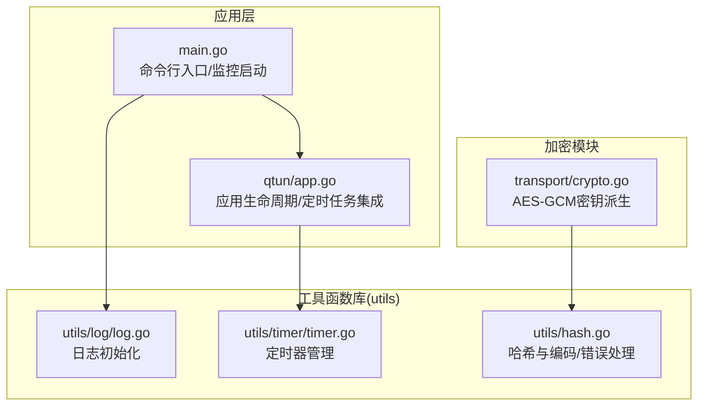
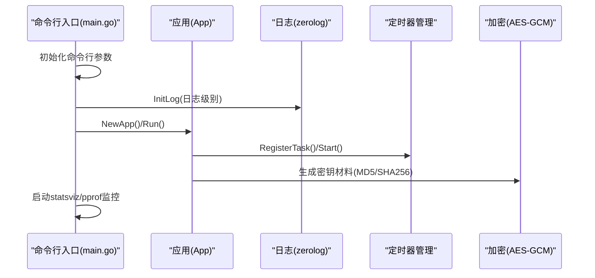
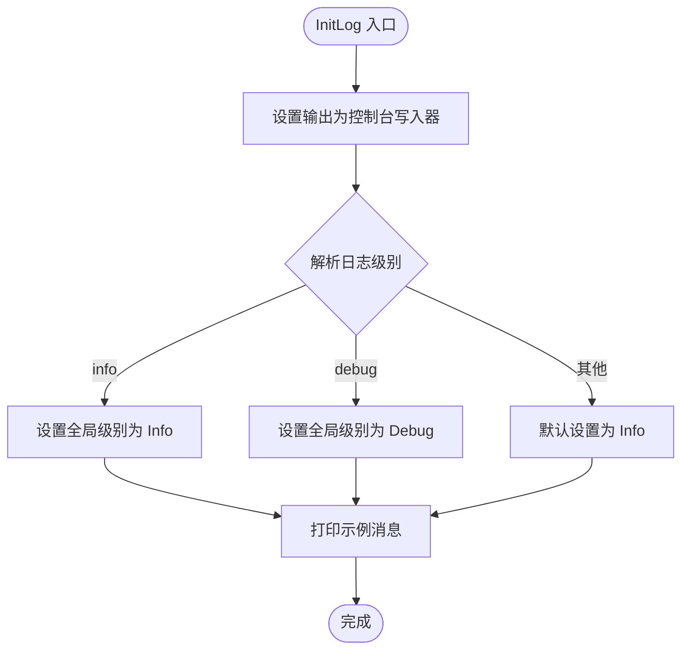
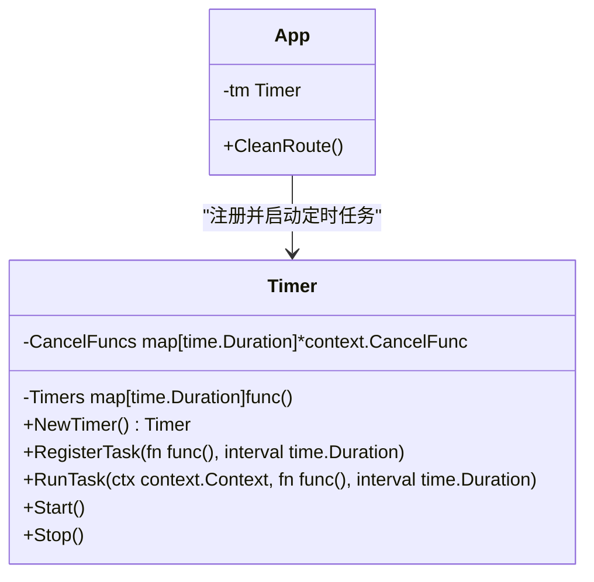
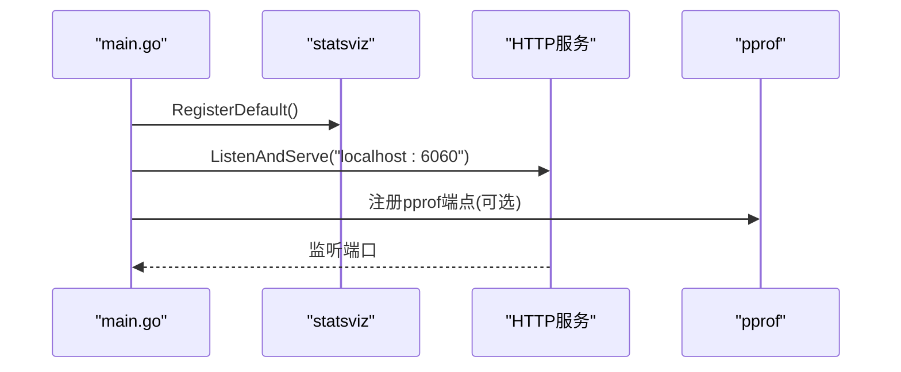
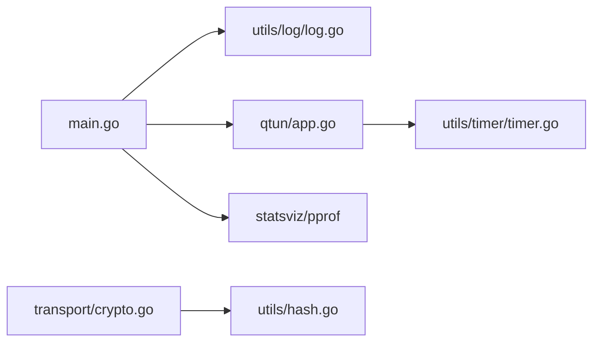

# 工具函数库

<cite>
**本文引用的文件**
- [utils/log/log.go](file://utils/log/log.go)
- [utils/timer/timer.go](file://utils/timer/timer.go)
- [utils/hash.go](file://utils/hash.go)
- [main.go](file://main.go)
- [qtun/app.go](file://qtun/app.go)
- [PERFORMANCE_TEST_GUIDE.md](file://PERFORMANCE_TEST_GUIDE.md)
- [transport/crypto.go](file://transport/crypto.go)
</cite>

## 目录
1. [简介](#简介)
2. [项目结构](#项目结构)
3. [核心组件](#核心组件)
4. [架构总览](#架构总览)
5. [详细组件分析](#详细组件分析)
6. [依赖关系分析](#依赖关系分析)
7. [性能考量](#性能考量)
8. [故障排查指南](#故障排查指南)
9. [结论](#结论)
10. [附录](#附录)

## 简介
本文件面向工具函数库的使用者与维护者，系统性梳理并解释以下能力：
- 日志系统：日志级别、输出格式、彩色显示与初始化流程
- 哈希算法：SHA1/SHA256/MD5、十六进制与Base64编码、错误处理辅助
- 定时器管理：定时任务注册、并发执行、上下文取消与资源清理
- 错误处理与异常管理：最佳实践与使用建议
- 性能监控与调试：pprof与statsviz集成、常用指标与测试方法
- 扩展与自定义：如何基于现有实现扩展新功能
- 常见使用场景：集成方式与示例路径

## 项目结构
工具函数库位于仓库根目录下的 utils 子目录，分别提供日志、定时器与哈希工具；主程序入口在 main.go，应用逻辑在 qtun/app.go，性能测试指南在 PERFORMANCE_TEST_GUIDE.md，加密模块在 transport/crypto.go。



图表来源
- [utils/log/log.go](file://utils/log/log.go#L1-L26)
- [utils/timer/timer.go](file://utils/timer/timer.go#L1-L55)
- [utils/hash.go](file://utils/hash.go#L1-L42)
- [main.go](file://main.go#L1-L136)
- [qtun/app.go](file://qtun/app.go#L1-L271)
- [transport/crypto.go](file://transport/crypto.go#L1-L27)

章节来源
- [main.go](file://main.go#L1-L136)
- [utils/log/log.go](file://utils/log/log.go#L1-L26)
- [utils/timer/timer.go](file://utils/timer/timer.go#L1-L55)
- [utils/hash.go](file://utils/hash.go#L1-L42)
- [qtun/app.go](file://qtun/app.go#L1-L271)
- [transport/crypto.go](file://transport/crypto.go#L1-L27)

## 核心组件
- 日志系统：基于 zerolog 控制台输出，支持 info/debug 级别切换，初始化时设置全局级别并打印示例消息。
- 定时器管理：Timer 结构体封装多间隔任务注册、并发执行、上下文取消与停止。
- 哈希与编码：提供 SHA1/SHA256/MD5、十六进制与Base64编码，以及轻量级错误恐慌辅助函数。
- 性能监控：main.go 中集成 statsviz 与 pprof，便于运行期观测与分析。

章节来源
- [utils/log/log.go](file://utils/log/log.go#L10-L25)
- [utils/timer/timer.go](file://utils/timer/timer.go#L9-L55)
- [utils/hash.go](file://utils/hash.go#L11-L41)
- [main.go](file://main.go#L105-L129)

## 架构总览
下图展示从命令行入口到应用层、再到工具函数库的整体调用链，以及性能监控的启动位置。



图表来源
- [main.go](file://main.go#L70-L103)
- [utils/log/log.go](file://utils/log/log.go#L10-L25)
- [qtun/app.go](file://qtun/app.go#L29-L49)
- [utils/timer/timer.go](file://utils/timer/timer.go#L21-L47)
- [transport/crypto.go](file://transport/crypto.go#L10-L26)

## 详细组件分析

### 日志系统
- 初始化流程
  - 设置输出为控制台写入器，输出到标准错误流
  - 根据传入的日志级别设置全局级别：info 或 debug，默认 info
  - 初始化后打印示例消息以验证级别生效
- 输出格式
  - 使用 zerolog 控制台输出，具备结构化字段与时间戳
- 彩色显示
  - 主程序入口使用 gookit/color 输出彩色提示，但日志初始化未显式开启颜色
  - 如需彩色日志，可在初始化中配置 ConsoleWriter 的颜色开关
- 日志轮转
  - 当前实现未包含日志轮转逻辑；如需轮转，可替换 ConsoleWriter 为带轮转能力的 writer



图表来源
- [utils/log/log.go](file://utils/log/log.go#L10-L25)

章节来源
- [utils/log/log.go](file://utils/log/log.go#L10-L25)
- [main.go](file://main.go#L73-L73)

### 哈希算法与编码
- 提供的哈希函数
  - SHA256：返回字节切片摘要
  - SHA1：返回字节切片摘要
  - MD5：返回字节切片摘要
- 编码工具
  - Hex：将字节切片编码为十六进制字符串
  - B64：将字节切片编码为Base64字符串
- 错误处理辅助
  - POE：当输入非空时触发恐慌，适合快速失败场景
- 应用场景
  - 数据完整性校验：使用 SHA1/SHA256 验证数据一致性
  - 缓存键生成：对输入内容做哈希并编码为字符串作为键
  - 加密密钥派生：在加密模块中用于生成固定长度密钥材料

```mermaid
classDiagram
class HashUtils {
+SHA256(in []byte) []byte
+SHA1(in []byte) []byte
+MD5(in []byte) []byte
+Hex(in []byte) string
+B64(in []byte) string
+POE(err interface{})
}
class CryptoModule {
+makeAES128GCM(key string) (cipher.AEAD, error)
+makeAES256GCM(key string) (cipher.AEAD, error)
}
CryptoModule --> HashUtils : "使用MD5/SHA256派生密钥"
```

图表来源
- [utils/hash.go](file://utils/hash.go#L11-L41)
- [transport/crypto.go](file://transport/crypto.go#L10-L26)

章节来源
- [utils/hash.go](file://utils/hash.go#L11-L41)
- [transport/crypto.go](file://transport/crypto.go#L10-L26)

### 定时器管理
- 设计要点
  - Timer 结构体维护两组映射：任务函数与间隔、取消函数指针与间隔
  - RegisterTask 注册任务与间隔
  - Start 为每个任务创建独立的带取消上下文的 goroutine，并并发执行 RunTask
  - RunTask 使用单次定时器配合 Reset 实现周期性执行
  - Stop 遍历取消函数并触发退出
- 并发模型
  - 每个间隔对应一个 goroutine，避免阻塞其他任务
  - 使用 select 监听定时器通道与取消信号
- 资源清理
  - Stop 会调用所有 CancelFunc，确保 goroutine 正常退出
  - 可在应用关闭时统一调用 Stop 清理



图表来源
- [utils/timer/timer.go](file://utils/timer/timer.go#L9-L55)
- [qtun/app.go](file://qtun/app.go#L51-L70)

章节来源
- [utils/timer/timer.go](file://utils/timer/timer.go#L9-L55)
- [qtun/app.go](file://qtun/app.go#L51-L70)

### 错误处理与异常管理
- POE 辅助函数
  - 用于快速失败：当 err 非空时直接 panic，适合初始化阶段或不可恢复错误
  - 使用建议：仅在确定错误不可恢复时使用；对于可恢复错误，优先返回 error
- 日志记录
  - 应用层广泛使用 zerolog 记录错误与状态，便于定位问题
- 最佳实践
  - 明确区分可恢复与不可恢复错误
  - 对外暴露 error，内部使用日志记录上下文
  - 在关键路径上使用 defer 和 recover（如适用）保护进程稳定

章节来源
- [utils/hash.go](file://utils/hash.go#L37-L41)
- [qtun/app.go](file://qtun/app.go#L105-L106)

### 性能监控与调试
- 监控集成
  - statsviz：注册默认端点，提供运行时可视化界面
  - pprof：通过 HTTP 暴露性能分析接口
- 启动方式
  - main 函数中启动 sysGui，注册 statsviz 并监听本地端口
  - 可选 pprof 启动函数（当前被注释）
- 使用指南
  - 通过浏览器访问 statsviz 端点观察 goroutine、内存、CPU 等指标
  - 使用 pprof 下载 profile 文件进行离线分析
  - 结合性能测试指南中的场景与脚本进行基准测试与回归验证



图表来源
- [main.go](file://main.go#L124-L129)

章节来源
- [main.go](file://main.go#L124-L129)
- [PERFORMANCE_TEST_GUIDE.md](file://PERFORMANCE_TEST_GUIDE.md#L17-L24)

## 依赖关系分析
- 日志依赖 zerolog，初始化时设置全局级别
- 定时器依赖 context 与 time，实现任务并发与取消
- 加密模块依赖哈希工具进行密钥派生
- 主程序依赖 statsviz 与 pprof 提供运行时监控



图表来源
- [main.go](file://main.go#L11-L19)
- [utils/log/log.go](file://utils/log/log.go#L3-L8)
- [utils/timer/timer.go](file://utils/timer/timer.go#L3-L7)
- [transport/crypto.go](file://transport/crypto.go#L3-L8)

章节来源
- [main.go](file://main.go#L11-L19)
- [utils/log/log.go](file://utils/log/log.go#L3-L8)
- [utils/timer/timer.go](file://utils/timer/timer.go#L3-L7)
- [transport/crypto.go](file://transport/crypto.go#L3-L8)

## 性能考量
- worker 数量策略：应用层根据 CPU 核心数动态计算工作线程数量，范围在 4 到 32 之间，提升 I/O 并行度
- 锁优化：读多写少场景使用 RWMutex，缩小临界区，复制键集合后再选择连接
- 定时器并发：每个定时任务独立 goroutine，避免相互阻塞
- 监控与分析：结合 statsviz 与 pprof，持续观测内存分配、锁争用与 goroutine 数量

章节来源
- [qtun/app.go](file://qtun/app.go#L79-L96)
- [qtun/app.go](file://qtun/app.go#L115-L161)
- [PERFORMANCE_TEST_GUIDE.md](file://PERFORMANCE_TEST_GUIDE.md#L111-L134)

## 故障排查指南
- 日志级别问题
  - 确认 InitLog 是否正确设置日志级别
  - 检查示例消息是否按级别输出
- 定时器不执行
  - 检查 RegisterTask 是否正确注册
  - 确认 Start 已调用且未提前 Stop
  - 观察 Stop 输出确认取消函数是否被调用
- 性能异常
  - 使用 statsviz 查看 goroutine 与内存趋势
  - 使用 pprof 下载 heap、profile、goroutine 进行分析
  - 参考性能测试指南中的脚本与场景进行回归测试

章节来源
- [utils/log/log.go](file://utils/log/log.go#L10-L25)
- [utils/timer/timer.go](file://utils/timer/timer.go#L40-L54)
- [PERFORMANCE_TEST_GUIDE.md](file://PERFORMANCE_TEST_GUIDE.md#L85-L109)

## 结论
该工具函数库以简洁为核心，提供日志、定时器与哈希编码等基础能力，并与应用层和监控系统形成良好协作。建议在生产环境中：
- 明确日志级别与输出介质，必要时引入日志轮转
- 对定时器任务进行边界与超时控制，避免资源泄漏
- 使用 pprof 与 statsviz 持续监控关键指标，结合测试脚本进行回归验证

## 附录

### 扩展与自定义
- 日志系统扩展
  - 新增输出介质：替换 ConsoleWriter 为带轮转能力的 writer
  - 自定义字段：在 InitLog 中注入通用字段，统一标识实例与环境
- 定时器扩展
  - 增加任务优先级或队列化，避免高频率任务互相影响
  - 添加任务统计与健康检查，便于运维观测
- 哈希与编码扩展
  - 新增算法：如 BLAKE2、SHA3 等，保持与现有接口一致
  - 错误处理：为可恢复错误提供返回值而非 panic

### 常见使用场景与集成方法
- 初始化日志
  - 在应用启动时调用 InitLog，并根据配置设置级别
  - 示例路径：[main.go](file://main.go#L86-L86)
- 注册并启动定时任务
  - 在应用初始化阶段注册任务，随后调用 Start
  - 示例路径：[qtun/app.go](file://qtun/app.go#L51-L70)
- 密钥派生与数据校验
  - 使用 MD5/SHA256 生成固定长度密钥材料
  - 使用 SHA1/SHA256 进行数据完整性校验
  - 示例路径：[transport/crypto.go](file://transport/crypto.go#L10-L26)，[utils/hash.go](file://utils/hash.go#L11-L27)
- 性能监控
  - 启动 statsviz 与 pprof，结合测试脚本进行基准测试
  - 示例路径：[main.go](file://main.go#L124-L129)，[PERFORMANCE_TEST_GUIDE.md](file://PERFORMANCE_TEST_GUIDE.md#L17-L24)