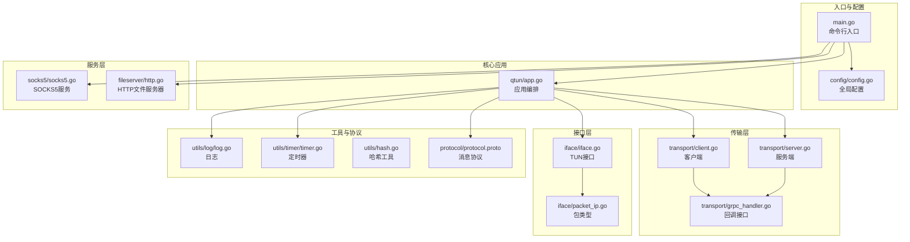
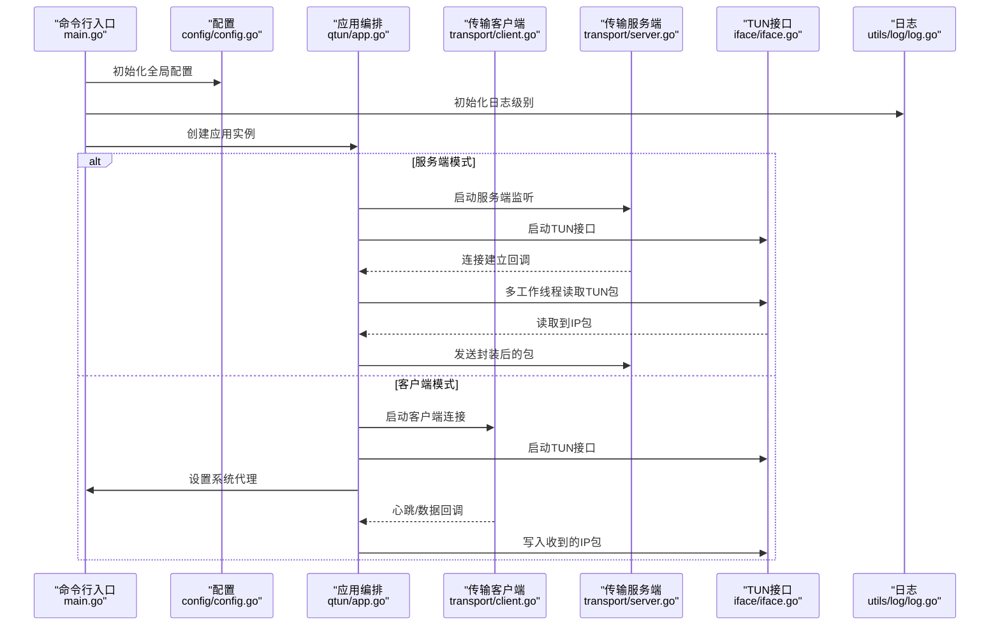
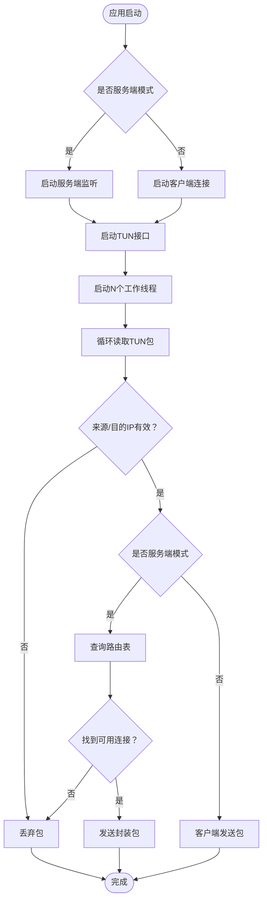
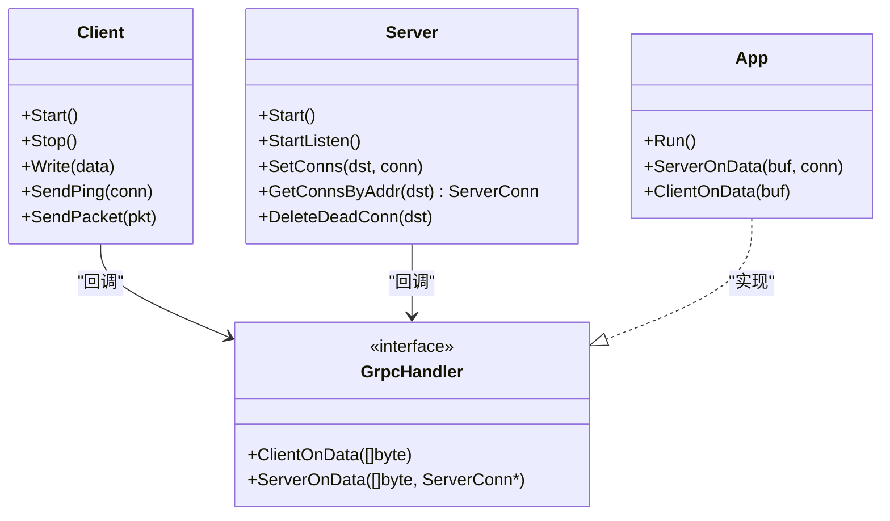
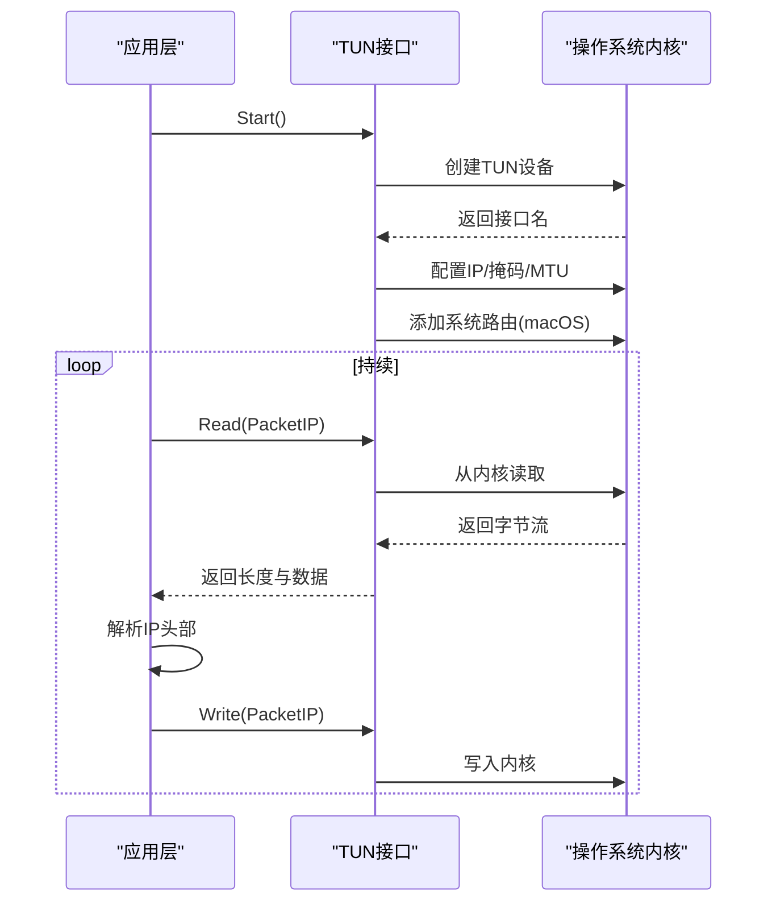
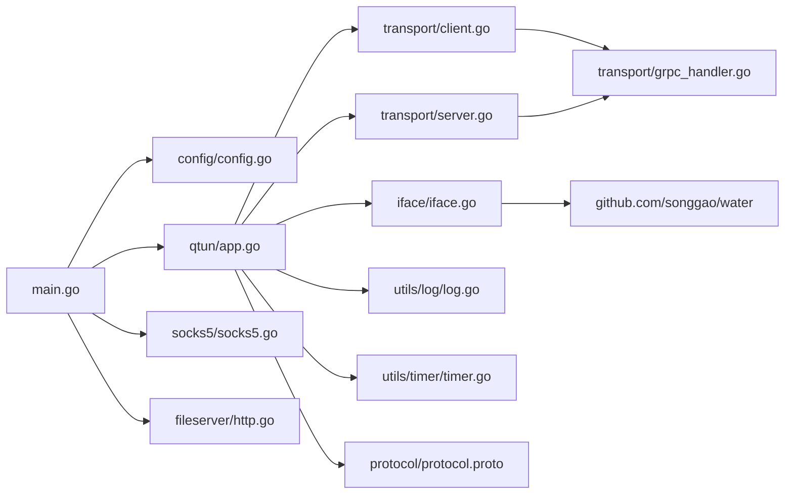

# 代码结构说明

<cite>
**本文档引用的文件**
- [main.go](file://main.go)
- [go.mod](file://go.mod)
- [README.md](file://README.md)
- [config/config.go](file://config/config.go)
- [qtun/app.go](file://qtun/app.go)
- [transport/client.go](file://transport/client.go)
- [transport/server.go](file://transport/server.go)
- [transport/grpc_handler.go](file://transport/grpc_handler.go)
- [iface/iface.go](file://iface/iface.go)
- [iface/packet_ip.go](file://iface/packet_ip.go)
- [socks5/socks5.go](file://socks5/socks5.go)
- [utils/log/log.go](file://utils/log/log.go)
- [utils/timer/timer.go](file://utils/timer/timer.go)
- [utils/hash.go](file://utils/hash.go)
- [protocol/protocol.proto](file://protocol/protocol.proto)
- [fileserver/http.go](file://fileserver/http.go)
</cite>

## 目录
1. [简介](#简介)
2. [项目结构](#项目结构)
3. [核心组件](#核心组件)
4. [架构总览](#架构总览)
5. [详细组件分析](#详细组件分析)
6. [依赖关系分析](#依赖关系分析)
7. [性能考虑](#性能考虑)
8. [故障排查指南](#故障排查指南)
9. [结论](#结论)
10. [附录：代码导航指南](#附录代码导航指南)

## 简介
本项目是一个基于 QUIC 的 C-S 安全隧道系统，支持多 IP 管道与 TUN 虚拟网卡转发。通过模块化设计将网络传输、TUN 接口、代理服务、配置与工具进行清晰分层，便于维护与扩展。

## 项目结构
项目采用按功能域划分的包结构，主要分为以下几类：
- 核心应用层：qtun 应用编排与主流程控制
- 传输层：基于 QUIC 的客户端/服务端实现，负责数据通道与连接管理
- 接口层：TUN 接口抽象与读写封装
- 工具层：日志、定时器、哈希等通用能力
- 协议层：跨语言/跨进程的消息协议定义
- 服务层：HTTP 文件服务器与 SOCKS5 代理服务
- 配置层：全局配置初始化与单例访问

图表来源
- [main.go](file://main.go#L1-L136)
- [config/config.go](file://config/config.go#L1-L24)
- [qtun/app.go](file://qtun/app.go#L1-L271)
- [transport/client.go](file://transport/client.go#L1-L223)
- [transport/server.go](file://transport/server.go#L1-L219)
- [transport/grpc_handler.go](file://transport/grpc_handler.go#L1-L7)
- [iface/iface.go](file://iface/iface.go#L1-L105)
- [iface/packet_ip.go](file://iface/packet_ip.go)
- [utils/log/log.go](file://utils/log/log.go#L1-L26)
- [utils/timer/timer.go](file://utils/timer/timer.go#L1-L55)
- [utils/hash.go](file://utils/hash.go#L1-L42)
- [protocol/protocol.proto](file://protocol/protocol.proto#L1-L22)
- [fileserver/http.go](file://fileserver/http.go#L1-L17)
- [socks5/socks5.go](file://socks5/socks5.go#L1-L170)

章节来源
- [main.go](file://main.go#L1-L136)
- [go.mod](file://go.mod#L1-L29)

## 核心组件
- 应用层（qtun）
  - 负责整体生命周期管理：根据运行模式选择启动服务端或客户端，初始化 TUN 接口，启动多工作线程处理 TUN 包，维护路由表与连接状态。
  - 关键职责：路由清理、TUN 包收发、系统代理设置。
- 传输层（transport）
  - 客户端：多连接并发、心跳保活、包池复用、负载均衡选择连接。
  - 服务端：QUIC 监听、连接管理、双向读写协程、连接映射与清理。
- 接口层（iface）
  - 封装 TUN 设备创建、配置、读写；跨平台 ifconfig/route 操作；提供 PacketIP 类型用于数据包读写。
- 工具层（utils）
  - 日志：基于 zerolog 控制台输出与级别切换。
  - 定时器：基于 context 的周期任务调度器。
  - 哈希：常用摘要算法与编码工具。
- 协议层（protocol）
  - 定义 Envelope + oneof 的消息模型，承载 Ping（心跳）与 Packet（载荷）两类消息。
- 服务层（socks5、fileserver）
  - SOCKS5：标准 SOCKS5 握手、认证、请求处理与规则集。
  - HTTP 文件服务器：静态资源服务，供 PAC 自动代理脚本使用。

章节来源
- [qtun/app.go](file://qtun/app.go#L1-L271)
- [transport/client.go](file://transport/client.go#L1-L223)
- [transport/server.go](file://transport/server.go#L1-L219)
- [transport/grpc_handler.go](file://transport/grpc_handler.go#L1-L7)
- [iface/iface.go](file://iface/iface.go#L1-L105)
- [utils/log/log.go](file://utils/log/log.go#L1-L26)
- [utils/timer/timer.go](file://utils/timer/timer.go#L1-L55)
- [utils/hash.go](file://utils/hash.go#L1-L42)
- [protocol/protocol.proto](file://protocol/protocol.proto#L1-L22)
- [socks5/socks5.go](file://socks5/socks5.go#L1-L170)
- [fileserver/http.go](file://fileserver/http.go#L1-L17)

## 架构总览
下图展示了从命令行入口到各子系统的调用关系与职责边界：

图表来源
- [main.go](file://main.go#L75-L103)
- [config/config.go](file://config/config.go#L17-L23)
- [qtun/app.go](file://qtun/app.go#L37-L97)
- [transport/client.go](file://transport/client.go#L41-L83)
- [transport/server.go](file://transport/server.go#L48-L76)
- [iface/iface.go](file://iface/iface.go#L31-L74)
- [utils/log/log.go](file://utils/log/log.go#L10-L25)

## 详细组件分析

### 应用层（qtun/app.go）
- 角色与职责
  - 统一编排：根据配置决定服务端/客户端模式，启动对应传输组件与 TUN 接口。
  - 路由管理：服务端侧维护目标 IP 到连接的映射，定期清理失效连接。
  - 并发处理：为 TUN 包处理分配多个工作线程，提升吞吐。
  - 系统集成：在客户端模式下自动设置系统代理（仅 macOS）。
- 关键流程
  - 启动流程：初始化传输组件 → 启动 TUN → 启动工作线程 → 循环读取/转发。
  - 数据路径：TUN 读取 → 应用层解析 → 服务端路由查找/客户端直传 → 对端接收写回 TUN。
- 性能优化点
  - 动态工作线程数：CPU 核心数 × 2，范围限制在 4~32。
  - 读锁优化：路由查询使用 RWMutex 的读锁，减少临界区时间。
  - 定时清理：周期性扫描并移除失效连接，避免内存泄漏。

图表来源
- [qtun/app.go](file://qtun/app.go#L72-L167)

章节来源
- [qtun/app.go](file://qtun/app.go#L1-L271)

### 传输层（transport）
- 客户端（client.go）
  - 多连接并发：可配置线程数，每个线程对应一个连接，支持轮询/原子序号选择。
  - 心跳保活：周期性发送 Ping，携带本地地址与虚拟 IP，用于服务端建立路由。
  - 包池复用：发送前从池中取出 Envelope/Ping/Packet 消息，发送后归还，降低 GC 压力。
  - 错误恢复：重试连接、异常捕获与日志记录。
- 服务端（server.go）
  - QUIC 监听：自动生成证书，配置流窗口与连接窗口参数，启用 KeepAlive。
  - 连接管理：双向映射（正向/反向），支持动态增删与清理失效连接。
  - 并发安全：使用 sync.Map 提升高并发场景下的读写性能。
- 回调接口（grpc_handler.go）
  - GrpcHandler 定义了客户端与服务端的数据回调方法，应用层实现具体逻辑。

图表来源
- [transport/client.go](file://transport/client.go#L20-L223)
- [transport/server.go](file://transport/server.go#L23-L219)
- [transport/grpc_handler.go](file://transport/grpc_handler.go#L3-L6)
- [qtun/app.go](file://qtun/app.go#L169-L248)

章节来源
- [transport/client.go](file://transport/client.go#L1-L223)
- [transport/server.go](file://transport/server.go#L1-L219)
- [transport/grpc_handler.go](file://transport/grpc_handler.go#L1-L7)

### 接口层（iface）
- 职责边界
  - TUN 设备创建与配置：根据平台执行 ifconfig/route 命令，设置 IP、掩码、MTU、路由。
  - 数据读写：提供 Read/Write 方法，配合 PacketIP 类型进行二进制包操作。
- 平台差异
  - macOS 与 Linux 在 ifconfig 参数上略有不同，且需要额外添加系统路由。
- 与应用层协作
  - 应用层启动 TUN 接口后，循环读取包并交由传输层处理；收到对端包后写回 TUN。

图表来源
- [iface/iface.go](file://iface/iface.go#L31-L92)
- [qtun/app.go](file://qtun/app.go#L99-L167)

章节来源
- [iface/iface.go](file://iface/iface.go#L1-L105)
- [iface/packet_ip.go](file://iface/packet_ip.go)

### 工具层（utils）
- 日志（utils/log/log.go）
  - 基于 zerolog 输出到控制台，支持 info/debug 级别切换。
- 定时器（utils/timer/timer.go）
  - 注册周期任务，基于 time.Timer 与 context 控制启停。
- 哈希（utils/hash.go）
  - 提供 SHA1/SHA256/MD5、十六进制与 Base64 编解码，以及 POE（出错即崩溃）辅助函数。

章节来源
- [utils/log/log.go](file://utils/log/log.go#L1-L26)
- [utils/timer/timer.go](file://utils/timer/timer.go#L1-L55)
- [utils/hash.go](file://utils/hash.go#L1-L42)

### 协议层（protocol）
- 消息模型
  - Envelope 使用 oneof 包含 MessagePing 与 MessagePacket。
  - MessagePing 携带时间戳、本地地址、虚拟 IP、机房标识等。
  - MessagePacket 携带原始 IP 层载荷。
- 生成与使用
  - 通过 protoc-gen-go 生成 Go 代码，客户端/服务端在发送前从池中取出消息对象，发送后归还。

章节来源
- [protocol/protocol.proto](file://protocol/protocol.proto#L1-L22)

### 服务层（socks5、fileserver）
- SOCKS5（socks5/socks5.go）
  - 支持无认证/用户密码认证、DNS 解析、规则集与地址重写。
  - 提供 ListenAndServe/Serve/ServeConn 等核心方法。
- HTTP 文件服务器（fileserver/http.go）
  - 提供静态文件服务，默认监听 0.0.0.0:端口，用于提供 PAC 脚本。

章节来源
- [socks5/socks5.go](file://socks5/socks5.go#L1-L170)
- [fileserver/http.go](file://fileserver/http.go#L1-L17)

## 依赖关系分析
- 模块耦合
  - qtun/app.go 依赖 transport、iface、protocol、config、timer、utils/log。
  - transport/client.go 与 transport/server.go 通过 GrpcHandler 与应用层解耦。
  - iface 依赖第三方 water 库创建 TUN 设备。
  - protocol 为跨模块的序列化载体。
- 外部依赖
  - quic-go：QUIC 传输栈。
  - water：TUN 设备创建。
  - golang/protobuf：消息序列化。
  - rs/zerolog：日志库。

图表来源
- [go.mod](file://go.mod#L5-L28)
- [main.go](file://main.go#L15-L20)
- [qtun/app.go](file://qtun/app.go#L10-L16)
- [transport/client.go](file://transport/client.go#L11-L18)
- [transport/server.go](file://transport/server.go#L18-L21)
- [iface/iface.go](file://iface/iface.go#L13-L13)

章节来源
- [go.mod](file://go.mod#L1-L29)
- [main.go](file://main.go#L1-L136)

## 性能考虑
- 并发与吞吐
  - TUN 包处理：工作线程数为 CPU 核心数 × 2，范围限制在 4~32，兼顾 I/O 并发与系统负载。
  - 传输层：客户端多连接并发与原子序号选择，服务端使用 sync.Map 提升高并发读写性能。
- 内存与 GC
  - 协议消息池：发送前从池中取出，发送后归还，降低频繁分配带来的 GC 压力。
- 网络参数
  - QUIC：配置较大的流窗口与连接窗口，启用 KeepAlive，提升长连接稳定性与吞吐。
- I/O 与系统调用
  - TUN 接口：跨平台 ifconfig/route 配置，确保路由可达；读写路径尽量减少拷贝与加锁时间。

## 故障排查指南
- 启动失败
  - 检查权限：TUN 创建与路由添加通常需要管理员权限。
  - 检查端口占用：服务端监听端口与客户端远端地址需正确配置。
- 日志定位
  - 使用 utils/log/log.go 设置日志级别为 debug，观察详细流程日志。
- 连接问题
  - 客户端：确认远程地址可达，查看重连与心跳日志。
  - 服务端：检查 QUIC 监听与证书生成，关注连接建立与清理日志。
- TUN 通信异常
  - 确认 TUN 接口已启动、IP/掩码/MTU 配置正确，必要时手动添加系统路由。

章节来源
- [utils/log/log.go](file://utils/log/log.go#L10-L25)
- [transport/client.go](file://transport/client.go#L41-L83)
- [transport/server.go](file://transport/server.go#L91-L149)
- [iface/iface.go](file://iface/iface.go#L31-L74)

## 结论
本项目通过清晰的模块划分与接口抽象，实现了从应用编排到传输、接口、协议与服务的完整链路。核心亮点在于：
- 应用层统一编排与路由管理；
- 传输层基于 QUIC 的高性能与可靠性；
- 接口层对 TUN 的跨平台封装；
- 工具层提供日志、定时器与通用加密工具；
- 协议层以轻量消息模型支撑心跳与数据转发。

## 附录：代码导航指南
- 入口与配置
  - 命令行入口与参数解析：[main.go](file://main.go#L42-L103)
  - 全局配置初始化与单例：[config/config.go](file://config/config.go#L17-L23)
- 应用编排
  - 应用创建与运行：[qtun/app.go](file://qtun/app.go#L29-L49)
  - TUN 启动与工作线程：[qtun/app.go](file://qtun/app.go#L72-L97)
  - 路由清理与连接管理：[qtun/app.go](file://qtun/app.go#L51-L70)
- 传输层
  - 客户端启动与心跳：[transport/client.go](file://transport/client.go#L41-L83)
  - 客户端发送包与 Ping：[transport/client.go](file://transport/client.go#L167-L206)
  - 服务端监听与连接管理：[transport/server.go](file://transport/server.go#L91-L149)
- 接口层
  - TUN 创建与配置：[iface/iface.go](file://iface/iface.go#L31-L74)
  - 系统路由添加（macOS）：[iface/iface.go](file://iface/iface.go#L76-L92)
- 工具与协议
  - 日志初始化：[utils/log/log.go](file://utils/log/log.go#L10-L25)
  - 定时器注册与启动：[utils/timer/timer.go](file://utils/timer/timer.go#L21-L47)
  - 协议定义：[protocol/protocol.proto](file://protocol/protocol.proto#L5-L22)
- 服务层
  - SOCKS5 服务启动：[socks5/socks5.go](file://socks5/socks5.go#L99-L118)
  - HTTP 文件服务器：[fileserver/http.go](file://fileserver/http.go#L9-L16)