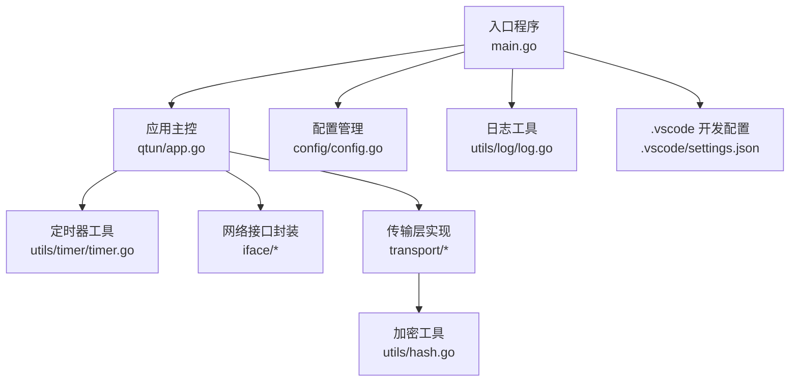
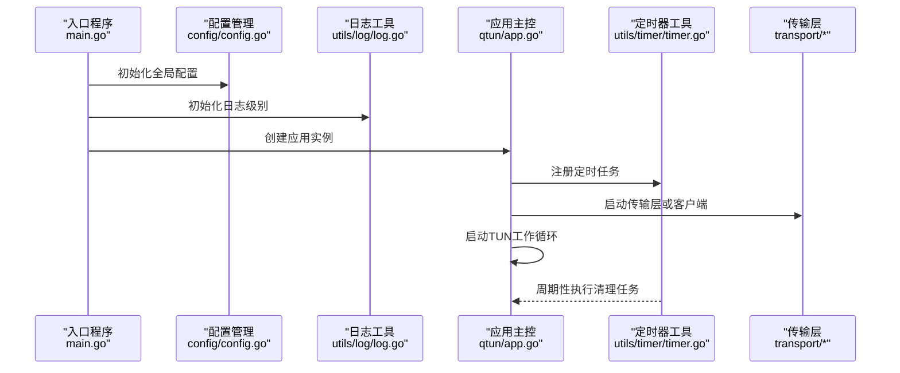
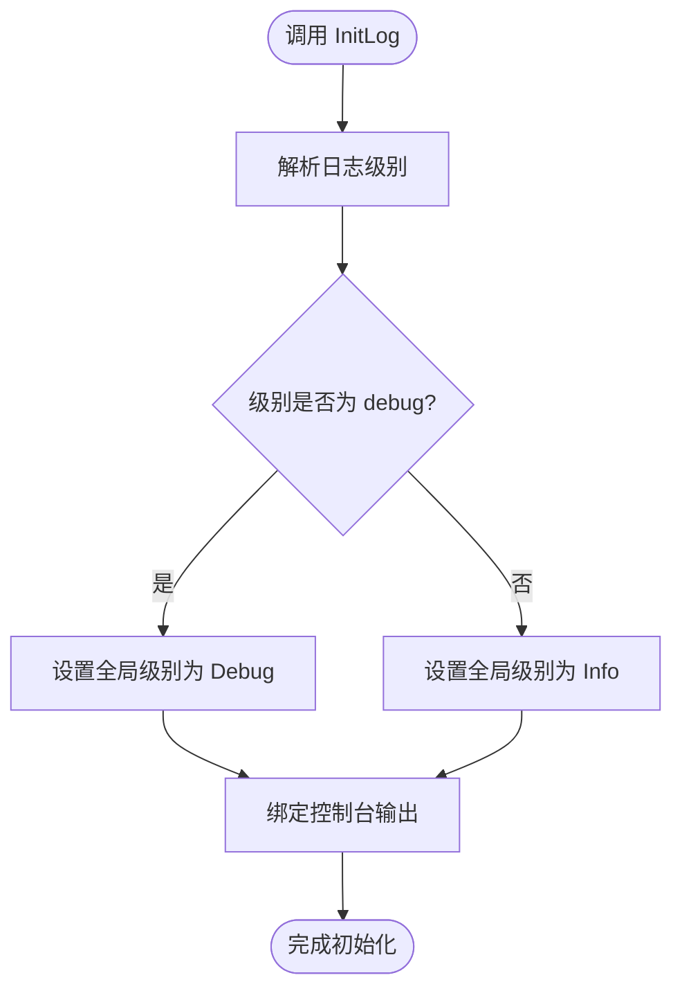
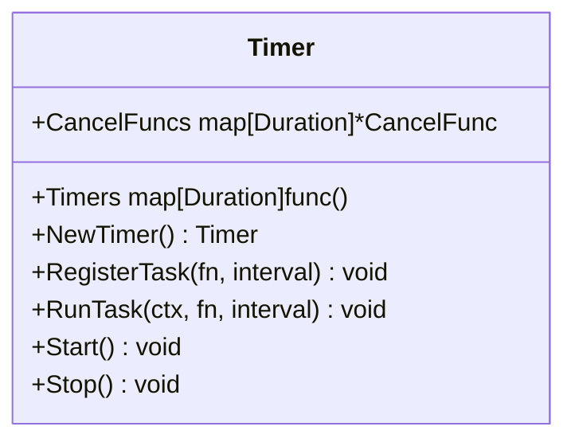
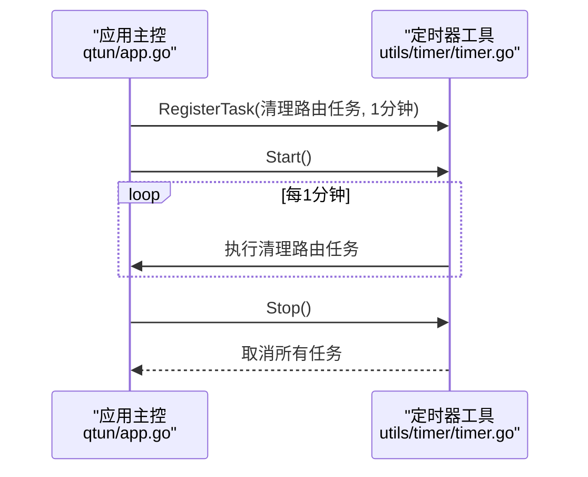
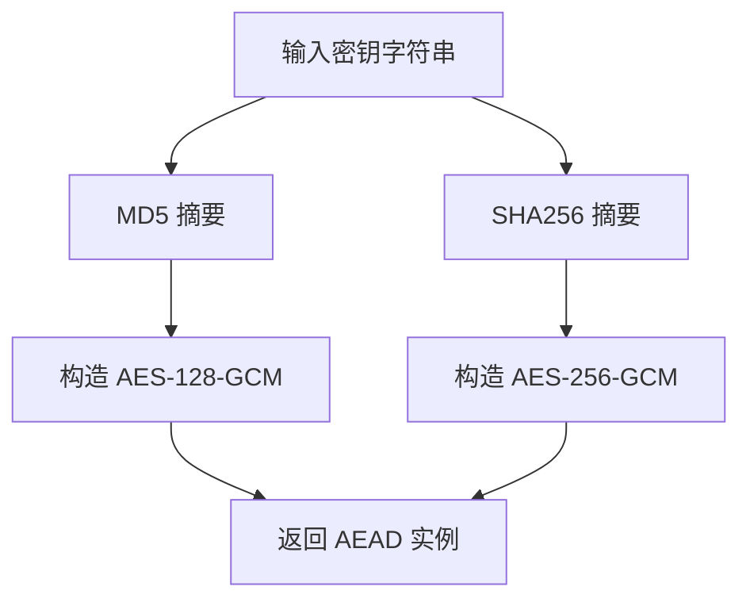
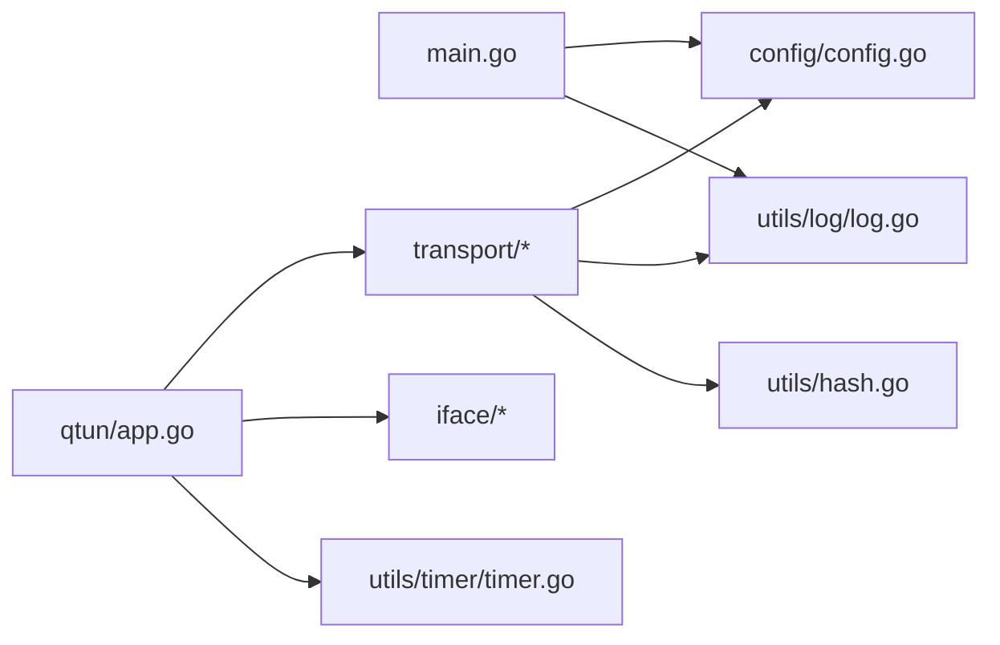

# 工具模块组织

<cite>
**本文引用的文件**
- [main.go](file://main.go)
- [README.md](file://README.md)
- [go.mod](file://go.mod)
- [config/config.go](file://config/config.go)
- [utils/log/log.go](file://utils/log/log.go)
- [utils/timer/timer.go](file://utils/timer/timer.go)
- [utils/hash.go](file://utils/hash.go)
- [.vscode/settings.json](file://.vscode/settings.json)
- [qtun/app.go](file://qtun/app.go)
- [transport/crypto.go](file://transport/crypto.go)
</cite>

## 目录
1. [简介](#简介)
2. [项目结构](#项目结构)
3. [核心组件](#核心组件)
4. [架构总览](#架构总览)
5. [详细组件分析](#详细组件分析)
6. [依赖关系分析](#依赖关系分析)
7. [性能考量](#性能考量)
8. [故障排查指南](#故障排查指南)
9. [结论](#结论)
10. [附录](#附录)

## 简介
本文件面向Qtun项目的工具模块组织，系统性梳理utils工具包的设计理念与功能分类，重点覆盖日志系统（log）、定时器管理（timer）、哈希算法（hash）等核心工具组件。同时，结合项目实际使用场景，说明.qoder AI辅助开发工具的配置与使用思路，以及.vscode开发环境的配置优化建议。文档还总结了工具模块的命名规范、接口设计原则与最佳实践，并提供可操作的使用示例与扩展指南，帮助开发者快速理解并高效复用这些基础设施组件。

## 项目结构
Qtun采用分层与按功能域划分相结合的组织方式：入口程序位于根目录，核心业务逻辑集中在qtun包，传输层与协议定义在transport与protocol，网络接口封装在iface，工具函数集中于utils，配置通过config包统一管理；IDE与辅助工具配置位于.vscode与.qoder目录。

图表来源
- [main.go](file://main.go#L1-L136)
- [qtun/app.go](file://qtun/app.go#L1-L271)
- [config/config.go](file://config/config.go#L1-L24)
- [utils/log/log.go](file://utils/log/log.go#L1-L26)
- [utils/timer/timer.go](file://utils/timer/timer.go#L1-L55)
- [utils/hash.go](file://utils/hash.go#L1-L42)
- [.vscode/settings.json](file://.vscode/settings.json#L1-L23)

章节来源
- [main.go](file://main.go#L1-L136)
- [README.md](file://README.md#L1-L99)

## 核心组件
- 日志系统（utils/log）
  - 设计目标：提供统一、可配置的日志初始化入口，基于zerolog实现控制台输出与级别切换。
  - 关键能力：支持info与debug两级日志级别，初始化时绑定控制台输出并设置全局级别。
  - 使用位置：入口程序在解析命令行参数后调用日志初始化，确保后续所有模块使用一致的日志行为。
- 定时器管理（utils/timer）
  - 设计目标：为应用提供轻量级、可并发的任务调度能力，支持注册任务、启动与停止。
  - 关键能力：以时间间隔为键维护任务映射，内部使用goroutine与channel循环触发，支持上下文取消。
  - 使用位置：应用主控在服务模式下注册“清理路由”任务，周期性扫描并移除失效连接。
- 哈希算法（utils/hash）
  - 设计目标：提供常用摘要算法与编码工具，简化密钥派生与数据编码流程。
  - 关键能力：SHA256、SHA1、MD5摘要计算；十六进制与Base64编码；POE异常处理辅助函数。
  - 使用位置：传输层加密模块用于从字符串密钥生成固定长度的字节密钥，分别用于不同强度的AEAD算法。

章节来源
- [utils/log/log.go](file://utils/log/log.go#L1-L26)
- [utils/timer/timer.go](file://utils/timer/timer.go#L1-L55)
- [utils/hash.go](file://utils/hash.go#L1-L42)
- [transport/crypto.go](file://transport/crypto.go#L1-L27)

## 架构总览
下图展示入口程序、应用主控与工具模块之间的交互关系，以及工具模块在系统中的定位与职责边界。

图表来源
- [main.go](file://main.go#L75-L102)
- [config/config.go](file://config/config.go#L17-L23)
- [utils/log/log.go](file://utils/log/log.go#L10-L25)
- [qtun/app.go](file://qtun/app.go#L37-L70)
- [utils/timer/timer.go](file://utils/timer/timer.go#L21-L47)
- [transport/crypto.go](file://transport/crypto.go#L10-L26)

## 详细组件分析

### 日志系统（utils/log）
- 设计理念
  - 统一入口：通过InitLog集中初始化日志输出与级别，避免各模块重复配置。
  - 可插拔输出：当前绑定控制台输出，便于本地调试与CI日志查看。
  - 级别控制：支持info与debug两级，满足开发与生产环境的不同需求。
- 接口与行为
  - InitLog(loglevel string)：根据传入级别设置全局日志级别并输出提示消息。
  - 默认输出：控制台输出，便于在终端中直接观察日志。
- 使用示例路径
  - 入口程序在初始化配置后调用日志初始化，确保后续日志生效。
- 最佳实践
  - 在应用启动阶段尽早调用InitLog，保证全生命周期日志一致性。
  - 生产环境建议使用info级别，必要时临时提升到debug进行问题定位。

图表来源
- [utils/log/log.go](file://utils/log/log.go#L10-L25)

章节来源
- [utils/log/log.go](file://utils/log/log.go#L1-L26)
- [main.go](file://main.go#L86-L86)

### 定时器管理（utils/timer）
- 设计理念
  - 轻量并发：以map存储任务与取消函数，每个任务独立goroutine运行，互不阻塞。
  - 生命周期管理：通过上下文控制任务启动与停止，支持优雅退出。
  - 易用接口：提供注册、启动、停止三类核心方法，降低使用复杂度。
- 数据结构与流程
  - 结构体字段：Timers（间隔->任务映射）、CancelFuncs（间隔->取消函数指针）。
  - 启动流程：遍历已注册任务，为每个任务创建上下文并启动独立协程。
  - 执行流程：使用定时器触发任务执行，完成后重置定时器继续循环，直到收到取消信号。
- 使用示例路径
  - 应用主控在服务模式下注册“清理路由”任务，周期性扫描并移除失效连接，随后调用Start启动定时器。
- 最佳实践
  - 任务函数应尽量无阻塞，避免影响其他任务的按时执行。
  - 停止任务时务必调用Stop，释放资源并确保goroutine安全退出。

图表来源
- [utils/timer/timer.go](file://utils/timer/timer.go#L9-L19)

图表来源
- [utils/timer/timer.go](file://utils/timer/timer.go#L21-L54)
- [qtun/app.go](file://qtun/app.go#L51-L70)

章节来源
- [utils/timer/timer.go](file://utils/timer/timer.go#L1-L55)
- [qtun/app.go](file://qtun/app.go#L51-L70)

### 哈希算法（utils/hash）
- 设计理念
  - 功能内聚：将摘要计算与编码转换聚合在同一包中，便于跨模块复用。
  - 易用性优先：提供简洁的函数式接口，减少调用方样板代码。
  - 安全性考虑：在传输层密钥派生中区分不同强度算法（MD5与SHA256），满足不同安全需求。
- 接口与行为
  - 摘要函数：SHA256、SHA1、MD5，返回字节切片。
  - 编码函数：Hex（十六进制）、B64（Base64），返回字符串。
  - 异常处理：POE（Panic On Error），在非空错误时触发panic，便于快速暴露问题。
- 使用示例路径
  - 传输层加密模块使用MD5与SHA256分别生成128位与256位密钥，用于AES-GCM加密。
- 最佳实践
  - 对于长期使用的密钥派生，优先选择SHA256以获得更强的安全性。
  - 编码输出用于日志或网络传输时，注意Base64与十六进制的可读性差异。

图表来源
- [utils/hash.go](file://utils/hash.go#L11-L27)
- [transport/crypto.go](file://transport/crypto.go#L10-L26)

章节来源
- [utils/hash.go](file://utils/hash.go#L1-L42)
- [transport/crypto.go](file://transport/crypto.go#L1-L27)

### .qoder AI辅助开发工具配置与使用
- 配置现状
  - 仓库包含.qoder目录，但未发现具体配置文件或技能/代理定义，无法直接给出可用的.qoder配置示例。
- 使用建议
  - 若需集成AI辅助开发，可在.qoder目录下按团队规范新增agents与skills配置文件，明确任务分工与调用链路。
  - 建议将常见任务（如代码审查、单元测试生成、文档补全）拆分为独立技能，便于复用与迭代。
- 注意事项
  - 保持配置与项目版本同步，避免因AI工具变更导致的构建或运行问题。
  - 在团队内制定统一的AI工具使用规范，确保输出质量与一致性。

[本节为概念性说明，未直接分析具体源文件]

### .vscode 开发环境配置优化
- 当前配置要点
  - go.formatTool：使用goimports统一导入格式化。
  - go.useLanguageServer：启用语言服务器以获得更好的智能感知与重构支持。
  - gopls：保留默认配置，便于在多平台与多Go版本环境中稳定运行。
- 优化建议
  - 可选开启：go.languageServerExperimentalFeatures中与格式化、自动补全、跳转定义相关的特性，以提升开发体验。
  - 项目内可增加tasks.json与launch.json，定义构建、测试与调试任务，缩短从编辑到验证的反馈链路。
- 影响范围
  - 以上配置主要影响编辑器内的代码提示、格式化与诊断能力，对运行时行为无直接影响。

章节来源
- [.vscode/settings.json](file://.vscode/settings.json#L1-L23)

## 依赖关系分析
- 模块耦合
  - 入口程序依赖配置与日志模块；应用主控依赖定时器工具；传输层依赖哈希工具。
  - 各工具模块之间保持低耦合，仅通过明确的函数接口交互。
- 外部依赖
  - 日志：zerolog（控制台输出与级别管理）。
  - 加密：标准库crypto/aes与cipher，配合utils/hash提供的摘要结果。
- 版本与兼容性
  - go.mod声明Go版本与依赖版本，确保工具模块在受控环境下稳定运行。

图表来源
- [main.go](file://main.go#L15-L20)
- [qtun/app.go](file://qtun/app.go#L13-L16)
- [transport/crypto.go](file://transport/crypto.go#L3-L8)
- [go.mod](file://go.mod#L3-L14)

章节来源
- [go.mod](file://go.mod#L1-L29)
- [main.go](file://main.go#L1-L136)
- [qtun/app.go](file://qtun/app.go#L1-L271)

## 性能考量
- 日志性能
  - 控制台输出与级别过滤在启动阶段完成，运行时开销较低；建议在生产环境使用info级别以减少日志量。
- 定时器性能
  - 每个任务独立goroutine，避免相互阻塞；任务函数应尽量无阻塞IO，防止影响整体调度。
- 哈希与加密
  - 摘要计算与AEAD初始化为CPU密集型操作，建议在应用启动阶段完成密钥派生，避免在热路径重复计算。
- 并发与资源
  - 应用主控根据CPU核心数动态调整TUN工作协程数量，兼顾I/O并行与系统负载平衡。

[本节为通用性能讨论，未直接分析具体源文件]

## 故障排查指南
- 日志级别问题
  - 症状：看不到debug日志。
  - 排查：确认入口程序传入的日志级别参数是否正确，以及InitLog是否被调用。
- 定时器未执行
  - 症状：注册的任务未按预期周期执行。
  - 排查：检查是否调用了Start，以及任务函数是否无阻塞；确认Stop调用时机，避免过早取消。
- 密钥派生异常
  - 症状：加密初始化失败或连接异常。
  - 排查：核对密钥字符串长度与字符集，确认MD5/SHA256结果符合预期；检查POE触发点，定位上游错误。
- 系统代理设置
  - 症状：客户端无法自动代理。
  - 排查：确认SetProxy调用路径与系统平台支持情况；手动检查系统代理设置或使用静态PAC文件。

章节来源
- [utils/log/log.go](file://utils/log/log.go#L10-L25)
- [utils/timer/timer.go](file://utils/timer/timer.go#L40-L54)
- [utils/hash.go](file://utils/hash.go#L37-L41)
- [qtun/app.go](file://qtun/app.go#L250-L270)

## 结论
Qtun的工具模块以“统一入口、低耦合、高内聚”为核心设计原则，日志、定时器与哈希工具分别承担可观测性、调度与密钥派生的关键职责。通过入口程序的集中初始化与应用主控的模块化协作，工具模块有效支撑了上层业务逻辑的稳定性与可维护性。建议在后续迭代中持续完善.qoder与.vscode配置，形成标准化的开发与辅助工具体系，进一步提升团队效率与交付质量。

## 附录

### 命名规范与接口设计原则
- 命名规范
  - 包名小写、语义化：如utils/log、utils/timer、utils/hash。
  - 函数名清晰表达意图：如InitLog、RegisterTask、Start、Stop、SHA256、MD5、Hex、B64、POE。
- 接口设计原则
  - 单一职责：每个工具包聚焦一类能力，避免功能交叉。
  - 明确生命周期：如定时器的Start/Stop配对，日志的InitLog一次性初始化。
  - 易于测试：提供清晰的输入输出与副作用边界，便于单元测试覆盖。

### 使用示例与扩展指南
- 日志使用
  - 在应用启动阶段调用InitLog设置级别，随后在各模块中直接使用日志接口输出信息与调试。
- 定时器使用
  - 通过RegisterTask注册周期性任务，调用Start启动，必要时调用Stop停止；注意任务函数的幂等性与无阻塞性。
- 哈希与加密
  - 在传输层初始化时，依据安全需求选择MD5或SHA256作为密钥派生算法；对敏感数据进行编码输出时，根据场景选择Hex或B64。
- 扩展建议
  - 新增工具模块时，遵循现有包结构与命名约定，提供最小可用接口与清晰的错误处理策略。
  - 对外暴露的公共接口应附带简要说明与使用示例，便于团队成员快速上手。

[本节为通用指导，未直接分析具体源文件]