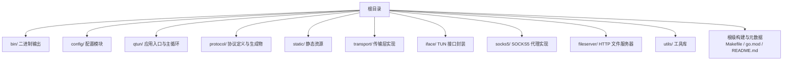
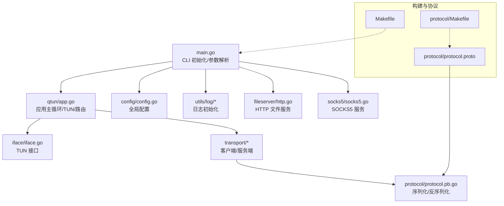
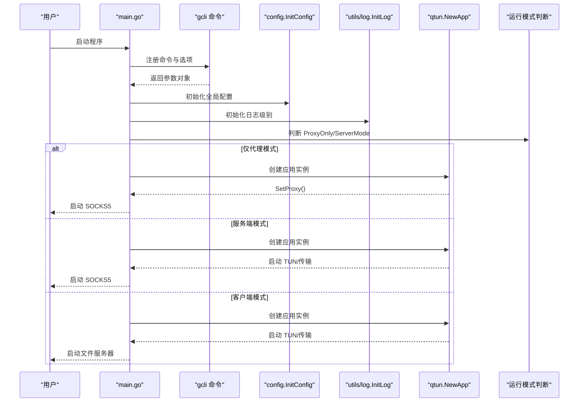
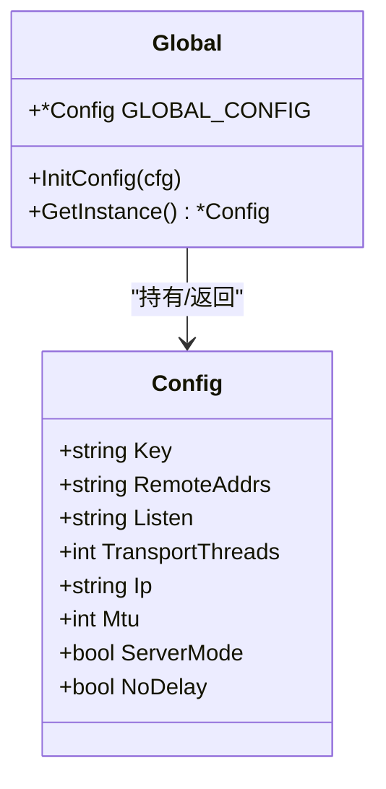
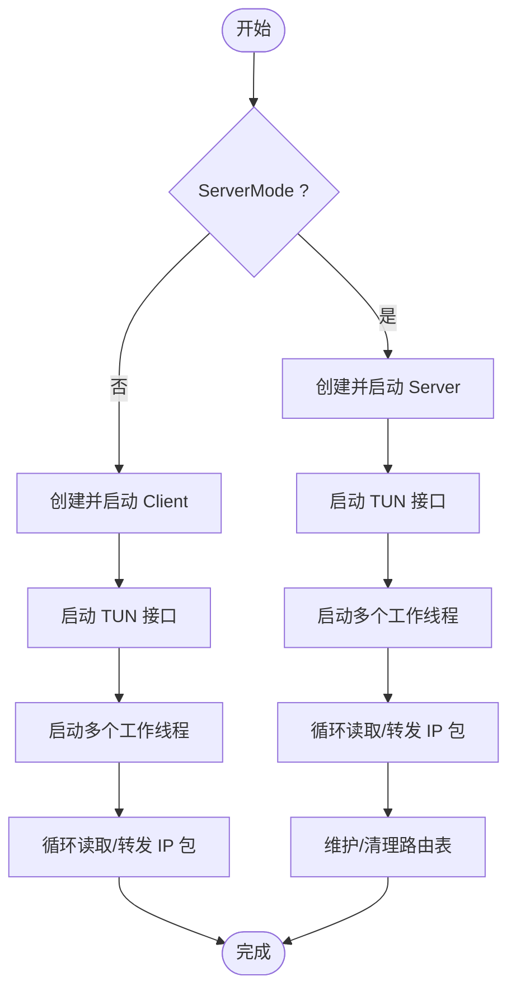
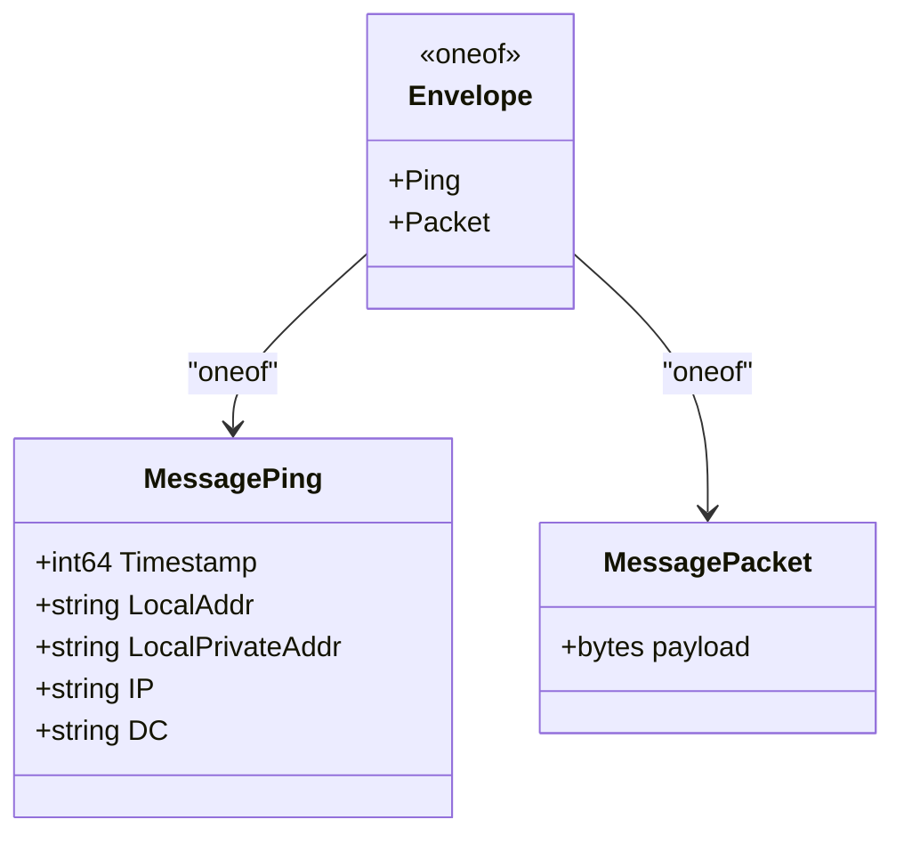
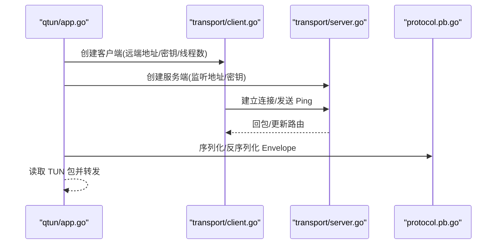
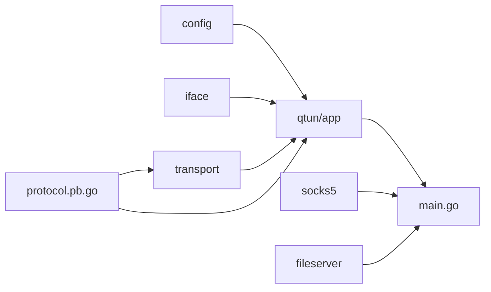

# 文件组织规范

<cite>
**本文引用的文件**
- [main.go](file://main.go)
- [go.mod](file://go.mod)
- [Makefile](file://Makefile)
- [protocol/Makefile](file://protocol/Makefile)
- [README.md](file://README.md)
- [config/config.go](file://config/config.go)
- [qtun/app.go](file://qtun/app.go)
- [protocol/protocol.proto](file://protocol/protocol.proto)
- [protocol/protocol.pb.go](file://protocol/protocol.pb.go)
- [static/proxy.pac](file://static/proxy.pac)
- [socks5/socks5.go](file://socks5/socks5.go)
- [fileserver/http.go](file://fileserver/http.go)
- [transport/client.go](file://transport/client.go)
- [transport/server.go](file://transport/server.go)
- [iface/iface.go](file://iface/iface.go)
</cite>

## 目录
1. [简介](#简介)
2. [项目结构](#项目结构)
3. [核心组件](#核心组件)
4. [架构总览](#架构总览)
5. [详细组件分析](#详细组件分析)
6. [依赖关系分析](#依赖关系分析)
7. [性能考量](#性能考量)
8. [故障排查指南](#故障排查指南)
9. [结论](#结论)
10. [附录](#附录)

## 简介
本文件系统化梳理 Qtun 项目的文件命名规范与目录布局原则，明确源代码组织方式、测试文件命名约定、配置文件分类管理，解释关键文件的作用与相互关系（如主入口 main.go、模块定义 go.mod、构建脚本 Makefile、协议定义 protocol.proto 及其生成物 protocol.pb.go），并提供文件结构层次关系图与依赖关系说明。同时给出静态资源文件（static/）与生成文件（protocol.pb.go）的管理策略。

## 项目结构
项目采用按功能域分层的目录组织方式：顶层为入口、构建与配置；核心业务按模块划分，如网络接口、传输层、协议、SOCKS5 代理、文件服务器、工具库等；静态资源与生成文件分别置于独立目录，便于版本控制与构建流程管理。

图表来源
- [main.go](file://main.go#L1-L136)
- [go.mod](file://go.mod#L1-L29)
- [Makefile](file://Makefile#L1-L23)
- [protocol/Makefile](file://protocol/Makefile#L1-L7)
- [README.md](file://README.md#L1-L99)

章节来源
- [main.go](file://main.go#L1-L136)
- [go.mod](file://go.mod#L1-L29)
- [Makefile](file://Makefile#L1-L23)
- [protocol/Makefile](file://protocol/Makefile#L1-L7)
- [README.md](file://README.md#L1-L99)

## 核心组件
- 主入口与命令行
  - main.go 负责初始化 CLI、解析参数、初始化全局配置与日志、选择运行模式（服务端/客户端）、启动 TUN 接口与可选的 SOCKS5 或文件服务器，并驱动应用主循环。
- 模块与依赖
  - go.mod 定义模块名、Go 版本与直接/间接依赖，确保构建一致性。
- 构建与分发
  - 顶层 Makefile 提供跨平台编译目标；protocol/Makefile 提供协议编译与依赖准备。
- 配置中心
  - config/config.go 提供全局配置单例，集中管理密钥、远端地址、监听地址、线程数、IP/Mtu、模式与 TCP 选项。
- 应用主循环
  - qtun/app.go 实现应用生命周期：根据模式创建传输层客户端或服务端，启动 TUN 接口，多工作线程读取/转发 IP 包，维护路由表与连接状态。
- 协议与生成物
  - protocol/protocol.proto 定义 Envelope 与消息类型；protocol/protocol.pb.go 由 protoc 自动生成，供序列化/反序列化使用。
- 传输层
  - transport/client.go 与 transport/server.go 分别实现客户端连接池与服务端 QUIC 监听、连接管理与收发处理。
- 网络接口
  - iface/iface.go 封装 TUN 设备创建、配置与读写。
- 代理与文件服务
  - socks5/socks5.go 提供 SOCKS5 服务端能力；fileserver/http.go 提供静态文件 HTTP 服务。
- 静态资源
  - static/proxy.pac 为 PAC 自动代理脚本，用于系统代理配置。

章节来源
- [main.go](file://main.go#L1-L136)
- [config/config.go](file://config/config.go#L1-L24)
- [qtun/app.go](file://qtun/app.go#L1-L271)
- [protocol/protocol.proto](file://protocol/protocol.proto#L1-L22)
- [protocol/protocol.pb.go](file://protocol/protocol.pb.go#L1-L200)
- [transport/client.go](file://transport/client.go#L1-L200)
- [transport/server.go](file://transport/server.go#L1-L200)
- [iface/iface.go](file://iface/iface.go#L1-L105)
- [socks5/socks5.go](file://socks5/socks5.go#L1-L170)
- [fileserver/http.go](file://fileserver/http.go#L1-L17)
- [static/proxy.pac](file://static/proxy.pac#L1-L800)

## 架构总览
下图展示从主入口到各子系统的调用关系与职责分工。

图表来源
- [main.go](file://main.go#L1-L136)
- [qtun/app.go](file://qtun/app.go#L1-L271)
- [config/config.go](file://config/config.go#L1-L24)
- [transport/client.go](file://transport/client.go#L1-L200)
- [transport/server.go](file://transport/server.go#L1-L200)
- [protocol/protocol.proto](file://protocol/protocol.proto#L1-L22)
- [protocol/protocol.pb.go](file://protocol/protocol.pb.go#L1-L200)
- [iface/iface.go](file://iface/iface.go#L1-L105)
- [socks5/socks5.go](file://socks5/socks5.go#L1-L170)
- [fileserver/http.go](file://fileserver/http.go#L1-L17)
- [Makefile](file://Makefile#L1-L23)
- [protocol/Makefile](file://protocol/Makefile#L1-L7)

## 详细组件分析

### 主入口与命令行（main.go）
- 职责
  - 定义命令行选项与默认值，初始化全局配置与日志，按模式启动 SOCKS5 或文件服务器，创建并运行应用实例。
- 关键点
  - 参数覆盖顺序：命令行默认值 → 用户传入值 → 运行时校验与提示。
  - 模式分支：服务端模式优先启动 SOCKS5；客户端模式启动文件服务器；两者均可仅启用代理模式。
- 依赖关系
  - 依赖 config、qtun、socks5、fileserver、utils/log 等模块。

图表来源
- [main.go](file://main.go#L1-L136)
- [config/config.go](file://config/config.go#L1-L24)

章节来源
- [main.go](file://main.go#L1-L136)

### 配置中心（config/config.go）
- 职责
  - 定义 Config 结构体承载所有运行参数；提供 InitConfig 与 GetInstance 全局访问。
- 关键点
  - 所有模块通过 GetInstance 获取统一配置，避免重复解析与不一致。
- 依赖关系
  - 被 main.go、qtun/app.go、transport/* 等广泛依赖。

图表来源
- [config/config.go](file://config/config.go#L1-L24)

章节来源
- [config/config.go](file://config/config.go#L1-L24)

### 应用主循环（qtun/app.go）
- 职责
  - 根据模式创建传输层客户端或服务端；启动 TUN 接口；多工作线程并发处理 IP 包；维护路由表与连接清理任务；在客户端侧设置系统代理。
- 关键点
  - 多工作线程数量与 CPU 核数动态关联，范围限制以平衡吞吐与资源。
  - 服务端模式下周期清理无效连接，减少内存占用。
  - 客户端侧通过系统命令设置 PAC 代理（仅 macOS）。
- 依赖关系
  - 依赖 iface、transport、protocol、timer、config。

图表来源
- [qtun/app.go](file://qtun/app.go#L1-L271)
- [transport/server.go](file://transport/server.go#L1-L200)
- [transport/client.go](file://transport/client.go#L1-L200)
- [iface/iface.go](file://iface/iface.go#L1-L105)

章节来源
- [qtun/app.go](file://qtun/app.go#L1-L271)

### 协议与生成物（protocol/）
- 协议定义（protocol.proto）
  - 定义 Envelope 的 oneof 类型，包含 MessagePing 与 MessagePacket，用于心跳与数据载荷传输。
- 生成物（protocol.pb.go）
  - 由 protoc-gen-go 生成，包含 Envelope、MessagePing、MessagePacket 的序列化/反序列化方法与内部消息信息。
- 构建脚本（protocol/Makefile）
  - 提供协议编译与依赖安装目标，确保开发环境具备 protoc 与插件。

图表来源
- [protocol/protocol.proto](file://protocol/protocol.proto#L1-L22)
- [protocol/protocol.pb.go](file://protocol/protocol.pb.go#L1-L200)

章节来源
- [protocol/protocol.proto](file://protocol/protocol.proto#L1-L22)
- [protocol/protocol.pb.go](file://protocol/protocol.pb.go#L1-L200)
- [protocol/Makefile](file://protocol/Makefile#L1-L7)

### 传输层（transport/）
- 服务端（server.go）
  - 基于 QUIC 监听公共地址，接受新会话与流，维护连接映射（正向/反向），提供连接查询与清理。
- 客户端（client.go）
  - 维护多连接池，按序号轮询发送数据；定期发送 Ping 心跳；连接建立失败重试与统计。

图表来源
- [transport/client.go](file://transport/client.go#L1-L200)
- [transport/server.go](file://transport/server.go#L1-L200)
- [qtun/app.go](file://qtun/app.go#L1-L271)
- [protocol/protocol.pb.go](file://protocol/protocol.pb.go#L1-L200)

章节来源
- [transport/client.go](file://transport/client.go#L1-L200)
- [transport/server.go](file://transport/server.go#L1-L200)

### 网络接口（iface/）
- 职责
  - 使用 water 库创建 TUN 设备，配置 IP 与 MTU，并在 macOS 上添加系统路由。
- 关键点
  - 跨平台命令差异（ifconfig/route），错误输出统一记录日志。

章节来源
- [iface/iface.go](file://iface/iface.go#L1-L105)

### 代理与文件服务（socks5/ 与 fileserver/）
- SOCKS5（socks5.go）
  - 提供服务端监听、认证、请求处理与规则集集成。
- 文件服务器（http.go）
  - 在指定目录与端口提供静态文件服务，用于 PAC 与资源分发。

章节来源
- [socks5/socks5.go](file://socks5/socks5.go#L1-L170)
- [fileserver/http.go](file://fileserver/http.go#L1-L17)

## 依赖关系分析
- 模块内聚与耦合
  - config 作为全局配置中心，被几乎所有模块依赖，保持高内聚低耦合。
  - qtun/app.go 作为编排者，向上依赖 config、iface、transport、protocol，向下协调各子系统。
  - protocol.pb.go 作为协议层唯一实现，被传输层与应用层共同使用。
- 外部依赖
  - go.mod 明确列出直接与间接依赖，确保构建稳定性与可复现性。
- 循环依赖
  - 当前结构未见明显循环导入；若后续扩展需注意模块边界。

图表来源
- [config/config.go](file://config/config.go#L1-L24)
- [qtun/app.go](file://qtun/app.go#L1-L271)
- [transport/client.go](file://transport/client.go#L1-L200)
- [transport/server.go](file://transport/server.go#L1-L200)
- [protocol/protocol.pb.go](file://protocol/protocol.pb.go#L1-L200)
- [iface/iface.go](file://iface/iface.go#L1-L105)
- [socks5/socks5.go](file://socks5/socks5.go#L1-L170)
- [fileserver/http.go](file://fileserver/http.go#L1-L17)
- [main.go](file://main.go#L1-L136)

章节来源
- [go.mod](file://go.mod#L1-L29)

## 性能考量
- 并发与工作线程
  - TUN 包处理线程数与 CPU 核数成比例，范围限制在 4–32，兼顾 I/O 并发与资源消耗。
- 连接池与负载均衡
  - 客户端多连接池按序号轮询发送，提升带宽利用率与容错性。
- QUIC 优化
  - 服务端配置较大的最大流数、接收窗口与保活周期，提升高并发与长连接场景下的稳定性。
- 路由清理
  - 定期扫描并移除失效连接，降低内存占用与误转发风险。

## 故障排查指南
- 日志定位
  - 使用 utils/log.InitLog 设置日志级别；通过日志中的模块与函数上下文快速定位问题。
- 常见问题
  - TUN 配置失败：检查 ifconfig/route 命令执行结果与权限；确认 IP/Mtu 与系统网卡兼容。
  - 连接不稳定：查看客户端重试与 Ping 发送频率；检查服务端 QUIC 监听与 TLS 配置。
  - 协议解析异常：确认 protocol.pb.go 与 protocol.proto 是否同步生成，避免版本不匹配。
- 调试辅助
  - main.go 中已预留 pprof 与 statsviz 注册位置，可用于性能分析与运行时可视化。

章节来源
- [qtun/app.go](file://qtun/app.go#L1-L271)
- [transport/server.go](file://transport/server.go#L1-L200)
- [transport/client.go](file://transport/client.go#L1-L200)
- [main.go](file://main.go#L1-L136)

## 结论
本规范明确了 Qtun 的文件命名与目录布局原则：以功能域划分模块、以配置为中心、以协议为契约、以构建脚本为入口。通过清晰的职责边界与依赖关系，既保证了可维护性，也为扩展与优化提供了稳定基础。建议在后续迭代中持续遵循该规范，确保新增模块与文件的命名与组织方式与现有体系保持一致。

## 附录

### 文件命名与目录布局规范
- 源代码文件
  - 按功能域分目录：config、qtun、transport、iface、socks5、fileserver、utils、protocol。
  - 每个目录内的 .go 文件聚焦单一职责，避免交叉耦合。
- 测试文件
  - 命名约定：*_test.go，位于同目录下，使用 go test 命令运行。
  - 示例：socks5/auth_test.go、socks5/request_test.go 等。
- 配置文件
  - config/config.go 提供统一配置结构与初始化；其他配置项通过命令行参数注入。
- 构建脚本
  - 顶层 Makefile：跨平台编译目标（windows/linux/arm/m4 等）。
  - protocol/Makefile：协议编译与依赖准备。
- 协议与生成物
  - protocol/protocol.proto 定义契约；protocol/protocol.pb.go 由 protoc 自动生成，禁止手工修改。
- 静态资源
  - static/proxy.pac 为 PAC 脚本，用于系统代理配置；其他静态文件按需放置于该目录。
- 二进制输出
  - 编译产物输出至 bin/ 目录，命名区分平台与架构。

章节来源
- [Makefile](file://Makefile#L1-L23)
- [protocol/Makefile](file://protocol/Makefile#L1-L7)
- [protocol/protocol.proto](file://protocol/protocol.proto#L1-L22)
- [protocol/protocol.pb.go](file://protocol/protocol.pb.go#L1-L200)
- [static/proxy.pac](file://static/proxy.pac#L1-L800)