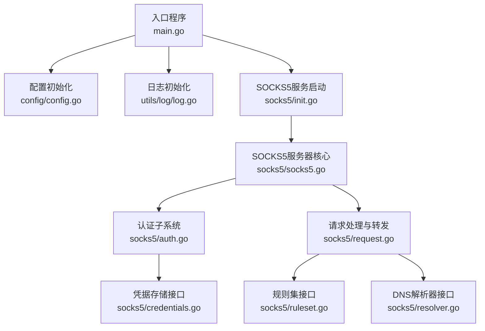
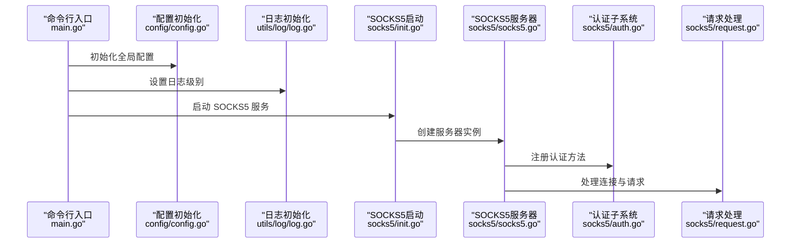
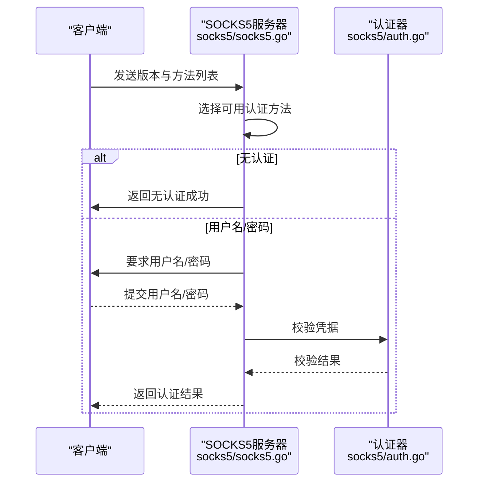
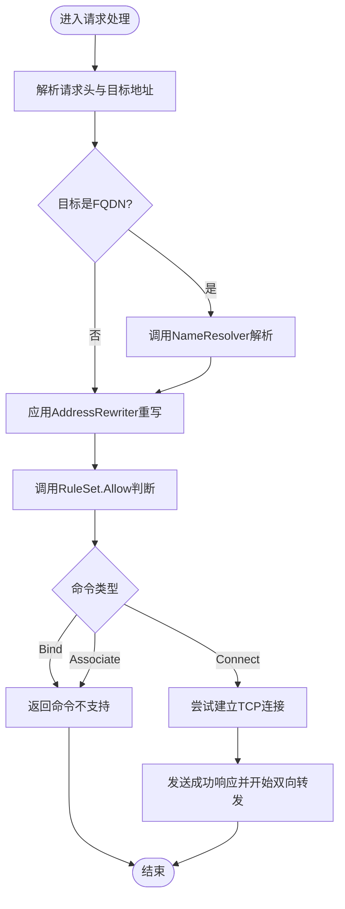
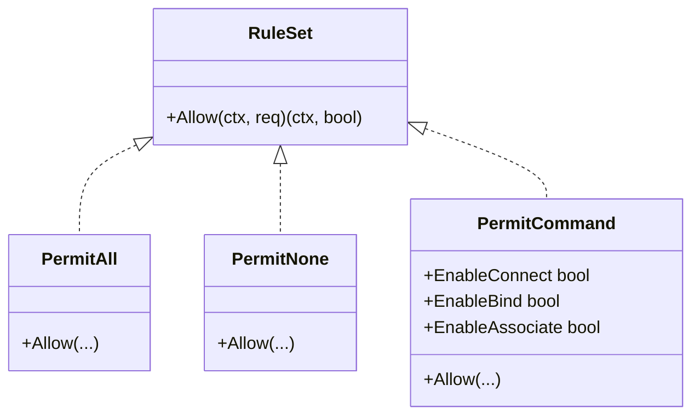
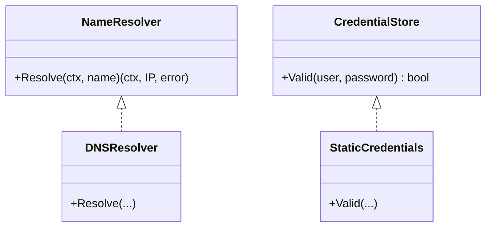
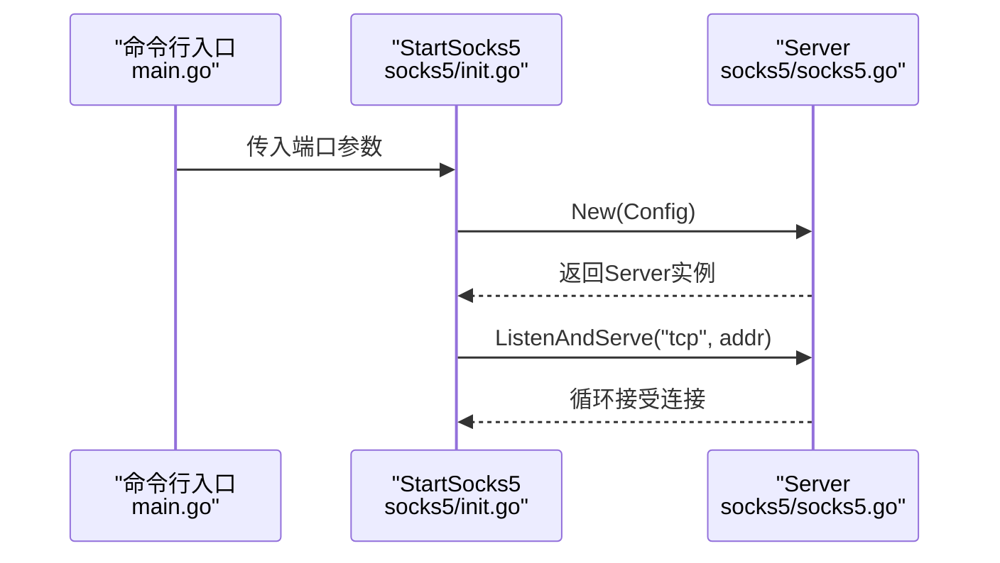
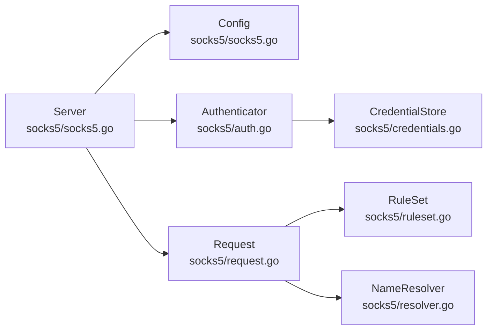

# SOCKS5代理服务

<cite>
**本文引用的文件**
- [main.go](file://main.go)
- [config.go](file://config/config.go)
- [log.go](file://utils/log/log.go)
- [socks5.go](file://socks5/socks5.go)
- [auth.go](file://socks5/auth.go)
- [request.go](file://socks5/request.go)
- [ruleset.go](file://socks5/ruleset.go)
- [resolver.go](file://socks5/resolver.go)
- [credentials.go](file://socks5/credentials.go)
- [init.go](file://socks5/init.go)
- [auth_test.go](file://socks5/auth_test.go)
- [request_test.go](file://socks5/request_test.go)
- [ruleset_test.go](file://socks5/ruleset_test.go)
- [resolver_test.go](file://socks5/resolver_test.go)
- [credentials_test.go](file://socks5/credentials_test.go)
- [socks5_test.go](file://socks5/socks5_test.go)
- [README.md](file://README.md)
</cite>

## 目录
1. [简介](#简介)
2. [项目结构](#项目结构)
3. [核心组件](#核心组件)
4. [架构总览](#架构总览)
5. [详细组件分析](#详细组件分析)
6. [依赖关系分析](#依赖关系分析)
7. [性能考量](#性能考量)
8. [故障排查指南](#故障排查指南)
9. [结论](#结论)
10. [附录](#附录)

## 简介
本文件为 SOCKS5 代理服务的深度技术文档，围绕协议握手、认证机制、请求处理与响应发送进行系统化阐述；同时覆盖认证系统的多种实现（无认证、用户名/密码认证、自定义认证器）、请求处理流程（目标地址解析、连接建立、数据转发）、访问控制规则集设计（允许/拒绝规则、地址重写、自定义逻辑）、配置项说明（监听地址、认证方法、DNS 解析器、日志记录）以及可扩展性建议。文档以仓库源码为依据，配合图示与路径引用帮助读者快速理解与实践。

## 项目结构
该仓库采用按功能域划分的组织方式：入口程序位于根目录，配置与日志位于独立包，SOCKS5 协议实现集中在 socks5 包内，其余模块与传输层、网络接口等协同工作。与 SOCKS5 直接相关的关键文件如下：
- 入口与运行参数：main.go
- 配置初始化：config/config.go
- 日志初始化：utils/log/log.go
- SOCKS5 核心：socks5/socks5.go、socks5/auth.go、socks5/request.go
- 规则集与重写：socks5/ruleset.go、socks5/resolver.go
- 凭据存储：socks5/credentials.go
- 启动入口：socks5/init.go
- 测试用例：各 *.go 的 *_test.go 文件

图表来源
- [main.go](file://main.go#L70-L103)
- [config.go](file://config/config.go#L17-L23)
- [log.go](file://utils/log/log.go#L10-L25)
- [init.go](file://socks5/init.go#L5-L22)
- [socks5.go](file://socks5/socks5.go#L61-L96)
- [auth.go](file://socks5/auth.go#L33-L130)
- [request.go](file://socks5/request.go#L118-L156)
- [ruleset.go](file://socks5/ruleset.go#L7-L41)
- [resolver.go](file://socks5/resolver.go#L9-L23)
- [credentials.go](file://socks5/credentials.go#L3-L17)

章节来源
- [main.go](file://main.go#L22-L103)
- [config.go](file://config/config.go#L3-L23)
- [log.go](file://utils/log/log.go#L10-L25)
- [init.go](file://socks5/init.go#L5-L22)

## 核心组件
- 服务器配置 Config：用于装配认证方法、凭据存储、DNS 解析器、规则集、地址重写器、绑定 IP、日志器与拨号函数。
- 服务器 Server：负责监听、接受连接、执行协议握手、认证、请求解析与处理。
- 认证子系统：支持无认证与用户名/密码认证，亦可通过实现接口接入自定义认证器。
- 请求 Request：封装版本、命令、远端地址、目标地址、真实目标地址与缓冲读取器。
- 规则集 RuleSet：提供 Allow(ctx, req) 接口，决定是否允许特定命令。
- 地址重写 AddressRewriter：在规则集之前对目标地址进行透明重写。
- DNS 解析 NameResolver：默认使用系统 DNS，可替换为自定义解析器。
- 凭据存储 CredentialStore：静态映射或自定义实现。

章节来源
- [socks5.go](file://socks5/socks5.go#L17-L51)
- [auth.go](file://socks5/auth.go#L33-L130)
- [request.go](file://socks5/request.go#L67-L82)
- [ruleset.go](file://socks5/ruleset.go#L7-L41)
- [resolver.go](file://socks5/resolver.go#L9-L23)
- [credentials.go](file://socks5/credentials.go#L3-L17)

## 架构总览
下图展示了从入口到 SOCKS5 服务器的调用链路与关键交互点。

图表来源
- [main.go](file://main.go#L75-L102)
- [config.go](file://config/config.go#L17-L23)
- [log.go](file://utils/log/log.go#L10-L25)
- [init.go](file://socks5/init.go#L5-L22)
- [socks5.go](file://socks5/socks5.go#L61-L96)
- [auth.go](file://socks5/auth.go#L112-L130)
- [request.go](file://socks5/request.go#L118-L156)

## 详细组件分析

### 协议握手与认证机制
- 版本协商：读取版本字节，不匹配则返回错误。
- 方法选择：读取客户端提供的方法列表，匹配已注册的认证器；若无可接受方法，则返回“无可接受”。
- 无认证模式：直接返回成功。
- 用户名/密码认证：要求客户端使用指定版本与长度编码提交用户名与密码；校验失败则返回认证失败。
- 认证上下文：将所选方法与载荷（如用户名）写入 AuthContext，供后续请求处理使用。

图表来源
- [socks5.go](file://socks5/socks5.go#L120-L146)
- [auth.go](file://socks5/auth.go#L112-L130)
- [auth.go](file://socks5/auth.go#L60-L110)

章节来源
- [socks5.go](file://socks5/socks5.go#L120-L146)
- [auth.go](file://socks5/auth.go#L112-L130)
- [auth.go](file://socks5/auth.go#L60-L110)

### 请求处理与响应发送
- 请求解析：读取命令版本、命令类型与目标地址（IPv4/IPv6/FQDN），构造 Request。
- 地址解析：若为目标为 FQDN，通过 NameResolver 解析为 IP。
- 地址重写：在规则集前应用 AddressRewriter 对目标地址进行透明重写。
- 命令分发：根据命令类型分派至 Connect/Bind/Associate。
- 连接建立与数据转发：Connect 成功后发送本地绑定地址，再并发双向转发数据；Bind/Associate 当前返回“命令不支持”。

图表来源
- [request.go](file://socks5/request.go#L118-L156)
- [request.go](file://socks5/request.go#L158-L214)
- [request.go](file://socks5/request.go#L216-L252)
- [resolver.go](file://socks5/resolver.go#L17-L23)
- [ruleset.go](file://socks5/ruleset.go#L30-L41)

章节来源
- [request.go](file://socks5/request.go#L89-L116)
- [request.go](file://socks5/request.go#L118-L156)
- [request.go](file://socks5/request.go#L158-L214)
- [request.go](file://socks5/request.go#L216-L252)
- [resolver.go](file://socks5/resolver.go#L17-L23)
- [ruleset.go](file://socks5/ruleset.go#L30-L41)

### 访问控制规则集与地址重写
- 规则集接口：RuleSet 提供 Allow(ctx, req) 返回 (ctx, bool)，用于允许或拒绝请求。
- 内置实现：
  - PermitAll：允许所有命令。
  - PermitNone：拒绝所有命令。
  - PermitCommand：按命令类型开关允许。
- 地址重写：AddressRewriter 在规则集前对目标地址进行透明重写，便于策略路由或出口切换。

图表来源
- [ruleset.go](file://socks5/ruleset.go#L7-L41)

章节来源
- [ruleset.go](file://socks5/ruleset.go#L7-L41)

### DNS 解析器与凭据存储
- DNS 解析器：NameResolver 接口默认实现 DNSResolver 使用系统 DNS 解析主机名。
- 凭据存储：CredentialStore 接口默认实现 StaticCredentials 使用静态映射校验用户名/密码。

图表来源
- [resolver.go](file://socks5/resolver.go#L9-L23)
- [credentials.go](file://socks5/credentials.go#L3-L17)

章节来源
- [resolver.go](file://socks5/resolver.go#L9-L23)
- [credentials.go](file://socks5/credentials.go#L3-L17)

### 服务器启动与运行
- 启动入口：StartSocks5 读取端口参数，创建 Config 并循环监听与服务。
- 默认行为：未显式配置时，自动启用无认证模式、系统 DNS、全部放行规则与标准输出日志器。

图表来源
- [main.go](file://main.go#L88-L93)
- [init.go](file://socks5/init.go#L5-L22)
- [socks5.go](file://socks5/socks5.go#L61-L96)

章节来源
- [init.go](file://socks5/init.go#L5-L22)
- [socks5.go](file://socks5/socks5.go#L61-L96)

## 依赖关系分析
- 组件耦合度：Server 通过 Config 注入认证器、解析器、规则集、重写器、日志器与拨号函数，保持高内聚低耦合。
- 关键依赖链：
  - Server -> Authenticator/NameResolver/RuleSet/AddressRewriter/CredentialStore
  - Request 依赖 NameResolver 与 RuleSet
  - UserPassAuthenticator 依赖 CredentialStore
- 可能的循环依赖：未发现直接循环；接口抽象避免了循环耦合风险。

图表来源
- [socks5.go](file://socks5/socks5.go#L17-L51)
- [auth.go](file://socks5/auth.go#L33-L130)
- [request.go](file://socks5/request.go#L67-L82)
- [ruleset.go](file://socks5/ruleset.go#L7-L41)
- [resolver.go](file://socks5/resolver.go#L9-L23)
- [credentials.go](file://socks5/credentials.go#L3-L17)

章节来源
- [socks5.go](file://socks5/socks5.go#L17-L51)
- [auth.go](file://socks5/auth.go#L33-L130)
- [request.go](file://socks5/request.go#L67-L82)
- [ruleset.go](file://socks5/ruleset.go#L7-L41)
- [resolver.go](file://socks5/resolver.go#L9-L23)
- [credentials.go](file://socks5/credentials.go#L3-L17)

## 性能考量
- 并发模型：Server 在 Accept 到来的每个连接上启动 goroutine 处理，适合高并发场景但需注意资源占用。
- 数据转发：使用双向 io.Copy 并发复制，简洁高效；在长连接与大数据量场景下建议评估缓冲区与背压策略。
- 拨号与解析：默认使用系统 DNS 与 net.Dial；可注入自定义 Dial 与 NameResolver 以优化延迟与稳定性。
- 日志开销：生产环境建议降低日志级别，避免高频 I/O 影响吞吐。

## 故障排查指南
- 认证失败
  - 现象：客户端收到认证失败或无法协商方法。
  - 排查：确认已正确注册认证器与凭据；检查客户端方法列表与版本兼容。
  - 参考路径
    - [auth.go](file://socks5/auth.go#L60-L110)
    - [auth_test.go](file://socks5/auth_test.go#L67-L92)
- 地址解析失败
  - 现象：Connect 返回主机不可达。
  - 排查：检查 NameResolver 实现与网络连通性；确认目标域名可解析。
  - 参考路径
    - [request.go](file://socks5/request.go#L122-L134)
    - [resolver.go](file://socks5/resolver.go#L17-L23)
    - [resolver_test.go](file://socks5/resolver_test.go#L9-L21)
- 规则拦截
  - 现象：Connect 返回规则失败。
  - 排查：检查 RuleSet 配置；确认 PermitAll/PermitNone/PermitCommand 开关。
  - 参考路径
    - [request.go](file://socks5/request.go#L161-L168)
    - [ruleset.go](file://socks5/ruleset.go#L30-L41)
    - [ruleset_test.go](file://socks5/ruleset_test.go#L9-L24)
- 连接被拒绝或网络不可达
  - 现象：根据错误信息映射为连接被拒或网络不可达。
  - 排查：检查远端可达性与防火墙策略。
  - 参考路径
    - [request.go](file://socks5/request.go#L178-L190)
- 协议握手异常
  - 现象：版本不匹配或地址类型不支持。
  - 排查：确认客户端遵循 SOCKS5 规范；检查地址类型与端口编码。
  - 参考路径
    - [socks5.go](file://socks5/socks5.go#L132-L137)
    - [request.go](file://socks5/request.go#L292-L304)

章节来源
- [auth.go](file://socks5/auth.go#L60-L110)
- [auth_test.go](file://socks5/auth_test.go#L67-L92)
- [request.go](file://socks5/request.go#L122-L134)
- [resolver.go](file://socks5/resolver.go#L17-L23)
- [resolver_test.go](file://socks5/resolver_test.go#L9-L21)
- [request.go](file://socks5/request.go#L161-L168)
- [ruleset.go](file://socks5/ruleset.go#L30-L41)
- [ruleset_test.go](file://socks5/ruleset_test.go#L9-L24)
- [request.go](file://socks5/request.go#L178-L190)
- [socks5.go](file://socks5/socks5.go#L132-L137)
- [request.go](file://socks5/request.go#L292-L304)

## 结论
本实现以清晰的接口抽象与模块化设计实现了完整的 SOCKS5 代理能力：支持无认证与用户名/密码认证，具备灵活的规则集与地址重写机制，提供可插拔的 DNS 解析与拨号策略。通过合理的并发模型与日志配置，可在多数场景下稳定运行。建议在生产环境中结合自定义认证器、规则集与解析器进一步增强安全性与可控性。

## 附录

### 配置选项说明
- 全局配置（由命令行传入并初始化）
  - key：加密密钥
  - remote_addrs：远端服务器地址（仅客户端）
  - listen：服务器监听地址（仅服务器）
  - ip：虚拟 IP 段
  - mtu：最大传输单元
  - log_level：日志级别（info/debug）
  - file_dir：HTTP 文件服务器目录
  - transport_threads：传输线程数（仅客户端）
  - server_mode：是否运行在服务器模式
  - nodelay：TCP 是否启用 Nagle
  - socks5_port：SOCKS5 服务端口
  - file_svr_port：HTTP 文件服务器端口
  - proxyonly：仅启用代理模式
- SOCKS5 服务器配置（Config）
  - AuthMethods：认证器列表（可为空，将自动选择无认证或基于凭据的认证器）
  - Credentials：用户名/密码存储（可选）
  - Resolver：名称解析器（可选，默认系统 DNS）
  - Rules：访问控制规则集（可选，默认全部放行）
  - Rewriter：地址重写器（可选，默认不重写）
  - BindIP：Bind 或 UDP Associate 时使用的绑定 IP
  - Logger：日志器（可选，默认标准输出）
  - Dial：自定义拨号函数（可选，默认 net.Dial）

章节来源
- [main.go](file://main.go#L22-L66)
- [config.go](file://config/config.go#L3-L13)
- [log.go](file://utils/log/log.go#L10-L21)
- [socks5.go](file://socks5/socks5.go#L17-L51)

### 使用场景与示例
- 启动 SOCKS5 服务
  - 通过命令行参数指定 socks5_port，调用 StartSocks5 启动服务。
  - 参考路径
    - [main.go](file://main.go#L88-L93)
    - [init.go](file://socks5/init.go#L5-L22)
- 客户端连接与认证
  - 使用用户名/密码认证时，先协商方法，再提交用户名/密码，最后发起 CONNECT 请求。
  - 参考路径
    - [socks5_test.go](file://socks5/socks5_test.go#L14-L110)
    - [auth_test.go](file://socks5/auth_test.go#L29-L65)
- 规则控制访问
  - 使用 PermitNone/PermitAll/PermitCommand 控制不同命令的放行。
  - 参考路径
    - [ruleset_test.go](file://socks5/ruleset_test.go#L9-L24)
    - [request_test.go](file://socks5/request_test.go#L101-L169)
- DNS 解析与地址重写
  - 默认使用系统 DNS；可注入自定义 NameResolver；在规则集前应用 AddressRewriter。
  - 参考路径
    - [resolver_test.go](file://socks5/resolver_test.go#L9-L21)
    - [request.go](file://socks5/request.go#L136-L140)

### 扩展建议
- 自定义认证器：实现 Authenticator 接口，注册到 Config.AuthMethods。
- 自定义规则集：实现 RuleSet 接口，按业务需求定制允许/拒绝逻辑。
- 自定义解析器：实现 NameResolver 接口，替换默认 DNS 行为。
- 自定义拨号：通过 Config.Dial 注入自定义拨号策略（如代理、直连、负载均衡）。
- 自定义日志：通过 Config.Logger 注入自定义日志器（如文件、远程日志）。

章节来源
- [auth.go](file://socks5/auth.go#L33-L36)
- [ruleset.go](file://socks5/ruleset.go#L7-L10)
- [resolver.go](file://socks5/resolver.go#L9-L12)
- [credentials.go](file://socks5/credentials.go#L3-L6)
- [socks5.go](file://socks5/socks5.go#L17-L51)