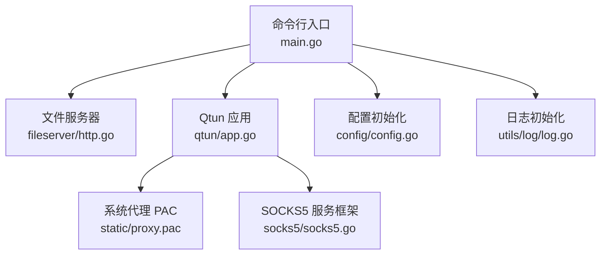
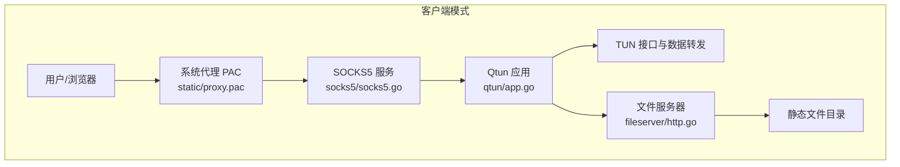
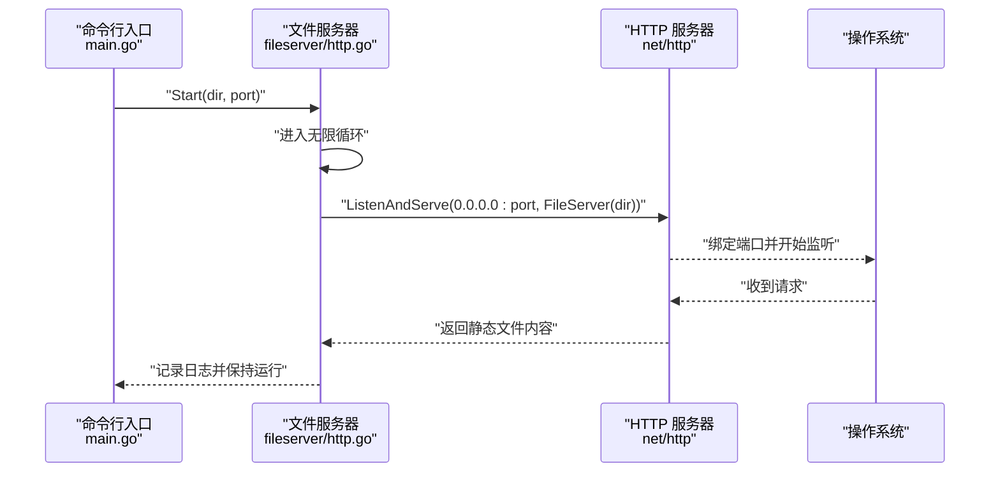
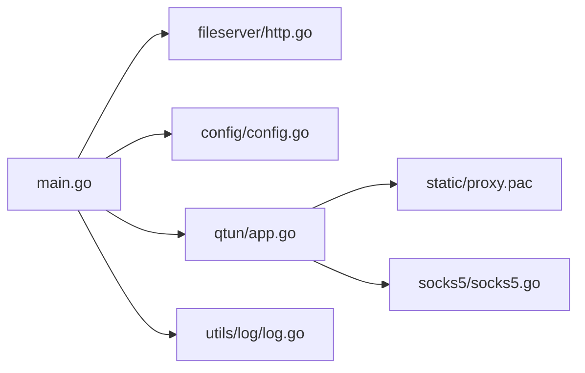

# 文件服务器服务

<cite>
**本文引用的文件列表**
- [fileserver/http.go](file://fileserver/http.go)
- [main.go](file://main.go)
- [config/config.go](file://config/config.go)
- [qtun/app.go](file://qtun/app.go)
- [static/proxy.pac](file://static/proxy.pac)
- [socks5/socks5.go](file://socks5/socks5.go)
- [utils/log/log.go](file://utils/log/log.go)
- [README.md](file://README.md)
</cite>

## 目录
1. [简介](#简介)
2. [项目结构](#项目结构)
3. [核心组件](#核心组件)
4. [架构总览](#架构总览)
5. [详细组件分析](#详细组件分析)
6. [依赖关系分析](#依赖关系分析)
7. [性能与安全考量](#性能与安全考量)
8. [故障排查指南](#故障排查指南)
9. [结论](#结论)
10. [附录：使用示例与配置说明](#附录使用示例与配置说明)

## 简介
本文件服务器服务是 Qtun 应用中的一个轻量级静态文件 HTTP 服务模块，基于标准库 net/http 提供文件目录的静态托管能力。它通过命令行参数接收根目录与监听端口，并在启动时以独立 goroutine 启动 HTTP 服务，日志采用 zerolog 输出。该服务与 Qtun 的主应用解耦，既可作为客户端模式下的本地文件共享服务，也可配合系统代理 PAC 使用，为浏览器或应用提供静态资源访问入口。

## 项目结构
与文件服务器相关的核心文件与职责如下：
- fileserver/http.go：文件服务器启动逻辑（基于标准库 http.FileServer）
- main.go：命令行入口，解析参数并根据模式选择启动文件服务器或 Qtun 主应用
- config/config.go：全局配置结构体与初始化接口
- qtun/app.go：Qtun 主应用运行流程（TUN 接口、传输层、路由等），与文件服务器并行运行
- static/proxy.pac：系统代理 PAC 脚本，用于将特定域名流量重定向至本地 SOCKS5 代理
- socks5/socks5.go：SOCKS5 服务框架（认证、规则集、DNS 解析等），用于系统代理链路
- utils/log/log.go：日志初始化与级别控制
- README.md：使用说明与命令行参数帮助

图表来源
- [main.go](file://main.go#L1-L136)
- [fileserver/http.go](file://fileserver/http.go#L1-L17)
- [config/config.go](file://config/config.go#L1-L24)
- [qtun/app.go](file://qtun/app.go#L1-L271)
- [static/proxy.pac](file://static/proxy.pac#L1-L5276)
- [socks5/socks5.go](file://socks5/socks5.go#L1-L170)
- [utils/log/log.go](file://utils/log/log.go#L1-L26)

章节来源
- [main.go](file://main.go#L1-L136)
- [fileserver/http.go](file://fileserver/http.go#L1-L17)
- [config/config.go](file://config/config.go#L1-L24)
- [qtun/app.go](file://qtun/app.go#L1-L271)
- [static/proxy.pac](file://static/proxy.pac#L1-L5276)
- [socks5/socks5.go](file://socks5/socks5.go#L1-L170)
- [utils/log/log.go](file://utils/log/log.go#L1-L26)

## 核心组件
- 文件服务器模块：负责启动 HTTP 静态文件服务，监听指定端口，提供目录内文件的 GET 访问。
- 命令行入口：解析用户输入的文件服务器根目录与端口，以及 Qtun 运行模式，并调用相应组件。
- 配置模块：保存全局配置（如密钥、监听地址、MTU、是否服务端模式等）。
- Qtun 应用：在客户端模式下启动 TUN 接口与数据转发，同时可设置系统代理以配合 PAC 使用。
- 日志模块：统一日志输出与级别控制。
- 系统代理 PAC：将特定域名流量重定向至本地 SOCKS5 代理，便于与文件服务器联动。

章节来源
- [fileserver/http.go](file://fileserver/http.go#L1-L17)
- [main.go](file://main.go#L1-L136)
- [config/config.go](file://config/config.go#L1-L24)
- [qtun/app.go](file://qtun/app.go#L1-L271)
- [utils/log/log.go](file://utils/log/log.go#L1-L26)
- [static/proxy.pac](file://static/proxy.pac#L1-L5276)

## 架构总览
文件服务器在 Qtun 中的运行位置与交互关系如下：
- 客户端模式下，Qtun 启动 TUN 接口与数据转发；同时启动文件服务器，提供静态资源访问。
- Qtun 可设置系统代理（通过 PAC 指向本地 SOCKS5），使浏览器或应用流量经由 Qtun 通道。
- 文件服务器直接提供静态文件服务，不参与加密与路由决策，仅负责文件读取与返回。

图表来源
- [qtun/app.go](file://qtun/app.go#L250-L271)
- [static/proxy.pac](file://static/proxy.pac#L5251-L5275)
- [socks5/socks5.go](file://socks5/socks5.go#L1-L170)
- [fileserver/http.go](file://fileserver/http.go#L1-L17)

## 详细组件分析

### 文件服务器启动与请求处理流程
- 启动流程：命令行入口根据模式选择启动文件服务器或 Qtun 主应用；当处于客户端模式且未启用 ProxyOnly 时，调用文件服务器启动函数。
- 请求处理：文件服务器使用标准库 http.FileServer 对指定目录进行静态文件服务；所有请求均通过 http.ListenAndServe 在指定端口上监听并处理。
- 循环重启：文件服务器启动函数内部包含无限循环，若监听失败会持续尝试重启，确保服务可用性。

图表来源
- [main.go](file://main.go#L95-L102)
- [fileserver/http.go](file://fileserver/http.go#L9-L16)

章节来源
- [main.go](file://main.go#L95-L102)
- [fileserver/http.go](file://fileserver/http.go#L9-L16)

### 静态文件服务实现要点
- 文件路径解析：使用 http.Dir(dir) 将传入目录映射为文件系统根，请求路径经由 http.FileServer 解析到具体文件。
- MIME 类型判断：标准库 http.FileServer 内部根据文件扩展名自动推断 MIME 类型。
- 缓存策略：默认行为遵循标准库 http.FileServer 的缓存策略（例如 Last-Modified/If-Modified-Since 等），未显式自定义缓存头。
- 安全限制：未对路径穿越进行额外校验，依赖 http.FileServer 的默认安全策略；建议在生产环境限制根目录并结合反向代理做访问控制。

章节来源
- [fileserver/http.go](file://fileserver/http.go#L1-L17)

### 配置与启动流程
- 命令行参数：
  - file_dir：文件服务器根目录（默认 ../static）
  - file_svr_port：文件服务器监听端口（默认 6061）
  - socks5_port：SOCKS5 服务端口（默认 2080）
  - 其他参数：key、listen、ip、log_level、mtu、transport_threads、server_mode、nodelay、proxyonly
- 启动条件：
  - ProxyOnly 模式：仅启动 Qtun 并设置系统代理，不启动文件服务器
  - ServerMode 模式：启动 Qtun 与 SOCKS5 服务，不启动文件服务器
  - 默认模式：启动 Qtun，并启动文件服务器

章节来源
- [main.go](file://main.go#L22-L66)
- [main.go](file://main.go#L71-L102)

### 日志与错误处理
- 日志初始化：根据 log_level 设置全局日志级别，使用 zerolog 控制台输出。
- 文件服务器日志：启动时输出目录与端口信息，便于运维观察。
- 错误处理：文件服务器启动函数内部循环监听，出现错误时继续尝试重启，保证服务可用性。

章节来源
- [utils/log/log.go](file://utils/log/log.go#L1-L26)
- [fileserver/http.go](file://fileserver/http.go#L11-L15)

### 与 Qtun 主应用的集成
- Qtun 在客户端模式下会设置系统代理（通过 PAC 指向本地 SOCKS5），使浏览器或应用流量经由 Qtun 通道。
- 文件服务器与 Qtun 并行运行，互不干扰；文件服务器仅提供静态资源访问。

章节来源
- [qtun/app.go](file://qtun/app.go#L250-L271)
- [static/proxy.pac](file://static/proxy.pac#L5251-L5275)

## 依赖关系分析
- 文件服务器依赖标准库 net/http 提供静态文件服务。
- 命令行入口依赖 gcli 解析参数，并根据模式调用文件服务器或 Qtun。
- Qtun 应用负责 TUN 接口与数据转发，同时可设置系统代理。
- 日志模块为全局日志输出提供统一入口。
- 系统代理 PAC 与 SOCKS5 服务共同构成客户端侧代理链路。

图表来源
- [main.go](file://main.go#L1-L136)
- [fileserver/http.go](file://fileserver/http.go#L1-L17)
- [config/config.go](file://config/config.go#L1-L24)
- [qtun/app.go](file://qtun/app.go#L1-L271)
- [static/proxy.pac](file://static/proxy.pac#L1-L5276)
- [socks5/socks5.go](file://socks5/socks5.go#L1-L170)
- [utils/log/log.go](file://utils/log/log.go#L1-L26)

章节来源
- [main.go](file://main.go#L1-L136)
- [fileserver/http.go](file://fileserver/http.go#L1-L17)
- [config/config.go](file://config/config.go#L1-L24)
- [qtun/app.go](file://qtun/app.go#L1-L271)
- [static/proxy.pac](file://static/proxy.pac#L1-L5276)
- [socks5/socks5.go](file://socks5/socks5.go#L1-L170)
- [utils/log/log.go](file://utils/log/log.go#L1-L26)

## 性能与安全考量
- 性能特性
  - 文件服务器基于标准库 http.FileServer，适合小规模静态资源分发；对于高并发场景，建议结合反向代理（如 Nginx/Traefik）进行缓存与限流。
  - 文件服务器启动函数内部存在无限循环监听，若监听失败会持续尝试重启，有助于在异常情况下快速恢复。
- 安全建议
  - 根目录限制：确保 file_dir 指向受控目录，避免暴露敏感文件。
  - 访问控制：建议在反向代理层增加访问控制（如 IP 白名单、Basic Auth 或 JWT 验证）。
  - HTTPS：生产环境应启用 TLS 终止与证书管理，避免明文传输。
  - 路径穿越：标准库 http.FileServer 已具备基本的安全策略，但建议在网关层进一步加固。
  - 日志审计：开启详细日志以便追踪访问与异常行为。

[本节为通用指导，无需列出章节来源]

## 故障排查指南
- 无法访问文件服务器
  - 检查 file_svr_port 是否被占用，确认防火墙放行。
  - 确认 file_dir 路径存在且具有读取权限。
- 服务频繁重启
  - 查看日志输出，定位监听失败原因（端口冲突、权限不足等）。
- 代理链路不通
  - 检查系统代理 PAC 是否正确指向本地 SOCKS5 地址。
  - 确认 Qtun 应用已启动并设置系统代理成功。

章节来源
- [fileserver/http.go](file://fileserver/http.go#L11-L15)
- [qtun/app.go](file://qtun/app.go#L250-L271)
- [utils/log/log.go](file://utils/log/log.go#L1-L26)

## 结论
文件服务器服务在 Qtun 中承担了轻量级静态资源分发的角色，通过简洁的实现与清晰的启动流程，与 Qtun 的代理链路形成互补。对于生产环境，建议结合反向代理、访问控制与 HTTPS 等措施提升性能与安全性。

[本节为总结性内容，无需列出章节来源]

## 附录：使用示例与配置说明

### 启动文件服务器
- 客户端模式下启动文件服务器（默认端口与根目录）
  - 示例命令：在 bin 目录下执行，使用默认参数启动 Qtun 并同时启动文件服务器
  - 参数参考：file_dir、file_svr_port、socks5_port、proxyonly、server_mode 等

章节来源
- [README.md](file://README.md#L21-L26)
- [main.go](file://main.go#L58-L66)
- [main.go](file://main.go#L95-L102)

### 配置访问权限与集成到 Qtun 应用
- 系统代理设置
  - Qtun 在客户端模式下会尝试设置系统代理（macOS 上通过 networksetup 指向本地 PAC），PAC 脚本会将特定域名流量重定向至本地 SOCKS5 代理
- 文件服务器与代理链路
  - 文件服务器独立于 Qtun 的数据转发，仅提供静态资源访问；若需将静态资源纳入代理链路，可在 PAC 中调整匹配规则或通过反向代理统一接入

章节来源
- [qtun/app.go](file://qtun/app.go#L250-L271)
- [static/proxy.pac](file://static/proxy.pac#L5251-L5275)

### 关键配置项说明
- file_dir：文件服务器根目录（默认 ../static）
- file_svr_port：文件服务器监听端口（默认 6061）
- socks5_port：SOCKS5 服务端口（默认 2080）
- 其他常用参数：key、listen、ip、log_level、mtu、transport_threads、server_mode、nodelay、proxyonly

章节来源
- [main.go](file://main.go#L58-L66)
- [README.md](file://README.md#L62-L88)