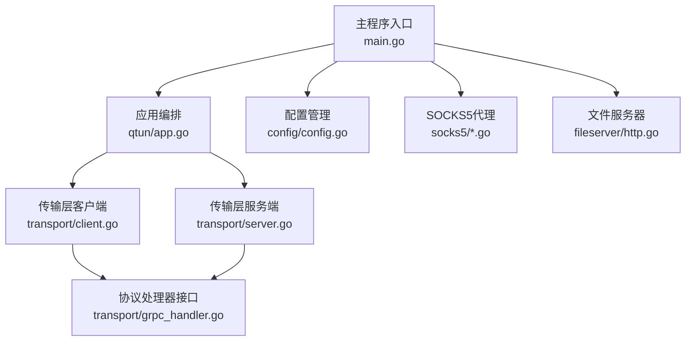
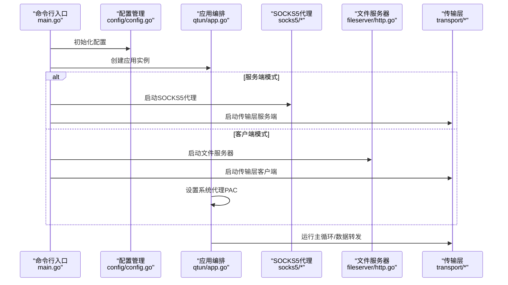
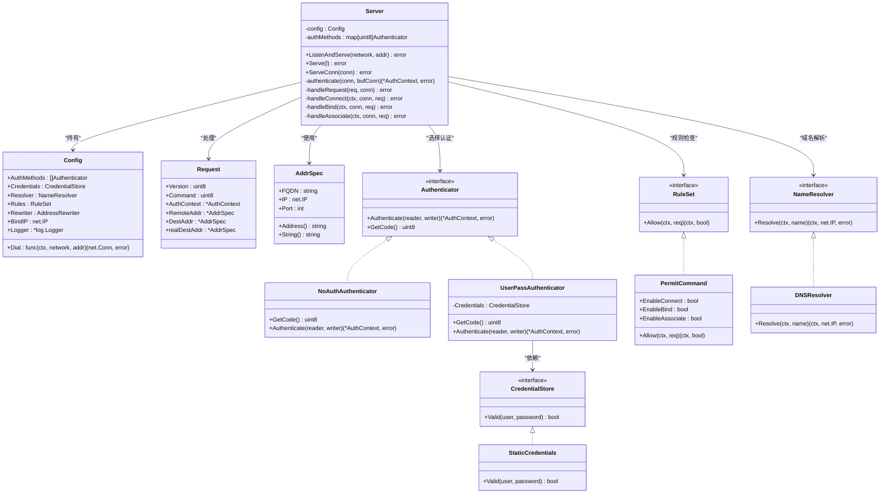
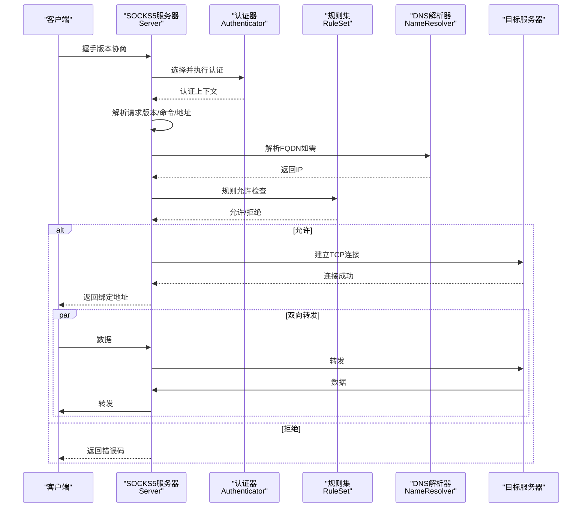
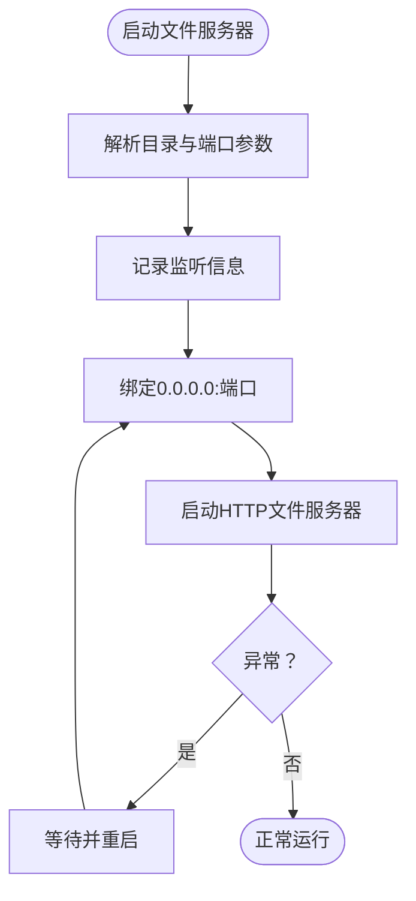
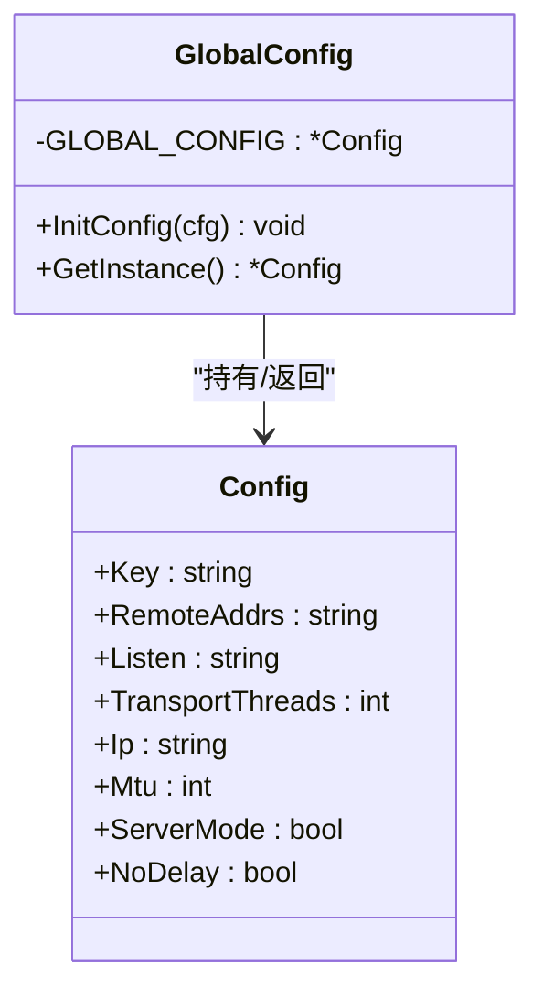
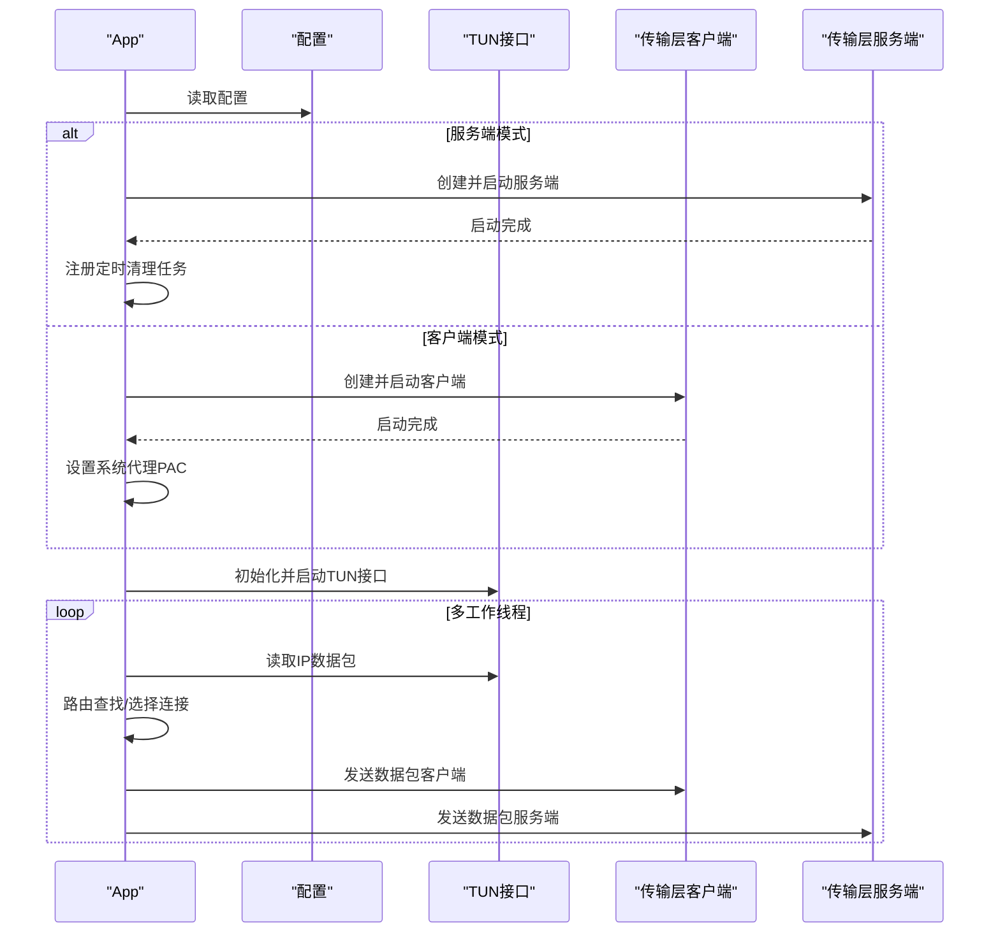
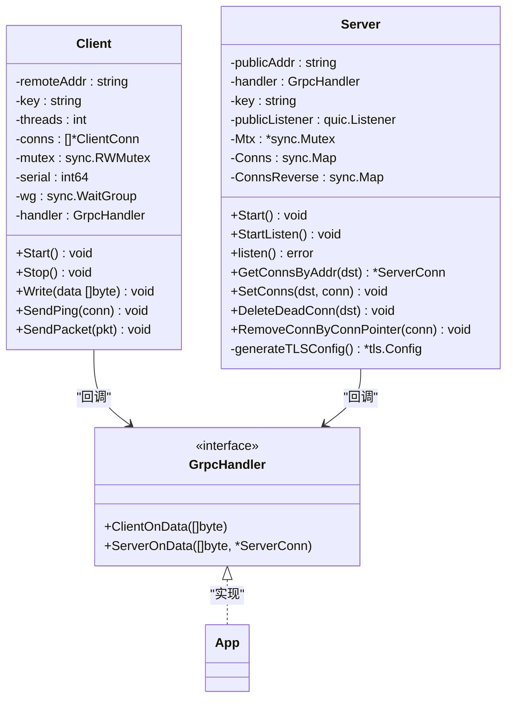
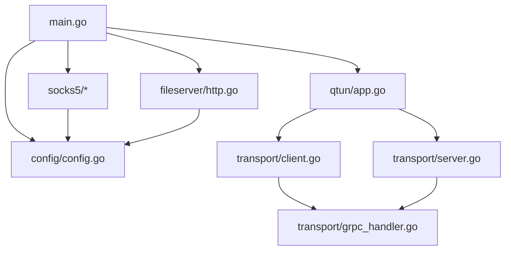

# 服务模块设计

<cite>
**本文档引用的文件**
- [main.go](file://main.go)
- [app.go](file://qtun/app.go)
- [config.go](file://config/config.go)
- [socks5.go](file://socks5/socks5.go)
- [auth.go](file://socks5/auth.go)
- [request.go](file://socks5/request.go)
- [ruleset.go](file://socks5/ruleset.go)
- [resolver.go](file://socks5/resolver.go)
- [init.go](file://socks5/init.go)
- [credentials.go](file://socks5/credentials.go)
- [http.go](file://fileserver/http.go)
- [client.go](file://transport/client.go)
- [server.go](file://transport/server.go)
- [grpc_handler.go](file://transport/grpc_handler.go)
- [README.md](file://README.md)
</cite>

## 目录
1. [简介](#简介)
2. [项目结构](#项目结构)
3. [核心组件](#核心组件)
4. [架构总览](#架构总览)
5. [详细组件分析](#详细组件分析)
6. [依赖关系分析](#依赖关系分析)
7. [性能考虑](#性能考虑)
8. [故障排除指南](#故障排除指南)
9. [结论](#结论)
10. [附录](#附录)

## 简介
本文件面向Qtun服务模块的设计与实现，重点覆盖以下方面：
- SOCKS5代理服务：协议处理、认证机制、访问控制规则、地址解析与重写、连接建立与数据转发。
- 文件服务器（fileserver）：HTTP请求处理、静态资源管理、安全配置。
- 配置管理（config）：配置加载、全局单例、默认值与运行时参数映射。
- 启动流程：命令行参数解析、服务启动顺序、模块间协作。

本设计以模块化为核心，通过清晰的接口与职责分离，确保可扩展性与可维护性。

## 项目结构
项目采用按功能域划分的目录组织方式，主要模块如下：
- 主程序入口与命令行：main.go
- 应用编排与网络栈：qtun/app.go
- 配置管理：config/config.go
- SOCKS5代理：socks5/*.go
- 文件服务器：fileserver/http.go
- 传输层（QUIC/隧道）：transport/*.go
- 协议定义：protocol/*.go（由proto生成）

图表来源
- [main.go](file://main.go#L70-L103)
- [app.go](file://qtun/app.go#L37-L49)
- [config.go](file://config/config.go#L17-L23)
- [socks5.go](file://socks5/socks5.go#L109-L118)
- [http.go](file://fileserver/http.go#L9-L16)
- [client.go](file://transport/client.go#L31-L39)
- [server.go](file://transport/server.go#L37-L46)
- [grpc_handler.go](file://transport/grpc_handler.go#L3-L6)

章节来源
- [main.go](file://main.go#L1-L136)
- [README.md](file://README.md#L1-L99)

## 核心组件
- 配置管理（config）
  - 提供全局单例配置，包含密钥、监听/远端地址、IP段、MTU、线程数、模式与TCP选项等。
  - 初始化通过命令行参数映射到配置实例，供其他模块读取。
- 应用编排（qtun/app.go）
  - 根据配置决定运行模式（服务端/客户端），创建并启动传输层组件。
  - 管理TUN接口、工作线程数量、路由表清理与数据包转发。
  - 在客户端模式下设置系统代理PAC。
- SOCKS5代理（socks5）
  - 实现SOCKS5握手、认证、请求解析、规则检查、目标解析与连接建立。
  - 支持无认证、用户名密码认证、自定义规则集与DNS解析器。
- 文件服务器（fileserver）
  - 基于标准库HTTP服务器提供静态资源服务，默认监听指定端口与目录。
- 传输层（transport）
  - 客户端：多连接并发、心跳保活、数据包封装与发送。
  - 服务端：基于QUIC监听、流式接收/发送、连接管理与路由映射。

章节来源
- [config.go](file://config/config.go#L3-L23)
- [app.go](file://qtun/app.go#L19-L35)
- [socks5.go](file://socks5/socks5.go#L55-L97)
- [http.go](file://fileserver/http.go#L9-L16)
- [client.go](file://transport/client.go#L20-L39)
- [server.go](file://transport/server.go#L23-L46)

## 架构总览
整体架构围绕“命令行入口 → 应用编排 → 传输层 → 业务服务（SOCKS5/文件服务器）”展开。启动流程根据模式选择不同路径，服务端优先启动SOCKS5代理，随后启动传输层；客户端则优先启动文件服务器，再启动传输层并在客户端模式下设置系统代理。

图表来源
- [main.go](file://main.go#L75-L103)
- [config.go](file://config/config.go#L17-L23)
- [app.go](file://qtun/app.go#L37-L49)
- [socks5.go](file://socks5/socks5.go#L109-L118)
- [http.go](file://fileserver/http.go#L9-L16)
- [client.go](file://transport/client.go#L41-L83)
- [server.go](file://transport/server.go#L48-L76)

## 详细组件分析

### SOCKS5代理服务
SOCKS5代理模块实现了完整的SOCKS5协议处理链路，包括版本协商、认证、请求解析、规则校验、目标解析与连接建立。

图表来源
- [socks5.go](file://socks5/socks5.go#L18-L97)
- [request.go](file://socks5/request.go#L68-L82)
- [auth.go](file://socks5/auth.go#L33-L110)
- [ruleset.go](file://socks5/ruleset.go#L8-L41)
- [resolver.go](file://socks5/resolver.go#L9-L23)
- [credentials.go](file://socks5/credentials.go#L3-L17)

图表来源
- [socks5.go](file://socks5/socks5.go#L121-L169)
- [request.go](file://socks5/request.go#L119-L156)
- [auth.go](file://socks5/auth.go#L113-L130)
- [ruleset.go](file://socks5/ruleset.go#L30-L41)
- [resolver.go](file://socks5/resolver.go#L17-L23)

章节来源
- [socks5.go](file://socks5/socks5.go#L1-L170)
- [auth.go](file://socks5/auth.go#L1-L152)
- [request.go](file://socks5/request.go#L1-L365)
- [ruleset.go](file://socks5/ruleset.go#L1-L42)
- [resolver.go](file://socks5/resolver.go#L1-L24)
- [credentials.go](file://socks5/credentials.go#L1-L18)
- [init.go](file://socks5/init.go#L1-L23)

### 文件服务器（HTTP静态资源）
文件服务器基于标准库HTTP服务器，提供静态资源服务，默认监听0.0.0.0:端口并指向指定目录。启动为后台协程，持续监听重启。

图表来源
- [http.go](file://fileserver/http.go#L9-L16)

章节来源
- [http.go](file://fileserver/http.go#L1-L17)

### 配置管理（config）
配置模块提供全局单例配置，初始化时从命令行参数映射而来，后续通过GetInstance读取。字段涵盖加密密钥、监听/远端地址、IP段、MTU、线程数、模式与TCP选项等。

图表来源
- [config.go](file://config/config.go#L3-L23)

章节来源
- [config.go](file://config/config.go#L1-L24)

### 应用编排（qtun/app.go）
应用编排负责根据配置选择运行模式，创建并启动传输层组件，管理TUN接口与数据包处理工作线程，维护路由表并清理无效连接。在客户端模式下设置系统代理PAC。

图表来源
- [app.go](file://qtun/app.go#L37-L97)
- [client.go](file://transport/client.go#L41-L83)
- [server.go](file://transport/server.go#L48-L76)

章节来源
- [app.go](file://qtun/app.go#L1-L271)

### 传输层（transport）
传输层分为客户端与服务端两部分，均通过统一的GrpcHandler接口与上层应用交互。

- 客户端（client.go）
  - 多连接并发：根据线程数创建多个连接，轮询发送数据。
  - 心跳保活：周期性发送Ping消息，维持连接活跃。
  - 数据包封装：将TUN数据包封装为协议消息并发送。
- 服务端（server.go）
  - QUIC监听：基于QUIC协议监听公共地址，接受新连接并建立流。
  - 连接管理：使用并发安全的map维护连接与反向映射，支持删除死连接。
  - TLS配置：自动生成证书与密钥，配置协议参数提升性能。

图表来源
- [grpc_handler.go](file://transport/grpc_handler.go#L3-L6)
- [client.go](file://transport/client.go#L20-L223)
- [server.go](file://transport/server.go#L23-L219)
- [app.go](file://qtun/app.go#L169-L248)

章节来源
- [client.go](file://transport/client.go#L1-L223)
- [server.go](file://transport/server.go#L1-L219)
- [grpc_handler.go](file://transport/grpc_handler.go#L1-L7)

## 依赖关系分析
模块间的耦合度低，通过接口与配置进行解耦：
- main.go 仅负责参数解析与模块启动，不直接操作业务细节。
- config 提供全局配置，被所有模块读取。
- qtun/app.go 作为编排中心，向上提供统一接口，向下协调传输层与系统服务。
- socks5 与 fileserver 作为独立服务模块，可通过配置开关启用。
- transport 层通过 GrpcHandler 与应用层解耦，便于替换或扩展。

图表来源
- [main.go](file://main.go#L75-L103)
- [config.go](file://config/config.go#L17-L23)
- [app.go](file://qtun/app.go#L37-L49)
- [client.go](file://transport/client.go#L41-L83)
- [server.go](file://transport/server.go#L48-L76)
- [grpc_handler.go](file://transport/grpc_handler.go#L3-L6)
- [socks5.go](file://socks5/socks5.go#L109-L118)
- [http.go](file://fileserver/http.go#L9-L16)

章节来源
- [main.go](file://main.go#L1-L136)
- [config.go](file://config/config.go#L1-L24)
- [app.go](file://qtun/app.go#L1-L271)
- [client.go](file://transport/client.go#L1-L223)
- [server.go](file://transport/server.go#L1-L219)
- [grpc_handler.go](file://transport/grpc_handler.go#L1-L7)
- [socks5.go](file://socks5/socks5.go#L1-L170)
- [http.go](file://fileserver/http.go#L1-L17)

## 性能考虑
- 并发与工作线程
  - TUN数据包处理采用多工作线程，线程数为CPU核数的2倍，范围限制在4-32之间，平衡I/O并行与系统负载。
- 连接池与负载均衡
  - 客户端多连接轮询发送，避免单点瓶颈；服务端使用并发安全map管理连接，快速查找与删除。
- 协议与网络优化
  - 服务端使用QUIC监听，配置较大的流窗口与连接窗口，启用保活与datagram能力，提升吞吐与稳定性。
- 内存与序列化
  - 传输层对协议消息使用对象池复用，减少GC压力与内存分配。
- 日志与可观测性
  - 使用轻量日志库输出关键事件，便于问题定位与性能分析。

章节来源
- [app.go](file://qtun/app.go#L72-L97)
- [client.go](file://transport/client.go#L114-L132)
- [server.go](file://transport/server.go#L97-L103)
- [client.go](file://transport/client.go#L184-L206)

## 故障排除指南
- SOCKS5认证失败
  - 检查是否正确配置用户名/密码认证与凭证存储；确认认证方法列表与客户端支持一致。
- 目标解析失败
  - 若目标为FQDN，确认DNS解析器可用；检查网络连通性与防火墙策略。
- 规则拦截
  - 默认规则允许所有命令；若使用自定义规则集，请检查规则配置与命令类型。
- 传输层连接异常
  - 客户端多次重试后仍无法连接，检查远端地址、密钥与网络连通性；服务端监听异常时查看重启日志。
- 文件服务器无法访问
  - 确认监听端口未被占用，目录存在且具备读权限；浏览器访问PAC地址验证代理配置。
- 系统代理设置失败
  - 当前仅在macOS上自动设置PAC；Linux/Windows需手动配置系统代理。

章节来源
- [auth.go](file://socks5/auth.go#L18-L20)
- [request.go](file://socks5/request.go#L122-L134)
- [ruleset.go](file://socks5/ruleset.go#L12-L20)
- [client.go](file://transport/client.go#L50-L68)
- [server.go](file://transport/server.go#L105-L112)
- [http.go](file://fileserver/http.go#L9-L16)
- [app.go](file://qtun/app.go#L250-L270)

## 结论
本设计通过清晰的模块边界与接口抽象，实现了高内聚、低耦合的服务架构。SOCKS5代理与文件服务器作为可选服务，配合传输层的高性能实现，满足跨平台、可扩展的隧道代理需求。配置管理与启动流程简洁明确，便于部署与运维。

## 附录

### 启动流程与参数说明
- 服务端启动
  - 启动SOCKS5代理（默认端口）、传输层服务端，随后进入主循环。
- 客户端启动
  - 启动文件服务器（默认端口与目录），启动传输层客户端，并尝试设置系统代理PAC。
- 关键参数
  - 密钥、监听/远端地址、IP段、MTU、线程数、模式、TCP选项、SOCKS5端口、文件服务器端口与目录等。

章节来源
- [main.go](file://main.go#L75-L103)
- [README.md](file://README.md#L51-L88)