# 配置管理服务

<cite>
**本文档引用的文件**
- [config.go](file://config/config.go)
- [main.go](file://main.go)
- [app.go](file://qtun/app.go)
- [log.go](file://utils/log/log.go)
- [http.go](file://fileserver/http.go)
- [README.md](file://README.md)
- [go.mod](file://go.mod)
</cite>

## 目录
1. [简介](#简介)
2. [项目结构](#项目结构)
3. [核心组件](#核心组件)
4. [架构概览](#架构概览)
5. [详细组件分析](#详细组件分析)
6. [依赖关系分析](#依赖关系分析)
7. [性能考虑](#性能考虑)
8. [故障排除指南](#故障排除指南)
9. [结论](#结论)
10. [附录](#附录)

## 简介

Qtun是一个基于QUIC协议的安全隧道服务，提供了完整的配置管理机制。本文档深入分析了全局配置管理模块的设计架构和实现原理，包括配置结构定义、加载机制、验证规则和动态更新功能。

配置管理服务采用单例模式设计，通过命令行参数驱动配置初始化，支持运行时访问和使用。系统提供了丰富的配置选项，涵盖网络设置、认证配置、日志级别和性能参数等各个方面。

## 项目结构

Qtun项目采用模块化设计，配置管理相关的核心文件分布如下：

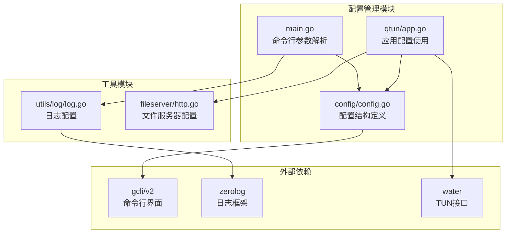

**图表来源**
- [config.go](file://config/config.go#L1-L24)
- [main.go](file://main.go#L1-L136)
- [app.go](file://qtun/app.go#L1-L271)

**章节来源**
- [config.go](file://config/config.go#L1-L24)
- [main.go](file://main.go#L1-L136)
- [README.md](file://README.md#L1-L99)

## 核心组件

### 配置结构定义

配置管理服务的核心是Config结构体，定义了所有可配置的参数：

| 配置项 | 类型 | 默认值 | 描述 |
|--------|------|--------|------|
| Key | string | "hello-world" | 加密密钥 |
| RemoteAddrs | string | "0.0.0.0:8080" | 远程服务器地址（客户端） |
| Listen | string | "0.0.0.0:8080" | 本地监听地址（服务器） |
| TransportThreads | int | 1 | 传输线程数 |
| Ip | string | "10.237.0.1/16" | VPN虚拟IP地址段 |
| Mtu | int | 1500 | 最大传输单元 |
| ServerMode | bool | false | 服务器模式开关 |
| NoDelay | bool | false | TCP无延迟模式 |

### 配置初始化流程

配置管理采用单例模式，通过InitConfig函数进行初始化：

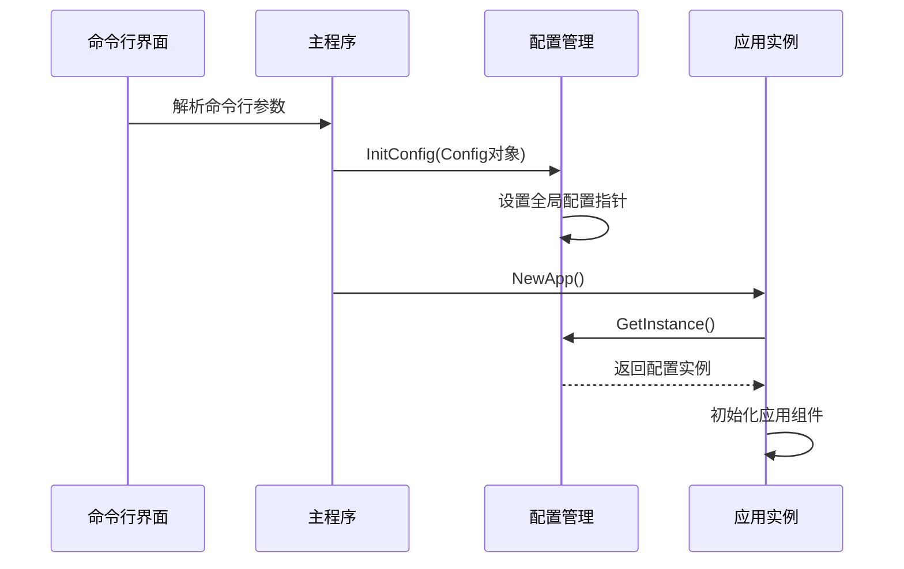

**图表来源**
- [main.go](file://main.go#L75-L84)
- [config.go](file://config/config.go#L17-L23)

**章节来源**
- [config.go](file://config/config.go#L3-L13)
- [main.go](file://main.go#L75-L84)

## 架构概览

### 配置生命周期

配置管理服务遵循严格的生命周期管理：

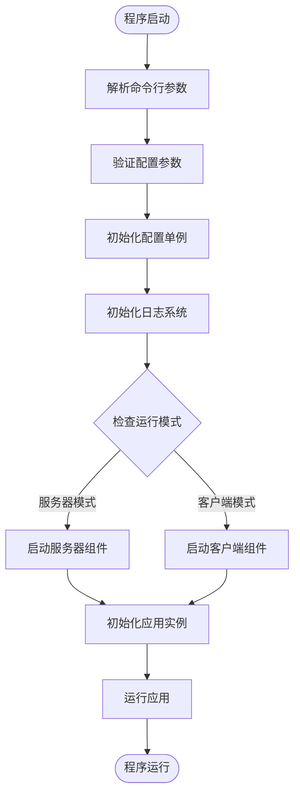

**图表来源**
- [main.go](file://main.go#L71-L103)
- [config.go](file://config/config.go#L17-L23)

### 配置使用模式

应用层通过单例模式访问配置：

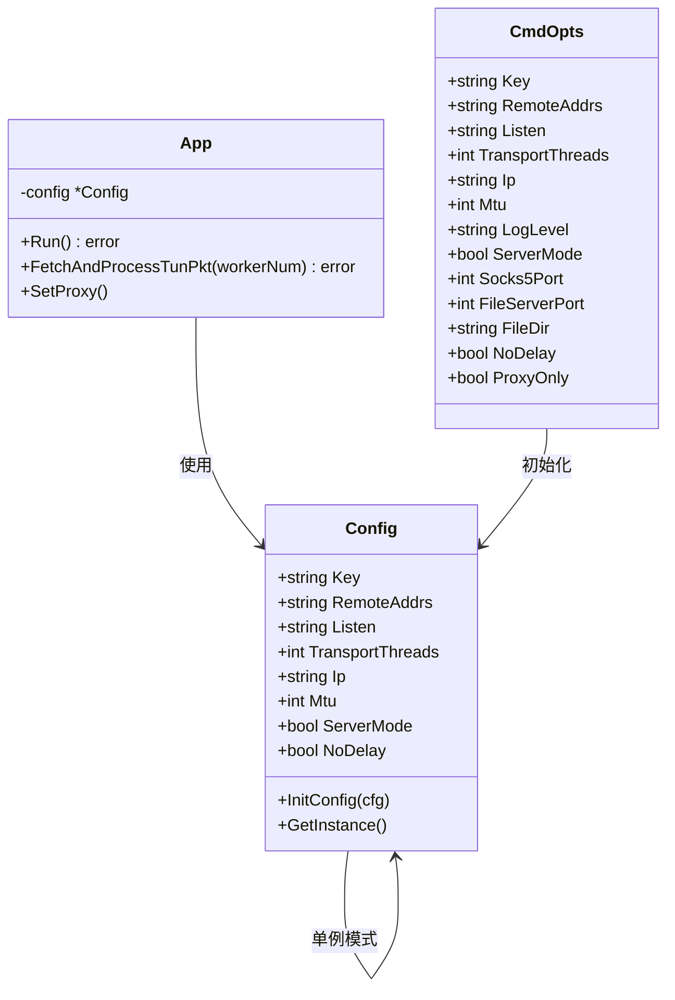

**图表来源**
- [config.go](file://config/config.go#L3-L23)
- [app.go](file://qtun/app.go#L19-L35)
- [main.go](file://main.go#L22-L36)

**章节来源**
- [app.go](file://qtun/app.go#L19-L35)
- [config.go](file://config/config.go#L15-L23)

## 详细组件分析

### 命令行参数处理

系统使用gcli/v2库处理命令行参数，提供了完整的参数定义和默认值设置：

#### 参数定义结构

| 参数名称 | 类型 | 默认值 | 描述 | 必需性 |
|----------|------|--------|------|--------|
| key | string | "hello-world" | 加密密钥 | 否 |
| remote_addrs | string | "2.2.2.2:8080" | 远程服务器地址 | 客户端必需 |
| listen | string | "0.0.0.0:8080" | 服务器监听地址 | 服务器必需 |
| transport_threads | int | 1 | 传输线程数 | 否 |
| ip | string | "10.237.0.1/16" | VPN虚拟IP地址段 | 否 |
| mtu | int | 1500 | 最大传输单元 | 否 |
| log_level | string | "info" | 日志级别 | 否 |
| server_mode | bool | false | 服务器模式 | 否 |
| socks5_port | int | 2080 | SOCKS5端口 | 否 |
| file_svr_port | int | 6061 | 文件服务器端口 | 否 |
| file_dir | string | "../static" | 文件服务器目录 | 否 |
| nodelay | bool | false | TCP无延迟模式 | 否 |
| proxyonly | bool | false | 仅启用代理 | 否 |

#### 参数优先级顺序

配置参数的优先级从高到低排列：

1. **命令行参数** - 最高优先级，直接覆盖默认值
2. **环境变量** - 当前实现未支持环境变量
3. **配置文件** - 当前实现未支持配置文件
4. **默认值** - 最低优先级，系统内置默认值

**章节来源**
- [main.go](file://main.go#L53-L66)
- [README.md](file://README.md#L62-L88)

### 配置验证机制

当前实现的验证机制相对简单，主要依赖于基本的数据类型检查：

#### 数据类型验证

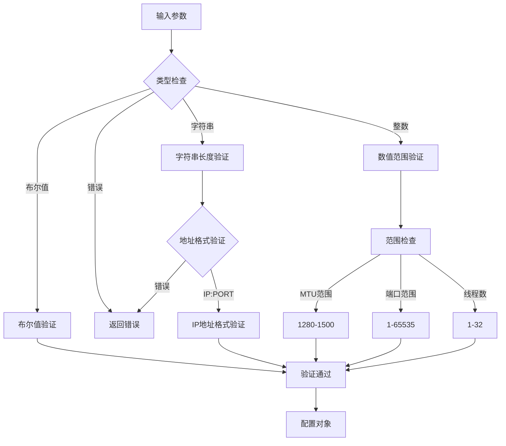

**图表来源**
- [main.go](file://main.go#L75-L84)
- [config.go](file://config/config.go#L3-L13)

#### 依赖关系处理

配置项之间的依赖关系通过条件逻辑处理：

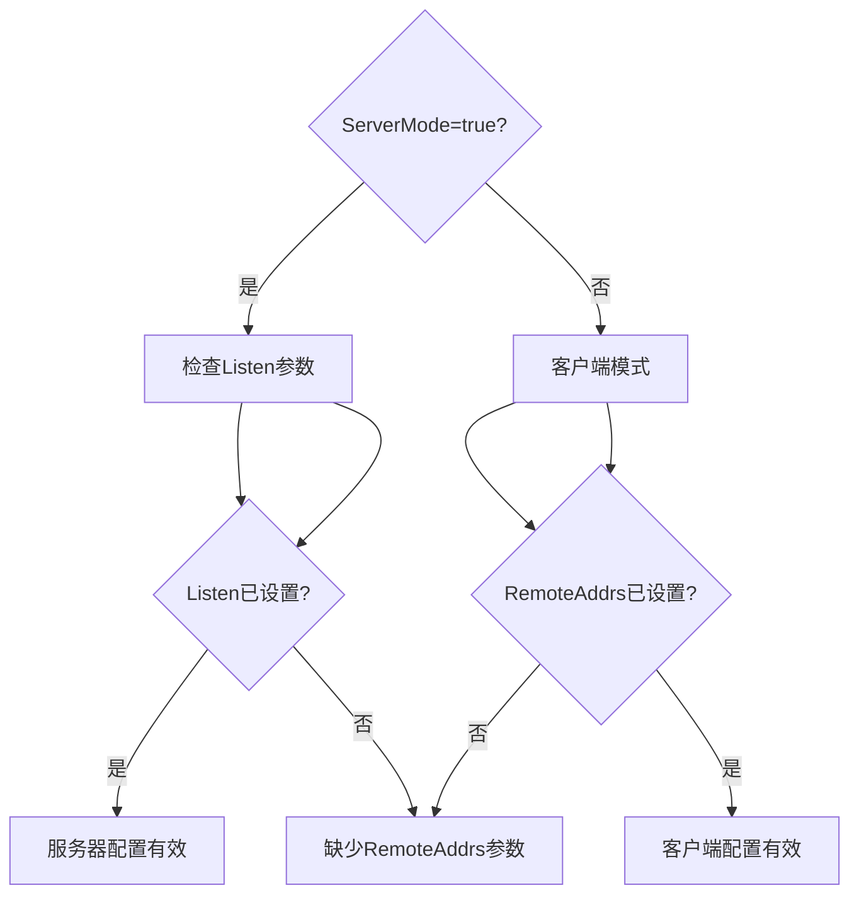

**图表来源**
- [main.go](file://main.go#L95-L99)
- [app.go](file://qtun/app.go#L37-L48)

**章节来源**
- [main.go](file://main.go#L95-L99)
- [app.go](file://qtun/app.go#L37-L48)

### 日志配置系统

日志系统与配置管理紧密集成，支持运行时的日志级别调整：

#### 日志级别配置

| 级别 | 描述 | 使用场景 |
|------|------|----------|
| debug | 调试信息 | 开发调试、问题诊断 |
| info | 一般信息 | 正常运行状态 |
| warn | 警告信息 | 可能的问题 |
| error | 错误信息 | 异常情况 |
| fatal | 致命错误 | 系统崩溃 |

#### 日志初始化流程

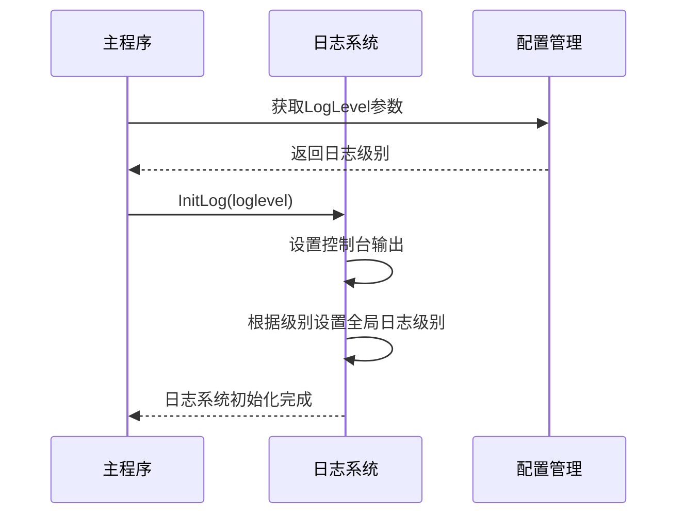

**图表来源**
- [main.go](file://main.go#L86)
- [log.go](file://utils/log/log.go#L10-L25)

**章节来源**
- [log.go](file://utils/log/log.go#L10-L25)
- [main.go](file://main.go#L86)

### 性能参数配置

系统提供了多个性能相关的配置参数：

#### 线程池配置

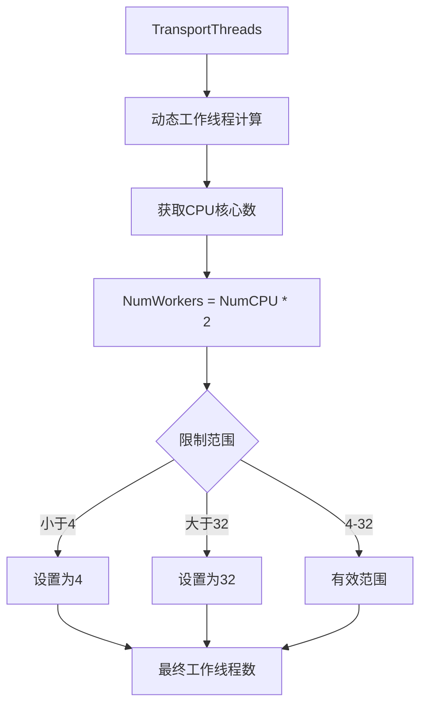

**图表来源**
- [app.go](file://qtun/app.go#L79-L87)

#### 网络参数优化

| 参数 | 默认值 | 优化建议 | 影响范围 |
|------|--------|----------|----------|
| MTU | 1500 | 1280-1500 | 网络性能 |
| TransportThreads | 1 | CPU核心数×2 | 并发处理能力 |
| NoDelay | false | 根据网络状况调整 | 延迟性能 |

**章节来源**
- [app.go](file://qtun/app.go#L79-L87)
- [config.go](file://config/config.go#L7-L8)

## 依赖关系分析

### 外部依赖关系

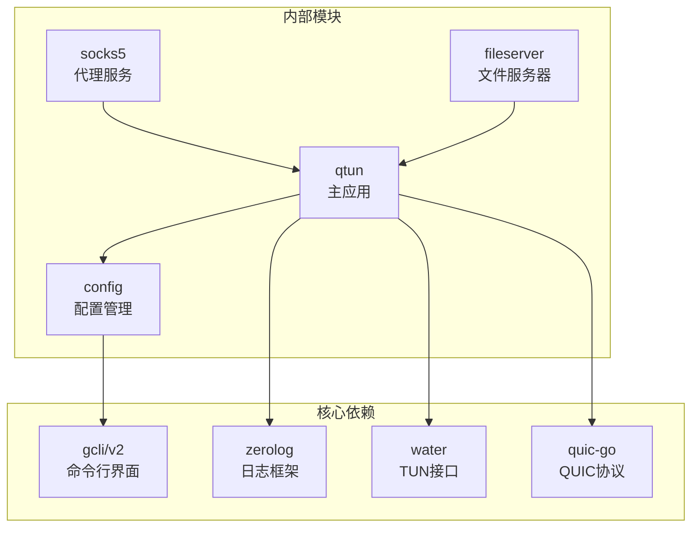

**图表来源**
- [go.mod](file://go.mod#L5-L14)
- [main.go](file://main.go#L15-L20)

### 内部模块依赖

配置管理模块与其他模块的交互关系：

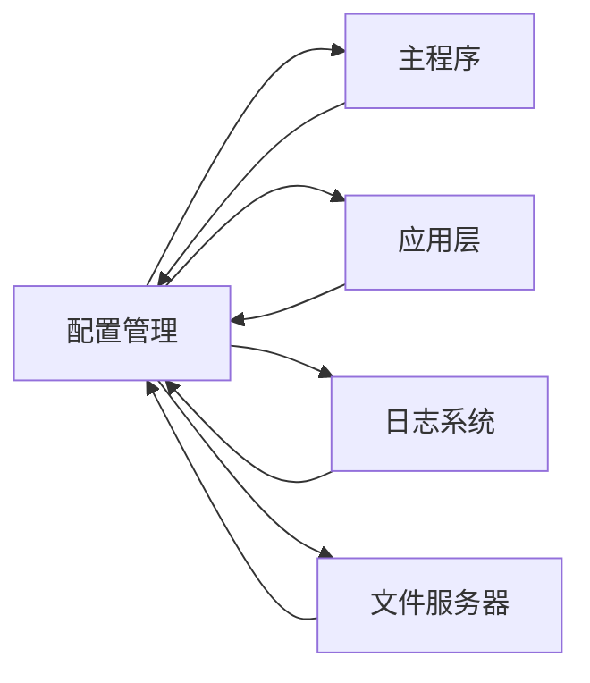

**图表来源**
- [config.go](file://config/config.go#L17-L23)
- [main.go](file://main.go#L75-L84)
- [app.go](file://qtun/app.go#L30-L31)

**章节来源**
- [go.mod](file://go.mod#L5-L14)
- [config.go](file://config/config.go#L17-L23)

## 性能考虑

### 配置对性能的影响

配置参数对系统性能的影响程度：

#### 关键性能参数

| 参数 | 影响程度 | 调优建议 | 风险评估 |
|------|----------|----------|----------|
| TransportThreads | 高 | 与CPU核心数匹配 | 过高可能导致资源竞争 |
| MTU | 中 | 根据网络环境调整 | 过小影响吞吐量 |
| NoDelay | 低 | 网络拥塞时关闭 | 可能增加网络开销 |
| ServerMode | 无直接影响 | 根据部署需求选择 | 无性能风险 |

#### 动态调整策略

系统支持在运行时调整部分配置参数，但需要重启应用才能生效：

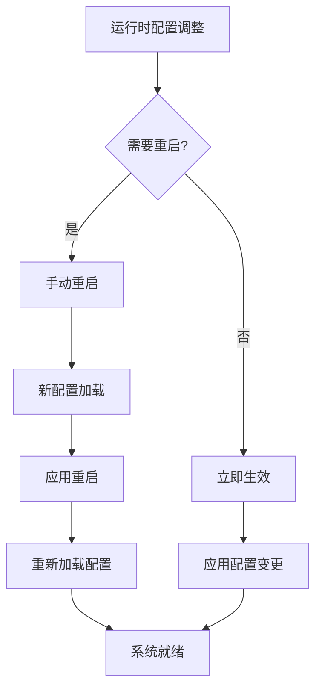

## 故障排除指南

### 常见配置问题

#### 端口冲突问题

**症状**: 应用启动失败，显示端口占用错误

**解决方案**:
1. 检查Listen或Socks5端口是否被占用
2. 修改端口配置避免冲突
3. 使用netstat命令检查端口使用情况

#### 网络配置问题

**症状**: 客户端无法连接服务器

**解决方案**:
1. 验证RemoteAddrs格式是否正确
2. 检查防火墙设置
3. 确认服务器端Listen配置正确

#### 权限问题

**症状**: TUN接口创建失败

**解决方案**:
1. 确保以root权限运行
2. 检查系统对TUN设备的支持
3. 验证用户权限配置

### 配置验证错误

#### 参数类型错误

**错误类型**: 命令行参数类型不匹配

**解决方法**:
1. 检查参数值的数据类型
2. 确保数值参数在有效范围内
3. 验证IP地址和端口格式

#### 配置冲突

**错误类型**: 配置项之间存在冲突

**解决方法**:
1. 检查ServerMode与必要参数的关系
2. 确保客户端和服务器模式的参数正确配置
3. 验证网络参数的兼容性

**章节来源**
- [main.go](file://main.go#L71-L103)
- [app.go](file://qtun/app.go#L72-L97)

## 结论

Qtun的配置管理服务设计简洁而实用，采用了单例模式确保配置的一致性和可靠性。系统提供了完整的命令行参数支持，涵盖了网络、认证、日志和性能等关键配置领域。

当前实现的主要特点：
- **简单可靠**: 采用单例模式，配置访问简单直接
- **参数丰富**: 提供了全面的配置选项满足不同使用场景
- **易于扩展**: 清晰的架构为未来的配置文件和环境变量支持奠定了基础

未来改进建议：
- 添加配置文件支持
- 实现环境变量配置
- 增强配置验证机制
- 支持配置热更新功能

## 附录

### 配置最佳实践

#### 服务器配置示例

```bash
# 基础服务器配置
./qtun qt --key "secure-key" \
         --listen "0.0.0.0:8080" \
         --ip "10.4.4.2/24" \
         --server_mode \
         --transport_threads 8

# 高性能服务器配置
./qtun qt --key "production-key" \
         --listen "0.0.0.0:8080" \
         --ip "10.4.4.0/24" \
         --server_mode \
         --transport_threads 16 \
         --mtu 1500 \
         --nodelay
```

#### 客户端配置示例

```bash
# 基础客户端配置
./qtun qt --key "secure-key" \
         --remote_addrs "server-ip:8080" \
         --ip "10.4.4.3/24"

# 高并发客户端配置
./qtun qt --key "client-key" \
         --remote_addrs "server-ip:8080" \
         --ip "10.4.4.4/24" \
         --transport_threads 4 \
         --mtu 1500
```

#### 日志配置建议

```bash
# 开发调试模式
./qtun qt --log_level debug

# 生产环境模式
./qtun qt --log_level info
```

### 配置迁移指南

当从旧版本升级时需要注意的配置变化：

1. **参数名称变更**: 检查是否有参数名称的更改
2. **默认值调整**: 注意默认值的变化可能影响行为
3. **弃用参数**: 移除不再支持的配置项
4. **新增参数**: 利用新的配置选项优化性能

**章节来源**
- [README.md](file://README.md#L13-L26)
- [README.md](file://README.md#L85-L88)