# Qtun应用层

<cite>
**本文档引用的文件**
- [main.go](file://main.go)
- [app.go](file://qtun/app.go)
- [config.go](file://config/config.go)
- [server.go](file://transport/server.go)
- [client.go](file://transport/client.go)
- [server_conn.go](file://transport/server_conn.go)
- [client_conn.go](file://transport/client_conn.go)
- [grpc_handler.go](file://transport/grpc_handler.go)
- [iface.go](file://iface/iface.go)
- [timer.go](file://utils/timer/timer.go)
- [log.go](file://utils/log/log.go)
- [socks5.go](file://socks5/socks5.go)
- [README.md](file://README.md)
</cite>

## 目录
1. [简介](#简介)
2. [项目结构](#项目结构)
3. [核心组件](#核心组件)
4. [架构概览](#架构概览)
5. [详细组件分析](#详细组件分析)
6. [依赖关系分析](#依赖关系分析)
7. [性能考虑](#性能考虑)
8. [故障排除指南](#故障排除指南)
9. [结论](#结论)

## 简介

Qtun是一个基于QUIC协议的安全隧道应用，支持多IP管道传输。该应用通过TUN接口实现虚拟网络功能，结合加密传输和智能路由管理，为用户提供安全的网络访问能力。应用层作为整个系统的协调中心，负责管理应用生命周期、配置加载、系统代理设置、路由表管理以及TUN接口的启动和数据包处理。

## 项目结构

Qtun项目采用模块化设计，主要包含以下核心模块：

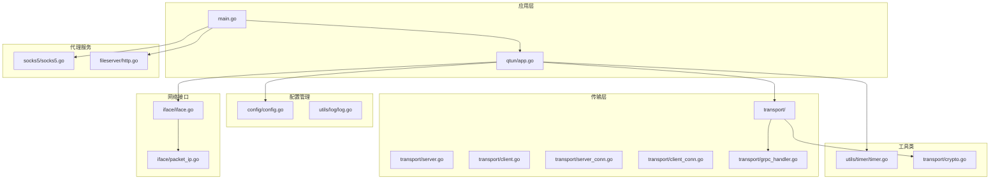

**图表来源**
- [main.go](file://main.go#L1-L136)
- [app.go](file://qtun/app.go#L1-L271)
- [config.go](file://config/config.go#L1-L24)

**章节来源**
- [main.go](file://main.go#L1-L136)
- [README.md](file://README.md#L1-L99)

## 核心组件

### 应用结构体设计

App结构体是Qtun应用的核心协调器，承担着以下关键职责：

```mermaid
classDiagram
class App {
-config *Config
-client *Client
-routes map[string]map[string]struct{}
-mutex RWMutex
-server *Server
-iface *Iface
-tm Timer
+NewApp() *App
+Run() error
+StartFetchTunInterface() error
+FetchAndProcessTunPkt(workerNum int) error
+ServerOnData(buf []byte, conn *ServerConn)
+ClientOnData(buf []byte)
+CleanRoute()
+SetProxy()
}
class Config {
+Key string
+RemoteAddrs string
+Listen string
+TransportThreads int
+Ip string
+Mtu int
+ServerMode bool
+NoDelay bool
}
class GrpcHandler {
<<interface>>
+ClientOnData([]byte)
+ServerOnData([]byte, *ServerConn)
}
App --> Config : "使用"
App --> GrpcHandler : "实现"
App --> Client : "管理"
App --> Server : "管理"
App --> Iface : "管理"
```

**图表来源**
- [app.go](file://qtun/app.go#L19-L35)
- [config.go](file://config/config.go#L3-L13)
- [grpc_handler.go](file://transport/grpc_handler.go#L3-L6)

### 配置管理系统

配置系统采用单例模式，确保全局配置的一致性和可访问性：

- **配置项管理**：集中管理所有运行时配置参数
- **全局访问**：通过GetInstance()提供全局访问点
- **类型安全**：强类型定义确保配置参数的正确性

**章节来源**
- [config.go](file://config/config.go#L1-L24)
- [app.go](file://qtun/app.go#L29-L35)

## 架构概览

Qtun采用分层架构设计，各层职责明确，耦合度低：

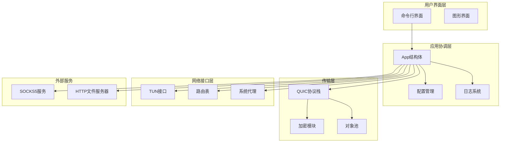

**图表来源**
- [main.go](file://main.go#L75-L102)
- [app.go](file://qtun/app.go#L37-L49)

## 详细组件分析

### 应用生命周期管理

#### 启动流程控制

应用的启动流程根据运行模式分为不同的路径：

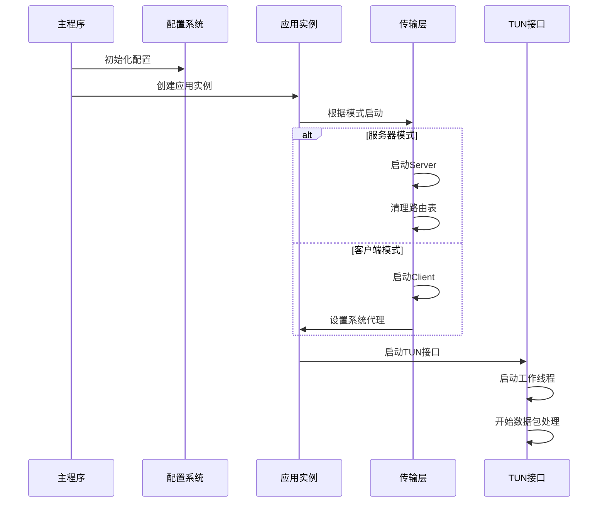

**图表来源**
- [main.go](file://main.go#L75-L102)
- [app.go](file://qtun/app.go#L37-L49)

#### Run方法执行流程

Run方法是应用启动的核心入口，实现了完整的生命周期管理：

**章节来源**
- [app.go](file://qtun/app.go#L37-L49)

### 配置加载机制

#### 配置初始化流程

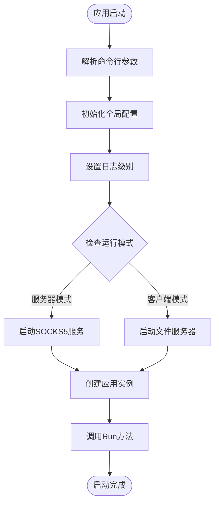

**图表来源**
- [main.go](file://main.go#L75-L102)
- [config.go](file://config/config.go#L17-L23)

**章节来源**
- [main.go](file://main.go#L75-L86)
- [config.go](file://config/config.go#L17-L23)

### 系统代理设置

#### 自动代理配置

应用支持自动代理配置，通过修改系统网络设置实现流量转发：

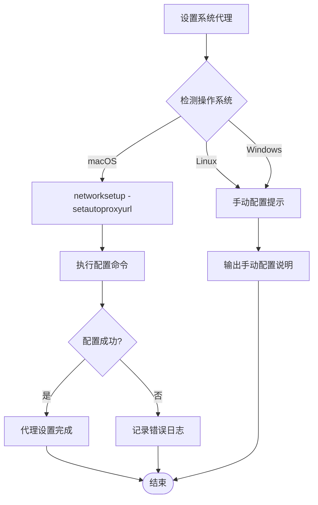

**图表来源**
- [app.go](file://qtun/app.go#L250-L270)

**章节来源**
- [app.go](file://qtun/app.go#L250-L270)

### 路由表管理机制

#### 路由表初始化与维护

路由表是服务器模式下的核心组件，负责管理客户端连接到目标IP的映射关系：

```mermaid
classDiagram
class RouteManager {
+routes map[string]map[string]struct{}
+mutex RWMutex
+CleanRoute()
+AddRoute(dst string, connAddr string)
+RemoveRoute(dst string, connAddr string)
+GetConnections(dst string) []string
}
class Timer {
+RegisterTask(fn func(), interval time.Duration)
+Start()
+Stop()
}
RouteManager --> Timer : "定时清理"
note for RouteManager "键 : 目标IP<br/>值 : 连接地址集合"
note for Timer "每分钟清理一次<br/>移除失效连接"
```

**图表来源**
- [app.go](file://qtun/app.go#L51-L70)
- [timer.go](file://utils/timer/timer.go#L21-L47)

#### 路由表更新策略

路由表的更新遵循以下策略：

1. **动态添加**：当收到客户端的Ping消息时，自动添加路由条目
2. **连接验证**：定期检查连接状态，移除失效连接
3. **负载均衡**：同一目标IP的多个连接中随机选择
4. **并发安全**：使用读写锁保证线程安全

**章节来源**
- [app.go](file://qtun/app.go#L51-L70)
- [app.go](file://qtun/app.go#L169-L207)

### TUN接口启动流程

#### 接口初始化过程

TUN接口的启动涉及多个步骤，确保网络接口的正确配置：

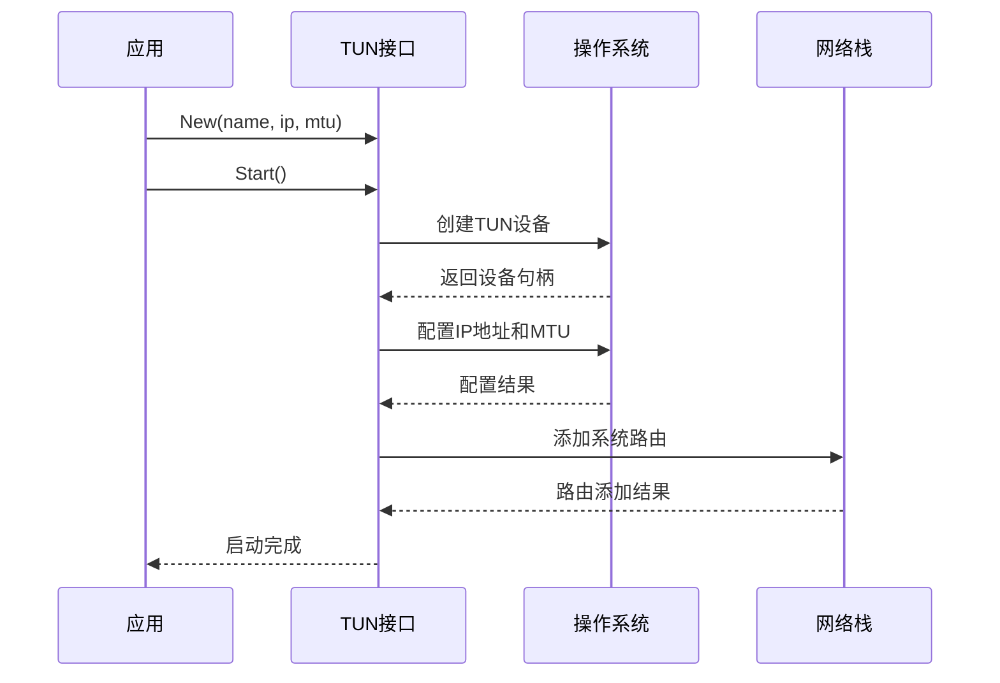

**图表来源**
- [iface.go](file://iface/iface.go#L31-L74)

#### 多工作线程数据包处理

应用采用多工作线程模型处理TUN数据包，提高并发性能：

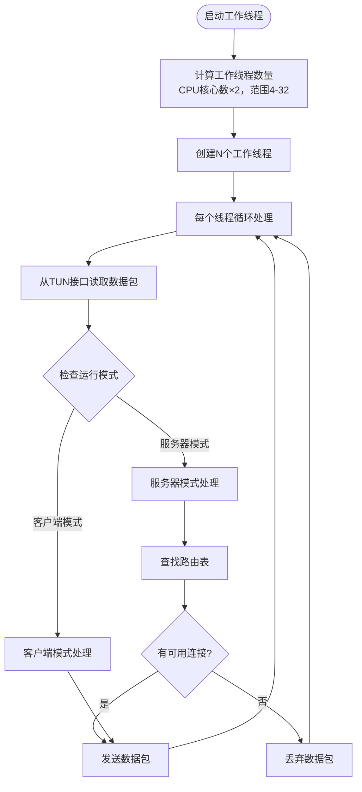

**图表来源**
- [app.go](file://qtun/app.go#L72-L97)
- [app.go](file://qtun/app.go#L99-L167)

**章节来源**
- [app.go](file://qtun/app.go#L72-L97)
- [app.go](file://qtun/app.go#L99-L167)

### 传输层集成

#### 服务器模式处理逻辑

在服务器模式下，应用负责管理多个客户端连接并进行数据包转发：

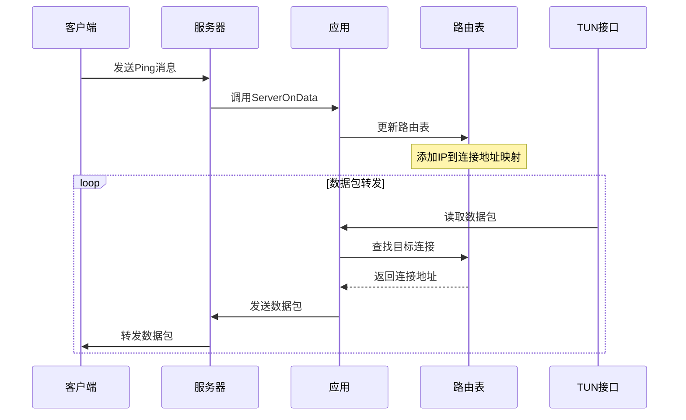

**图表来源**
- [app.go](file://qtun/app.go#L169-L207)
- [server.go](file://transport/server.go#L192-L210)

#### 客户端模式处理逻辑

在客户端模式下，应用负责建立连接并将数据包转发到服务器：

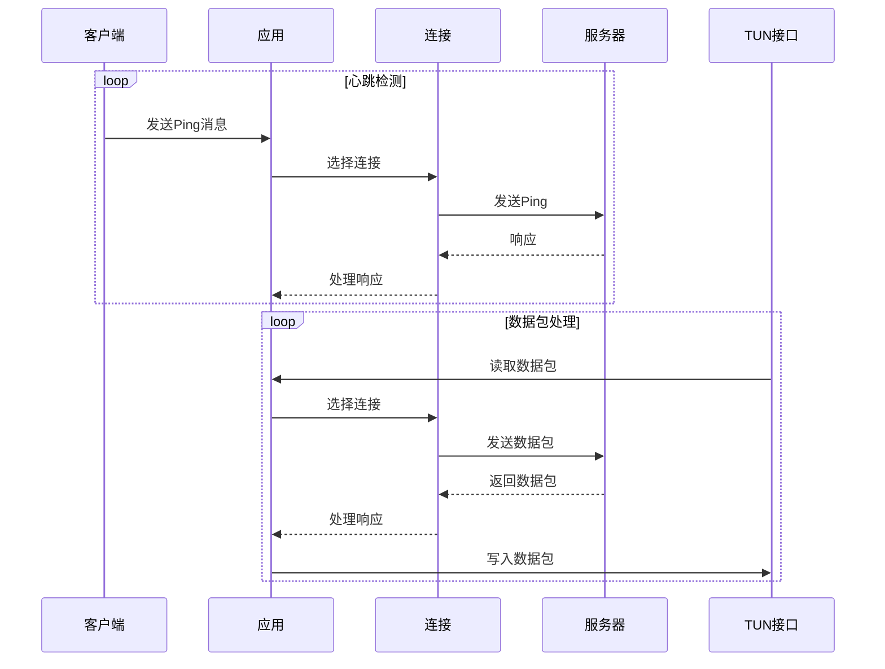

**图表来源**
- [app.go](file://qtun/app.go#L209-L248)
- [client.go](file://transport/client.go#L142-L206)

**章节来源**
- [app.go](file://qtun/app.go#L169-L248)
- [server.go](file://transport/server.go#L192-L210)
- [client.go](file://transport/client.go#L142-L206)

## 依赖关系分析

### 组件依赖图

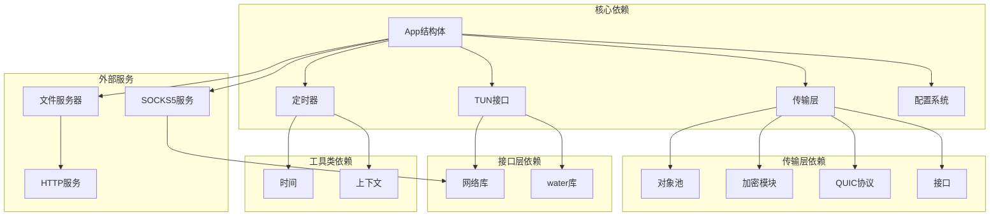

**图表来源**
- [app.go](file://qtun/app.go#L3-L17)
- [server.go](file://transport/server.go#L3-L21)
- [client.go](file://transport/client.go#L3-L18)

### 错误处理策略

应用采用多层次的错误处理机制：

1. **配置阶段**：参数验证和默认值设置
2. **运行阶段**：异常捕获和优雅降级
3. **网络阶段**：连接重试和超时处理
4. **系统阶段**：权限检查和资源清理

**章节来源**
- [app.go](file://qtun/app.go#L104-L107)
- [server_conn.go](file://transport/server_conn.go#L58-L74)
- [client_conn.go](file://transport/client_conn.go#L130-L151)

## 性能考虑

### 并发优化策略

应用采用了多种并发优化技术：

1. **工作线程池**：根据CPU核心数动态调整工作线程数量（4-32个）
2. **读写锁**：路由表使用RWMutex实现高并发读取
3. **对象池**：复用protobuf消息和nonce对象
4. **缓冲区优化**：读写缓冲区大小优化到64KB

### 网络性能优化

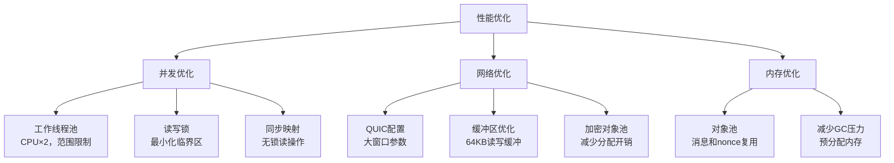

**图表来源**
- [app.go](file://qtun/app.go#L79-L87)
- [server.go](file://transport/server.go#L97-L103)
- [client_conn.go](file://transport/client_conn.go#L327-L332)

## 故障排除指南

### 常见问题诊断

#### TUN接口启动失败

**可能原因**：
- 权限不足（需要root权限）
- TUN设备已被占用
- 网络配置冲突

**解决方法**：
1. 确保以root权限运行
2. 检查TUN设备状态
3. 验证IP地址配置

#### 连接建立失败

**可能原因**：
- 服务器地址不可达
- 网络防火墙阻拦
- 加密密钥不匹配

**解决方法**：
1. 测试网络连通性
2. 检查防火墙规则
3. 验证密钥配置

#### 日志记录最佳实践

应用使用zerolog进行结构化日志记录：

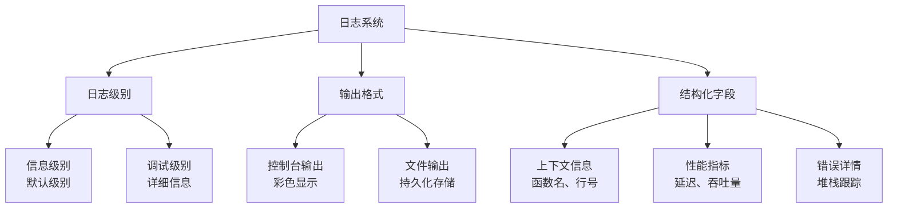

**图表来源**
- [log.go](file://utils/log/log.go#L10-L25)

**章节来源**
- [log.go](file://utils/log/log.go#L10-L25)

### 错误处理模式

应用采用统一的错误处理模式：

1. **参数验证**：启动前验证所有必需参数
2. **异常捕获**：使用defer和recover处理panic
3. **优雅降级**：在网络异常时保持基本功能
4. **资源清理**：确保所有资源得到正确释放

## 结论

Qtun应用层展现了优秀的软件架构设计，通过清晰的职责分离、高效的并发处理和完善的错误管理，构建了一个稳定可靠的网络隧道解决方案。其核心特点包括：

1. **模块化设计**：各组件职责明确，耦合度低
2. **高性能并发**：多工作线程和优化的同步机制
3. **灵活配置**：支持多种运行模式和参数配置
4. **健壮性保障**：完善的错误处理和资源管理
5. **可观测性**：结构化日志和性能监控

这些特性使得Qtun能够在复杂的网络环境中稳定运行，为用户提供了安全、高效的网络访问体验。通过持续的性能优化和功能扩展，Qtun有望成为网络隧道领域的优秀开源解决方案。