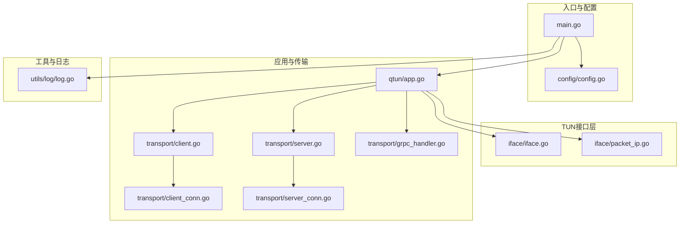
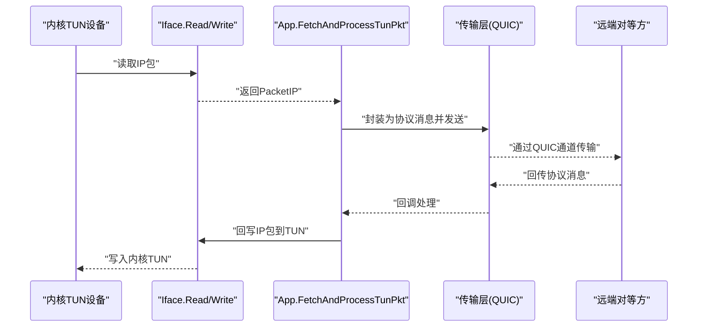
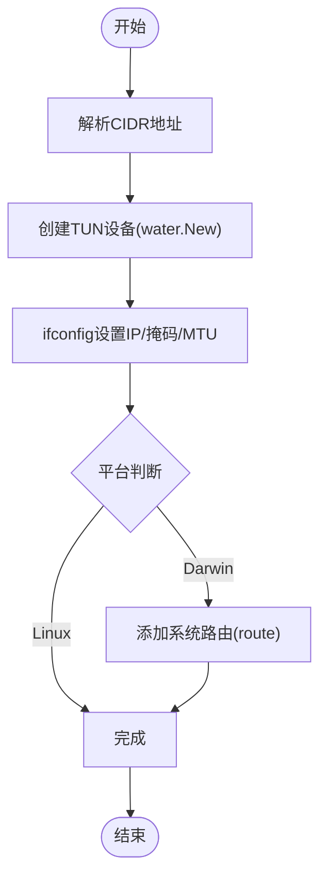
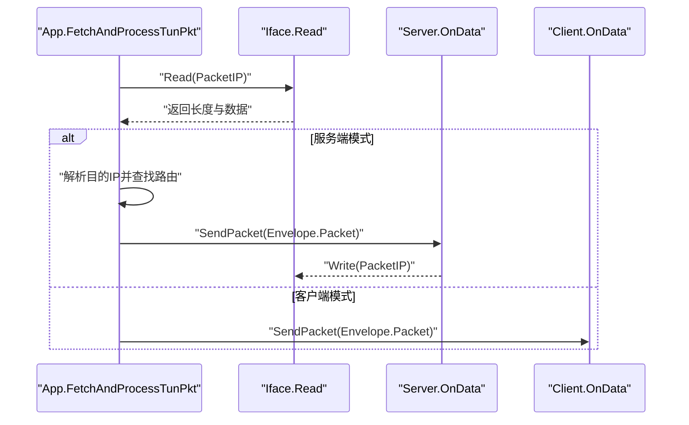
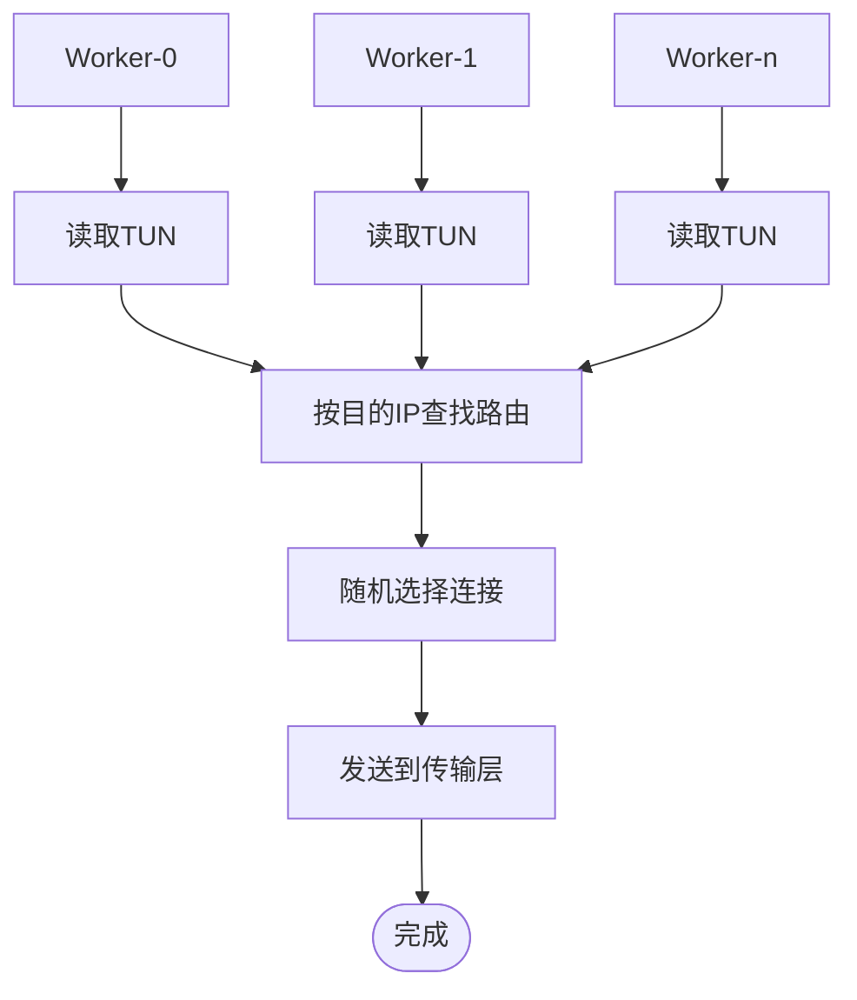
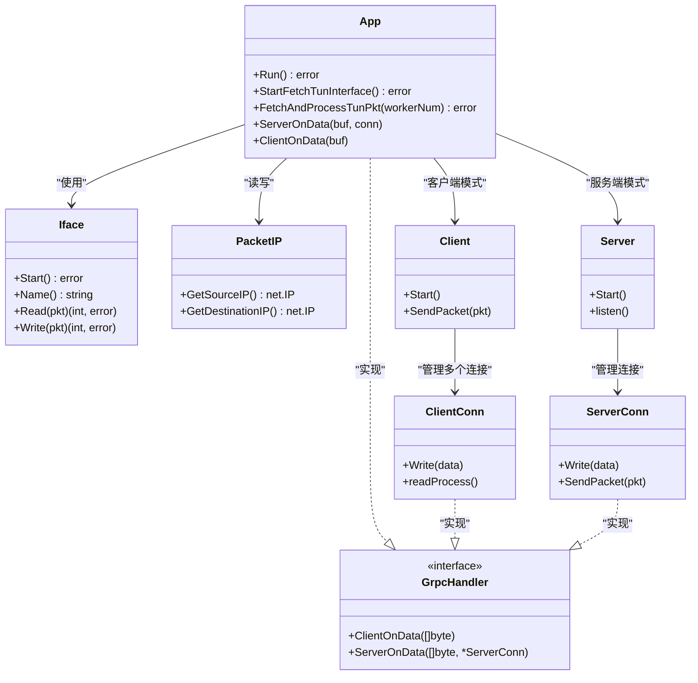

# TUN接口层

<cite>
**本文引用的文件列表**
- [main.go](file://main.go)
- [config/config.go](file://config/config.go)
- [iface/iface.go](file://iface/iface.go)
- [iface/packet_ip.go](file://iface/packet_ip.go)
- [qtun/app.go](file://qtun/app.go)
- [transport/client.go](file://transport/client.go)
- [transport/server.go](file://transport/server.go)
- [transport/client_conn.go](file://transport/client_conn.go)
- [transport/server_conn.go](file://transport/server_conn.go)
- [transport/grpc_handler.go](file://transport/grpc_handler.go)
- [utils/log/log.go](file://utils/log/log.go)
- [README.md](file://README.md)
- [PERFORMANCE_TEST_GUIDE.md](file://PERFORMANCE_TEST_GUIDE.md)
</cite>

## 目录
1. [简介](#简介)
2. [项目结构](#项目结构)
3. [核心组件](#核心组件)
4. [架构总览](#架构总览)
5. [详细组件分析](#详细组件分析)
6. [依赖关系分析](#依赖关系分析)
7. [性能考量](#性能考量)
8. [故障排查指南](#故障排查指南)
9. [结论](#结论)
10. [附录](#附录)

## 简介
本文件聚焦于Qtun的TUN接口层，系统性阐述其跨平台抽象设计与实现、IP包处理机制（读取、写入、解析、封装）、MTU配置与分片/重组策略、多工作线程的数据包处理架构（负载均衡与并发控制）、初始化流程与配置参数、性能调优建议及常见问题排查。文档以代码为依据，辅以图示帮助读者快速理解从内核TUN设备到应用层数据流的全链路。

## 项目结构
- 入口与配置
  - main.go：命令行参数解析、全局配置初始化、应用启动与子服务启动
  - config/config.go：全局配置单例与默认值
- TUN接口层
  - iface/iface.go：TUN接口抽象、跨平台初始化、系统路由配置、读写封装
  - iface/packet_ip.go：IP包类型与对象池，提供高效内存复用
- 应用与传输层
  - qtun/app.go：应用生命周期、TUN工作线程调度、数据包转发与路由管理
  - transport/*：基于QUIC的客户端/服务端实现，负责加密、通道与数据收发
- 工具与日志
  - utils/log/log.go：日志初始化与级别控制
  - README.md / PERFORMANCE_TEST_GUIDE.md：使用说明与性能测试指南

图表来源
- [main.go](file://main.go#L75-L102)
- [config/config.go](file://config/config.go#L17-L23)
- [iface/iface.go](file://iface/iface.go#L31-L74)
- [iface/packet_ip.go](file://iface/packet_ip.go#L18-L39)
- [qtun/app.go](file://qtun/app.go#L72-L97)
- [transport/client.go](file://transport/client.go#L31-L83)
- [transport/server.go](file://transport/server.go#L37-L52)
- [transport/client_conn.go](file://transport/client_conn.go#L44-L56)
- [transport/server_conn.go](file://transport/server_conn.go#L39-L51)
- [transport/grpc_handler.go](file://transport/grpc_handler.go#L3-L6)
- [utils/log/log.go](file://utils/log/log.go#L10-L25)

章节来源
- [main.go](file://main.go#L75-L102)
- [config/config.go](file://config/config.go#L17-L23)

## 核心组件
- TUN接口抽象与跨平台适配
  - 通过water库创建TUN设备，按平台差异执行ifconfig或route配置，设置MTU与IP
  - 提供Read/Write包装，统一IP包读写接口
- IP包对象池
  - 采用sync.Pool复用字节切片，避免频繁GC；提供NewPacketIP/PutPacketIP
- 多工作线程TUN处理
  - 启动CPU核心数×2的工作线程（最小4，最大32），轮询读取TUN数据包
  - 服务端模式下按目的IP查找连接并随机选择发送；客户端直接转发
- 传输层（QUIC）
  - 客户端：多连接（可配置）并行，发送Ping建立路由，封装IP包为协议消息
  - 服务端：监听QUIC，维护连接映射，接收协议消息后回写TUN
- 日志与监控
  - zerolog日志初始化，内置statsviz/pprof监控端点

章节来源
- [iface/iface.go](file://iface/iface.go#L31-L74)
- [iface/packet_ip.go](file://iface/packet_ip.go#L18-L39)
- [qtun/app.go](file://qtun/app.go#L79-L97)
- [transport/client.go](file://transport/client.go#L31-L83)
- [transport/server.go](file://transport/server.go#L37-L52)
- [utils/log/log.go](file://utils/log/log.go#L10-L25)

## 架构总览
TUN接口层位于应用与内核之间，负责将内核TUN设备的数据包读取到用户态，再通过传输层封装为协议消息，经QUIC通道在客户端与服务端间转发；服务端收到后回写TUN，实现VPN数据面。

图表来源
- [qtun/app.go](file://qtun/app.go#L99-L167)
- [iface/iface.go](file://iface/iface.go#L98-L104)
- [transport/client.go](file://transport/client.go#L208-L222)
- [transport/server.go](file://transport/server.go#L141-L148)
- [transport/server_conn.go](file://transport/server_conn.go#L235-L249)

## 详细组件分析

### TUN接口抽象与跨平台实现
- 设备创建与初始化
  - 使用water库创建TUN设备，随后通过ifconfig设置IP、掩码与MTU，并在macOS上添加系统路由
  - 读写封装：Read/Write直接委托给water.Interface，返回读取长度与错误
- 平台适配策略
  - Darwin/macOS：ifconfig命令参数略有差异，且需route添加系统路由
  - Linux：ifconfig命令参数不同，但无需额外route
- API封装
  - New(name, ip, mtu)构造器；Start()完成设备创建与系统配置；Name()/Read()/Write()提供统一接口

图表来源
- [iface/iface.go](file://iface/iface.go#L31-L74)

章节来源
- [iface/iface.go](file://iface/iface.go#L31-L74)

### IP包处理机制
- 数据包读取
  - App.FetchAndProcessTunPkt循环调用Iface.Read，读取MTU大小的缓冲区
  - 读取后解析源/目的IP，记录调试日志
- 数据包写入
  - 服务端：根据目的IP在路由表中查找连接，随机选择可用连接发送
  - 客户端：直接通过Client.SendPacket发送
  - 回写TUN：服务端/客户端收到协议消息后，将其作为PacketIP回写至Iface.Write
- 解析与封装
  - PacketIP类型为[]byte，提供GetSourceIP/GetDestinationIP解析IP头字段
  - 协议封装：Envelope包含Ping与Packet两类消息，Packet承载原始IP payload

图表来源
- [qtun/app.go](file://qtun/app.go#L99-L167)
- [qtun/app.go](file://qtun/app.go#L169-L248)
- [iface/iface.go](file://iface/iface.go#L98-L104)
- [transport/client.go](file://transport/client.go#L208-L222)
- [transport/server_conn.go](file://transport/server_conn.go#L235-L249)

章节来源
- [qtun/app.go](file://qtun/app.go#L99-L167)
- [qtun/app.go](file://qtun/app.go#L169-L248)
- [iface/packet_ip.go](file://iface/packet_ip.go#L41-L47)

### MTU配置与处理策略
- MTU来源与传递
  - 命令行参数--mtu，默认1500；通过config.Config与config.InitConfig注入全局
  - App.StartFetchTunInterface中创建Iface实例并传入MTU
- 读取缓冲区大小
  - App.FetchAndProcessTunPkt每次读取前调用NewPacketIP(MTU)，确保缓冲区容量满足MTU
- 分片与重组
  - 代码未显式实现IP分片/重组逻辑；实际由内核TUN设备与网络栈处理
  - 若上层业务需要分片/重组，可在应用层扩展（例如按MTU切片与拼装）

章节来源
- [main.go](file://main.go#L59-L60)
- [config/config.go](file://config/config.go#L3-L13)
- [qtun/app.go](file://qtun/app.go#L73-L101)
- [iface/packet_ip.go](file://iface/packet_ip.go#L18-L31)

### 多工作线程数据包处理架构
- 工作线程数量
  - 默认为CPU核心数×2，范围限制在4~32之间，提升I/O并行度
- 负载均衡与并发控制
  - 服务端：按目的IP查找路由，随机选择一个可用连接发送，减少锁持有时间
  - 客户端：Client内部按连接索引轮询发送，避免热点竞争
  - 传输层：每个连接拥有独立写入/读取协程，使用带缓冲channel解耦生产者与消费者

图表来源
- [qtun/app.go](file://qtun/app.go#L79-L97)
- [qtun/app.go](file://qtun/app.go#L114-L161)
- [transport/client.go](file://transport/client.go#L114-L132)

章节来源
- [qtun/app.go](file://qtun/app.go#L79-L97)
- [qtun/app.go](file://qtun/app.go#L114-L161)
- [transport/client.go](file://transport/client.go#L114-L132)

### 初始化流程与配置参数
- 初始化步骤
  - main.go解析命令行参数，调用config.InitConfig注入全局配置
  - 初始化日志utils/log/InitLog
  - 根据模式启动Socks5或HTTP文件服务
  - 创建qtun.App并调用Run
  - Run中根据模式创建Client/Server并启动StartFetchTunInterface
  - StartFetchTunInterface创建Iface并调用Start完成TUN初始化
- 关键配置参数
  - --key：加密密钥
  - --remote_addrs/--listen：客户端远端地址/服务端监听地址
  - --ip：虚拟IP网段
  - --mtu：MTU大小
  - --transport_threads：客户端并发线程数
  - --server_mode：服务端模式开关
  - --nodelay：传输层NoDelay（影响QUIC行为）
  - --socks5_port/--file_svr_port：辅助服务端口
  - --file_dir：静态文件目录

章节来源
- [main.go](file://main.go#L75-L102)
- [config/config.go](file://config/config.go#L17-L23)
- [qtun/app.go](file://qtun/app.go#L37-L49)
- [README.md](file://README.md#L62-L88)

## 依赖关系分析

图表来源
- [qtun/app.go](file://qtun/app.go#L19-L35)
- [iface/iface.go](file://iface/iface.go#L16-L21)
- [iface/packet_ip.go](file://iface/packet_ip.go#L8)
- [transport/client.go](file://transport/client.go#L20-L29)
- [transport/server.go](file://transport/server.go#L23-L35)
- [transport/client_conn.go](file://transport/client_conn.go#L24-L42)
- [transport/server_conn.go](file://transport/server_conn.go#L24-L37)
- [transport/grpc_handler.go](file://transport/grpc_handler.go#L3-L6)

章节来源
- [qtun/app.go](file://qtun/app.go#L19-L35)
- [transport/grpc_handler.go](file://transport/grpc_handler.go#L3-L6)

## 性能考量
- 对象池与内存复用
  - PacketIP对象池减少GC压力；NewPacketIP/PutPacketIP按容量阈值回收
- 并发与锁优化
  - App中使用RWMutex读多写少场景；Server使用sync.Map提升并发读性能
  - Client/ServerConn内部使用带缓冲channel与独立读写协程，降低阻塞概率
- 窗口与QUIC参数
  - QUIC配置较大MaxStreamReceiveWindow/MaxConnectionReceiveWindow，提高吞吐
- 工作线程数
  - CPU核心数×2（4~32）提升I/O并行度；结合对象池与通道可获得更好吞吐
- 建议
  - 合理设置--transport_threads与--mtu；在高延迟网络适当增大QUIC窗口
  - 使用pprof与statsviz持续观察内存分配与goroutine数量

章节来源
- [iface/packet_ip.go](file://iface/packet_ip.go#L18-L39)
- [qtun/app.go](file://qtun/app.go#L51-L70)
- [transport/server.go](file://transport/server.go#L97-L103)
- [transport/client_conn.go](file://transport/client_conn.go#L49-L54)
- [transport/server_conn.go](file://transport/server_conn.go#L47-L49)
- [PERFORMANCE_TEST_GUIDE.md](file://PERFORMANCE_TEST_GUIDE.md#L19-L24)

## 故障排查指南
- TUN设备无法创建或配置失败
  - 检查权限（需root/sudo）与平台命令差异（Darwin vs Linux）
  - 查看ifconfig/route输出与错误日志
- 无路由导致丢包
  - 服务端模式下确认Client发送的Ping已建立路由；检查App.CleanRoute定时清理任务
- 连接异常与重连
  - ClientConn/ServerConn内部有重试与panic恢复；关注日志中的“connect fail”“read/write fail”
- 加密不匹配
  - ServerConn在解密失败时返回特定错误，检查--key一致性
- 日志级别与监控
  - 使用--log_level调整日志级别；开启pprof/statsviz定位性能瓶颈

章节来源
- [iface/iface.go](file://iface/iface.go#L61-L67)
- [qtun/app.go](file://qtun/app.go#L51-L70)
- [transport/client_conn.go](file://transport/client_conn.go#L173-L187)
- [transport/server_conn.go](file://transport/server_conn.go#L98-L107)
- [utils/log/log.go](file://utils/log/log.go#L10-L25)

## 结论
Qtun的TUN接口层通过water库实现跨平台抽象，结合对象池与多工作线程架构，在保证易用性的同时兼顾性能。IP包读取、封装与回写流程清晰，配合QUIC传输层实现可靠的数据面转发。通过合理的MTU配置、并发线程数与QUIC窗口参数，可在不同网络环境下取得稳定吞吐与低延迟表现。

## 附录
- 使用与部署要点
  - 服务端：--server_mode，指定--listen与--ip
  - 客户端：指定--remote_addrs与--ip，自动配置系统代理（macOS）
- 性能测试
  - 参考PERFORMANCE_TEST_GUIDE.md中的场景与脚本，结合pprof与statsviz进行分析

章节来源
- [README.md](file://README.md#L13-L26)
- [README.md](file://README.md#L62-L88)
- [PERFORMANCE_TEST_GUIDE.md](file://PERFORMANCE_TEST_GUIDE.md#L26-L110)