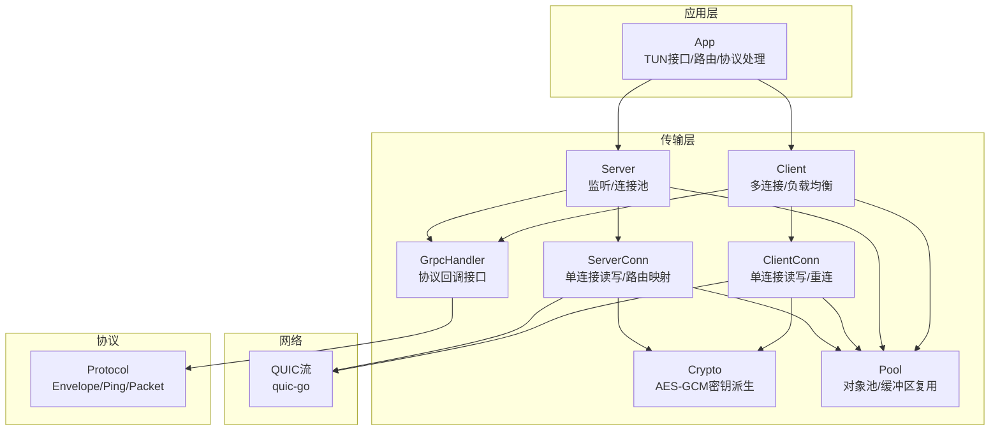
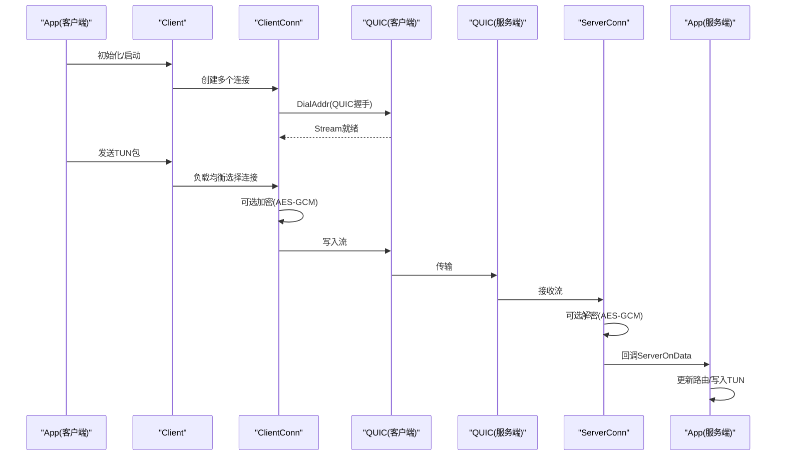
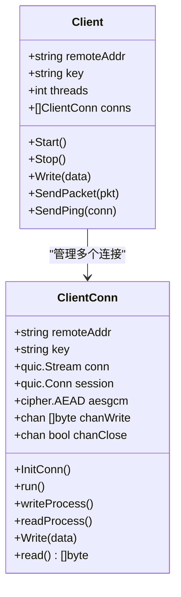
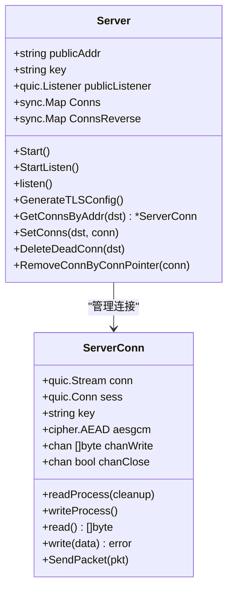
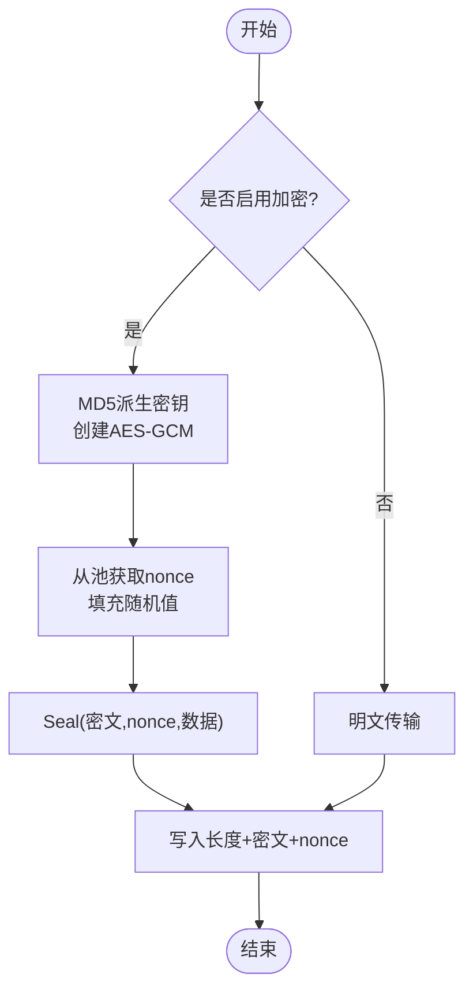
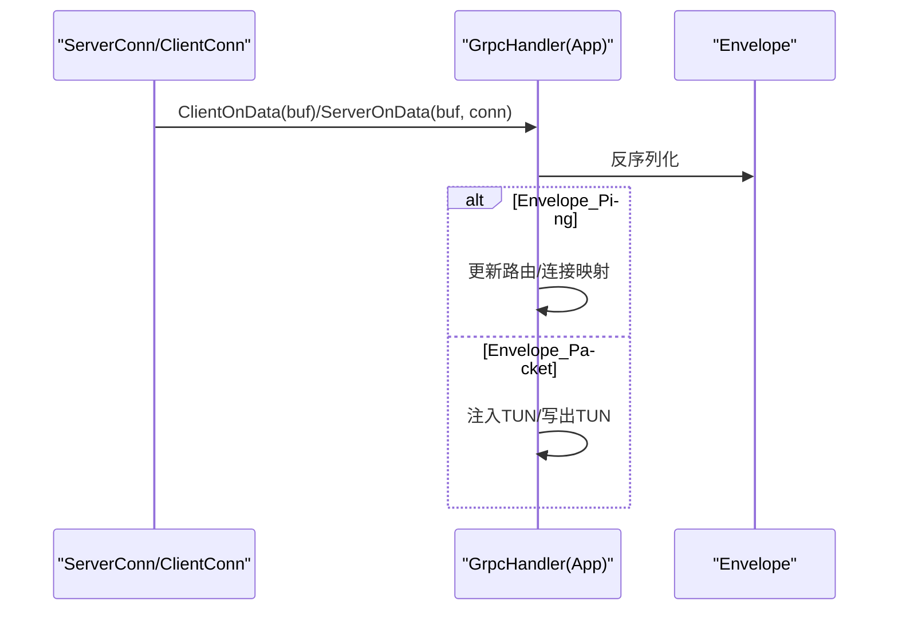
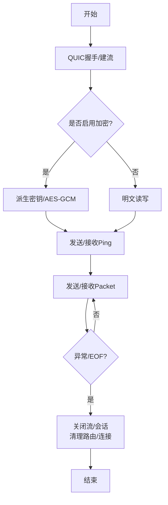
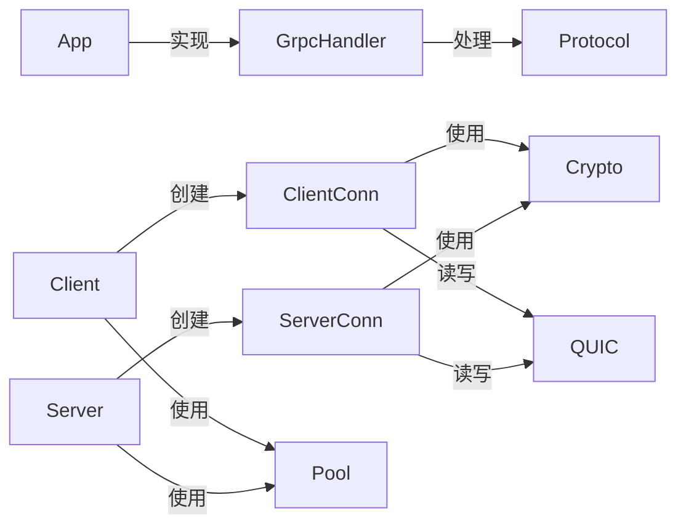

# 传输层架构

<cite>
**本文引用的文件**
- [main.go](file://main.go)
- [config/config.go](file://config/config.go)
- [qtun/app.go](file://qtun/app.go)
- [transport/client.go](file://transport/client.go)
- [transport/client_conn.go](file://transport/client_conn.go)
- [transport/server.go](file://transport/server.go)
- [transport/server_conn.go](file://transport/server_conn.go)
- [transport/grpc_handler.go](file://transport/grpc_handler.go)
- [transport/crypto.go](file://transport/crypto.go)
- [transport/pool.go](file://transport/pool.go)
- [protocol/protocol.proto](file://protocol/protocol.proto)
</cite>

## 目录
1. [简介](#简介)
2. [项目结构](#项目结构)
3. [核心组件](#核心组件)
4. [架构总览](#架构总览)
5. [详细组件分析](#详细组件分析)
6. [依赖关系分析](#依赖关系分析)
7. [性能考量](#性能考量)
8. [故障排查指南](#故障排查指南)
9. [结论](#结论)
10. [附录](#附录)

## 简介
本文件系统性阐述 Qtun 传输层的整体设计理念与实现细节，重点覆盖以下方面：
- 客户端与服务器的对称设计模式：二者均基于 QUIC 流进行数据传输，采用统一的加密与消息封装协议。
- QUIC 协议集成与连接管理：通过 quic-go 实现高性能连接，支持多连接并发、连接池优化与对象复用。
- 加密机制：基于 AES-GCM 的密钥派生与加解密流程，确保端到端安全通信。
- gRPC 处理器：基于 Envelope 的消息序列化/反序列化与协议处理。
- 连接生命周期：从建立、数据传输到关闭的完整流程图与故障恢复策略。

## 项目结构
传输层相关代码主要位于 transport 目录，配合 qtun 应用层与协议定义共同构成完整的传输链路。核心模块如下：
- 传输层（transport）：客户端/服务端、连接管理、加密、对象池、gRPC 接口
- 应用层（qtun）：TUN 接口读写、路由表维护、与传输层交互
- 协议（protocol）：Envelope/Ping/Packet 的 protobuf 定义
- 配置（config）：全局参数初始化与访问

图表来源
- [qtun/app.go](file://qtun/app.go#L37-L49)
- [transport/client.go](file://transport/client.go#L31-L38)
- [transport/server.go](file://transport/server.go#L37-L46)
- [transport/client_conn.go](file://transport/client_conn.go#L44-L56)
- [transport/server_conn.go](file://transport/server_conn.go#L39-L51)
- [transport/crypto.go](file://transport/crypto.go#L10-L17)
- [transport/pool.go](file://transport/pool.go#L11-L50)
- [transport/grpc_handler.go](file://transport/grpc_handler.go#L3-L6)
- [protocol/protocol.proto](file://protocol/protocol.proto#L5-L22)

章节来源
- [qtun/app.go](file://qtun/app.go#L37-L49)
- [transport/client.go](file://transport/client.go#L31-L38)
- [transport/server.go](file://transport/server.go#L37-L46)

## 核心组件
- Client/ClientConn：客户端多连接并发模型，负责 QUIC 建立、读写、重连与负载均衡；支持可选 AES-GCM 加密。
- Server/ServerConn：服务端监听与连接管理，维护双向映射表，按目的地址选择连接转发。
- GrpcHandler：协议回调接口，App 实现该接口完成路由更新与数据转发。
- Crypto：基于密钥派生的 AES-GCM AEAD 实例生成。
- Pool：对象池与缓冲区复用，降低 GC 压力与内存分配成本。
- Protocol：Envelope 封装 Ping/Packet，统一序列化/反序列化入口。

章节来源
- [transport/client.go](file://transport/client.go#L20-L29)
- [transport/server.go](file://transport/server.go#L23-L35)
- [transport/grpc_handler.go](file://transport/grpc_handler.go#L3-L6)
- [transport/crypto.go](file://transport/crypto.go#L10-L17)
- [transport/pool.go](file://transport/pool.go#L11-L50)
- [protocol/protocol.proto](file://protocol/protocol.proto#L5-L22)

## 架构总览
传输层采用“对称”设计：客户端与服务端均以 QUIC 流为载体，通过 Envelope 承载 Ping/Packet 消息，结合可选的 AES-GCM 加密，形成统一的协议栈。应用层在两端分别负责 TUN 包的采集/注入与路由决策。

图表来源
- [qtun/app.go](file://qtun/app.go#L169-L207)
- [transport/client.go](file://transport/client.go#L115-L132)
- [transport/client_conn.go](file://transport/client_conn.go#L241-L294)
- [transport/server_conn.go](file://transport/server_conn.go#L167-L220)
- [transport/server.go](file://transport/server.go#L133-L148)

## 详细组件分析

### 客户端 Client/ClientConn
- 多连接并发：构造指定数量的 ClientConn，每个连接独立维护 QUIC 流与读写通道。
- 连接管理：自动重连、健康检查、连接数统计与日志输出。
- 负载均衡：原子递增序列号取模选择连接，实现简单均匀分发。
- 加密与序列化：可选 AES-GCM 加密；使用对象池复用 Envelope/Ping/Packet。
- 关闭与等待：统一 WaitGroup 控制线程退出。

图表来源
- [transport/client.go](file://transport/client.go#L20-L29)
- [transport/client_conn.go](file://transport/client_conn.go#L24-L42)

章节来源
- [transport/client.go](file://transport/client.go#L41-L95)
- [transport/client.go](file://transport/client.go#L115-L132)
- [transport/client.go](file://transport/client.go#L178-L206)
- [transport/client_conn.go](file://transport/client_conn.go#L130-L151)
- [transport/client_conn.go](file://transport/client_conn.go#L153-L188)
- [transport/client_conn.go](file://transport/client_conn.go#L204-L239)
- [transport/client_conn.go](file://transport/client_conn.go#L309-L357)

### 服务端 Server/ServerConn
- 监听与接受：QUIC 监听地址，接受新会话并创建 ServerConn。
- 连接池：双向映射表 Conns/ConnsReverse，支持按地址查找与删除死连接。
- 路由更新：收到 Ping 后更新目的 IP 到连接标识的映射，用于后续包转发。
- 写出队列：ServerConn 维护写通道，批量写出提升吞吐。
- 错误处理：解密失败返回特定错误，触发连接清理。

图表来源
- [transport/server.go](file://transport/server.go#L23-L35)
- [transport/server_conn.go](file://transport/server_conn.go#L24-L37)

章节来源
- [transport/server.go](file://transport/server.go#L48-L76)
- [transport/server.go](file://transport/server.go#L91-L149)
- [transport/server.go](file://transport/server.go#L151-L173)
- [transport/server.go](file://transport/server.go#L175-L219)
- [transport/server_conn.go](file://transport/server_conn.go#L58-L115)
- [transport/server_conn.go](file://transport/server_conn.go#L129-L165)
- [transport/server_conn.go](file://transport/server_conn.go#L251-L290)

### 加密机制与密钥管理
- 密钥派生：客户端与服务端均通过 makeAES128GCM 使用 MD5 对输入 key 派生 128-bit 密钥，创建 AES-GCM AEAD。
- 加密流程：发送前生成随机 96-bit nonce，使用 Seal 附加认证加密；接收端读取 nonce 并 Open 解密。
- 对象复用：nonce 使用 sync.Pool 复用，减少分配与 GC 压力。
- 可选加密：当 key 为空时跳过加密，便于测试或内网场景。

图表来源
- [transport/crypto.go](file://transport/crypto.go#L10-L17)
- [transport/client_conn.go](file://transport/client_conn.go#L266-L288)
- [transport/server_conn.go](file://transport/server_conn.go#L196-L214)
- [transport/pool.go](file://transport/pool.go#L53-L61)

章节来源
- [transport/crypto.go](file://transport/crypto.go#L10-L17)
- [transport/client_conn.go](file://transport/client_conn.go#L266-L288)
- [transport/server_conn.go](file://transport/server_conn.go#L196-L214)
- [transport/pool.go](file://transport/pool.go#L53-L61)

### gRPC 处理器与协议处理
- GrpcHandler 接口：定义 ClientOnData 与 ServerOnData 两个回调，App 实现具体逻辑。
- 客户端处理：收到 Envelope 后解析类型，Packet 直接写入 TUN。
- 服务端处理：收到 Envelope 后解析类型，Ping 更新路由表与连接映射，Packet 注入 TUN。
- 路由清理：周期任务扫描并移除已关闭连接，避免僵尸路由。

图表来源
- [transport/grpc_handler.go](file://transport/grpc_handler.go#L3-L6)
- [qtun/app.go](file://qtun/app.go#L169-L207)
- [qtun/app.go](file://qtun/app.go#L209-L248)
- [qtun/app.go](file://qtun/app.go#L51-L70)

章节来源
- [transport/grpc_handler.go](file://transport/grpc_handler.go#L3-L6)
- [qtun/app.go](file://qtun/app.go#L169-L207)
- [qtun/app.go](file://qtun/app.go#L209-L248)
- [qtun/app.go](file://qtun/app.go#L51-L70)

### 连接建立、数据传输与关闭流程
- 建立：客户端通过 DialAddr 建立 QUIC 会话并打开流；服务端监听并接受新会话。
- 数据传输：双方均使用 64KB 缓冲读取，可选 AES-GCM 加密；Ping 用于保活与路由建立。
- 关闭：异常或 EOF 触发清理，关闭流与会话，移除路由与连接映射。

图表来源
- [transport/client_conn.go](file://transport/client_conn.go#L69-L117)
- [transport/server_conn.go](file://transport/server_conn.go#L58-L115)
- [transport/client_conn.go](file://transport/client_conn.go#L241-L294)
- [transport/server_conn.go](file://transport/server_conn.go#L167-L220)

## 依赖关系分析
- 组件耦合：App 作为桥接层，依赖 GrpcHandler 接口与传输层；传输层内部通过接口与对象池解耦。
- 并发与同步：Client/Server 使用 sync.Map 提升并发读写性能；ClientConn/ServerConn 使用通道与互斥锁保证状态一致性。
- 外部依赖：quic-go 提供 QUIC 实现；protobuf 提供 Envelope 序列化；标准库 crypto 提供 AES-GCM。

图表来源
- [qtun/app.go](file://qtun/app.go#L169-L207)
- [transport/client.go](file://transport/client.go#L31-L38)
- [transport/server.go](file://transport/server.go#L37-L46)
- [transport/client_conn.go](file://transport/client_conn.go#L119-L128)
- [transport/server_conn.go](file://transport/server_conn.go#L117-L127)
- [transport/pool.go](file://transport/pool.go#L11-L50)
- [protocol/protocol.proto](file://protocol/protocol.proto#L5-L22)

章节来源
- [qtun/app.go](file://qtun/app.go#L169-L207)
- [transport/client.go](file://transport/client.go#L31-L38)
- [transport/server.go](file://transport/server.go#L37-L46)
- [transport/client_conn.go](file://transport/client_conn.go#L119-L128)
- [transport/server_conn.go](file://transport/server_conn.go#L117-L127)
- [transport/pool.go](file://transport/pool.go#L11-L50)
- [protocol/protocol.proto](file://protocol/protocol.proto#L5-L22)

## 性能考量
- QUIC 参数优化：增大最大并发流、接收窗口与 KeepAlive 周期，提升高延迟/高丢包环境下的稳定性与吞吐。
- 对象池与缓冲区复用：nonce、Envelope、Ping/Packet、bytes.Buffer、64KB 读缓冲均来自 sync.Pool，显著降低 GC 压力。
- 并发读写：客户端/服务端均使用 bufio Reader/Writer（64KB）与通道队列，提高 I/O 并行度。
- 路由清理：定期扫描并移除已关闭连接，避免无效映射导致的转发失败与资源浪费。
- CPU 自适应工作线程：TUN 包处理线程数与 CPU 核数成比例，兼顾吞吐与资源占用。

章节来源
- [transport/server.go](file://transport/server.go#L97-L103)
- [transport/client_conn.go](file://transport/client_conn.go#L332)
- [transport/server_conn.go](file://transport/server_conn.go#L89)
- [transport/pool.go](file://transport/pool.go#L11-L50)
- [qtun/app.go](file://qtun/app.go#L79-L87)
- [qtun/app.go](file://qtun/app.go#L51-L70)

## 故障排查指南
- 连接无法建立：检查 QUIC TLS 配置与防火墙；客户端重试与日志中“fail to connect”提示。
- 解密失败：服务端读取到 ErrCiperNotMatch 时应断开连接并清理路由；确认两端密钥一致。
- 路由丢失：周期清理任务会移除已关闭连接；若出现“no route/packet dropped”，检查 Ping 是否到达与路由更新。
- 性能问题：关注 GC 抖动与缓冲区大小；适当调整并发线程数与 QUIC 窗口参数。
- 日志定位：利用 Info/Warn/Error 级别日志快速定位阶段与原因（如“server listen panic”、“client conn closed”等）。

章节来源
- [transport/server_conn.go](file://transport/server_conn.go#L98-L102)
- [transport/server.go](file://transport/server.go#L55-L62)
- [qtun/app.go](file://qtun/app.go#L51-L70)

## 结论
Qtun 传输层通过 QUIC 提供高效稳定的底层承载，结合统一的 Envelope 协议与可选 AES-GCM 加密，实现了客户端与服务端的对称设计与一致的处理语义。通过对象池、并发读写与路由清理等优化手段，系统在高并发与复杂网络环境下具备良好的性能与可靠性。建议在生产环境中统一密钥管理、监控连接健康与路由状态，并根据网络特征微调 QUIC 参数与并发策略。

## 附录
- 配置项说明（来自命令行参数与配置模块）
  - key：加密密钥（默认值见命令行定义）
  - remote_addrs/listen：客户端远端地址与服务端监听地址
  - transport_threads：客户端并发连接数
  - ip/mtu：TUN 接口地址与 MTU
  - server_mode/nodelay：运行模式与 TCP NoDelay
- 协议字段说明（Envelope/Ping/Packet）
  - Envelope.type：oneof（ping 或 packet）
  - MessagePing：时间戳、本地地址、私有地址、IP、机房标识
  - MessagePacket：payload 字节流

章节来源
- [main.go](file://main.go#L22-L36)
- [config/config.go](file://config/config.go#L3-L13)
- [protocol/protocol.proto](file://protocol/protocol.proto#L5-L22)