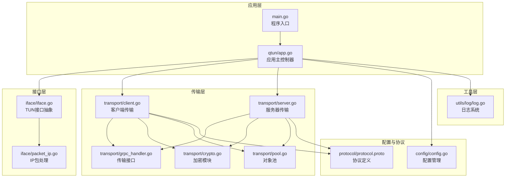
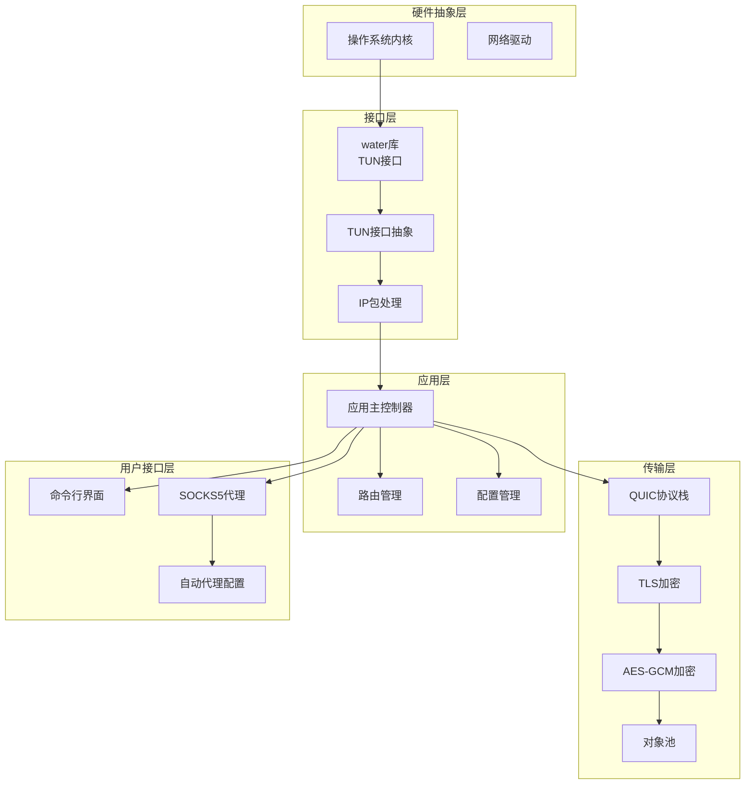
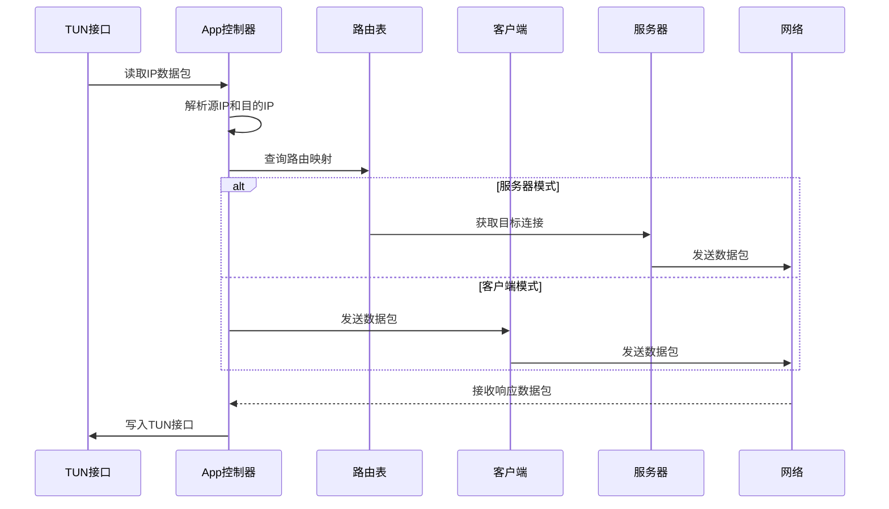
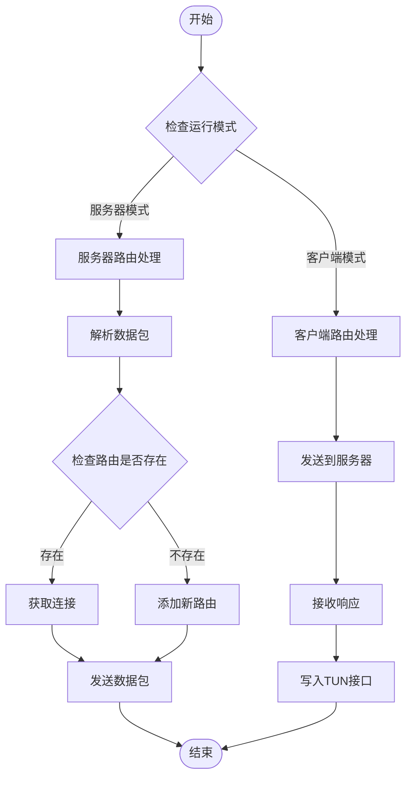
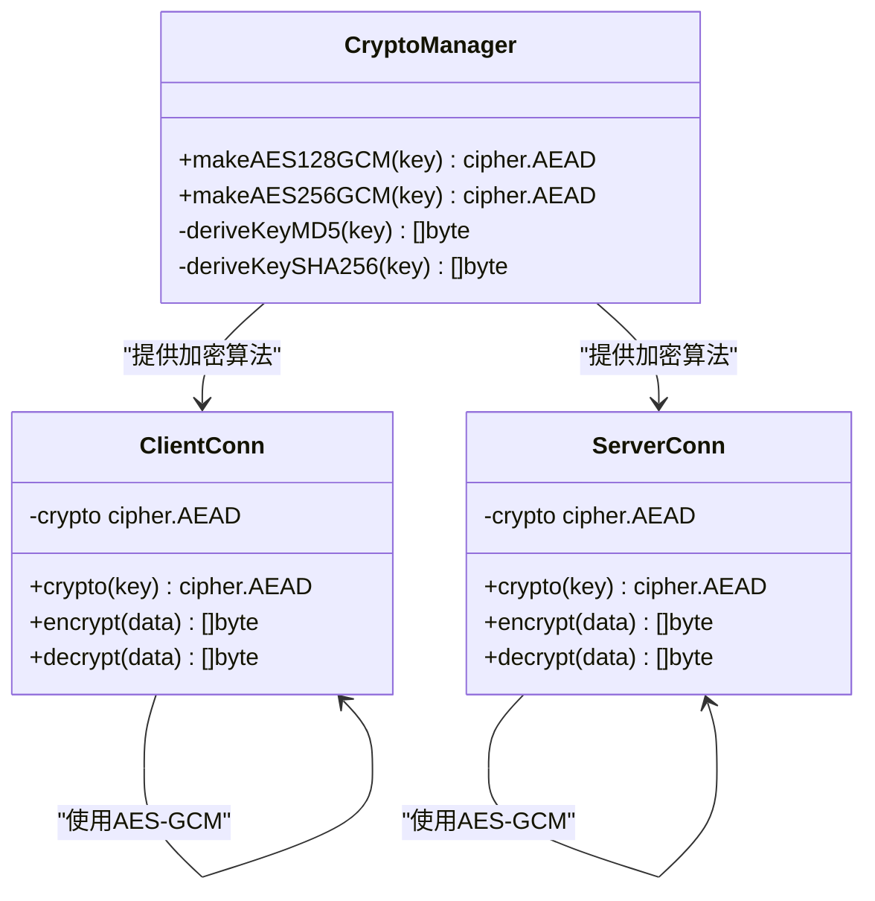
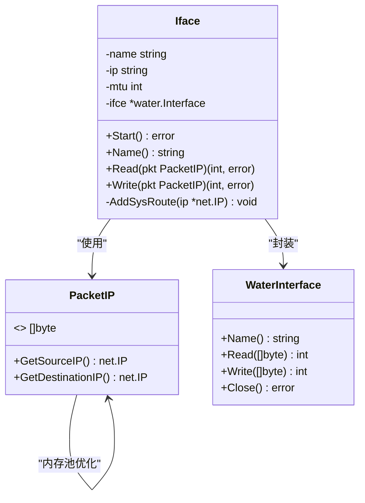
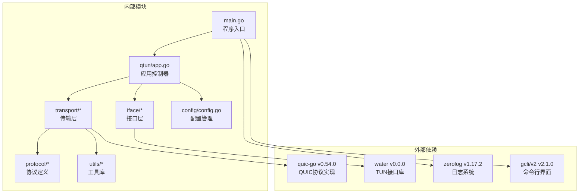

# 核心模块架构

<cite>
**本文档引用的文件**
- [main.go](file://main.go)
- [qtun/app.go](file://qtun/app.go)
- [iface/iface.go](file://iface/iface.go)
- [iface/packet_ip.go](file://iface/packet_ip.go)
- [transport/client.go](file://transport/client.go)
- [transport/server.go](file://transport/server.go)
- [transport/grpc_handler.go](file://transport/grpc_handler.go)
- [transport/crypto.go](file://transport/crypto.go)
- [transport/pool.go](file://transport/pool.go)
- [config/config.go](file://config/config.go)
- [protocol/protocol.proto](file://protocol/protocol.proto)
- [utils/log/log.go](file://utils/log/log.go)
- [README.md](file://README.md)
- [go.mod](file://go.mod)
</cite>

## 目录
1. [简介](#简介)
2. [项目结构](#项目结构)
3. [核心组件](#核心组件)
4. [架构总览](#架构总览)
5. [详细组件分析](#详细组件分析)
6. [依赖关系分析](#依赖关系分析)
7. [性能考虑](#性能考虑)
8. [故障排除指南](#故障排除指南)
9. [结论](#结论)

## 简介

Qtun是一个基于QUIC协议的安全隧道应用，采用Go语言实现。该项目的核心设计理念是通过TUN接口实现透明的网络流量转发，结合QUIC协议提供高效、安全的点对点通信。系统采用模块化架构设计，将网络传输、接口抽象、路由管理等功能分离到独立的模块中，实现了良好的可维护性和扩展性。

本项目支持多平台部署，包括macOS和Linux系统，通过跨平台的TUN接口抽象实现了统一的网络虚拟化能力。系统提供了完整的命令行界面，支持服务器模式和客户端模式的灵活部署。

## 项目结构

Qtun项目采用清晰的分层架构设计，主要包含以下核心模块：

**图表来源**
- [main.go](file://main.go#L1-L136)
- [qtun/app.go](file://qtun/app.go#L1-L271)
- [transport/client.go](file://transport/client.go#L1-L223)
- [transport/server.go](file://transport/server.go#L1-L219)

**章节来源**
- [main.go](file://main.go#L1-L136)
- [README.md](file://README.md#L1-L99)

## 核心组件

### 应用主控制器（App）

App是整个系统的协调中心，负责管理各个子系统的生命周期和相互协作。其核心职责包括：

- **TUN接口管理**：初始化和控制TUN虚拟网络接口
- **路由表维护**：动态维护客户端连接到目标IP的路由映射
- **数据包转发**：协调数据包在TUN接口和传输层之间的转发
- **系统集成**：与配置系统、日志系统和其他组件的集成

App采用了读写锁机制来优化并发访问，特别是在路由表操作时使用RWMutex确保线程安全。

**章节来源**
- [qtun/app.go](file://qtun/app.go#L19-L35)
- [qtun/app.go](file://qtun/app.go#L37-L49)

### 传输层架构

传输层是Qtun的核心通信模块，实现了基于QUIC协议的客户端-服务器架构：

#### 客户端架构
- **多连接支持**：支持配置多个并发连接以提高吞吐量
- **负载均衡**：通过序列号实现简单的轮询负载均衡
- **心跳机制**：定期发送PING消息维持连接活跃状态
- **数据封装**：将IP数据包封装为协议缓冲区进行传输

#### 服务器架构  
- **QUIC监听**：基于QUIC协议提供高性能的连接管理
- **并发处理**：支持多客户端并发连接
- **连接管理**：维护客户端连接的生命周期
- **安全配置**：自动生成TLS证书确保通信安全

**章节来源**
- [transport/client.go](file://transport/client.go#L20-L39)
- [transport/server.go](file://transport/server.go#L23-L46)

### 接口层设计

接口层提供了跨平台的TUN接口抽象，实现了统一的网络虚拟化能力：

#### TUN接口抽象
- **跨平台支持**：通过water库实现macOS和Linux的TUN接口
- **系统集成**：自动配置网络接口参数和路由表
- **平台差异处理**：针对不同操作系统执行相应的网络配置命令

#### IP包处理
- **内存池优化**：使用sync.Pool减少内存分配开销
- **快速解析**：直接从字节数组中提取源IP和目的IP
- **MTU管理**：根据配置的MTU大小处理数据包

**章节来源**
- [iface/iface.go](file://iface/iface.go#L16-L29)
- [iface/packet_ip.go](file://iface/packet_ip.go#L8-L39)

## 架构总览

Qtun的整体架构采用分层设计，从底层到上层依次为：硬件抽象层、接口层、传输层、应用层和用户接口层。

**图表来源**
- [qtun/app.go](file://qtun/app.go#L1-L271)
- [transport/server.go](file://transport/server.go#L1-L219)
- [transport/client.go](file://transport/client.go#L1-L223)

## 详细组件分析

### 应用主控制器详细分析

App组件是整个系统的中枢，负责协调各个子系统的协同工作。

#### 数据包处理流程

**图表来源**
- [qtun/app.go](file://qtun/app.go#L99-L167)
- [qtun/app.go](file://qtun/app.go#L169-L207)

#### 路由表管理机制

App使用嵌套的map结构来维护路由表，支持动态更新和清理：

**图表来源**
- [qtun/app.go](file://qtun/app.go#L114-L166)
- [qtun/app.go](file://qtun/app.go#L169-L207)

**章节来源**
- [qtun/app.go](file://qtun/app.go#L99-L167)
- [qtun/app.go](file://qtun/app.go#L169-L207)

### 传输层详细分析

#### QUIC协议实现

传输层基于quic-go库实现了高性能的QUIC协议栈，具有以下特点：

- **配置优化**：设置了合理的流数量、窗口大小和保活周期
- **并发处理**：支持多客户端并发连接和数据流
- **错误恢复**：具备自动重连和错误恢复机制

#### 加密机制

系统采用AES-GCM算法进行数据加密，提供了两种密钥派生方式：

**图表来源**
- [transport/crypto.go](file://transport/crypto.go#L10-L26)
- [transport/client.go](file://transport/client.go#L46-L68)

#### 对象池优化

为了减少内存分配和GC压力，传输层实现了多种对象池：

| 对象池类型 | 大小 | 用途 | 优化效果 |
|------------|------|------|----------|
| envelopePool | 默认 | 协议封包 | 减少protobuf分配 |
| pingMessagePool | 默认 | PING消息 | 提高心跳效率 |
| packetMessagePool | 默认 | 数据包消息 | 降低数据传输开销 |
| readBufPool | 65536字节 | 读缓冲区 | 减少临时缓冲区分配 |
| noncePool | 12字节 | 随机数 | 提高加密安全性 |

**章节来源**
- [transport/server.go](file://transport/server.go#L97-L103)
- [transport/crypto.go](file://transport/crypto.go#L10-L26)
- [transport/pool.go](file://transport/pool.go#L10-L108)

### 接口层详细分析

#### TUN接口抽象设计

接口层通过water库实现了跨平台的TUN接口抽象：

**图表来源**
- [iface/iface.go](file://iface/iface.go#L16-L21)
- [iface/packet_ip.go](file://iface/packet_ip.go#L8-L16)

#### 平台特定实现

不同操作系统在TUN接口配置上存在差异：

| 操作系统 | ifconfig命令 | 路由配置 | 特殊处理 |
|----------|-------------|----------|----------|
| macOS | ifconfig tunX IP netmask MASK mtu MTU up | route add -net SUBNET GATEWAY | 自动添加系统路由 |
| Linux | ifconfig tunX IP netmask MASK mtu MTU up | ip route add | 直接配置网络接口 |
| Windows | 不支持 | 不支持 | 仅支持macOS和Linux |

**章节来源**
- [iface/iface.go](file://iface/iface.go#L31-L74)
- [iface/iface.go](file://iface/iface.go#L76-L92)

## 依赖关系分析

Qtun项目的依赖关系体现了清晰的分层架构和模块化设计：

**图表来源**
- [go.mod](file://go.mod#L5-L28)
- [main.go](file://main.go#L3-L20)

### 关键依赖特性

#### QUIC协议栈
- **高性能**：基于UDP的QUIC协议提供更好的网络性能
- **内置加密**：TLS 1.3集成，提供安全的握手和传输
- **多路复用**：单连接支持多流并发处理
- **快速重连**：支持连接迁移和快速恢复

#### TUN接口库
- **跨平台**：统一的API接口支持不同操作系统
- **零拷贝**：直接操作字节数组，减少数据复制
- **内存池**：内置对象池优化内存使用

**章节来源**
- [go.mod](file://go.mod#L5-L28)
- [transport/server.go](file://transport/server.go#L97-L103)

## 性能考虑

Qtun在设计时充分考虑了性能优化，采用了多种技术手段提升系统性能：

### 并发优化策略

#### 多工作线程模型
- **动态工作线程**：根据CPU核心数动态调整工作线程数量
- **最小4线程，最大32线程**：平衡并发度和资源消耗
- **I/O并行化**：多个线程同时处理TUN接口的数据包

#### 锁优化
- **读写锁**：路由表操作使用RWMutex减少锁竞争
- **最小临界区**：尽可能缩短锁保护的代码范围
- **无锁数据结构**：使用sync.Map和原子操作

### 内存优化策略

#### 对象池技术
- **协议对象池**：复用protobuf消息对象
- **缓冲区池**：复用读写缓冲区
- **IP包池**：复用网络数据包缓冲区

#### 内存分配优化
- **预分配策略**：根据MTU大小预分配缓冲区
- **容量检查**：避免不必要的内存重新分配
- **及时回收**：使用defer语句确保资源及时释放

### 网络优化策略

#### QUIC配置优化
- **窗口调优**：设置合适的接收窗口大小
- **流数量限制**：平衡并发和资源消耗
- **保活机制**：合理设置连接保活时间

#### 负载均衡
- **轮询算法**：简单有效的多连接负载均衡
- **连接健康检查**：自动检测和移除失效连接
- **动态路由更新**：根据连接状态动态调整路由

## 故障排除指南

### 常见问题诊断

#### TUN接口问题
- **权限不足**：确保以root权限运行程序
- **设备占用**：检查是否有其他TUN接口正在使用
- **平台不支持**：确认当前操作系统支持TUN接口

#### 连接问题
- **QUIC握手失败**：检查防火墙设置和网络连通性
- **TLS证书问题**：验证服务器证书生成和配置
- **加密密钥不匹配**：确认客户端和服务端使用相同密钥

#### 性能问题
- **CPU使用率过高**：检查工作线程数量配置
- **内存泄漏**：验证对象池使用是否正确
- **网络延迟**：分析QUIC配置参数

### 调试工具

#### 日志系统
- **多级别日志**：支持Info和Debug级别的详细日志
- **结构化输出**：使用zerolog提供结构化的日志格式
- **实时监控**：支持运行时日志级别动态调整

#### 性能监控
- **统计可视化**：集成statsviz提供性能数据可视化
- **pprof支持**：内置性能分析工具支持
- **系统指标**：监控CPU、内存、网络等系统资源

**章节来源**
- [utils/log/log.go](file://utils/log/log.go#L10-L25)
- [main.go](file://main.go#L105-L129)

## 结论

Qtun项目展现了优秀的软件架构设计，通过模块化和分层的设计理念实现了功能的清晰分离和高效的性能表现。系统的核心优势体现在以下几个方面：

### 设计优势
- **模块化架构**：清晰的职责分离使得各模块易于维护和扩展
- **跨平台支持**：通过抽象层实现了良好的平台兼容性
- **性能优化**：多处性能优化技术确保了系统的高效运行
- **安全性考虑**：集成的加密机制提供了可靠的安全保障

### 技术亮点
- **QUIC协议**：采用最新的QUIC协议实现高性能网络通信
- **对象池技术**：有效减少了内存分配和GC压力
- **并发优化**：合理的并发模型提升了系统整体性能
- **自动化配置**：简化了部署和配置过程

### 扩展建议
- **监控增强**：可以增加更详细的性能监控和告警机制
- **配置热更新**：支持运行时配置的动态更新
- **多协议支持**：可以考虑支持更多的网络协议
- **容器化部署**：提供Docker等容器化部署方案

Qtun作为一个成熟的网络隧道解决方案，在保证功能完整性的同时，展现了良好的工程实践和设计哲学，为类似网络应用的开发提供了优秀的参考范例。