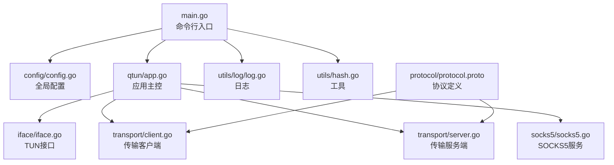
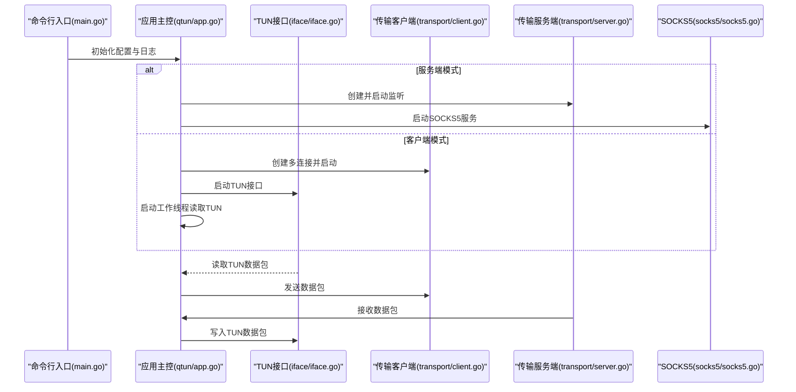
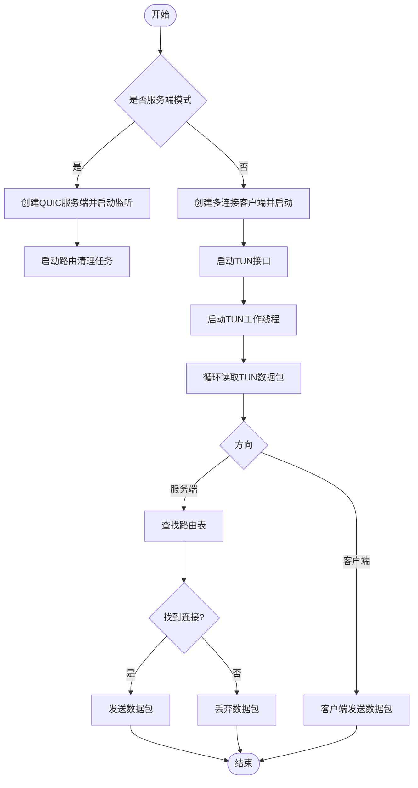
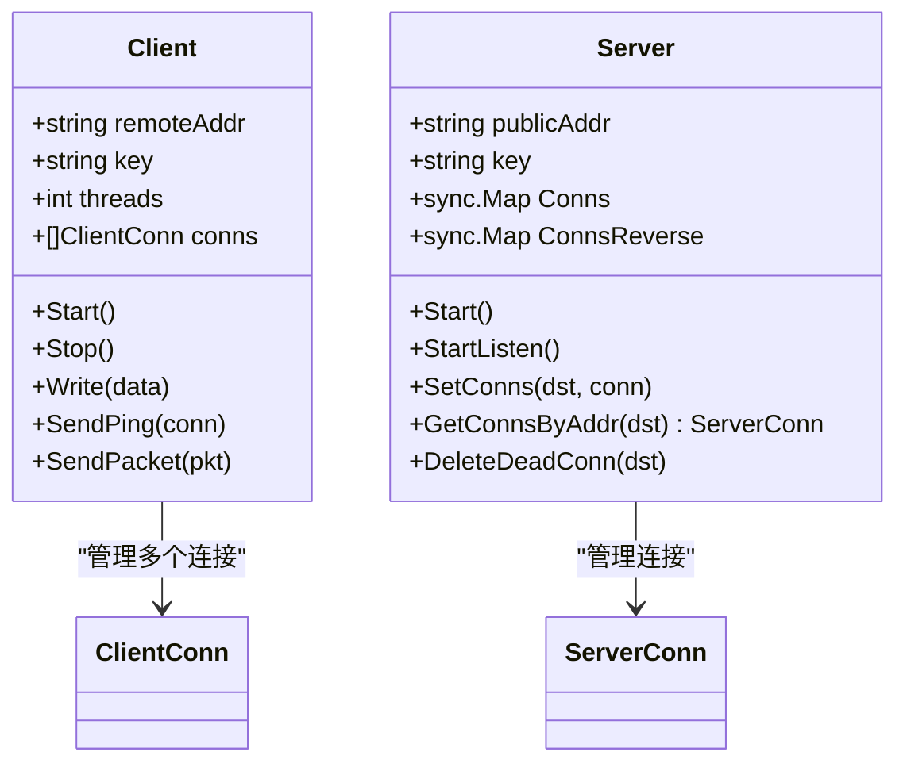
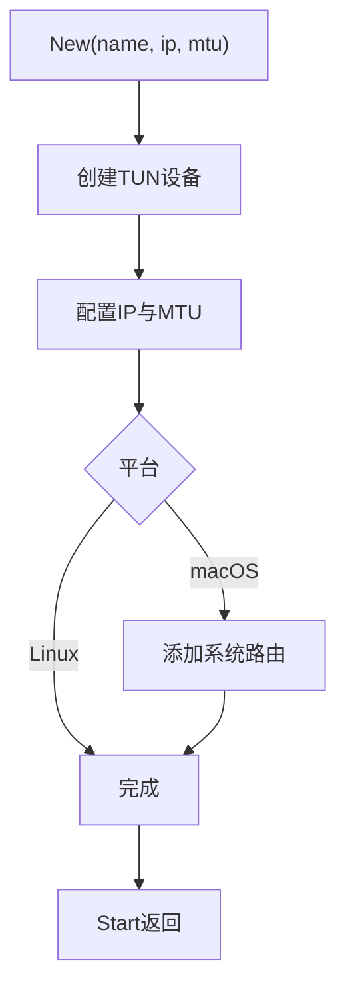
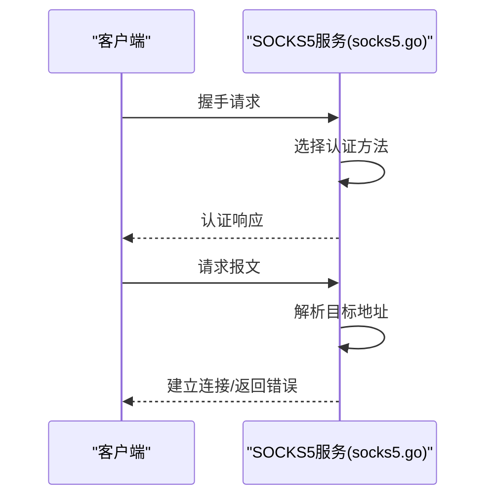
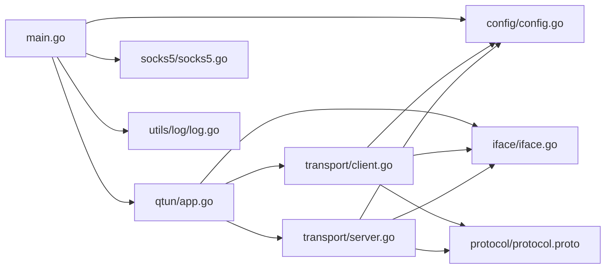

# 开发指南

<cite>
**本文引用的文件**
- [README.md](file://README.md)
- [go.mod](file://go.mod)
- [Makefile](file://Makefile)
- [main.go](file://main.go)
- [config/config.go](file://config/config.go)
- [qtun/app.go](file://qtun/app.go)
- [transport/client.go](file://transport/client.go)
- [transport/server.go](file://transport/server.go)
- [iface/iface.go](file://iface/iface.go)
- [socks5/socks5.go](file://socks5/socks5.go)
- [utils/log/log.go](file://utils/log/log.go)
- [utils/hash.go](file://utils/hash.go)
- [protocol/protocol.proto](file://protocol/protocol.proto)
- [.vscode/settings.json](file://.vscode/settings.json)
</cite>

## 目录
1. [简介](#简介)
2. [项目结构](#项目结构)
3. [核心组件](#核心组件)
4. [架构总览](#架构总览)
5. [详细组件分析](#详细组件分析)
6. [依赖分析](#依赖分析)
7. [性能考虑](#性能考虑)
8. [故障排查指南](#故障排查指南)
9. [结论](#结论)
10. [附录](#附录)

## 简介
本指南面向Qtun项目的开发者，提供从环境搭建、代码结构、模块职责、调试与测试到构建与发布的完整开发流程说明。项目基于Go语言，采用QUIC作为传输层，结合TUN虚拟网卡实现跨平台安全隧道。当前仓库提供命令行入口、配置管理、传输层（客户端/服务端）、网络接口抽象、SOCKS5代理以及日志与工具模块。

## 项目结构
项目采用按功能域分层的组织方式，主要模块如下：
- 入口与CLI：main.go负责命令解析、参数绑定与应用初始化
- 配置中心：config包提供全局配置单例
- 应用主控：qtun/app.go协调TUN接口、传输层与路由表
- 传输层：transport包实现QUIC客户端/服务端连接与数据收发
- 接口抽象：iface包封装TUN设备的创建与读写
- 协议定义：protocol包定义消息体与生成的协议代码
- SOCKS5代理：socks5包实现SOCKS5服务端
- 工具与日志：utils包提供日志、哈希与错误处理工具
- 构建与运行：Makefile提供多平台构建目标；README提供运行示例

图表来源
- [main.go](file://main.go#L1-L136)
- [config/config.go](file://config/config.go#L1-L24)
- [qtun/app.go](file://qtun/app.go#L1-L271)
- [transport/client.go](file://transport/client.go#L1-L223)
- [transport/server.go](file://transport/server.go#L1-L219)
- [iface/iface.go](file://iface/iface.go#L1-L105)
- [socks5/socks5.go](file://socks5/socks5.go#L1-L170)
- [utils/log/log.go](file://utils/log/log.go#L1-L26)
- [utils/hash.go](file://utils/hash.go#L1-L42)
- [protocol/protocol.proto](file://protocol/protocol.proto#L1-L22)

章节来源
- [README.md](file://README.md#L1-L99)
- [go.mod](file://go.mod#L1-L29)
- [Makefile](file://Makefile#L1-L23)

## 核心组件
- 命令行与入口
  - main.go通过gcli框架定义命令与选项，初始化日志与配置，按模式启动SOCKS5或HTTP文件服务器，并创建qtun应用实例运行
- 配置中心
  - config包提供Config结构体与全局单例，InitConfig用于注入参数，GetInstance用于各模块访问
- 应用主控
  - qtun/app.go负责：
    - 服务端：创建QUIC服务监听，维护路由表，清理死连接
    - 客户端：创建多个传输连接，周期性发送Ping，转发TUN数据包
    - TUN：动态创建工作线程读取/写入TUN数据包，按路由转发
    - 系统代理：在macOS上自动设置系统代理PAC
- 传输层
  - 客户端：支持多连接并发，轮询选择连接发送数据，定期Ping保持活跃
  - 服务端：基于QUIC监听，使用sync.Map优化并发读写，维护连接映射
- 接口抽象
  - iface封装TUN设备创建、IP配置、路由添加与读写
- 协议定义
  - protocol.proto定义Envelope、MessagePing、MessagePacket三类消息
- SOCKS5代理
  - socks5.go实现SOCKS5握手、认证、请求处理与连接管理
- 日志与工具
  - utils/log提供日志初始化与级别控制
  - utils/hash提供常用摘要与编码工具

章节来源
- [main.go](file://main.go#L22-L103)
- [config/config.go](file://config/config.go#L3-L24)
- [qtun/app.go](file://qtun/app.go#L19-L97)
- [transport/client.go](file://transport/client.go#L20-L83)
- [transport/server.go](file://transport/server.go#L23-L52)
- [iface/iface.go](file://iface/iface.go#L16-L74)
- [protocol/protocol.proto](file://protocol/protocol.proto#L5-L22)
- [socks5/socks5.go](file://socks5/socks5.go#L53-L118)
- [utils/log/log.go](file://utils/log/log.go#L10-L25)
- [utils/hash.go](file://utils/hash.go#L37-L41)

## 架构总览
下图展示Qtun的运行时交互：客户端与服务端通过QUIC建立连接，客户端将TUN数据包封装为协议消息发送至服务端，服务端根据路由表转发回TUN；同时，服务端可启动SOCKS5服务供客户端代理使用。

图表来源
- [main.go](file://main.go#L75-L103)
- [qtun/app.go](file://qtun/app.go#L37-L97)
- [transport/client.go](file://transport/client.go#L41-L83)
- [transport/server.go](file://transport/server.go#L48-L149)
- [iface/iface.go](file://iface/iface.go#L98-L104)
- [socks5/socks5.go](file://socks5/socks5.go#L99-L118)

## 详细组件分析

### 应用主控（qtun/app.go）
- 职责
  - 依据ServerMode选择启动路径：服务端创建QUIC监听并维护路由表；客户端创建多连接并设置系统代理
  - 动态创建工作线程处理TUN数据包，最小化锁持有时间，提升吞吐
  - 维护路由表，定时清理失效连接
- 关键流程
  - 启动流程：根据模式创建传输组件，启动TUN接口，启动工作线程
  - 数据路径：TUN读取 -> 协议封装 -> 传输发送；接收路径相反
  - 路由更新：服务端收到Ping后更新路由表，客户端忽略Ping
- 并发与性能
  - 使用RWMutex保护路由表，读多写少场景下降低竞争
  - 工作线程数量为CPU核数的2倍，范围限制在4~32之间

图表来源
- [qtun/app.go](file://qtun/app.go#L37-L167)

章节来源
- [qtun/app.go](file://qtun/app.go#L19-L97)
- [qtun/app.go](file://qtun/app.go#L169-L248)

### 传输层（transport/client.go 与 transport/server.go）
- 客户端
  - 多连接并发：根据threads创建多个ClientConn，启动后轮询选择连接发送数据
  - Ping机制：每秒发送Ping，携带本地地址与VIP，用于服务端建立路由
  - 连接健康：重试连接，失败时记录警告并等待重建
- 服务端
  - QUIC监听：使用quic-go监听指定地址，配置流窗口与保活周期
  - 并发模型：使用sync.Map存储连接映射，支持无锁读写
  - 连接管理：维护正向与反向映射，断开时清理

图表来源
- [transport/client.go](file://transport/client.go#L20-L83)
- [transport/server.go](file://transport/server.go#L23-L52)

章节来源
- [transport/client.go](file://transport/client.go#L31-L83)
- [transport/client.go](file://transport/client.go#L142-L206)
- [transport/server.go](file://transport/server.go#L37-L52)
- [transport/server.go](file://transport/server.go#L91-L149)

### 接口抽象（iface/iface.go）
- 职责
  - 创建TUN设备，配置IP与MTU，必要时添加系统路由
  - 提供Read/Write方法供上层读写TUN数据包
- 平台差异
  - macOS与Linux在ifconfig参数上略有差异，且macOS需要额外添加路由

图表来源
- [iface/iface.go](file://iface/iface.go#L31-L74)

章节来源
- [iface/iface.go](file://iface/iface.go#L16-L74)

### 协议定义（protocol/protocol.proto）
- 消息类型
  - Envelope：承载Ping或Packet两类消息
  - MessagePing：包含时间戳、本地地址、私有地址、VIP与机房标识
  - MessagePacket：承载原始IP数据包字节
- 生成代码
  - 通过protoc生成protocol.pb.go，供客户端与服务端序列化/反序列化

章节来源
- [protocol/protocol.proto](file://protocol/protocol.proto#L5-L22)

### SOCKS5代理（socks5/socks5.go）
- 职责
  - 实现SOCKS5握手、认证、请求解析与连接处理
  - 支持无认证与用户名密码认证，提供规则集与地址重写扩展点
- 生命周期
  - ListenAndServe/Serve/ServeConn形成完整的连接生命周期

图表来源
- [socks5/socks5.go](file://socks5/socks5.go#L109-L169)

章节来源
- [socks5/socks5.go](file://socks5/socks5.go#L53-L118)
- [socks5/socks5.go](file://socks5/socks5.go#L120-L170)

### 日志与工具（utils/log/log.go 与 utils/hash.go）
- 日志
  - 初始化控制台输出，支持Info/Debug级别切换
- 工具
  - 提供SHA1/SHA256/MD5、Hex/B64编码与POE（panic-on-error）辅助

章节来源
- [utils/log/log.go](file://utils/log/log.go#L10-L25)
- [utils/hash.go](file://utils/hash.go#L11-L41)

## 依赖分析
- 版本与依赖
  - Go版本：1.24.0
  - 主要依赖：quic-go、water(TUN)、zerolog、gcli等
- 模块耦合
  - main.go依赖config、qtun、socks5、fileserver与utils/log
  - qtun/app.go依赖config、iface、protocol、transport与utils/timer
  - transport依赖config、iface、protocol与utils
  - iface依赖water
  - protocol为独立消息定义

图表来源
- [main.go](file://main.go#L15-L20)
- [qtun/app.go](file://qtun/app.go#L10-L17)
- [transport/client.go](file://transport/client.go#L11-L18)
- [transport/server.go](file://transport/server.go#L18-L21)
- [protocol/protocol.proto](file://protocol/protocol.proto#L3)

章节来源
- [go.mod](file://go.mod#L3-L28)

## 性能考虑
- 并发与锁
  - 服务端使用sync.Map替代互斥锁，减少高并发下的锁竞争
  - 路由表使用RWMutex，读多写少场景下降低写锁开销
- I/O与工作线程
  - TUN工作线程数为CPU核数的2倍，范围限制在4~32，平衡I/O并行与资源消耗
- QUIC配置
  - 设置较大的最大流数与接收窗口，启用保活与datagram，提升吞吐与稳定性
- 序列化优化
  - 客户端对Envelope/Ping/Packet进行对象池复用，减少GC压力

章节来源
- [transport/server.go](file://transport/server.go#L31-L44)
- [qtun/app.go](file://qtun/app.go#L79-L96)
- [transport/server.go](file://transport/server.go#L97-L103)
- [transport/client.go](file://transport/client.go#L184-L206)

## 故障排查指南
- 启动权限
  - TUN与系统代理设置需管理员权限，若提示权限不足，请以sudo运行
- 网络连通性
  - 客户端无法连接服务端：检查remote_addrs与server listen地址、防火墙与NAT
  - Ping未达：确认客户端threads与服务端路由表更新正常
- 日志级别
  - 将log_level调整为debug以获取更详细的日志
- 平台差异
  - Linux/macOS系统代理设置不同，Linux需手动配置代理
- 常见错误定位
  - TUN接口创建失败：检查内核模块与ifconfig参数
  - QUIC握手失败：检查证书生成与端口占用

章节来源
- [README.md](file://README.md#L13-L26)
- [qtun/app.go](file://qtun/app.go#L250-L270)
- [utils/log/log.go](file://utils/log/log.go#L14-L21)

## 结论
Qtun通过清晰的模块划分与高效的并发设计，在保证易用性的同时提供了良好的性能与可扩展性。建议开发者遵循本文档的环境与构建流程，结合日志与测试策略进行迭代开发。

## 附录

### 开发环境搭建
- Go版本
  - 使用Go 1.24.0（go.mod声明）
- 依赖安装
  - 直接执行go mod下载依赖
- IDE配置
  - VS Code：已提供settings.json，可按需调整
- 运行与帮助
  - 参考README中的运行示例与帮助信息

章节来源
- [go.mod](file://go.mod#L3)
- [README.md](file://README.md#L11-L11)
- [.vscode/settings.json](file://.vscode/settings.json)

### 代码贡献指南
- 编码规范
  - 使用Go官方fmt与vet工具，保持一致的代码风格
  - 日志使用zerolog，避免直接使用标准库log
- 提交规范
  - 提交信息简洁明确，描述变更目的与影响
- Pull Request流程
  - 在分支上开发，提交PR前确保通过测试与格式校验

### 调试技巧与开发工具
- 断点调试
  - 使用VS Code或Delve进行断点调试
- 性能分析
  - 可启用pprof与statsviz，默认保留相关入口，便于本地分析
- 内存检测
  - 使用go test -race与go test -bench进行竞态与基准测试

章节来源
- [main.go](file://main.go#L118-L129)
- [README.md](file://README.md#L90-L93)

### 测试策略与用例编写
- 单元测试
  - socks5包提供认证与请求处理的测试样例，可参考其断言与模拟方式
- 集成测试
  - 建议在本地启动服务端与客户端，验证TUN数据包转发与路由建立
- 性能测试
  - 参考项目提供的性能测试指南文档

章节来源
- [socks5/auth_test.go](file://socks5/auth_test.go#L8-L27)
- [socks5/auth_test.go](file://socks5/auth_test.go#L29-L65)
- [socks5/auth_test.go](file://socks5/auth_test.go#L67-L92)
- [socks5/auth_test.go](file://socks5/auth_test.go#L94-L120)

### 构建与打包流程
- 本地构建
  - 使用make build生成二进制
- 多平台交叉编译
  - make linux、make windows、make arm、make m4分别生成对应平台二进制
- 发布准备
  - 准备静态资源与PAC文件，确保HTTP文件服务器端口与路径正确

章节来源
- [Makefile](file://Makefile#L3-L22)
- [README.md](file://README.md#L21-L26)