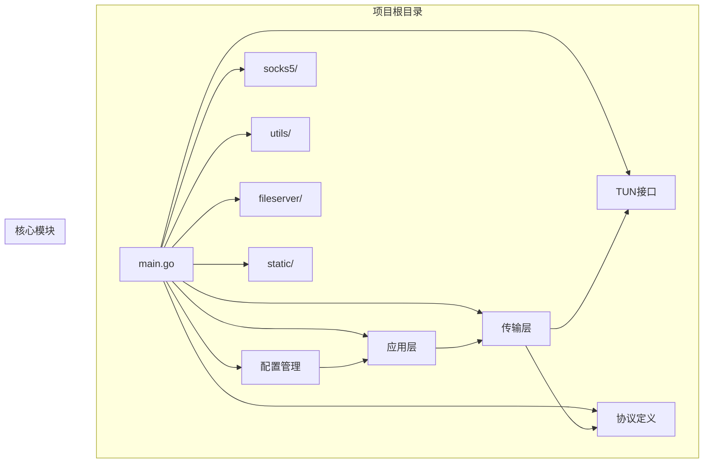
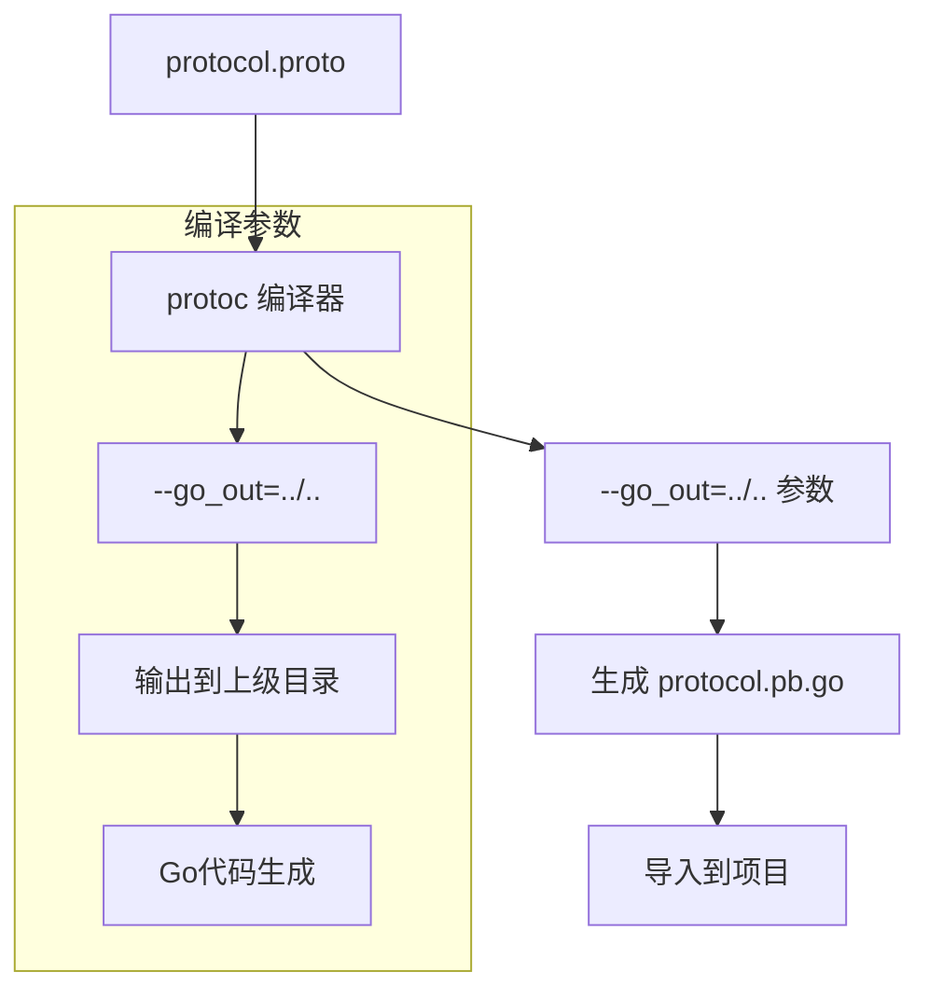
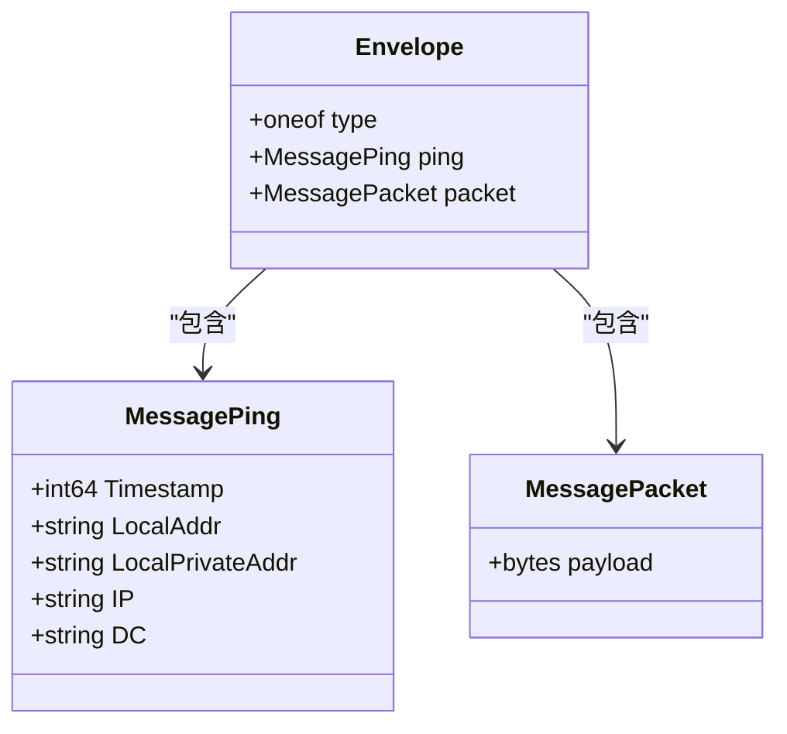
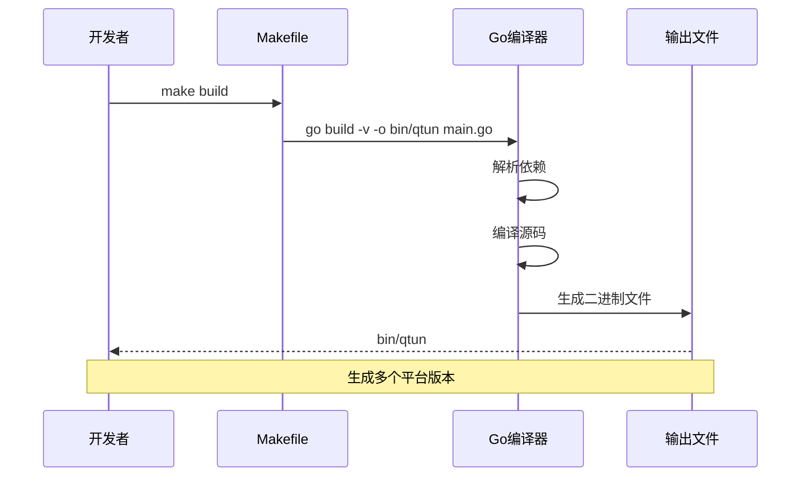
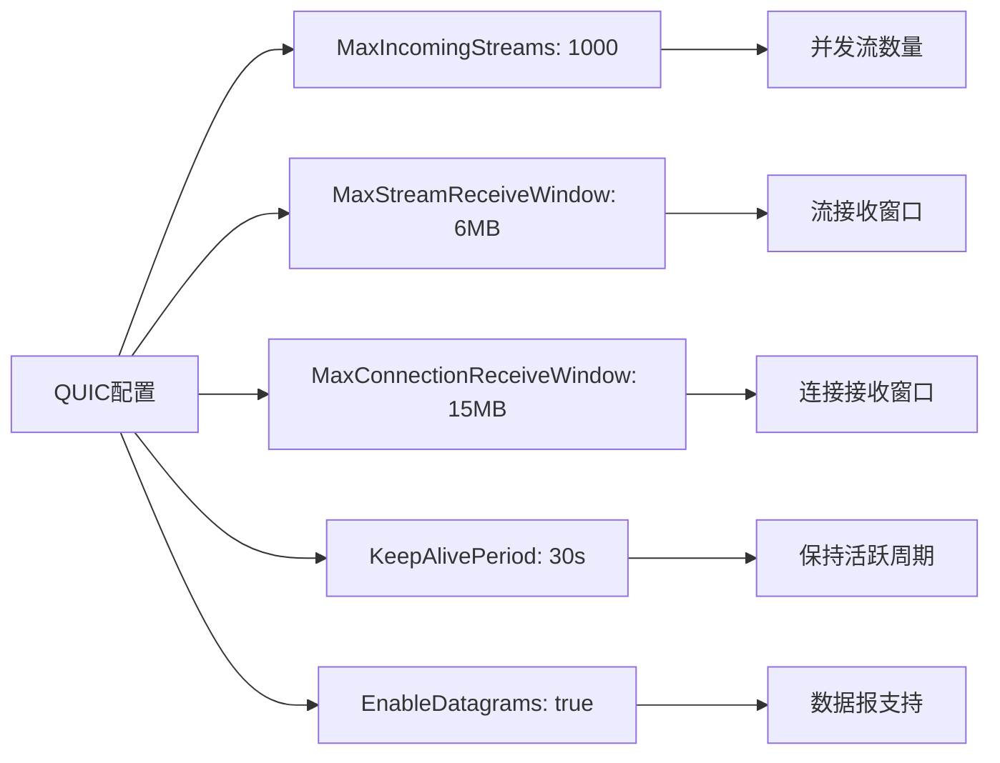
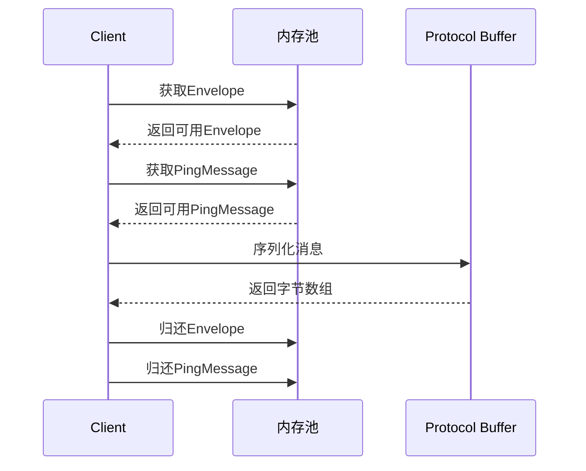

# 开发环境搭建

<cite>
**本文档引用的文件**
- [go.mod](file://go.mod)
- [go.sum](file://go.sum)
- [README.md](file://README.md)
- [Makefile](file://Makefile)
- [main.go](file://main.go)
- [protocol.proto](file://protocol/protocol.proto)
- [.vscode/settings.json](file://.vscode/settings.json)
- [config.go](file://config/config.go)
- [app.go](file://qtun/app.go)
- [client.go](file://transport/client.go)
- [server.go](file://transport/server.go)
</cite>

## 目录
1. [简介](#简介)
2. [项目结构](#项目结构)
3. [Go语言版本要求](#go语言版本要求)
4. [依赖管理工具安装](#依赖管理工具安装)
5. [项目克隆与初始化](#项目克隆与初始化)
6. [核心依赖项详解](#核心依赖项详解)
7. [IDE配置建议](#ide配置建议)
8. [Protocol Buffer编译器安装与使用](#protocol-buffer编译器安装与使用)
9. [构建与运行](#构建与运行)
10. [常见环境问题排查](#常见环境问题排查)
11. [性能优化配置](#性能优化配置)
12. [总结](#总结)

## 简介

Qtun是一个基于QUIC协议的安全隧道项目，支持多IP管道传输。该项目采用Go语言开发，使用quic-go作为QUIC协议栈，water库进行TUN接口管理，gcli库提供命令行界面功能。

## 项目结构



**图表来源**
- [main.go](file://main.go#L1-L136)
- [config/config.go](file://config/config.go#L1-L24)

**章节来源**
- [main.go](file://main.go#L1-L136)
- [go.mod](file://go.mod#L1-L29)

## Go语言版本要求

### 当前版本要求

根据项目配置，当前Go版本要求为：
- **Go 1.24.0**（项目文件中明确指定）

### 历史版本兼容性

从README文档可以看到历史版本要求：
- **Go 1.19**（文档中提到）
- **Go 1.19+**（推荐版本）

### 版本选择建议

由于项目同时存在Go 1.19要求和1.24.0配置，建议：
1. 使用Go 1.24.0或更高版本以确保兼容性
2. 如果必须使用较低版本，需验证所有依赖项的兼容性

**章节来源**
- [go.mod](file://go.mod#L3-L3)
- [README.md](file://README.md#L11-L11)

## 依赖管理工具安装

### Go模块系统

项目使用Go 1.11+引入的模块系统进行依赖管理，无需额外的依赖管理工具。

### 依赖下载

```bash
# 下载所有依赖
go mod download

# 查看依赖树
go list -m -versions all

# 更新特定依赖
go get github.com/quic-go/quic-go@v0.54.0
```

### 代理配置

项目提供了加速模块下载的代理配置：
```bash
go env -w GOPROXY=https://goproxy.io,direct
```

**章节来源**
- [go.mod](file://go.mod#L1-L29)
- [README.md](file://README.md#L91-L91)

## 项目克隆与初始化

### 克隆项目

```bash
# 克隆项目
git clone https://github.com/matthewgao/qtun.git
cd qtun

# 设置代理（可选）
go env -w GOPROXY=https://goproxy.io,direct
```

### 初始化依赖

```bash
# 下载依赖
go mod tidy

# 验证依赖完整性
go mod verify
```

**章节来源**
- [README.md](file://README.md#L1-L99)
- [go.mod](file://go.mod#L1-L29)

## 核心依赖项详解

### 主要依赖列表

项目的核心依赖包括：

| 依赖包 | 版本 | 用途 |
|--------|------|------|
| github.com/quic-go/quic-go | v0.54.0 | QUIC协议实现 |
| github.com/songgao/water | v0.0.0-20190725173103-fd331bda3f4b | TUN接口管理 |
| github.com/gookit/gcli/v2 | v2.1.0 | 命令行界面框架 |
| github.com/golang/protobuf | v1.5.2 | Protocol Buffer支持 |
| github.com/rs/zerolog | v1.17.2 | 结构化日志记录 |

### 间接依赖

项目还包含多个间接依赖，主要用于：
- 网络工具：golang.org/x/net, golang.org/x/sys
- 加密库：golang.org/x/crypto
- 并发工具：golang.org/x/sync
- 测试框架：github.com/stretchr/testify

### 依赖版本锁定

项目使用go.mod和go.sum文件锁定依赖版本，确保构建的一致性和可重复性。

**章节来源**
- [go.mod](file://go.mod#L5-L28)
- [go.sum](file://go.sum#L1-L82)

## IDE配置建议

### VS Code配置

项目已提供VS Code配置文件，包含以下设置：

```json
{
    "go.formatTool": "goimports",
    "go.useLanguageServer": true,
    "go.languageServerFlags": ["-rpc.trace"],
    "go.languageServerExperimentalFeatures": {
        "format": true,
        "autoComplete": true,
        "rename": true,
        "goToDefinition": true,
        "hover": true,
        "signatureHelp": true,
        "goToTypeDefinition": true,
        "goToImplementation": true,
        "documentSymbols": true,
        "workspaceSymbols": true,
        "findReferences": true
    }
}
```

### 推荐VS Code扩展

1. **Go扩展**（golang.go）
   - 提供完整的Go语言开发体验
   - 支持代码补全、语法高亮、调试

2. **Protocol Buffers扩展**
   - 支持.proto文件语法高亮
   - 提供Protocol Buffer相关功能

3. **Go Outliner**
   - 显示函数和变量层次结构

### 调试配置

创建`.vscode/launch.json`文件：

```json
{
    "version": "0.2.0",
    "configurations": [
        {
            "name": "Qtun Server",
            "type": "go",
            "request": "launch",
            "mode": "exec",
            "program": "${workspaceFolder}/bin/qtun",
            "args": ["qt", "--key", "test-key", "--listen", "0.0.0.0:8080", "--ip", "10.4.4.2/24", "--server_mode"],
            "env": {},
            "showLog": true
        },
        {
            "name": "Qtun Client",
            "type": "go",
            "request": "launch",
            "mode": "exec",
            "program": "${workspaceFolder}/bin/qtun",
            "args": ["qt", "--key", "test-key", "--remote_addrs", "127.0.0.1:8080", "--ip", "10.4.4.3/24"],
            "env": {},
            "showLog": true
        }
    ]
}
```

**章节来源**
- [.vscode/settings.json](file://.vscode/settings.json#L1-L23)
- [main.go](file://main.go#L22-L68)

## Protocol Buffer编译器安装与使用

### 安装Protocol Buffer编译器

#### Ubuntu/Debian系统
```bash
# 添加PPA源
sudo add-apt-repository ppa:maarten-fonville/protobuf
sudo apt-get update
sudo apt-get install protobuf-compiler

# 安装Go插件
go install github.com/golang/protobuf/protoc-gen-go@latest
```

#### macOS系统
```bash
# 使用Homebrew安装
brew install protobuf

# 安装Go插件
go install github.com/golang/protobuf/protoc-gen-go@latest
```

#### Windows系统
```cmd
# 使用Chocolatey安装
choco install protoc

# 安装Go插件
go install github.com/golang/protobuf/protoc-gen-go@latest
```

### 编译Protocol Buffer文件

项目提供专门的Makefile用于编译：

```bash
# 进入protocol目录
cd protocol

# 编译proto文件
make build

# 准备编译环境
make prepare
```

### 编译流程说明



**图表来源**
- [protocol/Makefile](file://protocol/Makefile#L1-L7)
- [protocol.proto](file://protocol/protocol.proto#L1-L22)

### Protocol Buffer消息定义

项目定义了以下核心消息类型：



**图表来源**
- [protocol.proto](file://protocol/protocol.proto#L5-L22)

**章节来源**
- [protocol/Makefile](file://protocol/Makefile#L1-L7)
- [protocol.proto](file://protocol/protocol.proto#L1-L22)

## 构建与运行

### 本地构建

项目提供多种构建选项：

```bash
# 基础构建
make build

# Windows构建
make windows

# Linux构建
make linux

# Linux 32位构建
make linux-i686

# ARM架构构建
make arm

# Apple M4芯片构建
make m4

# 获取依赖
make deps
```

### 跨平台编译

项目支持多种目标平台的交叉编译：

| 目标平台 | 环境变量 | 构建命令 |
|----------|----------|----------|
| Windows | GOOS=windows, GOARCH=amd64 | `make windows` |
| Linux | GOOS=linux, GOARCH=amd64 | `make linux` |
| Linux 32位 | GOOS=linux, GOARCH=386 | `make linux-i686` |
| ARM | GOOS=linux, GOARCH=arm, GOARM=7 | `make arm` |
| Apple M4 | GOOS=darwin, GOARCH=arm64 | `make m4` |

### 运行示例

#### 服务器模式
```bash
cd bin/
sudo ./qtun qt --key "hahaha" --listen "0.0.0.0:8080" --ip "10.4.4.2/24" --server_mode
```

#### 客户端模式
```bash
cd bin/
sudo ./qtun qt --key "hahaha" --remote_addrs "8.8.8.80:8080" --ip "10.4.4.3/24"
```

### 构建流程详解



**图表来源**
- [Makefile](file://Makefile#L3-L22)
- [main.go](file://main.go#L131-L136)

**章节来源**
- [Makefile](file://Makefile#L1-L23)
- [README.md](file://README.md#L13-L26)

## 常见环境问题排查

### GOPATH配置问题

**问题症状**：
- 导入包时出现"cannot find package"错误
- 依赖无法正确解析

**解决方案**：
1. 检查Go模块模式
```bash
go env GO111MODULE
```

2. 确保在项目根目录执行命令
```bash
cd qtun
go mod tidy
```

3. 清理缓存重新下载
```bash
go clean -cache
go mod tidy
```

### CGO设置问题

**问题症状**：
- 编译时出现CGO相关错误
- TUN接口功能异常

**解决方案**：
1. 检查CGO启用状态
```bash
go env CGO_ENABLED
```

2. 在Linux系统上可能需要安装编译工具
```bash
# Ubuntu/Debian
sudo apt-get install build-essential

# CentOS/RHEL
sudo yum groupinstall "Development Tools"
```

3. 验证TUN设备权限
```bash
# 检查TUN设备是否存在
ls -la /dev/net/tun

# 创建设备节点（如果不存在）
sudo mkdir -p /dev/net && sudo mknod /dev/net/tun c 10 200
```

### 跨平台编译环境准备

**macOS M4芯片问题**：
```bash
# 检查架构支持
uname -m

# 设置正确的架构
export GOARCH=arm64
```

**Windows编译问题**：
```cmd
# 启用WSL2或安装MinGW
# 或使用Windows Subsystem for Linux
```

### 网络权限问题

**问题症状**：
- 无法绑定到低端口
- QUIC连接失败

**解决方案**：
1. 使用sudo运行或调整端口
```bash
# 使用非特权端口
./qtun qt --listen "127.0.0.1:8080"
```

2. 配置端口转发（可选）
```bash
sudo iptables -t nat -A PREROUTING -p tcp --dport 80 -j REDIRECT --to-port 8080
```

### 依赖版本冲突

**问题症状**：
- 编译时报错显示版本不匹配
- 运行时panic

**解决方案**：
1. 清理依赖缓存
```bash
go clean -modcache
```

2. 强制更新依赖
```bash
go get -u
go mod tidy
```

3. 检查依赖版本兼容性
```bash
go list -m -versions github.com/quic-go/quic-go
```

**章节来源**
- [README.md](file://README.md#L91-L99)
- [transport/server.go](file://transport/server.go#L97-L103)

## 性能优化配置

### QUIC参数调优

项目中QUIC配置参数经过优化：



**图表来源**
- [transport/server.go](file://transport/server.go#L97-L103)

### 并发处理优化

应用层采用动态工作线程数：

```mermaid
flowchart TD
A[CPU核心数] --> B[runtime.NumCPU()]
B --> C[工作线程数 = CPU核心数 × 2]
C --> D{限制范围}
D --> |小于4| E[设置为4]
D --> |大于32| F[设置为32]
D --> |4-32之间| G[保持原值]
E --> H[最小工作线程数]
F --> I[最大工作线程数]
G --> J[实际工作线程数]
```

**图表来源**
- [qtun/app.go](file://qtun/app.go#L79-L87)

### 内存池优化

项目实现了Protocol Buffer消息的内存池：



**图表来源**
- [transport/client.go](file://transport/client.go#L184-L206)

**章节来源**
- [transport/server.go](file://transport/server.go#L97-L103)
- [qtun/app.go](file://qtun/app.go#L79-L97)
- [transport/client.go](file://transport/client.go#L184-L206)

## 总结

Qtun项目的开发环境搭建相对简单，主要需要注意以下几点：

1. **Go版本**：建议使用Go 1.24.0或更高版本
2. **依赖管理**：项目使用Go模块系统，无需额外工具
3. **Protocol Buffer**：需要安装protoc编译器和Go插件
4. **跨平台**：支持多平台交叉编译，注意各平台的特殊要求
5. **权限**：运行时需要管理员权限访问TUN设备
6. **网络**：确保防火墙允许QUIC流量通过

按照本指南的步骤，您应该能够成功搭建Qtun项目的开发环境并开始开发工作。如果遇到任何问题，请参考常见环境问题排查部分。