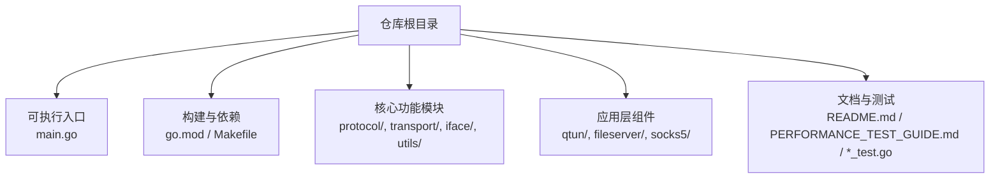
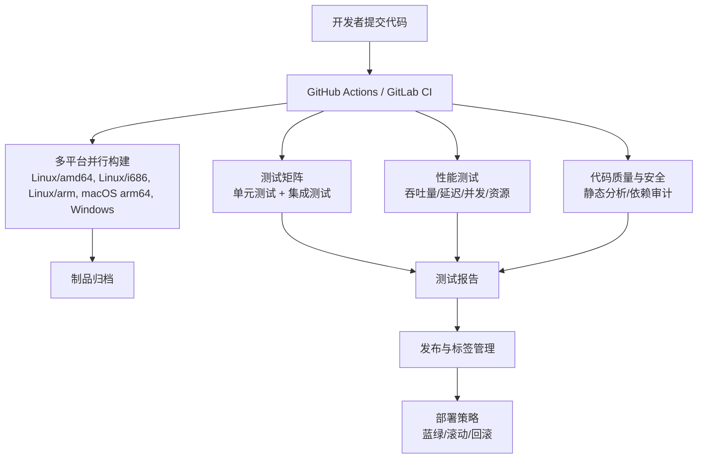
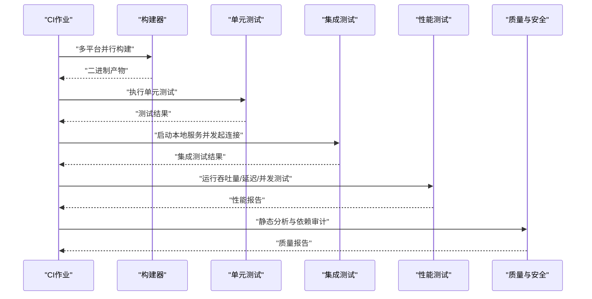
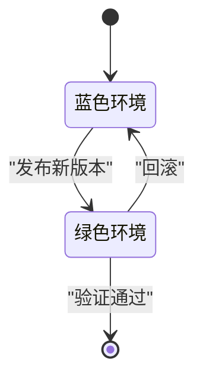
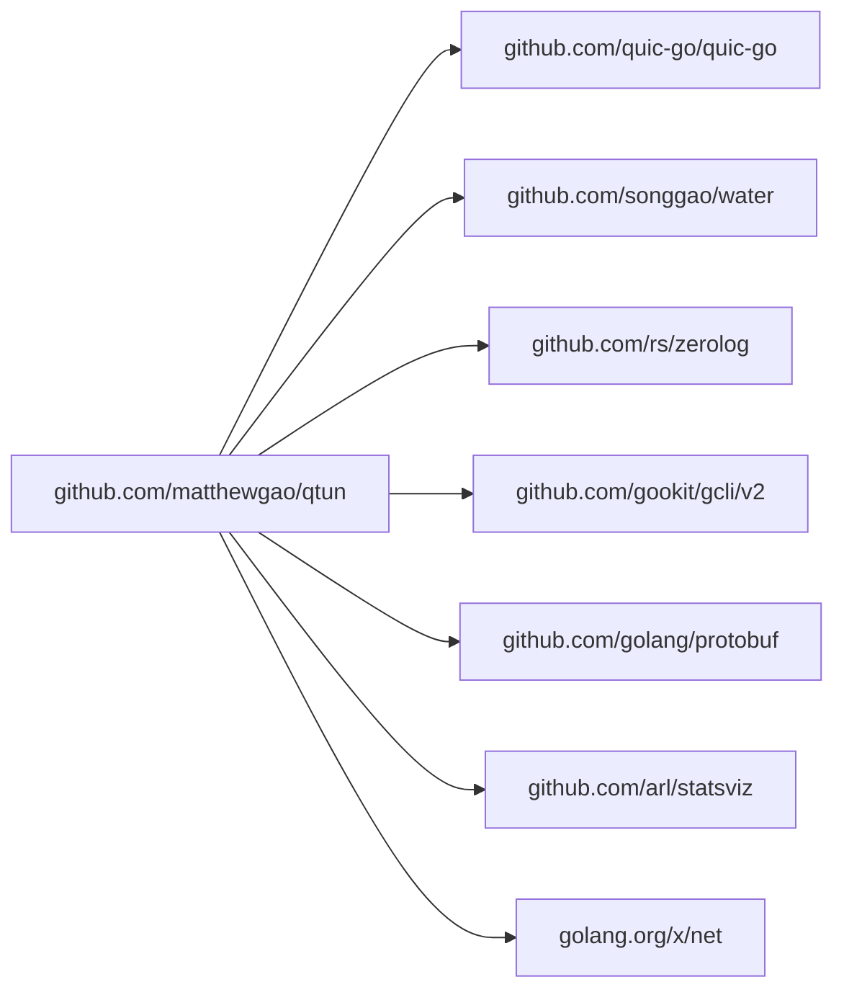

# CI/CD集成

<cite>
**本文引用的文件**
- [README.md](file://README.md)
- [go.mod](file://go.mod)
- [Makefile](file://Makefile)
- [main.go](file://main.go)
- [socks5/socks5_test.go](file://socks5/socks5_test.go)
- [socks5/auth_test.go](file://socks5/auth_test.go)
- [socks5/request_test.go](file://socks5/request_test.go)
- [PERFORMANCE_TEST_GUIDE.md](file://PERFORMANCE_TEST_GUIDE.md)
</cite>

## 目录
1. [简介](#简介)
2. [项目结构](#项目结构)
3. [核心组件](#核心组件)
4. [架构总览](#架构总览)
5. [详细组件分析](#详细组件分析)
6. [依赖关系分析](#依赖关系分析)
7. [性能考虑](#性能考虑)
8. [故障排查指南](#故障排查指南)
9. [结论](#结论)
10. [附录](#附录)

## 简介
本指南面向Qtun项目，提供跨平台CI/CD集成方案，覆盖GitHub Actions与GitLab CI两大主流平台。内容包括：
- 多平台并行构建与测试自动化
- 单元测试、集成测试与性能测试的流水线设计
- 持续部署策略（蓝绿部署、滚动更新、回滚机制）
- 代码质量检查、安全扫描与依赖审计
- 发布标签管理、变更日志生成与版本号自动化

## 项目结构
Qtun为Go语言实现的QUIC隧道工具，具备TUN与SOCKS5代理能力。项目采用模块化组织，核心入口位于主程序，功能分布在协议、传输、接口与工具包等子模块；测试集中在socks5子包。

图示来源
- [main.go](file://main.go#L1-L136)
- [go.mod](file://go.mod#L1-L29)
- [Makefile](file://Makefile#L1-L23)

章节来源
- [README.md](file://README.md#L1-L99)
- [go.mod](file://go.mod#L1-L29)
- [Makefile](file://Makefile#L1-L23)

## 核心组件
- 可执行入口与命令行解析：负责初始化日志、解析参数、启动TUN或SOCKS5服务，并根据模式选择性启动文件服务器。
- 构建系统：提供多平台二进制构建目标，便于CI产出跨平台产物。
- 测试体系：包含SOCKS5认证、请求处理与规则校验的单元测试，支撑集成测试与性能测试前置条件。

章节来源
- [main.go](file://main.go#L22-L103)
- [Makefile](file://Makefile#L3-L22)
- [socks5/socks5_test.go](file://socks5/socks5_test.go#L14-L110)
- [socks5/auth_test.go](file://socks5/auth_test.go#L8-L119)
- [socks5/request_test.go](file://socks5/request_test.go#L26-L99)

## 架构总览
下图展示CI流水线在不同阶段的职责与交互，从代码检出到制品分发与部署。

## 详细组件分析

### GitHub Actions 集成要点
- 触发策略：建议在push到分支或PR时触发，release时额外触发发布流程。
- 并行构建：利用矩阵策略对Linux/amd64、Linux/i686、Linux/arm、Darwin/arm64、Windows进行并行构建。
- 测试自动化：在构建成功后执行go test，覆盖socks5等关键模块。
- 性能测试：在专用作业中运行iperf3、ping等基准测试，采集pprof与statsviz指标。
- 安全与质量：集成静态分析与依赖审计工具，确保依赖版本与漏洞风险可控。
- 发布与部署：基于标签创建Release，上传多平台二进制与安装脚本；结合部署策略完成蓝绿/滚动/回滚。

### GitLab CI 集成要点
- 触发策略：默认分支保护与Merge Request触发；Release时触发发布作业。
- 并行构建：使用parallel策略在不同Runner上并行构建多平台二进制。
- 测试与性能：与GitHub Actions一致的测试矩阵与性能测试作业。
- 安全与质量：在CI中集成安全扫描与依赖审计。
- 发布与部署：通过Git标签触发Release，上传制品并执行部署策略。

### 测试自动化设计
- 单元测试：覆盖SOCKS5认证、请求处理与规则校验，确保代理核心逻辑正确。
- 集成测试：以本地监听器与SOCKS5服务组合，验证端到端连通性与认证流程。
- 性能测试：基于iperf3、ping与HTTP压测工具，结合pprof与statsviz输出性能报告。

图示来源
- [socks5/socks5_test.go](file://socks5/socks5_test.go#L14-L110)
- [socks5/auth_test.go](file://socks5/auth_test.go#L29-L91)
- [socks5/request_test.go](file://socks5/request_test.go#L26-L99)
- [PERFORMANCE_TEST_GUIDE.md](file://PERFORMANCE_TEST_GUIDE.md#L26-L109)

章节来源
- [socks5/socks5_test.go](file://socks5/socks5_test.go#L1-L111)
- [socks5/auth_test.go](file://socks5/auth_test.go#L1-L120)
- [socks5/request_test.go](file://socks5/request_test.go#L1-L170)
- [PERFORMANCE_TEST_GUIDE.md](file://PERFORMANCE_TEST_GUIDE.md#L1-L323)

### 持续部署策略
- 蓝绿部署：通过两套环境（蓝/绿）交替切换，新版本先在绿环境运行，验证通过后切换流量至绿，旧版本保留作为回滚备选。
- 滚动更新：按批次逐步替换实例，控制每批更新比例与健康检查阈值，降低单次更新风险。
- 回滚机制：记录每次发布版本与制品哈希，失败时快速回滚至上一稳定版本。

### 代码质量、安全与依赖审计
- 代码质量：集成静态分析工具，检查复杂度、未使用变量与潜在问题。
- 安全扫描：在CI中运行安全扫描，识别高危漏洞与不安全调用。
- 依赖审计：定期扫描依赖版本，发现已知漏洞并提示升级路径。

### 版本号与发布标签管理
- 版本号：从主程序版本信息与构建参数中读取，确保一致性。
- 标签管理：在CI中基于语义化版本创建标签并触发发布作业。
- 变更日志：自动生成变更日志，汇总本次发布的重要改动与修复。

章节来源
- [main.go](file://main.go#L105-L116)
- [README.md](file://README.md#L30-L49)

## 依赖关系分析
Qtun的Go模块依赖如下，建议在CI中固定版本并定期同步更新：

图示来源
- [go.mod](file://go.mod#L5-L14)

章节来源
- [go.mod](file://go.mod#L1-L29)

## 性能考虑
- 并发与资源：通过pprof与statsviz监控CPU、内存、Goroutine与GC，定位热点与瓶颈。
- 压测工具：使用iperf3、ping与HTTP压测工具评估吞吐量、延迟与并发连接能力。
- 稳定性测试：长时间稳定性测试记录内存与Goroutine趋势，辅助优化与回归检测。

章节来源
- [PERFORMANCE_TEST_GUIDE.md](file://PERFORMANCE_TEST_GUIDE.md#L1-L323)

## 故障排查指南
- 构建失败：检查Go版本与依赖下载代理设置，确认多平台交叉编译环境可用。
- 测试失败：核对SOCKS5认证与请求处理的测试用例，确保本地监听与超时设置合理。
- 性能异常：检查pprof与statsviz输出，关注CPU占用、内存分配与Goroutine数量变化。
- 安全告警：根据安全扫描报告逐项修复高危漏洞，更新受影响依赖版本。

## 结论
通过在GitHub Actions与GitLab CI中实施上述CI/CD流程，Qtun可以实现高质量、可追溯、可回滚的持续交付。配合多平台并行构建、全面测试与性能验证，以及版本化发布与部署策略，能够显著提升开发效率与软件质量。

## 附录
- 构建目标参考：多平台二进制构建目标可直接映射到CI矩阵，确保每个平台产物齐全。
- 测试用例参考：SOCKS5相关测试为集成与性能测试提供基础保障。

章节来源
- [Makefile](file://Makefile#L6-L19)
- [socks5/socks5_test.go](file://socks5/socks5_test.go#L14-L110)
- [socks5/auth_test.go](file://socks5/auth_test.go#L29-L91)
- [socks5/request_test.go](file://socks5/request_test.go#L26-L99)