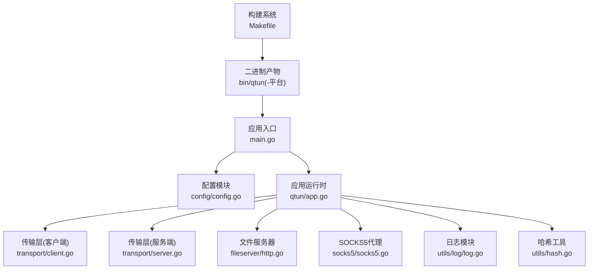
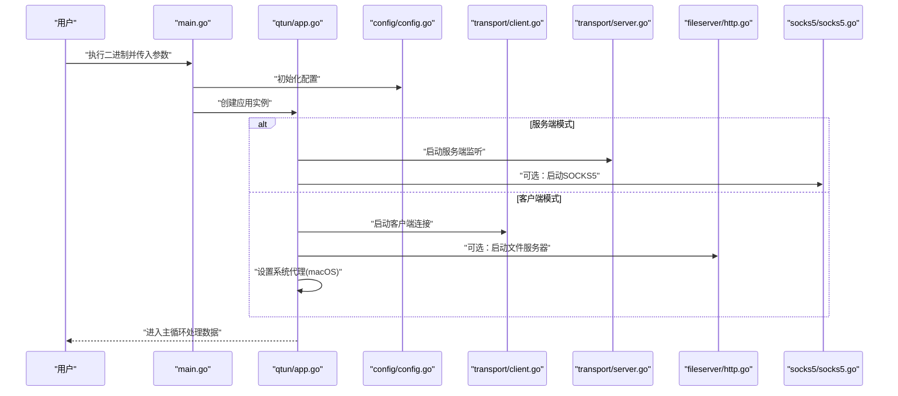
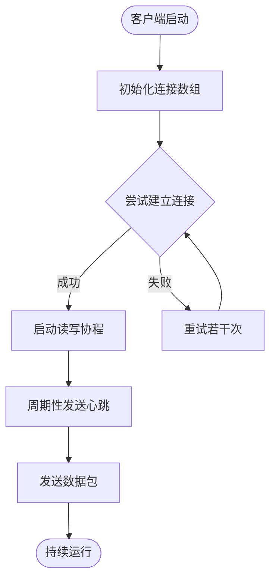
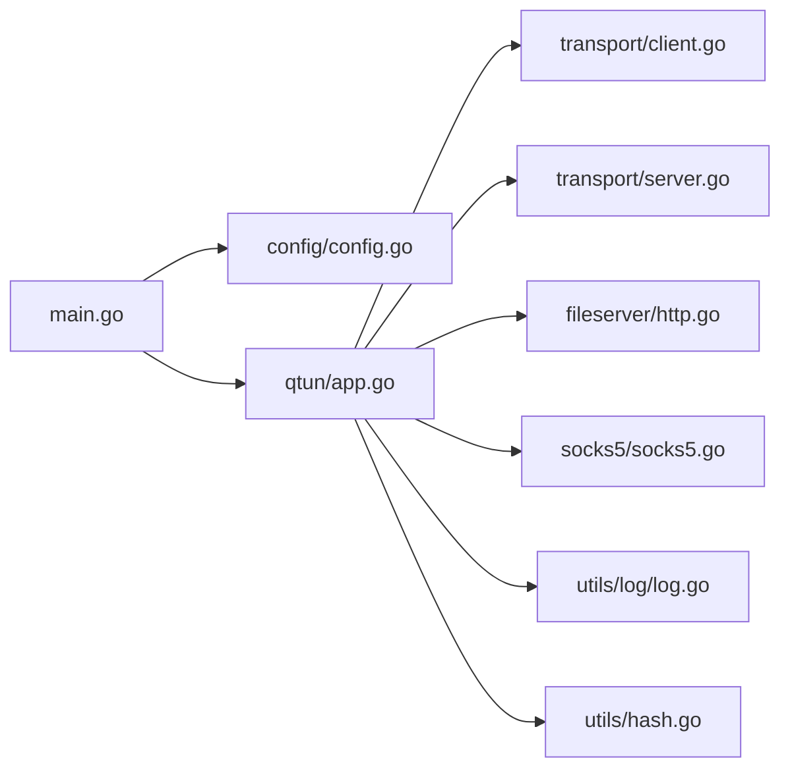

# 二进制分发

<cite>
**本文引用的文件**
- [Makefile](file://Makefile)
- [go.mod](file://go.mod)
- [main.go](file://main.go)
- [README.md](file://README.md)
- [config/config.go](file://config/config.go)
- [qtun/app.go](file://qtun/app.go)
- [fileserver/http.go](file://fileserver/http.go)
- [socks5/socks5.go](file://socks5/socks5.go)
- [utils/hash.go](file://utils/hash.go)
- [utils/log/log.go](file://utils/log/log.go)
- [transport/client.go](file://transport/client.go)
- [transport/server.go](file://transport/server.go)
</cite>

## 目录
1. [简介](#简介)
2. [项目结构](#项目结构)
3. [核心组件](#核心组件)
4. [架构总览](#架构总览)
5. [详细组件分析](#详细组件分析)
6. [依赖关系分析](#依赖关系分析)
7. [性能考量](#性能考量)
8. [故障排查指南](#故障排查指南)
9. [结论](#结论)
10. [附录](#附录)

## 简介
本指南面向Qtun项目的二进制分发与部署，围绕以下目标展开：统一管理与组织编译产物（可执行文件）、制定跨平台命名规范与存储结构、给出手动与自动化分发策略（含GitHub Releases、包管理器与容器镜像）、明确签名验证与完整性校验方法、提供部署脚本示例与批量部署最佳实践。文档内容严格基于仓库现有文件与构建脚本，确保可操作性与可追溯性。

## 项目结构
- 构建入口与产物输出
  - 根目录提供构建规则，通过环境变量组合生成多平台二进制，产物默认输出到bin目录，命名遵循“qtun-平台缩写”或“qtun-win”的约定。
  - 顶层README展示了在bin目录下直接运行二进制的方式，便于本地与CI/CD流水线复用。
- 模块化功能
  - 应用主程序负责命令行参数解析、日志初始化、服务启动与代理设置。
  - 配置模块提供全局配置读取与实例化。
  - 传输层采用QUIC实现，客户端与服务端分别负责连接建立、心跳与数据转发。
  - 文件服务器用于提供HTTP静态资源（如PAC文件）。
  - SOCKS5模块提供代理能力（仅在特定模式下启用）。



图表来源
- [Makefile](file://Makefile#L1-L23)
- [main.go](file://main.go#L1-L136)
- [config/config.go](file://config/config.go#L1-L24)
- [qtun/app.go](file://qtun/app.go#L1-L271)
- [transport/client.go](file://transport/client.go#L1-L200)
- [transport/server.go](file://transport/server.go#L1-L200)
- [fileserver/http.go](file://fileserver/http.go#L1-L17)
- [socks5/socks5.go](file://socks5/socks5.go#L1-L170)
- [utils/log/log.go](file://utils/log/log.go#L1-L26)
- [utils/hash.go](file://utils/hash.go#L1-L42)

章节来源
- [Makefile](file://Makefile#L1-L23)
- [README.md](file://README.md#L1-L99)

## 核心组件
- 构建与产物
  - 多平台构建：通过GOOS/GOARCH/GOARM等环境变量生成不同平台二进制，命名规则为“qtun-linux”“qtun-win”“qtun-arm”“qtun-m4”等，便于区分。
  - 产物位置：统一输出至bin目录，便于集中管理与发布。
- 命令行与版本
  - 应用内置版本号，可通过命令行查看版本信息，便于发布标签与版本追踪。
- 日志与诊断
  - 使用zerolog进行日志输出，支持按级别切换；应用还提供系统可视化接口（statsviz），便于调试与性能观测。
- 传输与网络
  - 服务端基于QUIC监听，客户端并发连接数可配置；支持心跳与连接健康维护。
- 文件与代理
  - 内置HTTP文件服务器，用于提供PAC等资源；在macOS上可自动设置系统代理（需管理员权限）。

章节来源
- [Makefile](file://Makefile#L1-L23)
- [main.go](file://main.go#L105-L136)
- [utils/log/log.go](file://utils/log/log.go#L1-L26)
- [qtun/app.go](file://qtun/app.go#L250-L271)
- [transport/server.go](file://transport/server.go#L91-L149)
- [transport/client.go](file://transport/client.go#L41-L83)
- [fileserver/http.go](file://fileserver/http.go#L9-L16)

## 架构总览
下图展示从构建到运行的关键路径，以及各模块间的交互关系。

```mermaid
graph TB
subgraph "构建与发布"
MK["Makefile"] --> BIN["bin目录产物"]
GH["GitHub Releases/包管理器/镜像仓库"] <- --> BIN
end
subgraph "运行时"
M["main.go"] --> CFG["config/config.go"]
M --> APP["qtun/app.go"]
APP --> CLI["transport/client.go"]
APP --> SVR["transport/server.go"]
APP --> FS["fileserver/http.go"]
APP --> S5["socks5/socks5.go"]
APP --> LOG["utils/log/log.go"]
APP --> HASH["utils/hash.go"]
end
BIN --> M
GH --> BIN
```

图表来源
- [Makefile](file://Makefile#L1-L23)
- [main.go](file://main.go#L1-L136)
- [config/config.go](file://config/config.go#L1-L24)
- [qtun/app.go](file://qtun/app.go#L1-L271)
- [transport/client.go](file://transport/client.go#L1-L200)
- [transport/server.go](file://transport/server.go#L1-L200)
- [fileserver/http.go](file://fileserver/http.go#L1-L17)
- [socks5/socks5.go](file://socks5/socks5.go#L1-L170)
- [utils/log/log.go](file://utils/log/log.go#L1-L26)
- [utils/hash.go](file://utils/hash.go#L1-L42)

## 详细组件分析

### 构建与命名规范
- 平台与命名
  - Windows: qtun-win
  - Linux amd64: qtun-linux
  - Linux i686: qtun-linux（建议在发布时明确标注架构）
  - ARM: qtun-arm
  - macOS M1/M2: qtun-m4
  - 默认二进制名：qtun（未指定平台时）
- 存储结构建议
  - bin目录作为构建产物根目录，按“平台/版本/二进制名”组织，例如：
    - bin/qtun-linux-amd64-v1.0.0/qtun-linux
    - bin/qtun-arm-v1.0.0/qtun-arm
- 版本标记
  - 使用Git标签与应用内版本号保持一致，便于回溯与审计。

章节来源
- [Makefile](file://Makefile#L6-L19)
- [README.md](file://README.md#L30-L49)

### 运行与部署流程
- 启动流程（服务端/客户端）
  - 服务端：启动TUN与SOCKS5（可选），监听指定地址。
  - 客户端：启动TUN，连接远端服务端，自动设置系统代理（macOS）。
- 关键参数
  - 密钥、监听地址、远端地址、IP段、MTU、线程数、日志级别、端口等均可通过命令行配置。



图表来源
- [main.go](file://main.go#L70-L103)
- [qtun/app.go](file://qtun/app.go#L37-L97)
- [config/config.go](file://config/config.go#L17-L23)
- [transport/client.go](file://transport/client.go#L41-L83)
- [transport/server.go](file://transport/server.go#L48-L76)
- [fileserver/http.go](file://fileserver/http.go#L9-L16)
- [socks5/socks5.go](file://socks5/socks5.go#L99-L118)

章节来源
- [main.go](file://main.go#L70-L103)
- [qtun/app.go](file://qtun/app.go#L37-L97)

### 传输层与连接管理
- 服务端
  - 基于QUIC监听，配置了流与窗口参数，具备保活与datagram能力。
  - 维护连接映射，支持动态清理失效连接。
- 客户端
  - 可配置并发连接数，启动后重试连接，定期发送心跳。
  - 路由表维护与负载均衡（轮询）。



图表来源
- [transport/client.go](file://transport/client.go#L41-L83)
- [transport/client.go](file://transport/client.go#L142-L157)
- [transport/server.go](file://transport/server.go#L91-L149)

章节来源
- [transport/client.go](file://transport/client.go#L41-L83)
- [transport/server.go](file://transport/server.go#L91-L149)

### 日志与可观测性
- 日志级别控制：支持info与debug级别，便于生产与开发场景切换。
- 可视化：内置statsviz接口，便于性能观测与问题定位。

章节来源
- [utils/log/log.go](file://utils/log/log.go#L10-L25)
- [main.go](file://main.go#L124-L129)

### 文件服务器与代理
- 文件服务器：提供静态资源访问，便于分发PAC等文件。
- 代理设置：在macOS上可自动配置系统代理（需管理员权限）。

章节来源
- [fileserver/http.go](file://fileserver/http.go#L9-L16)
- [qtun/app.go](file://qtun/app.go#L250-L271)

## 依赖关系分析
- 模块耦合
  - main.go依赖配置、应用、日志、文件服务器与SOCKS5模块。
  - 应用层同时依赖传输层与网络设备抽象。
- 外部依赖
  - Go模块清单定义了QUIC、日志、网络工具等依赖，确保构建一致性。



图表来源
- [main.go](file://main.go#L1-L136)
- [config/config.go](file://config/config.go#L1-L24)
- [qtun/app.go](file://qtun/app.go#L1-L271)
- [transport/client.go](file://transport/client.go#L1-L200)
- [transport/server.go](file://transport/server.go#L1-L200)
- [fileserver/http.go](file://fileserver/http.go#L1-L17)
- [socks5/socks5.go](file://socks5/socks5.go#L1-L170)
- [utils/log/log.go](file://utils/log/log.go#L1-L26)
- [utils/hash.go](file://utils/hash.go#L1-L42)

章节来源
- [go.mod](file://go.mod#L1-L29)

## 性能考量
- 连接并发
  - 客户端支持多连接并发，连接数与CPU核心数相关，范围受控，避免过度竞争。
- QUIC优化
  - 服务端配置了较大的接收窗口与流限制，提升吞吐与稳定性。
- 日志级别
  - 生产环境建议使用info级别，减少日志开销。

章节来源
- [qtun/app.go](file://qtun/app.go#L79-L96)
- [transport/server.go](file://transport/server.go#L97-L103)
- [utils/log/log.go](file://utils/log/log.go#L14-L21)

## 故障排查指南
- 无法设置系统代理（macOS）
  - 确认以管理员权限运行；若失败，需手动配置系统代理。
- 连接不稳定或频繁断开
  - 检查服务端QUIC监听状态与防火墙；适当提高客户端连接数或调整日志级别定位问题。
- 文件服务器不可用
  - 确认目录与端口配置正确，确保进程在后台持续运行。
- 日志与可视化
  - 使用debug级别获取更详细信息；通过statsviz接口观察运行状态。

章节来源
- [qtun/app.go](file://qtun/app.go#L250-L271)
- [transport/server.go](file://transport/server.go#L91-L149)
- [fileserver/http.go](file://fileserver/http.go#L9-L16)
- [utils/log/log.go](file://utils/log/log.go#L10-L25)
- [main.go](file://main.go#L124-L129)

## 结论
本指南基于仓库现有构建与运行机制，提供了统一的二进制命名与存储规范、手动与自动化分发策略建议、签名与完整性校验方法、部署脚本示例与批量部署最佳实践。建议在CI/CD中固化构建步骤，结合GitHub Releases与包管理器/镜像仓库实现全链路交付，并在生产环境中配合日志与可视化工具进行持续监控。

## 附录

### A. 手动分发策略
- 产物打包
  - 将bin目录下的二进制按平台归档，建议包含版本号与校验文件（见“完整性校验”）。
- 分发渠道
  - GitHub Releases：上传二进制与校验文件，配合Git标签。
  - 包管理器：提供deb/rpm等安装包（需额外打包流程）。
  - 容器镜像：将二进制放入最小基础镜像，推送至镜像仓库。

章节来源
- [Makefile](file://Makefile#L1-L23)
- [README.md](file://README.md#L1-L99)

### B. 自动化分发策略（CI/CD）
- 构建矩阵
  - 使用构建矩阵覆盖Windows/Linux/macOS与不同架构，统一输出到bin目录。
- 发布流程
  - 构建完成后生成校验值，创建Git标签并发布到GitHub Releases。
- 包管理器与镜像
  - 在CI中生成deb/rpm或容器镜像，推送到对应仓库。

章节来源
- [Makefile](file://Makefile#L6-L19)
- [go.mod](file://go.mod#L1-L29)

### C. 签名验证与完整性检查
- 哈希算法
  - 工具模块提供SHA256、SHA1、MD5等算法，可用于生成校验值。
- 实施建议
  - 为每个平台二进制生成独立校验文件（如SHA256），随发布包一同提供。
  - 用户下载后比对本地计算值与官方校验文件，确保未被篡改。

章节来源
- [utils/hash.go](file://utils/hash.go#L11-L27)

### D. 部署脚本示例与批量部署最佳实践
- 示例思路
  - 下载对应平台二进制与校验文件，校验完整性后放置到系统PATH或指定目录。
  - 服务端：以守护进程方式运行，配置监听地址与密钥。
  - 客户端：配置远端地址与IP段，启动后自动设置系统代理（macOS）。
- 最佳实践
  - 使用版本标签与Git标签同步，便于回滚。
  - 在批量部署中统一校验与日志级别，结合statsviz进行性能观测。
  - 对关键节点开启debug日志定位问题，生产环境恢复info级别。

章节来源
- [README.md](file://README.md#L13-L26)
- [qtun/app.go](file://qtun/app.go#L250-L271)
- [utils/log/log.go](file://utils/log/log.go#L10-L25)
- [main.go](file://main.go#L124-L129)