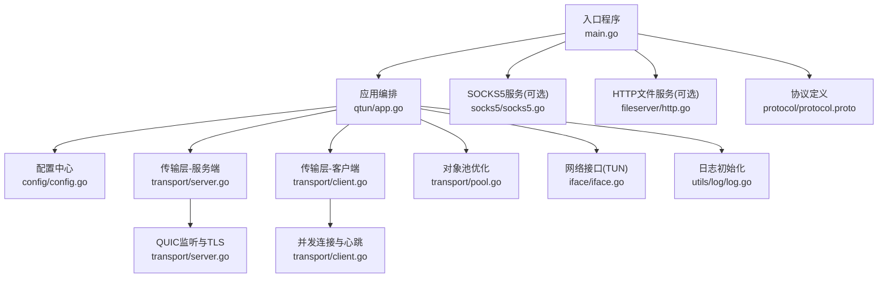
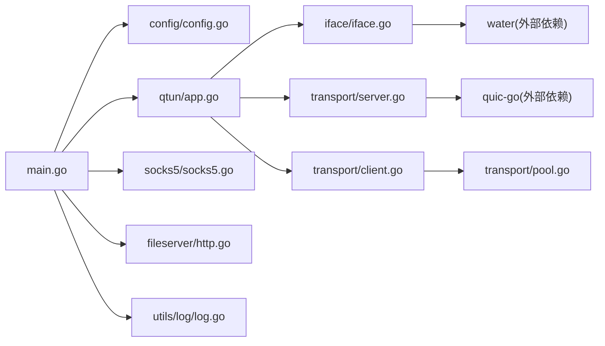

# 容器化部署

<cite>
**本文引用的文件**
- [main.go](file://main.go)
- [go.mod](file://go.mod)
- [Makefile](file://Makefile)
- [config/config.go](file://config/config.go)
- [qtun/app.go](file://qtun/app.go)
- [transport/server.go](file://transport/server.go)
- [transport/client.go](file://transport/client.go)
- [transport/pool.go](file://transport/pool.go)
- [socks5/socks5.go](file://socks5/socks5.go)
- [fileserver/http.go](file://fileserver/http.go)
- [utils/log/log.go](file://utils/log/log.go)
- [protocol/protocol.proto](file://protocol/protocol.proto)
- [iface/iface.go](file://iface/iface.go)
- [README.md](file://README.md)
</cite>

## 目录
1. [简介](#简介)
2. [项目结构](#项目结构)
3. [核心组件](#核心组件)
4. [架构总览](#架构总览)
5. [详细组件分析](#详细组件分析)
6. [依赖关系分析](#依赖关系分析)
7. [性能考量](#性能考量)
8. [故障排查指南](#故障排查指南)
9. [结论](#结论)
10. [附录](#附录)

## 简介
本指南面向在容器环境中部署 Qtun 的用户与工程师，目标是提供从 Docker 多阶段构建到 Kubernetes 部署的完整落地方案。内容涵盖：
- Dockerfile 最佳实践：多阶段构建、镜像瘦身、安全加固
- 轻量级容器镜像策略：基础镜像选择、依赖精简、运行时优化
- Kubernetes 部署配置：Deployment、Service、ConfigMap
- 容器网络、卷挂载、环境变量设置
- 容器监控、日志采集、健康检查

## 项目结构
Qtun 是一个基于 Go 的跨平台隧道应用，支持服务端与客户端模式，内置 TUN 接口、QUIC 传输、可选 SOCKS5 代理与静态文件服务器。其命令行入口通过参数驱动配置，核心逻辑集中在 qtun/App、transport 层与 iface 层。



图表来源
- [main.go](file://main.go#L1-L136)
- [qtun/app.go](file://qtun/app.go#L1-L271)
- [config/config.go](file://config/config.go#L1-L24)
- [transport/server.go](file://transport/server.go#L1-L219)
- [transport/client.go](file://transport/client.go#L1-L223)
- [transport/pool.go](file://transport/pool.go#L1-L108)
- [iface/iface.go](file://iface/iface.go#L1-L105)
- [utils/log/log.go](file://utils/log/log.go#L1-L26)
- [socks5/socks5.go](file://socks5/socks5.go#L1-L170)
- [fileserver/http.go](file://fileserver/http.go#L1-L17)
- [protocol/protocol.proto](file://protocol/protocol.proto#L1-L22)

章节来源
- [main.go](file://main.go#L1-L136)
- [README.md](file://README.md#L1-L99)

## 核心组件
- 入口与参数解析：命令行选项驱动配置初始化，决定运行模式（服务端/客户端）、监听地址、TUN 地址与 MTU、日志级别等。
- 应用编排：根据配置启动服务端监听或客户端连接，同时按需启动 SOCKS5 或 HTTP 文件服务。
- 传输层：服务端基于 QUIC 监听并管理连接；客户端并发连接与心跳维护，消息封装为 Protobuf Envelope。
- 对象池：复用 Protobuf 消息与读缓冲，降低 GC 压力。
- TUN 接口：创建并配置 TUN 设备，负责原始 IP 包的读写。
- 日志：统一使用 zerolog 控制台输出与日志级别。

章节来源
- [main.go](file://main.go#L22-L103)
- [config/config.go](file://config/config.go#L3-L24)
- [qtun/app.go](file://qtun/app.go#L37-L97)
- [transport/server.go](file://transport/server.go#L23-L46)
- [transport/client.go](file://transport/client.go#L20-L39)
- [transport/pool.go](file://transport/pool.go#L10-L51)
- [iface/iface.go](file://iface/iface.go#L16-L74)
- [utils/log/log.go](file://utils/log/log.go#L10-L25)

## 架构总览
下图展示容器内运行时的关键交互：应用进程作为服务端或客户端，通过 QUIC 与对端通信；TUN 接口承载 IP 数据包；可选的 SOCKS5 与 HTTP 文件服务对外提供代理与静态资源能力。

```mermaid
graph TB
subgraph "容器进程"
APP["应用进程<br/>qtun/app.go"]
TUN["TUN接口<br/>iface/iface.go"]
TR_S["传输-服务端<br/>transport/server.go"]
TR_C["传输-客户端<br/>transport/client.go"]
POOL["对象池<br/>transport/pool.go"]
LOG["日志<br/>utils/log/log.go"]
end
subgraph "外部"
PEER["远端节点"]
SOCKS["SOCKS5服务(可选)"]
FS["HTTP文件服务(可选)"]
end
APP --> TUN
APP --> TR_S
APP --> TR_C
APP --> POOL
APP --> LOG
TR_S <- --> PEER
TR_C <- --> PEER
APP --> SOCKS
APP --> FS
```

图表来源
- [qtun/app.go](file://qtun/app.go#L37-L97)
- [transport/server.go](file://transport/server.go#L48-L149)
- [transport/client.go](file://transport/client.go#L41-L83)
- [transport/pool.go](file://transport/pool.go#L74-L107)
- [iface/iface.go](file://iface/iface.go#L31-L74)
- [socks5/socks5.go](file://socks5/socks5.go#L99-L118)
- [fileserver/http.go](file://fileserver/http.go#L9-L16)

## 详细组件分析

### Dockerfile 多阶段构建与镜像优化
- 基础镜像选择
  - 构建阶段：使用官方 Go 镜像，启用模块缓存与交叉编译，避免重复下载依赖。
  - 运行阶段：使用最小化 Linux 发行版镜像（如 distroless/static 或 alpine），仅包含运行时所需二进制与系统库。
- 多阶段构建要点
  - 第一阶段：安装必要工具链，拉取依赖，执行构建，生成二进制。
  - 第二阶段：仅复制最终二进制至运行镜像，不携带源码与构建工具。
- 依赖精简
  - 使用 Go 模块缓存加速构建；剔除测试与调试符号；仅保留必要动态库。
- 安全配置
  - 运行非 root 用户；限制文件权限；禁用不必要的网络访问；最小化暴露端口。
- 运行时优化
  - 合理设置 CPU/内存资源限制；开启只读根文件系统；挂载必要的卷（如日志目录）。

章节来源
- [go.mod](file://go.mod#L1-L29)
- [Makefile](file://Makefile#L3-L22)

### 容器网络配置
- 服务端模式
  - 监听地址由配置决定，默认绑定到 0.0.0.0 的指定端口；容器需映射该端口到宿主机。
- 客户端模式
  - 连接远端地址由配置指定；确保容器网络可达远端地址与端口。
- 可选服务
  - SOCKS5 与 HTTP 文件服务默认监听在本地回环地址；若需从容器外访问，需调整监听地址或使用端口映射。

章节来源
- [main.go](file://main.go#L53-L65)
- [config/config.go](file://config/config.go#L3-L13)
- [qtun/app.go](file://qtun/app.go#L95-L99)
- [socks5/socks5.go](file://socks5/socks5.go#L100-L106)
- [fileserver/http.go](file://fileserver/http.go#L9-L16)

### 卷挂载与环境变量
- 卷挂载建议
  - 日志目录：将日志输出到标准错误或可挂载的日志卷，便于集中采集。
  - 静态资源：HTTP 文件服务目录可挂载为只读卷。
- 环境变量
  - 通过环境变量注入密钥、监听地址、远端地址、TUN 地址与 MTU 等关键参数，避免硬编码在镜像中。

章节来源
- [utils/log/log.go](file://utils/log/log.go#L10-L25)
- [fileserver/http.go](file://fileserver/http.go#L9-L16)
- [main.go](file://main.go#L53-L65)

### Kubernetes 部署配置示例
- Deployment
  - 使用无 root 用户运行；设置资源请求与限制；配置健康检查与就绪探针。
  - 通过 ConfigMap 注入配置参数；必要时挂载只读卷。
- Service
  - 为服务端模式暴露监听端口；客户端无需 Service，除非需要反向代理或侧车模式。
- ConfigMap
  - 将关键配置项（如密钥、监听地址、远端地址、TUN 地址、MTU、日志级别）放入 ConfigMap，并以环境变量形式注入。

章节来源
- [main.go](file://main.go#L53-L65)
- [config/config.go](file://config/config.go#L3-L13)
- [README.md](file://README.md#L13-L26)

### 容器监控、日志收集与健康检查
- 日志
  - 使用 zerolog 输出到标准错误，便于容器日志收集系统抓取；可通过 ConfigMap 设置日志级别。
- 健康检查
  - TCP/HTTP 探针：服务端监听端口可作为存活与就绪探针目标；客户端可基于连接状态或心跳进行自定义探针。
- 监控指标
  - 可利用内置可视化接口或集成 Prometheus/Grafana；对 QUIC 连接数、TUN 包处理速率等关键指标进行观测。

章节来源
- [utils/log/log.go](file://utils/log/log.go#L10-L25)
- [qtun/app.go](file://qtun/app.go#L37-L49)
- [transport/server.go](file://transport/server.go#L48-L76)

## 依赖关系分析
Qtun 的运行时依赖主要来自 Go 标准库与第三方库，其中与容器化密切相关的点包括：
- 传输层依赖 QUIC 实现，需要网络栈支持；在容器中需确保 UDP/TCP 可用。
- TUN 接口依赖系统内核模块与权限；容器中需以特权模式或挂载设备节点运行。
- 日志与配置通过标准输入输出与环境变量交互，适配容器日志与配置管理。



图表来源
- [main.go](file://main.go#L15-L20)
- [go.mod](file://go.mod#L5-L14)
- [qtun/app.go](file://qtun/app.go#L11-L16)
- [transport/server.go](file://transport/server.go#L18-L21)
- [iface/iface.go](file://iface/iface.go#L12-L14)

章节来源
- [go.mod](file://go.mod#L1-L29)
- [main.go](file://main.go#L15-L20)

## 性能考量
- 并发与工作线程
  - 应用根据 CPU 核心数动态计算工作线程数量，兼顾 I/O 并发与资源占用。
- QUIC 参数
  - 服务端监听采用较大的流与连接接收窗口、保活周期与 datagram 支持，提升吞吐与稳定性。
- 对象池
  - 复用 Protobuf 消息与读缓冲，减少 GC 压力，提高高负载下的稳定性。
- TUN 与 MTU
  - 合理设置 MTU，避免分片；TUN 接口读写路径直接对接传输层，减少中间层拷贝。

章节来源
- [qtun/app.go](file://qtun/app.go#L79-L97)
- [transport/server.go](file://transport/server.go#L97-L103)
- [transport/pool.go](file://transport/pool.go#L10-L51)
- [config/config.go](file://config/config.go#L7-L9)

## 故障排查指南
- 启动失败
  - 检查日志级别与输出位置；确认监听地址与端口是否被占用；验证密钥与远端地址配置。
- TUN 初始化失败
  - 确认容器具备创建 TUN 设备所需的权限或挂载设备节点；检查内核模块加载情况。
- 连接异常
  - 查看 QUIC 连接状态与保活心跳；确认 NAT/防火墙放行相应端口；核对 MTU 设置。
- 代理与文件服务
  - 若未暴露到宿主机，需调整监听地址或端口映射；检查静态资源目录权限。

章节来源
- [utils/log/log.go](file://utils/log/log.go#L10-L25)
- [iface/iface.go](file://iface/iface.go#L31-L74)
- [transport/server.go](file://transport/server.go#L112-L148)
- [transport/client.go](file://transport/client.go#L41-L83)
- [socks5/socks5.go](file://socks5/socks5.go#L100-L118)
- [fileserver/http.go](file://fileserver/http.go#L9-L16)

## 结论
通过多阶段构建与最小化运行时镜像，结合合理的网络、卷与配置管理，Qtun 可在容器环境中稳定运行。配合健康检查与日志采集，可实现可观测性与可维护性。建议在生产环境中进一步强化安全基线与资源治理。

## 附录
- 关键参数与默认值
  - 密钥、监听地址、远端地址、TUN 地址与 MTU、日志级别、SOCKS5 端口、文件服务端口与目录等均可通过命令行或环境变量配置。
- 协议与数据流
  - 传输层使用 Protobuf Envelope 承载 Ping 与 Packet 消息；服务端/客户端分别负责连接管理与心跳维护。

章节来源
- [main.go](file://main.go#L53-L65)
- [config/config.go](file://config/config.go#L3-L13)
- [protocol/protocol.proto](file://protocol/protocol.proto#L5-L22)