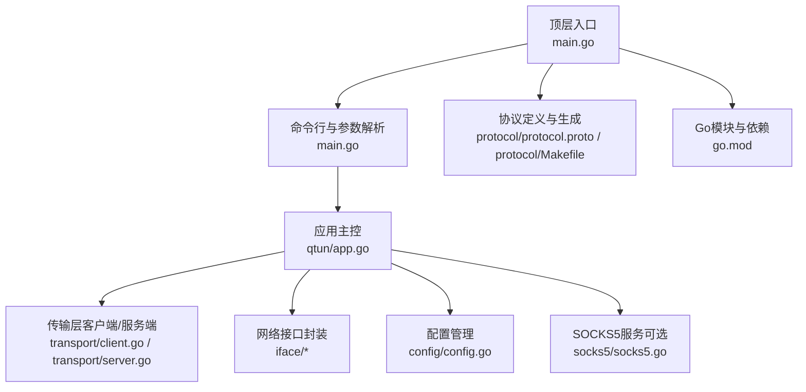
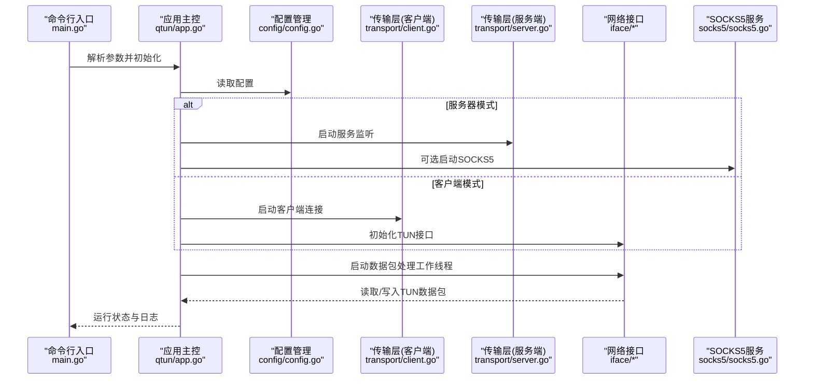
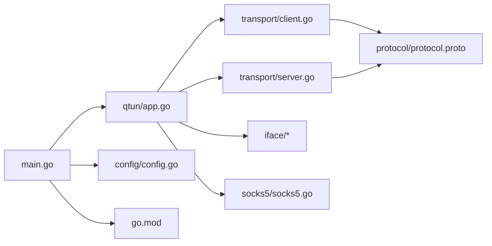

# 构建与部署

<cite>
**本文引用的文件**
- [Makefile](file://Makefile)
- [main.go](file://main.go)
- [go.mod](file://go.mod)
- [README.md](file://README.md)
- [config/config.go](file://config/config.go)
- [qtun/app.go](file://qtun/app.go)
- [transport/client.go](file://transport/client.go)
- [transport/server.go](file://transport/server.go)
- [protocol/Makefile](file://protocol/Makefile)
- [protocol/protocol.proto](file://protocol/protocol.proto)
- [socks5/socks5.go](file://socks5/socks5.go)
</cite>

## 目录
1. [简介](#简介)
2. [项目结构](#项目结构)
3. [核心组件](#核心组件)
4. [架构总览](#架构总览)
5. [详细组件分析](#详细组件分析)
6. [依赖关系分析](#依赖关系分析)
7. [性能考量](#性能考量)
8. [故障排查指南](#故障排查指南)
9. [结论](#结论)
10. [附录](#附录)

## 简介
本指南面向Qtun项目的构建与部署，覆盖以下主题：
- Makefile中的构建目标与编译参数：开发构建、生产构建与交叉编译
- 针对macOS、Linux、Windows的编译策略与CGO注意事项
- Docker容器化与Kubernetes部署思路
- 版本管理、发布流程与二进制分发建议
- CI/CD流水线与自动化测试集成思路

## 项目结构
该项目采用Go模块化组织，核心入口为命令行应用，通过命令行参数驱动运行模式（服务器/客户端）、网络接口与传输参数等。构建系统以顶层Makefile为主，提供多平台交叉编译目标；协议定义位于protocol子目录并通过独立的Makefile生成Go代码。

图表来源
- [main.go](file://main.go#L1-L136)
- [qtun/app.go](file://qtun/app.go#L1-L271)
- [transport/client.go](file://transport/client.go#L1-L223)
- [transport/server.go](file://transport/server.go#L1-L219)
- [config/config.go](file://config/config.go#L1-L24)
- [protocol/protocol.proto](file://protocol/protocol.proto#L1-L22)
- [protocol/Makefile](file://protocol/Makefile#L1-L7)
- [go.mod](file://go.mod#L1-L29)

章节来源
- [Makefile](file://Makefile#L1-L23)
- [README.md](file://README.md#L1-L99)
- [go.mod](file://go.mod#L1-L29)

## 核心组件
- 命令行与参数解析：定义了丰富的运行参数，涵盖密钥、监听/远端地址、VPN虚拟IP、MTU、日志级别、并发传输线程数、是否仅代理模式、SOCKS5端口、HTTP文件服务器端口与目录等。
- 应用主控：负责根据运行模式选择启动服务器或客户端，初始化TUN接口与数据包处理工作线程，并在服务器模式下启动SOCKS5服务，在客户端模式下启动HTTP文件服务器。
- 传输层：客户端按指定线程数建立到远端的连接，周期性发送Ping并转发TUN数据包；服务端基于QUIC监听并维护连接映射表，实现多路复用与动态路由清理。
- 协议定义：使用Protocol Buffers定义Envelope、Ping与Packet消息类型，用于跨进程/跨节点的数据交换。
- 配置管理：集中存放全局配置项，供各模块读取。
- SOCKS5服务：可选的本地SOCKS5代理，便于客户端透明代理流量。

章节来源
- [main.go](file://main.go#L22-L103)
- [qtun/app.go](file://qtun/app.go#L19-L97)
- [transport/client.go](file://transport/client.go#L20-L132)
- [transport/server.go](file://transport/server.go#L23-L149)
- [protocol/protocol.proto](file://protocol/protocol.proto#L5-L22)
- [config/config.go](file://config/config.go#L3-L23)
- [socks5/socks5.go](file://socks5/socks5.go#L13-L170)

## 架构总览
下图展示从命令行入口到传输层、网络接口与可选服务的整体交互：

图表来源
- [main.go](file://main.go#L75-L102)
- [qtun/app.go](file://qtun/app.go#L37-L97)
- [transport/client.go](file://transport/client.go#L41-L83)
- [transport/server.go](file://transport/server.go#L48-L149)
- [config/config.go](file://config/config.go#L17-L23)
- [socks5/socks5.go](file://socks5/socks5.go#L99-L118)

## 详细组件分析

### 构建系统与Makefile
- 开发构建：直接调用go build生成可执行文件，适合本地调试。
- 多平台交叉编译：提供针对Windows、Linux amd64/i686、Linux ARM（arm64/m4）的目标，分别输出到bin目录下的命名产物。
- 依赖安装：提供deps目标用于拉取依赖（当前注释掉的GOPATH逻辑不影响go mod使用）。

章节来源
- [Makefile](file://Makefile#L3-L22)

### 协议生成与依赖
- 协议生成：protocol/Makefile提供build目标，使用protoc生成Go代码；prepare目标给出Ubuntu环境安装protobuf编译器与插件的步骤。
- 协议定义：protocol.proto定义Envelope、Ping与Packet消息，用于客户端与服务端之间的数据交换。

章节来源
- [protocol/Makefile](file://protocol/Makefile#L1-L7)
- [protocol/protocol.proto](file://protocol/protocol.proto#L1-L22)

### 应用主控与运行模式
- 参数驱动：命令行参数决定运行模式（服务器/客户端）、监听/远端地址、VPN虚拟IP、MTU、日志级别、并发线程数、是否仅代理模式等。
- 服务器模式：启动SOCKS5服务与传输监听，维护路由表并清理无效连接。
- 客户端模式：启动传输连接，初始化TUN接口，设置系统代理（macOS），并在非服务器模式下启动HTTP文件服务器。

章节来源
- [main.go](file://main.go#L22-L103)
- [qtun/app.go](file://qtun/app.go#L37-L97)

### 传输层（客户端）
- 并发连接：按配置的线程数创建多个连接，周期性发送Ping以维持活跃并上报本地地址与VIP。
- 负载均衡：通过原子自增序列选择连接进行发送，提升吞吐。
- 数据包转发：将TUN接口读取的数据包封装为Envelope并发送至服务端。

章节来源
- [transport/client.go](file://transport/client.go#L20-L132)
- [transport/client.go](file://transport/client.go#L178-L222)

### 传输层（服务端）
- QUIC监听：基于quic-go库监听指定地址，配置流窗口、连接窗口与保活周期，启用Datagrams。
- 连接管理：使用sync.Map维护连接映射，支持动态删除失效连接与反向查找。
- 数据包处理：接收Envelope并根据类型写入TUN或转发给对应连接。

章节来源
- [transport/server.go](file://transport/server.go#L23-L149)
- [transport/server.go](file://transport/server.go#L175-L218)

### 配置管理
- 全局配置：集中存储密钥、监听/远端地址、VPN虚拟IP、MTU、并发线程数、服务器模式与NoDelay等。
- 初始化与获取：提供InitConfig与GetInstance方法，供其他模块读取。

章节来源
- [config/config.go](file://config/config.go#L3-L23)

### SOCKS5服务
- 协议实现：支持认证方法、规则集、地址重写与DNS解析等配置项。
- 运行控制：在服务器模式下由应用主控启动，客户端模式下可作为本地代理服务。

章节来源
- [socks5/socks5.go](file://socks5/socks5.go#L13-L170)

## 依赖关系分析
下图展示模块间的依赖与调用关系：

图表来源
- [main.go](file://main.go#L1-L136)
- [qtun/app.go](file://qtun/app.go#L1-L271)
- [transport/client.go](file://transport/client.go#L1-L223)
- [transport/server.go](file://transport/server.go#L1-L219)
- [config/config.go](file://config/config.go#L1-L24)
- [protocol/protocol.proto](file://protocol/protocol.proto#L1-L22)
- [go.mod](file://go.mod#L1-L29)

章节来源
- [go.mod](file://go.mod#L5-L14)

## 性能考量
- 工作线程数：应用主控根据CPU核心数动态计算工作线程数，范围限制在最小4与最大32之间，以平衡I/O并行度。
- QUIC参数：服务端配置较大的最大入站流数、接收窗口与连接窗口，以及启用Datagrams，有助于提升高带宽场景下的吞吐与延迟表现。
- 连接池与同步：服务端使用sync.Map优化并发访问，客户端采用原子序号选择连接，减少锁竞争。
- 日志与可观测性：内置系统GUI与statsviz注册点，便于运行时性能观测。

章节来源
- [qtun/app.go](file://qtun/app.go#L79-L96)
- [transport/server.go](file://transport/server.go#L97-L103)
- [main.go](file://main.go#L124-L129)

## 故障排查指南
- 无法设置系统代理（macOS）：应用在macOS上尝试通过networksetup设置自动代理PAC，若失败请检查权限与PAC路径。
- 客户端无法连接服务端：确认密钥一致、远端地址可达、防火墙放行监听端口；客户端会重试连接，观察日志中的连接状态。
- 传输异常或丢包：检查MTU设置、网络质量与QUIC参数；关注服务端日志中的连接清理与路由表变化。
- 协议生成问题：确保已安装protoc与Go插件，参考protocol/Makefile中的准备步骤。

章节来源
- [qtun/app.go](file://qtun/app.go#L250-L270)
- [transport/client.go](file://transport/client.go#L41-L83)
- [protocol/Makefile](file://protocol/Makefile#L3-L7)

## 结论
本指南基于仓库现有文件梳理了Qtun的构建与部署要点，明确了Makefile的多平台交叉编译能力、协议生成流程、运行模式与性能优化策略。结合README中的使用说明与模块间依赖关系，可据此制定容器化与CI/CD落地方案。

## 附录

### 构建目标与编译参数说明
- 开发构建：使用顶层Makefile的build目标，适用于本地调试。
- 生产构建：建议在CI中统一使用GOFLAGS或ldflags注入版本信息与构建时间，以增强可追溯性。
- 交叉编译：利用GOOS与GOARCH变量输出多平台产物，注意Windows平台不被官方支持，需自行评估兼容性。

章节来源
- [Makefile](file://Makefile#L3-L22)
- [README.md](file://README.md#L94-L99)

### 操作系统与CGO注意事项
- macOS/Linux：官方支持，可直接使用Go原生实现。
- Windows：官方不支持，如需移植需评估第三方依赖与系统接口适配。

章节来源
- [README.md](file://README.md#L96-L99)

### Docker容器化与Kubernetes部署思路
- 容器镜像：基于精简基础镜像构建，将bin目录中的可执行文件复制入镜像，暴露必要端口（如SOCKS5与HTTP文件服务器端口）。
- Kubernetes：建议使用Deployment管理副本，Service暴露服务；为客户端Pod挂载必要的网络权限（如TUN设备），或在宿主机运行以避免权限问题。
- 配置注入：通过ConfigMap或Secret注入密钥、监听地址与端口等参数，避免硬编码。

[本节为概念性建议，不直接对应具体源码文件]

### 版本管理、发布与分发
- 版本号：应用内含版本字符串，可在构建时通过ldflags注入。
- 发布流程：在CI中触发多平台构建，生成产物并上传至制品库或发布页面；为每个平台打上标签并附带校验值。
- 分发方式：提供二进制下载链接与安装脚本，或打包为容器镜像供Kubernetes部署。

[本节为通用实践建议，不直接对应具体源码文件]

### CI/CD流水线与自动化测试
- 流水线阶段：代码检出 → 依赖安装 → 单元测试 → 多平台构建 → 产物归档 → 自动化验收测试 → 发布。
- 自动化测试：结合现有测试文件（如socks5包内的*_test.go），在CI中执行go test并生成覆盖率报告。
- 触发策略：主分支保护与PR合并策略，确保关键变更经过充分测试。

[本节为通用实践建议，不直接对应具体源码文件]