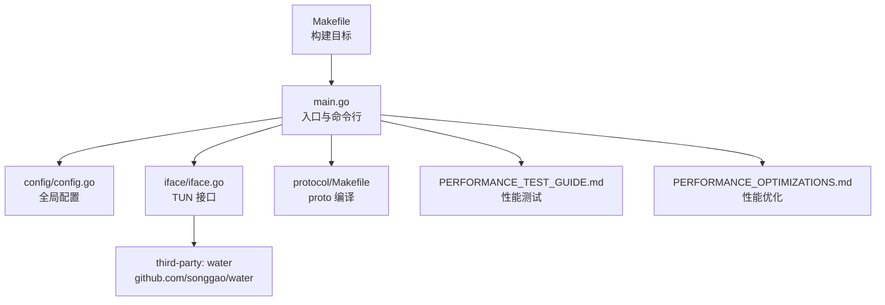
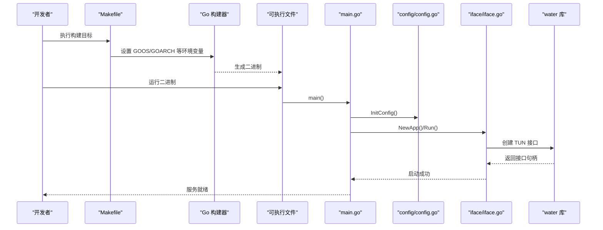
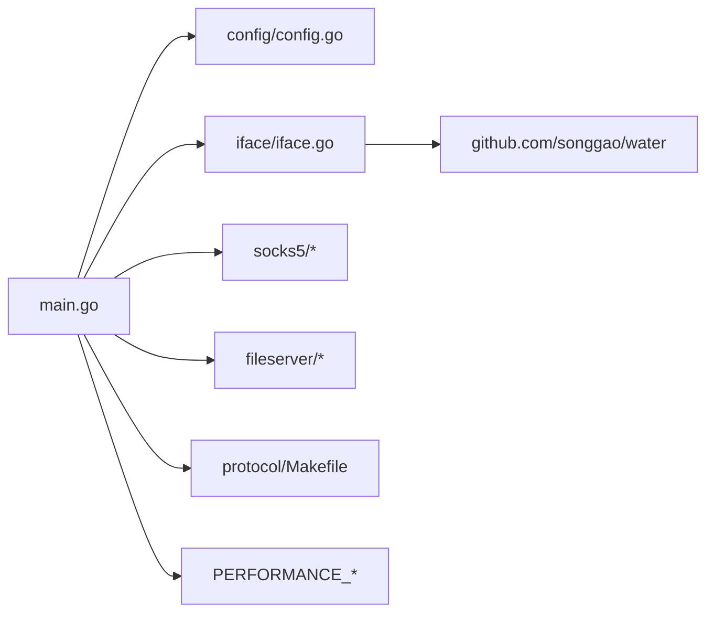

# 编译构建

<cite>
**本文引用的文件列表**
- [Makefile](file://Makefile)
- [go.mod](file://go.mod)
- [main.go](file://main.go)
- [config/config.go](file://config/config.go)
- [iface/iface.go](file://iface/iface.go)
- [iface/packet_ip.go](file://iface/packet_ip.go)
- [protocol/Makefile](file://protocol/Makefile)
- [PERFORMANCE_OPTIMIZATIONS.md](file://PERFORMANCE_OPTIMIZATIONS.md)
- [PERFORMANCE_TEST_GUIDE.md](file://PERFORMANCE_TEST_GUIDE.md)
- [README.md](file://README.md)
</cite>

## 目录
1. [简介](#简介)
2. [项目结构](#项目结构)
3. [核心组件](#核心组件)
4. [架构总览](#架构总览)
5. [详细组件分析](#详细组件分析)
6. [依赖关系分析](#依赖关系分析)
7. [性能与优化](#性能与优化)
8. [故障排查指南](#故障排查指南)
9. [结论](#结论)
10. [附录](#附录)

## 简介
本指南面向希望从源码构建 Qtun 的开发者，系统讲解 Makefile 构建目标、跨平台编译、依赖管理、CGO 与网络接口相关注意事项，并提供针对 Windows、Linux、macOS 的编译步骤与常见问题排查建议。同时结合项目内置的性能测试与优化文档，帮助你获得稳定高效的构建产物。

## 项目结构
- 顶层构建入口：Makefile 提供多平台构建目标与依赖安装。
- 主程序入口：main.go 定义命令行参数、初始化流程与运行逻辑。
- 配置模块：config/config.go 提供全局配置结构与初始化。
- 网络接口模块：iface/iface.go 使用第三方水线库创建 TUN 设备；iface/packet_ip.go 提供高性能数据包缓冲池。
- 协议编译：protocol/Makefile 提供 protobuf 编译与准备脚本。
- 性能与测试：PERFORMANCE_OPTIMIZATIONS.md 与 PERFORMANCE_TEST_GUIDE.md 提供性能优化与测试方法。
- 依赖声明：go.mod 明确 Go 版本与模块依赖。

图表来源
- [Makefile](file://Makefile#L1-L23)
- [main.go](file://main.go#L1-L136)
- [config/config.go](file://config/config.go#L1-L24)
- [iface/iface.go](file://iface/iface.go#L1-L105)
- [protocol/Makefile](file://protocol/Makefile#L1-L7)

章节来源
- [Makefile](file://Makefile#L1-L23)
- [main.go](file://main.go#L1-L136)
- [config/config.go](file://config/config.go#L1-L24)
- [iface/iface.go](file://iface/iface.go#L1-L105)
- [protocol/Makefile](file://protocol/Makefile#L1-L7)

## 核心组件
- 构建系统（Makefile）
  - 基础构建：直接调用 go build 输出到 bin/qtun。
  - 跨平台构建：通过环境变量设置 GOOS/GOARCH/GOARM 实现 Windows、Linux/amd64、Linux/i686、Linux/arm、Darwin/arm64（M4）等目标。
  - 依赖安装：go get 获取模块依赖。
- 主程序（main.go）
  - 定义命令行参数与默认值，初始化配置、日志与子服务（Socks5、HTTP 文件服务），随后启动主应用。
- 配置模块（config/config.go）
  - 全局配置结构体与初始化函数，供其他模块读取。
- 网络接口模块（iface/iface.go、iface/packet_ip.go）
  - 使用 water 库创建 TUN 接口并在不同平台执行 ifconfig/route 配置；提供 PacketIP 对象池以降低内存分配。
- 协议编译（protocol/Makefile）
  - 使用 protoc 生成 Go 代码；提供 Ubuntu 下的 protobuf 工具链准备脚本与插件安装。
- 性能与测试（PERFORMANCE_OPTIMIZATIONS.md、PERFORMANCE_TEST_GUIDE.md）
  - 提供编译优化、pprof 与 statsviz 监控、吞吐量/延迟/并发/资源使用测试方案。

章节来源
- [Makefile](file://Makefile#L1-L23)
- [main.go](file://main.go#L22-L103)
- [config/config.go](file://config/config.go#L3-L24)
- [iface/iface.go](file://iface/iface.go#L31-L74)
- [iface/packet_ip.go](file://iface/packet_ip.go#L10-L39)
- [protocol/Makefile](file://protocol/Makefile#L1-L7)
- [PERFORMANCE_OPTIMIZATIONS.md](file://PERFORMANCE_OPTIMIZATIONS.md#L1-L323)
- [PERFORMANCE_TEST_GUIDE.md](file://PERFORMANCE_TEST_GUIDE.md#L1-L323)

## 架构总览
下图展示从构建到运行的关键路径：Makefile 触发 go build，main.go 初始化配置与服务，iface 创建 TUN 接口，最终进入应用主循环。

图表来源
- [Makefile](file://Makefile#L3-L22)
- [main.go](file://main.go#L75-L103)
- [config/config.go](file://config/config.go#L17-L23)
- [iface/iface.go](file://iface/iface.go#L31-L74)

## 详细组件分析

### 构建目标与使用方法
- build
  - 作用：在当前平台编译出可执行文件至 bin/qtun。
  - 适用：本地开发调试。
- windows
  - 作用：交叉编译 Windows/amd64 可执行文件至 bin/qtun-win。
  - 注意：需确保系统具备 Windows 目标工具链或在 Linux/macOS 上通过交叉编译工具链完成。
- linux
  - 作用：交叉编译 Linux/amd64 可执行文件至 bin/qtun-linux。
- linux-i686
  - 作用：交叉编译 Linux/386 可执行文件至 bin/qtun-linux（注意：原 Makefile 目标名与输出文件同名，建议区分输出文件名以避免覆盖）。
- arm
  - 作用：交叉编译 Linux/arm（GOARM=7）可执行文件至 bin/qtun-arm。
- m4
  - 作用：交叉编译 Darwin/arm64（Apple Silicon/M4）可执行文件至 bin/qtun-m4。
- deps
  - 作用：拉取模块依赖（go get）。

章节来源
- [Makefile](file://Makefile#L3-L22)

### 跨平台编译与环境变量
- GOOS/GOARCH/GOARM
  - 通过环境变量控制目标平台与架构，适用于 Go 原生交叉编译。
- CGO 行为
  - 若未显式设置 CGO_ENABLED，Go 将根据平台与工具链自动决定是否启用 CGO。
  - 本项目使用第三方 TUN 库（water），其底层可能涉及 CGO 或系统调用，建议在 Linux/macOS 上保持 CGO 默认行为，Windows 上通常不支持 TUN，详见“平台支持”。
- 交叉编译工具链
  - Windows：可在 Linux/macOS 上通过 mingw-w64 等工具链实现交叉编译。
  - Linux：使用标准 gcc 工具链即可。
  - macOS：使用 Xcode 工具链与 SDK。

章节来源
- [Makefile](file://Makefile#L6-L19)
- [README.md](file://README.md#L94-L99)

### 依赖管理与模块版本
- Go 版本
  - go.mod 指定 Go 1.24.0，建议使用该版本或兼容版本进行构建。
- 模块依赖
  - 主要依赖包括 QUIC 实现、日志、CLI、TUN 接口等。构建前建议清理缓存并更新依赖，确保一致性。
- 依赖安装
  - 使用 make deps 或 go mod tidy 获取依赖。

章节来源
- [go.mod](file://go.mod#L1-L29)
- [Makefile](file://Makefile#L21-L22)

### 平台支持与 TUN 接口
- 平台支持
  - README 明确支持 macOS 与 Linux；Windows 不支持（TUN 接口限制）。
- TUN 接口创建
  - 使用 water 库创建 TUN 设备，并在不同平台执行 ifconfig/route 配置。
  - 注意：在 macOS 上需要额外添加系统路由；在 Linux 上使用 ifconfig 配置。
- CGO 与系统调用
  - TUN 接口创建与配置依赖系统调用，建议在 Linux/macOS 上保持 CGO 默认开启，Windows 不支持。

章节来源
- [README.md](file://README.md#L94-L99)
- [iface/iface.go](file://iface/iface.go#L31-L74)

### 协议编译（Protocol）
- 目标
  - 使用 protoc 生成 Go 代码；提供 Ubuntu 下的 protobuf 工具链准备脚本与插件安装。
- 步骤
  - 准备：安装 protobuf 编译器与 protoc-gen-go 插件。
  - 生成：在 protocol 目录执行构建目标生成协议代码。

章节来源
- [protocol/Makefile](file://protocol/Makefile#L1-L7)

### 性能监控与测试
- 内置监控
  - 项目在 main.go 中注册了 statsviz 与 pprof 监控端点，便于运行时分析。
- 性能测试
  - 提供吞吐量、延迟、并发、CPU/内存使用等测试方案与自动化脚本。

章节来源
- [main.go](file://main.go#L124-L129)
- [PERFORMANCE_TEST_GUIDE.md](file://PERFORMANCE_TEST_GUIDE.md#L1-L323)

## 依赖关系分析
- 模块耦合
  - main.go 依赖 config、iface、socks5、fileserver 等模块；config 提供全局配置；iface 负责 TUN 接口；其余模块负责网络与服务。
- 外部依赖
  - water 库用于创建 TUN 接口；QUIC 实现用于传输；日志与 CLI 库用于可观测性与用户交互。
- 潜在风险
  - TUN 接口在 Windows 不可用；CGO 行为受平台与工具链影响；跨平台编译需正确配置交叉编译工具链。

图表来源
- [main.go](file://main.go#L15-L20)
- [config/config.go](file://config/config.go#L1-L24)
- [iface/iface.go](file://iface/iface.go#L12-L13)
- [protocol/Makefile](file://protocol/Makefile#L1-L7)

章节来源
- [main.go](file://main.go#L15-L20)
- [config/config.go](file://config/config.go#L1-L24)
- [iface/iface.go](file://iface/iface.go#L12-L13)
- [protocol/Makefile](file://protocol/Makefile#L1-L7)

## 性能与优化
- 编译优化
  - 使用链接器标志减小体积与符号表，提升加载速度。
- 运行时监控
  - pprof 与 statsviz 提供 CPU、内存、Goroutine 分析能力。
- 性能测试场景
  - 吞吐量、延迟、并发连接、资源使用等多维度测试。
- 对象池优化
  - iface/packet_ip.go 使用对象池减少内存分配，降低 GC 压力。

章节来源
- [PERFORMANCE_OPTIMIZATIONS.md](file://PERFORMANCE_OPTIMIZATIONS.md#L1-L323)
- [PERFORMANCE_TEST_GUIDE.md](file://PERFORMANCE_TEST_GUIDE.md#L1-L323)
- [iface/packet_ip.go](file://iface/packet_ip.go#L10-L39)

## 故障排查指南
- 构建失败（找不到 TUN 接口或权限不足）
  - 症状：创建 TUN 接口失败或 ifconfig/route 执行报错。
  - 排查：确认平台支持（Windows 不支持）、以管理员权限运行、检查内核模块与系统权限。
- 交叉编译工具链缺失
  - 症状：Windows/ARM 目标无法生成。
  - 排查：安装对应交叉编译工具链（如 mingw-w64、arm-linux-gnueabihf-gcc 等）。
- CGO 相关问题
  - 症状：在某些平台无法启用 CGO 或链接失败。
  - 排查：确认系统已安装必要的头文件与库；必要时禁用 CGO 并切换到纯 Go 实现（若可行）。
- 依赖下载缓慢
  - 建议：配置 GOPROXY 以加速模块下载。
- 依赖版本冲突
  - 建议：使用 go mod tidy 清理并重新获取依赖。

章节来源
- [README.md](file://README.md#L90-L93)
- [PERFORMANCE_TEST_GUIDE.md](file://PERFORMANCE_TEST_GUIDE.md#L286-L309)

## 结论
通过 Makefile 的多目标构建与环境变量控制，你可以快速在 Windows、Linux、macOS 上生成可执行文件。结合 go.mod 的依赖声明与 protocol/Makefile 的协议生成流程，可以完成从源码到可运行产物的完整闭环。配合性能测试与优化文档，能够持续改进构建产物的性能与稳定性。

## 附录

### 开发环境搭建步骤
- Go 版本
  - 使用 Go 1.24.0 或兼容版本。
- 依赖安装
  - 执行 make deps 或 go mod tidy 获取模块依赖。
- 环境变量
  - 可选：GOPROXY 加速下载。
- 平台支持
  - macOS/Linux 支持；Windows 不支持 TUN 接口。

章节来源
- [go.mod](file://go.mod#L3-L3)
- [README.md](file://README.md#L11-L11)
- [README.md](file://README.md#L90-L93)
- [README.md](file://README.md#L96-L99)

### 平台编译指南
- Windows
  - 使用 make windows 生成 Windows/amd64 可执行文件。
- Linux
  - 使用 make linux 生成 Linux/amd64 可执行文件。
  - 使用 make linux-i686 生成 Linux/386 可执行文件。
- ARM
  - 使用 make arm 生成 Linux/arm（GOARM=7）可执行文件。
- macOS（Apple Silicon/M4）
  - 使用 make m4 生成 Darwin/arm64 可执行文件。

章节来源
- [Makefile](file://Makefile#L6-L19)

### CGO 与静态链接
- CGO 行为
  - 本项目依赖 TUN 接口，建议在 Linux/macOS 上保持 CGO 默认开启；Windows 不支持。
- 静态链接
  - 如需静态链接，需在交叉编译环境中配置 CGO 与链接器参数；具体参数因平台而异，建议参考 Go 官方文档与平台工具链说明。

章节来源
- [README.md](file://README.md#L94-L99)
- [iface/iface.go](file://iface/iface.go#L31-L74)

### 依赖管理最佳实践
- 使用 go mod tidy 清理并更新依赖。
- 在 CI 中固定 Go 版本与依赖版本，确保可重复构建。
- 对于协议编译，先执行 protocol/Makefile 的准备步骤，再生成 Go 代码。

章节来源
- [go.mod](file://go.mod#L1-L29)
- [protocol/Makefile](file://protocol/Makefile#L3-L7)