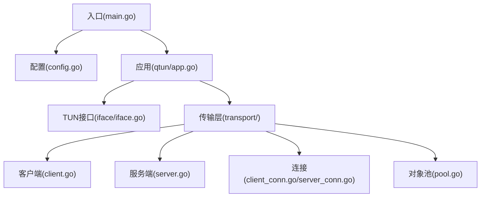
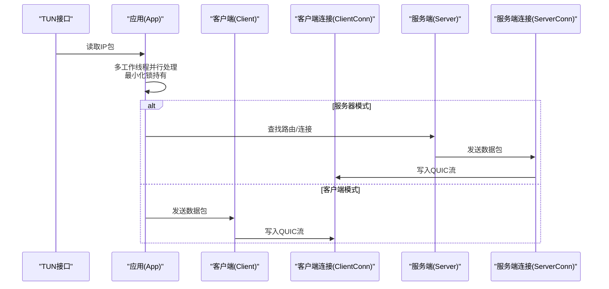
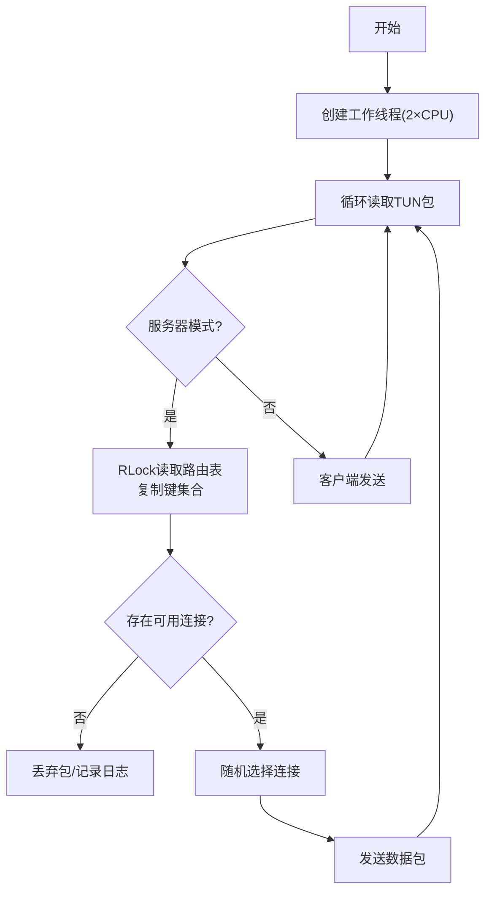
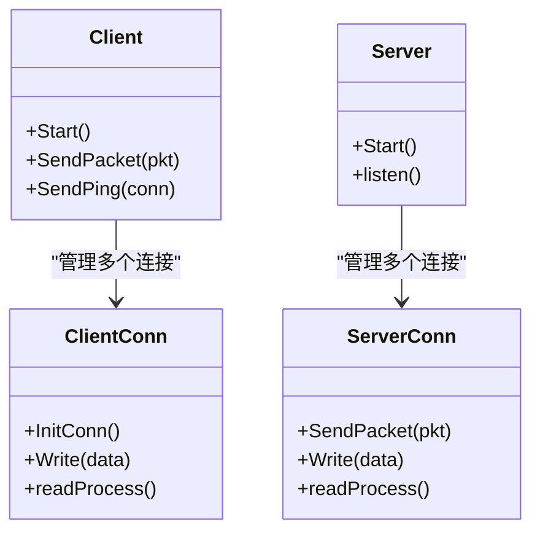
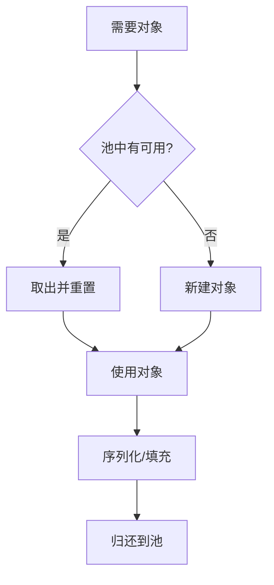
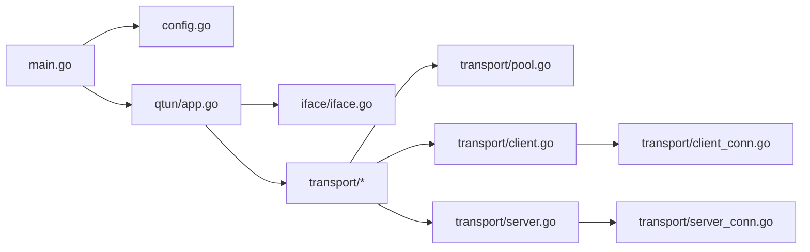

# 性能分析与优化

<cite>
**本文引用的文件**
- [main.go](file://main.go)
- [config.go](file://config/config.go)
- [app.go](file://qtun/app.go)
- [iface.go](file://iface/iface.go)
- [client.go](file://transport/client.go)
- [client_conn.go](file://transport/client_conn.go)
- [server.go](file://transport/server.go)
- [server_conn.go](file://transport/server_conn.go)
- [pool.go](file://transport/pool.go)
- [PERFORMANCE_TEST_GUIDE.md](file://PERFORMANCE_TEST_GUIDE.md)
</cite>

## 目录
1. [简介](#简介)
2. [项目结构](#项目结构)
3. [核心组件](#核心组件)
4. [架构总览](#架构总览)
5. [详细组件分析](#详细组件分析)
6. [依赖关系分析](#依赖关系分析)
7. [性能考虑](#性能考虑)
8. [故障排查指南](#故障排查指南)
9. [结论](#结论)
10. [附录](#附录)

## 简介
本指南面向Qtun项目的性能分析与优化，围绕CPU与内存分析、trace与heap分析、吞吐量与延迟监控、锁与通道优化、对象池与缓冲区配置、QUIC参数调优等主题展开。文档结合项目现有实现与性能测试指南，提供可操作的分析流程、瓶颈定位方法与优化策略，并给出不同场景下的调优参数建议。

## 项目结构
项目采用分层与功能模块化组织：
- 入口与CLI：main.go负责命令行参数解析、性能监控注册与应用启动
- 配置管理：config.go提供全局配置结构与初始化
- 应用主循环：qtun/app.go负责TUN接口读取、多工作线程处理、路由与收发
- 网络接口：iface/iface.go封装TUN设备的创建与读写
- 传输层：transport/目录包含客户端、服务端、连接与对象池
- 性能测试：PERFORMANCE_TEST_GUIDE.md提供基准测试与分析脚本

图表来源
- [main.go](file://main.go#L105-L136)
- [config.go](file://config/config.go#L1-L24)
- [app.go](file://qtun/app.go#L37-L97)
- [iface.go](file://iface/iface.go#L31-L74)
- [client.go](file://transport/client.go#L31-L83)
- [server.go](file://transport/server.go#L37-L52)
- [client_conn.go](file://transport/client_conn.go#L44-L56)
- [server_conn.go](file://transport/server_conn.go#L39-L51)
- [pool.go](file://transport/pool.go#L10-L51)

章节来源
- [main.go](file://main.go#L105-L136)
- [config.go](file://config/config.go#L1-L24)

## 核心组件
- CLI与性能监控
  - 注册statsviz实时监控与pprof端口，默认监听本地端口，便于CPU/内存/协程分析
- 配置系统
  - 提供密钥、远端地址、监听地址、并发线程数、MTU、服务器模式、Nagle开关等参数
- 应用主循环
  - 动态工作线程数：CPU核数×2（最小4，最大32），最小化锁持有时间，提升I/O并行度
- TUN接口
  - 创建TUN设备、配置IP与MTU、读写原始IP包
- 传输层
  - 客户端/服务端基于QUIC，连接池与通道缓冲优化，对象池减少GC压力
- 对象池
  - 非ces、Buffer、Envelope、Ping/Packet消息、64KB读缓冲池，显著降低分配次数

章节来源
- [main.go](file://main.go#L105-L136)
- [config.go](file://config/config.go#L3-L13)
- [app.go](file://qtun/app.go#L72-L97)
- [iface.go](file://iface/iface.go#L31-L74)
- [client.go](file://transport/client.go#L31-L83)
- [server.go](file://transport/server.go#L37-L52)
- [pool.go](file://transport/pool.go#L10-L51)

## 架构总览
下图展示从TUN到QUIC的数据通路与关键优化点：

图表来源
- [app.go](file://qtun/app.go#L99-L167)
- [client.go](file://transport/client.go#L208-L222)
- [client_conn.go](file://transport/client_conn.go#L241-L294)
- [server.go](file://transport/server.go#L91-L149)
- [server_conn.go](file://transport/server_conn.go#L167-L220)

## 详细组件分析

### 应用主循环与TUN处理
- 工作线程数动态计算：CPU核数×2（4~32），避免单线程成为瓶颈
- 读取TUN包后快速解包，服务器侧使用RLock读取路由表，复制键集合后尽快释放锁
- 客户端直接转发至QUIC；服务器侧按路由选择连接并发送

图表来源
- [app.go](file://qtun/app.go#L79-L97)
- [app.go](file://qtun/app.go#L99-L167)

章节来源
- [app.go](file://qtun/app.go#L79-L97)
- [app.go](file://qtun/app.go#L99-L167)

### 传输层QUIC配置与连接
- QUIC参数优化：增加最大并发流、增大接收窗口（每流与连接级），启用保活与datagram
- 客户端/服务端连接均使用64KB读缓冲与256深队列通道，降低阻塞概率
- 加密路径使用对象池nonce，避免频繁分配

图表来源
- [client.go](file://transport/client.go#L31-L83)
- [client_conn.go](file://transport/client_conn.go#L44-L56)
- [server.go](file://transport/server.go#L37-L52)
- [server_conn.go](file://transport/server_conn.go#L39-L51)

章节来源
- [client.go](file://transport/client.go#L84-L132)
- [client_conn.go](file://transport/client_conn.go#L69-L117)
- [server.go](file://transport/server.go#L91-L149)
- [server_conn.go](file://transport/server_conn.go#L117-L165)

### 对象池与内存复用
- 非ces、Buffer、Envelope、Ping/Packet消息、64KB读缓冲均使用sync.Pool
- 发送前从池中获取，序列化后立即归还，显著降低GC频率与分配次数

图表来源
- [pool.go](file://transport/pool.go#L10-L51)
- [client.go](file://transport/client.go#L184-L206)
- [server_conn.go](file://transport/server_conn.go#L235-L249)

章节来源
- [pool.go](file://transport/pool.go#L10-L51)
- [client.go](file://transport/client.go#L184-L206)
- [server_conn.go](file://transport/server_conn.go#L235-L249)

### 配置项与调优参数
- 传输线程数：控制客户端连接数量，影响并发与带宽利用
- MTU：影响单包负载与分片，需与链路MTU匹配
- NoDelay：Nagle关闭与否对小包延迟有影响
- 服务器模式：决定路由查找与转发逻辑

章节来源
- [config.go](file://config/config.go#L3-L13)
- [main.go](file://main.go#L59-L65)

## 依赖关系分析
- 入口依赖配置与日志初始化，随后创建应用实例并运行
- 应用依赖配置、TUN接口与传输层；传输层内部通过对象池与通道解耦
- 服务端使用sync.Map存储连接映射，减少锁竞争

图表来源
- [main.go](file://main.go#L75-L102)
- [app.go](file://qtun/app.go#L37-L49)
- [client.go](file://transport/client.go#L31-L39)
- [server.go](file://transport/server.go#L37-L46)
- [pool.go](file://transport/pool.go#L10-L51)

章节来源
- [main.go](file://main.go#L75-L102)
- [app.go](file://qtun/app.go#L37-L49)

## 性能考虑

### 性能分析工具使用
- pprof CPU分析
  - 采集30秒CPU样本，使用go tool pprof分析热点函数
- pprof Heap分析
  - 抓取堆快照，分析分配空间与对象存活
- Goroutine分析
  - 抓取Goroutine状态，排查阻塞与泄漏
- statsviz实时监控
  - 通过浏览器查看CPU、内存、Goroutines、GC等指标

章节来源
- [PERFORMANCE_TEST_GUIDE.md](file://PERFORMANCE_TEST_GUIDE.md#L96-L109)
- [main.go](file://main.go#L118-L129)

### 关键性能指标监控
- 吞吐量：iperf3测试，关注发送端吞吐
- 延迟：ping统计平均与P99延迟
- 资源使用：CPU使用率、内存分配、Goroutine数量、GC暂停时间
- 并发连接：ab或wrk压测HTTP可达性

章节来源
- [PERFORMANCE_TEST_GUIDE.md](file://PERFORMANCE_TEST_GUIDE.md#L111-L135)
- [PERFORMANCE_TEST_GUIDE.md](file://PERFORMANCE_TEST_GUIDE.md#L165-L173)

### 瓶颈定位与优化策略
- 并发优化
  - 工作线程数：CPU核数×2（4~32），避免单线程成为瓶颈
  - 通道缓冲：客户端/服务端连接写通道深队列（256），减少阻塞
- 内存池使用
  - 对象池：Envelope、MessagePing/Packet、Buffer、nonce、64KB读缓冲
  - 验证：使用pprof allocs与对象池函数出现频率
- 锁优化
  - 服务器侧读取路由表使用RLock，复制键集合后释放锁
  - 使用sync.Map替代互斥锁保护的map
- I/O与缓冲
  - 读缓冲：64KB，提升批量读取效率
  - QUIC窗口：增大每流与连接级接收窗口，提升带宽利用
- 参数验证
  - 对象池：检查allocs与对象池函数
  - 锁争用：查看mutex分析
  - Worker数量：日志中num_workers与CPU核数比值

章节来源
- [app.go](file://qtun/app.go#L79-L97)
- [client_conn.go](file://transport/client_conn.go#L44-L56)
- [server_conn.go](file://transport/server_conn.go#L39-L51)
- [pool.go](file://transport/pool.go#L10-L51)
- [PERFORMANCE_TEST_GUIDE.md](file://PERFORMANCE_TEST_GUIDE.md#L193-L222)

### 不同场景下的调优参数
- TUN接口工作线程数
  - 默认：CPU核数×2（最小4，最大32）
- 连接池大小
  - 客户端并发线程数：transport_threads，影响QUIC连接数量
- MTU设置
  - MTU：与链路匹配，避免分片
- NoDelay
  - 控制Nagle算法，影响小包延迟
- QUIC参数
  - 最大并发流、每流/连接接收窗口、保活周期、启用datagram

章节来源
- [config.go](file://config/config.go#L7-L13)
- [main.go](file://main.go#L59-L65)
- [app.go](file://qtun/app.go#L79-L97)
- [server.go](file://transport/server.go#L97-L103)
- [client_conn.go](file://transport/client_conn.go#L84-L91)

### 性能基准测试与结果分析
- 自动化脚本：收集系统信息、进程状态、延迟、吞吐、内存与Goroutine趋势
- 稳定性测试：24小时iperf3、RSS与Goroutine记录，生成报告
- 结果分析：平均吞吐、内存趋势、Goroutine波动

章节来源
- [PERFORMANCE_TEST_GUIDE.md](file://PERFORMANCE_TEST_GUIDE.md#L138-L187)
- [PERFORMANCE_TEST_GUIDE.md](file://PERFORMANCE_TEST_GUIDE.md#L235-L258)
- [PERFORMANCE_TEST_GUIDE.md](file://PERFORMANCE_TEST_GUIDE.md#L262-L284)

## 故障排查指南
- 性能未达预期
  - 检查CPU核数与工作线程数是否匹配
  - 检查对象池是否生效（allocs）
  - 检查锁争用（mutex）
  - 排除网络瓶颈（iperf3跨端口测试）
- 日志与状态
  - 查看num_workers日志确认工作线程数
  - 观察丢包与阻塞日志，结合通道缓冲分析

章节来源
- [PERFORMANCE_TEST_GUIDE.md](file://PERFORMANCE_TEST_GUIDE.md#L288-L308)
- [app.go](file://qtun/app.go#L89-L90)

## 结论
Qtun在多处已实现关键性能优化：动态工作线程、对象池、通道缓冲、QUIC窗口与读缓冲等。结合pprof与statsviz可系统性地定位CPU/内存热点与并发瓶颈。通过合理的参数调优（线程数、MTU、NoDelay、QUIC窗口）与持续的基准测试，可在不同场景下稳定提升吞吐与降低延迟。

## 附录
- 常用命令参考
  - CPU分析：curl http://localhost:6060/debug/pprof/profile?seconds=30
  - 堆分析：curl http://localhost:6060/debug/pprof/heap
  - Goroutine分析：curl http://localhost:6060/debug/pprof/goroutine
  - 实时监控：http://localhost:6060/debug/statsviz/

章节来源
- [PERFORMANCE_TEST_GUIDE.md](file://PERFORMANCE_TEST_GUIDE.md#L17-L24)
- [PERFORMANCE_TEST_GUIDE.md](file://PERFORMANCE_TEST_GUIDE.md#L96-L109)
- [main.go](file://main.go#L118-L129)