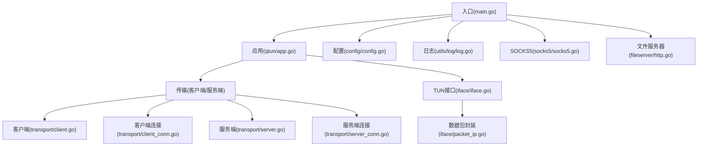
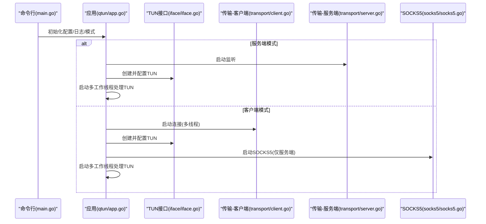
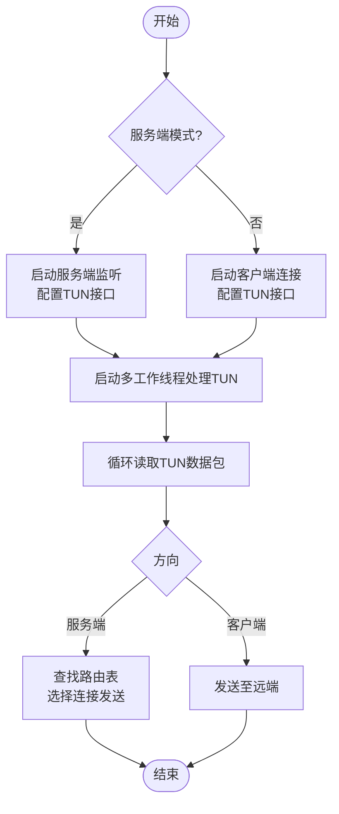
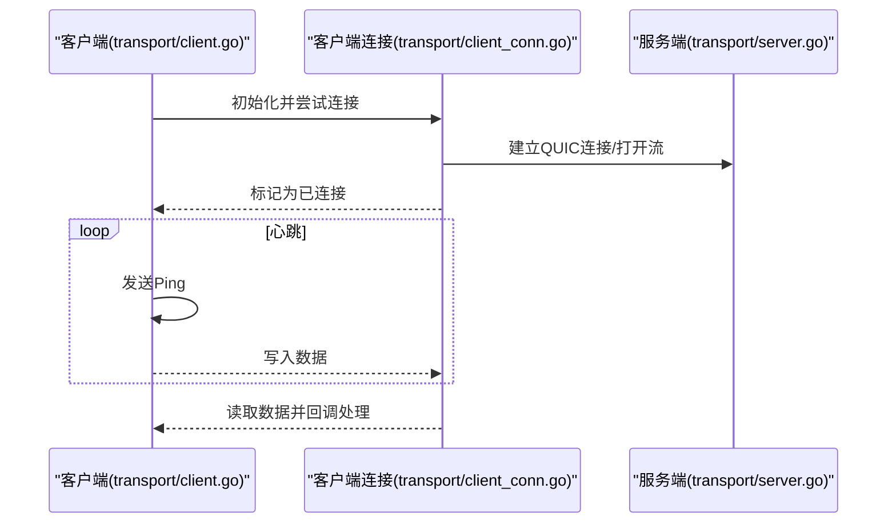
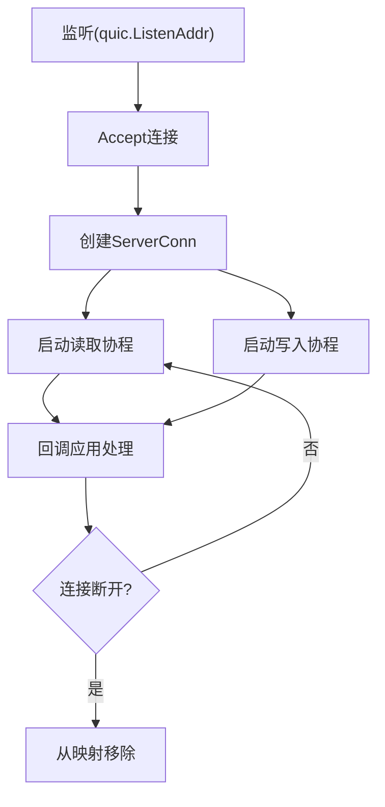
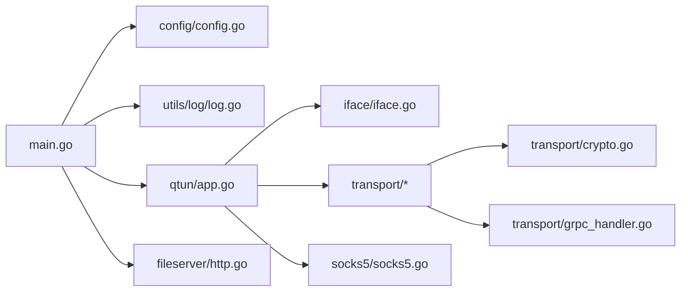
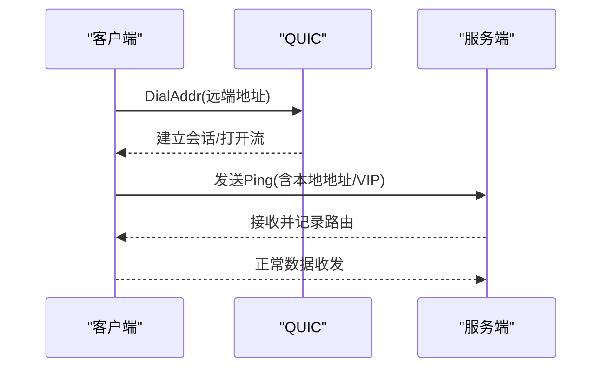

# 故障排除指南

<cite>
**本文引用的文件**
- [README.md](file://README.md)
- [main.go](file://main.go)
- [config/config.go](file://config/config.go)
- [utils/log/log.go](file://utils/log/log.go)
- [transport/client.go](file://transport/client.go)
- [transport/client_conn.go](file://transport/client_conn.go)
- [transport/server.go](file://transport/server.go)
- [transport/server_conn.go](file://transport/server_conn.go)
- [transport/grpc_handler.go](file://transport/grpc_handler.go)
- [transport/crypto.go](file://transport/crypto.go)
- [qtun/app.go](file://qtun/app.go)
- [iface/iface.go](file://iface/iface.go)
- [iface/packet_ip.go](file://iface/packet_ip.go)
- [socks5/socks5.go](file://socks5/socks5.go)
- [fileserver/http.go](file://fileserver/http.go)
- [utils/hash.go](file://utils/hash.go)
</cite>

## 目录
1. [简介](#简介)
2. [项目结构](#项目结构)
3. [核心组件](#核心组件)
4. [架构总览](#架构总览)
5. [详细组件分析与排障](#详细组件分析与排障)
6. [依赖关系分析](#依赖关系分析)
7. [性能注意事项](#性能注意事项)
8. [故障排除指南](#故障排除指南)
9. [结论](#结论)
10. [附录](#附录)

## 简介
本指南面向Qtun用户与运维人员，聚焦于连接失败、数据传输异常、路由问题等常见故障的诊断与解决。内容涵盖日志分析方法、关键错误信息解读、异常堆栈定位、系统资源检查、网络层面排查（防火墙、端口占用、路由表）、系统层面诊断（进程状态、资源使用、系统配置），以及不同操作系统下的特定问题与解决方案。

## 项目结构
- 入口与命令行参数解析：main.go
- 配置管理：config/config.go
- 日志初始化：utils/log/log.go
- 传输层（客户端/服务端）：transport/client.go、transport/client_conn.go、transport/server.go、transport/server_conn.go、transport/grpc_handler.go、transport/crypto.go
- 应用主循环与TUN处理：qtun/app.go
- TUN接口与系统路由：iface/iface.go、iface/packet_ip.go
- SOCKS5代理：socks5/socks5.go
- 文件服务器（用于PAC与静态资源）：fileserver/http.go
- 工具函数与错误处理：utils/hash.go

**图表来源**
- [main.go](file://main.go#L105-L136)
- [qtun/app.go](file://qtun/app.go#L37-L49)
- [config/config.go](file://config/config.go#L17-L24)
- [utils/log/log.go](file://utils/log/log.go#L10-L25)
- [transport/client.go](file://transport/client.go#L31-L83)
- [transport/client_conn.go](file://transport/client_conn.go#L44-L151)
- [transport/server.go](file://transport/server.go#L37-L76)
- [transport/server_conn.go](file://transport/server_conn.go#L39-L115)
- [iface/iface.go](file://iface/iface.go#L31-L74)
- [iface/packet_ip.go](file://iface/packet_ip.go#L18-L47)
- [socks5/socks5.go](file://socks5/socks5.go#L100-L118)
- [fileserver/http.go](file://fileserver/http.go#L9-L16)

**章节来源**
- [main.go](file://main.go#L105-L136)
- [README.md](file://README.md#L1-L99)

## 核心组件
- 命令行与运行时控制：负责解析参数、初始化日志、选择模式（服务端/客户端）、启动SOCKS5或文件服务器、启动应用主循环。
- 应用主循环：根据模式启动传输层，初始化TUN接口，启动多工作线程读取/转发IP数据包。
- 传输层：基于QUIC的客户端与服务端，负责建立连接、加密、心跳、收发数据帧。
- TUN接口：创建TUN设备、配置IP/Mask/MTU、添加系统路由（macOS），读写原始IP包。
- 日志系统：基于zerolog，支持info/debug级别输出，便于问题定位。
- SOCKS5与文件服务器：为客户端提供PAC与系统代理设置支持（仅macOS自动设置）。

**章节来源**
- [main.go](file://main.go#L71-L103)
- [qtun/app.go](file://qtun/app.go#L37-L97)
- [transport/client.go](file://transport/client.go#L41-L83)
- [transport/server.go](file://transport/server.go#L48-L76)
- [iface/iface.go](file://iface/iface.go#L31-L74)
- [utils/log/log.go](file://utils/log/log.go#L10-L25)
- [socks5/socks5.go](file://socks5/socks5.go#L100-L118)
- [fileserver/http.go](file://fileserver/http.go#L9-L16)

## 架构总览

**图表来源**
- [main.go](file://main.go#L75-L103)
- [qtun/app.go](file://qtun/app.go#L37-L97)
- [transport/client.go](file://transport/client.go#L41-L83)
- [transport/server.go](file://transport/server.go#L48-L76)
- [socks5/socks5.go](file://socks5/socks5.go#L100-L118)

## 详细组件分析与排障

### 组件A：应用主循环与TUN处理
- 关键职责：根据模式启动传输层；初始化TUN接口；启动多工作线程读取/转发IP数据包；维护路由表（服务端）。
- 常见问题与排障：
  - TUN创建失败：检查权限（需root）、系统是否支持TUN、IP/Mask/MTU配置合法性。
  - TUN接口未UP：确认ifconfig执行结果与返回值；macOS下检查是否添加了系统路由。
  - 数据包无法转发：检查工作线程数量与CPU核数关系；查看读取/写入日志；确认路由表（服务端）或客户端发送路径。
- 排障要点：
  - 提升日志级别到debug以观察每条数据包的源/目的IP与长度。
  - 客户端侧关注SendPacket调用链；服务端侧关注ServerOnData与路由更新。

**图表来源**
- [qtun/app.go](file://qtun/app.go#L72-L97)
- [qtun/app.go](file://qtun/app.go#L99-L167)

**章节来源**
- [qtun/app.go](file://qtun/app.go#L37-L97)
- [qtun/app.go](file://qtun/app.go#L99-L167)
- [iface/iface.go](file://iface/iface.go#L31-L74)

### 组件B：传输层（客户端）
- 关键职责：多线程连接远端、心跳检测、数据加解密、发送/接收数据帧。
- 常见问题与排障：
  - 连接失败：检查远端地址与端口、证书/协议匹配、超时重试逻辑。
  - 心跳异常：观察ping循环与panic日志；确认KeepAlive周期。
  - 加密不匹配：核对密钥一致性；注意密钥派生方式。
- 排障要点：
  - 观察“连接已建立”“连接失败”“panic”等日志。
  - 使用debug级别查看本地地址、VIP、连接数等上下文。

**图表来源**
- [transport/client.go](file://transport/client.go#L41-L83)
- [transport/client_conn.go](file://transport/client_conn.go#L130-L151)
- [transport/server.go](file://transport/server.go#L112-L148)

**章节来源**
- [transport/client.go](file://transport/client.go#L41-L83)
- [transport/client_conn.go](file://transport/client_conn.go#L130-L151)
- [transport/client_conn.go](file://transport/client_conn.go#L204-L239)
- [transport/client_conn.go](file://transport/client_conn.go#L309-L357)

### 组件C：传输层（服务端）
- 关键职责：监听QUIC地址、接受连接、管理连接映射、读写数据帧、清理死连接。
- 常见问题与排障：
  - 监听失败：检查监听地址/端口占用、TLS配置生成、QUIC配置。
  - 连接读取异常：关注“读取失败”“密钥不匹配”等日志。
  - 路由清理：定期清理无效连接，避免内存泄漏。
- 排障要点：
  - 查看监听循环中的错误日志与重试间隔。
  - 检查连接映射（Conns/ConnsReverse）与删除逻辑。

**图表来源**
- [transport/server.go](file://transport/server.go#L91-L149)
- [transport/server_conn.go](file://transport/server_conn.go#L58-L115)
- [transport/server_conn.go](file://transport/server_conn.go#L251-L290)

**章节来源**
- [transport/server.go](file://transport/server.go#L91-L149)
- [transport/server_conn.go](file://transport/server_conn.go#L58-L115)
- [transport/server_conn.go](file://transport/server_conn.go#L251-L290)

### 组件D：加密与密钥派生
- 关键职责：基于密钥派生AES-GCM算法，提供加密封装与解封。
- 常见问题与排障：
  - 密钥不一致导致解密失败：核对两端密钥；确认密钥派生算法一致。
  - 性能瓶颈：注意nonce池与对象池使用，避免频繁分配。
- 排障要点：
  - 在读取阶段出现“密钥不匹配”时，优先检查密钥配置。

**章节来源**
- [transport/crypto.go](file://transport/crypto.go#L10-L26)
- [transport/server_conn.go](file://transport/server_conn.go#L117-L165)
- [transport/client_conn.go](file://transport/client_conn.go#L119-L128)

### 组件E：日志与错误处理
- 关键职责：统一日志输出与级别控制；POE用于快速暴露错误。
- 常见问题与排障：
  - 日志过少：提升日志级别到debug；观察连接、读写、路由等关键路径日志。
  - 异常堆栈：关注panic日志与recover捕获点，定位具体线程索引与远端地址。
- 排障要点：
  - 使用debug级别查看“连接成功/失败”“读取失败/写入失败”“panic”等上下文。

**章节来源**
- [utils/log/log.go](file://utils/log/log.go#L10-L25)
- [transport/client.go](file://transport/client.go#L142-L157)
- [transport/client_conn.go](file://transport/client_conn.go#L131-L137)
- [transport/server.go](file://transport/server.go#L55-L62)

## 依赖关系分析

**图表来源**
- [main.go](file://main.go#L15-L20)
- [qtun/app.go](file://qtun/app.go#L10-L17)
- [transport/grpc_handler.go](file://transport/grpc_handler.go#L3-L6)

**章节来源**
- [main.go](file://main.go#L15-L20)
- [qtun/app.go](file://qtun/app.go#L10-L17)

## 性能注意事项
- 多工作线程：TUN处理线程数与CPU核数相关，建议在高并发场景适当增加线程数。
- 对象池：数据包与nonce使用池化减少GC压力。
- QUIC配置：合理设置窗口大小、保活周期，平衡吞吐与延迟。
- 日志级别：生产环境建议info级别，调试时切换debug。

[本节为通用指导，无需列出章节来源]

## 故障排除指南

### 一、连接失败
- 现象
  - 客户端启动后长时间无连接或反复重连。
  - 服务端监听失败或accept失败。
- 诊断步骤
  - 检查远端地址与端口是否可达（telnet/nc）。
  - 核对密钥一致性与加密算法。
  - 查看“连接失败”“panic”“listen fail”等日志。
  - 确认QUIC/TLS配置与协议匹配。
- 解决方案
  - 修正远端地址/端口；确保密钥一致。
  - 调整KeepAlive与窗口参数；必要时降低并发线程数。
  - 重启服务端监听并观察重试日志。

**章节来源**
- [transport/client.go](file://transport/client.go#L41-L83)
- [transport/client_conn.go](file://transport/client_conn.go#L130-L151)
- [transport/server.go](file://transport/server.go#L91-L149)

### 二、数据传输异常
- 现象
  - 丢包严重、延迟升高、偶发读取/写入错误。
- 诊断步骤
  - 提升日志级别到debug，观察每条数据包的源/目的IP与长度。
  - 检查TUN接口是否正常（ifconfig输出）。
  - 核查路由表（服务端）或客户端发送路径。
- 解决方案
  - 调整MTU与工作线程数；优化QUIC窗口参数。
  - 修复路由表或TUN配置问题。

**章节来源**
- [qtun/app.go](file://qtun/app.go#L99-L167)
- [iface/iface.go](file://iface/iface.go#L31-L74)

### 三、路由问题
- 现象
  - 服务端有路由但无可用连接，或找不到目标连接。
- 诊断步骤
  - 查看“无路由/无连接/丢弃包”日志。
  - 检查路由表清理任务是否正常运行。
- 解决方案
  - 确保客户端Ping正确上报本地地址与VIP；服务端及时更新路由。
  - 手动清理无效连接并重建。

**章节来源**
- [qtun/app.go](file://qtun/app.go#L51-L70)
- [qtun/app.go](file://qtun/app.go#L169-L207)

### 四、日志分析与关键错误解读
- 常见日志类型
  - “连接已建立/连接失败/panic”：定位连接线程与远端地址。
  - “读取失败/写入失败”：定位读写协程与错误原因。
  - “listen fail/accept fail”：定位监听与接受阶段。
  - “密钥不匹配”：定位加密配置不一致。
- 错误码与含义
  - 代码中存在关闭连接时使用的错误码（如0x1/0x2），用于区分不同类型的异常关闭。
- 异常堆栈分析
  - 关注panic日志与recover捕获点，结合线程索引与远端地址定位问题。

**章节来源**
- [transport/client_conn.go](file://transport/client_conn.go#L131-L137)
- [transport/server_conn.go](file://transport/server_conn.go#L58-L74)
- [transport/server_conn.go](file://transport/server_conn.go#L117-L165)

### 五、网络层面排查
- 防火墙与端口
  - 确认服务端监听端口未被防火墙拦截；客户端可访问。
  - 使用工具验证端口连通性。
- 路由表
  - macOS下TUN接口会添加系统路由；若失败需手动检查路由命令输出。
- QUIC特性
  - 注意QUIC的握手与连接复用机制，避免误判为连接失败。

**章节来源**
- [transport/server.go](file://transport/server.go#L91-L149)
- [iface/iface.go](file://iface/iface.go#L76-L92)

### 六、系统层面诊断
- 进程状态
  - 检查进程是否正常运行；观察日志输出。
- 资源使用
  - CPU/内存/GC：关注对象池使用情况；避免频繁分配。
- 系统配置
  - TUN设备权限与配置；IP/Mask/MTU设置；系统路由。

**章节来源**
- [qtun/app.go](file://qtun/app.go#L72-L97)
- [iface/iface.go](file://iface/iface.go#L31-L74)

### 七、不同操作系统下的特定问题
- macOS
  - 自动设置系统代理（PAC）；TUN接口创建与系统路由添加。
- Linux
  - 自动设置系统代理不支持，需手动配置；其余功能可用。
- Windows
  - 不支持。

**章节来源**
- [qtun/app.go](file://qtun/app.go#L250-L270)
- [README.md](file://README.md#L94-L99)

## 结论
通过分层定位（命令行/应用/传输/TUN/日志）与系统化排查（网络/路由/资源/配置），大多数连接与传输问题均可快速定位与修复。建议在生产环境中保持合理的日志级别与监控策略，以便快速响应异常。

## 附录

### A. 常用命令与参数
- 启动服务端：指定监听地址、密钥、IP段、模式。
- 启动客户端：指定远端地址、密钥、IP段、并发线程数。
- 日志级别：info/debug；可调整以获取更详细信息。

**章节来源**
- [README.md](file://README.md#L13-L26)
- [README.md](file://README.md#L51-L88)

### B. 关键流程图（连接建立）

**图表来源**
- [transport/client_conn.go](file://transport/client_conn.go#L95-L117)
- [transport/server.go](file://transport/server.go#L112-L148)
- [qtun/app.go](file://qtun/app.go#L169-L207)