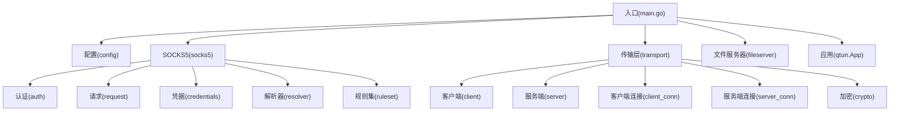
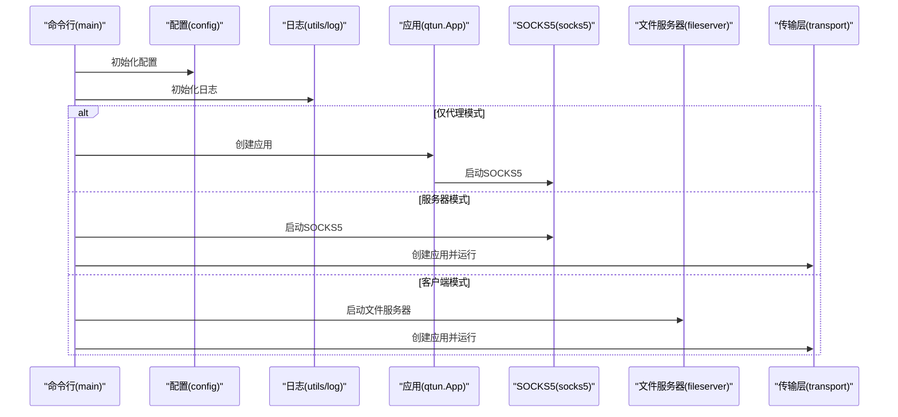
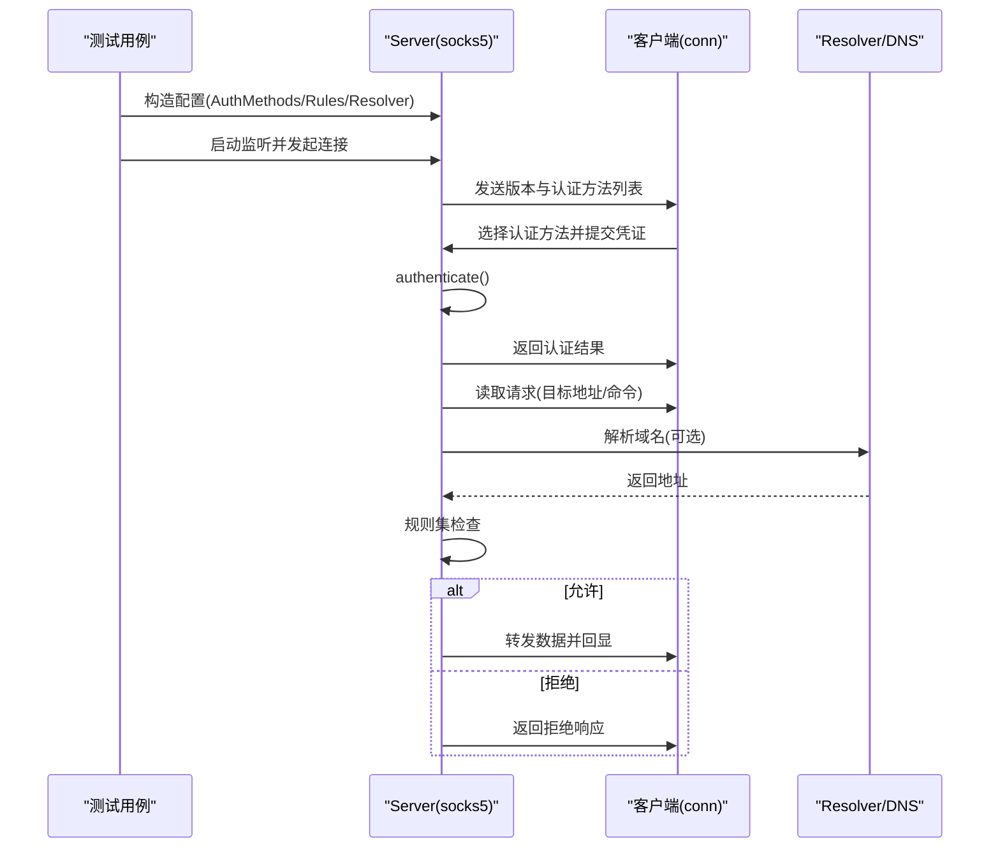
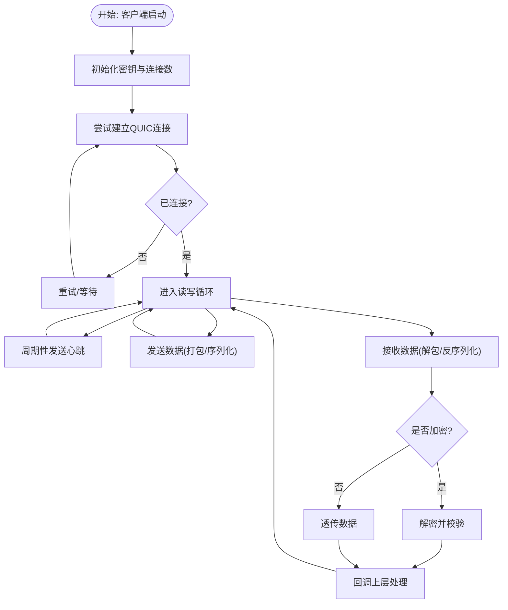
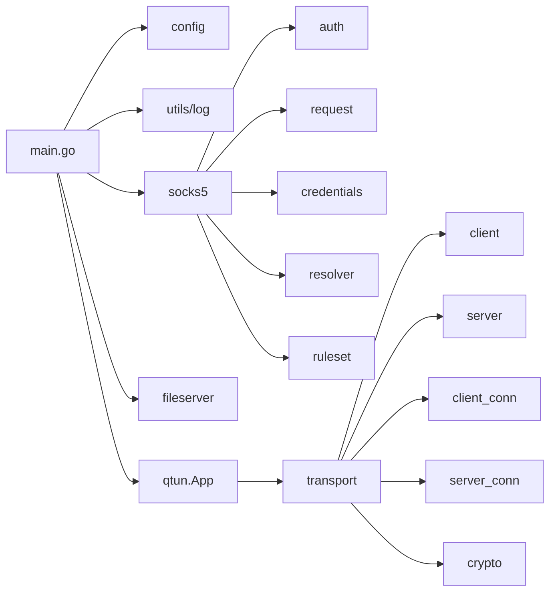

# 测试策略与实践

<cite>
**本文引用的文件**
- [main.go](file://main.go)
- [go.mod](file://go.mod)
- [Makefile](file://Makefile)
- [README.md](file://README.md)
- [socks5/socks5.go](file://socks5/socks5.go)
- [socks5/socks5_test.go](file://socks5/socks5_test.go)
- [socks5/auth_test.go](file://socks5/auth_test.go)
- [socks5/request_test.go](file://socks5/request_test.go)
- [socks5/credentials_test.go](file://socks5/credentials_test.go)
- [socks5/resolver_test.go](file://socks5/resolver_test.go)
- [socks5/ruleset_test.go](file://socks5/ruleset_test.go)
- [transport/client.go](file://transport/client.go)
- [transport/server.go](file://transport/server.go)
- [transport/client_conn.go](file://transport/client_conn.go)
- [transport/server_conn.go](file://transport/server_conn.go)
- [transport/crypto.go](file://transport/crypto.go)
</cite>

## 目录
1. [引言](#引言)
2. [项目结构](#项目结构)
3. [核心组件](#核心组件)
4. [架构总览](#架构总览)
5. [详细组件分析](#详细组件分析)
6. [依赖关系分析](#依赖关系分析)
7. [性能考量](#性能考量)
8. [故障排查指南](#故障排查指南)
9. [结论](#结论)
10. [附录](#附录)

## 引言
本指南面向Qtun项目的测试策略与实践，目标是帮助开发者建立系统化的单元测试与集成测试流程，覆盖SOCKS5代理、传输层（客户端/服务端）、认证与加密等关键模块。文档同时给出测试用例设计原则、断言方法、测试数据准备、覆盖率要求与测量方法，以及测试驱动开发（TDD）与持续集成（CI）中的测试自动化配置建议。

## 项目结构
Qtun采用Go语言模块化组织，核心功能按领域拆分：入口命令行、SOCKS5代理、传输层（QUIC）、配置与工具等。测试主要集中在socks5与transport两大模块，分别验证协议交互、规则集、认证与加解密逻辑；transport模块通过并发连接、消息编解码与QUIC流处理体现复杂性，适合进行集成测试与端到端场景验证。

图表来源
- [main.go](file://main.go#L1-L136)
- [socks5/socks5.go](file://socks5/socks5.go#L1-L170)
- [transport/client.go](file://transport/client.go#L1-L223)
- [transport/server.go](file://transport/server.go#L1-L219)

章节来源
- [main.go](file://main.go#L1-L136)
- [README.md](file://README.md#L1-L99)

## 核心组件
- 入口与命令行：负责参数解析、初始化日志与配置、启动SOCKS5或文件服务器、创建并运行应用实例。
- SOCKS5代理：包含认证、请求解析、地址解析、规则集与可插拔的重写器，支持无认证与用户密码认证。
- 传输层：基于QUIC的客户端/服务端实现，具备多线程连接、心跳保活、消息池复用、加解密封装与并发安全的连接管理。
- 加密模块：基于对称加密算法生成AEAD上下文，用于传输层数据的安全封装。

章节来源
- [main.go](file://main.go#L22-L103)
- [socks5/socks5.go](file://socks5/socks5.go#L13-L97)
- [transport/client.go](file://transport/client.go#L20-L95)
- [transport/server.go](file://transport/server.go#L23-L76)
- [transport/crypto.go](file://transport/crypto.go#L10-L26)

## 架构总览
下图展示了Qtun从命令行入口到各子系统的调用关系与控制流，便于理解测试切入点与集成测试场景。

图表来源
- [main.go](file://main.go#L75-L103)
- [socks5/socks5.go](file://socks5/socks5.go#L100-L118)
- [transport/client.go](file://transport/client.go#L41-L95)

## 详细组件分析

### 单元测试编写规范与最佳实践
- 设计原则
  - 每个测试聚焦单一行为或边界条件，避免“一测多能”。
  - 使用表驱动测试（table-driven tests）覆盖多种输入组合与错误路径。
  - 避免外部依赖（网络、磁盘），必要时使用接口注入或mock。
  - 前置条件明确，断言清晰，失败信息具体。
- 断言方法
  - 使用标准库testing包的断言函数，配合错误类型判断与返回值比较。
  - 对于字符串或字节序列比较，优先使用等价性断言，忽略可变字段（如端口）后再比对。
- 测试数据准备
  - 使用内存监听与本地回环地址，避免真实网络设备。
  - 对于协议交互，构造精确的二进制请求/响应缓冲区，确保协议字段完整且顺序正确。
  - 对认证与规则集，准备多组凭据与规则组合，覆盖允许/拒绝、空用户名/密码等场景。

章节来源
- [socks5/socks5_test.go](file://socks5/socks5_test.go#L14-L110)
- [socks5/auth_test.go](file://socks5/auth_test.go#L8-L119)
- [socks5/request_test.go](file://socks5/request_test.go#L26-L99)
- [socks5/credentials_test.go](file://socks5/credentials_test.go#L7-L24)
- [socks5/resolver_test.go](file://socks5/resolver_test.go#L9-L21)
- [socks5/ruleset_test.go](file://socks5/ruleset_test.go#L9-L24)

### SOCKS5代理测试策略
- 认证模块
  - 无认证与用户密码认证：构造不同认证选择列表，验证协商结果与上下文负载。
  - 用户名/密码错误：断言认证失败与相应响应。
  - 不支持的认证方法：断言返回不可接受的认证方式。
- 请求处理
  - 连接请求：构造CONNECT请求，包含目标地址与端口，验证代理转发与回显。
  - 规则集拦截：使用禁止所有规则，验证被拦截与对应错误响应。
- 凭据与解析器
  - 静态凭据校验：覆盖有效/无效用户名/密码组合。
  - DNS解析器：验证解析结果为回环地址。
- 规则集
  - 命令许可：验证仅允许指定命令，拒绝其他命令。

图表来源
- [socks5/socks5.go](file://socks5/socks5.go#L121-L169)
- [socks5/auth_test.go](file://socks5/auth_test.go#L29-L92)
- [socks5/request_test.go](file://socks5/request_test.go#L26-L99)
- [socks5/resolver_test.go](file://socks5/resolver_test.go#L9-L21)

章节来源
- [socks5/socks5.go](file://socks5/socks5.go#L18-L97)
- [socks5/auth_test.go](file://socks5/auth_test.go#L8-L119)
- [socks5/request_test.go](file://socks5/request_test.go#L26-L169)
- [socks5/credentials_test.go](file://socks5/credentials_test.go#L7-L24)
- [socks5/resolver_test.go](file://socks5/resolver_test.go#L9-L21)
- [socks5/ruleset_test.go](file://socks5/ruleset_test.go#L9-L24)

### 传输层测试策略
- 客户端
  - 多线程连接：验证连接建立、保活心跳、写入路由与关闭流程。
  - 写入与负载：构造协议消息，验证序列化与发送。
  - 错误恢复：断言重试与告警日志。
- 服务端
  - 并发连接管理：验证连接映射、查找、删除与清理。
  - TLS/QUIC监听：验证监听循环与异常处理。
- 连接通道
  - 客户端连接：验证加密初始化、连接尝试、读写处理与关闭。
  - 服务端连接：验证解密、读取、回调处理与异常分支。
- 加密
  - AEAD生成：验证密钥派生与AEAD上下文创建。

图表来源
- [transport/client.go](file://transport/client.go#L41-L132)
- [transport/client_conn.go](file://transport/client_conn.go#L130-L151)
- [transport/server_conn.go](file://transport/server_conn.go#L129-L165)
- [transport/crypto.go](file://transport/crypto.go#L10-L26)

章节来源
- [transport/client.go](file://transport/client.go#L20-L223)
- [transport/server.go](file://transport/server.go#L23-L219)
- [transport/client_conn.go](file://transport/client_conn.go#L24-L200)
- [transport/server_conn.go](file://transport/server_conn.go#L24-L200)
- [transport/crypto.go](file://transport/crypto.go#L10-L26)

### 集成测试与端到端场景
- 网络模拟
  - 使用本地回环地址与动态端口，避免真实网络设备与权限问题。
  - 对SOCKS5与传输层分别进行最小化集成：先验证协议交互，再叠加加密与并发。
- 端到端场景
  - 服务器模式：启动SOCKS5与传输服务，客户端连接并发起数据传输，验证连通性与数据一致性。
  - 客户端模式：启动文件服务器与传输服务，客户端通过HTTP下载与SOCKS5代理访问。
- 测试环境搭建
  - 使用Makefile提供的构建脚本，确保跨平台产物一致。
  - 在CI中以非特权用户运行（若需提升权限，使用容器或沙箱）。

章节来源
- [Makefile](file://Makefile#L3-L22)
- [README.md](file://README.md#L13-L26)
- [main.go](file://main.go#L88-L102)

## 依赖关系分析
- 模块耦合
  - 入口模块依赖配置、日志、SOCKS5、文件服务器与应用模块。
  - SOCKS5模块内部通过配置聚合认证、解析器、规则集与日志。
  - 传输层模块通过QUIC与自定义协议交互，依赖加密与消息池。
- 外部依赖
  - QUIC、Protobuf、日志库等第三方库在go.mod中声明，测试应避免直接依赖外部网络服务。

图表来源
- [go.mod](file://go.mod#L5-L28)
- [main.go](file://main.go#L15-L20)
- [socks5/socks5.go](file://socks5/socks5.go#L18-L51)
- [transport/client.go](file://transport/client.go#L11-L17)

章节来源
- [go.mod](file://go.mod#L1-L29)
- [main.go](file://main.go#L1-L136)

## 性能考量
- 单元测试
  - 使用小数据量与短超时，避免阻塞测试执行。
  - 对并发路径使用确定性输入，减少竞态与不稳定因素。
- 集成测试
  - 控制并发度与连接数，避免资源耗尽。
  - 关注序列化/反序列化与加解密开销，必要时引入基准测试（benchmarks）。
- 覆盖率
  - 使用Go内置覆盖率工具收集覆盖率报告，识别未覆盖的分支与路径。
  - 对关键路径（认证、规则集、加解密、连接管理）设定最低覆盖率阈值。

章节来源
- [transport/client.go](file://transport/client.go#L41-L95)
- [transport/server.go](file://transport/server.go#L97-L103)

## 故障排查指南
- SOCKS5常见问题
  - 认证失败：检查用户名/密码与支持的认证方法列表。
  - 地址解析异常：确认解析器实现与上下文传递。
  - 规则集拦截：核对规则集配置与命令类型。
- 传输层常见问题
  - 连接失败：检查QUIC监听地址、TLS配置与防火墙。
  - 加密不匹配：核对密钥一致性与AEAD上下文生成。
  - 并发异常：关注连接映射与读写循环的异常退出路径。
- 日志与诊断
  - 利用日志级别与上下文信息定位问题根因。
  - 在测试中结合日志输出与断言，快速定位失败点。

章节来源
- [socks5/socks5.go](file://socks5/socks5.go#L121-L169)
- [transport/server_conn.go](file://transport/server_conn.go#L58-L115)
- [transport/crypto.go](file://transport/crypto.go#L10-L26)

## 结论
通过围绕SOCKS5与传输层的关键模块建立完善的单元测试与集成测试体系，可以有效保障协议兼容性、安全性与稳定性。建议在持续集成中启用覆盖率统计与基准测试，形成可追溯的质量闭环，并结合TDD推动高质量代码演进。

## 附录
- 测试覆盖率要求与测量
  - 覆盖率工具：使用Go内置覆盖率（go test -cover）与HTML报告（go test -coverprofile=c.out && go tool cover -html=c.out）。
  - 阈值建议：关键模块不低于80%，核心路径不低于90%。
- 测试驱动开发（TDD）实践
  - 先写失败的测试，再实现最小可行代码，最后重构与优化。
  - 将测试作为设计说明书，确保接口稳定与行为可预期。
- 持续集成中的测试自动化
  - CI流水线：构建 → 单元测试（含覆盖率）→ 集成测试 → 打包发布。
  - 缓存依赖：利用Go模块缓存加速构建。
  - 并发与隔离：为不同模块分配独立测试任务，避免端口冲突。

章节来源
- [go.mod](file://go.mod#L1-L29)
- [Makefile](file://Makefile#L3-L22)
- [README.md](file://README.md#L13-L26)