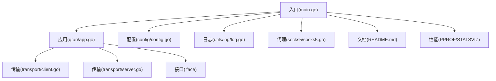
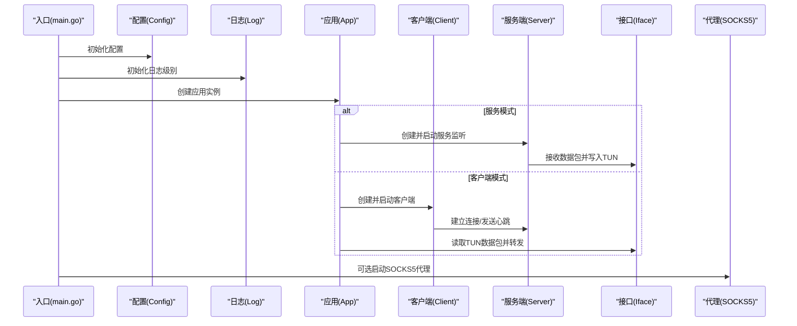
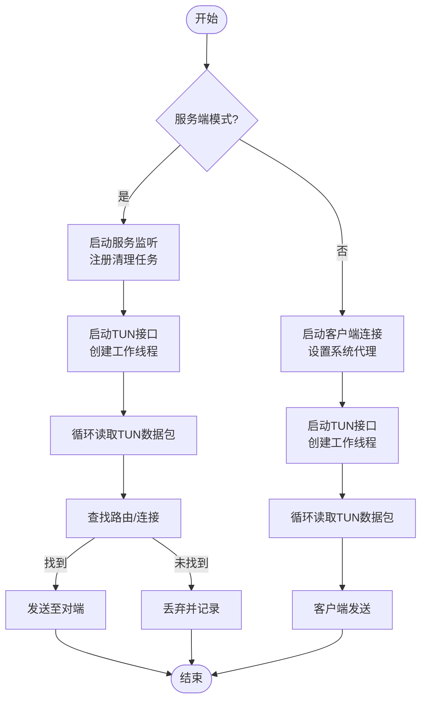
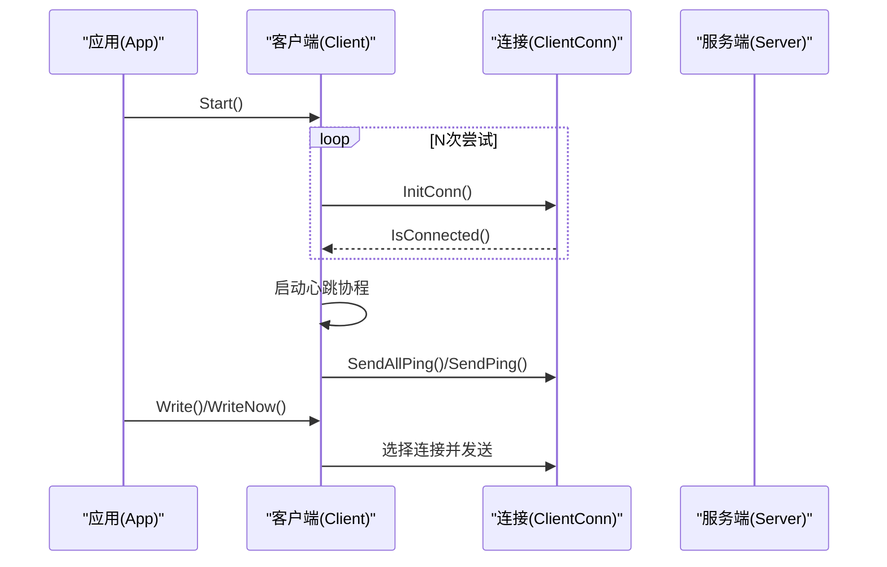
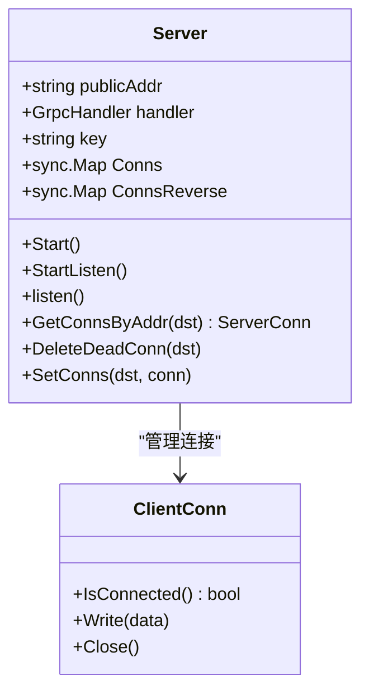
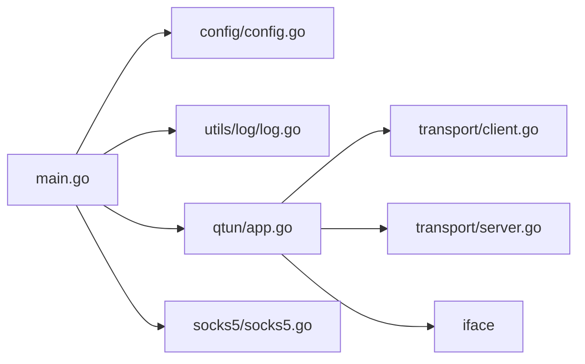

# 调试与测试

<cite>
**本文引用的文件**
- [main.go](file://main.go)
- [go.mod](file://go.mod)
- [README.md](file://README.md)
- [PERFORMANCE_TEST_GUIDE.md](file://PERFORMANCE_TEST_GUIDE.md)
- [qtun/app.go](file://qtun/app.go)
- [config/config.go](file://config/config.go)
- [utils/log/log.go](file://utils/log/log.go)
- [transport/client.go](file://transport/client.go)
- [transport/server.go](file://transport/server.go)
- [socks5/socks5.go](file://socks5/socks5.go)
- [socks5/auth_test.go](file://socks5/auth_test.go)
- [socks5/request_test.go](file://socks5/request_test.go)
- [socks5/socks5_test.go](file://socks5/socks5_test.go)
</cite>

## 目录
1. [简介](#简介)
2. [项目结构](#项目结构)
3. [核心组件](#核心组件)
4. [架构总览](#架构总览)
5. [详细组件分析](#详细组件分析)
6. [依赖关系分析](#依赖关系分析)
7. [性能与调试工具](#性能与调试工具)
8. [单元测试与覆盖率](#单元测试与覆盖率)
9. [集成测试策略](#集成测试策略)
10. [日志系统与调试信息解读](#日志系统与调试信息解读)
11. [故障排查与性能瓶颈定位](#故障排查与性能瓶颈定位)
12. [结论](#结论)

## 简介
本指南面向Qtun项目的开发者与运维人员，系统性讲解如何在Go环境中进行高效调试与测试，覆盖以下主题：
- Go调试工具：Delve（dlv）、pprof性能分析、race数据竞争检测
- 单元测试规范与覆盖率要求
- 关键模块测试用例示例与编写要点
- 集成测试策略：网络模拟、端到端场景
- 日志系统使用与调试信息解读
- 常见问题的调试流程与性能瓶颈定位方法

## 项目结构
该项目采用按功能域分层的组织方式，主要模块如下：
- 入口与CLI：main.go负责命令行参数解析、初始化日志与应用生命周期
- 应用核心：qtun/app.go封装TUN接口读写、路由维护、收发处理
- 配置管理：config/config.go提供全局配置单例
- 日志系统：utils/log/log.go基于zerolog实现控制台输出与级别切换
- 传输层：transport/client.go与transport/server.go分别实现客户端与服务端连接、QUIC监听与消息处理
- 代理服务：socks5/socks5.go提供SOCKS5服务端能力
- 测试：socks5目录下包含认证、请求、规则等测试用例

图表来源
- [main.go](file://main.go#L1-L136)
- [qtun/app.go](file://qtun/app.go#L1-L271)
- [config/config.go](file://config/config.go#L1-L24)
- [utils/log/log.go](file://utils/log/log.go#L1-L26)
- [transport/client.go](file://transport/client.go#L1-L223)
- [transport/server.go](file://transport/server.go#L1-L219)
- [socks5/socks5.go](file://socks5/socks5.go#L1-L170)

章节来源
- [main.go](file://main.go#L1-L136)
- [README.md](file://README.md#L1-L99)

## 核心组件
- 应用App：负责TUN接口启动、工作线程调度、路由清理、数据包收发与协议处理
- 客户端Client：多连接管理、连接建立与重试、心跳PING、负载均衡发送
- 服务端Server：QUIC监听、连接接受与读写协程、并发连接表维护
- 配置Config：全局配置单例，贯穿各模块
- 日志Log：基于zerolog的控制台输出与级别切换
- 代理Server：SOCKS5认证、请求解析、规则校验与转发

章节来源
- [qtun/app.go](file://qtun/app.go#L1-L271)
- [transport/client.go](file://transport/client.go#L1-L223)
- [transport/server.go](file://transport/server.go#L1-L219)
- [config/config.go](file://config/config.go#L1-L24)
- [utils/log/log.go](file://utils/log/log.go#L1-L26)
- [socks5/socks5.go](file://socks5/socks5.go#L1-L170)

## 架构总览
下图展示了从入口到应用、再到传输与代理的关键交互路径。

图表来源
- [main.go](file://main.go#L70-L103)
- [qtun/app.go](file://qtun/app.go#L37-L97)
- [transport/client.go](file://transport/client.go#L41-L83)
- [transport/server.go](file://transport/server.go#L48-L76)
- [socks5/socks5.go](file://socks5/socks5.go#L99-L118)

## 详细组件分析

### 应用App（TUN与路由）
- 启动逻辑：根据模式选择服务端或客户端路径；服务端启动监听与定时清理任务；客户端启动多连接并设置系统代理
- 工作线程：基于CPU核数动态计算工作线程数量，范围限制在4~32之间
- 路由维护：周期性清理无效连接，避免僵尸连接占用资源
- 数据包处理：读取TUN数据包，服务端按目的IP查找连接并发送，客户端直接转发

图表来源
- [qtun/app.go](file://qtun/app.go#L37-L97)
- [qtun/app.go](file://qtun/app.go#L108-L166)
- [qtun/app.go](file://qtun/app.go#L51-L70)

章节来源
- [qtun/app.go](file://qtun/app.go#L37-L97)
- [qtun/app.go](file://qtun/app.go#L108-L166)
- [qtun/app.go](file://qtun/app.go#L51-L70)

### 客户端Client（多连接与心跳）
- 多连接：按线程数创建连接，带重试与状态统计
- 心跳：定期发送PING，携带本地地址与VIP信息
- 负载均衡：原子递增序列号选择连接，实现简单轮询

图表来源
- [transport/client.go](file://transport/client.go#L41-L83)
- [transport/client.go](file://transport/client.go#L142-L157)
- [transport/client.go](file://transport/client.go#L114-L132)

章节来源
- [transport/client.go](file://transport/client.go#L41-L83)
- [transport/client.go](file://transport/client.go#L142-L157)
- [transport/client.go](file://transport/client.go#L114-L132)

### 服务端Server（QUIC监听与并发连接）
- QUIC监听：配置接收窗口、流数量、保活周期等参数
- 并发模型：使用sync.Map维护连接映射，读写分离协程
- 连接管理：支持按地址/指针删除死连接，清理僵尸连接

图表来源
- [transport/server.go](file://transport/server.go#L23-L46)
- [transport/server.go](file://transport/server.go#L91-L149)
- [transport/server.go](file://transport/server.go#L175-L200)

章节来源
- [transport/server.go](file://transport/server.go#L23-L46)
- [transport/server.go](file://transport/server.go#L91-L149)
- [transport/server.go](file://transport/server.go#L175-L200)

### 配置Config（全局配置单例）
- 提供密钥、远端地址、监听地址、线程数、IP/Mtu、模式、NoDelay等字段
- 通过InitConfig设置全局实例，通过GetInstance获取

章节来源
- [config/config.go](file://config/config.go#L1-L24)

### 日志Log（zerolog控制台输出）
- 初始化控制台输出器，支持info/debug级别切换
- 全局日志在应用启动时按命令行参数设置

章节来源
- [utils/log/log.go](file://utils/log/log.go#L1-L26)
- [main.go](file://main.go#L86-L86)

### 代理Server（SOCKS5）
- 支持无认证与用户密码认证
- 请求解析、规则校验、DNS解析与转发
- 提供完整的单元测试覆盖认证与请求场景

章节来源
- [socks5/socks5.go](file://socks5/socks5.go#L1-L170)
- [socks5/auth_test.go](file://socks5/auth_test.go#L1-L120)
- [socks5/request_test.go](file://socks5/request_test.go#L1-L170)
- [socks5/socks5_test.go](file://socks5/socks5_test.go#L1-L111)

## 依赖关系分析
- 入口依赖配置、日志、应用与代理模块
- 应用依赖配置、传输与接口模块
- 传输层依赖配置、协议与zerolog
- 代理依赖标准库net与上下文

图表来源
- [main.go](file://main.go#L15-L20)
- [qtun/app.go](file://qtun/app.go#L3-L17)
- [transport/client.go](file://transport/client.go#L3-L18)
- [transport/server.go](file://transport/server.go#L3-L21)
- [socks5/socks5.go](file://socks5/socks5.go#L3-L11)

章节来源
- [go.mod](file://go.mod#L1-L29)

## 性能与调试工具
- pprof与statsviz：项目内置statsviz注册与HTTP端口监听，便于实时可视化与性能分析
- race检测：可使用go test -race或go run -race进行数据竞争检测
- 性能测试：参考性能测试指南，涵盖吞吐量、延迟、并发、CPU/内存与Goroutine分析

章节来源
- [main.go](file://main.go#L118-L129)
- [PERFORMANCE_TEST_GUIDE.md](file://PERFORMANCE_TEST_GUIDE.md#L1-L323)

## 单元测试与覆盖率
- 测试规范
  - 使用testing包，按模块划分测试文件（如socks5目录）
  - 使用表驱动测试与Mock（如request_test中自定义MockConn）
  - 断言明确，覆盖正常路径与异常路径
- 覆盖率要求建议
  - 关键路径（路由、连接管理、协议处理）覆盖率≥80%
  - 认证与请求处理（SOCKS5）覆盖率≥90%
  - 使用go test -coverprofile=coverage.out -coverpkg=./...生成覆盖率报告
- 示例用例
  - SOCKS5认证：无认证、用户名密码认证成功/失败、不支持的认证方法
  - SOCKS5请求：CONNECT请求、规则拒绝、DNS解析与转发
  - 端到端：SOCKS5服务端与客户端握手、认证、请求转发

章节来源
- [socks5/auth_test.go](file://socks5/auth_test.go#L1-L120)
- [socks5/request_test.go](file://socks5/request_test.go#L1-L170)
- [socks5/socks5_test.go](file://socks5/socks5_test.go#L1-L111)

## 集成测试策略
- 网络模拟
  - 使用本地回环地址与随机端口，避免外部依赖
  - 通过iperf3、ping等工具进行端到端链路测试
- 端到端场景
  - 服务端模式：启动服务端，客户端通过VPN IP互通
  - 客户端模式：启动客户端，访问服务端提供的代理或文件服务
- 规则与代理
  - 验证SOCKS5规则集对不同目标的放行/拦截行为
  - 验证系统代理设置与PAC文件生效情况

章节来源
- [README.md](file://README.md#L13-L26)
- [qtun/app.go](file://qtun/app.go#L250-L270)

## 日志系统与调试信息解读
- 日志初始化：在入口处按命令行参数设置日志级别
- 常用字段：包含工作线程号、源/目的IP、包长度、连接地址、路由表等
- 调试技巧
  - info级别：确认关键流程与状态变化
  - debug级别：深入定位数据包流转与连接状态
  - 结合statsviz与pprof观察运行时状态与热点

章节来源
- [utils/log/log.go](file://utils/log/log.go#L10-L25)
- [qtun/app.go](file://qtun/app.go#L108-L166)
- [transport/client.go](file://transport/client.go#L142-L157)
- [transport/server.go](file://transport/server.go#L118-L148)

## 故障排查与性能瓶颈定位
- 常见问题
  - 连接无法建立：检查密钥、监听/远端地址、防火墙与QUIC参数
  - 数据包丢失：检查路由表、连接有效性与工作线程数量
  - 代理不可用：验证SOCKS5端口、规则集与系统代理设置
- 性能瓶颈定位
  - CPU/内存：使用pprof采集CPU/堆/Goroutine快照，结合statsviz观察趋势
  - 锁争用：关注FetchAndProcessTunPkt中的读写锁使用
  - 网络参数：调整QUIC窗口与流数量，观察吞吐与延迟变化
- 建议流程
  - 启用statsviz与pprof端口
  - 逐步缩小范围：先验证网络连通性，再检查路由与连接，最后分析性能指标

章节来源
- [PERFORMANCE_TEST_GUIDE.md](file://PERFORMANCE_TEST_GUIDE.md#L85-L135)
- [qtun/app.go](file://qtun/app.go#L72-L97)
- [transport/server.go](file://transport/server.go#L96-L103)

## 结论
通过统一的日志体系、完善的单元测试与集成测试策略，以及pprof/Statsviz/race等工具的配合，可以系统性提升Qtun的开发效率与运行质量。建议在开发与发布流程中固化以下实践：
- 默认开启statsviz与pprof端口，便于快速诊断
- 以覆盖率与关键路径为核心制定测试目标
- 在CI中加入race检测与基础性能回归
- 将日志作为第一诊断手段，配合可视化工具进行根因分析