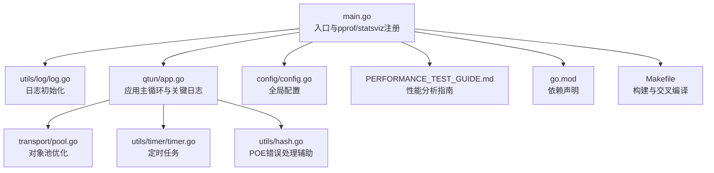
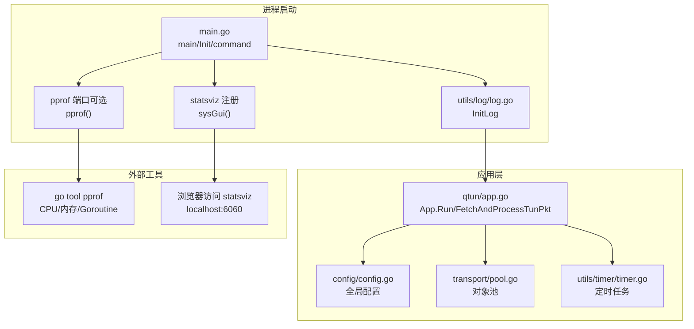
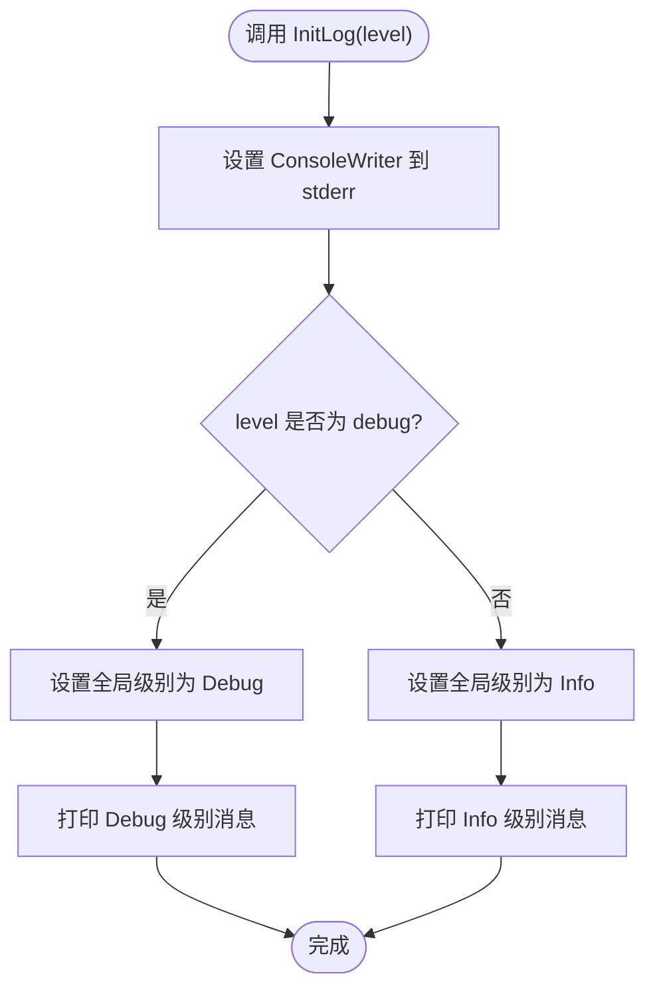
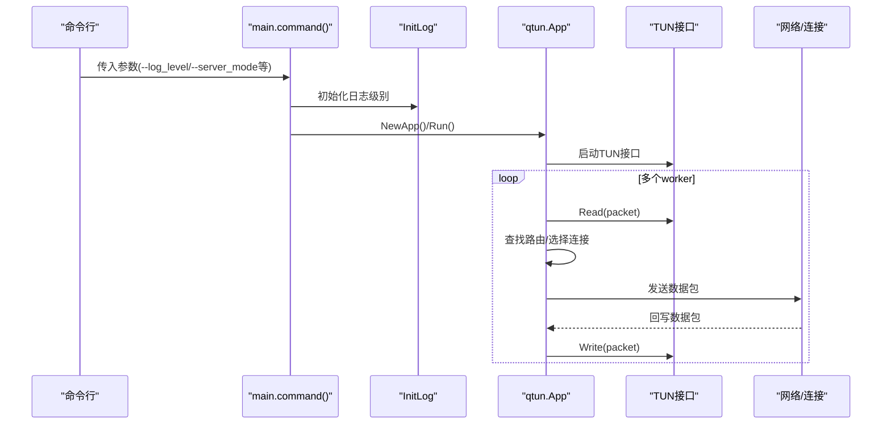
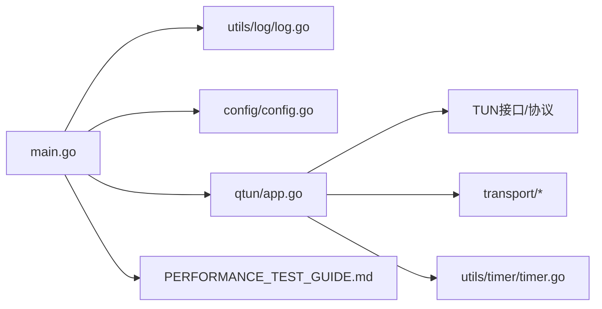

# 调试工具使用

<cite>
**本文引用的文件**
- [main.go](file://main.go)
- [utils/log/log.go](file://utils/log/log.go)
- [qtun/app.go](file://qtun/app.go)
- [config/config.go](file://config/config.go)
- [PERFORMANCE_TEST_GUIDE.md](file://PERFORMANCE_TEST_GUIDE.md)
- [transport/pool.go](file://transport/pool.go)
- [utils/timer/timer.go](file://utils/timer/timer.go)
- [utils/hash.go](file://utils/hash.go)
- [go.mod](file://go.mod)
- [Makefile](file://Makefile)
</cite>

## 目录
1. [简介](#简介)
2. [项目结构](#项目结构)
3. [核心组件](#核心组件)
4. [架构总览](#架构总览)
5. [详细组件分析](#详细组件分析)
6. [依赖关系分析](#依赖关系分析)
7. [性能与调试工具](#性能与调试工具)
8. [故障排查指南](#故障排查指南)
9. [结论](#结论)
10. [附录](#附录)

## 简介
本指南面向使用 Qtun 的开发者与运维人员，系统讲解如何在 Qtun 项目中开展调试工作，覆盖以下方面：
- 日志系统使用与级别控制
- 性能分析工具 pprof 的使用（CPU、内存、Goroutine）
- 竞态检测（Race Detector）的启用与使用
- 实战调试场景与命令示例
- 与构建、运行流程的结合点

## 项目结构
从入口到核心业务模块，Qtun 的调试相关能力主要分布在如下位置：
- 入口与命令行参数解析：main.go
- 日志初始化与级别控制：utils/log/log.go
- 应用主循环与关键路径日志：qtun/app.go
- 配置初始化与全局配置：config/config.go
- 性能分析与可视化监控：main.go（statsviz）、PERFORMANCE_TEST_GUIDE.md
- 对象池与内存优化：transport/pool.go
- 定时任务与后台清理：utils/timer/timer.go
- 工具函数与错误处理辅助：utils/hash.go
- 构建与依赖：go.mod、Makefile

图表来源
- [main.go](file://main.go#L1-L136)
- [utils/log/log.go](file://utils/log/log.go#L1-L26)
- [qtun/app.go](file://qtun/app.go#L1-L271)
- [config/config.go](file://config/config.go#L1-L24)
- [PERFORMANCE_TEST_GUIDE.md](file://PERFORMANCE_TEST_GUIDE.md#L1-L323)
- [transport/pool.go](file://transport/pool.go#L1-L108)
- [utils/timer/timer.go](file://utils/timer/timer.go#L1-L55)
- [utils/hash.go](file://utils/hash.go#L1-L42)
- [go.mod](file://go.mod#L1-L29)
- [Makefile](file://Makefile#L1-L23)

章节来源
- [main.go](file://main.go#L1-L136)
- [go.mod](file://go.mod#L1-L29)
- [Makefile](file://Makefile#L1-L23)

## 核心组件
- 日志系统
  - 初始化方式：通过命令行参数选择日志级别，初始化控制台输出。
  - 支持级别：info、debug；默认 info。
- 应用主循环
  - 根据配置决定服务端/客户端模式，启动 TUN 接口与数据包处理协程。
  - 关键路径包含丰富的调试日志，便于定位网络转发、路由表、连接状态等问题。
- 配置系统
  - 提供密钥、远端地址、监听地址、MTU、线程数、模式等关键参数。
- 性能分析与可视化
  - 默认开启 statsviz 可视化监控；pprof 端点可选启用。
- 对象池与内存优化
  - 大量使用 sync.Pool 减少 GC 压力，适合在内存分析中观察优化效果。
- 定时任务
  - 清理无效路由、周期性任务，便于排查长时间运行稳定性。

章节来源
- [utils/log/log.go](file://utils/log/log.go#L10-L25)
- [qtun/app.go](file://qtun/app.go#L37-L97)
- [config/config.go](file://config/config.go#L3-L23)
- [transport/pool.go](file://transport/pool.go#L10-L50)
- [utils/timer/timer.go](file://utils/timer/timer.go#L21-L47)

## 架构总览
下图展示了 Qtun 启动后，日志、性能监控、应用主循环之间的交互关系。

图表来源
- [main.go](file://main.go#L105-L135)
- [utils/log/log.go](file://utils/log/log.go#L10-L25)
- [qtun/app.go](file://qtun/app.go#L37-L97)
- [config/config.go](file://config/config.go#L17-L23)
- [transport/pool.go](file://transport/pool.go#L10-L50)
- [utils/timer/timer.go](file://utils/timer/timer.go#L40-L47)

## 详细组件分析

### 日志系统（zerolog）
- 初始化逻辑
  - 控制台输出 writer 绑定到标准错误。
  - 根据命令行参数设置全局日志级别：info 或 debug，默认 info。
- 使用建议
  - 开发调试阶段建议使用 debug，以便看到更细粒度的日志。
  - 生产环境建议使用 info，避免日志噪声。
- 关键日志点
  - 应用启动、TUN 接口启动、worker 数量、数据包读取与发送、路由清理、连接状态变更等。

图表来源
- [utils/log/log.go](file://utils/log/log.go#L10-L25)

章节来源
- [utils/log/log.go](file://utils/log/log.go#L10-L25)
- [qtun/app.go](file://qtun/app.go#L90-L112)

### 应用主循环与关键路径日志
- 启动流程
  - 解析命令行参数，初始化配置与日志。
  - 根据模式启动 SOCKS5 或文件服务器。
  - 创建 App 并进入 Run，按配置选择服务端或客户端路径。
- 关键日志点
  - TUN 接口启动与 worker 数量（基于 CPU 核心数动态计算）。
  - 数据包读取、路由查找、连接选择、发送与写回。
  - 路由清理任务与连接失效处理。
- 调试要点
  - 观察“no route/no connection”提示，判断路由表是否正确建立。
  - 关注“send packet done”确认数据包成功下发。

图表来源
- [main.go](file://main.go#L71-L103)
- [qtun/app.go](file://qtun/app.go#L37-L97)
- [config/config.go](file://config/config.go#L17-L23)

章节来源
- [main.go](file://main.go#L71-L103)
- [qtun/app.go](file://qtun/app.go#L72-L167)

### 配置系统
- 全局配置项
  - 密钥、远端地址、监听地址、传输线程数、VPN IP、MTU、服务端模式、NoDelay。
- 初始化与获取
  - InitConfig 设置全局单例；各模块通过 GetInstance 获取当前配置。
- 调试要点
  - 启动前打印配置，核对参数是否符合预期。
  - 修改 MTU、线程数、模式等参数，观察日志变化。

章节来源
- [config/config.go](file://config/config.go#L3-L23)
- [main.go](file://main.go#L75-L84)

### 对象池与内存优化
- 对象池设计
  - 为 nonce、bytes.Buffer、Envelope、MessagePing、MessagePacket、读缓冲等提供池化复用。
- 性能分析意义
  - 在 pprof heap/allocs 中观察分配热点，确认池化是否有效。
- 调试要点
  - 关注“alloc_objects/alloc_space”等指标，评估池化收益。

章节来源
- [transport/pool.go](file://transport/pool.go#L10-L108)

### 定时任务与后台清理
- 任务注册与启动
  - 注册周期性任务，后台以独立协程执行。
  - 支持停止所有任务。
- 调试要点
  - 观察定时任务日志，确认清理任务是否按期执行。

章节来源
- [utils/timer/timer.go](file://utils/timer/timer.go#L21-L47)

## 依赖关系分析
- 入口依赖
  - main.go 依赖日志、配置、应用、SOCKS5、文件服务器等模块。
- 应用层依赖
  - App 依赖配置、TUN 接口、协议、传输层、定时器等。
- 性能与监控
  - statsviz 注册于入口，pprof 端点可选启用；性能指南提供分析步骤。

图表来源
- [main.go](file://main.go#L1-L136)
- [utils/log/log.go](file://utils/log/log.go#L1-L26)
- [config/config.go](file://config/config.go#L1-L24)
- [qtun/app.go](file://qtun/app.go#L1-L271)
- [utils/timer/timer.go](file://utils/timer/timer.go#L1-L55)
- [PERFORMANCE_TEST_GUIDE.md](file://PERFORMANCE_TEST_GUIDE.md#L1-L323)

章节来源
- [main.go](file://main.go#L1-L136)
- [qtun/app.go](file://qtun/app.go#L1-L271)

## 性能与调试工具

### pprof 性能分析
- 端点与访问
  - statsviz 默认开启：http://localhost:6060（浏览器可视化）。
  - pprof 端点：http://localhost:6060/debug/pprof/（CPU/内存/Goroutine 等）。
- CPU 分析
  - 采集 30 秒 CPU Profile，使用 go tool pprof 分析热点。
- 内存分析
  - 抓取 heap/allocs/mutex 等样本，定位内存增长与锁争用。
- Goroutine 分析
  - 抓取 goroutine 样本，观察协程数量与阻塞情况。
- 实战命令示例（来自性能指南）
  - CPU 分析：curl http://localhost:6060/debug/pprof/profile?seconds=30 > cpu.prof && go tool pprof cpu.prof
  - 内存分析：curl http://localhost:6060/debug/pprof/heap > heap.prof && go tool pprof heap.prof
  - Goroutine 分析：curl http://localhost:6060/debug/pprof/goroutine > goroutine.prof && go tool pprof goroutine.prof

章节来源
- [main.go](file://main.go#L118-L129)
- [PERFORMANCE_TEST_GUIDE.md](file://PERFORMANCE_TEST_GUIDE.md#L96-L109)

### 竞态检测器（Race Detector）
- 启用方式
  - 使用 go build -race 或 go run -race 启动竞态检测。
- 适用场景
  - 多协程共享状态（如路由表、连接映射）的修改与读取。
- 常见问题定位
  - 路由表更新与读取的并发访问、连接集合的并发操作等。

章节来源
- [qtun/app.go](file://qtun/app.go#L51-L70)
- [qtun/app.go](file://qtun/app.go#L169-L207)
- [qtun/app.go](file://qtun/app.go#L114-L161)

### 日志系统详解
- 日志级别
  - info：默认级别，输出运行时关键信息。
  - debug：详细日志，包含数据包、路由、连接等细节。
- 输出格式
  - 控制台输出，绑定到标准错误，便于与程序输出分离。
- 调试技巧
  - 通过关键字过滤（如“no route”、“send packet”、“delete dead conn”）快速定位问题。
  - 在生产环境切换到 info，避免日志风暴。

章节来源
- [utils/log/log.go](file://utils/log/log.go#L10-L25)
- [qtun/app.go](file://qtun/app.go#L111-L158)

### 实战调试场景与命令示例
- 启动与参数
  - 服务端：--server_mode --listen --ip --log_level debug
  - 客户端：--remote_addrs --ip --log_level debug
- 性能测试
  - 使用 statsviz 观察 CPU/GC/协程趋势。
  - 使用 pprof 分析 CPU/内存/锁争用。
- 稳定性测试
  - 长时间运行后抓取 heap/mutex/goroutine，观察趋势。

章节来源
- [PERFORMANCE_TEST_GUIDE.md](file://PERFORMANCE_TEST_GUIDE.md#L17-L109)
- [main.go](file://main.go#L48-L66)

## 故障排查指南
- 日志级别不足
  - 症状：看不到关键路径日志。
  - 处理：将 --log_level 调整为 debug。
- 路由异常
  - 症状：出现“no route/no connection”提示。
  - 处理：检查 Ping/Packet 协议处理、路由表打印、连接集合状态。
- 内存增长
  - 症状：heap/mutex 指标上升。
  - 处理：确认对象池使用、减少临时分配、检查锁范围。
- 竞态问题
  - 症状：偶发崩溃或状态不一致。
  - 处理：使用 -race 启动，定位并发写入点。
- 性能瓶颈
  - 症状：CPU 高、Goroutine 数量异常。
  - 处理：使用 pprof 分析热点，调整 worker 数量与池化策略。

章节来源
- [qtun/app.go](file://qtun/app.go#L111-L158)
- [qtun/app.go](file://qtun/app.go#L169-L207)
- [transport/pool.go](file://transport/pool.go#L74-L100)
- [PERFORMANCE_TEST_GUIDE.md](file://PERFORMANCE_TEST_GUIDE.md#L286-L309)

## 结论
Qtun 提供了完善的日志与性能监控基础，配合 pprof 与 statsviz 可高效定位性能与稳定性问题。通过合理的日志级别、对象池优化与竞态检测，能够在开发与生产环境中快速发现问题并验证修复效果。

## 附录

### 常用命令速查
- 启动（服务端/客户端）：参考命令行参数定义
- 启用 debug 日志：--log_level debug
- 性能分析：pprof 抓取与分析
- 竞态检测：go build/run -race
- 可视化监控：浏览器打开 localhost:6060

章节来源
- [main.go](file://main.go#L48-L66)
- [PERFORMANCE_TEST_GUIDE.md](file://PERFORMANCE_TEST_GUIDE.md#L96-L109)