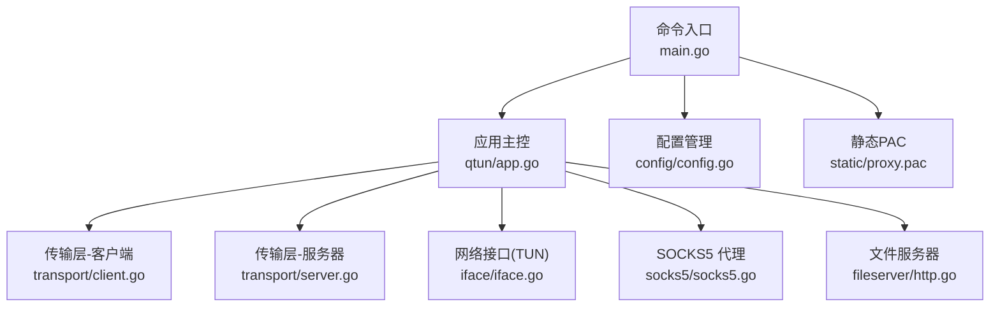
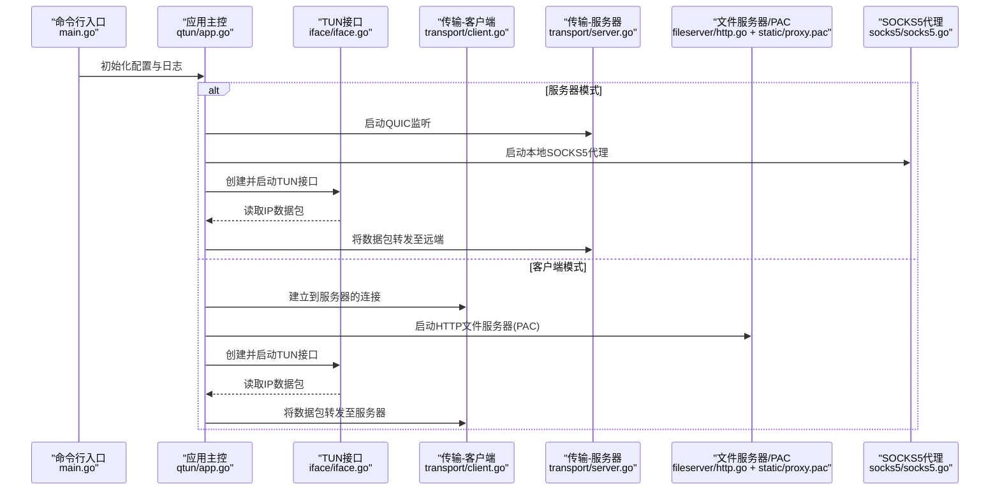
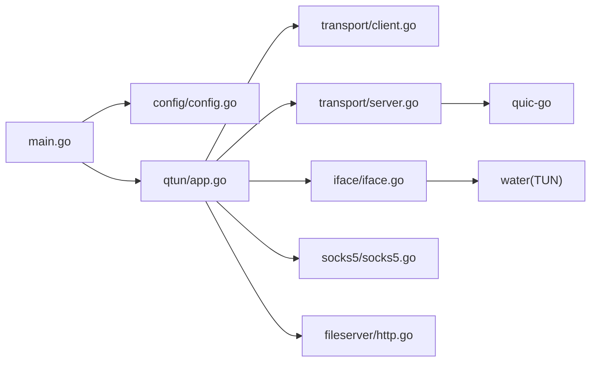

# 快速开始

<cite>
**本文引用的文件**
- [README.md](file://README.md)
- [main.go](file://main.go)
- [config/config.go](file://config/config.go)
- [qtun/app.go](file://qtun/app.go)
- [transport/client.go](file://transport/client.go)
- [transport/server.go](file://transport/server.go)
- [transport/crypto.go](file://transport/crypto.go)
- [iface/iface.go](file://iface/iface.go)
- [socks5/socks5.go](file://socks5/socks5.go)
- [fileserver/http.go](file://fileserver/http.go)
- [static/proxy.pac](file://static/proxy.pac)
- [Makefile](file://Makefile)
- [go.mod](file://go.mod)
</cite>

## 目录
1. [简介](#简介)
2. [项目结构](#项目结构)
3. [核心组件](#核心组件)
4. [架构总览](#架构总览)
5. [详细组件分析](#详细组件分析)
6. [依赖关系分析](#依赖关系分析)
7. [性能与优化](#性能与优化)
8. [故障排除指南](#故障排除指南)
9. [结论](#结论)
10. [附录：常用命令与参数](#附录常用命令与参数)

## 简介
本指南面向首次接触 Qtun 的用户，帮助你在最短时间内完成安装、编译、基础配置与部署，并掌握服务器与客户端的完整运行流程。你将了解如何为本地开发、远程访问与网络代理等典型场景进行配置，同时获得常见问题的排查思路与解决建议。

## 项目结构
该项目采用模块化设计，主要由以下层次组成：
- 命令入口与参数解析：通过命令行工具初始化全局配置并启动应用。
- 应用主控：负责根据模式（服务器/客户端）启动 TUN 接口、传输层与可选的 SOCKS5 代理。
- 传输层：基于 QUIC 的客户端与服务器实现，负责数据包转发与加密。
- 网络接口：封装 TUN 设备，负责读写 IP 数据包。
- 文件服务器与 PAC：用于提供系统代理配置文件，便于自动代理设置。
- 配置管理：集中保存运行时参数，贯穿各模块。

图表来源
- [main.go](file://main.go#L105-L136)
- [qtun/app.go](file://qtun/app.go#L37-L49)
- [transport/client.go](file://transport/client.go#L31-L39)
- [transport/server.go](file://transport/server.go#L37-L46)
- [iface/iface.go](file://iface/iface.go#L23-L29)
- [socks5/socks5.go](file://socks5/socks5.go#L55-L58)
- [fileserver/http.go](file://fileserver/http.go#L9-L16)
- [config/config.go](file://config/config.go#L3-L13)
- [static/proxy.pac](file://static/proxy.pac#L1-L10)

章节来源
- [README.md](file://README.md#L1-L99)
- [main.go](file://main.go#L105-L136)
- [qtun/app.go](file://qtun/app.go#L37-L49)

## 核心组件
- 命令行入口与参数解析：定义全局选项与命令，初始化日志与配置，按模式启动应用与服务。
- 应用主控：根据是否为服务器模式决定启动路径；负责 TUN 接口的创建与多工作线程处理。
- 传输层：客户端/服务器分别维护连接池与心跳，使用 QUIC 协议承载数据包。
- 网络接口：创建 TUN 设备并配置 IP 与 MTU，必要时添加系统路由。
- SOCKS5 代理：在服务器模式下提供本地代理服务，便于系统自动代理。
- 文件服务器与 PAC：在客户端模式下提供 PAC 文件下载，简化系统代理配置。

章节来源
- [main.go](file://main.go#L22-L68)
- [qtun/app.go](file://qtun/app.go#L19-L35)
- [transport/client.go](file://transport/client.go#L20-L29)
- [transport/server.go](file://transport/server.go#L23-L35)
- [iface/iface.go](file://iface/iface.go#L16-L21)
- [socks5/socks5.go](file://socks5/socks5.go#L55-L58)
- [fileserver/http.go](file://fileserver/http.go#L9-L16)

## 架构总览
下图展示了服务器与客户端的交互流程，以及应用如何协调传输层、TUN 接口与代理服务。

图表来源
- [main.go](file://main.go#L75-L103)
- [qtun/app.go](file://qtun/app.go#L37-L49)
- [transport/client.go](file://transport/client.go#L41-L83)
- [transport/server.go](file://transport/server.go#L48-L76)
- [iface/iface.go](file://iface/iface.go#L31-L74)
- [fileserver/http.go](file://fileserver/http.go#L9-L16)
- [socks5/socks5.go](file://socks5/socks5.go#L99-L118)

## 详细组件分析

### 安装与编译
- 环境要求
  - Go 版本：请参考模块文件中的版本要求。
  - 平台支持：MacOS 与 Linux 支持；Windows 不支持。
- 编译方式
  - 使用提供的构建脚本或直接执行 Go 构建命令生成二进制文件。
  - 可选择目标平台与架构以生成对应二进制。

章节来源
- [go.mod](file://go.mod#L3-L3)
- [README.md](file://README.md#L91-L98)
- [Makefile](file://Makefile#L3-L22)

### 服务器部署
- 启动参数要点
  - 密钥：用于传输加密，需与客户端一致。
  - 监听地址：服务器监听的地址与端口。
  - TUN 地址段：为虚拟网卡分配的内网 IP 段。
  - 服务器模式开关：启用服务器模式。
  - SOCKS5 端口：本地代理端口（默认值）。
- 运行流程
  - 初始化配置与日志。
  - 启动 SOCKS5 代理服务（仅服务器模式）。
  - 创建并启动 TUN 接口。
  - 启动 QUIC 服务器监听，等待客户端连接。

章节来源
- [README.md](file://README.md#L13-L26)
- [main.go](file://main.go#L75-L103)
- [qtun/app.go](file://qtun/app.go#L37-L49)
- [transport/server.go](file://transport/server.go#L48-L76)
- [socks5/socks5.go](file://socks5/socks5.go#L99-L118)

### 客户端部署
- 启动参数要点
  - 密钥：与服务器一致。
  - 远端地址：服务器的公网地址与端口。
  - TUN 地址段：与服务器侧不冲突的内网 IP 段。
  - 并发线程数：客户端连接并发数（默认值）。
  - 文件服务器端口与目录：用于提供 PAC 文件（默认值）。
- 运行流程
  - 初始化配置与日志。
  - 启动 HTTP 文件服务器（提供 PAC）。
  - 创建并启动 TUN 接口。
  - 建立到服务器的连接，保持心跳。
  - 将本地流量经由 TUN 接口转发至服务器。

章节来源
- [README.md](file://README.md#L21-L26)
- [main.go](file://main.go#L75-L103)
- [qtun/app.go](file://qtun/app.go#L37-L49)
- [transport/client.go](file://transport/client.go#L41-L83)
- [fileserver/http.go](file://fileserver/http.go#L9-L16)

### 网络配置
- IP 地址分配
  - 服务器与客户端各自配置独立的 TUN IP 段，避免冲突。
  - TUN 接口创建后会设置 IP 与 MTU，并在 macOS 上添加系统路由。
- 端口设置
  - 服务器监听端口：默认值可在参数中指定。
  - SOCKS5 本地代理端口：默认值可在参数中指定。
  - 客户端文件服务器端口：用于提供 PAC 文件。
- 安全密钥配置
  - 传输层使用密钥派生的对称加密算法进行数据保护，密钥需在两端保持一致。

章节来源
- [README.md](file://README.md#L62-L87)
- [iface/iface.go](file://iface/iface.go#L31-L74)
- [transport/crypto.go](file://transport/crypto.go#L10-L26)

### 常见使用场景
- 本地开发
  - 在本地启动服务器模式，客户端连接后即可通过 TUN 访问内网资源。
- 远程访问
  - 将服务器暴露于公网，客户端通过服务器进行跨网访问。
- 系统代理
  - 客户端启动后可通过 PAC 自动代理，简化浏览器与系统代理配置。

章节来源
- [README.md](file://README.md#L21-L26)
- [fileserver/http.go](file://fileserver/http.go#L9-L16)
- [static/proxy.pac](file://static/proxy.pac#L1-L10)

## 依赖关系分析
- 外部依赖
  - QUIC 实现：用于高性能传输。
  - TUN 设备：用于虚拟网络接口。
  - 日志与命令行框架：统一的日志与 CLI 行为。
- 内部模块耦合
  - 应用主控聚合传输层、TUN 接口与代理服务，形成清晰的控制流。
  - 传输层通过配置模块共享运行参数。

图表来源
- [main.go](file://main.go#L15-L20)
- [config/config.go](file://config/config.go#L1-L24)
- [qtun/app.go](file://qtun/app.go#L1-L17)
- [transport/client.go](file://transport/client.go#L1-L18)
- [transport/server.go](file://transport/server.go#L1-L21)
- [iface/iface.go](file://iface/iface.go#L1-L14)
- [socks5/socks5.go](file://socks5/socks5.go#L1-L11)
- [fileserver/http.go](file://fileserver/http.go#L1-L7)

章节来源
- [go.mod](file://go.mod#L5-L14)
- [main.go](file://main.go#L15-L20)

## 性能与优化
- 工作线程数量
  - TUN 数据包处理采用动态工作线程，线程数为 CPU 核心数的两倍，最小 4，最大 32。
- QUIC 参数
  - 服务器侧配置了较大的接收窗口与并发流限制，提升吞吐能力。
- 连接池与心跳
  - 客户端维护多个连接并定期发送心跳，增强稳定性。
- 加密与内存复用
  - 传输层使用 AEAD 对称加密，消息对象从池中复用以减少 GC 压力。

章节来源
- [qtun/app.go](file://qtun/app.go#L79-L96)
- [transport/server.go](file://transport/server.go#L97-L103)
- [transport/client.go](file://transport/client.go#L41-L83)
- [transport/crypto.go](file://transport/crypto.go#L10-L26)

## 故障排除指南
- 权限问题
  - 需要管理员权限创建 TUN 接口与修改系统路由。
- 端口占用
  - 确认服务器监听端口与本地代理端口未被占用。
- 网络连通性
  - 客户端无法连接服务器时，检查防火墙、NAT 与服务器公网可达性。
- 密钥不一致
  - 服务器与客户端密钥必须相同，否则无法建立安全通道。
- PAC 与代理
  - 客户端启动后可通过 PAC 自动代理，若系统未生效，请手动设置 PAC 地址。
- 日志级别
  - 使用更详细的日志级别定位问题。

章节来源
- [README.md](file://README.md#L13-L26)
- [qtun/app.go](file://qtun/app.go#L250-L270)
- [fileserver/http.go](file://fileserver/http.go#L9-L16)

## 结论
通过本指南，你可以快速完成 Qtun 的安装与编译，并在服务器与客户端模式下完成基本部署。结合本文的网络配置与常见场景，你可以在本地开发、远程访问与系统代理等场景中顺利使用 Qtun。遇到问题时，可依据故障排除指南逐步定位并解决。

## 附录：常用命令与参数
- 服务器启动示例
  - 在服务器上以服务器模式启动，监听指定地址与端口，并配置 TUN IP。
- 客户端启动示例
  - 在客户端上连接服务器，配置 TUN IP，并启动文件服务器提供 PAC。
- 关键参数说明
  - 密钥：传输加密使用的密钥。
  - 监听地址：服务器监听地址（仅服务器）。
  - 远端地址：服务器公网地址（仅客户端）。
  - TUN IP：虚拟网卡的内网 IP 段。
  - 并发线程：客户端连接并发数。
  - SOCKS5 端口：本地代理端口。
  - 文件服务器端口与目录：提供 PAC 的 HTTP 服务。

章节来源
- [README.md](file://README.md#L13-L26)
- [README.md](file://README.md#L62-L87)
- [main.go](file://main.go#L53-L65)