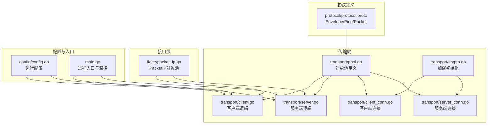
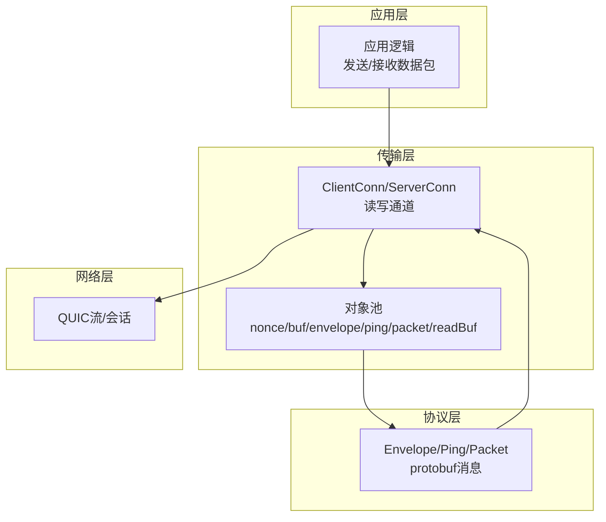
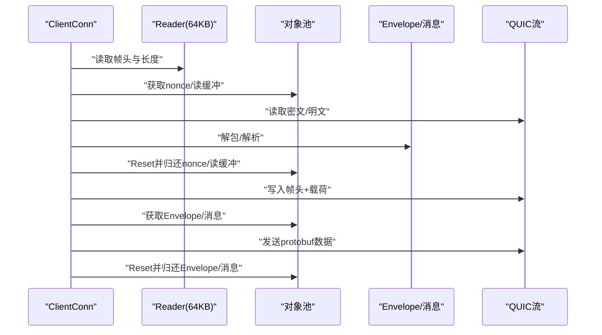
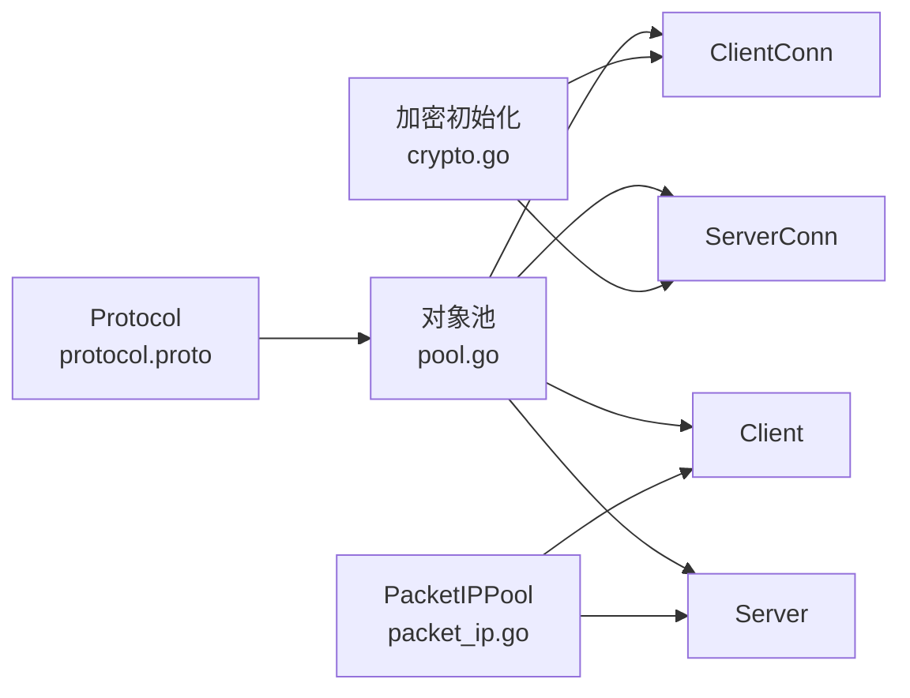

# 内存管理优化

<cite>
**本文引用的文件**
- [transport/pool.go](file://transport/pool.go)
- [transport/client.go](file://transport/client.go)
- [transport/server.go](file://transport/server.go)
- [transport/client_conn.go](file://transport/client_conn.go)
- [transport/server_conn.go](file://transport/server_conn.go)
- [transport/crypto.go](file://transport/crypto.go)
- [iface/packet_ip.go](file://iface/packet_ip.go)
- [config/config.go](file://config/config.go)
- [main.go](file://main.go)
- [protocol/protocol.proto](file://protocol/protocol.proto)
- [PERFORMANCE_TEST_GUIDE.md](file://PERFORMANCE_TEST_GUIDE.md)
</cite>

## 目录
1. [简介](#简介)
2. [项目结构](#项目结构)
3. [核心组件](#核心组件)
4. [架构总览](#架构总览)
5. [详细组件分析](#详细组件分析)
6. [依赖关系分析](#依赖关系分析)
7. [性能考量](#性能考量)
8. [故障排查指南](#故障排查指南)
9. [结论](#结论)
10. [附录](#附录)

## 简介
本文件系统性梳理 Qtun 的内存管理优化实践，重点围绕对象池与连接池的设计理念与实现细节展开，涵盖以下主题：
- sync.Pool 的使用策略与内存复用机制
- 各类池化对象的类型与用途：noncePool、bufPool、envelopePool、pingMessagePool、packetMessagePool、readBufPool、packetIPPool
- 内存分配优化技术：缓冲区大小选择、内存对齐与零拷贝思路
- 内存泄漏防护与内存使用监控方法
- 不同负载场景下的内存调优策略与使用模式分析

## 项目结构
Qtun 的内存优化主要集中在 transport 层与 iface 层：
- transport 层：统一的对象池定义与使用，QUIC 连接读写流程中的缓冲区与消息对象复用
- iface 层：PacketIP 的对象池，避免频繁分配小包缓冲
- config 层：运行参数影响内存占用（如 MTU、线程数、NoDelay）
- 协议层：Envelope/Ping/Packet 的 protobuf 消息对象通过池化复用

图表来源
- [transport/pool.go](file://transport/pool.go#L1-L108)
- [transport/client.go](file://transport/client.go#L1-L223)
- [transport/server.go](file://transport/server.go#L1-L219)
- [transport/client_conn.go](file://transport/client_conn.go#L1-L408)
- [transport/server_conn.go](file://transport/server_conn.go#L1-L295)
- [transport/crypto.go](file://transport/crypto.go#L1-L27)
- [iface/packet_ip.go](file://iface/packet_ip.go#L1-L47)
- [config/config.go](file://config/config.go#L1-L24)
- [main.go](file://main.go#L1-L136)
- [protocol/protocol.proto](file://protocol/protocol.proto#L1-L22)

章节来源
- [transport/pool.go](file://transport/pool.go#L1-L108)
- [transport/client.go](file://transport/client.go#L1-L223)
- [transport/server.go](file://transport/server.go#L1-L219)
- [transport/client_conn.go](file://transport/client_conn.go#L1-L408)
- [transport/server_conn.go](file://transport/server_conn.go#L1-L295)
- [transport/crypto.go](file://transport/crypto.go#L1-L27)
- [iface/packet_ip.go](file://iface/packet_ip.go#L1-L47)
- [config/config.go](file://config/config.go#L1-L24)
- [main.go](file://main.go#L1-L136)
- [protocol/protocol.proto](file://protocol/protocol.proto#L1-L22)

## 核心组件
本节聚焦于内存优化的核心组件与对象池设计。

- 对象池定义与复用策略
  - noncePool：固定长度 12 字节的随机数缓冲，用于 AES-GCM 密文认证标签
  - bufPool：bytes.Buffer 对象池，配合 Reset 复用
  - envelopePool：protobuf Envelope 对象池，配合 Reset 复用
  - pingMessagePool：MessagePing 对象池
  - packetMessagePool：MessagePacket 对象池
  - readBufPool：64KB 读缓冲指针池，避免频繁分配大块内存
  - packetIPPool：PacketIP 对象池，按需扩容并限制池内容量范围

- QUIC 连接中的缓冲区与消息复用
  - 客户端/服务端连接在读写路径上优先从池中获取缓冲与消息对象，完成后立即 Reset 并放回池中
  - 读取路径使用 bufio.ReaderSize(64KB)，减少系统调用次数与内存碎片

- 加密初始化
  - 通过 MD5/SHA256 生成固定长度密钥，构造 AES-GCM AEAD，确保 nonce 长度与池化策略一致

章节来源
- [transport/pool.go](file://transport/pool.go#L10-L107)
- [transport/client_conn.go](file://transport/client_conn.go#L24-L56)
- [transport/server_conn.go](file://transport/server_conn.go#L24-L51)
- [transport/crypto.go](file://transport/crypto.go#L10-L26)
- [iface/packet_ip.go](file://iface/packet_ip.go#L10-L39)

## 架构总览
下图展示内存优化在整体架构中的位置与交互关系，突出对象池在读写路径上的作用。

图表来源
- [transport/client_conn.go](file://transport/client_conn.go#L241-L294)
- [transport/server_conn.go](file://transport/server_conn.go#L167-L220)
- [transport/pool.go](file://transport/pool.go#L10-L107)
- [protocol/protocol.proto](file://protocol/protocol.proto#L5-L22)

## 详细组件分析

### 对象池设计与实现
- 设计理念
  - 使用 sync.Pool 在 goroutine 本地缓存对象，降低 GC 压力与分配开销
  - 所有池化对象在使用后必须 Reset 或清空状态，保证下次获取时处于“干净”状态
  - 对于固定大小的字节切片（nonce、64KB 读缓冲），直接复用底层数组，避免扩容与拷贝

- 典型对象池与使用点
  - noncePool：在加密写入/读取路径中获取/归还 12 字节 nonce
  - bufPool：在 QUIC 写入前构建帧头与载荷
  - envelopePool/pingMessagePool/packetMessagePool：在打包 protobuf 消息时复用消息对象
  - readBufPool：在读取路径中复用 64KB 临时缓冲
  - packetIPPool：在 TUN 数据包处理中复用 PacketIP 缓冲

- 复杂度与性能
  - 获取/归还操作为 O(1)，显著减少堆分配与 GC 触发频率
  - 通过 Reset 清理字段，避免持有外部引用导致对象无法回收

章节来源
- [transport/pool.go](file://transport/pool.go#L10-L107)
- [transport/client_conn.go](file://transport/client_conn.go#L266-L288)
- [transport/server_conn.go](file://transport/server_conn.go#L192-L214)
- [transport/client.go](file://transport/client.go#L184-L206)
- [transport/server.go](file://transport/server.go#L1-L219)

### QUIC 连接读写路径中的内存复用
- 读路径
  - 使用 bufio.ReaderSize(64KB) 减少系统调用次数
  - 读取到的数据先放入池化的 64KB 缓冲，再根据是否加密进行后续处理
  - 解密失败时返回特定错误，避免无意义的内存分配

- 写路径
  - 将安全标志、长度与载荷写入 bytes.Buffer，再一次性写出
  - 加密场景下使用池化的 nonce 与 AEAD，完成后立即归还 nonce
  - 发送 protobuf 消息时复用 Envelope 与具体消息对象，发送后 Reset 并放回池

图表来源
- [transport/client_conn.go](file://transport/client_conn.go#L359-L394)
- [transport/server_conn.go](file://transport/server_conn.go#L129-L165)
- [transport/pool.go](file://transport/pool.go#L53-L107)

章节来源
- [transport/client_conn.go](file://transport/client_conn.go#L309-L394)
- [transport/server_conn.go](file://transport/server_conn.go#L58-L165)
- [transport/pool.go](file://transport/pool.go#L53-L107)

### PacketIP 对象池
- 设计要点
  - 默认池内缓冲大小 2048 字节，按需扩容至所需大小
  - 归还时仅当容量在 1500~65536 范围内才放回池，避免池内碎片化
  - 提供 NewPacketIP 与 PutPacketIP 两个 API，便于在 TUN 数据路径中统一管理

- 性能收益
  - 减少小包（如 MTU=1500）的频繁分配与 GC
  - 通过容量控制避免池内过大或过小缓冲造成浪费

章节来源
- [iface/packet_ip.go](file://iface/packet_ip.go#L10-L39)

### 加密与内存对齐
- 密钥派生
  - 使用 MD5/SHA256 生成固定长度密钥，构造 AES-GCM AEAD
  - nonce 固定 12 字节，与池化策略保持一致，避免额外拷贝

- 内存对齐与零拷贝思路
  - 通过 bytes.Buffer 与切片复用，尽量避免中间层复制
  - 读写缓冲采用 64KB 大块，减少系统调用与页对齐带来的效率提升

章节来源
- [transport/crypto.go](file://transport/crypto.go#L10-L26)
- [transport/client_conn.go](file://transport/client_conn.go#L266-L288)
- [transport/server_conn.go](file://transport/server_conn.go#L192-L214)

### 协议消息池化
- Envelope 与具体消息类型（Ping/Packet）均通过池化复用
- 发送前设置 oneof 字段，发送后 Reset 并放回池
- 该策略显著降低 protobuf 序列化过程中的临时对象数量

章节来源
- [transport/client.go](file://transport/client.go#L184-L206)
- [transport/server_conn.go](file://transport/server_conn.go#L235-L249)
- [protocol/protocol.proto](file://protocol/protocol.proto#L5-L22)

## 依赖关系分析
- 组件耦合
  - 对象池位于 transport 层，被 Client/Server 与 ClientConn/ServerConn 广泛依赖
  - PacketIPPool 独立于传输层，由 iface 层提供，服务于应用层数据包处理

- 外部依赖
  - QUIC 作为传输层协议，其读写缓冲与窗口参数直接影响内存占用
  - protobuf 用于消息序列化，对象池显著降低序列化开销

图表来源
- [transport/pool.go](file://transport/pool.go#L10-L107)
- [transport/client_conn.go](file://transport/client_conn.go#L24-L56)
- [transport/server_conn.go](file://transport/server_conn.go#L24-L51)
- [transport/client.go](file://transport/client.go#L20-L39)
- [transport/server.go](file://transport/server.go#L23-L35)
- [iface/packet_ip.go](file://iface/packet_ip.go#L10-L39)
- [transport/crypto.go](file://transport/crypto.go#L10-L26)
- [protocol/protocol.proto](file://protocol/protocol.proto#L5-L22)

章节来源
- [transport/pool.go](file://transport/pool.go#L10-L107)
- [transport/client_conn.go](file://transport/client_conn.go#L24-L56)
- [transport/server_conn.go](file://transport/server_conn.go#L24-L51)
- [transport/client.go](file://transport/client.go#L20-L39)
- [transport/server.go](file://transport/server.go#L23-L35)
- [iface/packet_ip.go](file://iface/packet_ip.go#L10-L39)
- [transport/crypto.go](file://transport/crypto.go#L10-L26)
- [protocol/protocol.proto](file://protocol/protocol.proto#L5-L22)

## 性能考量
- 缓冲区大小选择
  - 读写缓冲统一使用 64KB，减少系统调用次数与上下文切换
  - PacketIP 默认 2048 字节，兼顾常见 MTU 与小包场景

- 内存对齐
  - 切片与 Buffer 的复用遵循 Go 内存分配器特性，避免频繁跨页分配

- 零拷贝优化思路
  - 通过 bytes.Buffer 与切片复用，尽量避免中间层复制
  - 读写路径中优先复用已分配的缓冲，减少临时对象

- GC 优化
  - 对象池显著降低堆分配频率，减少 GC 暂停时间
  - Reset 与归还策略确保对象可被安全回收

- 监控与验证
  - 使用 statsviz 与 pprof 进行实时可视化与内存分析
  - 通过 allocs/heap/goroutine/mutex 等指标评估优化效果

章节来源
- [transport/client_conn.go](file://transport/client_conn.go#L331-L332)
- [transport/server_conn.go](file://transport/server_conn.go#L88-L89)
- [iface/packet_ip.go](file://iface/packet_ip.go#L12-L15)
- [PERFORMANCE_TEST_GUIDE.md](file://PERFORMANCE_TEST_GUIDE.md#L96-L134)
- [main.go](file://main.go#L124-L129)

## 故障排查指南
- 常见问题与定位
  - 内存泄漏：确认所有池化对象在使用后均 Reset 并归还；检查是否存在未归还的缓冲
  - GC 抖动：观察 pprof heap 与 statsviz，确认对象池命中率与分配次数
  - 锁争用：使用 mutex 分析，确认并发访问热点是否可通过对象池或缓冲区复用缓解

- 监控方法
  - 启用 statsviz：在 main 中注册默认可视化端点，实时查看内存、Goroutine、CPU
  - pprof：抓取 CPU/Heap/Goroutine/Mutex Profile，结合日志定位瓶颈

- 修复建议
  - 确保每次获取的缓冲/消息在使用后都 Reset 并 Put 回池
  - 控制池内对象容量范围，避免过大或过小造成浪费
  - 在高并发场景下适当增加通道缓冲与线程数（参考配置）

章节来源
- [PERFORMANCE_TEST_GUIDE.md](file://PERFORMANCE_TEST_GUIDE.md#L96-L134)
- [main.go](file://main.go#L124-L129)
- [transport/pool.go](file://transport/pool.go#L53-L107)

## 结论
Qtun 的内存管理优化以对象池为核心，结合 QUIC 读写缓冲与 protobuf 消息复用，在高并发场景下有效降低了分配频率与 GC 压力。通过合理的缓冲区大小选择、对象生命周期管理与监控手段，系统在稳定性与性能之间取得了良好平衡。建议在不同负载场景下持续使用 pprof 与 statsviz 进行回归测试，确保优化效果稳定。

## 附录
- 不同负载场景下的内存调优策略
  - 低负载：维持默认池大小与通道缓冲，关注 Goroutine 数量与内存峰值
  - 中等负载：适度增大通道缓冲与线程数，观察 GC 暂停时间与分配次数
  - 高负载：启用对象池与缓冲区复用，必要时调整 MTU 与 QUIC 窗口参数

- 最佳实践清单
  - 所有池化对象使用后必须 Reset 并归还
  - 控制池内对象容量范围，避免碎片化
  - 使用 statsviz 与 pprof 持续监控内存与 GC 表现
  - 在 QUIC 参数与通道缓冲上做 A/B 测试，找到最优组合