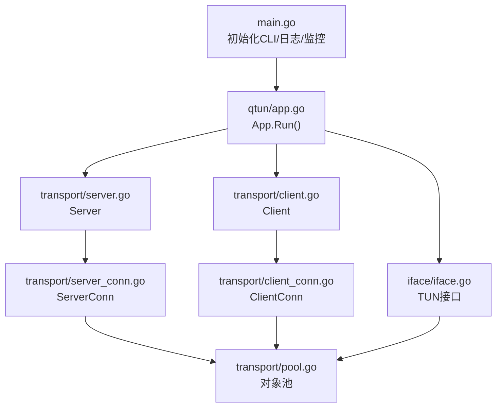
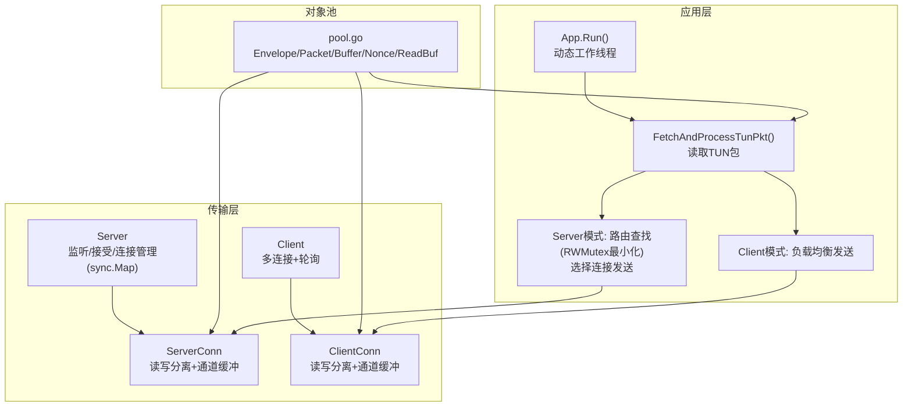
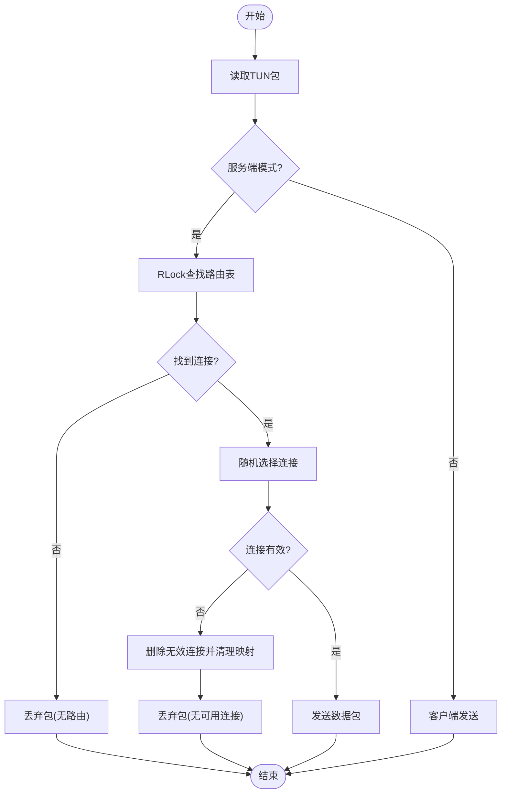
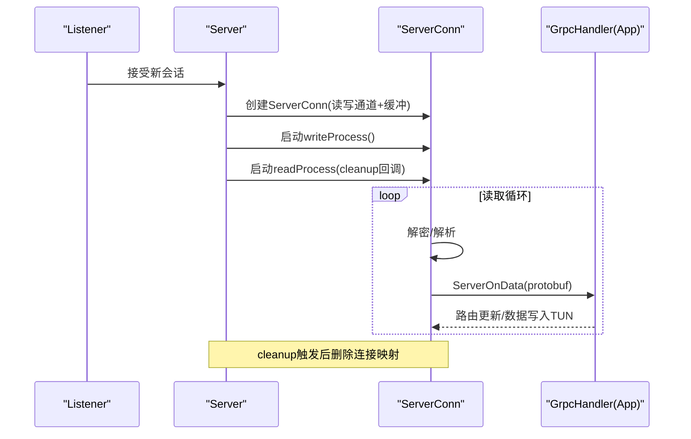
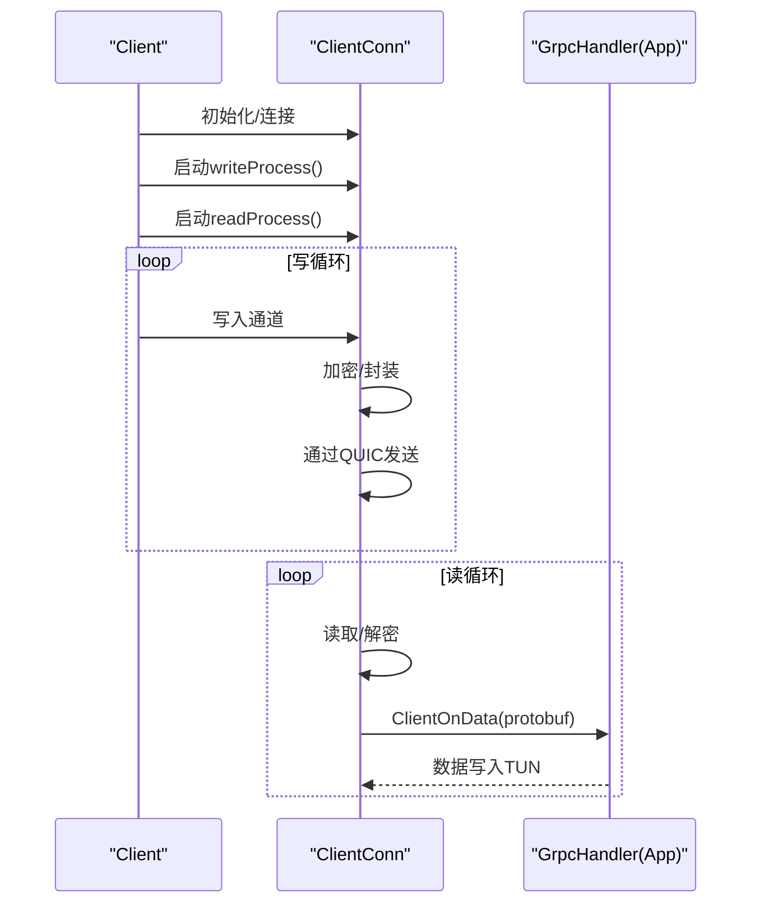
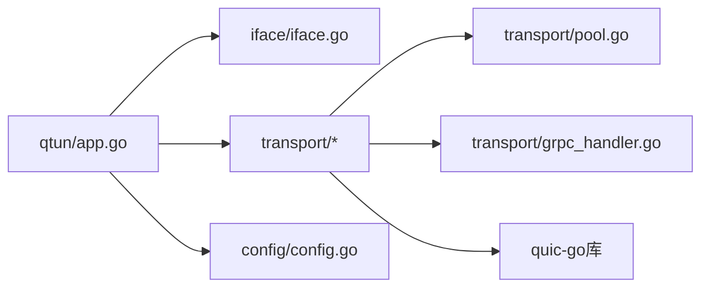

# 并发处理优化

<cite>
**本文引用的文件列表**
- [main.go](file://main.go)
- [config/config.go](file://config/config.go)
- [qtun/app.go](file://qtun/app.go)
- [transport/pool.go](file://transport/pool.go)
- [transport/server.go](file://transport/server.go)
- [transport/server_conn.go](file://transport/server_conn.go)
- [transport/client.go](file://transport/client.go)
- [transport/client_conn.go](file://transport/client_conn.go)
- [transport/grpc_handler.go](file://transport/grpc_handler.go)
- [iface/iface.go](file://iface/iface.go)
- [iface/packet_ip.go](file://iface/packet_ip.go)
- [PERFORMANCE_TEST_GUIDE.md](file://PERFORMANCE_TEST_GUIDE.md)
</cite>

## 目录
1. [简介](#简介)
2. [项目结构与并发入口](#项目结构与并发入口)
3. [核心组件与并发模型](#核心组件与并发模型)
4. [架构总览](#架构总览)
5. [关键组件深度解析](#关键组件深度解析)
6. [依赖关系与耦合分析](#依赖关系与耦合分析)
7. [性能特性与优化要点](#性能特性与优化要点)
8. [并发性能监控与瓶颈分析](#并发性能监控与瓶颈分析)
9. [故障排查与最佳实践](#故障排查与最佳实践)
10. [结论](#结论)

## 简介
本文件系统性梳理 Qtun 的并发处理优化设计与实现，重点覆盖：
- goroutine 管理与工作线程池化
- 通道通信与缓冲队列策略
- 同步机制与锁优化（RWMutex、sync.Map）
- 多连接并发处理（连接池、任务调度、资源分配）
- 数据包处理的并发优化（生产者-消费者、缓冲队列、批处理）
- 锁优化与无锁编程思路（原子操作、竞争条件规避）
- 并发性能监控与瓶颈分析（Goroutine 跟踪、阻塞检测、性能剖析）

## 项目结构与并发入口
- 入口程序在主函数中初始化 CLI、日志与性能可视化监控，随后根据命令行参数选择服务端或客户端模式启动应用。
- 应用层通过动态计算工作线程数量（CPU 核数 × 2，范围限制）启动多个 TUN 数据包处理 goroutine，形成高并发的数据平面处理能力。
- 传输层分别实现服务端与客户端，基于 QUIC 协议建立连接，采用读写分离的 goroutine 模式与带缓冲的通道队列进行数据收发。

图表来源
- [main.go](file://main.go#L105-L135)
- [qtun/app.go](file://qtun/app.go#L37-L97)
- [transport/server.go](file://transport/server.go#L48-L149)
- [transport/client.go](file://transport/client.go#L41-L83)
- [transport/server_conn.go](file://transport/server_conn.go#L39-L115)
- [transport/client_conn.go](file://transport/client_conn.go#L44-L151)
- [transport/pool.go](file://transport/pool.go#L10-L107)
- [iface/iface.go](file://iface/iface.go#L31-L104)

章节来源
- [main.go](file://main.go#L105-L135)
- [qtun/app.go](file://qtun/app.go#L37-L97)

## 核心组件与并发模型
- App 层
  - 动态工作线程：根据 CPU 核数动态设置工作线程数，最小 4、最大 32，避免过多上下文切换。
  - TUN 数据包处理：每个工作线程循环从 TUN 接口读取 IP 包，按目的 IP 查找路由表，选择连接发送；服务端模式下使用 RWMutex 保护路由表，最小化临界区。
- Server 层
  - 监听与接受：基于 QUIC 监听地址，接受新会话后开启读写 goroutine。
  - 连接管理：使用 sync.Map 存储连接映射，支持无锁读取与删除，提升高并发下的查找与清理效率。
- Client 层
  - 多连接：按配置线程数创建多个 ClientConn，每个连接独立维护读写 goroutine 与通道队列。
  - 负载均衡：通过原子自增序列号对连接索引取模，实现简单的轮询负载均衡。
- 通道与缓冲
  - 读写通道均设置固定缓冲大小，减少 goroutine 抢占与阻塞概率。
  - 对象池复用：消息体、缓冲区、随机数 nonce 等通过 sync.Pool 复用，降低 GC 压力。

章节来源
- [qtun/app.go](file://qtun/app.go#L72-L97)
- [qtun/app.go](file://qtun/app.go#L99-L167)
- [transport/server.go](file://transport/server.go#L175-L218)
- [transport/client.go](file://transport/client.go#L115-L132)
- [transport/pool.go](file://transport/pool.go#L10-L107)

## 架构总览
整体采用“应用层工作线程 + 传输层连接池 + QUIC 通道”的分层并发模型。数据面由多个工作线程并行处理 TUN 包，控制面通过路由表与连接管理实现高效转发。

图表来源
- [qtun/app.go](file://qtun/app.go#L37-L97)
- [qtun/app.go](file://qtun/app.go#L99-L167)
- [transport/server.go](file://transport/server.go#L48-L149)
- [transport/server_conn.go](file://transport/server_conn.go#L39-L115)
- [transport/client.go](file://transport/client.go#L41-L83)
- [transport/client_conn.go](file://transport/client_conn.go#L44-L151)
- [transport/pool.go](file://transport/pool.go#L10-L107)

## 关键组件深度解析

### App：TUN 数据包并发处理与路由
- 工作线程数：根据 CPU 核数动态计算，兼顾 I/O 并行与系统负载。
- 读取与处理：每个工作线程循环读取 TUN 包，提取源/目的 IP，服务端模式下在 RLock 下快速查找路由，复制键集合以缩短持锁时间，再随机选择连接发送。
- 路由清理：定时任务扫描并移除无效连接，调用 Server 的 DeleteDeadConn 清理映射。

图表来源
- [qtun/app.go](file://qtun/app.go#L99-L167)
- [transport/server.go](file://transport/server.go#L175-L218)

章节来源
- [qtun/app.go](file://qtun/app.go#L72-L97)
- [qtun/app.go](file://qtun/app.go#L99-L167)

### Server：连接管理与并发读写
- 监听与接受：持续监听 QUIC 地址，接受新会话后为每个会话创建 ServerConn，并启动读写 goroutine。
- 连接映射：使用 sync.Map 双向映射（正向/反向），支持无锁读取与删除，提高高并发下的查找与清理效率。
- 读写分离：读 goroutine 负责解密与协议解析，写 goroutine 从通道消费待发送数据，统一通过 QUIC Stream 发送。

图表来源
- [transport/server.go](file://transport/server.go#L91-L149)
- [transport/server_conn.go](file://transport/server_conn.go#L58-L115)
- [qtun/app.go](file://qtun/app.go#L169-L207)

章节来源
- [transport/server.go](file://transport/server.go#L48-L149)
- [transport/server_conn.go](file://transport/server_conn.go#L58-L115)

### Client：多连接与负载均衡
- 多连接：根据配置线程数创建多个 ClientConn，每个连接独立维护读写 goroutine 与通道队列。
- 连接生命周期：InitConn 初始化加密与连接，run 循环尝试重连，成功后启动写 goroutine 与读 goroutine。
- 负载均衡：Write/WriteNow 通过原子自增序列号对连接数取模，实现简单轮询。

图表来源
- [transport/client.go](file://transport/client.go#L41-L83)
- [transport/client_conn.go](file://transport/client_conn.go#L153-L188)
- [qtun/app.go](file://qtun/app.go#L209-L248)

章节来源
- [transport/client.go](file://transport/client.go#L41-L83)
- [transport/client_conn.go](file://transport/client_conn.go#L153-L188)

### 对象池与缓冲队列
- 对象池：针对 protobuf Envelope、MessagePing、MessagePacket、bytes.Buffer、nonce、读缓冲等高频分配对象建立 sync.Pool，减少 GC 压力与分配开销。
- 缓冲队列：读写通道设置固定缓冲大小（如 256），降低 goroutine 抢占与阻塞概率；同时在读写路径上使用大缓冲 Reader/Writer 提升吞吐。

章节来源
- [transport/pool.go](file://transport/pool.go#L10-L107)
- [transport/server_conn.go](file://transport/server_conn.go#L39-L51)
- [transport/client_conn.go](file://transport/client_conn.go#L44-L56)

### 同步机制与锁优化
- RWMutex：App 路由表使用 RWMutex，在读多写少场景下提升并发度；查找阶段仅持 RLock，复制键集合后再解锁，缩短持锁时间。
- sync.Map：Server 的连接映射使用 sync.Map，支持无锁读取与删除，避免全局互斥锁带来的热点竞争。
- 原子操作：Client 的连接选择使用原子自增序列号，避免显式锁竞争。

章节来源
- [qtun/app.go](file://qtun/app.go#L115-L140)
- [transport/server.go](file://transport/server.go#L175-L218)
- [transport/client.go](file://transport/client.go#L121-L125)

## 依赖关系与耦合分析
- App 依赖 iface（TUN 接口）、transport（Client/Server）、config（全局配置）。
- Server/Client 依赖 GrpcHandler 接口，实现数据面与控制面的解耦。
- 对象池作为通用基础设施被 ServerConn/ClientConn/App 复用，降低重复分配成本。
- QUIC 配置参数在 Server/Client 中集中设置，确保两端一致的性能参数。

图表来源
- [qtun/app.go](file://qtun/app.go#L19-L35)
- [transport/grpc_handler.go](file://transport/grpc_handler.go#L3-L6)
- [transport/pool.go](file://transport/pool.go#L10-L107)
- [config/config.go](file://config/config.go#L3-L13)

章节来源
- [qtun/app.go](file://qtun/app.go#L19-L35)
- [transport/grpc_handler.go](file://transport/grpc_handler.go#L3-L6)
- [transport/pool.go](file://transport/pool.go#L10-L107)
- [config/config.go](file://config/config.go#L3-L13)

## 性能特性与优化要点
- 动态工作线程：CPU 核数 × 2，范围 4–32，平衡 I/O 并行与系统负载。
- QUIC 参数优化：增大最大流数、接收窗口与连接窗口，启用 datagram 支持，提升吞吐与低延迟。
- 对象池与缓冲：减少分配与 GC，提升内存局部性与缓存命中。
- 通道缓冲：固定缓冲降低阻塞概率，配合大缓冲 Reader/Writer 提升 I/O 吞吐。
- 无锁读取：sync.Map 与 RWMutex 最小化临界区，降低锁争用。

章节来源
- [qtun/app.go](file://qtun/app.go#L79-L97)
- [transport/server.go](file://transport/server.go#L96-L103)
- [transport/client_conn.go](file://transport/client_conn.go#L84-L91)
- [transport/pool.go](file://transport/pool.go#L10-L107)

## 并发性能监控与瓶颈分析
- 性能监控端点：内置 statsviz 与 pprof，可通过本地端口访问可视化界面与性能剖析数据。
- 监控内容：Goroutine 数量、CPU profile、内存分配、锁争用、阻塞分析。
- 建议流程：
  - 启动应用后访问 http://localhost:6060 查看实时指标。
  - 使用 pprof 抓取 CPU/内存/Goroutine profile，结合日志定位热点。
  - 通过基准脚本执行吞吐、延迟与稳定性测试，记录关键指标趋势。

章节来源
- [main.go](file://main.go#L118-L129)
- [PERFORMANCE_TEST_GUIDE.md](file://PERFORMANCE_TEST_GUIDE.md#L17-L24)
- [PERFORMANCE_TEST_GUIDE.md](file://PERFORMANCE_TEST_GUIDE.md#L85-L109)

## 故障排查与最佳实践
- Goroutine 泄漏排查：确认关闭通道与连接，检查 cleanup 回调是否正确执行。
- 通道阻塞：检查通道缓冲是否过小，必要时增大；观察日志中阻塞提示。
- 锁争用：关注 RWMutex 持锁时间，尽量将计算与 I/O 移出临界区。
- 对象池误用：确保归还对象到池中，避免容量不匹配导致的异常。
- 稳定性测试：执行 24 小时压力测试，记录内存、Goroutine 数量与吞吐趋势，识别潜在泄漏或退化。

章节来源
- [transport/server_conn.go](file://transport/server_conn.go#L53-L74)
- [transport/client_conn.go](file://transport/client_conn.go#L190-L196)
- [PERFORMANCE_TEST_GUIDE.md](file://PERFORMANCE_TEST_GUIDE.md#L233-L258)

## 结论
Qtun 的并发优化围绕“工作线程池 + 通道缓冲 + 对象池 + 无锁读取 + QUIC 参数优化”展开，实现了高吞吐、低延迟与良好可扩展性的数据面处理。通过严格的临界区最小化、连接映射的无锁化以及完善的性能监控体系，系统在复杂网络环境下仍能保持稳定与高效。