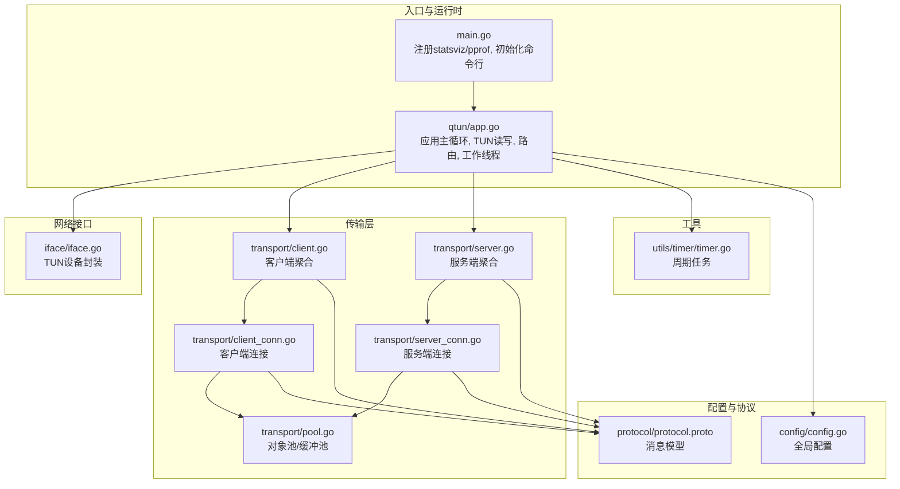
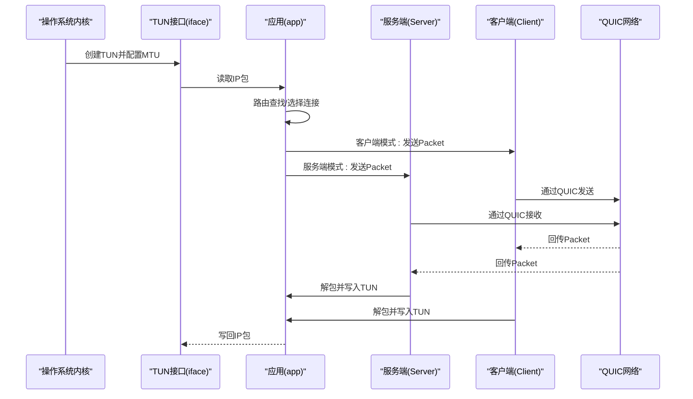
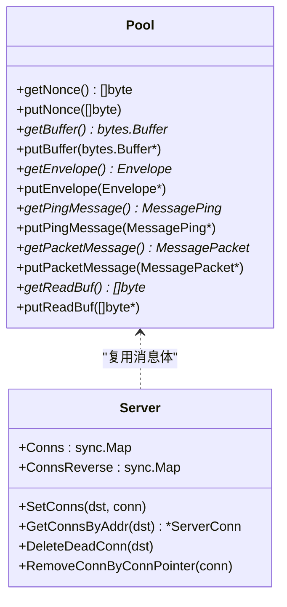
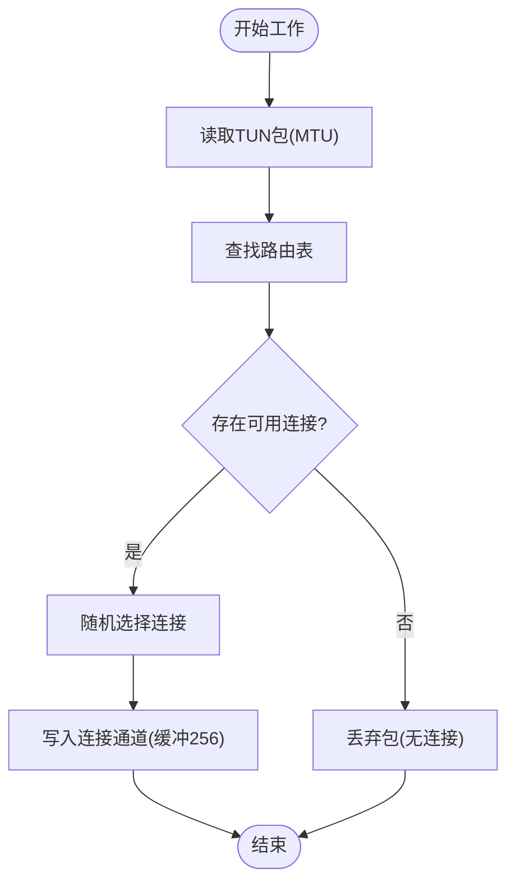
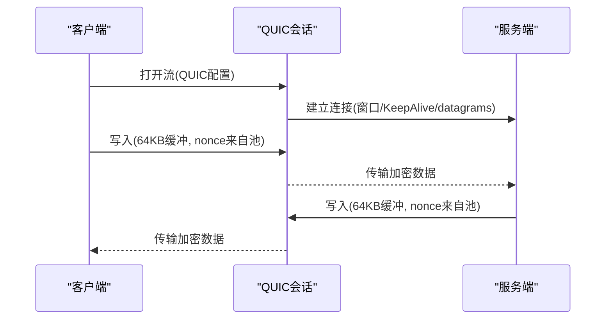
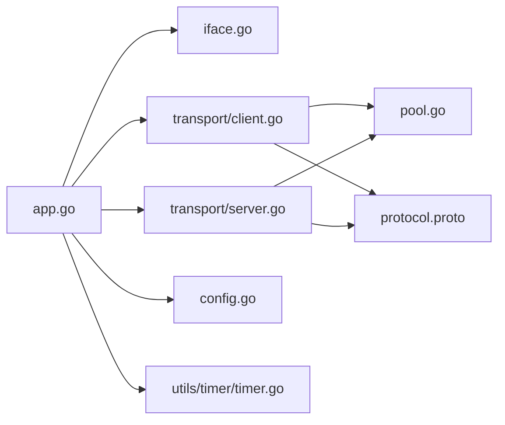

# 性能优化

<cite>
**本文引用的文件**
- [main.go](file://main.go)
- [PERFORMANCE_TEST_GUIDE.md](file://PERFORMANCE_TEST_GUIDE.md)
- [PERFORMANCE_OPTIMIZATIONS.md](file://PERFORMANCE_OPTIMIZATIONS.md)
- [README.md](file://README.md)
- [config/config.go](file://config/config.go)
- [qtun/app.go](file://qtun/app.go)
- [transport/pool.go](file://transport/pool.go)
- [transport/client.go](file://transport/client.go)
- [transport/client_conn.go](file://transport/client_conn.go)
- [transport/server.go](file://transport/server.go)
- [transport/server_conn.go](file://transport/server_conn.go)
- [iface/iface.go](file://iface/iface.go)
- [utils/timer/timer.go](file://utils/timer/timer.go)
</cite>

## 目录
1. [简介](#简介)
2. [项目结构](#项目结构)
3. [核心组件](#核心组件)
4. [架构总览](#架构总览)
5. [详细组件分析](#详细组件分析)
6. [依赖关系分析](#依赖关系分析)
7. [性能考量与优化策略](#性能考量与优化策略)
8. [故障排查指南](#故障排查指南)
9. [结论](#结论)
10. [附录](#附录)

## 简介
本指南聚焦于 Qtun 的性能优化实践，围绕内存管理、并发处理、网络传输三大维度展开，系统阐述对象池与连接池的使用、资源复用与内存泄漏防护、MTU 调优与缓冲区管理、CPU 与内存使用优化、以及性能监控与基准测试方法。文档同时给出不同使用场景下的调优建议与最佳实践，帮助读者在实际部署中获得稳定、低延迟、高吞吐的网络隧道体验。

## 项目结构
- 入口与运行时
  - main.go：初始化统计可视化与命令行入口，启动应用与子服务。
  - qtun/app.go：应用主流程，负责 TUN 接口读写、工作线程调度、路由维护与收发数据路径。
- 传输层
  - transport/client.go、transport/server.go：客户端/服务端连接管理与 QUIC 配置。
  - transport/client_conn.go、transport/server_conn.go：单连接读写、加解密、通道缓冲与 QUIC 参数。
  - transport/pool.go：对象池与缓冲池，复用 protobuf 消息体与字节缓冲，降低 GC 压力。
- 网络接口
  - iface/iface.go：封装 TUN 设备读写与系统路由配置。
- 工具与定时器
  - utils/timer/timer.go：周期性任务框架，用于清理无效路由等后台维护。
- 配置与协议
  - config/config.go：全局配置项，含 MTU、线程数、NoDelay 等。
  - protocol/protocol.proto：消息模型 Envelope/Ping/Packet，配合对象池复用。
- 文档
  - PERFORMANCE_OPTIMIZATIONS.md：优化策略与实现细节说明。
  - PERFORMANCE_TEST_GUIDE.md：性能测试与监控方法、指标与脚本。
  - README.md：快速上手与环境要求。

**图示来源**
- [main.go](file://main.go#L105-L135)
- [qtun/app.go](file://qtun/app.go#L37-L97)
- [transport/client.go](file://transport/client.go#L31-L83)
- [transport/server.go](file://transport/server.go#L37-L52)
- [transport/client_conn.go](file://transport/client_conn.go#L44-L56)
- [transport/server_conn.go](file://transport/server_conn.go#L39-L51)
- [transport/pool.go](file://transport/pool.go#L10-L108)
- [iface/iface.go](file://iface/iface.go#L31-L74)
- [utils/timer/timer.go](file://utils/timer/timer.go#L21-L47)
- [config/config.go](file://config/config.go#L3-L13)
- [protocol/protocol.proto](file://protocol/protocol.proto#L5-L22)

**章节来源**
- [main.go](file://main.go#L105-L135)
- [qtun/app.go](file://qtun/app.go#L37-L97)
- [transport/pool.go](file://transport/pool.go#L10-L108)
- [transport/client.go](file://transport/client.go#L31-L83)
- [transport/server.go](file://transport/server.go#L37-L52)
- [transport/client_conn.go](file://transport/client_conn.go#L44-L56)
- [transport/server_conn.go](file://transport/server_conn.go#L39-L51)
- [iface/iface.go](file://iface/iface.go#L31-L74)
- [utils/timer/timer.go](file://utils/timer/timer.go#L21-L47)
- [config/config.go](file://config/config.go#L3-L13)
- [protocol/protocol.proto](file://protocol/protocol.proto#L5-L22)

## 核心组件
- 应用主循环与工作线程
  - 动态工作线程数量：基于 CPU 核心数的 2 倍（最小 4，最大 32），以提升 I/O 并行度。
  - TUN 接口读写：按 MTU 大小申请包缓冲，循环读取并分发到路由表对应的连接。
- 客户端/服务端连接
  - QUIC 配置：增大流接收窗口与连接接收窗口，启用 KeepAlive 与 datagrams，提升吞吐与稳定性。
  - 连接池：使用 sync.Map 存储连接映射，避免锁竞争；按地址与指针双向索引，便于删除与查找。
- 对象池与缓冲池
  - 复用 protobuf 消息体（Envelope、Ping、Packet）、读缓冲（64KB）、nonce、bytes.Buffer，显著降低分配与 GC 压力。
- 加解密与通道
  - AES-GCM 加密封装，nonce 来自对象池；读写通道缓冲从无缓冲提升至 256，减少阻塞。
- TUN 接口
  - 按配置设置 MTU 并启动接口；在 macOS 下额外添加系统路由。

**章节来源**
- [qtun/app.go](file://qtun/app.go#L72-L97)
- [qtun/app.go](file://qtun/app.go#L99-L167)
- [transport/server.go](file://transport/server.go#L96-L103)
- [transport/server.go](file://transport/server.go#L175-L210)
- [transport/client_conn.go](file://transport/client_conn.go#L44-L56)
- [transport/client_conn.go](file://transport/client_conn.go#L84-L91)
- [transport/server_conn.go](file://transport/server_conn.go#L39-L51)
- [transport/pool.go](file://transport/pool.go#L10-L108)

## 架构总览
下图展示 Qtun 的整体数据通路：应用层负责 TUN 包的采集与分发，传输层通过 QUIC 与对象池实现高效收发，配置与协议模块提供参数与消息模型支撑。

**图示来源**
- [qtun/app.go](file://qtun/app.go#L99-L167)
- [transport/client.go](file://transport/client.go#L208-L222)
- [transport/server.go](file://transport/server.go#L133-L148)
- [transport/client_conn.go](file://transport/client_conn.go#L241-L294)
- [transport/server_conn.go](file://transport/server_conn.go#L167-L220)
- [iface/iface.go](file://iface/iface.go#L98-L104)

## 详细组件分析

### 对象池与连接池
- 对象池
  - 复用 protobuf Envelope、MessagePing、MessagePacket、bytes.Buffer、nonce、64KB 读缓冲。
  - 获取后重置状态，释放前统一 Reset/ResetBuffer/Put，避免内存泄漏。
- 连接池
  - 服务端使用 sync.Map 存储连接，支持 Load/LoadOrStore/LoadAndDelete，避免锁竞争。
  - 双向映射：按地址与连接指针互查，便于删除与清理。

**图示来源**
- [transport/pool.go](file://transport/pool.go#L10-L108)
- [transport/server.go](file://transport/server.go#L31-L35)
- [transport/server.go](file://transport/server.go#L175-L210)

**章节来源**
- [transport/pool.go](file://transport/pool.go#L10-L108)
- [transport/server.go](file://transport/server.go#L31-L35)
- [transport/server.go](file://transport/server.go#L175-L210)

### 并发处理与通道缓冲
- 工作线程
  - 动态工作线程数：runtime.NumCPU() × 2（4~32），提升 I/O 并行度。
  - 读取 TUN 包后按目的 IP 查找路由，随机选择连接发送，减少热点竞争。
- 通道缓冲
  - 客户端/服务端连接写通道缓冲从无缓冲提升至 256，降低阻塞概率。
  - 读通道使用 64KB 缓冲读取器，提升吞吐。

**图示来源**
- [qtun/app.go](file://qtun/app.go#L99-L167)
- [transport/client_conn.go](file://transport/client_conn.go#L44-L56)
- [transport/server_conn.go](file://transport/server_conn.go#L39-L51)

**章节来源**
- [qtun/app.go](file://qtun/app.go#L72-L97)
- [qtun/app.go](file://qtun/app.go#L99-L167)
- [transport/client_conn.go](file://transport/client_conn.go#L44-L56)
- [transport/server_conn.go](file://transport/server_conn.go#L39-L51)

### 网络传输优化（QUIC/MTU/缓冲）
- QUIC 参数
  - 增大 MaxIncomingStreams、MaxStreamReceiveWindow、MaxConnectionReceiveWindow，启用 KeepAlive 与 datagrams。
  - 客户端/服务端均采用相同配置，确保两端窗口一致。
- MTU 与缓冲
  - TUN 接口按配置设置 MTU；读写缓冲统一为 64KB，减少系统调用次数。
- 加解密
  - 使用对象池获取/归还 nonce，避免重复分配；AES-GCM 密文长度与 nonce 写入顺序固定，便于解析。

**图示来源**
- [transport/client_conn.go](file://transport/client_conn.go#L84-L91)
- [transport/server_conn.go](file://transport/server_conn.go#L167-L220)
- [transport/pool.go](file://transport/pool.go#L10-L108)
- [iface/iface.go](file://iface/iface.go#L98-L104)

**章节来源**
- [transport/server.go](file://transport/server.go#L96-L103)
- [transport/client_conn.go](file://transport/client_conn.go#L84-L91)
- [transport/server_conn.go](file://transport/server_conn.go#L167-L220)
- [transport/pool.go](file://transport/pool.go#L10-L108)
- [iface/iface.go](file://iface/iface.go#L98-L104)

### CPU 与内存使用优化
- CPU
  - GOMAXPROCS 设置为 CPU 核心数，充分利用多核。
  - 工作线程数动态调整，避免过多上下文切换。
- 内存
  - 对象池与缓冲池显著降低分配频率与 GC 压力。
  - bytes.Buffer/[]byte 在使用前后 Reset/归还，避免持有过期引用。
- 系统调用
  - 64KB 缓冲读写减少系统调用次数；通道缓冲降低阻塞等待。

**章节来源**
- [main.go](file://main.go#L105-L107)
- [qtun/app.go](file://qtun/app.go#L72-L97)
- [transport/pool.go](file://transport/pool.go#L63-L72)
- [transport/client_conn.go](file://transport/client_conn.go#L332-L333)
- [transport/server_conn.go](file://transport/server_conn.go#L88-L89)

## 依赖关系分析
- 组件耦合
  - app 依赖 iface、transport、config、timer；transport 依赖 protocol、config；pool 独立但被广泛使用。
- 外部依赖
  - QUIC、protobuf、water（TUN）、statsviz/pprof（性能分析）。
- 潜在风险
  - 对象池误用导致内存泄漏（未归还）；通道阻塞导致背压；QUIC 窗口不一致引发拥塞。

**图示来源**
- [qtun/app.go](file://qtun/app.go#L37-L49)
- [transport/client.go](file://transport/client.go#L31-L38)
- [transport/server.go](file://transport/server.go#L37-L42)
- [transport/pool.go](file://transport/pool.go#L10-L108)
- [protocol/protocol.proto](file://protocol/protocol.proto#L5-L22)
- [config/config.go](file://config/config.go#L3-L13)
- [utils/timer/timer.go](file://utils/timer/timer.go#L21-L47)

**章节来源**
- [qtun/app.go](file://qtun/app.go#L37-L49)
- [transport/client.go](file://transport/client.go#L31-L38)
- [transport/server.go](file://transport/server.go#L37-L42)
- [transport/pool.go](file://transport/pool.go#L10-L108)
- [protocol/protocol.proto](file://protocol/protocol.proto#L5-L22)
- [config/config.go](file://config/config.go#L3-L13)
- [utils/timer/timer.go](file://utils/timer/timer.go#L21-L47)

## 性能考量与优化策略
- 内存管理优化
  - 使用对象池与缓冲池，减少分配与 GC；确保在使用后及时 Reset/归还。
  - 避免在通道或连接生命周期外持有缓冲引用。
- 并发处理优化
  - 工作线程数按 CPU 核心数动态调整；通道缓冲适度放大以降低阻塞。
  - 读写分离，尽量缩短临界区；使用 sync.Map 减少锁竞争。
- 网络传输优化
  - QUIC 窗口参数保持一致，避免一端受限；启用 KeepAlive 与 datagrams 提升稳定性。
  - MTU 与缓冲大小匹配，减少分片与系统调用。
- 算法与数据结构
  - 路由查找使用 RWMutex 与复制键集合，缩短锁持有时间。
  - 连接池使用 sync.Map，结合双向映射，提升查找与删除效率。
- 系统调用优化
  - 批量读写与缓冲合并，减少系统调用次数；避免不必要的字符串拼接与转换。

**章节来源**
- [qtun/app.go](file://qtun/app.go#L114-L161)
- [transport/server.go](file://transport/server.go#L175-L210)
- [transport/client_conn.go](file://transport/client_conn.go#L44-L56)
- [transport/server_conn.go](file://transport/server_conn.go#L39-L51)
- [transport/pool.go](file://transport/pool.go#L63-L72)

## 故障排查指南
- 性能未达预期
  - 检查 CPU 核心数与工作线程数量：确认日志中显示的工作线程数符合预期。
  - 检查对象池使用：通过 pprof allocs/top 观察分配次数是否下降。
  - 检查锁争用：通过 pprof mutex 分析锁等待时间。
  - 检查网络参数：使用 tcpdump 观察 QUIC 窗口公告是否一致。
- 稳定性问题
  - 长时间稳定性测试：每分钟记录 iperf3 吞吐、RSS 内存、goroutine 数量，观察趋势。
  - 日志分析：关注“no route/no connection”丢包与“channel blocked”提示。

**章节来源**
- [PERFORMANCE_TEST_GUIDE.md](file://PERFORMANCE_TEST_GUIDE.md#L233-L258)
- [PERFORMANCE_TEST_GUIDE.md](file://PERFORMANCE_TEST_GUIDE.md#L286-L309)
- [PERFORMANCE_TEST_GUIDE.md](file://PERFORMANCE_TEST_GUIDE.md#L189-L232)

## 结论
Qtun 的性能优化围绕“对象池/缓冲池复用、并发通道优化、QUIC 窗口与 MTU 调整”三大支柱展开。通过动态工作线程、sync.Map 连接池、64KB 缓冲与对象池，有效降低了分配与 GC 压力，提升了吞吐与稳定性。配合 pprof 与 statsviz 的实时监控，可快速定位瓶颈并验证优化效果。建议在不同网络与负载场景下，结合本指南的测试脚本与验证清单进行迭代调优。

## 附录
- 快速上手与环境
  - 支持平台：macOS、Linux；Windows 不支持。
  - 依赖：Go 1.19+。
- 常用命令与端口
  - pprof 端口：http://localhost:6060/debug/pprof/
  - statsviz 端口：http://localhost:6060/debug/statsviz/

**章节来源**
- [README.md](file://README.md#L94-L99)
- [main.go](file://main.go#L118-L129)