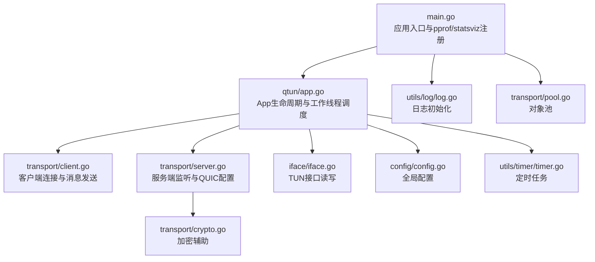
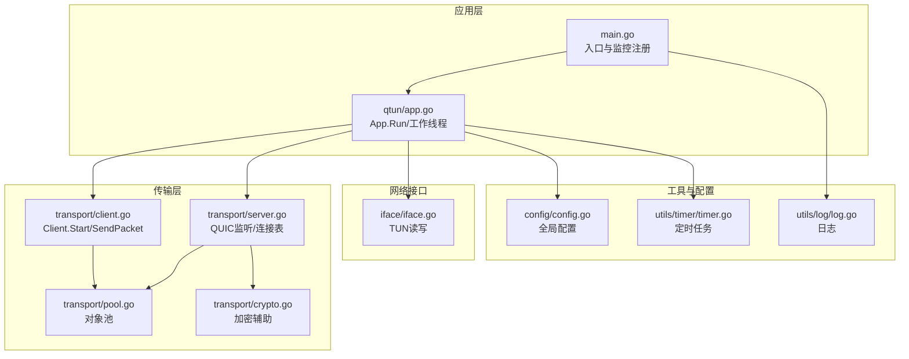
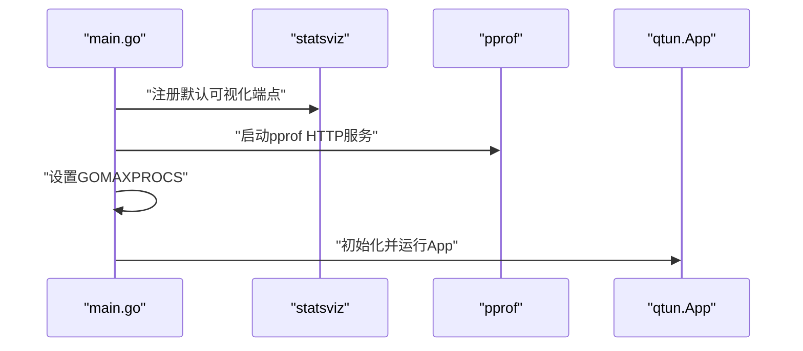
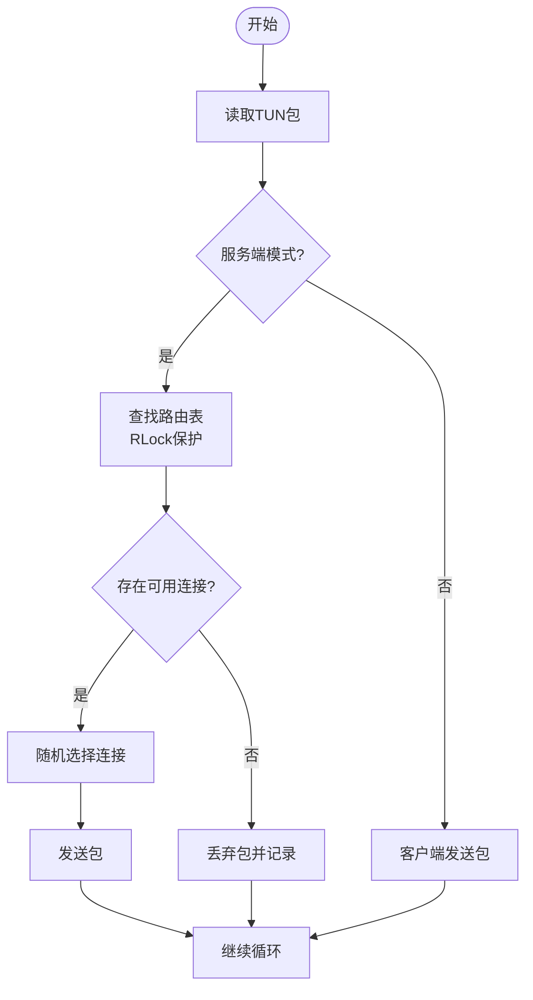
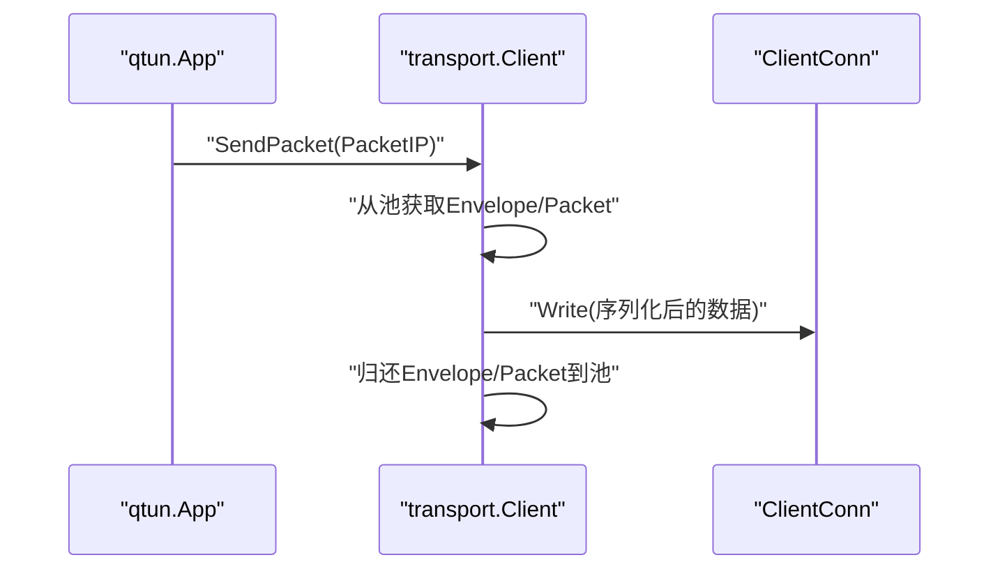
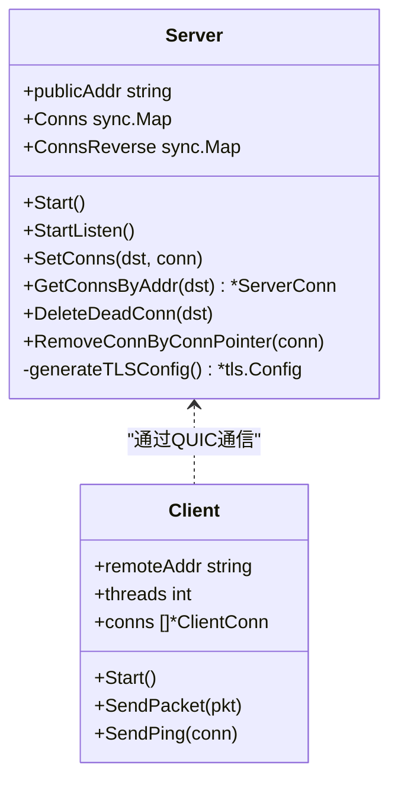
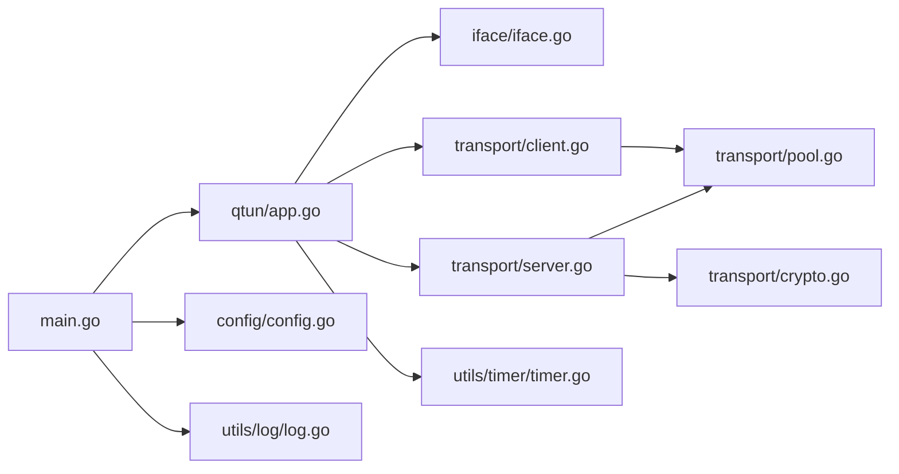

# 性能监控与测试

<cite>
**本文引用的文件**
- [main.go](file://main.go)
- [config/config.go](file://config/config.go)
- [qtun/app.go](file://qtun/app.go)
- [transport/client.go](file://transport/client.go)
- [transport/server.go](file://transport/server.go)
- [transport/pool.go](file://transport/pool.go)
- [transport/crypto.go](file://transport/crypto.go)
- [iface/iface.go](file://iface/iface.go)
- [utils/timer/timer.go](file://utils/timer/timer.go)
- [utils/log/log.go](file://utils/log/log.go)
- [PERFORMANCE_TEST_GUIDE.md](file://PERFORMANCE_TEST_GUIDE.md)
- [PERFORMANCE_OPTIMIZATIONS.md](file://PERFORMANCE_OPTIMIZATIONS.md)
- [README.md](file://README.md)
- [Makefile](file://Makefile)
</cite>

## 目录
1. [简介](#简介)
2. [项目结构](#项目结构)
3. [核心组件](#核心组件)
4. [架构总览](#架构总览)
5. [详细组件分析](#详细组件分析)
6. [依赖关系分析](#依赖关系分析)
7. [性能考虑](#性能考虑)
8. [故障排查指南](#故障排查指南)
9. [结论](#结论)
10. [附录](#附录)

## 简介
本指南面向Qtun项目的性能监控与测试，结合仓库内现有的性能测试文档与代码实现，系统化地介绍性能监控体系、关键指标定义与测量方法、基准测试流程、瓶颈识别与诊断技术、回归测试与持续集成中的性能验证，以及优化验证与效果评估的标准化流程。读者可据此对Qtun在不同平台与负载下的表现进行全面评估与持续改进。

## 项目结构
Qtun采用模块化分层组织：入口与CLI解析位于主程序；配置管理集中于config；核心业务逻辑在qtun/App；传输层分为client与server，使用QUIC；网络接口封装在iface；通用工具与日志在utils；另有独立的性能测试与优化文档。

图表来源
- [main.go](file://main.go#L105-L136)
- [qtun/app.go](file://qtun/app.go#L37-L97)
- [transport/client.go](file://transport/client.go#L31-L83)
- [transport/server.go](file://transport/server.go#L37-L76)
- [iface/iface.go](file://iface/iface.go#L23-L74)
- [config/config.go](file://config/config.go#L17-L24)
- [utils/timer/timer.go](file://utils/timer/timer.go#L14-L47)
- [utils/log/log.go](file://utils/log/log.go#L10-L25)
- [transport/pool.go](file://transport/pool.go#L10-L51)
- [transport/crypto.go](file://transport/crypto.go#L10-L26)

章节来源
- [main.go](file://main.go#L105-L136)
- [README.md](file://README.md#L1-L99)

## 核心组件
- 应用入口与监控
  - 注册statsviz可视化监控与pprof分析端点，便于CPU/内存/Goroutine等性能分析。
  - 初始化GOMAXPROCS为CPU核数，提升并发能力。
- App与工作线程
  - 动态工作线程数量为CPU核数×2（最小4，最大32），以提升I/O并行度。
  - TUN包读取与处理循环，按目的IP选择连接或转发至客户端。
- 传输层
  - 客户端：多连接并行发送，原子轮询选择连接，减少锁竞争。
  - 服务端：QUIC监听，大窗口配置，sync.Map高并发连接表。
- 对象池
  - 多类协议对象与缓冲区池化，降低GC压力与分配次数。
- 日志与定时器
  - 可配置日志级别，便于性能调试与定位。
  - 定时清理路由与心跳任务，维持连接健康。

章节来源
- [main.go](file://main.go#L105-L136)
- [qtun/app.go](file://qtun/app.go#L72-L97)
- [transport/client.go](file://transport/client.go#L41-L83)
- [transport/server.go](file://transport/server.go#L96-L103)
- [transport/pool.go](file://transport/pool.go#L10-L51)
- [utils/log/log.go](file://utils/log/log.go#L10-L25)
- [utils/timer/timer.go](file://utils/timer/timer.go#L40-L47)

## 架构总览
下图展示Qtun从应用入口到传输层、网络接口与监控系统的整体交互。

图表来源
- [main.go](file://main.go#L105-L136)
- [qtun/app.go](file://qtun/app.go#L37-L97)
- [transport/client.go](file://transport/client.go#L31-L83)
- [transport/server.go](file://transport/server.go#L37-L76)
- [transport/pool.go](file://transport/pool.go#L10-L51)
- [transport/crypto.go](file://transport/crypto.go#L10-L26)
- [iface/iface.go](file://iface/iface.go#L23-L74)
- [config/config.go](file://config/config.go#L17-L24)
- [utils/timer/timer.go](file://utils/timer/timer.go#L40-L47)
- [utils/log/log.go](file://utils/log/log.go#L10-L25)

## 详细组件分析

### 应用入口与监控
- 监控端点
  - pprof与statsviz默认开启，分别用于CPU/内存/Goroutine分析与实时可视化。
- 并发控制
  - GOMAXPROCS设置为CPU核数，确保充分利用多核。
- CLI与配置
  - 提供日志级别、MTU、传输线程等关键性能相关参数。

图表来源
- [main.go](file://main.go#L105-L136)

章节来源
- [main.go](file://main.go#L105-L136)

### App与工作线程调度
- 工作线程数量策略
  - CPU核数×2，范围[4, 32]，平衡I/O并行与系统开销。
- TUN包处理
  - 循环读取TUN包，按目的IP查找连接，随机选择可用连接发送；服务端模式下使用RLock缩小临界区。
- 路由清理
  - 定时任务清理无效连接，避免路由表膨胀。

图表来源
- [qtun/app.go](file://qtun/app.go#L99-L167)
- [utils/timer/timer.go](file://utils/timer/timer.go#L50-L70)

章节来源
- [qtun/app.go](file://qtun/app.go#L72-L97)
- [qtun/app.go](file://qtun/app.go#L99-L167)
- [utils/timer/timer.go](file://utils/timer/timer.go#L40-L55)

### 传输层客户端
- 多连接并行
  - 启动threads条连接，原子自增选择发送连接，避免锁竞争。
- 协议封装与池化
  - 发送Ping/Packet前从池中获取Envelope/Packet对象，发送后归还，降低分配与GC压力。
- 心跳与重试
  - 定期发送Ping并重试连接，保证链路活跃。

图表来源
- [transport/client.go](file://transport/client.go#L208-L223)
- [transport/pool.go](file://transport/pool.go#L74-L100)

章节来源
- [transport/client.go](file://transport/client.go#L41-L83)
- [transport/client.go](file://transport/client.go#L114-L132)
- [transport/client.go](file://transport/client.go#L178-L206)
- [transport/client.go](file://transport/client.go#L208-L223)
- [transport/pool.go](file://transport/pool.go#L10-L51)

### 传输层服务端
- QUIC监听与配置
  - 高并发流、大接收窗口、长保活周期，提升吞吐与稳定性。
- 连接表与同步
  - 使用sync.Map存储连接，支持无锁读写与删除，提高并发性能。
- TLS配置
  - 生成更高安全强度的证书，保障传输安全。

图表来源
- [transport/server.go](file://transport/server.go#L23-L46)
- [transport/server.go](file://transport/server.go#L96-L103)
- [transport/server.go](file://transport/server.go#L175-L210)
- [transport/client.go](file://transport/client.go#L31-L83)

章节来源
- [transport/server.go](file://transport/server.go#L96-L103)
- [transport/server.go](file://transport/server.go#L175-L210)
- [transport/server.go](file://transport/server.go#L151-L173)

### 对象池与内存优化
- 池类型
  - Nonce、Buffer、Envelope、MessagePing、MessagePacket、ReadBuf等。
- 生命周期
  - 获取时重置状态，归还时清空内容，避免逃逸与GC压力。
- 效果
  - 显著降低分配次数与堆增长，改善GC暂停时间。

章节来源
- [transport/pool.go](file://transport/pool.go#L10-L51)
- [transport/pool.go](file://transport/pool.go#L74-L100)

### 日志与定时器
- 日志
  - 可配置Info/Debug级别，便于性能调试与定位。
- 定时器
  - 注册周期性任务，如路由清理与心跳，避免阻塞主线程。

章节来源
- [utils/log/log.go](file://utils/log/log.go#L10-L25)
- [utils/timer/timer.go](file://utils/timer/timer.go#L21-L47)

## 依赖关系分析
- 入口依赖
  - main.go依赖statsviz/pprof、qtun.App、config、log、fileserver、socks5等模块。
- App依赖
  - qtun/app.go依赖config、iface、transport、timer、log。
- 传输层依赖
  - transport/*依赖config、protocol、utils、zerolog、quic-go等。
- 工具与接口
  - utils/*与iface依赖标准库与第三方库。

图表来源
- [main.go](file://main.go#L105-L136)
- [qtun/app.go](file://qtun/app.go#L19-L35)
- [transport/client.go](file://transport/client.go#L31-L39)
- [transport/server.go](file://transport/server.go#L37-L46)
- [transport/pool.go](file://transport/pool.go#L10-L51)
- [transport/crypto.go](file://transport/crypto.go#L10-L26)
- [iface/iface.go](file://iface/iface.go#L23-L74)
- [utils/timer/timer.go](file://utils/timer/timer.go#L14-L47)
- [config/config.go](file://config/config.go#L17-L24)
- [utils/log/log.go](file://utils/log/log.go#L10-L25)

## 性能考虑
- 并发与并行
  - GOMAXPROCS与动态工作线程策略提升I/O并行度。
  - 客户端原子轮询选择连接，减少锁竞争。
- 内存与GC
  - 对象池复用协议对象与缓冲区，降低分配与GC压力。
- 传输层优化
  - QUIC大窗口、高并发流与保活配置，提升吞吐与稳定性。
- 路由与连接管理
  - sync.Map高效连接表，定时清理无效连接，避免资源泄漏。

章节来源
- [main.go](file://main.go#L105-L116)
- [qtun/app.go](file://qtun/app.go#L79-L97)
- [transport/client.go](file://transport/client.go#L114-L132)
- [transport/server.go](file://transport/server.go#L96-L103)
- [transport/pool.go](file://transport/pool.go#L10-L51)
- [utils/timer/timer.go](file://utils/timer/timer.go#L40-L47)

## 故障排查指南
- 性能未达预期
  - 检查工作线程数量：确认日志中打印的worker数量是否符合CPU核数×2策略。
  - 检查对象池使用：通过pprof allocs观察分配次数是否下降。
  - 检查锁争用：通过pprof mutex分析锁等待情况。
  - 检查网络：使用iperf3在非Qtun端口进行基线测试，排除网络瓶颈。
- 监控与分析
  - CPU/内存/Goroutine：使用pprof端点抓取profile并分析。
  - 实时可视化：访问statsviz端点观察运行时指标。
- 稳定性测试
  - 执行24小时稳定性脚本，记录内存RSS、Goroutine数量与吞吐趋势，生成报告。

章节来源
- [PERFORMANCE_TEST_GUIDE.md](file://PERFORMANCE_TEST_GUIDE.md#L286-L323)
- [PERFORMANCE_TEST_GUIDE.md](file://PERFORMANCE_TEST_GUIDE.md#L233-L258)
- [PERFORMANCE_TEST_GUIDE.md](file://PERFORMANCE_TEST_GUIDE.md#L260-L284)

## 结论
Qtun在入口层集成了pprof与statsviz，在核心路径中实现了对象池、动态工作线程、QUIC大窗口与sync.Map高并发连接表等优化，形成了较为完善的性能监控与测试基础。结合仓库提供的性能测试指南，可系统开展吞吐、延迟、资源使用等关键指标的基准测试与回归验证，持续迭代优化。

## 附录

### 关键性能指标与测量方法
- 吞吐量
  - 指标：数据传输速率、包转发率(pps)
  - 方法：iperf3、自定义脚本
  - 目标：+30%-50%（速率）、+40%-60%（pps）
- 延迟
  - 指标：平均延迟、P99延迟
  - 方法：ping、统计分析
  - 目标：-20%-40%（平均）、-30%-50%（P99）
- 资源使用
  - 指标：CPU使用率、内存分配、Goroutine数量、GC暂停时间
  - 方法：pprof heap/mutex/goroutine、statsviz
  - 目标：CPU -10%-20%、内存 -50%-70%、Goroutine稳定、GC暂停 -40%-60%

章节来源
- [PERFORMANCE_TEST_GUIDE.md](file://PERFORMANCE_TEST_GUIDE.md#L111-L135)

### 性能基准测试流程
- 环境准备
  - 使用仓库提供的构建方式或Makefile产出二进制。
  - 启动pprof与statsviz监控端口。
- 场景设计
  - 吞吐量：iperf3在VPN IP上发起多流测试。
  - 延迟：持续ping并统计均值与标准差。
  - 并发连接：使用ab或wrk压测HTTP服务。
  - 资源：top/htop观测CPU/内存；pprof抓取profile。
- 结果分析
  - 生成稳定性报告，记录RSS、Goroutine与吞吐趋势。

章节来源
- [PERFORMANCE_TEST_GUIDE.md](file://PERFORMANCE_TEST_GUIDE.md#L26-L110)
- [PERFORMANCE_TEST_GUIDE.md](file://PERFORMANCE_TEST_GUIDE.md#L136-L187)
- [PERFORMANCE_TEST_GUIDE.md](file://PERFORMANCE_TEST_GUIDE.md#L260-L284)
- [Makefile](file://Makefile#L3-L23)

### 性能瓶颈识别与诊断
- CPU使用率分析
  - 使用pprof profile抓取热点函数，定位CPU热点。
- 内存占用监控
  - 使用pprof heap与allocs分析堆增长与分配热点。
- 网络延迟测量
  - 使用ping与iperf3测量端到端延迟与带宽。
- 并发与锁
  - 使用pprof mutex分析锁争用；检查工作线程数量与连接数。

章节来源
- [PERFORMANCE_TEST_GUIDE.md](file://PERFORMANCE_TEST_GUIDE.md#L85-L109)
- [PERFORMANCE_TEST_GUIDE.md](file://PERFORMANCE_TEST_GUIDE.md#L286-L309)

### 回归测试与持续集成
- 回归测试
  - 将性能测试脚本纳入CI，定期执行吞吐、延迟与资源使用测试。
- 指标阈值
  - 为关键指标设定阈值，失败即告警。
- 报告输出
  - 输出趋势图与摘要，便于对比优化前后差异。

章节来源
- [PERFORMANCE_TEST_GUIDE.md](file://PERFORMANCE_TEST_GUIDE.md#L136-L187)
- [PERFORMANCE_TEST_GUIDE.md](file://PERFORMANCE_TEST_GUIDE.md#L260-L284)

### 优化验证与效果评估
- 对象池验证
  - 通过pprof allocs观察分配次数与对象回收情况。
- 锁优化验证
  - 通过pprof mutex分析锁等待时间变化。
- Channel与Worker验证
  - 观察日志中worker数量与阻塞情况，评估吞吐与丢包率。
- QUIC配置验证
  - 使用tcpdump观察连接参数，确认窗口增大等优化生效。

章节来源
- [PERFORMANCE_TEST_GUIDE.md](file://PERFORMANCE_TEST_GUIDE.md#L189-L232)
- [qtun/app.go](file://qtun/app.go#L79-L97)
- [transport/client.go](file://transport/client.go#L114-L132)
- [transport/server.go](file://transport/server.go#L96-L103)