# 网络传输优化

<cite>
**本文档引用的文件**
- [main.go](file://main.go)
- [config/config.go](file://config/config.go)
- [transport/server.go](file://transport/server.go)
- [transport/client.go](file://transport/client.go)
- [transport/client_conn.go](file://transport/client_conn.go)
- [transport/server_conn.go](file://transport/server_conn.go)
- [transport/pool.go](file://transport/pool.go)
- [transport/crypto.go](file://transport/crypto.go)
- [qtun/app.go](file://qtun/app.go)
- [iface/iface.go](file://iface/iface.go)
- [PERFORMANCE_TEST_GUIDE.md](file://PERFORMANCE_TEST_GUIDE.md)
</cite>

## 目录
1. [简介](#简介)
2. [项目结构](#项目结构)
3. [核心组件](#核心组件)
4. [架构概览](#架构概览)
5. [详细组件分析](#详细组件分析)
6. [依赖关系分析](#依赖关系分析)
7. [性能考虑](#性能考虑)
8. [故障排除指南](#故障排除指南)
9. [结论](#结论)

## 简介

本指南深入解析qtun项目的网络传输优化技术，重点涵盖QUIC协议的性能特点与优化策略、连接复用与多路复用机制、拥塞控制优化、网络缓冲区管理与MTU调优、并发连接管理与负载均衡、延迟优化技术以及性能监控诊断方法。该系统基于Go语言实现，采用QUIC协议作为传输层，结合TUN虚拟网卡实现VPN功能，通过多种优化技术提升网络传输效率和稳定性。

## 项目结构

qtun项目采用模块化设计，主要包含以下核心模块：

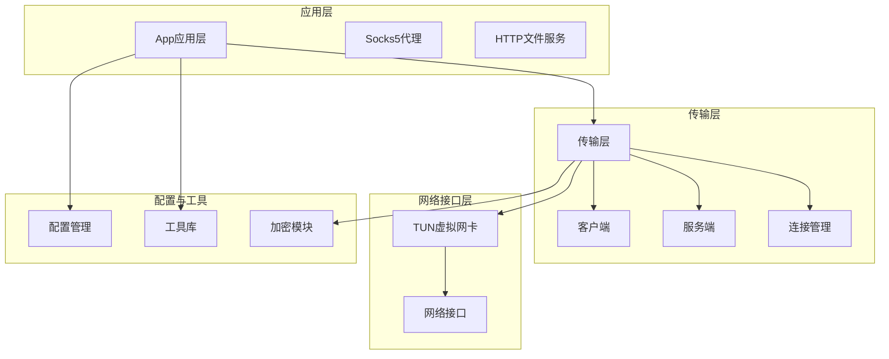

**图表来源**
- [main.go](file://main.go#L1-L136)
- [qtun/app.go](file://qtun/app.go#L1-L271)
- [transport/server.go](file://transport/server.go#L1-L219)

**章节来源**
- [main.go](file://main.go#L1-L136)
- [config/config.go](file://config/config.go#L1-L24)

## 核心组件

### QUIC协议实现

系统基于quic-go库实现QUIC协议，提供高性能的网络传输能力。QUIC协议的主要优势包括：

- **零往返握手**: 减少连接建立延迟
- **内置加密**: 提升安全性
- **多路复用**: 支持多个流并发传输
- **拥塞控制**: 内置拥塞控制算法

### 连接管理

系统实现了智能的连接管理机制，支持多连接并发和负载均衡：

- **客户端连接池**: 支持多个并发连接
- **服务端连接映射**: 基于sync.Map实现高效查找
- **动态连接选择**: 基于轮询算法的负载均衡

### 缓冲区管理

采用多种缓冲区优化策略：

- **对象池**: 复用频繁使用的对象
- **大缓冲区**: 64KB读取缓冲区提升吞吐量
- **通道缓冲**: 256个元素的写入通道

**章节来源**
- [transport/server.go](file://transport/server.go#L96-L103)
- [transport/client_conn.go](file://transport/client_conn.go#L44-L55)
- [transport/pool.go](file://transport/pool.go#L10-L50)

## 架构概览

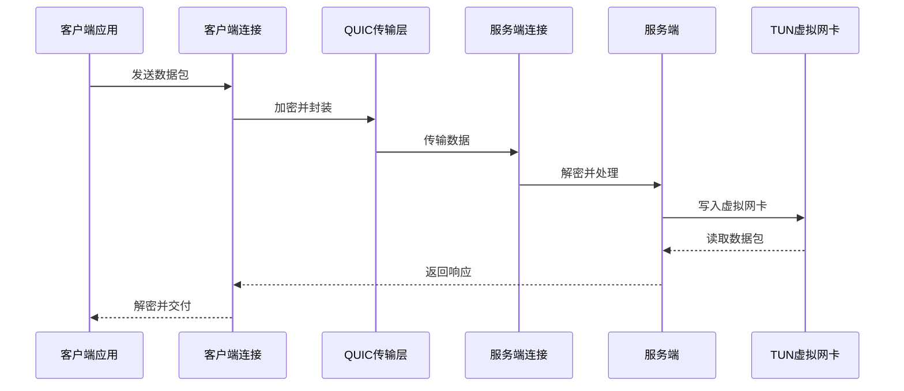

**图表来源**
- [transport/client.go](file://transport/client.go#L115-L132)
- [transport/server.go](file://transport/server.go#L133-L148)
- [qtun/app.go](file://qtun/app.go#L169-L207)

## 详细组件分析

### QUIC配置优化

系统在QUIC配置中实现了多项性能优化：

#### 服务端QUIC配置
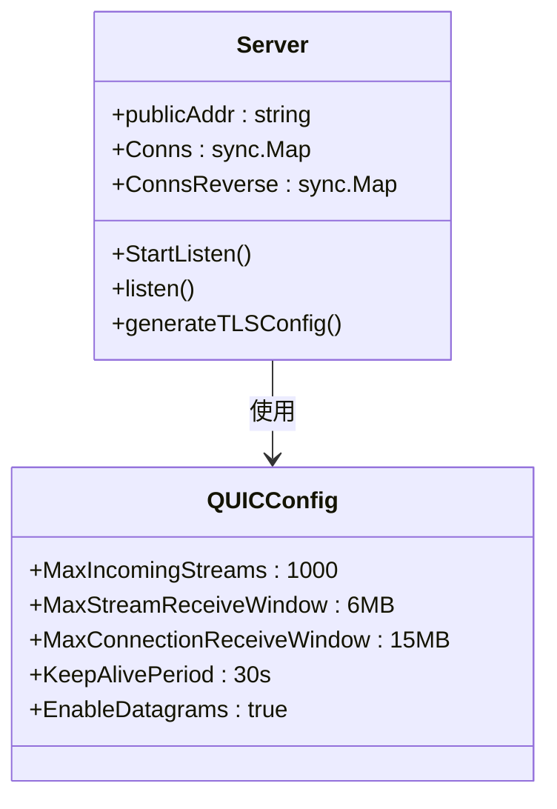

**图表来源**
- [transport/server.go](file://transport/server.go#L96-L103)
- [transport/server.go](file://transport/server.go#L151-L173)

#### 客户端QUIC配置
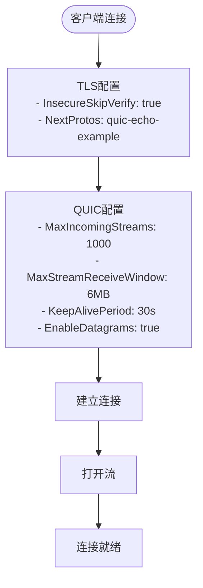

**图表来源**
- [transport/client_conn.go](file://transport/client_conn.go#L79-L91)
- [transport/client_conn.go](file://transport/client_conn.go#L95-L107)

**章节来源**
- [transport/server.go](file://transport/server.go#L96-L103)
- [transport/client_conn.go](file://transport/client_conn.go#L79-L91)

### 连接复用与多路复用

#### 客户端连接管理
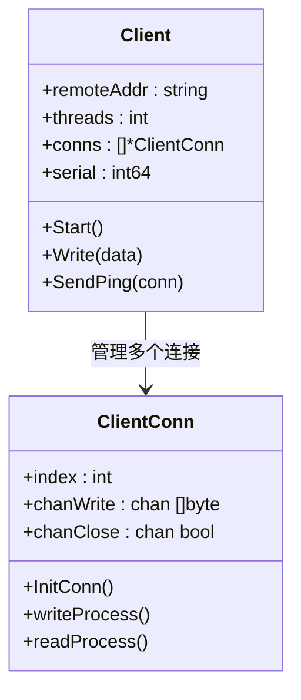

**图表来源**
- [transport/client.go](file://transport/client.go#L20-L29)
- [transport/client.go](file://transport/client.go#L31-L39)

#### 服务端连接管理
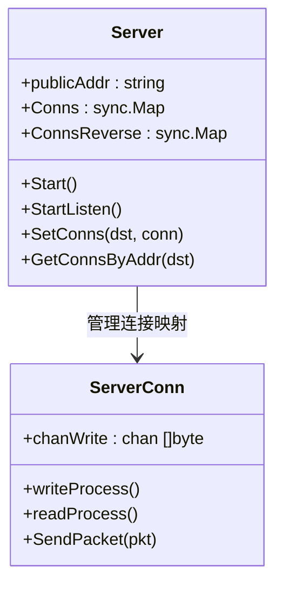

**图表来源**
- [transport/server.go](file://transport/server.go#L23-L35)
- [transport/server.go](file://transport/server.go#L175-L210)

**章节来源**
- [transport/client.go](file://transport/client.go#L41-L83)
- [transport/server.go](file://transport/server.go#L48-L76)

### 拥塞控制机制

系统通过QUIC协议内置的拥塞控制算法实现网络优化：

#### 拥塞控制参数
- **接收窗口**: 服务端设置6MB流接收窗口，15MB连接接收窗口
- **保活周期**: 30秒保活检测
- **流数量**: 支持最多1000个并发流

#### 数据传输流程
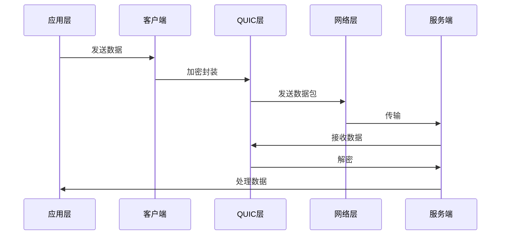

**图表来源**
- [transport/client_conn.go](file://transport/client_conn.go#L241-L294)
- [transport/server_conn.go](file://transport/server_conn.go#L167-L220)

**章节来源**
- [transport/server.go](file://transport/server.go#L96-L103)
- [transport/client_conn.go](file://transport/client_conn.go#L241-L294)

### 网络缓冲区管理

#### 对象池优化
系统实现了多层次的对象池来减少内存分配：

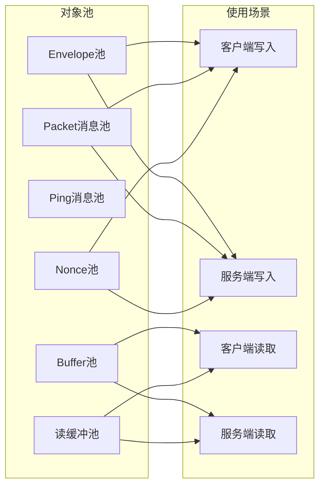

**图表来源**
- [transport/pool.go](file://transport/pool.go#L10-L50)

#### 缓冲区大小优化
- **读取缓冲区**: 64KB大缓冲区提升单次读取效率
- **写入通道**: 256个元素缓冲减少阻塞
- **对象池**: 复用频繁创建的对象

**章节来源**
- [transport/pool.go](file://transport/pool.go#L10-L108)
- [transport/client_conn.go](file://transport/client_conn.go#L44-L55)
- [transport/server_conn.go](file://transport/server_conn.go#L39-L51)

### MTU调优技术

#### MTU配置管理
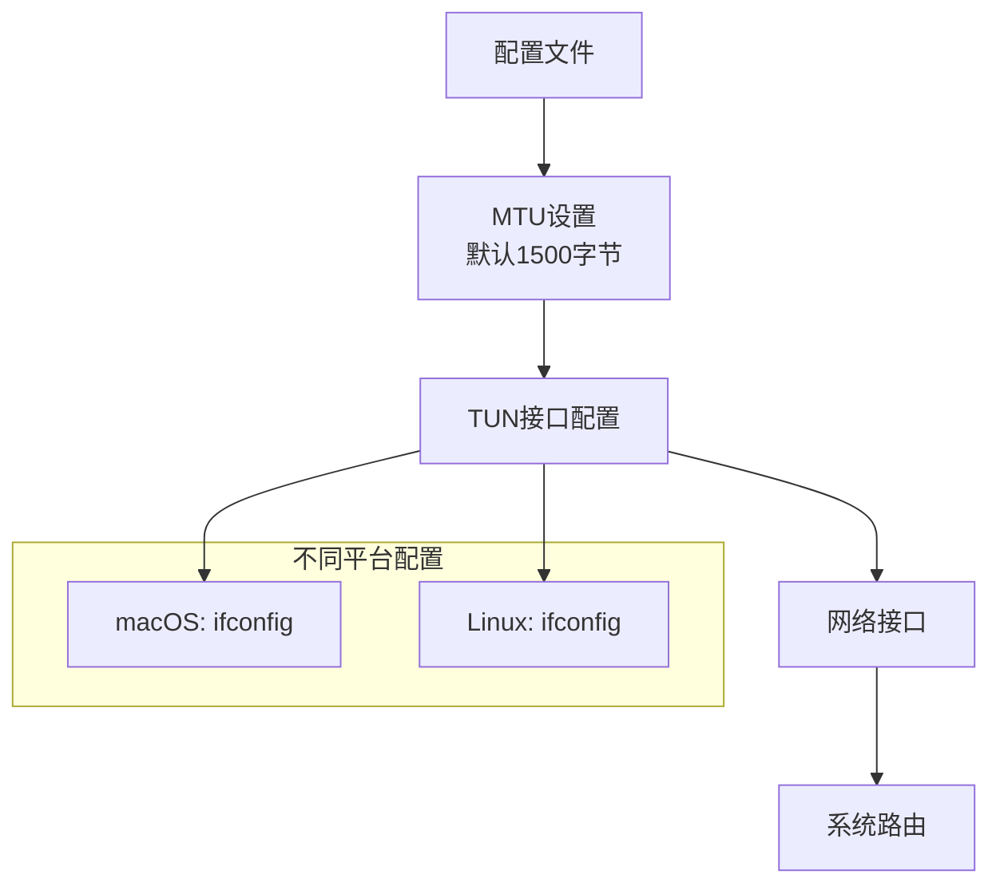

**图表来源**
- [config/config.go](file://config/config.go#L3-L13)
- [iface/iface.go](file://iface/iface.go#L36-L74)

#### MTU优化策略
- **默认值**: 1500字节适应大多数网络环境
- **可配置性**: 支持通过命令行参数调整
- **平台适配**: 不同操作系统使用相应的配置命令

**章节来源**
- [config/config.go](file://config/config.go#L3-L13)
- [iface/iface.go](file://iface/iface.go#L36-L74)

### 并发连接管理

#### 动态工作线程
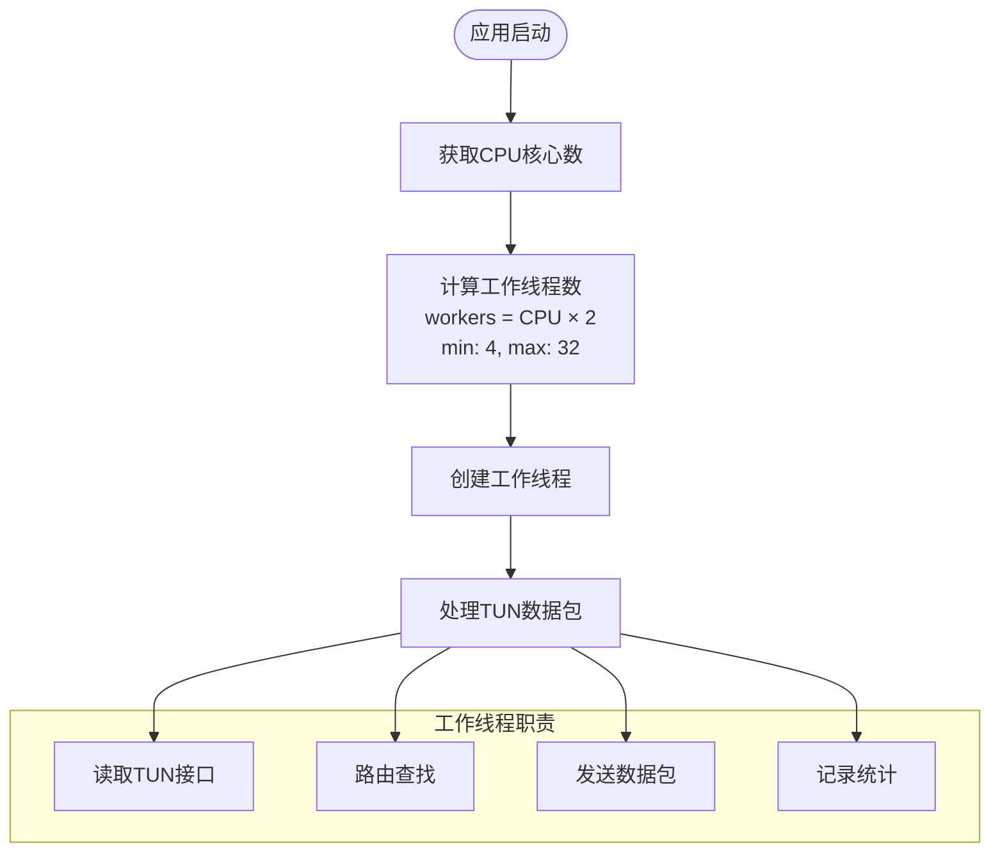

**图表来源**
- [qtun/app.go](file://qtun/app.go#L79-L97)

#### 连接池配置
- **客户端连接**: 可配置的并发线程数
- **服务端连接**: 基于sync.Map的高效连接映射
- **负载均衡**: 基于轮询的连接选择算法

**章节来源**
- [qtun/app.go](file://qtun/app.go#L79-L97)
- [transport/client.go](file://transport/client.go#L41-L83)

### 网络延迟优化

#### 心跳机制
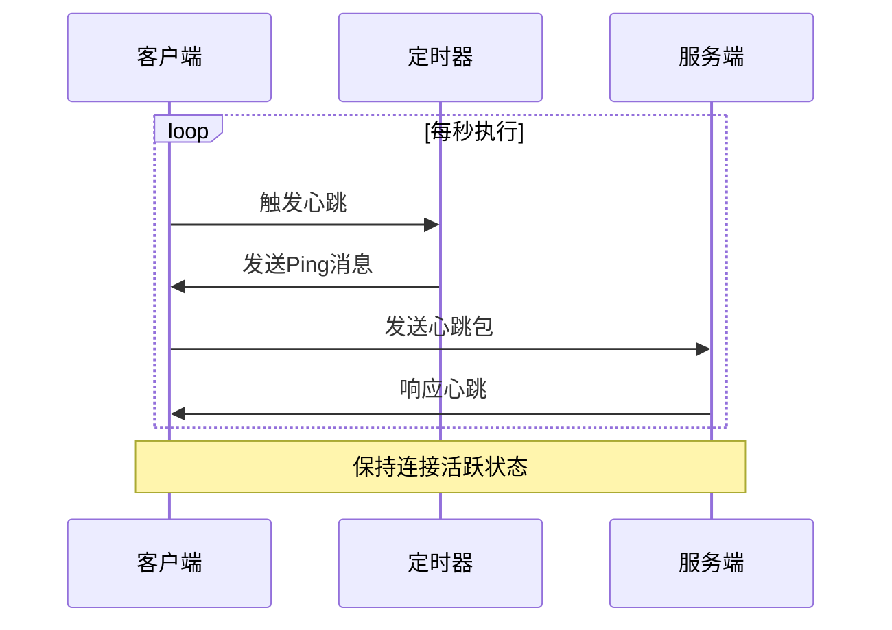

**图表来源**
- [transport/client.go](file://transport/client.go#L75-L82)
- [transport/client.go](file://transport/client.go#L142-L157)

#### 超时设置与重连策略
- **保活周期**: 30秒检测连接状态
- **重试机制**: 连接失败后自动重试
- **超时处理**: 合理的读写超时设置

**章节来源**
- [transport/server.go](file://transport/server.go#L101)
- [transport/client_conn.go](file://transport/client_conn.go#L173-L187)

### 加密优化

#### 密钥管理
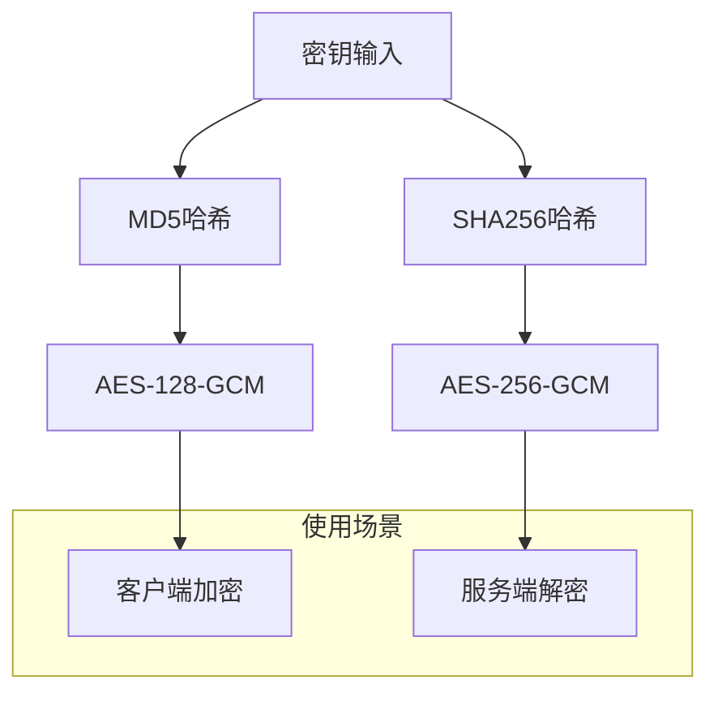

**图表来源**
- [transport/crypto.go](file://transport/crypto.go#L10-L26)

**章节来源**
- [transport/crypto.go](file://transport/crypto.go#L10-L26)

## 依赖关系分析

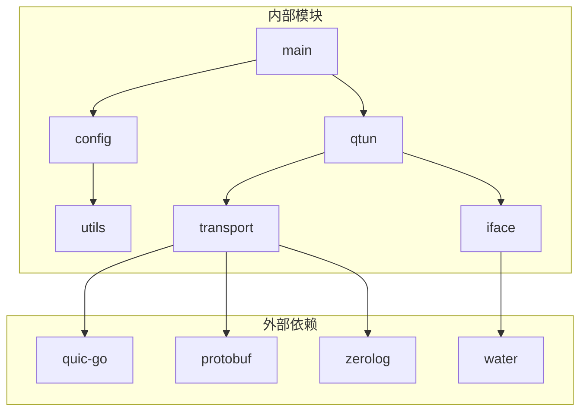

**图表来源**
- [main.go](file://main.go#L3-L20)
- [transport/server.go](file://transport/server.go#L18-L21)

**章节来源**
- [main.go](file://main.go#L3-L20)
- [transport/server.go](file://transport/server.go#L18-L21)

## 性能考虑

### 网络性能优化策略

#### QUIC协议优势
- **零往返握手**: 显著减少连接建立延迟
- **内置加密**: 避免额外的加密开销
- **多路复用**: 支持多个流并发传输
- **拥塞控制**: 内置高效的拥塞控制算法

#### 缓冲区优化
- **大缓冲区**: 64KB读取缓冲区提升吞吐量
- **对象池**: 减少内存分配和GC压力
- **通道缓冲**: 256个元素的写入通道减少阻塞

#### 并发优化
- **动态工作线程**: CPU核心数×2的工作线程数
- **锁优化**: 使用RWMutex和sync.Map减少锁争用
- **连接池**: 多连接并发提升整体性能

### 性能监控与诊断

#### 内置监控工具
- **pprof**: Go标准性能分析工具
- **statsviz**: 实时可视化监控
- **日志系统**: zerolog提供结构化日志

#### 性能测试场景
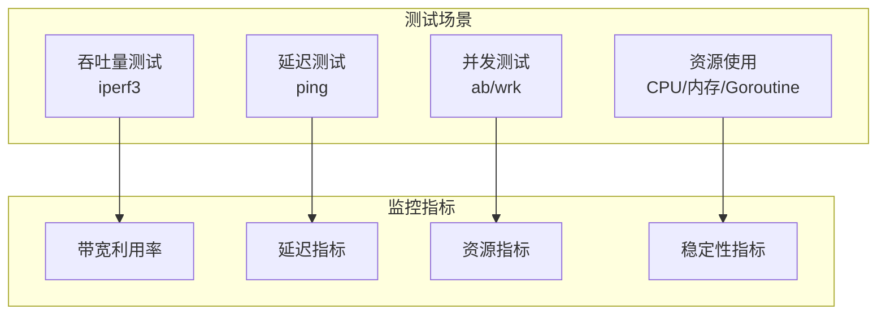

**图表来源**
- [PERFORMANCE_TEST_GUIDE.md](file://PERFORMANCE_TEST_GUIDE.md#L26-L135)

**章节来源**
- [PERFORMANCE_TEST_GUIDE.md](file://PERFORMANCE_TEST_GUIDE.md#L17-L24)
- [PERFORMANCE_TEST_GUIDE.md](file://PERFORMANCE_TEST_GUIDE.md#L111-L135)

## 故障排除指南

### 常见问题诊断

#### 连接问题
1. **连接失败**: 检查QUIC配置和TLS证书
2. **连接中断**: 查看保活机制和超时设置
3. **连接泄漏**: 监控连接池状态和清理机制

#### 性能问题
1. **吞吐量低**: 检查缓冲区大小和工作线程数
2. **延迟高**: 分析网络路径和QUIC参数
3. **内存使用高**: 检查对象池使用情况

#### 监控与调试
- **pprof分析**: CPU、内存、Goroutine分析
- **日志分析**: 结构化日志定位问题
- **网络抓包**: tcpdump分析网络流量

**章节来源**
- [PERFORMANCE_TEST_GUIDE.md](file://PERFORMANCE_TEST_GUIDE.md#L286-L323)

### 优化建议

#### QUIC配置调优
- 根据网络环境调整接收窗口大小
- 优化保活周期以平衡资源消耗
- 调整流数量以适应应用场景

#### 缓冲区调优
- 根据数据特征调整缓冲区大小
- 监控内存使用情况优化对象池
- 调整通道缓冲大小平衡延迟和吞吐

#### 并发调优
- 根据CPU核心数调整工作线程数
- 优化锁使用减少竞争
- 调整连接池大小平衡性能和资源

## 结论

qtun项目通过QUIC协议和多种优化技术实现了高性能的网络传输解决方案。系统的关键优化点包括：

1. **QUIC协议优势**: 利用零往返握手、内置加密和多路复用特性
2. **缓冲区优化**: 对象池、大缓冲区和通道缓冲减少开销
3. **并发优化**: 动态工作线程、锁优化和连接池提升性能
4. **监控诊断**: 内置pprof和statsviz工具支持性能分析

这些优化技术共同作用，为用户提供稳定、高效的网络传输体验。通过合理的配置和持续的性能监控，可以进一步提升系统的网络传输性能和稳定性。