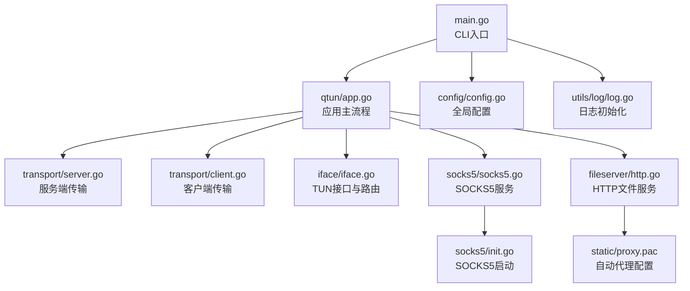
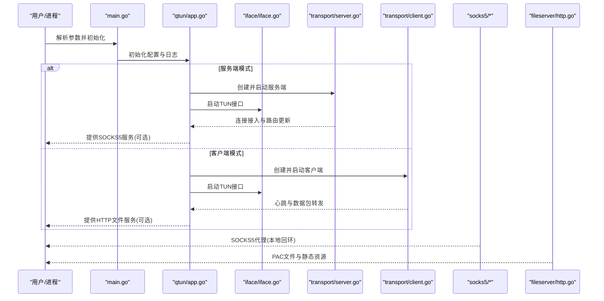
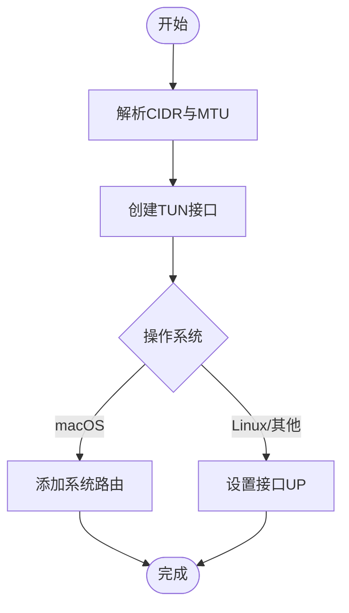
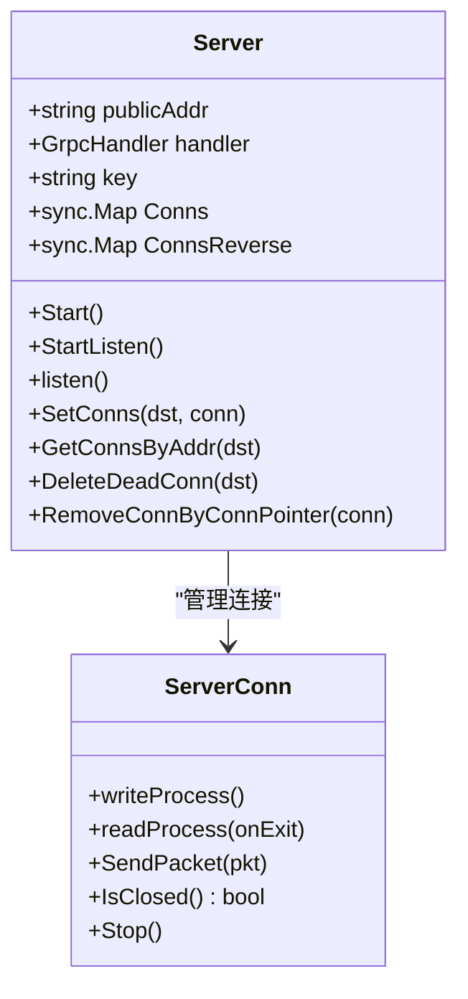
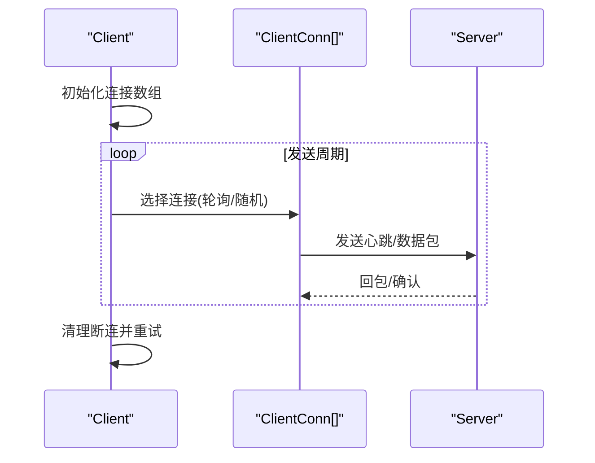
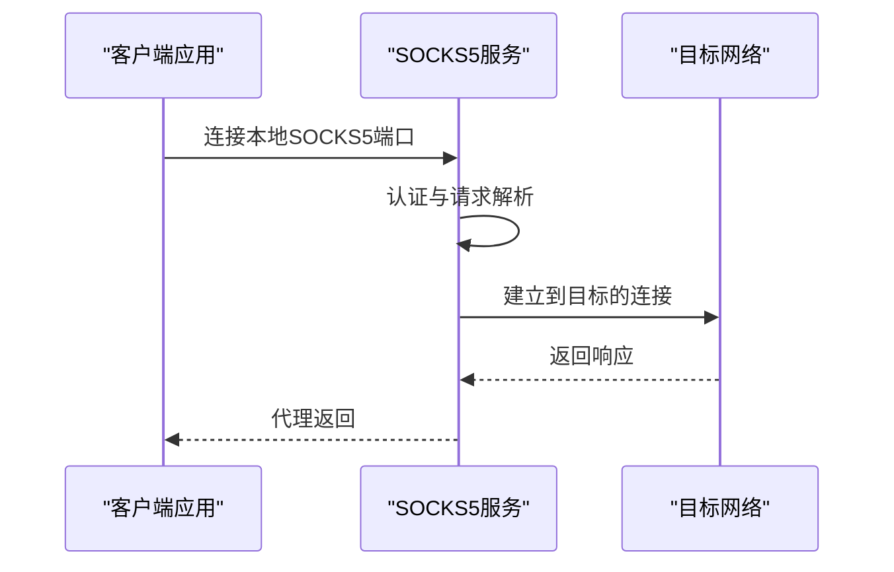
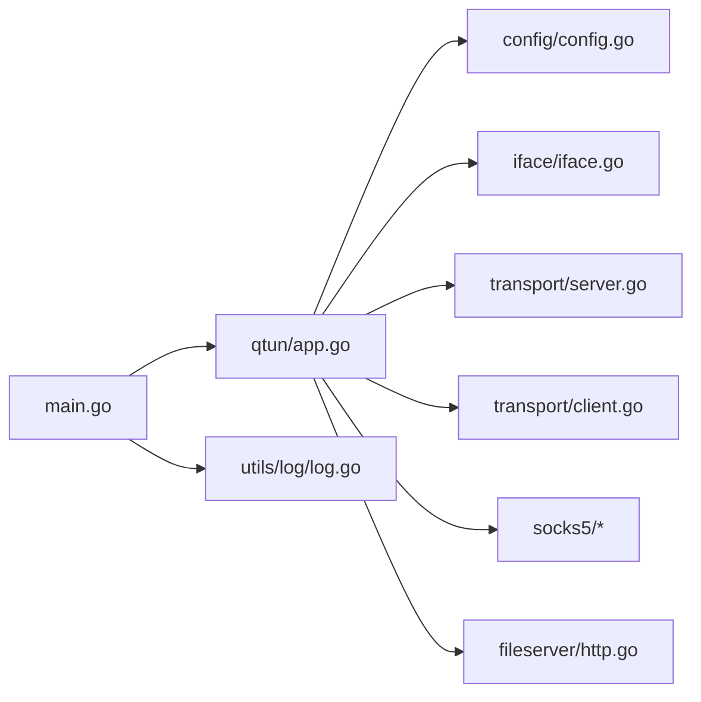

# 兼容性问题

<cite>
**本文引用的文件**
- [main.go](file://main.go)
- [README.md](file://README.md)
- [go.mod](file://go.mod)
- [config/config.go](file://config/config.go)
- [iface/iface.go](file://iface/iface.go)
- [transport/server.go](file://transport/server.go)
- [transport/client.go](file://transport/client.go)
- [socks5/socks5.go](file://socks5/socks5.go)
- [socks5/init.go](file://socks5/init.go)
- [fileserver/http.go](file://fileserver/http.go)
- [qtun/app.go](file://qtun/app.go)
- [utils/log/log.go](file://utils/log/log.go)
- [static/proxy.pac](file://static/proxy.pac)
- [PERFORMANCE_TEST_GUIDE.md](file://PERFORMANCE_TEST_GUIDE.md)
</cite>

## 目录
1. [简介](#简介)
2. [项目结构](#项目结构)
3. [核心组件](#核心组件)
4. [架构总览](#架构总览)
5. [详细组件分析](#详细组件分析)
6. [依赖关系分析](#依赖关系分析)
7. [性能与兼容性考量](#性能与兼容性考量)
8. [故障排查指南](#故障排查指南)
9. [结论](#结论)
10. [附录](#附录)

## 简介
本指南聚焦于跨平台兼容性问题的系统化排查与解决，结合 qtun 的实际实现，覆盖以下方面：
- 操作系统差异：Windows、macOS、Linux 的权限模型、网络接口行为、系统 API 限制
- Go 版本兼容性与升级注意事项
- 防火墙与安全软件配置：Windows Defender、macOS Gatekeeper、Linux iptables 等
- 网络环境差异：NAT 穿透、代理服务器、企业网络限制
- 容器化部署：Docker、Kubernetes 的特殊配置要点
- 移动设备与嵌入式系统部署注意事项

## 项目结构
项目采用模块化分层设计：
- CLI 入口与配置初始化：main.go、config/config.go
- 网络栈与传输：transport/server.go、transport/client.go
- TUN 接口与系统路由：iface/iface.go
- 本地代理：socks5/socks5.go、socks5/init.go
- 文件服务器与 PAC：fileserver/http.go、static/proxy.pac
- 应用主流程：qtun/app.go
- 日志与辅助工具：utils/log/log.go

**图表来源**
- [main.go](file://main.go#L1-L136)
- [qtun/app.go](file://qtun/app.go#L1-L271)
- [transport/server.go](file://transport/server.go#L1-L219)
- [transport/client.go](file://transport/client.go#L1-L223)
- [iface/iface.go](file://iface/iface.go#L1-L105)
- [socks5/socks5.go](file://socks5/socks5.go#L1-L170)
- [socks5/init.go](file://socks5/init.go#L1-L23)
- [fileserver/http.go](file://fileserver/http.go#L1-L17)
- [config/config.go](file://config/config.go#L1-L24)
- [utils/log/log.go](file://utils/log/log.go#L1-L26)
- [static/proxy.pac](file://static/proxy.pac#L1-L800)

**章节来源**
- [main.go](file://main.go#L1-L136)
- [README.md](file://README.md#L1-L99)

## 核心组件
- CLI 与配置
  - 命令行参数解析与默认值、日志级别、模式开关（server_mode、proxyonly）、网络参数（listen、remote_addrs、ip、mtu、transport_threads、nodelay）
  - 全局配置初始化与读取
- 应用主流程
  - 服务端/客户端模式切换、TUN 接口启动、数据包收发与路由维护、SOCKS5 与文件服务的启停
- 传输层
  - 服务端监听与连接管理、QUIC 配置、连接池与清理
  - 客户端多路复用连接、心跳与健康检查
- TUN 接口
  - 跨平台接口创建、IP/MASK/MTU 设置、系统路由添加（macOS）
- 本地代理与文件服务
  - SOCKS5 服务监听、自动代理 PAC 文件位置与内容

**章节来源**
- [main.go](file://main.go#L22-L103)
- [config/config.go](file://config/config.go#L3-L24)
- [qtun/app.go](file://qtun/app.go#L37-L97)
- [transport/server.go](file://transport/server.go#L23-L52)
- [transport/client.go](file://transport/client.go#L20-L83)
- [iface/iface.go](file://iface/iface.go#L31-L92)
- [socks5/socks5.go](file://socks5/socks5.go#L109-L118)
- [fileserver/http.go](file://fileserver/http.go#L9-L16)

## 架构总览
下图展示 qtun 在不同模式下的关键交互路径。

**图表来源**
- [main.go](file://main.go#L75-L102)
- [qtun/app.go](file://qtun/app.go#L37-L97)
- [transport/server.go](file://transport/server.go#L48-L76)
- [transport/client.go](file://transport/client.go#L41-L83)
- [iface/iface.go](file://iface/iface.go#L31-L74)
- [socks5/init.go](file://socks5/init.go#L5-L22)
- [fileserver/http.go](file://fileserver/http.go#L9-L16)

## 详细组件分析

### TUN 接口与系统路由（跨平台差异）
- 权限要求
  - 创建 TUN 接口通常需要管理员权限；在 macOS/Linux 下通过系统工具执行，Windows 不支持
- 接口配置
  - 解析 CIDR、设置 MTU、调用系统命令配置 IP 与 up 状态
- 路由添加
  - macOS 下额外添加系统路由以确保流量经由 TUN
- 兼容性建议
  - 优先在 Linux/macOS 上使用 root 或具备 CAP_NET_ADMIN 能力的用户运行
  - Windows 用户需改用其他隧道方案或虚拟网卡替代

**图表来源**
- [iface/iface.go](file://iface/iface.go#L31-L92)

**章节来源**
- [iface/iface.go](file://iface/iface.go#L31-L92)
- [README.md](file://README.md#L96-L98)

### 传输层（QUIC 服务端）
- 监听与接受
  - 使用 QUIC 监听地址，接受连接并建立会话
- 连接管理
  - 使用并发安全的数据结构维护连接映射，定期清理失效连接
- 配置要点
  - 可调参数：最大流数量、接收窗口、连接窗口、保活周期、启用 datagram

**图表来源**
- [transport/server.go](file://transport/server.go#L23-L219)

**章节来源**
- [transport/server.go](file://transport/server.go#L48-L149)

### 传输层（客户端）
- 多连接与负载均衡
  - 按线程数创建多个连接，基于原子序号轮询选择发送通道
- 健康检查
  - 定期发送心跳，失败时重试并回收连接
- 数据包封装
  - 使用协议缓冲区封装数据包并通过连接发送

**图表来源**
- [transport/client.go](file://transport/client.go#L31-L132)

**章节来源**
- [transport/client.go](file://transport/client.go#L41-L132)

### SOCKS5 代理与系统代理设置
- 服务端
  - 监听本地 TCP 端口，处理认证、请求解析与转发
- 系统代理
  - 仅 macOS 自动设置 PAC；Linux/Windows 需手动配置
- PAC 文件
  - 提供域名列表与自动代理逻辑，便于统一分流

**图表来源**
- [socks5/socks5.go](file://socks5/socks5.go#L109-L169)
- [socks5/init.go](file://socks5/init.go#L5-L22)
- [qtun/app.go](file://qtun/app.go#L250-L270)
- [static/proxy.pac](file://static/proxy.pac#L1-L800)

**章节来源**
- [socks5/socks5.go](file://socks5/socks5.go#L109-L169)
- [socks5/init.go](file://socks5/init.go#L5-L22)
- [qtun/app.go](file://qtun/app.go#L250-L270)

### 文件服务器与 PAC
- 文件服务器
  - 在指定目录与端口提供静态文件服务，用于分发 PAC
- PAC
  - 自动生成的代理规则文件，用于浏览器自动代理

**章节来源**
- [fileserver/http.go](file://fileserver/http.go#L9-L16)
- [static/proxy.pac](file://static/proxy.pac#L1-L800)

## 依赖关系分析
- CLI 与应用层
  - main.go 初始化配置与日志，随后创建 qtun.App 并按模式启动服务端/客户端、TUN 接口、SOCKS5 与文件服务
- 应用层与传输层
  - App 根据模式创建 transport.Server/transport.Client，负责连接生命周期与数据转发
- 应用层与网络接口
  - App 启动 iface.Iface，读写 TUN 数据包并参与路由决策
- 日志与工具
  - utils/log 提供日志级别控制与输出格式

**图表来源**
- [main.go](file://main.go#L75-L102)
- [qtun/app.go](file://qtun/app.go#L37-L97)
- [config/config.go](file://config/config.go#L17-L24)
- [iface/iface.go](file://iface/iface.go#L31-L74)
- [transport/server.go](file://transport/server.go#L48-L76)
- [transport/client.go](file://transport/client.go#L41-L83)
- [socks5/init.go](file://socks5/init.go#L5-L22)
- [fileserver/http.go](file://fileserver/http.go#L9-L16)
- [utils/log/log.go](file://utils/log/log.go#L10-L25)

**章节来源**
- [main.go](file://main.go#L75-L102)
- [qtun/app.go](file://qtun/app.go#L37-L97)

## 性能与兼容性考量
- Go 版本
  - 项目使用 Go 1.24.0；升级前需验证第三方依赖与系统 API 的兼容性
- 并发与 I/O
  - TUN 数据包处理采用多工作线程，数量为 CPU 核心数的倍数（受最小/最大阈值约束）
- QUIC 参数
  - 服务端配置了较大的流与窗口参数，有助于高带宽低延迟场景
- 日志级别
  - 通过命令行设置日志级别，便于在调试与生产之间平衡可观测性与性能

**章节来源**
- [go.mod](file://go.mod#L3-L3)
- [qtun/app.go](file://qtun/app.go#L79-L96)
- [transport/server.go](file://transport/server.go#L97-L103)
- [utils/log/log.go](file://utils/log/log.go#L10-L25)

## 故障排查指南

### 操作系统差异与权限
- Windows
  - 不支持 TUN 接口创建，无法直接运行 qtun；需改用替代方案或虚拟网卡
- macOS
  - 需要管理员权限运行；若无法设置系统代理，需手动配置 PAC
- Linux
  - 需要管理员权限或具备 CAP_NET_ADMIN 能力；若无法设置系统代理，需手动配置

**章节来源**
- [README.md](file://README.md#L96-L98)
- [qtun/app.go](file://qtun/app.go#L250-L270)

### 网络接口与路由问题
- 症状
  - TUN 接口无法 up、无法访问内网或外网
- 排查步骤
  - 确认以管理员权限运行
  - 检查 CIDR 与 MTU 配置是否合理
  - macOS 下确认系统路由已添加
  - 使用抓包工具验证 TUN 数据包是否进出

**章节来源**
- [iface/iface.go](file://iface/iface.go#L31-L92)

### 传输层连接与 QUIC
- 症状
  - 服务端无法接受连接、客户端反复重连
- 排查步骤
  - 检查监听地址与端口是否被占用
  - 查看连接池与清理任务是否正常运行
  - 调整 QUIC 配置参数（窗口、保活周期）

**章节来源**
- [transport/server.go](file://transport/server.go#L48-L149)
- [transport/client.go](file://transport/client.go#L41-L83)

### SOCKS5 与系统代理
- 症状
  - 本地代理不可用、浏览器无法自动代理
- 排查步骤
  - 确认 SOCKS5 服务监听端口与地址
  - macOS 自动代理设置失败时，手动配置 PAC 地址
  - 检查 PAC 文件是否存在与可访问

**章节来源**
- [socks5/socks5.go](file://socks5/socks5.go#L109-L169)
- [socks5/init.go](file://socks5/init.go#L5-L22)
- [qtun/app.go](file://qtun/app.go#L250-L270)
- [fileserver/http.go](file://fileserver/http.go#L9-L16)
- [static/proxy.pac](file://static/proxy.pac#L1-L800)

### 防火墙与安全软件
- Windows Defender
  - 将二进制加入白名单，开放监听端口；必要时临时关闭以定位问题
- macOS Gatekeeper
  - 若二进制被标记为“未知开发者”，可在系统设置中允许运行
- Linux iptables/nftables
  - 确保放行监听端口与 TUN 流量；检查 NAT 规则与出站策略

[本节为通用实践指导，不直接分析具体文件，故无“章节来源”]

### 网络环境差异（NAT、代理、企业网络）
- NAT 穿透
  - 服务端需具备公网地址或通过中继；客户端可尝试多连接与心跳维持
- 企业网络
  - 代理/防火墙可能阻断 UDP/QUIC；可考虑在允许的 TCP 端口上运行或使用合规代理
- 代理服务器
  - 客户端可通过系统代理或 PAC 配置进行分流

**章节来源**
- [transport/server.go](file://transport/server.go#L97-L103)
- [transport/client.go](file://transport/client.go#L142-L157)

### 容器化部署（Docker/Kubernetes）
- 权限与能力
  - 需要 CAP_NET_ADMIN 与特权模式以创建 TUN；在 Kubernetes 中使用 hostNetwork
- 端口暴露
  - 暴露服务端监听端口与本地服务端口（SOCKS5/文件服务）
- 配置注入
  - 使用 ConfigMap/Secret 注入配置参数与 PAC 文件

**章节来源**
- [qtun/app.go](file://qtun/app.go#L37-L49)
- [transport/server.go](file://transport/server.go#L48-L52)

### 移动设备与嵌入式系统
- 移动设备
  - iOS/macOS 侧可利用系统代理；Android 需要 root 或 VPN 模式
- 嵌入式系统
  - 确保内核支持 TUN 设备与所需网络栈；精简依赖与资源占用

[本节为通用实践指导，不直接分析具体文件，故无“章节来源”]

## 结论
- 跨平台兼容性受限于 TUN 接口与系统权限模型；Windows 当前不支持
- macOS/Linux 需要管理员权限与正确的系统路由配置
- 传输层采用 QUIC 与多连接策略，适合高带宽与高并发场景
- SOCKS5 与 PAC 提供本地代理与自动分流能力，但系统代理设置存在平台差异
- 容器化与企业网络环境下，需特别关注权限、端口与防火墙策略

[本节为总结性内容，不直接分析具体文件，故无“章节来源”]

## 附录

### Go 版本与升级注意事项
- 当前使用 Go 1.24.0；升级时需验证第三方依赖版本与系统 API 变更
- 建议在 CI 中固定 Go 版本并进行兼容性回归测试

**章节来源**
- [go.mod](file://go.mod#L3-L3)

### 性能测试与基准
- 使用内置性能监控端口与外部工具（如 iperf3、pprof、statsviz）进行测试
- 关注吞吐量、延迟、CPU/内存与 goroutine 稳定性

**章节来源**
- [PERFORMANCE_TEST_GUIDE.md](file://PERFORMANCE_TEST_GUIDE.md#L19-L109)
- [PERFORMANCE_TEST_GUIDE.md](file://PERFORMANCE_TEST_GUIDE.md#L233-L258)